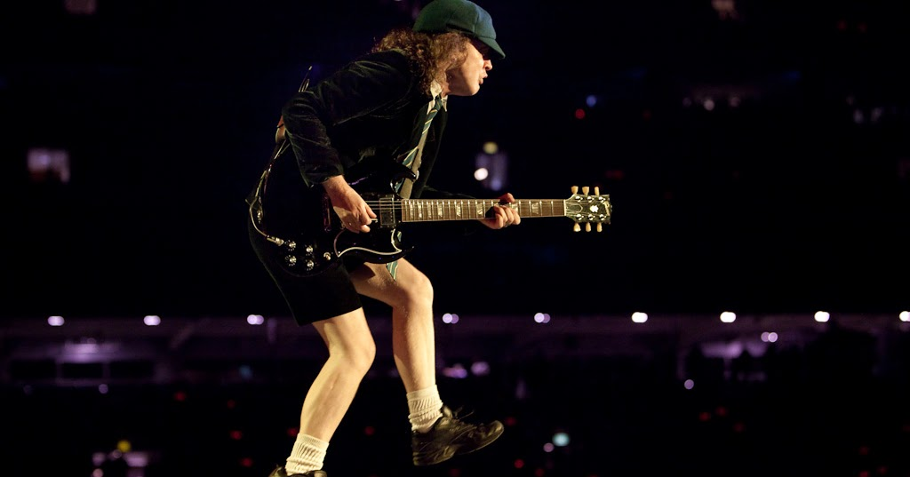
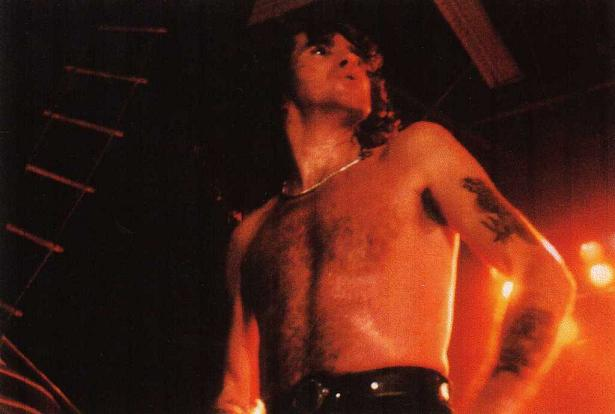
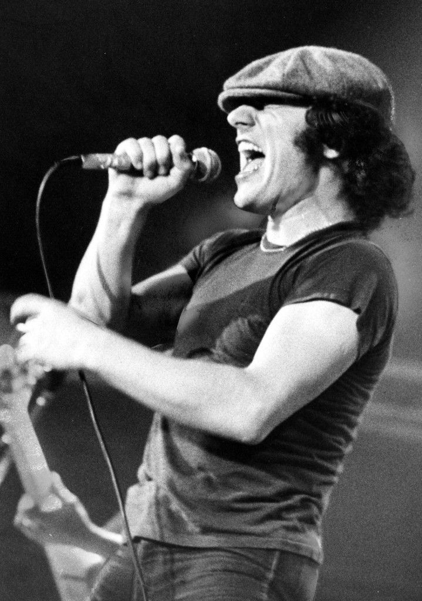
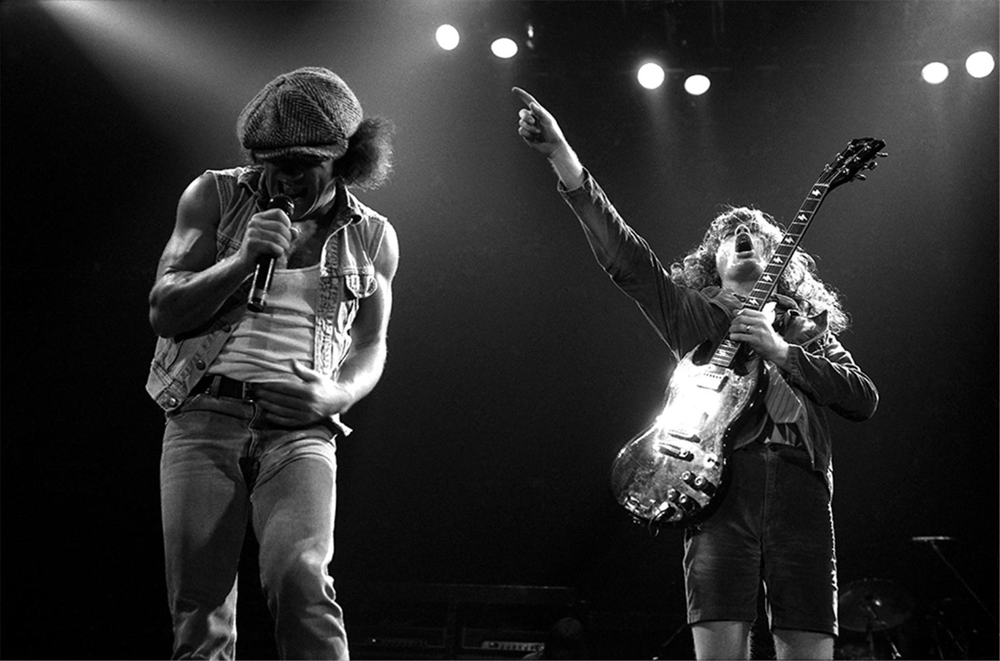
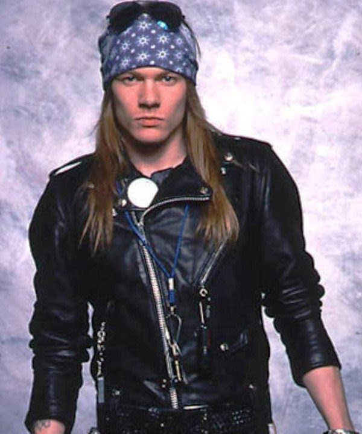

А ведь если бы не морозная зима 1963 года, символами Австралии, пожалуй, считались бы кенгуру и, прости господи, Кайли Миноуг.

Семья Янгов, насчитывавшая аж 15 человек, иммигрировала в Австралию из-за страшных заморозков в Шотландии и обещанной 
Австралией помощи. Не берусь считать, сколько братьев было всего, и какая часть этой оравы занималась музыкой, но AC/DC 
создали двое: ритм-гитарист Малькольм и соло-гитарист Ангус.

Angus Young of AC/DC

Конечно, именно Ангус Янг - первый образ, что всплывает в голове, когда вы слышите словосочетание AC/DC.

Невысокий парень в униформе австралийского школьника, лихо передвигающийся по сцене утиной походкой как <a href="https://en.wikipedia.org/wiki/Chuck_Berry">Чак Берри</a> и выпиливающий бодрые соло на <a href="https://ru.wikipedia.org/wiki/Gibson_SG">Gibson SG</a> с демоническими рожками.

В детстве Ангус бежал домой из школы, хватал гитару и не переодеваясь начинал играть - поэтому ровно в таком виде его и 
наблюдали окружающие - а уже потом школьная униформа стала эпатажным ходом. Название и эмблему с молнией группа 
позаимствовала со штампа на швейной машинке сестры, означавшего Alternate Current/Direct Current - питание переменным 
или постоянным током.

AC/DC добились первых крупных успехов к 1979 году, когда их сингл <i>"It's a long way to the top (if you want rock&roll)"</i> достиг вершин хит-парадов.

В этот долгожданный момент всё могло и закончиться: погиб вокалист группы, Бон Скотт, тоже "бывший шотландец", как и 
Янги. Стиль Скотта скорее выкрикивавшего ноты, чем певшего, стал визитной карточкой австралийской банды.

Bon Scott, AC/DC vocalist (1974-1980)

Братья Янги были шокированы случившимся. И всё же они не захотели останавливаться, ведь самое интересное только 
начиналось. Они стали искать нового вокалиста на замену харизматичному Скотту.

Преемника себе подсказал сам Бон. Именно от него Янги впервые услышали имя малоизвестного Брайана Джонсона. Скотт с 
восторгом рассказывал о том, как однажды услышал Джонсона в клубе в Британии, и как манера Джонсона походила на стиль 
кумира Скотта - <a href="https://www.youtube.com/watch?v=LVIttmFAzek">Литл Ричарда</a>. Янги успели перепобовать 
нескольких кандидатов, когда в студию явился Брайан и спел пару песен...

Brian Johnson, AC/DC vocalist (1980-2016)

Лучшее - враг хорошего. Джонсон действительно был похож на Скотта по стилю.. скажем так, "пения", но ярче и жёстче! Янги
 сразу поняли, что перед ними новый вокалист AC/DC.

Неожиданно для всех в 1980-ом AC/DC вновь ворвались на олимп рок-музыки с альбомом <i>"Back in Black"</i> - игру слов в 
названии можно интерпретировать как "Возвращение в Трауре".

"Back in Black" стал вторым или третьим самым продаваемым альбомом в истории музыкальной индустрии вообще (около 50 млн 
копий), уступив только Майклу Джексону и Квинси Джонсу с их <i>"Thriller"</i> (и, возможно, Pink Floyd с 
<i>"The Dark Side of the Moon"</i>).

AC/DC стали флагманами хард-рока 80-ых, выдав массу бодрых хитов вроде <i>"Thunderstruck"</i> или <i>"Big gun"</i>. В 
1991-ом советские граждане могли лицезреть их вместе с Металликой на памятном многим концерте в Тушино.

AC/DC

(Этот концерт немного отразился даже на жизни четырёхлетнего Бори: в 1992-ом на стене возле лифта в руинах здания,
где распологалась школа искусств им. Балакирева, появлиась накарябанная маркером надпись "Metallica". Мама, конечно, 
объяснила, что её оставили какие-то плохие люди, но слово звучало завораживающе... Хе-хе, зуб даю, что если бы Гайдн 
родился века на 2 позже, у AC/DC был бы клавишник!)

  <iframe width="560" height="315" src="https://www.youtube.com/embed/uT3SBzmDxGk" frameBorder="0" gesture="media" allow="encrypted-media" allowFullScreen></iframe>

XVIII century Thunderstruck by 2Cello

Увы, ничто не вечно: Малькольм Янг начал испытывать проблемы со здоровьем в начале 2010-ых.
До того самый организованный человек в составе AC/DC, он вдруг начал забывать материал и срывать репетиции.
Малькольма в группе стал подменять его 60-летний племянник Стиви Янг.
В конце 2014 было объявлено, что Малькольм уже никогда не вернётся в группу из-за прогрессирующей деменции.

Одновременно с этим группу вынужден был покинуть ударник Фил Радд из-за обвинений в организации убийства и хранении 
наркотиков. В 2016 пришлось уйти в бессрочный отпуск вокалисту Брайану Джонсону, получившему прокол барабанной 
перепонки, а басист Клифф Уильямс просто решил завязать, ведь группа, по сути, лишилась основных участников.

Единственным уцелевшим из классического состава AC/DC остаётся Ангус Янг.
Это не остановливает неуёмного гитариста, который пишет очередной альбом.
Брайана Джонсона с 2016 временно подменяет некто... Аксель Роуз из Guns'n'Roses!
Аксель тоже не молодеет, но, на мой взгляд, справляется просто блестяще.
  

Axl Rose of Guns'n/DC (or AC/Roses?)

Что ж, здоровья фанатичному Ангусу Янгу и ушедшим на покой ветераном.
И спасибо Малькольму Янгу за его необузданное творчество.

  <iframe width="560" height="315" src="https://www.youtube.com/embed/pAgnJDJN4VA" frameBorder="0" gesture="media" allow="encrypted-media" allowFullScreen></iframe>

AC/DC - Back in Black (1980)

