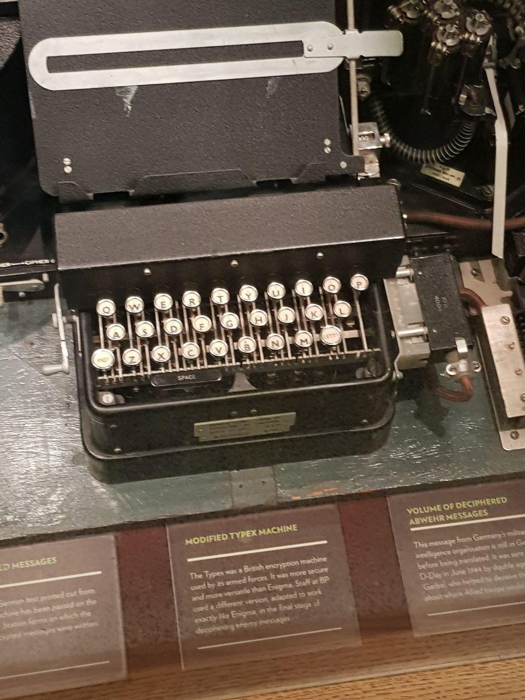

<!-- http://www.telegraph.co.uk/content/dam/obituaries/2016/05/25/53787438__Jane-Fawcett-young-OBITS_trans_NvBQzQNjv4BqhJpcTaDycYqZzDAOAUJ79c9dYnr0ptv4PRBB4Y-i9ow.jpg?imwidth=480 -->

  <h3>Часть 5. "Бисмарк" и "дебютантка"</h3>
  

    Особую гордость Кригсмарине составлял новенький сверхтяжелый линкор "Бисмарк", спущенный на воду перед самой войной.
  

    "Бисмарк" обладал мощнейшими вооружением и броней и мог один на один уничтожить любой корабль его Величества.
  

  
  
German battleship Bismarck (1939)

  

    Когда "Бисмарк" потопил один из лучших кораблей британского флота HMS "Hood"  со всеми его полутора тысячами человек команды, британское правительство решило, что с пропагандистской точки зрения важно побыстрее разделаться с грозным линкором.
  

    Корабль был внесен в список объектов стратегического значения, и слово "Бисмарк" сотрудники Блетчли-парк должны были систематически искать в немецкой военно-морской радиопередаче.
  

    Около 70% штата Блетчли-парк составляли молодые девушки с хорошим образованием. Именно им приходилось выполнять основную часть рутинной работы по дешфировке перехваченных радиопередач.
  

    Поэтому, кстати, GC&CS дали еще шуточное прозвище "boffins and debs" - "ботаны и дебютантки", под "дебютантками" подразумеваются девушки из высших слоев общества, впервые выходящие в свет.
  

    Трудились они в плохо оборудованных душных хижинах за рядами столов с шифровальными машинами "Typex" - британским реверс-инженерным клоном "Энигмы", который позволял расшифровывать немецкие телеграммы и сразу печатать их на бумажной ленте.
  

  
  
Modified "Typex" machine

  

    Это была тяжёлая механическая работа; ее было много, срочность предельная, ответственность колоссальная. Все находились в постоянном напряжении.
  

    Расшифровкой радиоперехвата морских целей занималась хижина 8 (где трудился Алан Тьюринг), воздушных - хижина 6. Хижине 8 никак не удавалось найти упоминания о "Бисмарке".
  

  
  
Bletchley park Hut 8

  

    И вот, в один прекрасный день 19-летняя Джейн Хьюз, дотошная сотрудница хижины 6, обнаруживает, что в ее воздушной (!) радиопередаче попадается заветное название корабля!
  

    Оказалось, что какой-то большой чин из Люфтваффе решил справиться у капитана "Бисмарка" о здоровье своего сына, моряка на "Бисмарке", после боя с HMS "Hood".
  

    Лучше бы не спрашивал. С "Бисмарка" ответили, что в целом все хорошо, но в бою корабль получил повреждения и направляется в оккупированную Францию, в такой-то порт на ремонт.
  

    Британцы немедленно выслали на охоту за ним тучу бомбардировщиков-торпедоносцев и несколько кораблей. Торпедоносцам с большим трудом удалось повредить ходовую часть линкора, и тот оказался обездвижен.
  

    После этого его совместно атаковали несколько английских кораблей и несколько часов утюжили из всех орудий, пока не превратили в груду металлолома. Большая часть команды "Бисмарка" погибла.
  

    Британское правительство впечатлилось эффективностью Блетчли-парка, и стало полагаться на его данные для проведения более крупных операций.
  

    Джейн Хьюз оставила службу в мае 1945-ого года, вышла замуж за офицера королевского флота Теда Фосетта и... стала оперной певицей!
  

    Проведя более 15 лет в опере и исполнив несколько крупных ролей, в 1963-ом Джейн Фосетт стала менеджером Викторианского Общества, занимавшегося охраной памятников истории и культуры.
  

    Отчасти благодаря усилиям "неистовой миссис Фосетт" уцелело чудесное старое здание вокзала Сан-Панкрас, того самого, где повсюду стоят общественные пианино. =)
  

  
  
St. Pancras railway station, London, UK

  

    Но роль Блетчли-парк в обнаружении "Бисмарка" оставалась засекреченной аж до 1990-ых годов.
  

    Только тогда 70-летняя Джейн, не проболтавшаяся до того даже мужу, внезапно оказалась вынуждена вновь и вновь пересказывать эту историю журналистам и историкам (а также ошеломлённым детям и внукам).
  

    Джейн Фосетт умерла в 2015 году в возрасте 95 лет.
  

