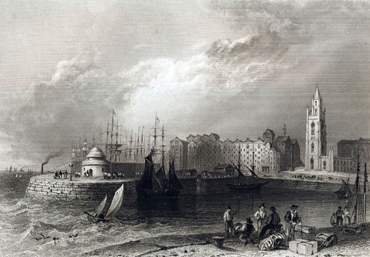
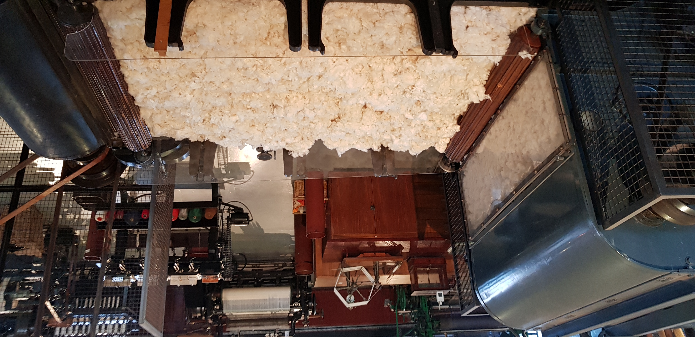
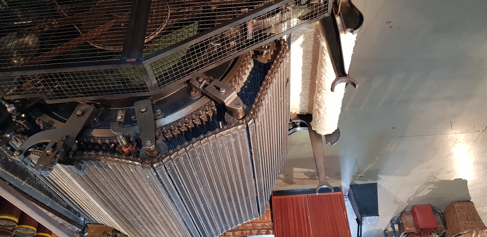
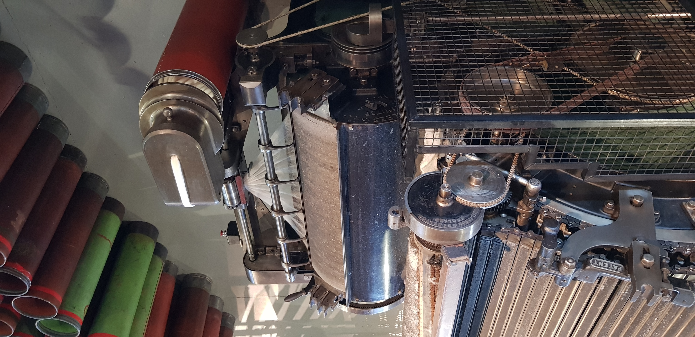
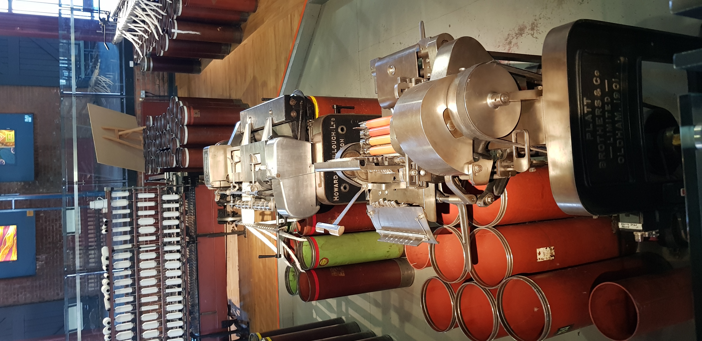
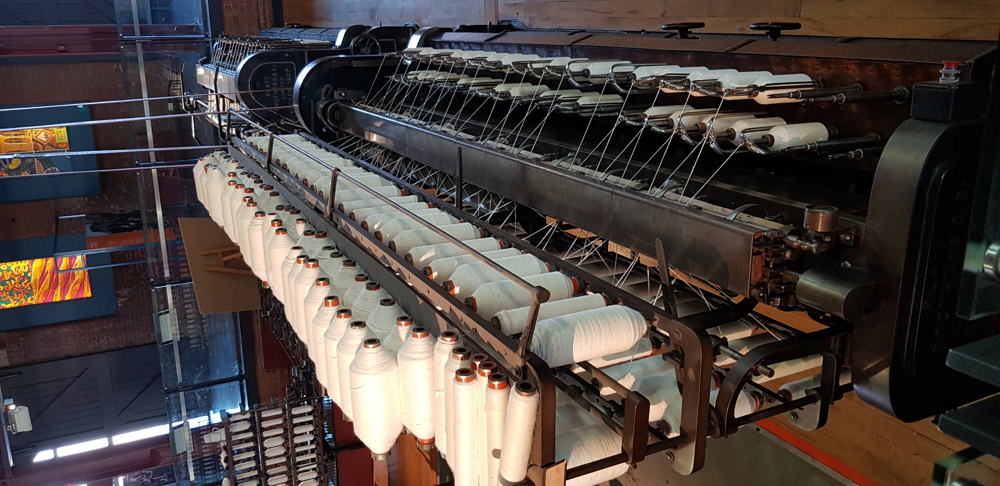

<!-- -->

  <h3>Рейнхильские состязания</h3>
  

    Англия, <a href="https://en.wikipedia.org/wiki/Lancashire">Ланкашир</a>, 20-ые годы XIX века.
  

  

    Бум спроса на сукно в XVII-XVIII веках превратил Англию из феодальной страны в буржуазную
    (см. мой старый пост <a href="/blog/2017-01-05-1">об овцах и стартапщиках</a>). Центром ткацкой
    промышленности оказывается Ланкашир, а его экономической столицей оказвается Манчестер, куда иммигрировали
    фламандские ткачи. Со временем шерсть уступает центральное место льну и, особенно, хлопку.
  

  

    К началу XIX века хлопок в огромных количествах прибывает в порты Ливерпуля из Нового Света и доставляется
    оттуда на конных подводах в Манчестер, где его обрабатывали ткачи, изготавливая ткань. Город даже получил
    прозвище "Cottonopolis", столица хлопка. На дорогу из Ливерпуля в Манчестер уходит 8 часов.
  

  
  
Доки Ливерпуля в начале XIX века

  

    К 1820-ым годам качество металлообработки достигает такого уровня, что несколько конкурирующих инженеров
    начинают производить паровозы, способные заменить конные подводы, движущиеся по рельсам. Инженеров спонсируют
    богатые буржуа.
  

  

    В 1829 году правительство Манчестера устраивает грандиозную гонку между соперничающими производтилеями -
    <a href="https://en.wikipedia.org/wiki/Rainhill_Trials">Рейнхилльские испытания</a>.
    В соревновании 4 участника: главный фаворит - паровоз "Rocket" ("Ракета") знаменитого изобретателя Джорджа
    Стефенсона, его соперники - скоростной "Novelty" ("Новинка") Джона Эрикссона и Джона Брейтвейта, мощный
    "Sans Pareil" ("Бесподобный") Уильяма Хедли и Тимоти Хакворта и... "Cycloped" - лошадь, поставленная на
    пандус, и приводящая его в движение бегом.
  

  
  
Novelty

  
  
Sans Pareil

  
  
Лошадь-2.0

  

    Первой с дистанции сходит лошадь. Бедное животное провалилось под поверхность, на которую оно было
    поставлено.
  

  

    Затем треснул цилиндр у "Sans Pareil". Очень интересно, что цилиндр этот был куплен у фирмы Стефенсона,
    однако (лайфхак!) Хедли и Хакворт закупили их 20 штук и отобрали 2 лучших для паровоза, так то саботаж со
    стороны прямого конкурента в данной ситуации крайне маловероятен.
  

  

    Наконец, "Novelty" не дотянул до финиша из-за взорвавшегося котла. В итоге единственным прибывшим в Манчестер
    оказался "Rocket" Стефенсона.
  

  

    В Манчестере паровозы были встречены... картошкой. Дело в том, что вместе с устройствами в
    город прибыли делегации гостей во главе с премьер-министром Британии, и благодарный народ выразил ему свою
    поддержку при помощи овощей.
  

  

    Не обошлось и без других коллизий - представителю парламента от Манчестера вздумалось прогуляться по
    рельсам перед прибывающей "Ракетой", и в столкновении политики и прогресса вновь победил прогресс -
    парламентарий упал на рельсы, паровоз раздавил ему ногу, и он погиб.
  

  

    "Тендер" выиграл Стефенсон, время путешествия из Ливерпуля в Манчестер сократилось с 8 часов до 2, а вскоре
    было сокращено и до часа. Древнейшая из сохранившихся до наших дней железнодорожных станций, прослужила
    150 лет и превратилась в музей науки и промышленности Манчестера. А в феврале этого года впервые за прошедшие
    180 лет и "Ракета" вернулась в Манчестер.
  

  
  
Железнодорожная станция 1830 года в Манчестере

  

    Мне очень интересно, почему именно Манчестер стал центом ткацкого промысла. Сотрудники музея говорят, это один из
    самых дождливых городов Англии, а дождевая вода использовалась для мытья хлопка. Как уроженец Невинномысска,
    где одним из градообразующих предприятий является шерстомойная фабрика, могу сказать, что водопроводная вода
    Cottonopolis'а ужасно жесткая. Из горных рек вроде Зеленчука, где талая вода ледников не успела растворить
    в себе соли, ты выходишь пушистый как барашек. А из-под душа в Манчестере ты выползаешь весь липкий от
    двух- и трехвалентных катионов. Возможно, Манчестер стал центром ткацкого промысла потому, что прежде туда
    стекалась шерсть с пастбищ Ланкашира, а впоследствии ткачи переориентироавлись на хлопок из портов Ливерпуля.
  

  

    Простите за занудство, но мне еще думается, что с точки зрения экономики не так важно, сколько времени
    занимало путешествие хлопка - 8 часов или 1 - важно, сколько оно стоило и в чем состояло бутылочное горлышко
    пропускной способности всего конвейера - в кораблях, паровозах или станках. Ответа я не знаю, ну да ладно.
  

  <h3>Пара слов о ткацком промысле</h3>
  

    Всегда хотелось понять, как была устроена ткацкая промышленность. Процесс создания тканей мне всегда
    казался сложным и контринтуитивным. В музее науки и промышленности мне удалось полностью рассмотреть весь
    техпроцесс, каким он был в самом начале 20-ого века.
  

  

    Хлопок, снятый с цветов, попадает на веялку, где его отделяют от частичек грязи и плевел.
  

  <!--
  
  
Хлопок

  
  
Веялка

  -->
  

    Специальная распушалка затем расплетает волокна шелка.
  

  <!--
  
  
Распушенный хлопок

  
  
Распушалка

  -->
  

    Отделялка длинных волокон позволяет взять только длинные волокна, пригодные для создания длинных нитей.
  

  <!--
  
  
Волокна

  
  
Отделялка

  -->
  

    Сплеталка длинных волокон сплетает вместе волокна по 6, а затем такие шестерки - еще по 3.
  

  <!--
  
  
Сплетенный волокна

  
  
Сплеталка

  -->
  

    Прялка тянет конечный продует - нить - из полученных на прошлом этапе нитей.
  

  <!--
  
  
Прялка

  -->

