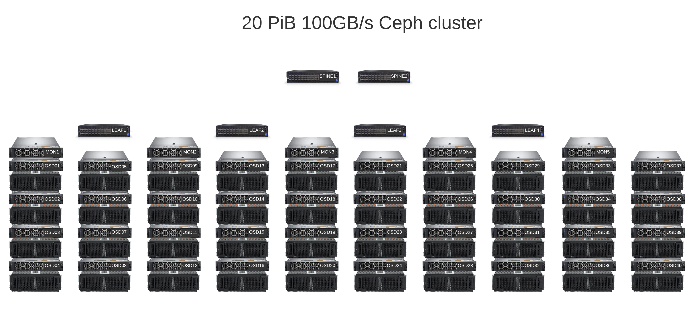
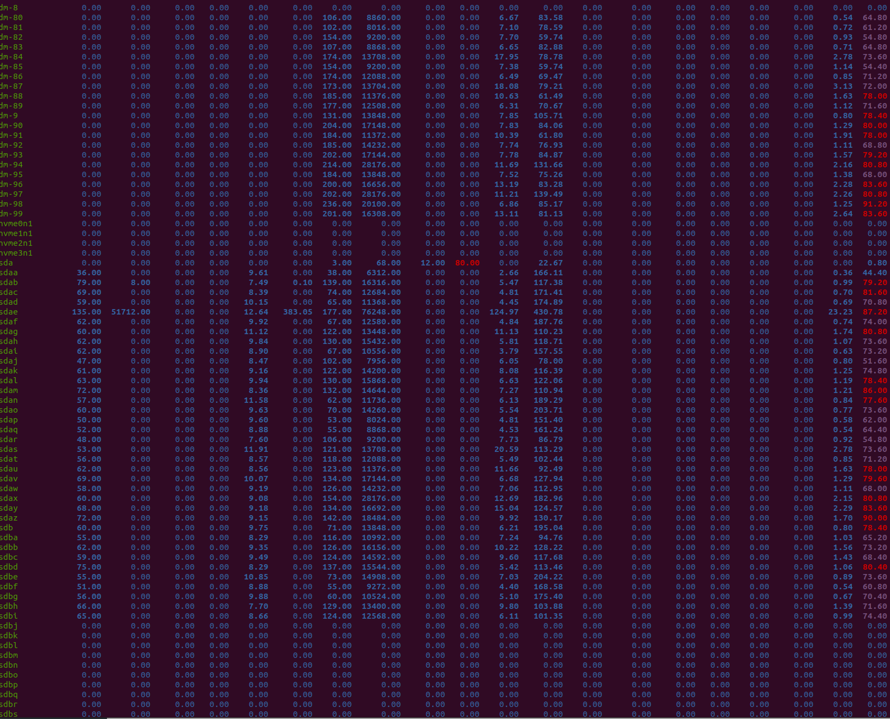
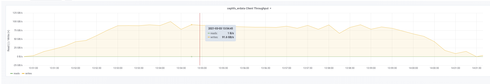

Ceph is among the most popular distributed storage systems for private clouds that seamlessly integrates with 
Kubernetes/OpenShift and OpenStack virtualization systems as a storage backend.

Ceph can be accessed through multiple interfaces, including:
 - object storage interface, called Rados Gateway (RGW), that supports Amazon S3 and OpenStack Swift protocols
 - block storage interface, called Rados Block Device (RBD), that can serve as OpenStack Cinder drop-in replacement or a generic SAN solution
 - filesystem interface, called CephFS, available through native CephFS Linux kernel drivers, NFS, FUSE or Samba gateway

2 primary backends are available in Ceph for providing data redundancy:
 - replication pools (the default option, upon which every piece of data is basically stored in 3 copies, distributed over the cluster for fault tolerance)
 - erasure-code pools (the cost-efficient option which splits each piece of data into k data chunks and m parity chunks, calculated using Reed-Solomon codes, and distributes them over the cluster in a fault-tolerant way)

The hierarchy of possible failure domains is modeled by a CRUSH algorithm.

Here I'll describe the design of an installation that achieves almost 100GB/s throughput and 20PiB storage capacity.


<center><i>A schematic design of Ceph cluster. 10 racks, 40 OSD servers, 5 MON servers, 40 disk enclosures, 4 leaf and 2 spine switches.</i></center>


Technical requirements
----------------------

Technical requirements for the storage system were as follows:
 - <u>filesystem abstraction</u> was highly desirable, so that our storage could be mounted directly from the hosts and accessed as a local filesystem
 - <u>latency</u> was not an issue, so supercomputing solutions like GPFS were not really necessary
 - <u>throughput</u> - around 100 GB/s: we had to build a system able to exchange ~5 Petabytes of data a day, being accessed by hundreds of compute nodes 
 - <u>storage capacity</u> of at least 20PiB was required
 - <u>usable/raw space ratio</u> was important; by no means was this installation cheap, but we didn't want it to get more costly than it had to be
 - <u>Kubernetes</u> integration that allowed to create volumes within our filesystem was a huge perk
 - <u>fault tolerance</u> to a simultaneous crash of several hard drives or several hosts was a must; electrical problems within a rack, or a room were a second-thought 


Hardware
--------
All the servers used in our setup were [Dell R740xd](https://www.dellparts.ru/catalog-dell/dell-emc-poweredge-r740xd-server/) rack server chassis with their nice iDRAC interfaces and convenient Dell OpenManage utility.

We used [Western Digital Ultrastar Data60](https://www.westerndigital.com/products/data-center-platforms/ultrastar-data60-hybrid-platform) enclosures with fast and durable enterprise-class [14 TB Ultrastar DC HC530 drives](https://documents.westerndigital.com/content/dam/doc-library/en_us/assets/public/western-digital/product/data-center-drives/ultrastar-dc-hc500-series/data-sheet-ultrastar-dc-hc530.pdf) as the primary data storage and relatively available mixed-use [Dell 1.6TB NVMe drives](https://i.dell.com/sites/csdocuments/Learn_Docs/en/poweredge_express_flash_nvme_mixed_use_pcie_ssd-intel_p4610_product_family.pdf) as the metadata storage.

As for the network, we went for the expensive [100Gigabit/s 64-port Mellanox SN4600C](https://store.mellanox.com/products/nvidia-msn4600-cs2r-spectrum-3-based-100gbe-2u-open-ethernet-switch-with-onyx-64-qsfp28-ports-2-power-supplies-ac-x86-cpu-standard-depth-c2p-airflow-rail-kit.html) switches with their Spectrum-3 chips and double Mellanox ConnectX-6 100G ethernet/Infiniband network cards in the servers.


Network architecture
--------------------

 - Leaf-spine architecture with L2 connection between leaves and servers and L3 connection between leaves and spines and spines and superspines; eBGP dynamic routing.
 - On each server we assemble an active-active bond of 2 100G network cards with layer 3+4 balancing, resulting in a great 200G bandwidth per server. 
 - both Ceph public and cluster VLANs are directed to the 100G bond despite RedHat recommendations to split them

Eliminating the hardware bottlenecks
------------------------------------

#### CPU
We started with a cluster configuration, running 2 enclosures, attached to a dual-socket server with two 8-core
(16 vcores in hyperthreading mode) Intel Xeon Gold 6244 processors.
So each server was supposed to run 124 OSD daemons (2 * 60 for HDDs and 4 for NVMes).

Experiments showed that even without any load from clients, CPUs were >60% busy on such servers.

Thus, we figured, we need more compute power, and went for the high-end Intel Xeon Gold 6258R. These 28-core monsters
are essentially a rebranding of [Intel Xeon Platinum 8280](https://ark.intel.com/content/www/ru/ru/ark/products/192478/intel-xeon-platinum-8280-processor-38-5m-cache-2-70-ghz.html) 
that was worth \$10k last year. After AMD's breakthrough Intel was forced to offer huge discounts, renaming those processors
into [Intel Xeon Gold 6258R](https://ark.intel.com/content/www/ru/ru/ark/products/199350/intel-xeon-gold-6258r-processor-38-5m-cache-2-70-ghz.html) and selling them for just \$3950 each. They show a great [Passmark score of 63059](https://www.cpubenchmark.net/cpu.php?cpu=Intel+Xeon+Gold+6258R+%40+2.70GHz&id=3860&cpuCount=2),
which is more than enough for running >60 OSD daemons.

#### 250GB/s HDD linear read/write
Enterprise WD hard drives run at 7200 rounds per minute and support linear write and read speeds of up to 250MB/s. This
is a great result, which limits the throughput of an enclosure by <u>15GB/s</u>.

#### PCIe 3.0 x8
Another possible bottleneck of the system was the PCI-express bus. Each HBA adaptor is connected to a PCIe 3.0 x8 port,
which [supports a bandwidth of 7880 MB/s](https://www.gamersnexus.net/guides/2488-pci-e-3-x8-vs-x16-performance-impact-on-gpus).
Thus 2 HBA cards can transfer just about 15 GB data a second. 

#### mini-SAS and multipath
Every server was connected to disk enclosure via two mini-SAS cables. The throughput of a single vein of a mini-SAS cable
is 12gigabit/s, one cable has 4 veins, so the total throughput of a single cable is 48gigabit/s or 6 Gigabyte/s.

We used 2 HBA adaptors per disk enclosure and 2 cables, so each drive is seen via 2 paths and total throughput of SAS
cables equals 12 GB, which is slightly less than total throughput of the drives and PCI-express, but aligns well with
ethernet speed

#### 100Gb/s ethernet
Each server has double 100-gigabit ethernet cards, including capacity of running about 12 Gigabytes of traffic via both
public and cluster networks.

#### Average seek time of ~4ms per disk head
But the true bottleneck we ran into was none of the aforementioned. 

Ceph isn't really doing long sequential writes. Instead, it splits the data into objects (default size of each is 4MB),
splits those objects into chunks and saves each chunk on a separate OSD.

So a typical case for our setup with Reed-Solomon codes 10+4 (10 chunks of data, 4 parity chunks) was that each piece
of data written had a length of 400KB, so that HDD head was capable of writing 250 * 400KB/s = 100MB/s instead of the
real 250MB/s, achieved with linear writes.



<center><i>The output of `iostat -xk`: the rightmost column shows the total utilization of hard drives, which is close to 100%</i></center>

<br />

Thus we had to tweak the object size to 16MB to attain a slight throughput boost of ~1.5 times:


<center><i>Up to 100GB/s</i></center>

Fine-tuning the network stack
-----------------------------
#### Jumbo frames:
The MTU was set to 9000 on servers as recommended by RedHat and to a maximum of 9144 as recommended by Mellanox.

On MON hosts we have only the public network set: 

```
# /etc/netplan/01-netcfg.yaml on MON nodes:

# This file describes the network interfaces available on your system
# For more information, see netplan(5).
network:
  version: 2
  renderer: networkd
  ethernets:
    eno1:
      dhcp4: false
      dhcp6: false
      addresses: [ 10.101.77.41/22 ]
      routes:
      - to: 10.100.148.0/22
        via: 10.101.79.254
    ens1:
      match:
        macaddress: b8:59:9f:d9:c4:e4
      set-name: ens1
    ens8:
      match:
        macaddress: b8:59:9f:d9:c6:30
      set-name: ens8
  bonds:
    bond1:
      mtu: 9000
      dhcp4: false
      dhcp6: false
      interfaces: [ ens1, ens8 ]
      addresses: [ 10.101.69.41/22]
      nameservers:
        addresses: [10.100.143.21, 10.100.143.22]
      gateway4: 10.101.71.254
      parameters:
        mode: 802.3ad
        lacp-rate: fast
        mii-monitor-interval: 100
        transmit-hash-policy: layer3+4
```

On OSD hosts we also have a separate VLAN for the backend cluster network:

```
# /etc/netplan/01-netcfg.yaml on OSD nodes:

# This file describes the network interfaces available on your system
# For more information, see netplan(5).
network:
  version: 2
  renderer: networkd
  ethernets:
    eno1:
      dhcp4: false
      dhcp6: false
      addresses: [ 10.101.77.1/22 ]
      routes:
      - to: 10.100.148.0/22
        via: 10.101.79.254
    ens1:
      match:
        macaddress: b8:59:9f:d9:c6:18
      set-name: ens1
    ens8:
      match:
        macaddress: b8:59:9f:d9:c6:1c
      set-name: ens8
  bonds:
    bond1:
      mtu: 9000
      dhcp4: false
      dhcp6: false
      interfaces: [ ens1, ens8 ]
      addresses: [ 10.101.69.1/22]
      nameservers:
        addresses: [10.100.143.21, 10.100.143.22]
      gateway4: 10.101.71.254
      parameters:
        mode: 802.3ad
        lacp-rate: fast
        mii-monitor-interval: 100
        transmit-hash-policy: layer3+4
  vlans:
    bond1.2072:
      mtu: 9000
      id: 2072
      link: bond1
      addresses: [ 10.101.73.1/22 ]
```


#### NUMA for TCP/IP and irqbalance off

Ubuntu 20.04 by default tries to balance out interrupt request lines between processor cores.

This behaviour is undesirable with dual Mellanox network cards, as we want TCP/IP sockets to be attached to the
CPU cores on the same socket as the PCIe x16 line, to which the Mellanox network card is attached. Otherwise your
network traffic will start travelling all the way through the Quickpath Interconnect (QPI) bus between the processor
sockets, which has a throughput of ~65GB/s.

So, in systemd configuration we `systemctl disable irqbalance` and enable a custom Mellanox script, which assigns
IRQ lines to CPU cores: `systemctl enable set_irq_affinity_bynode`.


#### TCP/IP tuning: rmem/wmem socket buffers and nf_conntrack
Don't forget to increase the maximum size of TCP socket buffers to at least 2-4 MB.

Also set nf_conntrack_max size to at least several million, otherwise, it will overflow quickly and one day
the hosts in your cluster will start losing connectivity.

```
# /etc/sysctl.conf
kernel.pid_max = 4194303
kernel.threads-max=2097152
vm.max_map_count=524288

vm.min_free_kbytes=2097152
vm.vfs_cache_pressure=10
vm.zone_reclaim_mode=0
vm.dirty_ratio=80
vm.dirty_background_ratio=3

net.ipv4.tcp_timestamps=0
net.ipv4.tcp_sack=1
net.core.netdev_max_backlog=250000
net.ipv4.tcp_max_syn_backlog=100000
net.ipv4.tcp_max_tw_buckets=2000000
net.ipv4.tcp_tw_reuse=1
net.core.rmem_max=4194304
net.core.wmem_max=4194304
net.core.rmem_default=4194304
net.core.wmem_default=4194304
net.core.optmem_max=4194304
net.ipv4.tcp_rmem=4096 87380 4194304
net.ipv4.tcp_wmem=4096 65536 4194304
net.ipv4.tcp_low_latency=1
net.ipv4.tcp_adv_win_scale=1
net.ipv4.tcp_slow_start_after_idle=0
net.ipv4.tcp_no_metrics_save=1
net.ipv4.tcp_syncookies=0
net.core.somaxconn=5000
net.ipv4.tcp_ecn=0
net.ipv4.conf.all.send_redirects=0
net.ipv4.conf.all.accept_source_route=0
net.ipv4.icmp_echo_ignore_broadcasts=1
net.ipv4.tcp_no_metrics_save=1
net.ipv4.tcp_slow_start_after_idle=0
net.ipv4.tcp_fin_timeout=10

net.netfilter.nf_conntrack_max=1524288
net.nf_conntrack_max=1524288
```

#### RX/TX buffers

Don't forget to make sure that layer-2 RX/TX buffers are at least 8192 on your server, otherwise your network card won't
be able to perform at its best.


Fine-tuning the OS config
-------------------------
#### Active/active multipath

By default multipath failback mode on disk enclosures is manual, not immediate. So, we had to turn it on.

Also, `path_selector` should be set to `"service-time 0"` on Ubuntu 20.04 to enable active-active mode, otherwise 
multipath is in active-enabled mode, which limits the enclosure throughput to 6 GB/s instead of the full 12GB/s.

```
# /etc/multipath.conf

defaults {
        user_friendly_names yes
        path_grouping_policy "group_by_prio"
        path_selector "service-time 0"
        failback immediate
        path_checker tur
        no_path_retry 5
        retain_attached_hw_handler "yes"
        rr_weight uniform
        fast_io_fail_tmo 5
        rr_min_io 1000
        rr_min_io_rq 1
}

blacklist {
        devnode "^nvme.*"
        devnode "scini*"
        devnode "^rbd[0-9]*"
        devnode "^nbd[0-9]*"
}

```

#### LVM filters

LVM filters should be set in order to ensure that LVM runs only on top of multipath devices. 
You don't want your server to start LVM devices on top of a disk seen on top of just a single path, e.g. `/dev/sdaa`,
instead of a multipath device, e.g. `/dev/mapper/mpathaa`.

```
# /etc/lvm/lvm.conf

devices {
        ...
        filter = [ "a|/dev/sd.*[1-9]$|", "a|/dev/mapper/mpath*|", "a|/dev/nvme[0-9]n*|", "r|.*|" ]
        ...
}
```

#### swapfile
Swapfile size shall be increased if possible, as we don't want Out-of-memory (OOM) errors to start killing our processes
randomly. We increased it to 200GB instead of the default 2GB.

#### crontab with alerting scripts
We add a few scripts to the `/etc/ceph/scripts` folder and schedule them with crontab (it is configured with ansible),
so that they detect and report network storms or ping loss between hosts in Slack, and, optionally, set `noout`, 
`nobackfill`, `norecover` and other similar flags.  

`crontab -e`
```
#Ansible: osd-storm-prevention
* * * * * /etc/ceph/scripts/osd-storm-prevention.sh > /dev/null 2>&1
#Ansible: ceph-full
* * * * * /etc/ceph/scripts/ceph-full.sh > /dev/null 2>&1
#Ansible: oping-ceph-hosts
* * * * * /usr/bin/python3 /etc/ceph/scripts/oping-ceph-hosts.py > /dev/null 2>&1
```

#### Ubuntu 20.04
We used Ubuntu 20.04 as the operating system on our hosts, as IBM just announced
that it would discontinue CentOS after version 8.

There's a difference in the initial LVM recognition process between Ubuntu and CentOS,
so it makes servicing the cluster slightly more different, but that's fine.

Fine-tuning Ceph
----------------
#### Octopus
As our project is supposed to last for a few more years we went for a newer, riskier Ceph 15,
which is deemed stable for 1 year. 

We had terrible stability issues with it, when we tried it in May 2020, but apparently, most of the bugs
have been fixed since.

We noticed that the dashboard has become a bit more powerful since Ceph 14 (Nautilus) and now allows to create pools right from the GUI.


#### disable multiple active MDS
In Ceph Octopus you can run multiple active metadata servers for your file system. 

Unfortunately, we ran into bugs with this setup, when `rsync` to/from Ceph with multiple
MDS gets stuck for no apparent reason. So we kept a single active MDS and every other in standby.

#### erasure coding

We used [Facebook-esque](https://arxiv.org/pdf/1709.05365.pdf) 10+4 erasure code data pool with host failure domain.
Having 4 servers per rack this allows us to survive a rack crash. 

Initially we wanted to go with 7+3 and rack crush domain, but this was not possible
due to 1 stale OSD appearing in that setup.

If we assume for a second that HDD failures were independent, then probability of
a failure of X drives at the same time corresponds to Poisson distribution:

 * Probability of a single hard drive failure p(failure of 1 HDD) = $10^{-5}$
 * Number of HDDs we have $N = 2400$
 * Parameter Lambda of Poisson distribution $\lambda = N \cdot p = 0.024$
 * p(failure of k HDDs) $= \frac{\lambda^k\cdot{e^{-\lambda}}}{k!}$
 * p(k=1) $= 0.023$ - one drive a day fails once in 40-45 days
 * p(k=2) $= 0.0002$ - two drives a day fail once in 5-10 years
 * p(k=3) $\to 0$

As for the metadata, we went for a replicated pool with 5x redundancy.

#### OSD memory target
OSD memory target was left 4MB

#### scrubbing schedule
Scrubbing schedule was left to its default value.

---

I'd like to thank my colleagues, brilliant cloud engineers Konstantin Yuriev and Alexander Rudenko, for their huge 
contributions to this project. Alexander Rudenko might be the most experienced Ceph engineer in Russia, while Konstantin
Yuriev is an uncommon combination of a hands-on engineer and a scholar, willing to sift through piles of technical 
literature.

---

References
----------
 * https://tracker.ceph.com/issues/48784
 * https://docs.ceph.com/en/latest/cephfs/file-layouts/
 * https://gitlab.unimelb.edu.au/resplat-public/devops/-/wikis/HPC-IO500-2019-07-08
 * http://193.62.125.70/CIUK2017/AlastairDewhurst_STFC.pdf
 * https://iopscience.iop.org/article/10.1088/1742-6596/898/6/062051/pdf
 * https://labs.seagate.com/wp-content/uploads/sites/7/2019/11/TP713-2-1911US_SUSE-SES-Seagate-Ceph-Reference-Architecture-digital.pdf
 * https://indico.cern.ch/event/505613/contributions/2230911/attachments/1345227/2039428/Oral-v5-162.pdf