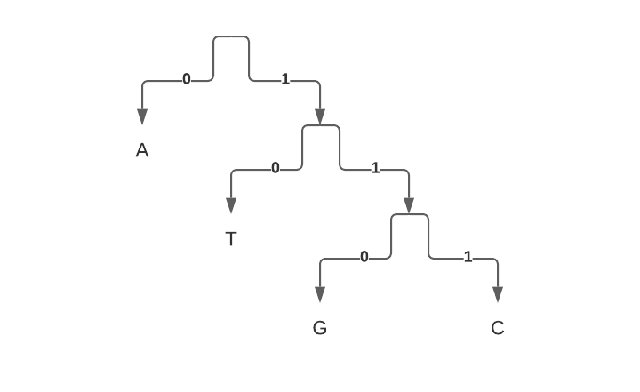
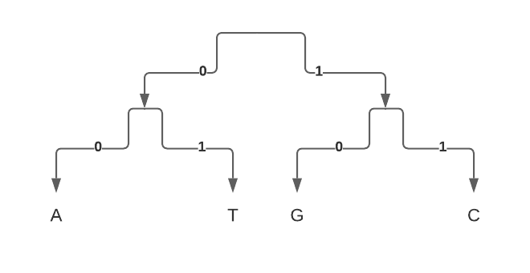

Suppose that we have a network connection with a limited bandwidth, and we want to be able to pass as much text through that channel, as we can.

In order to do that we need to come up with some clever way of binary encoding of our messages, so that it minimizes the average length of any message we have. 

The intuition is that we'll get the most compact encoding, if the most common letters are encoded with the shortest binary codes.

For instance, consider that we have the following alphabet with almost equally distributed probability mass functions of each character:

|  A  |  T  |  G  |  C  |
| --- | --- | --- | --- |
| 0.25| 0.25| 0.25| 0.25|

Suppose that I'm following a greedy algorithm to construct an entropy encoding instead of following a proper Huffman algorithm.

Here is an example that demonstrates that this approach is suboptimal:

Encoding of the characters in such an alphabet are as follows:

|  A  |  T  |  G  |  C  |
| --- | --- | --- | --- |
| 0   | 10  |  110|  111|

Average length of a symbol would be (9 bits / 4) = 2.25 bits.

Now, the optimal Huffman encoding, constructed bottom-up, would result in a more balanced tree with a shorter encoding: 

|  A  |  T  |  G  |  C  |
| --- | --- | --- | --- |
| 00  | 01  | 10  | 11  |

Average length of a symbol would be (8 bits / 4) = 2 bits.