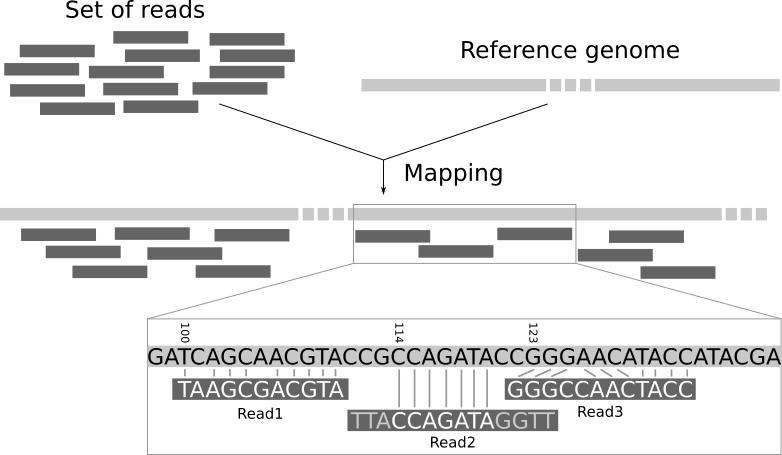

Domain problem statement
------------------------

In Next-Generation Sequencing bioinformatics there is a common problem: due to the specifics of the sequencing technologies,
a complete sequenced genome of a person is typically obtained in a following multi-step protocol:

 * genome of a single person ($3*10^9$ letters) is amplified to 30-100 copies
 * each of those copies is randomly cut into so called reads - fragments of ~150-300 letters long each
 * as a result several hundred million - a few billion reads are sequenced 

Now that those reads are sequenced and available, there is a problem to reconstruct the complete genome from them.

The mainstream approach is to map them back onto the reference genome (most human differ from each other only in 1 letter
out of every 1000, so it is expected that there will be only rare differences between the reads and the reference).

So basically this is a problem of finding a substring within a string as fast as possible. 

As a first efficient solution, one could construct a [suffix tree](https://en.wikipedia.org/wiki/Suffix_tree) of the reference genome and then perform substring search on it
for each read. This approach would work quite well, but there are several optimization steps that could slightly improve
this approach. I describe them further. The final result of those gradual improvements would be what industry-standard
solutions like Bowtie or BWA-MEM implement, see e.g. [BWA-MEM by Heng Li and Richard Durbin](https://www.ncbi.nlm.nih.gov/pmc/articles/PMC2705234/).

Suffix tree
-----------

### Basics
TODO

### Ukkonen
TODO

Suffix array
------------
TODO: Why suffix arrays are more space-efficient than suffix trees?

While construction of [Suffix Arrays](https://en.wikipedia.org/wiki/Suffix_array) (often abbreviated SA) in average case
takes as much time as construction of suffix trees, they are said to be more space-efficient.

FM-index and BWT
----------------
In 2000 Ferragina and Manzini suggested a compressed data structure called 
[FM-index](https://en.wikipedia.org/wiki/FM-index) that takes about 4 times less RAM in case of a human genome
than a Suffix Array, but still allows for the operations of possibly fuzzy substring search ("locate") and calculation of number 
of substring occurrences ("count").

FM is supposed to stand for "Full-text index in Minute space", but the abbreviation also
suspiciously corresponds to the first letters of its author's last names.

FM-index is closely related to Burrows-Wheeler Transform, hence the name.

[Here is a nice relatively fresh paper](https://academic.oup.com/bioinformatics/article/34/3/416/4160683) on how to improve the
speed of substring search via FM-index even more.

### BWT

BWT is a transformation of the input string that offers a reasonable tradeoff between 2 desirable properties: 
compressibility and reversibility of the input string. Compressibility means that the BW-transformed string contains
more repeats and compacts better than the input string. 

Lexicographic sorting would attain much better compressibility of the input string, but the problem is that it is not inversible. One could not reconstruct the input string from the
lexicographically sorted string.

#### Compressibility

BWT result in a string that offers higher compressibility than the input due to the fact that approaches like 
[move-to-front-transform](https://en.wikipedia.org/wiki/Move-to-front_transform), [run-length encoding](https://en.wikipedia.org/wiki/Run-length_encoding)
or [Lempel-Ziv (LZ77 / LZ78) algorithms](https://en.wikipedia.org/wiki/LZ77_and_LZ78#LZ77) like the repeating stretches of characters and work better with those.

#### Reversibility / bijectiveness

The most interesting property of BWT is that it is bijective/reversible. Why would you be able to reconstruct the original string from its BWT?
From [wikipedia](https://en.wikipedia.org/wiki/Burrows%E2%80%93Wheeler_transform):

> The inverse can be understood this way. Take the final table in the BWT algorithm, and erase all but the last column. Given only this information, you can easily reconstruct the first column. The last column tells you all the characters in the text, so just sort these characters alphabetically to get the first column. Then, the last and first columns (of each row) together give you all pairs of successive characters in the document, where pairs are taken cyclically so that the last and first character form a pair. Sorting the list of pairs gives the first and second columns. Continuing in this manner, you can reconstruct the entire list. Then, the row with the "end of file" character at the end is the original text.

#### How computationally effective is it?

Naive BWT requires $O(N^2 \log N)$ operations ($N \log N$ comparisons of strings of length N), but in practice
a suffix array can be used to construct BWT in O(N). 

[Suffix array](https://en.wikipedia.org/wiki/Suffix_array), in turn, can be constructed in no more than O(N) operations, because it can be
obtained from [suffix tree](https://en.wikipedia.org/wiki/Suffix_tree), which is constructed in O(N) operations via Ukkonen algorithm. Suffix array
is more memory-efficient than a suffix tree and the actual algorithm of its construction is even
faster than that of a suffix tree (with [LCP array](https://en.wikipedia.org/wiki/LCP_array) and/or other additional data structures suffix array is just better
than a suffix tree).

#### Why does it work for NGS bioinformatics?

