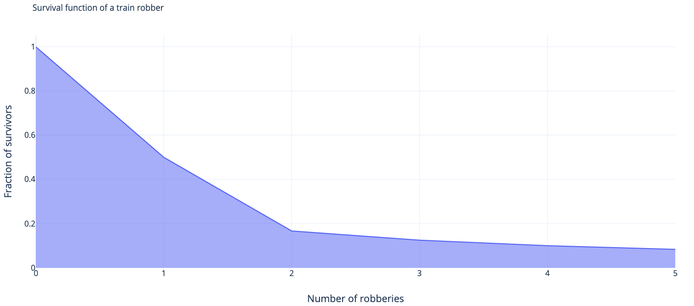

Hazard rate and survival function
---------------------------------

> "Death of a person is a tragedy, deaths of millions is statistics"
>                                                      - Joseph Stalin

[Hazard rate](https://en.wikipedia.org/wiki/Survival_analysis) is just a renormalization of the probability space that takes pallid impersonal statistics on input and converts it into your own chances to live another day.

Suppose you're an average young man in the Wild West. You decide to pursue a questionable career of a train robber.

Assume that the chance of an average guy surviving his first train robbery is $\frac{1}{2}$. After that you get slightly more experienced and for your second train robbery your chance of survival is $\frac{2}{3}$. Now, you're even more experienced and for the third stint the chance of survival is $\frac{3}{4}$. 

So the night before your third robbery you might ask yourself, whether it is worth the risk of dying with 25% chance tomorrow, or should you rather give up on train robberies altogether and move on to start a career in finance? 

The data you want to ask yourself this question is the chance of survival tomorrow, which is the Hazard rate.

Unfortunately, it's impossible to get the data about your odds in the real life. What you could do instead is take a look at the cumulative distribution function $F(t)$ of a train robber's life expectancy, or, rather its counterpart $S(t) = 1-F(t)$, called the survival function:

[Probability mass function](https://en.wikipedia.org/wiki/Probability_mass_function) (which is a discrete-case analogue of the continuous [probability density function](https://en.wikipedia.org/wiki/Probability_density_function)) of dying at your third robbery $p(\xi = 3) = \frac{1}{8}$ . We can more or less reformulate this as a continuous problem $p(3 \leq \xi < 4) = F_\xi(3) - F_\xi(4) = f_\xi(3)dx$, where $\xi$ is a random variable indicating the number of robberies an average train robber survives, $dx=1$, $F_\xi(x)$ is [cumulative distribution function](https://en.wikipedia.org/wiki/Cumulative_distribution_function) and $f_\xi(x)$ is probability density function.

So you see, probability density function/probability mass function answers a wrong question. It says that out of all repeat train robbers the fraction that dies at their third robbery is ($\frac{1}{8}$). But the question you want to ask is: if I go for my third robbery tomorrow, what are my chances to survive it, and the answer you want is $(\frac{3}{4})$.

Now, let's start formalizing this. For a discrete-time variable, Hazard function is your chance to die during your next robbery number $t$:

$\underbrace{S(t) - S(t+1)}_\text{fraction of train robbers who die at t} = \underbrace{\lambda(t)}_\text{hazard function at t} \cdot \underbrace{S(t)}_\text{fraction of survivors by t}$

Thus, hazard function is defined as:

$\lambda(t) = \frac{-\delta S(t)}{S(t)}$

Or, in continuous-time case:

$\lambda(t) = \frac{-\partial S(t)}{\partial t \cdot S(t)} = \frac{f(t)}{S(t)}$

Cumulative hazard rate
----------------------

*Cumulative hazard rate* $\Lambda(t)$ is a funny thing. It essentially enumerates and sums up all the chances of death you escaped by the current moment. So, for instance, at your first train robbery you had a chance to die of $1/2$, at the second - $1/3$, at the third - $1/4$. 

So by the time you start contemplating your fourth robbery, the "number of deaths" you deserved by now $\Lambda(t) = 1/2 + 1/3 + 1/4 = 1.083333$, so in a fair world you would have already been more than dead, exercising your luck so readily...

Speaking formally, $\Lambda(t) = \int \limits_{0}^{t} \lambda(u) du$. Aa a [corollary](https://data.princeton.edu/pop509/ParametricSurvival.pdf) from this definition: 

$ \Lambda(t) = \int \limits_{0}^{t} -\frac{S'(u)}{S(u)} du = \int \limits_{0}^{t} -\frac{1}{S(u)} dS(u) = -\ln S(t) $ , hence, $S(t) = e^{-\Lambda(t)}$.

Cox proportional hazards model and hazard ratio
-----------------------------------------------

Sir David Cox has come up with a linear regression-ish model for factors, influencing the hazard ration:

$$ \lambda(t|X_i) = \lambda(t) e^{\beta_1 x_1 + \beta_2 x_2 + ... + \beta_n x_n} $$

For [Cox proportional hazards models](https://en.wikipedia.org/wiki/Proportional_hazards_model) you'd often consider log 
hazard rate instead of the hazard rate itself.

[Hazard ratio](https://en.wikipedia.org/wiki/Hazard_ratio) reflects the difference in hazards rates for models with 
different values of factors. For instance for patients 1 and 2 with different values of some factor:

$$ \lambda_1(t) = \lambda_0(t) e^{\sum \limits_{i=1}^{n}\beta_i x_i} $$

$$ \lambda_2(t) = \lambda_0(t) e^{\sum \limits_{i=1}^{n}\beta_i x_i'} $$

Then the hazard ratio [equals](http://www.sthda.com/english/wiki/cox-proportional-hazards-model):

$$ \frac{\lambda_1(t)}{\lambda_2(t)} = \frac{\lambda_0(t) e^{\sum \limits_{i=1}^{n}\beta_i x_i}}{\lambda_0(t) e^{\sum \limits_{i=1}^{n}\beta_i x_i'}} = \frac{e^{\sum \limits_{i=1}^{n}\beta_i x_i}}{e^{\sum \limits_{i=1}^{n}\beta_i x_i'}} $$

I can't say much on this subject as I haven't used these models yet.
