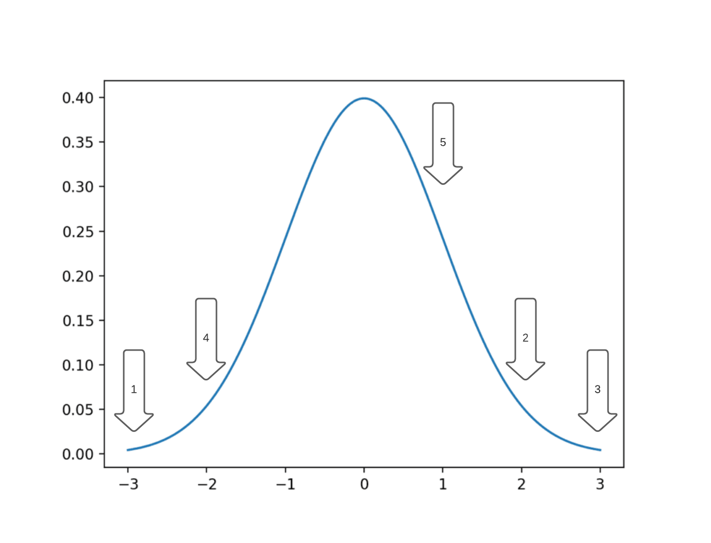
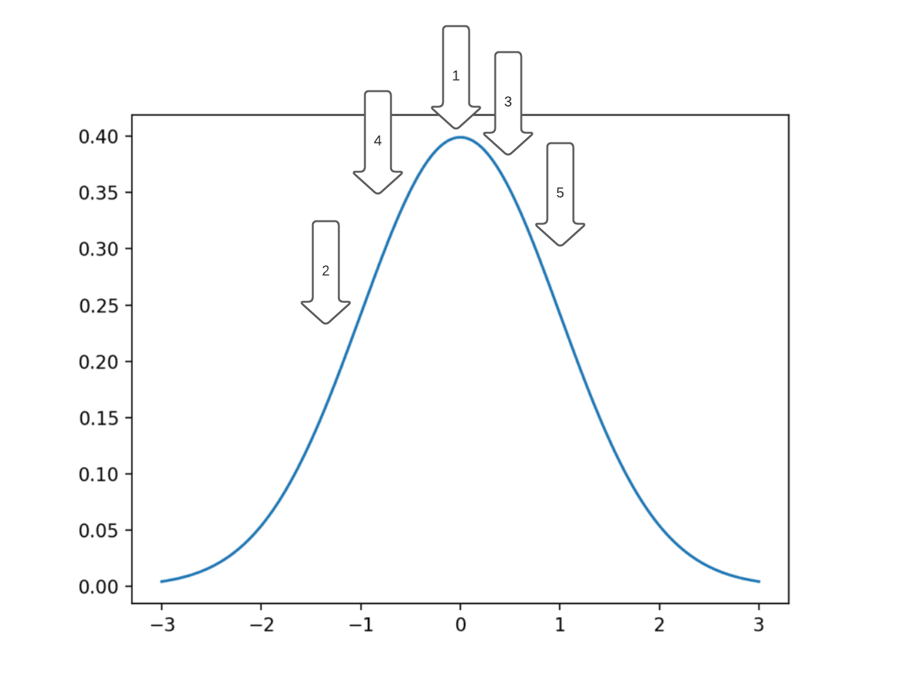

In [one of my previous posts](/2021-06-09-1) I derived the chi-square distribution for sum of squares of Gaussian random 
variables and showed that it is a special case of Gamma distribution and very similar to Erlang distribution. You can 
look them up for reference.

A motivational example
----------------------

Suppose you've taken 5 samples of a random variable that you assumed to be [standard normal Gaussian](https://en.wikipedia.org/wiki/Normal_distribution) and received 
suspicious results: you have a feeling that your dots have landed too far away from the peak of distribution.  

Given the [probability density function](https://en.wikipedia.org/wiki/Probability_density_function) (abbreviated *pdf*) of a gaussian distribution and knowledge that standard deviation is 1,
you would expect a much more close distribution of your samples, something like this:

You could ask yourself a question: what is the average value of probability density function that I would observe, 
when sampling a point from standard normal? 

Well, you can actually calculate it, following the expectation formula: $\frac{1}{\sqrt{2\pi}} \int \limits_{-\infty}^{+\infty} \underbrace{ e^{-\frac{x^2}{2}} }_\text{This is the variable you're averaging} \cdot \underbrace{ e^{-\frac{x^2}{2}}}_\text{This is pdf over which you're averaging} \cdot dx = \frac{1}{\sqrt{2\pi}} \int \limits_{-\infty}^{+\infty} e^{-x^2} dx$.

Now, substitute $t = \sqrt{2}x$: $\frac{1}{\sqrt{2\pi}} \int \limits_{-\infty}^{+\infty} e^{-x^2} dx = \frac{1}{\sqrt{2\pi}} \int \limits_{-\infty}^{+\infty} e^{-\frac{t^2}{2}} d(\frac{t}{\sqrt2}) = \frac{1}{\sqrt{2} \cdot \sqrt{2\pi} } \int \limits_{-\infty}^{+\infty} e^{-\frac{t^2}{2}} dt = \frac{\cancel{\sqrt{2\pi}}}{\sqrt{2}\cdot\cancel{\sqrt{2\pi}}} = \frac{1}{\sqrt{2}}$.

So, probability density function of an average point, you sample, is expected to be $\frac{1}{\sqrt{2}} = 0.707106$. 

Let us calculate pdf for several points: 

if x=0 (which is the most probable point), your $f_\xi(0)=e^{-0/2} = 1$, a bit more probable than average.

if x=1 (which is the standard deviation), your $f_\xi(1)=e^{-1/2} = 0.60653$, a bit less probable than average.

if x=2 (which is 2 standard deviations), your $f_\xi(2)=e^{-4/2} = 0.13533$, not much.

if x=3 (which is 3 standard deviations), your $f_\xi(3)=e^{-9/2} = 0.01111$, very small.

With these numbers let's return to the 5 points I've observed. Out of those five point two points are at 3 standard 
deviations, two points are at 2 standard deviations and one point is at 1 standard deviation. So the probability density
function of such an observation is $f^2_\xi(3) \cdot f^2_\xi(2) \cdot f_\xi(1) = 0.01111^2 \cdot 0.13533^2 \cdot 0.60653 = 1.37 \cdot 10^{-6}$.

At the same time the expected pdf of five average point to be observed is $0.70711^5 = 0.17678$. Seems like my observation was a really improbable one, it is less probable than average by over 100 000 times.

Intuition behind Pearson's chi-square test
------------------------------------------

We need a more rigorous tool than just comparison of the probability of our observed five points with the average.

Let us call our vector of observations $X = (x_1, x_2, x_3, x_4, x_5)^T$. The combined pdf to observe exactly our 5 points is a 5-dimensional multidimensional standard normal distribution $\frac{1}{\sqrt{2\pi}^5} e^{-\frac{x_1^2 + x_2^2 + x_3^2 + x_4^2 + x_5^2}{2}}$.

But note that we don't want **exactly** our point. Any "equiprobable" point will do. For instance, $e^{-\frac{1+1+1+1+1}{2}} = e^{-\frac{0+2+1+1+1}{2}}$, the 5-dimensional points $(1,1,1,1,1)^T$ and $(0,\sqrt{2},1,1,1)^T$ are "equiprobable", and we want to group them into one. 

So, we are actually interested in the distribution of the sum $x_1^2+x_2^2+x_3^2+x_4^2+x_5^2$ as for identical values of the sum the pdfs of likelihood of a vector of observations $X = (x_1, x_2, x_3, x_4, x_5)^T$ are identical.

Each $x_i \sim \mathcal{N}(0, 1)$ is a standard Gaussian-distributed random variable, so the sum in question is a random variable distributed as Chi-square: $\sum \limits_{i}^{N} x_i^2 \sim \chi^2_N$. Please, refer to [my older post on Gamma/Erlang/Chi-square distribution](/2021-06-09-1) for the proof.

That's why chi-square distribution is the right tool to answer the question, we're interested in: is it likely, that the observed set of points was sampled from a standard normal distribution.

Derivation of Pearson's goodness of fit test statistic
------------------------------------------------------

The chi-square test is widely used to validate the hypothesis that a number of samples were taken from a multinomial distribution.

Suppose you've rolled a $k=6$-sided dice $n=120$ times, and you expect it to be fair. You would expect $E_i=20$ occurrences of each value of the cube $i \in$ {1,2,3,4,5,6} (row **E** - expected), instead you see some different outcomes $O_i$ (row **O** - observed):

|       | 1 | 2 | 3 | 4 | 5 | 6 |
|-------|---|---|---|---|---|---|
| **E** | 20| 20| 20| 20| 20| 20|
| **O** | 15| 14| 22| 21| 25| 23|

We need to estimate the likelihood of an outcome like this, if the dice was fair. Turns out that a certain statistic based on these data follows the chi-square distribution: $\chi_{k-1}^2 =\sum \limits_{i}^{k} \frac{(O_i-E_i)^2}{E_i}$. I'll prove this fact here by induction for increasing number of dice sides $k$ loosely following some constructs from [de Moivre-Laplace theorem](https://en.wikipedia.org/wiki/De_Moivre%E2%80%93Laplace_theorem) (which is a special case of Central Limit Theorem, proven before the adoption of much more convenient Fourier analysis techniques).

### Induction base: 2-sided dice (coin)

$\sum \limits_{i=1}^{k=2} \frac{(O_i - E_i)^2}{E_i} = \frac{(O_1 - np)^2}{np} + \frac{((n-O_1) - n(1-p))^2}{n(1-p)} = \frac{(O_1-np)^2}{np} + \frac{(O_1-np)^2}{n(1-p)} = \frac{(O_1 -np)^2(1-p) + (O_1 -np)^2p}{np(1-p)} = \frac{(O_1-np)^2}{np(1-p)}$

Now recall that $\xi_1 = \frac{O_1-np}{\sqrt{np(1-p)}} \sim \mathcal{N}(0, 1)$. 

Thus, $\xi_1^2 = \frac{(O_1-np)^2}{np(1-p)} \sim \chi^2_1$.

### Induction step: (k+1)-sided dice from k-sided case

In order to perform induction step, we basically need to show that is we had a k-dice (e.g. a 2-dice, a coin), and goodness of fit of
empirical results of its rolls don't differ much from expected k-nomial distribution according to $\chi_{k-1}$ test, we can add one more side
to this dice and it will be still possible to check fitness of (k+1)-nomial distribution according to $\chi_k$ test.

Here's an example to illustrate the process of creation of an additional side of our dice.

Imagine that we had a continuous random variable, representing a distribution of human heights.
We came up with 2 bins: "height < 170cm" and "height >= 170cm" with probabilities $p_1$ and $p_2$, so that $p_1+p_2 = 1$. 
Chi-square test works for our data according to induction basis. 

Now we decided to split the second bin ("height >= 170cm") into two separate bins: "170cm <= height < 180cm" and "height >= 180cm".
So, what used to be one side of our dice has become 2 sides. Let's show that Chi-squared test will just get another degree of freedom,
but will still work.

$\sum \limits_{i=1}^{3} \frac{(O_i - np_i)^2}{np_i} = \frac{(O_1 - np_1)^2}{np_1} + \frac{(O_2 - np_2)^2}{np_2} + \frac{(O_3 - np_3)^2}{np_3} = \underbrace{\frac{(O_1 - np_1)^2}{np_1} + \frac{(O_2 + O_3 - n(p_2 + p_3))^2}{n(p_2 + p_3)}}_{\sum \limits_{j=1}^2 \frac{{O'-np_j}^2}{np_j} \sim \chi_1^2 \text{ for sum of k=2 terms by induction base}} - \underbrace{\frac{(O_2 + O_3 - n(p_2 + p_3))^2}{n(p_2 + p_3)} + \frac{(O_2 - np_2)^2}{np_2} + \frac{(O_3 - np_3)^2}{np_3}}_{\text{this part should also be } \sim \chi_1^2 \text{, let's prove this}}$

Let us focus on the second term and simplify it:

$- \frac{(O_2 + O_3 - n(p_2 + p_3))^2}{n(p_2 + p_3)} + \frac{(O_2 - np_2)^2}{np_2} + \frac{(O_3 - np_3)^2}{np_3} = -\frac{(O_2 + O_3 - n(p_2 + p_3))^2\cdot p_2 p_3}{n(p_2 + p_3) \cdot p_2p_3} + \frac{(O_2 - np_2)^2 \cdot (p_2 + p_3)p_3}{np_2 \cdot (p_2 + p_3)p_3} + \frac{(O_3 - np_3)^2 \cdot (p_2 + p_3)p_2}{np_3 \cdot (p_2 + p_3)p_2} = $

$ = \frac{ (O_2^2 - 2O_2np_2 + n^2p_2^2)(p_2p_3 + p_3^2) + (O_3^2 - 2O_3np_3 + n^2p_3^2)(p_2^2 + p_2p_3) - ((O_2+O_3)^2 - 2(O_2+O_3)n(p_2+p_3) + n^2(p_2^2 + 2p_2p_3 + p_3^2))p_2p_3 }{np_2p_3(p_2+p_3)} = $

$ = \frac{(\cancel{O_2^2p_2p_3} + O_2^2p_3^2 - \cancel{2O_2np_2^2p_3} - \cancel{2O_2np_2p_3^2} + \cancel{n^2p_2^3p_3} + \cancel{n^2p_2^2p_3^2}) + (O_3^2p_2^2 + \cancel{O_3^2p_2p_3} - \cancel{2O_3np_3p_2^2} - \cancel{2O_3np_2p_3^2} + \cancel{n^2p_2^2p_3^2} + \cancel{n^2p_2p_3^3} ) - (\cancel{O_2^2p_2p_3} + 2O_2O_3p_2p_3 + \cancel{O_3^2p_2p_3} - \cancel{2O_2np_2^2p_3} - \cancel{2O_2np_2p_3^2} - \cancel{2O_3np_2^2p_3} - \cancel{2O_3np_2p_3^2} + \cancel{n^2p_2^3p_3} + \cancel{2n^2p_2^2p_3^2} + \cancel{n^2p_2p_3^3}) }{np_2p_3(p_2+p_3)} = $

$ = \frac{O_2^2p_3^2 + O_3^2p_2^2 + 2O_2O_3p_2p_3}{np_2p_3(p_2+p_3)} = \frac{(O_2p_3 + O_3p_2)^2}{np_2p_3(p_2+p_3)}$.

The random variable that we've received has a $\chi_1^2$ distribution because it is a square of $\xi = \frac{O_2p_3 + O_3p_2}{\sqrt{np_2p_3(p_2+p_3)}}$ random variable, which is a standard normal one. Let's show this fact: indeed $O_2$ and $O_3$ are gaussian r.v. (by de Moivre-Laplace/C.L.T.)
with expectations of $np_2$ and $np_3$ and variance of $np_2(1-p_2)$ and $np_3(1-p_3)$ respectively. 

Sum of 2 gaussian random variables is gaussian with expectation equal to sum of expectations and variance equal to sum of
variances, this fact [can be proved using either conolutions or Fourier transform](https://en.wikipedia.org/wiki/Sum_of_normally_distributed_random_variables) (known as characteristic functions in theory of probabilities).

Obviously, $\mathbb{E}\xi = np_2p_3 - np_3p_2 = 0$ and $Var\xi = \frac{np_2(1-p_2)p_3^2 - np_3(1-p_3)p_2^2}{np_2p_3(p_2+p_3)} = 1$. Thus, $\xi^2 \sim \chi_1^2$. This concludes our proof.

The proof was following the logic of [this paper's](https://arxiv.org/pdf/1808.09171.pdf) proof number 6.

