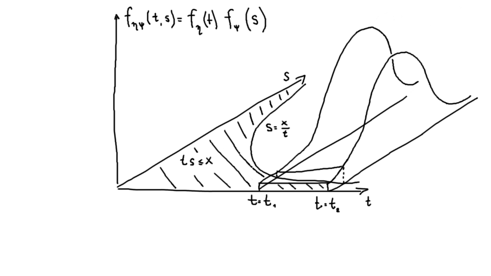
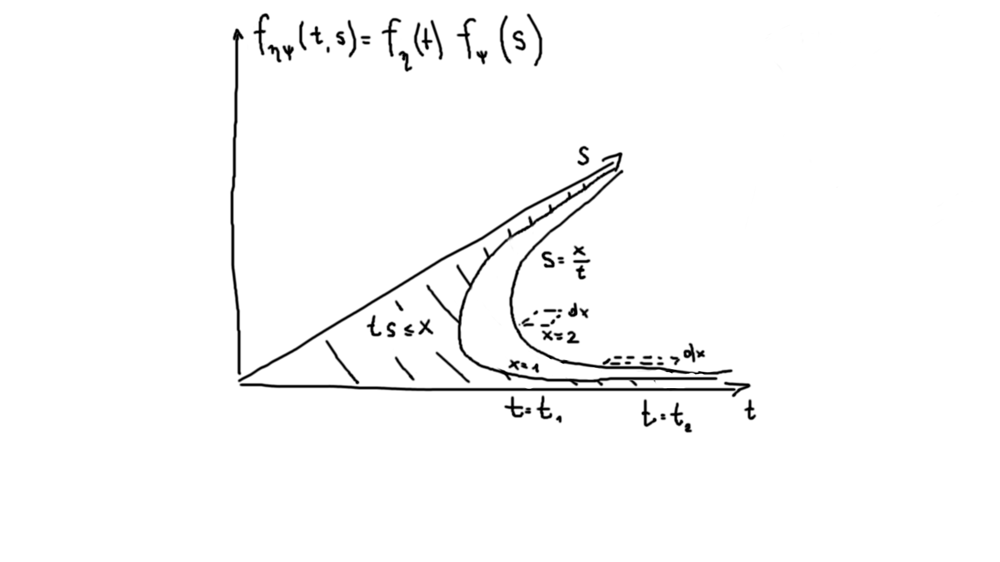

In my previous posts I've described [Chi-square distribution](/2021-06-09-1) (as a special case of Gamma distribution) and [Pearson's Chi-square test](/2021-06-17-1), from which many other distributions and tests are derived in the field of statistics.

In this post I am going to derive the distribution function of a Snedecor's F distribution. It is essentially a ratio between two independent Chi-square-distributed variables with $n$ and $m$ degrees of freedom respectively $\xi = \frac{\chi_n^2}{\chi_m^2}$.

In order to infer its probability density function/cumulative distribution function from the ratio, I'll have to discuss non-trivial technicalities about measure theory etc. first.

Conditional probabilities of multi-dimensional continuous variables
-------------------------------------------------------------------

Suppose that we need to calculate the probability density function of a random variable $\xi$, which is a multiple of 2 independent random variables, $\eta$ and $\psi$.

First, let us recall the definition of independent random variables in a continuous case: $f_{\eta, \psi}(x,y) = f_\eta(x) \cdot f_\psi(y)$. Basically, joint probability density function is a multiplication of individual probability density functions.

Thus, cumulative distribution function $F_{\eta,\psi}(x, y) = \int \limits_{t=-\infty}^{x} \int \limits_{s=-\infty}^{y} f_{\eta}(t) f_{\psi}(s) dt ds$.

Now, we need to calculate the cumulative distribution function of a multiple of 2 random variables. The logic is similar to convolutions in case of a sum of variables: if the product $\eta \psi = x$, we allow $\eta$ to take an arbitrary value of $t$, and $\psi$ should take value of $\frac{x}{t}$ then.

$F_{\eta, \psi}(x) = \int \limits_{t=-\infty}^{\infty} \int \limits_{s=-\infty}^{x/t}f_\eta(t) f_\psi(s) dt ds = \int \limits_{t=-\infty}^{\infty}F_\psi(\frac{x}{t})f_\eta(t)dt = \int \limits_{t=-\infty}^{\infty}p(\psi \leq \frac{x}{t})dF_\eta(t) = \int \limits_{t=-\infty}^{\infty}p(\psi \leq \frac{x}{t}) p(t \leq \eta < t+dt)$.

Graphically, it represents the integral of 2-dimensional probability density function over the area, delimited by $s=\frac{x}{t}$ curve:

Similarly, for probability density function of a multiplication of 2 random variables, we have: $f_{\eta\psi}(x) = \int \limits_{t=-\infty}^{\infty} f_\psi(\frac{x}{t}) f_\eta(t) dt$.

#### Off-topic consistency considerations

**Please, skip this section, it is a memento for myself, the product of my attempts to reason about how this integration works.**

Suppose, we want to get c.d.f. from p.d.f.: $F_{\eta\psi}(x) = \int \limits_{x=-\infty}^{+\infty}f_{\eta\psi}(x)dx$. How to interpret it? $x=ts$ is an area, so $dx$ is a unit rectangle; $f_{\eta\psi}(x)$ is an integral of $f_\psi(s)f_\eta(t)$ over the length of each hyperbola, corresponding to a single $x$ value. When we integrate over the length of each hyperbola, as we approach infinity with s, t approaches zero, so the area of x stays the same.

A consistency consideration: we can infer p.d.f. from inequalities directly and see that integration is consistent:

$f_{\eta\psi}(x)dx = dF_{\eta\psi}(x) = p(x \leq \eta\psi < x+dx) = \int \limits_{t=-\infty}^{\infty} dF_\psi(\frac{x}{t}) dF_\eta(t) = \int \limits_{t=-\infty}^{\infty} dF_\psi(\frac{x}{t}) f_\eta(t)dt = \int \limits_{t=-\infty}^{\infty} p(\frac{x}{t} \leq \psi < \frac{x}{t} + d\frac{x}{t}) p(t \leq \eta < t+dt) = \int \limits_{t=-\infty}^{\infty} p(x \leq \eta \psi < (t+dt)(\frac{x}{t} +d \frac{x}{t}) ) =$

$ = \int \limits_{t=-\infty}^{\infty} p(x \leq \eta \psi < (t\frac{x}{t} + \frac{x}{t}dt + t\cdot(-\frac{xdt}{t^2} + \frac{dx}{t}) + \cancel{dt \cdot d\frac{x}{t}})) = \int \limits_{t=-\infty}^{\infty} p(x \leq \eta\psi < x + \cancel{\frac{x}{t}dt} - \cancel{\frac{x}{t}dt} + dx) = \int \limits_{t=-\infty}^{\infty} dF_{\eta\psi}(x) = dF_{\eta\psi}(x)$.

Snedecor's F distribution derivation
------------------------------------

We want to apply this fact to our ratio, but we need to invert $\chi_m^2$ to do so. By [inverse distribution formula](https://en.wikipedia.org/wiki/Inverse_distribution): $F_{\chi^2}(x) = p(\chi^2 \leq x) = p(\frac{1}{\chi^2} \geq \frac{1}{x}) = 1 - p(\frac{1}{\chi^2} \leq \frac{1}{x}) = 1 - F_{\frac{1}{\chi^2}}(\frac{1}{x})$. 

Thus, $f_{\frac{1}{\chi^2}}(x) = \frac{\partial (1-F_{\chi^2}(\frac{1}{x}))}{\partial x} = \frac{1}{x^2} f_{\chi^2}(\frac{1}{x})$. 

Now, let us substitute this into the pdf for the ratio of our chi-squares. Again, $p(\eta \cdot \psi \leq x) = \int \limits_{t=-\infty}^{\infty} p(\eta \leq t) \cdot p(\psi \leq \frac{x}{t})dt $.

$f_{\frac{\chi_n^2}{\chi_m^2}}(x) = \int \limits_{t=-\infty}^{\infty} f_{\chi^2_n}(t) f_{\frac{1}{\chi^2_m}}(\frac{x}{t})dt = \int \limits_{t=-\infty}^{\infty} f_{\chi^2_n}(x) \frac{t^2}{x^2} f_{\chi^2_m}(\frac{t}{x}) dt = \int \limits_{t=-\infty}^{\infty} \frac{e^{-t/2}t^{n/2-1}}{2^{n/2}\Gamma(n/2)} \frac{t^2}{x^2} \frac{e^{-\frac{t}{2x}}{\frac{t}{x}}^{m/2-1}}{2^{m/2}\Gamma(m/2)}dt = $

$ = \frac{1}{\Gamma(n/2)\Gamma(m/2) 2^{\frac{m+n}{2}} x^{m/2+1}} \int \limits_{t=-\infty}^{\infty}t^{\frac{n+m}{2}}e^{-(t+\frac{t}{x})/2}dt = \frac{1}{\Gamma(n/2)\Gamma(m/2) 2^{\frac{m+n}{2}} x^{m/2+1}} \int \limits_{t=-\infty}^{\infty}t^{\frac{n+m}{2}}e^{-\frac{t}{2}(1+\frac{1}{x})}dt$. 

Now do a variable substitution $z = \frac{x+1}{x}\frac{t}{2}$. Our integral then will take shape of a gamma-function: $\int \limits_{z=-\infty}^{\infty} (\frac{2zx}{x+1})^{\frac{n+m}{2}} e^{-z} \frac{2x}{x+1} dz = (\frac{x}{x+1})^{\frac{n+m}{2}+1} \cdot 2^{\frac{n+m}{2}+1} \cdot \int \limits_{z=-\infty}^{\infty} z^{\frac{n+m}{2}}e^{-z}dz = \frac{x}{x+1}^{\frac{n+m}{2}+1} 2^{\frac{n+m}{2}+1} \Gamma(\frac{n+m}{2})$.

Substituting it into the expression for p.d.f., we get: $f_{\frac{\chi^2_n}{\chi^2_m}}(x) = \frac{\Gamma(\frac{n+m}{2})}{\Gamma(n/2)\Gamma(m/2)} \frac{2^{\frac{n+m}{2}}}{2^{\frac{m+n}{2}}} (\frac{x}{x+1})^{\frac{n+m}{2}+1} \frac{1}{x^{\frac{m}{2}+1}} = \frac{\Gamma(\frac{n+m}{2})}{\Gamma(n/2)\Gamma(m/2)} \frac{x^{\frac{n}{2}}}{(x+1)^{\frac{n+m}{2}+1}}$.

