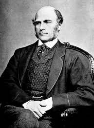

Motivational example
--------------------

Sir Francis Galton (1822 - 1911)

Sir Francis Galton might be considered the grandfather of modern statistics. He analyzed the [data on height of parents and their children](https://books.google.ru/books?id=JPcRAAAAYAAJ&pg=PA248-IA3&redir_esc=y#v=onepage&q&f=false):

Heights of 205 parents and 930 adult children, from "Regression towards mediocrity in hereditary stature" by F.Galton, 1886

Heights of parents were normally-distributed, as well as the heights of their children. However, the distributions were 
obviously not independent, as taller parents generally give birth to taller children. Probably, this plate is one of the first depictions of 2-variate normal distribution.

Galton actually rediscovered the concept of correlation in 1888, two years after this paper.

Multivariate normal distribution
--------------------------------

A random vector $\bm{X} = [x_1, x_2, ..., x_n]^T$ is called multivariate normal distribution, if each dimension of it represents a one-dimensional normal distribution.

They write $\bm{X} \sim \mathcal{N}(\bm{\mu}, \bm{\Sigma})$, where $\bm{\mu} = [\mu_1, \mu_2, ..., \mu_n]^T$ is a vector of means, and the elements of matrix $\bm{\Sigma}$ are covariances between pairs of individual coordinates ($x_i$, $x_j$):

$\bm{\Sigma} = \begin{pmatrix}
\mathbb{E}((x_1-\mu_1)(x_1-\mu_1)) & \mathbb{E}((x_1-\mu_1)(x_2-\mu_2)) & \cdots & \mathbb{E}((x_1-\mu_1)(x_n-\mu_n)) \\
\mathbb{E}((x_2-\mu_2)(x_1-\mu_1)) & \mathbb{E}((x_2-\mu_2)(x_2-\mu_2)) & \cdots & \mathbb{E}((x_2-\mu_2)(x_n-\mu_n)) \\
\cdots                                & \cdots                                & \ddots & \cdots                       \\
\mathbb{E}((x_n-\mu_n)(x_1-\mu_1)) & \mathbb{E}((x_n-\mu_n)(x_2-\mu_2)) & \cdots & \mathbb{E}((x_n-\mu_n)(x_n-\mu_n)) \\
\end{pmatrix}$

Probability distribution function of X looks like this:

$f_X(x_1, x_2, ..., x_n) = \frac{1}{\sqrt{{(2\pi)}^n |\det(\Sigma)|} } \int \limits_{x_1=-\infty}^{\infty} \int \limits_{x_2=-\infty}^{\infty} ... \int \limits_{x_n=-\infty}^{\infty} e^{-\frac{(\bm{X}-\bm{\mu})^T \bm{\Sigma} (\bm{X}-\bm{\mu}) }{ 2 }} dx_1dx_2...dx_n$

TODO: why covariance matrix is covariance, how to split the multivariate normal distribution into single-variate?

Quadratic forms, their ranks and special cases of quadratic forms
-----------------------------------------------------------------

The power of exponent of p.d.f. of a multivariate normal $\frac{(\bm{X}-\bm{\mu})^T \bm{\Sigma} (\bm{X}-\bm{\mu}) }{ 2 }$ is a [quadratic form](https://en.wikipedia.org/wiki/Quadratic_form).

The matrix $\bm{\Sigma}$ might have different numbers of linearly independent rows/columns, which is called [matrix rank](https://en.wikipedia.org/wiki/Rank_(linear_algebra)).

For instance, if our quadratic form is just a product of two vectors $(a_1x_1 + a_2x_2 + a_3x_3)(b_1x_1 + b_2x_2 + b_3x_3)$, the rank equals 1, because all the rows are linearly dependent.

Indeed, we could see this in matrix notation:

$
\begin{pmatrix}
x_1 & x_2 & x_3 \\
\end{pmatrix}
\cdot
\begin{pmatrix}
a_1 \\
a_2 \\
a_3
\end{pmatrix}
\cdot
\begin{pmatrix}
b_1 & b_2 & b_3 \\
\end{pmatrix}
\cdot
\begin{pmatrix}
x_1 \\
x_2 \\
x_3
\end{pmatrix}
$

The multiplication of row-vector by column-vector in linear algebra is called dot product, or inner product.

Less commonly used, the multiplication of columns-vector by row vector is called an outer product, and results in a matrix, where each element is a product of respective elements of column-vector and row-vector:

$
\begin{pmatrix}
a_1 \\
a_2 \\
a_3
\end{pmatrix}
\cdot
\begin{pmatrix}
b_1 & b_2 & b_3 \\
\end{pmatrix} =
\begin{pmatrix}
a_1 b_1 & a_1 b_2 & a_1 b_3 \\
a_2 b_1 & a_2 b_2 & a_2 b_3 \\
a_3 b_1 & a_3 b_2 & a_3 b_3 \\
\end{pmatrix}
$

You can choose an arbitrary order of application of outer-product and inner-product operations:

$
\begin{pmatrix}
x_1 & x_2 & x_3 \\
\end{pmatrix}
\cdot
\begin{pmatrix}
a_1 \\
a_2 \\
a_3
\end{pmatrix}
\cdot
\begin{pmatrix}
b_1 & b_2 & b_3 \\
\end{pmatrix}
\cdot
\begin{pmatrix}
x_1 \\
x_2 \\
x_3
\end{pmatrix} = 
(a_1x_1 + a_2x_2 + a_3x_3)(b_1x_1 + b_2x_2 + b_3x_3) =
\begin{pmatrix}
x_1 & x_2 & x_3 \\
\end{pmatrix}
\cdot
\begin{pmatrix}
a_1 b_1 & a_1 b_2 & a_1 b_3 \\
a_2 b_1 & a_2 b_2 & a_2 b_3 \\
a_3 b_1 & a_3 b_2 & a_3 b_3 \\
\end{pmatrix}
\cdot
\begin{pmatrix}
x_1 \\
x_2 \\
x_3
\end{pmatrix}
$

It is obvious that the rank of matrix
$
\begin{pmatrix}
a_1 b_1 & a_1 b_2 & a_1 b_3 \\
a_2 b_1 & a_2 b_2 & a_2 b_3 \\
a_3 b_1 & a_3 b_2 & a_3 b_3 \\
\end{pmatrix}
$
, formed by outer product of coefficients $\bm{a}$ and $\bm{b}$, equals 1,
because its i-th row is a multiple of $a_i$ by row-vector $\bm{b}^T = \begin{pmatrix} b_1 & b_2 & b_3 \\ \end{pmatrix}$.

Uncorrelated multidimensional normal variables are independent
--------------------------------------------------------------

TODO

Standardization of non-standard normal distribution
---------------------------------------------------

TODO

References
----------
 - https://brilliant.org/wiki/multivariate-normal-distribution/ - lots of helpful and intelligible material
 - https://distill.pub/2019/visual-exploration-gaussian-processes/ - cover image courtesy of this awesome site
 - https://www.wikiwand.com/en/Francis_Galton#/CITEREFGalton1886 - source of plate on 2-variate normal distribution by Galton