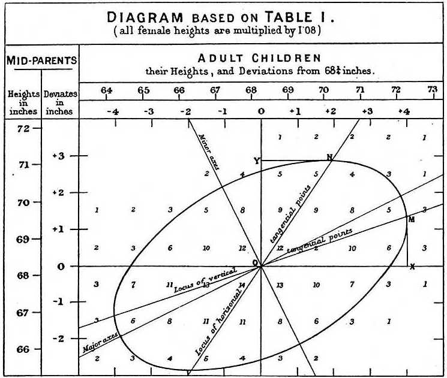

Motivational example
--------------------

Sir Francis Galton (1822 - 1911)

Sir Francis Galton might be considered the grandfather of modern statistics. He analyzed the [data on height of parents and their children](https://books.google.ru/books?id=JPcRAAAAYAAJ&pg=PA248-IA3&redir_esc=y#v=onepage&q&f=false):

Heights of 205 parents and 930 adult children, from "Regression towards mediocrity in hereditary stature" by F.Galton, 1886

Heights of parents were normally-distributed, as well as the heights of their children. However, the distributions were 
obviously not independent, as taller parents generally give birth to taller children. Probably, this plate is one of the first depictions of 2-variate normal distribution's isocontour. As a side note, 
Galton has also come up with the ratio of male to female heights here, which is 1.08 (according to the [modern data](https://ourworldindata.org/human-height), it is closer to 1.07).

Galton actually rediscovered the concept of correlation two years after this paper, in 1888.

Multivariate normal distribution
--------------------------------

A random vector $\bm{X} = [x_1, x_2, ..., x_n]^T$ is called multivariate normal distribution, if each dimension of it represents a one-dimensional normal distribution.

They write $\bm{X} \sim \mathcal{N}(\bm{\mu}, \bm{\Sigma})$, where $\bm{\mu} = [\mu_1, \mu_2, ..., \mu_n]^T$ is a vector of means, and the elements of matrix $\bm{\Sigma}$ are covariances between pairs of individual coordinates ($x_i$, $x_j$):

$\bm{\Sigma} = \begin{pmatrix}
\mathbb{E}((x_1-\mu_1)(x_1-\mu_1)) & \mathbb{E}((x_1-\mu_1)(x_2-\mu_2)) & \cdots & \mathbb{E}((x_1-\mu_1)(x_n-\mu_n)) \\
\mathbb{E}((x_2-\mu_2)(x_1-\mu_1)) & \mathbb{E}((x_2-\mu_2)(x_2-\mu_2)) & \cdots & \mathbb{E}((x_2-\mu_2)(x_n-\mu_n)) \\
\cdots                                & \cdots                                & \ddots & \cdots                       \\
\mathbb{E}((x_n-\mu_n)(x_1-\mu_1)) & \mathbb{E}((x_n-\mu_n)(x_2-\mu_2)) & \cdots & \mathbb{E}((x_n-\mu_n)(x_n-\mu_n)) \\
\end{pmatrix}$

Cumulative density function of X looks like this:

$F_X(x_1, x_2, ..., x_n) = \frac{1}{ \sqrt{{(2\pi)}^n |\det(\Sigma)|} } \int \limits_{t_1=-\infty}^{x_1} \int \limits_{t_2=-\infty}^{x_2} ... \int \limits_{t_n=-\infty}^{x_n} e^{-\frac{(\bm{T}-\bm{\mu})^T \bm{\Sigma}^{-1} (\bm{T}-\bm{\mu}) }{ 2 }} dt_1dt_2...dt_n$, where $T=(t_1, t_2, ..., t_n)^T$

and probability density function is:

$f_X(x_1, x_2, ..., x_n) = \frac{1}{ \sqrt{ {(2\pi)}^n |\det(\Sigma)| } } e^{-\frac{(\bm{X}-\bm{\mu})^T \bm{\Sigma^{-1}} (\bm{X}-\bm{\mu}) }{ 2 }}$

Mahalanobis distance and covariance matrix
------------------------------------------

What is the meaning of covariance matrix and what does it do in the probability density function of multivariate normal?

Square root of a quadratic form $\sqrt{(\bm{X}-\bm{Y})^T\bm{\Sigma}^{-1}(\bm{X} - \bm{Y})}$, where $\bm{Y}$ and $\bm{X}$ are n-vectors and $\bm{\Sigma}$ is an n x n matrix, is
called Mahalanobis distance between vectors $\bm{X}$ and $\bm{Y}$.

If the matrix $\bm{\Sigma}$ is a unit matrix, e.g. $I = \begin{pmatrix}
1 & 0 & 0 \\
0 & 1 & 0 \\
0 & 0 & 1 \\
\end{pmatrix}$, Mahalanobis distance is the same as Euclidean. 

However, if the coordinates of the vector X are strongly correlated, Mahalanobis distance could be much more helpful to e.g. detect outliers.
For instance, imagine, that your vector $\bm{X}$ contains flat properties: ($x_1$ = total_area, $x_2$ = living_rooms_area, $x_3$ = distance from center).
You can tell that total flat area and living rooms area have a reasonably strong correlation (as an edge case they could completely duplicate each other).

For instance, here is a possible covariance matrix for your flat's properties $\bm{\Sigma} = \begin{pmatrix}
1 & 0.7 & 0.1 \\
0.7 & 1 & 0.2 \\
0.1 & 0.2 & 1 \\
\end{pmatrix}$, $\bm{\Sigma}^{-1} = \begin{pmatrix}
1.967  & -1.393 & 0.082  \\
-1.393 & 2.029  & -0.266 \\
0.082  & -0.266 & 1.045  \\
\end{pmatrix}$.

The key to understanding the covariance matrix is analysis of its eigen decomposition.  Let $\bm{E}$ be the matrix of eigenvectors of $\bm{\Sigma}$, let $\bm{\Lambda}$ be the diagonal matrix of eigenvalues of $\bm{\Sigma}$. 

Covariance matrix is symmetric (and positively semi-definite). For a symmetric matrix, its eigenvectors are orthogonal (so that inverse matrix of an orthogonal matrix is its transpose): $\bm{\Sigma} = \bm{E} \bm{\Lambda} \bm{E}^{-1}$ => $\bm{\Sigma}^{T} = (\bm{E}^{-1})^{T} \bm{\Lambda}^{T} \bm{E}^{T} = \bm{E} \bm{\Lambda} \bm{E}^{-1} = \bm{\Sigma}$. 

$\bm{\Lambda}^T = \bm{\Lambda}$, thus, $\bm{E}^{-1}(\bm{E}^{-1})^T \Lambda \bm{E}^T\bm{E} = \bm{\Lambda}$, indicating that $\bm{E}^T\bm{E}=\bm{I}$, or $\bm{E}$ is orthogonal.

So the logic of Mahalanobis distance can be seen as follows: $(\bm{X}-\bm{Y})^T\bm{\Sigma}^{-1}(\bm{X} - \bm{Y}) = (\bm{X}-\bm{Y})^T \bm{E} \bm{\Lambda}^{-1} \bm{E}^T (\bm{X} - \bm{Y})$.

By multiplying $\bm{X-Y}$ by the inverse/transposed eigen matrix $\bm{E}^T$ (and doing the same in transposed way to the left side from $\bm{\Lambda}^{-1}$, when multiplying $(\bm{X} - \bm{Y})^T \bm{E}$), we de-correlate the dimensions of the vectors, transforming those inter-dependent factors into orthogonal, independent. 
Then we take the sum of squares of those de-correlated factors, but a weighted one, we give some dimensions more weight then the others, by multiplying by the matrix of eigenvalues $\bm{\Lambda}$.

Let us show that correlated vectors, multiplied by $\bm{E}^T$, become uncorrelated. If eigenvector $E_i$ had coordinates $\begin{pmatrix} e_{i,1} \\ e_{i,2} \\ e_{i,3} \\ \end{pmatrix}$, then:

$\bm{Y} = \bm{E}^T X =
\begin{pmatrix}
e_{1,1} & e_{1,2} & e_{1,3} \\
e_{2,1} & e_{2,2} & e_{2,3} \\
e_{3,1} & e_{3,2} & e_{3,3} \\
\end{pmatrix}
\cdot
\begin{pmatrix}
x_{1} \\
x_{2} \\
x_{3} \\
\end{pmatrix} = 
\begin{pmatrix}
e_{1,1}x_{1} + e_{1,2}x_2 + e_{1,3}x_3 \\
e_{2,1}x_{1} + e_{2,2}x_2 + e_{2,3}x_3 \\
e_{3,1}x_{1} + e_{3,2}x_2 + e_{3,3}x_3 \\
\end{pmatrix}
$

Let's now calculate the correlation between two coordinates of $\bm{Y}$, e.g.:

$\mathrm{Cov}[y_1, y_2] = \mathrm{Cov}( (e_{1,1}x_1 + e_{1,2}x_2 + e_{1,3}x_3) \cdot (e_{2,1}x_1 + e_{2,2}x_2 + e_{2,3}x_3)) = $

$ = \mathrm{Cov}(e_{1,1}e_{2,1}x_1x_1 + e_{1,1}e_{2,2}x_1x_2 + e_{1,1}e_{2,3}x_1x_3  +  e_{1,2}e_{2,1}x_2x_1 + e_{1,2}e_{2,2}x_2x_2 + e_{1,2}e_{2,3}x_2x_3  +  e_{1,3}e_{2,1}x_3x_1 + e_{1,3}e_{2,2}x_3x_2 + e_{1,3}e_{2,3}x_3x_3) = $

$ = \begin{pmatrix}
e_{2,1} & e_{2,2} & e_{2,3} \\
\end{pmatrix}
\cdot
\begin{pmatrix}
\Sigma_{1,1} & \Sigma_{1,2} & \Sigma_{1,3} \\
\Sigma_{2,1} & \Sigma_{2,2} & \Sigma_{2,3} \\
\Sigma_{3,1} & \Sigma_{3,2} & \Sigma_{3,3} \\
\end{pmatrix}
\cdot
\begin{pmatrix}
e_{1,1} \\
e_{1,2} \\
e_{1,3} \\
\end{pmatrix} = 
\begin{pmatrix}
e_{2,1} & e_{2,2} & e_{2,3} \\
\end{pmatrix}
\cdot
\lambda_1
\cdot
\begin{pmatrix}
e_{1,1} \\
e_{1,2} \\
e_{1,3} \\
\end{pmatrix}
= \lambda_1 \cdot 0 = 0
$.

First, we used [the fact](https://en.wikipedia.org/wiki/Covariance#Covariance_of_linear_combinations) that covariance of a linear combination of random variables is a linear combination of covariances. Then we used the fact that $E_1$ is the eigenvector of matrix $\bm{\Sigma}$, and $\bm{\Sigma} E_1 = \lambda_1 E_1$. Lastly, we used the fact that eigenvectors $E_1$ and $E_2$ are orthogonal, and their dot product is 0. 

Now, as you can see, the power of exponent in multivariate normal distribution, is the square of Mahalanobis distance between the vector and its mean, divided by 2.
So, it works in the same way, it converts our correlated factors into uncorrelated ones, and takes sum of their squares, weighted by eigenvalues of respective directions.

This also explains, why the denominator contains $|\det(\bm{\Sigma})|$: the eigenvalues of the covariance matrix are the elements of diagonal matrix $\bm{\Lambda}$, which are the variances of de-correlated normal distributions.
By [Binet-Cauchy formula](https://en.wikipedia.org/wiki/Cauchy%E2%80%93Binet_formula) the determinant of $\det(\bm{\Sigma}) = \det(\bm{\Lambda})$. Thus, by normalizing the probability density function by $|\det(\bm{\Sigma})|$,
we do the same as by normalizing pdf of one-dimensional normal distribution by $\sqrt{\sigma^2}$.

Uncorrelated multidimensional normal variables are independent
--------------------------------------------------------------

This property of multidimensional normal distribution is fairly obvious from the previous property.

For instance, suppose that your covariance matrix is as in the [following example from StackOverflow](https://stats.stackexchange.com/questions/71394/independence-of-multivariate-normal-distribution):

$\Sigma^{-1} = \begin{pmatrix}
4 & -1 & 0 \\
-1 & 5 & 0   \\
0 & 0 & 2  \\
\end{pmatrix}$,
$\Sigma = \begin{pmatrix}
0.26315789 & 0.05263158 & 0   \\
0.05263158 & 0.21052632 & 0   \\
0          & 0          & 0.5 \\
\end{pmatrix}
$

Then:

$(\bm{X}-\bm{\mu})^T \Sigma^{-1} (\bm{X}-\bm{\mu}) = 
\begin{pmatrix}
x_1 & x_2 & x_3 \\
\end{pmatrix}
\cdot
\begin{pmatrix}
4 & -1 & 0 \\
-1 & 5 & 0   \\
0 & 0 & 2  \\
\end{pmatrix}
\cdot
\begin{pmatrix}
x_1 \\
x_2 \\
x_3 \\
\end{pmatrix} = 
\begin{pmatrix}
x_1 & x_2 \\
\end{pmatrix}
\begin{pmatrix}
4 & -1 \\
-1 & 5 \\
\end{pmatrix}
\begin{pmatrix}
x_1 \\
x_2 \\
\end{pmatrix} + 2{x_3}^2
$.

Now, if we substitute this into the probability density function, we get:

$ f_X(x_1, x_2, ..., x_n) = \frac{1}{ \sqrt{ {(2\pi)}^n |\det(\Sigma)| } } e^{-\frac{(\bm{X}-\bm{\mu})^T \bm{\Sigma} (\bm{X}-\bm{\mu}) }{ 2 }} = \frac{1}{ \sqrt{ {(2\pi)}^3 |\det(\Sigma)| } } e^{- \frac{1}{2} ( \begin{pmatrix}
x_1 & x_2 \\
\end{pmatrix}
\begin{pmatrix}
4 & -1 \\
-1 & 5 \\
\end{pmatrix}
\begin{pmatrix}
x_1 \\
x_2 \\
\end{pmatrix} + 2{x_3}^2)} = $

$= \frac{1}{ \sqrt{ {(2\pi)} \cdot 0.5 } } e^{-\frac{ 2{x_3}^2}{2} } \cdot \frac{1}{ \sqrt{ {(2\pi)^2} |\det{ 
\begin{bmatrix}
0.26315789 & 0.05263158 \\
0.05263158 & 0.21052632 \\
\end{bmatrix}
 }| } }
e^{- \frac{1}{2} ( \begin{pmatrix}
x_1 & x_2 \\
\end{pmatrix}
\begin{pmatrix}
4 & -1 \\
-1 & 5 \\
\end{pmatrix}
\begin{pmatrix}
x_1 \\
x_2 \\
\end{pmatrix}  }
$

Thus, we can see that uncorrelated dimensions of random vector can be factored-out into independent random variables.

Marginalization and Conditioning
--------------------------------

### Marginalization

You marginalize multivariate normal distribution by taking an integral over 1 of its dimensions. 

For instance, if you integrate Galton's 2-variate normal distribution over the heights of all the fathers, you get 1-dimensional distribution of heights all the children.

### Conditioning

You do conditioning, when you fix the value of one dimension of multivariate normal distribution and achieve a lower-variate one.

For instance, you can choose fathers, who are $x_2$ inches tall, and achieve the conditional distribution of
heights of their children, which is one-dimensional normal:

<!--
$
\begin{pmatrix}
x_1-\mu_1 & 1 \\
\end{pmatrix}
\cdot
\begin{pmatrix}
\Sigma_{1,1} & \Sigma_{1,2} \\
\Sigma_{2,1} & \Sigma_{2,2} \\
\end{pmatrix}^{-1}
\cdot
\begin{pmatrix}
x_1-\mu_1 \\
1 \\
\end{pmatrix} = 
\Sigma_{1,1} (x_1 - \mu_1)^2 + (\Sigma_{1,2} + \Sigma_{2,1})(x_1 - \mu_1) + \Sigma_{2,2} = (x_1 - \mu_1 - )
$
-->

$
f_{\xi}(x_1) = \frac{1}{\sqrt{2\pi(\Sigma_{11} - \frac{\Sigma_{12}\Sigma_{21})}{\Sigma_{22}}}} e^{-\frac{1}{2}\frac{ (x_1 - \mu_1 - \frac{ \Sigma_{1,2} }{ \Sigma_{22} } (x_2 - \mu_2))^2 }{ (\Sigma_{1,1} - \frac{ \Sigma_{1,2}\Sigma_{2,1} }{\Sigma_{2,2}})^2 }}
$

Note that the mean and variance of this distribution differ from the marginalized one - children of taller fathers are, obviously, taller.

Quadratic forms, their ranks and special cases of quadratic forms
-----------------------------------------------------------------

The power of exponent of p.d.f. of a multivariate normal $\frac{(\bm{X}-\bm{\mu})^T \bm{\Sigma}^{-1} (\bm{X}-\bm{\mu}) }{ 2 }$ is a [quadratic form](https://en.wikipedia.org/wiki/Quadratic_form).

Speaking of the matrix $\bm{\Sigma}$, there is a useful concept of [matrix rank](https://en.wikipedia.org/wiki/Rank_(linear_algebra)), which is the number of linearly independent rows/columns in the matrix.

For instance, if our quadratic form is just a product of two vectors $(a_1x_1 + a_2x_2 + a_3x_3)(b_1x_1 + b_2x_2 + b_3x_3)$, the rank equals 1, because all the rows are linearly dependent.

Indeed, we could see this, when we write the product in matrix notation:

$
\begin{pmatrix}
x_1 & x_2 & x_3 \\
\end{pmatrix}
\cdot
\begin{pmatrix}
a_1 \\
a_2 \\
a_3
\end{pmatrix}
\cdot
\begin{pmatrix}
b_1 & b_2 & b_3 \\
\end{pmatrix}
\cdot
\begin{pmatrix}
x_1 \\
x_2 \\
x_3
\end{pmatrix}
$

The multiplication of row-vector by column-vector in linear algebra is called dot product, or inner product:
$
\begin{pmatrix}
x_1 & x_2 & x_3 \\
\end{pmatrix}
\cdot
\begin{pmatrix}
a_1 \\
a_2 \\
a_3
\end{pmatrix}=
a_1x_1 + a_2x_x + a_3x_3
$.

Less commonly used, the multiplication of columns-vector by row vector is called an [outer product](https://en.wikipedia.org/wiki/Outer_product), and it results in a matrix, where each element is a product of respective elements of column-vector and row-vector:

$
\begin{pmatrix}
a_1 \\
a_2 \\
a_3
\end{pmatrix}
\cdot
\begin{pmatrix}
b_1 & b_2 & b_3 \\
\end{pmatrix} =
\begin{pmatrix}
a_1 b_1 & a_1 b_2 & a_1 b_3 \\
a_2 b_1 & a_2 b_2 & a_2 b_3 \\
a_3 b_1 & a_3 b_2 & a_3 b_3 \\
\end{pmatrix}
$

You can choose an arbitrary order of application of outer-product and inner-product operations:

$
\begin{pmatrix}
x_1 & x_2 & x_3 \\
\end{pmatrix}
\cdot
\begin{pmatrix}
a_1 \\
a_2 \\
a_3
\end{pmatrix}
\cdot
\begin{pmatrix}
b_1 & b_2 & b_3 \\
\end{pmatrix}
\cdot
\begin{pmatrix}
x_1 \\
x_2 \\
x_3
\end{pmatrix} = 
(a_1x_1 + a_2x_2 + a_3x_3) \cdot (b_1x_1 + b_2x_2 + b_3x_3) =
\begin{pmatrix}
x_1 & x_2 & x_3 \\
\end{pmatrix}
\cdot
\begin{pmatrix}
a_1 b_1 & a_1 b_2 & a_1 b_3 \\
a_2 b_1 & a_2 b_2 & a_2 b_3 \\
a_3 b_1 & a_3 b_2 & a_3 b_3 \\
\end{pmatrix}
\cdot
\begin{pmatrix}
x_1 \\
x_2 \\
x_3
\end{pmatrix}
$

If you choose the latter way, it becomes obvious that the rank of matrix
$
\begin{pmatrix}
a_1 b_1 & a_1 b_2 & a_1 b_3 \\
a_2 b_1 & a_2 b_2 & a_2 b_3 \\
a_3 b_1 & a_3 b_2 & a_3 b_3 \\
\end{pmatrix}
$
, formed by an outer product of coefficients $\bm{a}$ and $\bm{b}$, equals 1.

Indeed, its i-th row is a multiple of $a_i$ by row-vector $\bm{b}^T = \begin{pmatrix} b_1 & b_2 & b_3 \\ \end{pmatrix}$, so
all the rows differ just by a scalar $a_i$, so there is just 1 linearly independent row.

If we chose a real-life covariance matrix $
\begin{pmatrix}
1 & 0.5 \\
0.5 & 1 \\
\end{pmatrix}
$, it is clear that its rank equals 2, so it cannot be represented as $(a_1x_1 + a_2x_2)(b_1x_1 + b_2x_2)$.

References
----------
 - https://brilliant.org/wiki/multivariate-normal-distribution/ - lots of helpful and intelligible material
 - https://distill.pub/2019/visual-exploration-gaussian-processes/ - cover image courtesy of this awesome site
 - https://www.wikiwand.com/en/Francis_Galton#/CITEREFGalton1886 - source of plate on 2-variate normal distribution by Galton
 - http://cs229.stanford.edu/section/gaussians.pdf - procedure of standardization of normal distribution