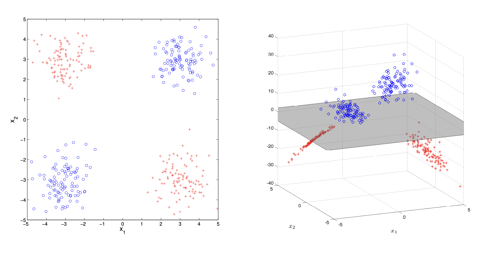
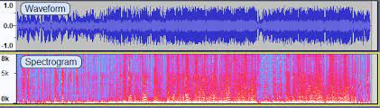
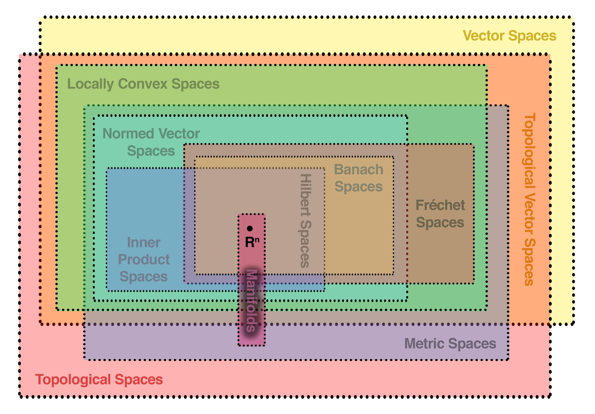

Kernel methods and kernel trick
===============================

Suppose, you are trying to tell the difference between two sets of points with a linear binary classifier, like SVM, that can take decisions, using a linear decision boundary only.

What if your points are lying in a way that cannot be split by a single hyperplane in that space? E.g. there is no single line that could split the points, lying on a plane like a XOR function:

**XOR function cannot be learnt by a linear classifier in 2D**. Here blue points and red points are two classes, we need to learn, and there is no single hyperplane in 2D (i.e. a line), such that red points were on one side of the line and blue points - on the other. However, we can engineer extra features, mapping each of our data points onto a higher dimensional space (3D) instead, where an extra dimension would allow us to come up with a valid linear decision boundary (i.e. a 2D plane, which is a hyperplane in 3D space).

Feature maps
------------

So what you can do is come up with extra features, made from the basic ones.

I.e. if each of your data points $\bf x \bf$ was something like a 2-vector $\bf x_i \bf = \begin{pmatrix} x_{1,i} \\ x_{2,i} \end{pmatrix}$, you could engineer a third feature to be, e.g. a product of the first two $\bf \varphi(x_i) \bf = \begin{pmatrix} x_{1,i} \\ x_{2,i} \\ x_{1,i} \cdot x_{2,i} \end{pmatrix}$, and do the classification in 3D.

Such a mapping from the initial space to the new space is called a *feature map* and denoted $\varphi(\bf x \bf)$.

Implicit features
-----------------

Now, oftentimes you don't need to express your features explicitly to perform the classification. Moreover, there is a way
to make mathematics auto-magically engineer and select fairly complex features for you!

This magic is called Kernel trick, and it is widely applicable in machine learning. Many linear methods, based on least squares problem,
can be "upgraded" with kernel trick to perform in a high-dimensional feature map space. This family of methods is called "kernel methods". 
For example, ridge regression, PCA, SVM. Gaussian processes, important by themselves and for bayesian neural networks, also belong to this class.

To explain kernel trick, I will first formally state a general formulation of the optimization problem we solve in statistical learning theory, called [Empirical Risk Minimization](https://en.wikipedia.org/wiki/Empirical_risk_minimization) problem,
then describe the basic least squares problem, and then will "kernelize" it.

General form of Empirical Risk Minimization problem in statistical learning
---------------------------------------------------------------------------

Don't worry, Empirical Risk Minimization is just a fancy name for your typical statistical learning problem.

Suppose that we have a training set of points $(x, y)$, where each point consists of a vector of features $\bf x \bf$ and a class label $y$. If the set of points is infinitely large, we can denote it as some join distribution P(x,y).

We are trying to come up with some classification/regression function $h(x)$ from a space of functions $\mathcal{H}$, so that $h(x)$ approximates $y$ well enough to classify/predict value of each point correctly.

The error between our prediction $h(x)$ and true class/value $y$ is measured by a loss function $L(f(x), y)$. 

The risk $R(h)$, associated with a choice of classification/regression function $h(x)$ is measured as expectation of loss function over all the data points:

$R(h) = \mathbb{E}[L(h(x),y)] = \int L(h(x), y) dP(x,y)$

Thus, the optimal function $h(x)$ (let us denote it with a hat $\hat{h}(x)$) would be the one to minimize the risk:

$\hat{h} = \underset{h \in \mathcal{H}}{\argmin} \int L(h(x), y) dP(x,y)$

Often you would also want to add some kind of regularization term $R({\lVert h \rVert})$, e.g. L2-regularization $R({\lVert h \rVert}) = {\lVert h \rVert}^2$ ), with some weight $\lambda$ into this equation in order to prevent $\hat{h}$ from overfitting the data:

$\hat{h} = \underset{h \in \mathcal{H}}{\argmin} \int L(h(x), y) dP(x,y) + \lambda R({\lVert h \rVert})$

In case the amount of data available is finite (as is normally the case), the integral becomes a sum:

$\hat{h} = \underset{h \in \mathcal{H}}{\argmin} \sum \limits_{i=1}^n L(h(x), y) + \lambda R({\lVert h \rVert})$

Example: simple regression problem with basic least squares
-----------------------------------------------------------

Recall, how the [least squares](https://en.wikipedia.org/wiki/Least_squares) work in case of normal features. 

Let $X = \begin{pmatrix} {\bf x_1} \\ ... \\ {\bf x_p} \end{pmatrix} = \begin{pmatrix} x_{1,1} && x_{1,2} && ... && x_{1,n} \\ ... && ... && ... && ... \\ x_{p,1} && x_{p,2} && ... && x_{p,n} \end{pmatrix}$ be the $n$ x $p$ matrix of data (e.g. n genes, p patients), 

where ${\bf x_i} = (x_{i,1} ... x_{i,n})$ are n-vectors, corresponding to each element of data (e.g. gene expressions for the patient ${\bf x_i}$).

Let ${\bf y} = \begin{pmatrix} y_1 \\ ... \\ y_p \end{pmatrix}$ be the vector of results and ${\bf w} = \begin{pmatrix} w_1 \\ ... \\ w_n \end{pmatrix}$ be the vector of weights of factors. So, our prediction is $h(X) = X{\bf w}$.

The aim is to minimize the following sum of squares of prediction errors:

$L(h(X), y) = ({\bf y} - X{\bf w})^{T} ({\bf y} - X{\bf w}) = y^T y - {\bf w}^T X^T {\bf y} - {\bf y}^T X {\bf w} + {\bf w}^T X^T X {\bf w}$,

so that the optimal weights $\hat{\bf w}$ are:

$\hat{\bf w} = \underset{\bf w}{\argmin} ({\bf y} - X {\bf w })^{T} ({\bf y} - X {\bf w})$

We solve this minimization problem by taking the derivative and equating it to 0. In my opinion this is an abuse of notation, because we use a whole vector as independent variable, and we should've written $p$ equations instead for each $\frac{\partial L}{\partial w_i}$:

$\frac{\partial L}{\partial {\bf w}} = \frac{\partial(y^T y - {\bf w}^T X^T {\bf y} - {\bf y}^T X {\bf w} + {\bf w}^T X^T X {\bf w})}{\partial{\bf w}} = -2 X^T {\bf y} + 2X^TX{\bf w} = 0$

Hence, $(X^T X) {\bf w} = X^T{\bf y}$. 

Now, if the matrix $(X^T X)$ were a full-rank non-singular matrix, we could've solved this equation, finding a unique solution: ${\bf w} = (X^T X)^{-1} \cdot X^T{\bf y}$. 

But note that $X$ is a rectangular, not a square matrix, thus, we don't simplify this expression, as we cannot guarantee that $(X^T X)^{-1}$ is invertible. 

Consider an example. Let $X = \begin{pmatrix} 1 && 2 && 3 \\ 4 && 5 && 6 \\ \end{pmatrix}$. Then $X^T X = \begin{pmatrix} 1 && 4 \\ 2 && 5 \\ 3 && 6 \\\end{pmatrix} \begin{pmatrix} 1 && 2 && 3 \\ 4 && 5 && 6 \\ \end{pmatrix} = \begin{pmatrix} 17 && 22 && 27 \\ 22 && 29 && 36 \\ 27 && 36 && 45 \\ \end{pmatrix}$.

This matrix has rank 2: you can see that the third column of this matrix is a linear combination of the first two: $ -1 \cdot \begin{pmatrix} 17 \\ 22 \\ 27 \end{pmatrix} + 2 \cdot \begin{pmatrix} 22 \\ 29 \\ 36 \end{pmatrix} = \begin{pmatrix} 27 \\ 36 \\ 45 \end{pmatrix}$.

Hence, the equation $(X^T X) {\bf w} = X^T{\bf y}$ will either have no solutions, or have a whole linear space of dimensionality 1 of solutions. 

To see this, consider another example, a matrix $\begin{pmatrix} 1 && 1 \\ 1 && 1 \end{pmatrix}$. 

If we were to solve $\begin{pmatrix} 1 && 1 \\ 1 && 1 \end{pmatrix} \cdot \begin{pmatrix} x \\ y \end{pmatrix} = \begin{pmatrix} 2 \\ 3 \end{pmatrix}$, this system obviously has no solutions. 

If we were to solve $\begin{pmatrix} 1 && 1 \\ 1 && 1 \end{pmatrix} \cdot \begin{pmatrix} x \\ y \end{pmatrix} = \begin{pmatrix} 2 \\ 2 \end{pmatrix}$, this system has a whole line of solutions $y = 2 - x$.

Expression $(X^T X)^{-1} \cdot X^T$ is called Moore-Penrose pseudo-inverse matrix.

The $n$ x $n$ matrix $C = X^T X = \begin{pmatrix} x_{1,1} && x_{p,1} \\ x_{1,2} && x_{p,2} \\ ... && ... \\ x_{1,n} && x_{p,n} \\ \end{pmatrix} \cdot \begin{pmatrix} x_{1,1} && x_{1,2} && ... && x_{1,n} \\ x_{p,1} && x_{p,2} && ... && x_{p,n} \end{pmatrix}$ is often called a covariance matrix.

It is a Gram matrix by construction, and, thus, is positive (semi-)definite with positive/non-negative eigenvalues.

Kernel trick
------------

Now, we shall replace the matrix $X$ of basic features with matrix $\Phi$ of advanced features, where each row ${\bf x_i}$ of length $n$, corresponding to gene expressions of a single patient, is replaced by a row of feature maps ${\bf \varphi(x_i)}$ of length $N$ of feature maps of those gene expressions:

$\Phi = \begin{pmatrix} \varphi_1({\bf x_1}) && \varphi_2({\bf x_1}) && ... && \varphi_N({\bf x_1}) \\ \varphi_1({\bf x_p}) && \varphi_2({\bf x_p}) && ... && \varphi_N({\bf x_p}) \end{pmatrix} = \begin{pmatrix} {\bf \varphi(x_1)} \\ {\bf \varphi(x_p)} \end{pmatrix}$

Accordingly, the estimation function $h(X)$ is replaced with $h(\Phi)$, such that ${\bf w} = (\Phi^T \Phi)^{-1} \cdot \Phi^T{\bf y}$ (again, the vector of weights ${\bf w}$ is now $N$-dimensional).

$n$ x $n$ positive-definite symmetric covariance matrix $C = X^TX$ is replaced with an $N$ x $N$ positive-definite symmetric matrix $C = \Phi^T \Phi$. Note that $N$ can be infinite, in which case matrices $\Phi$ and $C$ become infinite-dimensional.  

Later in this post I am going to show that when we are looking for our function $h({\bf \varphi({\bf x_i})})$, we can actually get rid of an explicit $\Phi$ in its expression and make $h$ depend only on the kernel matrix $K$.

We can already see that function $h = {\bf \varphi(x_i)} \cdot {\bf w}$. A more general form of this result is known as Representer theorem (see below).

To get a feel of how this works, consider a nice special case.

If we assumed that $\Phi^T \Phi$ is invertible, which [might not be true](https://datascience.stackexchange.com/questions/103382/kernel-trick-derivation-why-this-simplification-is-incorrect/103427#103427), then $h({\bf \varphi({\bf x_i})}) = {\bf \varphi(x_i)} \cdot (\Phi^T \Phi)^{-1} \cdot \Phi^T{\bf y}$.

Moreover, if both $\Phi^T \Phi$ and $\Phi \Phi^T$ were invertible, our [pseudo-inverse matrix](https://en.wikipedia.org/wiki/Moore%E2%80%93Penrose_inverse) could be represented differently:

$(\Phi^T \Phi)^{-1} \Phi^T = \Phi^T (\Phi \Phi^T)^{-1}$

$h({\bf \varphi({\bf x_i})}) = {\bf \varphi(x_i)} \cdot \Phi^T (\Phi \Phi^T)^{-1} {\bf y} = K_i K^{-1} {\bf y}$

Denote kernel matrix $K = \Phi \Phi^T$. Each element of that matrix $K_{i,j}$ can be expressed as $K_{i,j} = \langle \varphi(x_i), \varphi(x_j) \rangle$. Let us denote $K^{-1} {\bf y}$ as a column p-vector $\bf \alpha$.

Our ${\bf \varphi(x_i)} \Phi^T$ is a row p-vector, corresponding to a single row of matrix $K$, $K_i = (\langle \varphi(x_i), \varphi(x_1) \rangle, \langle \varphi(x_i), \varphi(x_2) \rangle, ..., \langle \varphi(x_i), \varphi(x_p) \rangle)$.

Hence, our $h({\bf \varphi({\bf x_i})}) = {\bf \varphi(x_i)} \cdot \Phi^T (\Phi \Phi^T)^{-1} {\bf y} = \sum \limits_{j=1}^{p} \alpha_j \langle \varphi(x_i), \varphi(x_j) \rangle = \sum \limits_{j=1}^{p} \alpha_j K_{i, j}$.

Example: Radial Basis Functions (RBF) kernel
--------------------------------------------

To give this idea a practical sense, let us consider a popular Radial Basis Functions (RBF) kernel, based on Gaussian distribution.

If we had $\bf x_i \bf$ and $\bf x_j \bf$ vectors of input features, the RBF kernel for them would look like this:

$K_{i,j} = k(x_i, x_j) = e^-{\frac{{|| x_i - x_j ||}^2}{2\sigma^2}}$

To see how this kernel produces feature maps, let us decompose it into separate multipliers. For now let us assume $\sigma^2=1$ for shortness of notation, as it doesn't affect the general idea.

$k(x_i, x_j) = e^{-\frac{{|| x_i - x_j ||}^2}{2}} = e^{-\frac{1}{2}{||x_i||}^2 -\frac{1}{2}{||x_j||}^2 + x_i^T x_j} = e^{x_i^T x_j} \cdot e^{-\frac{1}{2}{||x_i||}^2} \cdot e^{-\frac{1}{2}{||x_j||}^2} = \sum \limits_{k=1}^{\infty} \frac{(x_i^T x_j)^k}{k!} \cdot e^{-\frac{1}{2}{||x_i||}^2} \cdot e^{-\frac{1}{2}{||x_j||}^2} = $

$ = \sum \limits_{k=1}^{\infty} \sum \limits_{\sum n_l=k} \underbrace{ \frac{(x_{i,1}^{n_1} \cdot ... \cdot x_{i,k}^{n_k})}{\sqrt{n_1!...n_l!}} \cdot e^{-\frac{1}{2}{||x_i||}^2}}_{\varphi_k(x_i)} \cdot \underbrace{\frac{(x_{j,1}^{n_1} \cdot ... \cdot x_{j,k}^{n_k})}{\sqrt{n_1!...n_l!}} \cdot e^{-\frac{1}{2}{||x_j||}^2}}_{\varphi_k(x_j)} = \langle \varphi(\bf x_i \bf), \varphi(\bf x_j \bf) \rangle$

We've just shown, how to split RBF kernel into an inner product of feature maps of each data point. Note that the sum is actually an infinite series - $k$ index runs to infinity. It would not be possible to explicitly write out feature maps.

Reproducing Kernel Hilbert Space formalism
==========================================

Previously we've seen some practical examples of how kernelization can help us automatically engineer features to
make our linear methods much more powerful. With kernel trick we can automatically generate complex (e.g. polynomial)
features out of our basic ones, and our linear methods, such as linear regression, SVMs, PCA, Fisher discriminant analysis,
spectral clustering etc. would become so much more powerful.

However, there is a whole layer of theoretical foundation behind this, that allows to prove that kernel methods are applicable
to a wide range of kernels. Turns out that each kernel gives rise to a whole space of functions, called Reproducing Kernel Hilbert Space.
This topic requires a pretty strong background in functional analysis, unfortunately.

There are 4 words and 3 concepts in [Reproducing](https://en.wikipedia.org/wiki/Reproducing_kernel_Hilbert_space#Definition), [Kernel](https://en.wikipedia.org/wiki/Integral_transform) [Hilbert spaces](https://en.wikipedia.org/wiki/Hilbert_space). I'll first explain the meaning of each of them separately, providing the missing context, and then
will consider them together. RKHS is a beast with multiple faces, so you can approach it from different perspectives and then
find out that they are all interconnected - quite a typical situation for the kaleidoscope of mathematics. I'll discuss those approaches
in the second part of the post.

Integral transform and its kernel
---------------------------------

The term "kernel" here in Reproducing <i>Kernel</i> Hilbert Space is used in the context of [integral transforms](https://en.wikipedia.org/wiki/Integral_transform), which
has absolutely nothing ([1](https://math.stackexchange.com/questions/1099729/kernels-of-integral-transform-and-linear-transformation), [2](https://math.stackexchange.com/questions/1919305/why-is-the-kernel-of-an-integral-transform-called-kernel#:~:text=The%20kernel%20of%20an%20integral%20transform%20is%20called%20kernel%20with,function%20Tf%20as%20output.)) to do with the kernel of homomorphism or linear transformation.

As an example of integral transformation consider a sound signal - you have a WAV-file, which is a function $f(t)$ in the time domain,
which equals to the air pressure, produced by your headphones at every given moment of time, while they play the signal. WAV-files are typically huge, so you want to compress the singal by
decomposing the sound into harmonics of various frequencies and sacrificing the very high-frequency ones, as 1) their amplitudes
are typically very low and 2) human ear can't hear them anyway. This is more or less how [MP3](https://en.wikipedia.org/wiki/MP3) files work and that's why they are much smaller than WAVs. 

 
**A spectrogram of sound from Audacity software**. Air pressure is at the top, amplitudes of harmonics are at the bottom.

So, you do a [Fourier series decomposition](https://en.wikipedia.org/wiki/Fourier_transform) of your initial signal $f(t)$, which is an integral transform:

$\hat{f}(\omega) = \int \limits_{0}^{t} e^{-2 \pi i \omega t} f(t) dt $, where $\hat{f}(\omega)$ is the amplitude of harmonic with frequency $\omega$. 

Speaking generally, what we did here was an integral transform from a function $f(t)$ in the time domain to a function $\hat{f}(\omega)$ in the frequency domain.

This is formally written as:

$(Tf)(u) = \int \limits_{t_1}^{t_2} K(t, u) f(t) dt$

Here $Tf$ is an integral transform of function $f(t)$, which results in a function in a different domain $u$, and $K(t, u)$ is the <b>kernel</b> of integral transform. In case of Fourier transform 
our kernel was $K(t, \omega) = e^{-2 \pi i \omega t}$.

RKHS deals with some special case of kernels, which possess some nice and helpful properties, which we shall discuss later. 

Hilbert spaces 
--------------

Next term in the Reproducing Kernel *Hilbert Space* abbreviation, that we are going to explore, is "Hilbert space".

Hilbert space is a slightly more abstract concept, that typical Euclidean space we all are used to.

Speaking informally, in regular Euclidean spaces we are considering finite-dimensional vectors.

Hilbert spaces are a bit more general, because they allow the vectors to be infinite-dimensional. The motivation can be very simple.

Imagine a function, e.g. $f(x) = x^2$. You can measure its values in discrete points e.g. {x=-2, x=-1, x=0, x=1, x=2} and get a vector of funciton values {f(-2)=4, f(-1)=1, f(0)=0, f(1)=1, f(2)=4}.

Now, suppose that you have infinite number of points, where you measure the value of your function. So, instead of a finite-dimensional vector, you get a continuous vector. Such infinite-dimensional vector, representing a function, is a single point in a space that is called a Hilbert space.

Moreover, you can define distances and angles on the Hilbert space, by introducing dot product constructuon. A dot product between two functions $f(x)$ and $g(x)$ would be:

$\langle f, g \rangle = \int \limits_{-\infty}^{+\infty}f(t)g(t)dt$

Hence, you can define "length" (or, rather, its formal generalization, called norm) of your infinite-dimentional vector $f$ as:

$\langle f, f \rangle = \int \limits_{-\infty}^{+\infty}f^2(t)dt$

And the angle between two functions $f$ and $g$ then can be defined as $\cos(f,g) = \frac{\langle f,g \rangle}{\sqrt{\langle f,f \rangle \langle g, g \rangle }}$.

Note, how this definition is useful for Fourier transforms - you can treat Fourier transform of a function as a dot product of that function and a Fourier harmonic:

$\langle e^{-2 \pi i \omega t}, f \rangle = \int \limits_{0}^{t} e^{-2 \pi i \omega t} f(t) dt = \hat{f}(\omega)$

Angles are super-important, because you can say that some functions are orthogonal to each other (e.g. Fourier harmonics are orthogonal to each other - you may prove it yourself). Having a set of orthogonal functions, such as Fourier harmonics, is super-useful, because you can use it as a basis in your Hilbert space, and easily represent other functions as a linear combination of your basis functions.

Hierarchy of topological spaces
-------------------------------

If we were to address the formal definition of Hilbert space, we would note that it is defined as 

1) complete
2) topological vector space 
3) with a dot product and a norm, generated by the notion of dot product

We've already discussed the concept of (3) dot product and norm. What's left is (1) completeness and the notion of (2) topological vector space.

Mathematicians introduced more and more abstract concepts of spaces, which could be treated similarly to hierarchies of inheritance in object-oriented programming.

Let's take a look at a diagram of various spaces, they defined:

**Hierarchy of topological spaces.** Hilbert space is a Banach space with a norm, induced by inner product.

As you can see, the Hilbert space has a whole hierarchy of parents. I'll consider only the most important ones:

* (1a) Vector spaces or linear spaces - spaces of objects, that can be multiplied by a scalar or added, while preserving linearity
* (1b) Topological spaces - spaces, where the notion of topology (basically, the relation of neighbourhood between points) is defined; note that neighbourhood is more abstract concept than the concept of length - you can define the notion of neighbourhood on a rubber band, and while the distances between its point can be altered, as you stretch it, the notion of neighbourhood is preserved
* (2) Metric spaces - topological vector spaces (multiple inheritance of topological and vector spaces), with the notion of distance between two points, that induces the topology
* (3) Normed vector spaces - metric spaces with the notion of norm (generalization of length) of a vector/point
* (4) Banach spaces - complete normed vector spaces; completeness means that if a Cauchy sequence converges to some limit, that limit is also an element of the space - this is a valuable property for proving theorems in functional analysis
* (5) Hilbert spaces - banach spaces with the notion of dot product/inner product that induces the norm

Reproducing property
--------------------

Informally speaking, the definition of reproducing property is that if two functions from the Hilbert space are close in norm, it guarantees
that evaluations of those functions at any point are also close:

$|f(x) - h(x)| < M_x || f - h || $, where $M_x$ is a constant specific for point $x$.

Operation of evaluation of a function is defined by an evaluation funcional $L_x: f \mapsto f(x)$ that accepts any funciton on input and returns its value at the point $x$. As we just stated infromally, our evaluation functional is continuous, hence, bounded.

Using that fact, we can apply [Riesz-Frechet representation theorem](https://www.youtube.com/watch?v=rKiy6wEiQIk), which states that there is a representation of this functional as an integral with some function $K_x$:

$L_x(f) = \langle f, K_x \rangle$

Now, the function $K_x$ is itself a function in RKHS, so we can apply evaluation functional to it, but at a different point:

$L_y(K_x) = \langle K_x, K_y \rangle$

If our inner product for functions $f$ and $g$ were defined just as a regular integral $\langle f, g \rangle = \int \limits_a^b f(x) g(x) dx$, 
then evaluation functional $K_x$ is a trivial function, which equals 1 in $x$ and 0 everywhere else.

However, we may define custom inner products (see an example of inner product with roughness penalty in the [lecture by Arthur Gretton](https://youtu.be/alrKls6BORc?t=3513)). 

In this case reproducing property becomes non-trivial, and the custom inner product is the reason to define a custom Hilbert space.

Properties of the kernel function follow from the properties of inner product. It is symmetric, because the inner product is symmetric,
and it is positive-definite, because, again, the inner product is positive definite. For the definition of positive definiteness
for an operator, please see Mercer theorem section below.

Symmetry (follows from [symmetry/conjugate symmetry property of inner product](https://en.wikipedia.org/wiki/Inner_product_space)):

$K(x, y) = \langle K_x, K_y \rangle = \langle K_y, K_x \rangle = K(y, x)$

Positive semidefiniteness: for any set of numbers $c_i, c_j$ the following expression is required to be non-negative:

$\sum \limits_{i,j=1}^{n} c_i c_j K(x_i, x_j) = \sum \limits_{i=1}^{n} c_i \langle K_{x_i}, \sum \limits_{j=1}^{n} c_j K_{x_j} \rangle = \langle \sum \limits_{i=1}^{n} c_i K_{x_i}, \sum \limits_{j=1}^{n} c_j K_{x_j} \rangle = || \sum \limits_{i=1}^{n} c_i K_{x_i} ||^2 \ge 0$

There is an inverse statement, called Moore–Aronszajn theorem - every symmetric, positive semidefinite kernel gives rise to a unique Hilbert space. I leave the proof up to [wikipedia](https://en.wikipedia.org/wiki/Reproducing_kernel_Hilbert_space#Moore%E2%80%93Aronszajn_theorem). Note that only the kernel is unique for RKHS, feature map must not be unique for RKHS.

Representer theorem
-------------------

Remember, we previously showed an example of how to represent the optimal solution of Empirical Risk Minimization problem via an inner product of
some feature map with a set of coefficients?

This is actually a theorem, called Representer theorem.

In its [general form](https://alex.smola.org/papers/2001/SchHerSmo01.pdf) it is as follows. If we are seeking the solution of an optimization problem:

$\hat{h} = \underset{h \in \mathcal{H}}{\argmin} \int L(h(x), y) dP(x,y) + \lambda R({\lVert h \rVert})$,

where $R$ is a strictly monotonically increasing function on $[0, \infty]$ and the solution is required to be a function $h(y)$ from the class of feature maps $f(y) = \sum \limits_{i=1}^{\infty} \beta_i K(x_i, y)$,
corresponding to a kernel $K(x, y)$, then the solution can be represented as $h(y) = \sum \limits_{i=1}^{m} \alpha_i K(x_i, y)$.

We've already seen an example of how this works before in case of kernel regression. This is a more general statement that
claims that even if we are optimizing a more or less arbitrary functional and use a rather wide class of regularization functions (as long as they are monotonic), 
the kernel method still works.

The proof is as follows:

Suppose that we found a way to decompose our function $h(x)$ into a sum of two orthogonal parts: one part is the subspace, covered by
all the feature map functions $\varphi(x_i)$, and the other part is its orthogonal complement $v$:

$h = \sum \limits_{i=1}^{m} \varphi(x_i) + v$

If we were to evaluate this function at a specific point $x_j$, the reproducing property and orthogonality of $v$ would kick in:

$h(x_j) = \langle \sum \limits_{i=1}^{m} \varphi(x_i) + v, \varphi(x_j) \rangle = \sum \limits_{i=1}^{m}\alpha_i \langle \varphi(x_i), \varphi(x_j) \rangle$

Hence, when we use this formula for $h(x_j)$ to evaluate the loss in our estimator, the loss does not depend on $v$. As for the regularization term:

$g(||h||) = g(|| \sum \limits_{i=1}^{n} \alpha_i \varphi(x_i) + v ||) = g(\sqrt{|| \sum \limits_{i=1}^{n} \alpha_i \varphi(x_i) ||^2 + ||v||^2}) \ge g(\sqrt{|| \sum \limits_{i=1}^{n} \alpha_i \varphi(x_i) ||^2})$ 

Optimum of $h$ is achieved when $v$ is 0 (or minimum) due to monotonicity of regularizer $g$ in its argument. Hence,

$\hat{h} = \sum \limits_{i=1}^{n} \alpha_i \varphi(x_i) = $, which proves the theorem.

Mercer theorem
--------------

### Finite-dimensional case: Gram matrix

To get an intuition of Mercer theorem let us first consider a discrete case, where our operator is just a real-valued matrix.

In discrete case a matrix is called a Gram matrix, if it is constructed as a multiplication of a data matrix $X$ with its inverse:

$K = X^T X
= \begin{pmatrix}
\langle {\bf x_1}, {\bf x_1} \rangle && \langle {\bf x_1}, {\bf x_2} \rangle && \langle {\bf x_1}, {\bf x_3} \rangle \\
\langle {\bf x_2}, {\bf x_1} \rangle && \langle {\bf x_2}, {\bf x_2} \rangle && \langle {\bf x_2}, {\bf x_3} \rangle \\
\langle {\bf x_3}, {\bf x_1} \rangle && \langle {\bf x_3}, {\bf x_2} \rangle && \langle {\bf x_3}, {\bf x_3} \rangle \\
\end{pmatrix}
$

A matrix like this has 2 important properties: it is symmetric and positive (semi-)definite. 

Moreover, the reverse is also true: if the matrix $K$ is positive semidefinite, it is always a [Gram matrix](https://en.wikipedia.org/wiki/Gram_matrix) of dot products of some matrices $B$, called realizations: $M = B^{*}B$. This statement is a finite-dimensional version of Mercer's theorem. I will first explore the properties of a Gram matrix, constructed as a dot product matrix, and after that will proof the discrete analogue of Mercer theorem.

#### Symmetry

If out matrix $K$ of dimensionality $n$ is symmetric (so that its elements across the diagonal $k_{i,j} = k_{j,i}$ are identical), it means that
its eigenvectors are orthogonal and form an orthogonal matrix $E$, where each column of such a matrix is an eigenvector $e_i$, 
and eigenvectors are orthogonal, so that $\langle e_i, e_j \rangle = 0$ if $i \neq j$ and $\langle e_i, e_j \rangle = 1$ if $i = j$.

This leads to eigenvalue decomposition of our matrix as: 

$K = E \Lambda E^{-1} = E \Lambda E^T$,

where $\Lambda$ is the diagonal matrix of eigenvalues $\lambda_i$ corresponding to eigenvectors $e_i$: $\Lambda = \begin{pmatrix} \lambda_1 && 0 && 0 \\ 0 && \lambda_2 && 0 \\ ... && ... && ... \\ 0 && 0 && \lambda_n \end{pmatrix}$, 
and we use the fact that eigenvector matrix is orthogonal, so that $E^{-1} = E^T$.

Hence, we can use an alternative representation of eigenvalue decomposition through outer product:

$K = E \Lambda E^T = \sum \limits_{i=1}^{n} \lambda_i e_i e_i^T$

For more details on the topic, see [this post](http://localhost:8000/2021-08-13-1/).

#### Positive (semi-) definiteness

Positive definite matrix is such a matrix, that being considered as a quadratic form matrix, it always produces a positive (for positive definite) or non-negative (for positive semidefinite) scalar:

${\bf x^T} K {\bf x} \ge 0$ for any vector ${\bf x}$

This leads to the following consequence:

As Gram matrix is symmetric, its eigenvalues are real (again, see [this post](http://localhost:8000/2021-08-13-1/)). Moreover, all of them have to be non-negative,
because if any eigenvalue $\lambda_i$ were negative, it would mean that for en eigenvector $x$: 

$Kx = \lambda_i x$, and $x^*Kx = x^* \lambda_i x = \lambda_i {|x|}^2 < 0$,

as square of vector $x$ length is positive, and $\lambda_i$ is negative by proposal), which contradicts the definition of positive semidefinite matrix.

Note that positive definite matrices generally don't have to be symmetric. E.g. $\begin{pmatrix} 1 && 1 \\ -1 && 1 \end{pmatrix}$ is positive definite, because:

$\begin{pmatrix} x && y \\ \end{pmatrix} \begin{pmatrix} 1 && 1 \\ -1 && 1 \\ \end{pmatrix} \begin{pmatrix} x \\ y \\ \end{pmatrix} = \begin{pmatrix} x && y \end{pmatrix} \begin{pmatrix} x + y \\ -x + y \\ \end{pmatrix} = x^2 + y^2$ 

But it is not symmetric. See this [StackOverflow post](https://math.stackexchange.com/questions/83134/does-non-symmetric-positive-definite-matrix-have-positive-eigenvalues).

#### Non-full rank Gram matrices

Interestingly, an $n$ x $n$ Gram matrix is oftentimes not a full-rank matrix. 

Suppose, that realization matrix $X = \begin{pmatrix} x_{1,1} && x_{1,2} && x_{1,3} \\ x_{2,1} && x_{2,2} && x_{2,3} \\ \end{pmatrix}$, and we were looking for the Gram matrix 

$K = X^T X = \begin{pmatrix} x_{1,1} && x_{2,1} \\ x_{1,2} && x_{2,2} \\ x_{1,3} && x_{2,3} \\ \end{pmatrix} \begin{pmatrix} x_{1,1} && x_{1,2} && x_{1,3} \\ x_{2,1} && x_{2,2} && x_{2,3} \end{pmatrix}$.

Again, you can use the perspective of outer product to see that matrix $K$ has the rank of 2: 

$K = ({\bf x_1}^T {\bf x_2}^T) \begin{pmatrix} {\bf x_1} \\ {\bf x_2} \\ \end{pmatrix} = {\bf x_1}^T {\bf x_1} + {\bf x_2}^T {\bf x_2} = \begin{pmatrix} x_{1,1} \\ x_{1,2} \\ x_{1,3} \end{pmatrix} \begin{pmatrix} x_{1,1} && x_{1,2} && x_{1,3} \end{pmatrix} + \begin{pmatrix} x_{2,1} \\ x_{2,2} \\ x_{2,3} \end{pmatrix} \begin{pmatrix} x_{2,1} && x_{2,2} && x_{2,3} \end{pmatrix}$.

You can tell that there are only 2 linearly independent rows in this matrix, so the third row $x_{1,3} \cdot \begin{pmatrix} x_{1,1} && x_{1,2} && x_{1,3} \end{pmatrix} + x_{2,3} \begin{pmatrix} x_{2,1} && x_{2,2} && x_{2,3} \end{pmatrix}$ can be represented as a linear combination of the first two rows.

What if it is the other way around, and $X = \begin{pmatrix} x_{1,1} && x_{1,2} \\ x_{2,1} && x_{2,2} \\ x_{3,1} && x_{3,2} \end{pmatrix}$?

Then your Gram matrix is $K = X^T X = \begin{pmatrix} x_{1,1} && x_{1,2} && x_{1,3} \\ x_{2,1} && x_{2,2} && x_{2,3} \end{pmatrix} \cdot \begin{pmatrix} x_{1,1} && x_{2,1} \\ x_{1,2} && x_{2,2} \\ x_{1,3} && x_{2,3} \\ \end{pmatrix}$ is a full-rank matrix, and realizations are not unique.

However, realizations are non-unique only up to an orthogonal transformations. For instance, if you know a matrix of realizations $X$ of $n$ x $p$, and you want to find a $Y$ realization matrix of $N$ by $p$ dimensionality,
it will have a form of $Y$ = $Q X$, where $Q$ is an $N$ x $n$ matrix with orthogonal columns:

$X^T X = X^T Q^T Q X = Y^T Y$

$ Y^T Y = X^T Q^T Q X = \begin{pmatrix} x_{1,1} && x_{2,1} \\ x_{1,2} && x_{2,2} \\ x_{1,3} && x_{2,3} \\ \end{pmatrix} \begin{pmatrix} q_{1,1} && q_{1,2} && q_{1,3} \\ q_{2,1} && q_{2,2} && q_{2,3} \\ \end{pmatrix} \begin{pmatrix} q_{1,1} && q_{2,1} \\ q_{1,2} && q_{2,2} \\ q_{1,3} && q_{2,3} \\ \end{pmatrix} \begin{pmatrix} x_{1,1} && x_{1,2} && x_{1,3} \\ x_{2,1} && x_{2,2} && x_{2,3} \end{pmatrix}$
$= \begin{pmatrix} x_{1,1} && x_{2,1} \\ x_{1,2} && x_{2,2} \\ x_{1,3} && x_{2,3} \\ \end{pmatrix} \begin{pmatrix} 1 && 0 \\ 0 && 1 \\ \end{pmatrix}  \begin{pmatrix} x_{1,1} && x_{1,2} && x_{1,3} \\ x_{2,1} && x_{2,2} && x_{2,3} \end{pmatrix}$.

#### "Discrete Mercer theorem" proof

Now it is time to prove the inverse statement: if a matrix is positive definite and symmetric, it is a Gram matrix for some vector realizations.

The [proof](https://en.wikipedia.org/wiki/Definite_matrix#Decomposition) is constructive and pretty simple.

Our $n$ x $n$ matrix $K$ must have an eigenvalue decomposition $M = E \Lambda E^{T}$, which we can split into 2 multipliers:

$M = E \Lambda E^{-1} = E \Lambda^{\frac{1}{2}} \Lambda^{\frac{1}{2}} E^{T} = (E \Lambda^{\frac{1}{2}})^{T^T} (E \Lambda^{\frac{1}{2}})^T = B^T B$, where $B = (E \Lambda^{\frac{1}{2}})^T$.

Hence, $B$ is a realization matrix. Note that if $M$ is strictly positive definite, all the eigenvalues in $\Lambda$ matrix are positive. If it is non-negatively definite, some of the eigenvalues are 0, the matrix $K$ is non-full rank, and the matrix $B$ is rectangular with 0 rows rather than square.

### Infinite-dimensional case: positive-definite kernel

Now, we can generalize this statement to infinite-dimensional case. Let $k_{i,j}$ no longer be elements of a symmetric matrix, but instead become a kernel function $k(x,y)$ of a self-adjoint operator instead.

$T_k f(x) = \int \limits_a^b k(x,y)f(y)dy$

Then, if our operator also is positive (semi-) definite, we can consider it as an analogue of a Gram matrix. Then the definition of positive (semi-) definite naturally extends the definition of positive (semi-) definite matrix. 

$\sum \limits_{i=1}^{n} \sum \limits_{j=1}^{n} k(x, y) c_i c_j \ge 0$ for any numbers $c_i, c_j$ and all finite sequences of points $x_1, ..., x_n$ / $y_1, ..., y_n$.

Then Mercer's theorem states that the eigenfunctions ${e_i}$ of $T_k$ form an orthonormal basis in $L^2[a,b]$, their corresponding eigenvalues $\lambda_i$ are non-negative, and the kernel has a representation as a converging absolutely and uniformly series:

$k(x,y) = \sum \limits_{i=0}^{\infty} \lambda_i e_i(x) e_i(y)$

The [proof](https://en.wikipedia.org/wiki/Mercer%27s_theorem) builds upon the fact, that our operator $T_k$ is a compact operator. For compact operators eigenfunctions form a discrete orthonormal basis by the spectral theorem, making the rest of the proof similar to finite-dimensional case.

For more details on spectral theorems in functional analysis, see [this post](/2021-10-15-1).

References
----------
 - https://www.youtube.com/watch?v=XUj5JbQihlU - incredibly fun and comprehensible talk by enthusiastic Yaser Abu-Mostafa from Caltech
 - https://www.gatsby.ucl.ac.uk/~gretton/coursefiles/Slides4A.pdf - presentation by brilliant Arthur Gretton from UCL
 - https://www.youtube.com/watch?v=alrKls6BORc - talk by Arthur Gretton, corresponding to the presentation
 - https://medium.com/@zxr.nju/what-is-the-kernel-trick-why-is-it-important-98a98db0961d - example of use of kernel trick
 - https://en.wikipedia.org/wiki/Reproducing_kernel_Hilbert_space - a decent and helpful explanation from wikipedia
 - https://arxiv.org/pdf/2106.08443.pdf - a good survey on kernel methods in ML
 - http://math.sfu-kras.ru/sites/default/files/lectures.pdf - a course of lectures on functional analysis (in Russian)
 - https://stats.stackexchange.com/questions/123413/using-a-gaussian-kernel-in-svm-how-exactly-is-this-then-written-as-a-dot-produc - a nice question, explaining why RBF kernel is actually a RKHS kernel
 - https://people.cs.umass.edu/~domke/courses/sml2011/03optimization.pdf - a decent write-up about Empirical Risk Minimization problem and introduction to optimization in general
 - http://web.eecs.umich.edu/~cscott/past_courses/eecs598w14/notes/13_kernel_methods.pdf - on Representer theorem and kernel methods in geenral
 - https://alex.smola.org/papers/2001/SchHerSmo01.pdf - original 2001 paper by Smola, Herbrich and Scholkopf on generalized Representer theorem
 - https://www.iist.ac.in/sites/default/files/people/in12167/RKHS_0.pdf - another good write-up on RKHS and kernel methods
 - https://www.mdpi.com/2227-9717/8/1/24/htm - a very helpful review of kernel methods and kernel trick
 - https://www.youtube.com/watch?v=JQJVA8ehlbM - a good step-by-step video introduction of kernel methods
 - https://www.youtube.com/watch?v=rKiy6wEiQIk - Riesz-Frechet representation theorem
 - http://people.eecs.berkeley.edu/~bartlett/courses/281b-sp08/7.pdf - a good short text on RKHS and reproducing property with examples
 - https://www.face-rec.org/interesting-papers/General/eig_book04.pdf - a good survey of eigenproblems, including kernel methods applications, in ML
 - https://www.kdnuggets.com/2016/07/guyon-data-mining-history-svm-support-vector-machines.html - Isabelle Guyon on (re-) invention of kernel trick by her and Vapnik in 1991
 - http://www.mathnet.ru/php/archive.phtml?wshow=paper&jrnid=at&paperid=11804&option_lang=eng - 1964 Aizerman, Braverman and Rozonoer paper on proto-kernel trick (mostly in Russian)
 - https://users.wpi.edu/~walker/MA3257/HANDOUTS/least-squares_handout.pdf - a nice, but partially wrong text about rank and singularity of Gram matrix and uniqueness/existence of least squares solution
 - https://datascience.stackexchange.com/questions/103382/kernel-trick-derivation-why-this-simplification-is-incorrect/103427#103427 - answer to my question on Stack Overflow
 - http://www.seas.ucla.edu/~vandenbe/133A/lectures/ls.pdf - good practical examples of least squares with p >> n, non-singular matrix A, ill-conditioned equations etc.
 - https://en.wikipedia.org/wiki/Hilbert_space - one of the best articles on mathematics, I've ever seen on wikipedia
 - https://en.wikipedia.org/wiki/Representer_theorem
 - https://en.wikipedia.org/wiki/Positive-definite_kernel
 - https://en.wikipedia.org/wiki/Reproducing_kernel_Hilbert_space
 - https://en.wikipedia.org/wiki/Definite_matrix#Decomposition
 - https://en.wikipedia.org/wiki/Gram_matrix
 - https://en.wikipedia.org/wiki/Empirical_risk_minimization
 - https://en.wikipedia.org/wiki/Kernel_principal_component_analysis
 - https://en.wikipedia.org/wiki/Integral_transform
 - https://en.wikipedia.org/wiki/Radial_basis_function_kernel
 - https://en.wikipedia.org/wiki/Least_squares
 - https://en.wikipedia.org/wiki/Linear_least_squares