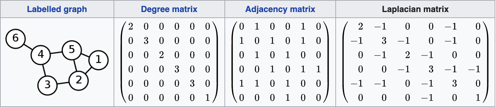

A motivational example
----------------------

Suppose that you are given a graph, and you need to find the number of connected components in it. Moreover, the problem
can be fuzzy, i.e. formulated in terms of finding dense sub-graphs of a graph. For instance, you might have a 3D-structure
of a protein, where graph vertices correspond to C-alpha atoms of amino acid residues, and edges might connect nearby pairs
of C-alpha atoms. You might want to find dense sub-graphs of C-alpha atoms, called protein domains.

It turns out, that linear-algebraic approach to graphs might lead to amazing results.

Suppose that you have an undirected graph with weights on its edges. 

Let us define its **adjacency matrix** A:

$A = \begin{pmatrix} w_{1,1} && w_{1,2} && \cdots && w_{1, n} \\ w_{1,1} && w_{1,2} && \cdots && w_{1, n} \\ \cdots && \cdots && \cdots && \cdots \\w_{n,1} && w_{n,2} && \cdots && w_{n, n} \end{pmatrix}$,

where each element $w_{i,j}$ of $A$ represents the weight of the edge i -> j. 

As the graph is assumed undirected, the adjacency matrix is symmetric; moreover, we'll have it positively definite.

Let us also consider a diagonal **degree matrix** D:

$D = \begin{pmatrix} d_1 && 0 && \cdots && 0  \\ 0 && d_2 && \cdots && 0 \\ \cdots && \cdots && \cdots && \cdots \\ 0 && 0 && 0 && d_n \end{pmatrix}$,

where $d_i = \sum \limits_{j=1}^{n} w_{i,j}$ is the sum of weights of all edges, leading to/from the vertex i.

Turns out, the difference between degree and adjacency matrices, the matrix $L = D - A$ has some amazing properties. For instance, the algebraic
multiplicity of its eigenvalue 0 corresponds to the number of connected components in the graph! This matrix L is called graph **Laplacian**.

Here is a nice example from wikipedia (here no weights on edges are specified, so if an edge exists, we assume its weight 1, if it doesn't - 0):

If you recall Laplacian operator in multivariate calculus/physics, it is actually 
the same concept, the Laplacian matrix is just its discrete analogue. The wonderful properties of Laplacian matrix become
more obvious from this analogy, so I'll take a detour to explain the notion of Laplacian in multivariate calculus.

Laplacian in multivariate calculus
----------------------------------

The intuitive meaning of Laplacian is not immediately obvious from its definition.

To appreciate its usefulness, you need to understand [Gauss-Ostrogradsky divergence theorem](https://en.wikipedia.org/wiki/Divergence_theorem) first.

TODO: sum of neighbors

TODO: connection to hessian - Laplacian is a trace of Hessian, divergence is a trace of Jacobian

Connection between Laplacian operator and graph Laplacian/normalized graph Laplacian
------------------------------------------------------------------------------------

TODO: difference between the average of function over the neighbours, and the value of function at the point

Properties of graph Laplacian
-----------------------------

TODO: connection to Rayleigh quotient

Discrete Laplace operator
-------------------------

A fun fact: there exists yet another discrete version of Laplacian, a [Discrete Laplace Operator](https://en.wikipedia.org/wiki/Discrete_Laplace_operator), which is
often used as a convolution filter in computer vision to detect edges in images.

It is a matrix of the following structure in 2D case:

$\Delta_h = \frac{1}{h^2} \begin{pmatrix} 0 && 1 && 0 \\ 1 && -4 && 1 \\ 0 && 1 && 0 \end{pmatrix}$, where $h$ is the size of a step in the context of [finite difference method](https://en.wikipedia.org/wiki/Finite_difference_method).

Try applying it to a brick wall as a good example - you'll see that a solid brick will be zeroed (as its margin doesn't differ from the solid part), but its edge,
where it touches the concrete, will be highlighted, as there is a colour difference.

References
----------
 - https://people.csail.mit.edu/dsontag/courses/ml14/notes/Luxburg07_tutorial_spectral_clustering.pdf - a great tutorial on spectral graph theory
 - http://www.math.ucsd.edu/~fan/research/cb/ch1.pdf - a popular textbook by Fan Chung on spectral graph theory
 - https://math.stackexchange.com/questions/50274/intuitive-interpretation-of-the-laplacian - interpretation of Laplacian in multivariate calculus
 - https://math.stackexchange.com/questions/18945/understanding-the-properties-and-use-of-the-laplacian-matrix-and-its-norm - answer by Qiaochu Yuan and others
 - https://qchu.wordpress.com/2011/01/02/the-schrodinger-equation-on-a-finite-graph/ - connections with quantum mechanics
 - https://math.stackexchange.com/questions/4089508/intuition-of-the-connection-between-the-graph-laplacian-and-the-laplace-operator - awesome explanation of connection of two Laplacians
 - https://mathoverflow.net/questions/54986/why-is-the-laplacian-ubiquitous - answer by Terry Tao and others about ubiquity of laplacian
 - https://www.youtube.com/watch?v=uxsDKhZHDcc - lectures on spectral clustering by Jure Lescovec