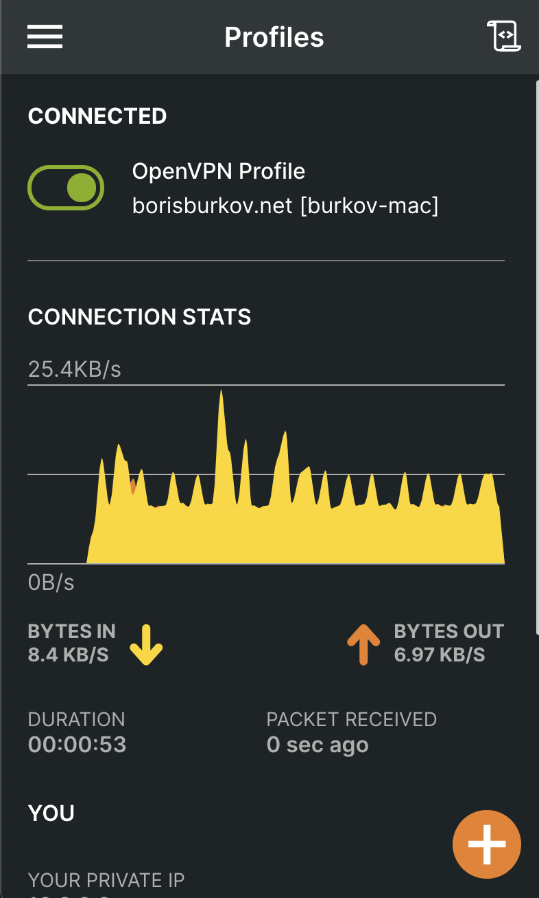

Plan
----

We aim to install our own VPN server software on a Linux server somewhere outside the Iron Curtain, and then connect to it via VPN clients from our devices to visit the websites, banned in Russia. I am not going to set up LDAP or Radius authentication backends here, as this is a basic scenario for personal use only.

In order to do so, we are going to perform the following steps:

1. Install OpenVPN server via openvpn-install.sh script.

2. Review the configuration.

3. Generate client keys and certificates. 
   
4. Generate VPN client profile (.ovpn-file).

5. Download an OpenVPN client, import .ovpn-file. Run VPN. Visit a banned website.

I used Debian-based Linux distributions for installation of OpenVPN server. However, mostly the same plan should work at least for other Linux distributions.

There is a nice road warrior installation script for OpenVPN server, called [openvpn-install.sh](https://github.com/Nyr/openvpn-install/blob/master/openvpn-install.sh), which automates many steps of OpenVPN configuration for you. However, if you want to go fully-manual, follow [this DigitalOcean instruction](https://www.digitalocean.com/community/tutorials/how-to-set-up-an-openvpn-server-on-debian-10), which performs every step manually. I used the automated script to save many hours of typing and debugging.

I will not cover the network and firewall configuration in this post, however, this process is also covered in [DigitalOcean instruction](https://www.digitalocean.com/community/tutorials/how-to-set-up-an-openvpn-server-on-debian-10).

### 1. Install OpenVPN server via openvpn-install.sh script

Download and run the [openvpn-install.sh](https://github.com/Nyr/openvpn-install/blob/master/openvpn-install.sh) script:

`wget https://git.io/vpn -O openvpn-install.sh`

`sudo bash openvpn-install.sh`

### 2. Review the configuration

The script has automatically installed OpenVPN server software. Its configuration resides in `/etc/openvpn` folder, while some pieces of 
documentation are available in `/usr/share/doc/openvpn/examples/` (on Debian at least).

The server-side configuration, that interests us, lives in `/etc/openvpn/server`. 

The main server configuration file is `/etc/openvpn/server/server.conf` (on Debian). It contains documentaiton lines, explaining its options, and refers to multiple security-related files, which I'll describe further.

Server configuration directory contains the following generated security-related files:

 - `/etc/openvpn/server/ca.key` - private key of certificate-signing authority (CA); CA was created for us by the `openvpn-install.sh` script; its purpose is to sign both VPN server and VPN client private keys with CA certificate, so that they could mutually authenticate each other, knowing that only the holder of server/client private keys could emit a server/client certificate, and only CA could've signed it, ensuring that no man-in-the-middle attack is in place 
 - `/etc/openvpn/server/ca.crt` - certificate of certificate-signing authority itself; should be present in server side and 
 - `/etc/openvpn/server/server.key` - private key of your VPN server (so that only VPN server can sign anything with it)
 - `/etc/openvpn/server/server.crt` - certificate of your VPN server (so that VPN client can trust it by recognizing it)
 - `/etc/openvpn/server/dh.pem` - preferred Diffie-Hellman parameters, [not secret](https://security.stackexchange.com/questions/72287/in-openvpn-is-the-dh1024-pem-file-dependent-on-the-ca)
 - `/etc/openvpn/server/ta.key` - security key for signing packets with HMAC signature, while using [tls-auth](https://openvpn.net/community-resources/hardening-openvpn-security/) security directive

Also note that the server configuration directory contains the whole EasyRsa suite in `/etc/openvpn/server/easy-rsa/` folder. We can use its `/etc/openvpn/server/easy-rsa/easyrsa` executable script to generate client key/certificate pairs. 
They and other assets will appear in `/etc/openvpn/server/easy-rsa/pki` subfolders, depending on their type.

### 3. Generate client keys and certificates

Alright, let us use easyrsa to generate a key/certificate pair for our new client.

Suppose, you want to create a private key/certificate pair for a client, named "burkov". You need to run the following commands in the `/etc/openvpn/server/easy-rsa` folder, using your easyrsa suite:

`./easyrsa gen-req burkov-mac nopass`

This will generate a private key `/etc/openvpn/server/easy-rsa/pki/private/burkov-mac.key` and a certificate request `/etc/openvpn/server/easy-rsa/pki/reqs/burkov-mac.req` that needs to be signed by the signing authority.

You can sign the certificate request with command:

`./easyrsa sign-req client burkov-mac`

This will generate a certificate file `/etc/openvpn/server/easy-rsa/pki/issued/burkov-mac.crt`. 

You will need it in order to generate the .ovpn file.

### 4. Generate VPN client profile (.ovpn-file)

Now it is time to create your client's profile configuration file, .ovpn-file, that you will use on your device (phone, personal computer) to connect to VPN server.

`openvpn-install.sh` contains a [function](https://github.com/Nyr/openvpn-install/blob/master/openvpn-install.sh#L82) that generates .ovpn-file based on a template.

Alternatively, you can create a simple bash script that generates .ovpn configs for you. I used the second approach, again, following the DigitalOcean instruction.

Create a folder `~/client-configs` on your VPN server machine and recursively set permissions to 700 on it: `chmod -R 700 ~/client-configs`.

Create a simple bash script `~/client-configs/make_config.sh` of the following content:

```bash
#!/bin/bash

# First argument: Client identifier
# Copy-pasted from: https://www.digitalocean.com/community/tutorials/how-to-set-up-an-openvpn-server-on-debian-10

KEY_DIR=/home/burkov/client-configs/keys
OUTPUT_DIR=/home/burkov/client-configs/files
BASE_CONFIG=/home/burkov/client-configs/base.conf

cat ${BASE_CONFIG} \
    <(echo -e '<ca>') \
    ${KEY_DIR}/ca.crt \
    <(echo -e '</ca>\n<cert>') \
    ${KEY_DIR}/${1}.crt \
    <(echo -e '</cert>\n<key>') \
    ${KEY_DIR}/${1}.key \
    <(echo -e '</key>\n<tls-auth>') \
    ${KEY_DIR}/ta.key \
    <(echo -e '</tls-auth>') \
    > ${OUTPUT_DIR}/${1}.ovpn
```

It will automatically generate client .ovpn-files from a template client configuration file (`~/client-configs/base.conf`) and secret files in `~/client-configs/keys` folder and emit .ovpn files in `~/client-configs/files`.

The script requires a client configuration template file `~/client-configs/base.conf`. You can copy its contents from `/usr/share/doc/openvpn/examples/sample-config-files/client.conf` and tweak some settings to match your `server.conf`. Don't forget to set the following directives in `base.conf`: `remote mywebiste.com 1194` - to point to your VPN-server and `key-direction 1`. Don't forget to comment out `ca`, `cert` and `key` directives, as your script `make-config.sh` will copy-paste those secrets into the template inline.

The script also requires that you created sub-folders `~/client-configs/files` and `~/client-configs/keys`. 

Put the following files into the `~/client-configs/keys` sub-folder:

 - your client's private key (`burkov-mac.key` in my example)
 - your client's signed certificate (`burkov-mac.crt` in my example)
 - certificate authority's certificate (`ca.crt`)
 - TLS auth static key for HMAC signatures (`ta.key`)

Now, run the script: `~/client-configs/make-config.sh burkov-mac`. It will generate `~/client-configs/files/burkov-mac.ovpn` VPN client profile.

### 5. Download an OpenVPN client, import .ovpn-file, run VPN, visit a banned website

Copy-paste your .ovpn client profile file to your client device.

Install an OpenVPN client, suitable for your OS. For instance, I used [this official client](https://openvpn.net/client-connect-vpn-for-mac-os/) on my Mac.

Import .ovpn file into it and run VPN. Voila:



What the future holds?
----------------------

Apparently, Putin's government has a long-term roadmap for achieving "internet sovereignty" - i.e. establishment of total control and censorship over [Runet](https://en.wikipedia.org/wiki/Runet).

On September, 3rd, multiple popular VPN providers [were blocked by Russian government](https://habr.com/ru/news/t/576128/). I don't have any inside information on the exact mechanism of blockade, 
but there are [opinions](https://zona.media/article/2021/09/13/rknvsvpn) that popular VPN providers, such as NordVPN, are using an advanced VPN protocol, called [WireGuard](https://en.wikipedia.org/wiki/WireGuard), 
and the whole WireGuard protocol is being blocked. WireGuard is a nicer, slimmer VPN protocol than OpenVPN or IPsec, it is natively supported by the Linux kernel and has a tiny codebase.

Starting from 2018, internet providers in Russia are forced to purchase Deep Package Inspection (DPI) equipment that allows
to intercept unwanted traffic. It seems that its country-wide adoption is planned by the Russian government. After that we
can expect that other types of protocols (e.g. such as Distributed Hash Tables, used in Torrents) may be blocked partially or completely.

Currently, it is a good practice to change the VPN port to a non-well-known one, as DPI is often not really used thus far, and internet service providers often
just block traffic by the port number, not by actual inspection of package headers. Don't relax just yet, though - things are getting worse, and they'll come after us sooner or later.

References
----------
 - https://www.digitalocean.com/community/tutorials/how-to-set-up-an-openvpn-server-on-debian-10 - a great in-depth tutorial on the whole process of OpenVPN installation
 - https://www.cyberciti.biz/faq/install-configure-openvpn-server-on-debian-9-linux/ - on installation through openvpn-install.sh script
 - https://openvpn.net/client-connect-vpn-for-mac-os/ - official MacOS OpenVPN client   
 - https://zona.media/article/2021/09/13/rknvsvpn (in Russian) - technical details on how current VPN blocking works
 - https://habr.com/ru/news/t/576128/ (in Russian) - news about 6 popular VPN providers being blocked.