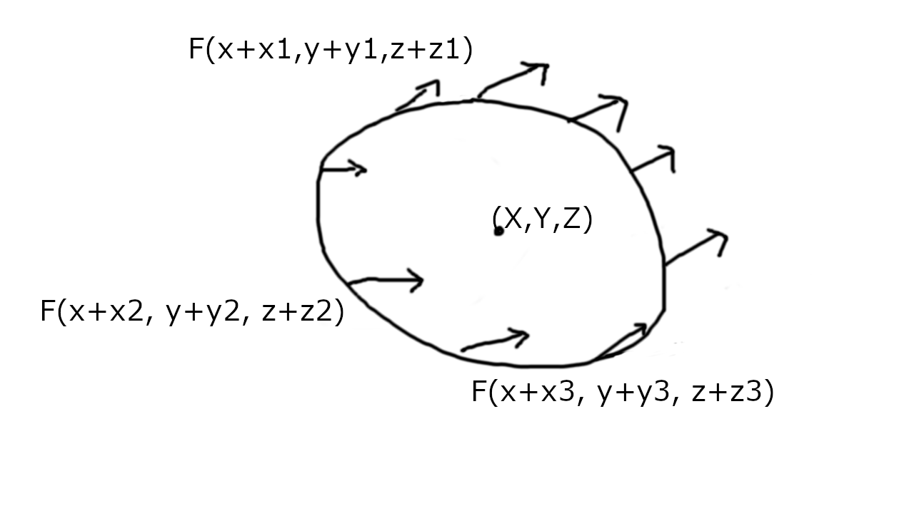
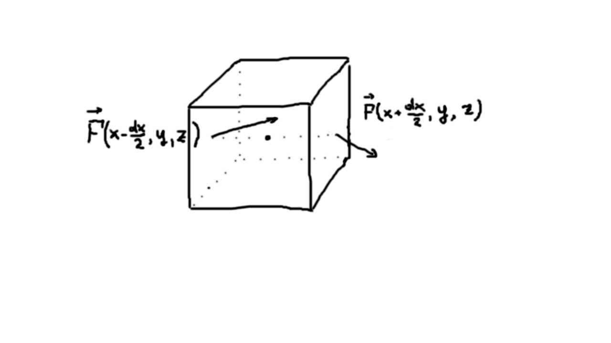

In the late XVIII - early XIX centuries great mathematicians, such as Joseph-Louis Lagrange, Carl Friedrich Gauss and others
were laying the foundations of modern physics. One of the most notable problems, they were studying, was heat transfer.
The mathematical methods, developed in order to solve it, such as multivariate calculus and Fourier analysis are invaluable
and are now ubiquitous in applied mathematics.

Throughout this post I will be using examples from heat transfer and diffusion problems as a motivation to 
explain the intuition behind mathematical concepts.

In order to introduce the concept of Laplacian, I have to introduce the notion of divergence first, as Laplacian is its special case. After we have dealt with divergence, the properties of Laplacian will become obvious.

Divergence
----------

The notion of divergence in multivariate calculus has 2 very different definitions: conceptual and technical.

Their equivalence is not trivial to see, and I'll dedicate a whole separate section below to prove it.

### Conceptual definition

Conceptually, divergence of a vector field $\vec{F}$ at some point is the integral of flow of that vector field over an 
infinitesimal closed contour with area $S$ and volume $V$ around that point. 

$\nabla \cdot F(x,y,z) = \lim \limits_{S, V \to 0} \oiint \limits_S \frac{1}{|V|} F(x,y,z)$

### Technical definition

Technically, divergence of a vector field $\vec{F}$ is a sum of its partial derivatives of the vector field coordinates: $\nabla \cdot F(x,y,z) = \frac{\partial F_x}{x} + \frac{\partial F_y}{y} + \frac{\partial F_y}{z}$. 

Note that $\vec{F}$ is a vector field, not a scalar field. So, divergence **is not** just a dot product of gradient 
by (1,1,1) vector, as the notation abuse might suggest.

### Proof of equivalence of conceptual and technical definitions

Say, our infinitesimal surface, surrounding the given point $(x,y,z)$ is a cube, with edges aligned with the coordinate 
vectors, so that edge of length $dx$ is parallel to $x$ axis, $dy$ is parallel to $y$ axis and $dz$ is parallel to $z$ axis.

As cube is small, we can assume the flow over each of its faces equal to the area of that face, multiplied by flow through
its center.

Divergence, according to conceptual definition, would be the total flow through all 6 faces of the cube. I will 
denote a part of total divergence, corresponding to the flow through the pair of faces, orthogonal to the axis $x$, as $\nabla_x \cdot F(x,y,z)$. 
Thus, the total divergence equals $\nabla \cdot F(x,y,z) = \nabla_x \cdot F(x,y,z) + \nabla_y \cdot F(x,y,z) + \nabla_z \cdot F(x,y,z)$.

Let us calculate the divergence through the two faces, orthogonal to $x$ axis: 

$\nabla_x F(x, y, z) = \frac{1}{V} (F_x(x+\frac{dx}{2}, y, z) - F_x(x-\frac{dx}{2}, y, z)) \cdot S = \frac{1}{dx \cdot dy \cdot dz} (F_x(x+\frac{dx}{2}, y, z) - F_x(x-\frac{dx}{2}, y, z)) \cdot dy \cdot dz =$

$ = \frac{1}{dx \cdot dy \cdot dz} F_x'(x, y ,z) \cdot dx \cdot dy \cdot dz = F_x'(x, y ,z)$

So, the total divergence is:

$\nabla F(x, y, z) = \nabla_x F(x, y, z) + \nabla_y F(x, y, z) + \nabla_z F(x, y, z) = F_x'(x, y ,z) + F_y'(x, y ,z) + F_z'(x, y ,z)$

We see that conceptual definition converged to the technical definition.

### Invariance of divergence to coordinate change

We chose our infinitesimal cube so, that its edges are aligned in parallel to the coordinate axes.

However, divergence would not change, if we chose the directions differently. 

Indeed, note that divergence is the trace of [Jacobian](https://en.wikipedia.org/wiki/Jacobian_matrix_and_determinant) matrix, and trace is invariant to [similarity transformations](https://en.wikipedia.org/wiki/Similarity_transformation) (such as rotation of coordinates). 

To show this fact, first show that $tr(A \cdot B) = tr(B \cdot A)$ by direct calculation and from this it follows that $tr(B A B^{-1}) = tr(A B^{-1} B) = tr(A)$.

### Why this works for non-rectangular surfaces?

TODO

Gauss-Ostrogradsky theorem
--------------------------

Gauss-Ostrogradsky theorem basically states that you can calculate flow of the vector field through a macroscopic closed
surface as an integral of divergence over the volume, confined in that surface. 

It is proved by application of same discussion, as we employed for infinitesimal surface/volume (just split the whole 
macroscopic volume into these infinitesimal pieces).

Laplacian
---------

Laplacian follows from divergence in one simple step.

Suppose that instead of a vector fields $\vec{F}$ you have a scalar field $V$. For instance, instead of flow of matter,
you have a distribution of temperature or concentration over a volume.

Well, we can get a vector field out of that scalar field easily: just find the gradient of the scalar field and use it
as the vector field.

The operator $\nabla \cdot \nabla V(x,y,z) = \Delta V(x,y,z)$ is called Laplacian.

Being a divergence, Laplacian is invariant to the change of basis as well (by the way, it is the trace of Hessian).

Applications outside multivariate calculus and field theory
-----------------------------------------------------------

There are several discrete analogues of the continuous Laplacian that are used in various fields of computer science.

### Discrete Laplace operator in computer vision for edge detection

Discrete version of [Laplace operator](https://en.wikipedia.org/wiki/Discrete_Laplace_operator) is a convolutional filter, used in computer vision for edge detection. In 2D case it is a 3-by-3 matrix of the following structure:

$L = 
\begin{pmatrix}
0 && -1 && 0 \\
-1 && 4 && -1 \\
0 && -1 && 0 \\
\end{pmatrix}$

Try applying it to a black-and-white photo of a brick wall. You will see that every pixel of a brick will become black after
application of Laplace operator as a convolutional filter (because neighbors of this pixel from all directions have the same color).
But the edges of a brick will become white, because pixels outside have a different color. 

### Discrete Laplacian in spectral graph theory

This is a subject of a [whole separate post](/2021-09-02-1) on spectral graph theory.

References
----------
 - https://math.stackexchange.com/questions/2451248/why-divergence-only-cares-about-partial-derivative-of-x-y-z-respectively - helpful answer on divergence intuition