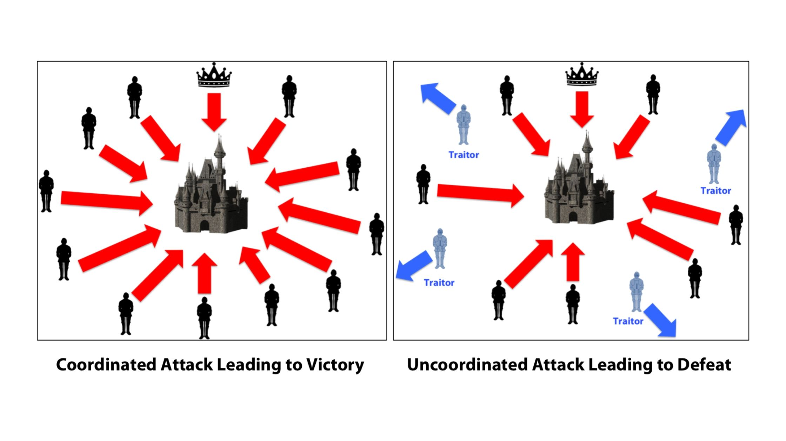
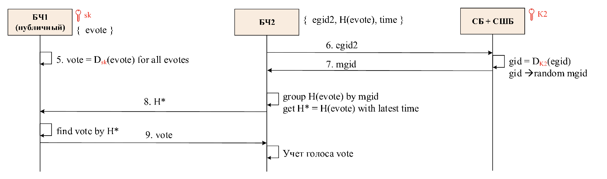

Общие вопросы
=============

Что такое блокчейн?
-------------------

Блокчейн - это децентрализованная база данных. Поясню на примере использования.

Вообразим ситуацию, что в России снова наступил 1991 год, инфляция национальной валюты измеряется сотнями процентов, и она де-факто стала непригодна для использования как средство накопления и взаиморасчетов. Поскольку наш воображаемый Центробанк ведет неадекватную денежно-кредитную политику, умельцы-компьютерщики среди местного населения решают выпустить электронные деньги и использовать их как средство взаиморасчетов.

Что требуется, чтобы осуществлять взаиморасчеты? Фактически, нужно дать возможность гражданам создавать кошельки и осуществлять между ними денежные переводы друг другу, называемые транзакциями. 

Для этого компьютерщики придумали супер-толстую распределенную электронную бухгалтерскую книгу, в которой отражены все переводы за всю историю. Такая книга и называется блокчейн. 

Каким требованиям должна отвечать эта бухгалтерская книга? 

1. Граждане должны иметь возможность осуществить денежный перевод в любой момент времени, поэтому наша бухгалтерская книга должна быть доступна в любой момент времени. Для этого книга должна быть распределена по большому количеству компьютеров, называемых узлами или нодами блокчейна. Если часть нод оказалась временно недоступна (у них пропал выход в интернет, электричество и т.п.), это не должно приводить к отказу в обслуживании системы.
2. Все ноды, образующие эту книгу, должны придерживаться единого мнения о том, какие транзакции осуществлялись. Не должно быть ситуации, что по прошествии какого-то достаточно долгого периода времени, например, часа после совершения вами транзакции, одна часть нод думает, что у вас миллион рублей, а другая - что два. Иными словами, есть только одна история, и все ноды в нее верят.
3. Если часть нод содержит злонамеренно измененный программный код, и хочет обмануть остальные ноды (например, пытается убедить всю остальную сеть, что все пользователи переводят свои деньги злоумышленнику X), такая возможность должна быть исключена, если только злоумышленник не контролирует очень большую долю нод (обычно, треть или больше).
4. Если у пользователя в кошельке есть рубль, то его нельзя потратить дважды. Если деньги ушли, то они ушли, нельзя второй раз ими заплатить.

Чтобы объяснить подробнее, как устроен блокчейн, мне потребуется объяснить следующие понятия:

 - задача Византийских Генералов и консенсус в распределенной системе
 - хеш-функция, криптография на асимметричных ключах и электронная цифровая подпись

Что такое алгоритмы консенсуса в блокчейне? Почему его невозможно «обмануть»? Как в блокчейне используется криптография?
------------------------------------------------------------------------------------------------------------------------

Консенсус в распределенной системе - это обеспечение согласованности между нодами.

Подобно тому, как "крестным отцом" науки о нейронных сетях является Джеффри Хинтон, "крестным отцом" науки о консенсусе является американский ученый в области компьютерных наук [Лесли Лэмпорт](https://en.wikipedia.org/wiki/Leslie_Lamport), занявшийся проблемой консенсуса в распределенных вычислительных системах в 1970 - 1980-ые в связи с необходимостью создания отказоустойчивых систем управления для космических спутников. 

 <center>Лесли Лэмпорт</center>

Чтобы популяризовать свои идеи, Лэмпорт любил придумывать им звучные названия. Проиллюстрировать суть распределенного консенсуса Лэмпорт решил, сформулировав проблему Византийских Генералов. 

>Скорее всего Лэмпорт имел слабое представление об истории Византии, и сначала [хотел назвать данную задачу проблемой албанских генералов](https://lamport.azurewebsites.net/pubs/pubs.html#trans). Почему албанских? А почему бы и нет, как говорил Роберт Де Ниро в ["Хвост виляет собакой"](https://en.wikipedia.org/wiki/Wag_the_Dog). Позднее Лэмпорту все-таки указали, что не совсем вежливо называть вымышленную проблему именем реально существующей страны, и он переименовал генералов в византийских, что оказалось крайне удачным названием с исторической точки зрения.

Итак, что такое задача византийских генералов или византийских отказов?

Перенесемся в конец X века: армии византийского императора [Василия II Болгаробойцы](https://ru.wikipedia.org/wiki/%D0%92%D0%B0%D1%81%D0%B8%D0%BB%D0%B8%D0%B9_II_%D0%91%D0%BE%D0%BB%D0%B3%D0%B0%D1%80%D0%BE%D0%B1%D0%BE%D0%B9%D1%86%D0%B0) под командованием нескольких генералов ведет осаду болгарской крепости. 

Задача императора - написать устав для своих генералов, который бы обеспечивал синхронность действий их армий. То есть все армии должны дружно наступать или дружно отступать, несогласованность приведет к поражению. Решению этой задачи мешают два препятствия.

 <center>Задача Византийских Генералов: на левой картинке все армии синхронно наступают - в таком случае достигается победа. На правой картинке между армиями не достигнут консенсус, и часть армий под командованием мятежных генералов отступает, в то время как преданные императору генералы наступают - поражение.</center>

Препятствие 1: недостаточно просто назначить одного генерала постоянным главнокомандующим. Любой из генералов во время боя может оказаться недоступен, временно (отрезан в пылу сражения) или постоянно (убит). 

Поэтому каждый генерал в армии, принимая решение, что делать его армии в данный момент, по уставу должен ориентироваться на мнения остальных генералов. Предположим, в армии - семь генералов. Если пять говорят “наступать”, один - “отступать” (может быть, потому что он не может адекватно оценить обстановку со своей позиции, а может он - предатель), и еще один недоступен, то солдаты считают, что между пятью генералами достигнут кворум, и следует дружно наступать.

Препятствие 2: Византийские генералы склонны к предательству. Это похоже на игру в мафию: мятежные генералы притворяются, что соблюдают устав и верны византийской государственности, но в самый ответственный момент готовятся осуществить мятеж (обманом убедив лояльных генералов, что имеется кворум с приказом “отступать”, когда на самом деле следовало “наступать”), привести армию к поражению в войне и узурпировать власть в Византии. Мятежников, как правило, все-таки меньшинство. Например, предположим, что трое из семи генералов в армии Василия - [Варда Фока](https://en.wikipedia.org/wiki/Bardas_Phokas_the_Younger), [Варда Склир](https://en.wikipedia.org/wiki/Bardas_Skleros) и [Миахил Бурцес](https://en.wikipedia.org/wiki/Michael_Bourtzes) - втайне готовят мятеж и ведут двойную игру. Эти генералы могут выдавать разную информацию разным другим узлам - кому-то говорить, что они наступают, кому-то - что отступают, с кем-то не выходить на связь. Такое ненадежное поведение элемента системы называется "[византийский отказ](https://en.wikipedia.org/wiki/Byzantine_fault)".

Соответственно, устав Василия II должен минимизировать риск, что им удастся добиться успеха. Существует целый ряд алгоритмов обеспечения такого консенсуса.

Что такое хеш-функция? Что такое публичный и приватный ключ? Что такое электронная подпись?
------------------------------------------------------------------------------------

Предположим, преданный византийский генерал [Дамиан Далассен](https://en.wikipedia.org/wiki/Damian_Dalassenos) хочет послать императору Василию II письмо с информацией о своих планах, однако дорога, по которой проезжает его гонец, оказалась под контролем предателей Фоки, Склира и Бурцеса, и те перехватили гонца и подменили документ, исправив в документе слово "наступать" на слово "отступать". Последствия могут оказаться катастрофическими. Как императору защититься от такой ситуации?

На помощь приходят два инструмента: хеш-функции и криптография на асимметричных ключах.

Хеш-функция - это функция, которая принимает на вход текст, и возвращает короткую последовательность символов заданной длины, обычно что-то вроде 64 символов. Дословно английское "хеш" означает "пропустить через терку", "нарезать", то есть вы как бы делаете салат из своего длинного документа, и получаете бессмысленную, но очень короткую последовательность символов на выходе.

Главная ценность хеш-функции состоит в том, что с помощью нее можно быстро проверить, совпадают ли два текста. Вместо того, чтобы сравнивать сами тексты, вы можете вычислить хеш-функцию от каждого из них и проверить, совпадают ли они. 

Если император Василий каким-то образом узнал хеш от исходного документа, отправленного ему генералом Дамианом, а мятежные генералы что-то изменили в тексте документа, то хеш от полученного императором измененного документа почти наверняка не совпадет с хешем исходного. Факт различия хешей двух документов гарантирует, что эти документы - разные. Император будет знать, что текст документа подменили. 

Но, возможно, мятежные генералы могут подобрать такую модификацию текста, что хотя текст изменится, хеш от него будет таким же, как у исходного документа? Такое называется "коллизия хешей". Возможно такое или нет - зависит от конкретной хеш-функции, которая используется. Хеш-функции, для которых практически невозможно подобрать коллизию, называются [криптографически стойкими](https://ru.wikipedia.org/wiki/%D0%9A%D1%80%D0%B8%D0%BF%D1%82%D0%BE%D0%B3%D1%80%D0%B0%D1%84%D0%B8%D1%87%D0%B5%D1%81%D0%BA%D0%B0%D1%8F_%D1%85%D0%B5%D1%88-%D1%84%D1%83%D0%BD%D0%BA%D1%86%D0%B8%D1%8F). Ими и следует воспользоваться.

Хорошо, как же императору надежным образом получить хеш исходного документа для проверки целостности? Для этого используется криптография на асимметричных ключах.

Вкратце, генерал Далассен выпускает пару ключей, приватный (иногда также называемый закрытым или секретным, это синонимы) и публичный. Приватный ключ он надежно хранит у себя и никому не показывает под страхом смерти, публичный же рассказывает всем и каждому.

Ключи можно использовать для шифрования текста. Текст, зашифрованный приватным ключом, можно расшифровать с помощью публичного. Текст, зашифрованный публичным ключом, можно расшифровать с помощью приватного.

Смысл этой конструкции в том, что если у вас получается расшифровать некий шифротекст публичным ключом Далассена, вы можете быть уверены, что зашифровать этот текст мог только обладатель приватного ключа Далассена (то есть только сам Далассен, если он бережно хранит свой приватный ключ).

Таким образом, чтобы гарантировать целостность документа, следует поступить так. Далассен вычисляет хеш от своего текста, дополняет его небольшим текстовым постскриптумом (например, "Привет императору от Далассена"), шифрует полученное сообщение своим приватным ключом, и прикладывает к тексту документа это шифрованное сообщение.

Император расшифровывает публичным ключом Далассена шифрованные хеш и постскрипутм. Если постскриптум получился какой-то разумный, это гарантирует ему, что только обладатель приватного ключа Далассена (то есть только сам Далассен) мог зашифровать эту часть послания. Стало быть, расшифрованный хеш можно использовать для проверки целостности остального документа. Если значение хеш-функции от текста документа совпадает с этим расшифрованным хешом, император может быть уверен, что текст не подделан.

Так работает [электронная цифровая подпись](https://en.wikipedia.org/wiki/Digital_signature). Криптография на асимметричных ключах гарантирует аутентичность послания, а хеш гарантирует его целостность.

Вернемся к устройству блокчейна
-------------------------------

Итак, мы знаем, что такое распределенный консенсус и что такое электронная цифровая подпись. У нас есть все, чтобы собрать наш блокчейн.

Каждая транзакция (денежный перевод), которую осуществляют пользователи нашей криптовалюты, должна быть зафиксирована во всех нодах.

Опасность, с которой мы можем столкнуться, состоит в том, что часть нод-участников блокчейна использует измененную версию программного кода, и пытается обмануть систему, присвоив себе чужие деньги.

Чтобы потратить деньги в нашем блокчейне, нужно обладать приватным ключом от кошелька, на котором лежат деньги, и отправить запрос на осуществление транзакции перевода денег с этого кошелька на другой одной из нод блокчейна. Тут работает описанный выше механизм цифровой подписи, гарантирующий, что только владелец приватного ключа мог отправить такой запрос.

Чтобы убедиться, что пользователь не пытается второй раз потратить деньги, которые уже были им однажды потрачены, ноды проверяют, не содержится ли уже хеш данной транзакции в истории транзакций. Если достаточное количество нод блокчейна придет к распределенному консенсусу по вопросу, что транзакция не пытается повторно потратить деньги, ее одобряют и записывают.

Блокчейн ("цепь блоков") называется так, как называется, потому что реально транзакции проверяют и записывают не по одной, а последовательными блоками из большого количества транзакций, и из этих блоков создается цепочка.

В контексте ДЭГ активно использовалось понятие «нода наблюдателя». Что такое ноды в блокчейне? 
----------------------------------------------------------------------------------------------

Нода - узел. Просто компьютер, на котором установлена программа для участия в блокчейне.

Нода наблюдателя - это нода блокчейна, имеющая доступ только на чтение. С него можно посмотреть, что записывается в блокчейн, но валидировать и записывать транзакции нельзя.


Существовали ли в истории случаи взлома блокчейна? Насколько вероятно, что современный блокчейн (вроде того, что использовался в ДЭГ) может быть сломан? Может ли блокчейн быть компрометирован извне?
------------------------------------------------------------------------------------------------------------------------------------------------------------------------------------------------------

Начнем с простого: если более трети или более половины вычислительных мощностей нод находятся в руках одной группы лиц, они могут творить все, что им заблагорассудится, включая двойную трату денег (ну или в случае выборов скорее актуально двойное голосование).

Это называется атакой 51%, и случалось [неоднократно](https://habr.com/ru/company/pt/blog/425951/) с криптовалютами. Один из самых крупных инцидентов - с Bitcoin Gold, он привел к краже $18 миллионов и делистингу этой криптовалюты с ряда бирж.

В случае выборов 100% нод находятся под контролем государства (тут используется модель Public Permissioned, при которой в блокчейн не могут вступить произвольные ноды - все они в руках государства).

В этом плане я вижу мало смысла в применении блокчейна, если все узлы в руках одной группы лиц. Вот если бы любой россиянин мог поднять собственную ноду и таким образом большая часть вычислительных мощностей оказалась в руках граждан - тогда это имело бы смысл. А в нынешнем формате использование блокчейна на выборах является или пустым PR-ходом, спекуляцией на ауре неподкупности блокчейна, или нереализованными благими намерениями технарей из ДИТа или Касперского, которые хотели сделать все честно и по науке, но у их менеджеров оказались другие приоритеты.


Для достижения анонимности голосования в ДЭГ использовалось проксирование. Что из себя представляет прокси-сервер? Как он позволяет анонимизировать избирателей? Может ли прокси-сервер быть скомпрометирован?
--------------------------------------------------------------------------------------------------------------------------------------------------------------------------------------------------------------

Перед тем, как выдать пользователю электронный бюллетень, форма голосования должна проверить, что он действительно проживает в округе, в котором хочет голосовать и зарегистрирован для голосования.

Для этого ей нужны учетные данные пользователя с сайта mos.ru или Госуслуг. Однако позволять дальше "гулять" этим данным в открытом виде по блокчейну нельзя, чтобы сохранить тайну голосования.

Соответственно, каждому бюллетеню ставится в соответствие некий шифрованный идентификатора избирателя под названием egid ("encrypted group id"). Этот идентификатор кладется в приватный, закрытый от наблюдателей, блокчейн, так называемый "БЧ2". Этого блокчейна наблюдателям не видим, нам доступен только публичный блокчейн "БЧ1". О двух блокчейнах я расскажу ниже. 

Для такой вот анонимизации учетных данных пользователей и используется сервис, который сотрудники ДИТ называют "анонимайзер". Более детально в его функционировании я пока не разобрался.

В любом случае, если у государства есть доступ к учетным данным с mos.ru и Госуслуг, к анонимайзеру и к обоим блокчейнам, то, по моим представлениям, это позволяет государству впоследствии про каждого человека установить, как он проголосовал. Поэтому в моем понимании анонимность выборов в полной мере не гарантируется. То есть ваш начальник цеха на заводе не узнает, как вы проголосовали, но вот условный подполковник Андрейченко, который будет проводить "разбор полетов" по итогам голосования, - думаю, что может.  

Вопросы про выборы
==================

Как применялась технология блокчейна к выборам? Известны ли вам случаи применения блокчейна к выборам в мире? 
-------------------------------------------------------------------------------------------------------------

Когда вы организуете электронные выборы, вы сталкиваетесь с дилеммой: с одной стороны нужно сохранить тайну выборов, чтобы нельзя было посмотреть, как голосовал каждый конкретный человек, а с другой - нужно, чтобы исход выборов был проверяем.

Я слышал только про [пример Эстонии](https://habr.com/ru/company/wirex/blog/396095/), где для цифровых выборов использовали блокчейн. Так вот, [там просто пожертвовали анонимностью](https://habr.com/ru/post/574360/). То есть про каждого человека можно узнать, как он голосовал, зато можно и проверить результаты голосования.

Российские системы электронного голосования (федеральная и московская) ставили своей целью обеспечение анонимности, однако по итогам система получилась столь сложной и запутанной, что в случае наших электронных выборов нельзя гарантировать ни анонимности, ни честного подсчета результатов.

Может быть, из-за отсутствия анонимности даже имело бы смысл опасаться возмездия за нелояльность со стороны властей, однако в контексте того, что по данным социологических [опросов ВЦИОМ](https://wciom.ru/ratings/reiting-politicheskikh-partii) порядка 70% населения и так настроено против руководящей и направляющей партии, придется наказывать более 2/3 населения, что имеет мало смысла.

Согласно сайту observer.mos.ru для ДЭГ была выбрана модель Public Permissioned на блокчейне Exonum с алгоритмом консенсуса PBFT (Practical Byzantine Fault Tolerance). В чем отличительные особенности модели Public Permissioned, блокчейна Exonum и алгоритма консенсуса PBFT от аналогов?
--------------------------------------------------------------------------------------------------------------------------------------------------------------------------------------------------------------------------------------------------------------------------------------------

Нормальный децентрализованный блокчейн, находящийся под управлением граждан, который я описывал выше, исповедует модель Permissionless - то есть система децентрализована, и ноды, имеющие право проверять и подтверждать транзакции, находятся в руках широкой общественности.

В московских выборах использовалась другая модель - Permissioned - в этой модели ноды, имеющие право одобрять транзакции, находятся в руках узкого круга лиц - в нашем случае государства.

То есть как таковая децентрализация отсутствует. Единственное, в чем обществу пошли на встречу - это то, что она все-таки Public Permissioned - то есть есть публичные ноды, которые не могут писать, но могут читать блокчейн. Бывает также модель Private Permissioned, когда нельзя и читать.

[Practical Byzantine Fault Tolerance](http://www.pmg.csail.mit.edu/papers/osdi99.pdf) - один из алгоритмов распределенного консенсуса, предложенный в 1999 году знаменитой ученой-теоретиком компьютерных наук Барбарой Лисков и Мигелем Кастро.

В сущности, с учетом того, что используется модель Permissioned, все ноды с правом записи находятся в руках одной группы лиц, я не вижу необходимости в защите именно от византийских отказов (зловредных нод-предателей, пытающихся обмануть остальные). Ну разве что это защищает от того, что внутри ДИТа завелись злоумышленники, которые захватили контроль над частью нод. Но кажется, что это маловероятный сценарий, и достаточно было просто гарантировать отказоустойчивость и отсутствие двойных трат. С первым условием справились бы и классические алгоритмы консенсуса [Paxos или Raft](https://www.programmersought.com/article/42314543427/), которые используются в популярных распределенных системах типа Kubernetes, Kafka/Zookeeper, Ceph и т.п.

На Хабре есть [описание алгоритма консенсуса от самих разработчиков Exonum, компании Bitfury](https://habr.com/ru/company/bitfury/blog/440586/). 


Может ли быть такое, что созданная система устойчива к атакам извне, однако неустойчива к классическим методам фальсификации: к каруселям, вбросам, удалению наблюдателей, использованию «исчезающих чернил», подкупу и шантажу избирателей? Может ли технология блокчейна обезопасить избирателей от какого-либо из этих происшествий? Может ли существовать в каком-либо виде электронная карусель, электронный вброс, электронные исчезающие чернила?
--------------------------------------------------------------------------------------------------------------------------------------------------------------------------------------------------------------------------------------------------------------------------------------------------------------------------------------------------------------------------------------------------------------------------------------------------------

Да, так и есть, исходя из описания архитектуры и исходного кода данной системы, я считаю, что она не гарантирует устойчивость к классическим методам фальсификации. Есть все основания опасаться, что ими могли воспользоваться злоумышленники для фальсификации результатов ДЭГ.

#### "Мертвые души" среди участников голосования?

Самая очевидная поверхность атаки - это "мертвые души". Аутентификация для участия в выборах производится через внешние 
системы mos.ru/СУДИР и федеральные Госуслуги. Эти системы находятся в руках государства, идентификаторы, полученные из них,
многократно обфусцируются и до публичного блокчейна вообще не доходят, поэтому возможности проверить, не проголосовал ли,
например, покойник нет.

#### Вбросы?

Могли ли проголосовать за Вас дистанционно, если Вы сами не пошли на выборы вообще или голосовали очно?

При поверхностном ознакомлении с публичными данными о процессе регистрации избирателей, я не увидел очевидных вбросов. 

Всего для участия в ДЭГ было зарегистрировано порядка 2.01 миллиона человек. 

Идем на сайт [подачи и проверки заявок](https://www.mos.ru/proverka-deg/) на участие в электронном голосовании. Там можно выкачать табличный [.csv-файл](https://www.mos.ru/proverka-deg/) со всеми поданными заявками. В нем - действительно 1.9 миллиона заявок, как и утверждает сайт. Сайт утверждает, что из них только 1.65 миллиона - одобрено.

Стало быть, порядка 350 тысяч человек пришли не из Московской системы регистрации, а из федеральной. Московский сайт проверки утверждает, что на госуслугах было подано 455 230 заявок, часть из них, видимо, отклонили. Проценты отклоненных заявок на московском и федеральном сайтах примерно похожи.

Вот [спредшит в Google Docs](https://docs.google.com/spreadsheets/d/1gVHMrxHurtBFWbYUOXKVjYHxsv15SD1CYcw5g37tZCA/edit#gid=1814233069), коллеги в нем построили более детальное разбиение по административным округам и т.п.

В Москве всего чуть менее 7.5 миллионов избирателей, объявлено, что явка - 50%. Стало быть где-то 3.7 миллиона человек должно было проголосовать всего, очно + ДЭГ, примерно пополам. Однако в погрешностях этих оценок и зарыта собака.

#### Удаление наблюдателей

Да, процесс подсчета голосов был максимально непрозрачен и невоспроизводим для широкой общественности. Ссылаюсь на [интервью Дениса Шендеровича](https://echo.msk.ru/news/2907214-echo.html) и [Ильи Сухорукова](https://novayagazeta.ru/articles/2021/09/21/mazhoritarnaia-sistema-vyborov), где они повествуют о том, что сотрудники ФСБ отрубили ноду наблюдателя, веб-программист ЦИКа нес откровенную ахинею, отказываясь показывать Developer Tools. Воспроизвести итоги подсчета голосов, пользуясь имеющимися у нас SQL-дампом публичного блокчейна и исходным кодом, невозможно. 

#### Исчезающие чернила: переголосование?

В данный момент одна из самых исследуемых айтишниками версий - это что переголосование могло быть и было использовано, чтобы передать голоса другой партии. 

Напрямую по публичному блокчейну без приватного это не проверить. Приватный блокчейн не показывают. Приходится всячески ухищряться, чтобы найти косвенные свидетельства, но это требует значительного количества времени и усилий.

#### Прочее

Мне пока не удалось воспроизвести сообщение Анастасии Брюхановой о найденных последовательных блоках транзакций с низкой явкой в 80% при том, что реальная явка на ДЭГ - порядка 95%. Если удастся воспроизвести - это будет сильное свидетельство в пользу наличия вбросов.


В случае, если на реальном участке происходит вброс — часто видны пачки бюллетеней в избирательных урнах. Если происходит карусель — на разных участках можно зарегистрировать одинаковых избирателей. Как, на ваш взгляд, технология блокчейна соотносится с прозрачностью голосования? Является ли ДЭГ более прозрачным, чем аналоговое голосование? 
------------------------------------------------------------------------------------------------------------------------------------------------------------------------------------------------------------------------------------------------------------------------------------------------------------------------------------------------------

#### Спасибо ДИТу, без иронии

Вообще-то я хочу сказать большое спасибо технарям из ДИТа города Москвы и Касперского, которые сделали целый ряд беспрецедентных шагов, чтобы обеспечить какую-то прозрачность голосования: открыли исходный код части проекта, открыли для скачивания SQL-дамп одного из блокйчейнов (но второй и главный, приватный, закрыт), опубликовали страницу ВИО и часть документации по запросам, отвечают на вопросы специалистов на очных собраниях рабочих групп, в Телеграм-каналах и на радио. Это очень близко к тому, как должен выглядеть диалог власти и общества в цивилизованной стране.

#### Операция прошла успешно, но пациент умер

Однако, несмотря на все усилия айтишников из ДИТа московского правительства и Касперского, в нынешней реализации ДЭГ является даже более непрозрачным, чем худшие примеры бумажных голосований, которые мы наблюдали в 2010-ые.

Итоги ДЭГ не вызывают доверия.

#### Блокчейн на выборах используется не по назначению и только зря отвлекает внимание от сути

Весь смысл блокчейна состоит в том, что его ноды контролируются разными людьми. А в данном случае все они - под контролем государства. Соответственно, оно что хочет в него, то и пишет. С тем же успехом можно было использовать обычную шину сообщений вроде Apache Kafka, и не морочить никому голову.

#### Блокчейнов два: публичный и приватный

Когда были подведены итоги выборов, мы полезли в дамп блокчейна, доступный для скачивания, и увидели, что 700 тысяч бюллетеней из 2 миллионов в нем до сих пор не расшифрованы. Что за абсурд, как можно было подвести итоги выборов, не расшифровав все голоса?

Я думаю, что на самом деле, все транзакции все-таки были расшифрованы, просто тот SQL-дамп, который предоставляется широкой общественности, устарел и не обновляется. 

Еще более важный факт: оказалось, что блокчейнов два - публичный и приватный. Для воспроизведения итогов выборов необходимы данные приватного, которого у нас нет.


#### Другие поверхности атак

Но главное - для фальсификации выборов есть другие поверхности атаки, и вот от них гораздо больше причин ждать подвоха.

Я по-прежнему не представляю, как проверить, что не было мертвых душ и вбросов. Как проверить итоги переголосования?


Подведение итогов выборов в Москве затянулось на 14 часов. Официальная версия заключается в том, что полученная задержка была связана с переголосованием. Так как каждая транзакция анонимна, для вычисления переголосовавших потребовалось какое-то большое количество операций. Не могли бы вы прокомментировать, жизнеспособно ли такое объяснение? В чем заключаются технические сложности такого подсчёта голосов? Происходит ли на этом этапе их расшифровка?
-------------------------------------------------------------------------------------------------------------------------------------------------------------------------------------------------------------------------------------------------------------------------------------------------------------------------------------------------------------------------------------------------------------------------------------------------------------------

Подведение итогов состоит из 3 частей.

#### Часть 1

Перед началом выборов 16 сентября создавался специальный секретный ключ расшифровки, который был разделен, если мне не изменяет память, на 7 частей (prooflink'а нет - информация из группы в Телеграме).

В криптографии есть еще такая изящная схема [Shamir Secret Sharing](https://en.wikipedia.org/wiki/Shamir%27s_Secret_Sharing), когда Вы разделяете секретный ключ, к примеру, на 7 частей, и раздаете эти части разным людям (в данном случае - членам избирательной комиссии), и достаточно собрать вместе любые 5 частей, чтобы восстановить секретный ключ обратно. Насколько я вижу по [коду](https://github.com/BurkovBA/blockchain-voting_2021/tree/main/blockchain/key-generator-source/rusty_secrets), ее и использовали.

Этот ключ используется для расшифрования транзакций в публичном блокчейне.

Соответственно, после окончания голосования 19 сентября, был проведен ритуал восстановления ключа - это достаточно быстро должно делаться.

#### Часть 2

Далее, с помощью этого ключа производилась расшифровка транзакций. Поясню: вот эти 2 с небольшим миллиона транзакций типа "Прием бюллетеня", что лежат в блокчейне, теперь нужно было расшифровать в бюллетени.

Надо сказать, что в SQL-дампе публичного блокчейна это до конца так и не было сделано - там до сих пор лежат 700 тысяч нерасшифрованных транзакций, только 1.3 миллиона расшифровано. То есть либо дамп перестал обновляться (склоняюсь к этому варианту), либо публичный блокчейн не использовался для подведения итогов выборов, и это было сделано по приватному блокчейну, которого у нас нет. Версия, что публичный блокчейн не использовался, противоречит описанию алгоритма расшифровки от ДИТа.

Что касается затрат времени, [ссылаюсь на Петра Жижина](https://habr.com/ru/post/579350/), он расшифровывал транзакции в 24 процесса на обычном сервере, и все посчиталось за полчаса, результаты для тех 1.3 миллионов транзакций, которые все-таки были расшифрованы избирательной комиссией в SQL-дампе и для этих же транзакций, независимо расшифрованных Петром, сошлись.

#### Часть 3

Далее нужно было среди результатов голосования в публичном блокчейне отсеять голоса, отмененные переголосованием. Когда буду рассказывать про переголосование, объясню, как это делалось, но по всей логике это тоже не должно занимать очень много времени.

#### Вывод

В целом, на технику 14 часов уйти не могло.

Может ли блокчейн в каком-то виде хранить данные о переголосовавших? Как понять, кто переголосовал, в общем блокчейне?
----------------------------------------------------------------------------------------------------------------------

По публичному блокчейну невозможно отличить переголосование от первичного голосования.

Эти данные можно получить только из приватного блокчейна, так называемого БЧ2, но его данные широкой публике не предоставляются. Подробно объясню механику ниже.

Дело в том, что поскольку была задача в какой-то мере сохранить тайну голосования, идентификаторы пользователей ни на одном из этапов не хранятся в открытом виде ни в одном из блокчейнов. Голоса вообще анонимизированы, понять, глядя на публичный блокчейн, что какие-то две транзакции - от одного человека - невозможно.

Чтобы выловить повторные голосования, ДИТ делал следующую вещь: они в приватном блокчейне хранили для бюллетеней зашифрованные идентификаторы пользователя (обозначали их как egid2 на схеме). 

При подведении итогов голосования сотрудники ДИТ вычисляли по ним временные идентификаторы пользователя под названием mgid 
(чтобы при этом не "засветить" учетные данные пользователя даже в приватном блокчейне). 

После этого для каждого mgid (фактически, пользователя) находили все его голоса в публичном блокчейне. И далее оставляли из них только последний. То есть если вы проголосовали дважды или трижды, считается только последний голос.

<center>Схема алгоритм расшифровки результатов голосования. Обозначения: БЧ1 - публичный блокчейн ("блокчейн 1"), БЧ2 - приватный блокчейн ("блокчейн 2"), СБ+СШБ - [сервис бюллетеней](https://github.com/BurkovBA/blockchain-voting_2021/tree/main/form/ballot/src) + сервис шифрованных бюллетеней, vote - голос, evote - зашифрованный голос ("encrypted vote"), sk - секретный ключ ("secret key"), восстановленный 19 сентября по схеме Shamir Secret Sharing, $D_{sk}(evote)$ - расшифрованный секретным ключом шифрованный голос ("decrypt with secret key encrypted vote"), egid2 - несколько огрубляя, зашифрованный неким ключом K2 идентификатор пользователя из внешних систем mos.ru/СУДИР или Госуслуг ("encrypted group id 2"), gid - расшифрованный анонимизатором идентификатор пользователя в mos.ru/СУДИР или Госуслуг ("group id"), mgid - временный идентификатор пользователя ("modified group id"), H* - хеш зашифрованного голоса, по которому его можно найти в публичном блокчейне БЧ1</center>


Если вы ничего не поняли, вы не одиноки. Все IT-шники несколько дней бились головой об стену, пытаясь понять эту схему. Очень запутанно, а главное, ни одна из двух целей в полной мере не достигнута. Ни анонимности голосования, ни его проверяемости такая схема все равно не обеспечивает.  


Блокчейн ДЭГ содержит несколько различных типов транзакций (расшифровка бюллетеня, прием бюллетеня и т.д). В чем отличие этих типов транзакций друг от друга, помимо поля с идентификатором транзакции? Может ли как-нибудь отличаться их обработка? 
----------------------------------------------------------------------------------------------------------------------------------------------------------------------------------------------------------------------------------------------------

В SQL-дампе публичного блокчейна - более 7.3 миллионов транзакций, около 500 тысяч блоков и около 1.3 миллионов расшифрованных бюллетеней.

Соответственно, в каждом блоке около 13-14 транзакций в среднем.

У каждой транзакции есть поле method_id, которое характеризует ее тип:


|method_id | Тип Транзакции                           |
|----------|------------------------------------------|
| 0	      |    Создание голосования                   |
| 1	      |    Регистрация избирателей                |
| 2	      |    Остановка регистрации избирателей      |
| 3	      |    Отказ избирателя от онлайн-голосования |
| 4	      |    Выдача бюллетеня                       |
| 5	      |    Проверка доступа голосующего           |
| 6	      |    Приём бюллетеня                        |
| 7	      |    Остановка приёма бюллетеней            |
| 8	      |    Публикация ключа расшифровки           |
| 9	      |    Расшифровка бюллетеня                  |
| 10	  |    Завершение голосования                 |
| 11      |    Завершение голосования с результатом   |

У разных типов транзакций - разная полезная нагрузка (payload). К примеру, транзакция типа "Создание голосования" (она такая одна) несет в качестве полезной нагрузки идентификаторы кандидатов по одномандатным округам `transactions.iloc[1].payload['ballots_config']`:

```json
[{'district_id': 196,
  'question': 'Вопрос 196?',
  'options': {'111906259': 'БАЖЕНОВ Тимофей Тимофеевич',
   '122700157': 'ВИХАРЕВА Эльвира Владимировна',
   '133291000': 'ИВАНОВА Елена Ивановна',
   '141308253': 'КРЮКОВ Алексей Сергеевич',
   '152156829': 'МАЛИНКОВИЧ Сергей Александрович',
   '162418401': 'МИРОНОВА Виктория Александровна',
   '174344765': 'РАШКИН Валерий Федорович',
   '183702330': 'РВАЧЕВ Алексей Сергеевич',
   '194274433': 'СТРЕЛЬНИКОВА Елена Николаевна',
   '201139163': 'ТАРАСОВ Антон Александрович',
   '212390260': 'ФЕДОРОВ Георгий Владимирович',
   '222841765': 'ЯНКОВ Кирилл Вадимович'},
  'min_choices': 1,
  'max_choices': 1},
 {'district_id': 197,
  'question': 'Вопрос 197?',
  'options': {'112948545': 'БАЛЬМОНТ Борис Александрович',
   '121228808': 'ГЛЕК Игорь Владимирович',
   '133729198': 'ГОНЧАРОВ Кирилл Алексеевич',
   '143869387': 'ГОРШКОВА Владислава Геннадиевна',
   '153770437': 'ЛОБАНОВ Михаил Сергеевич',
   '164058398': 'МЕНЬШИКОВ Михаил Васильевич',
   '172847716': 'МИТИНА Дарья Александровна',
   '182884641': 'ПОПОВ Евгений Георгиевич',
   '191674835': 'РАМЕНСКИЙ Павел Олегович',
   '203148964': 'СОБОЛЕВ Алексей Анатольевич',
   '214204906': 'ТАРНАВСКИЙ Александр Георгиевич'},
  'min_choices': 1,
  'max_choices': 1},
 {'district_id': 198,
  'question': 'Вопрос 198?',
  'options': {'111204609': 'АНДРИАНОВА Зоя Алексеевна',
   '122009226': 'БАЛАБУТКИН Алексей Алексеевич',
   '136749451': 'БРЮХАНОВА Анастасия Андреевна',
   '142468224': 'ВЛАСОВ Василий Максимович',
   '157285757': 'ГОЛУЕНКО Алиса Владимировна',
   '161425025': 'ЗВЯГИНЦЕВ Петр Семенович',
   '173775569': 'КАТАЕВ Виктор Филиппович',
   '182869636': 'ЛИТВИНОВИЧ Марина Алексеевна',
   '195220516': 'МЕЛЬНИКОВ Алексей Владимирович',
   '204799627': 'ТАРБАЕВ Сангаджи Андреевич',
   '217404809': 'ХОВАНСКАЯ Галина Петровна'},
  'min_choices': 1,
  'max_choices': 1},
 {'district_id': 199,
  'question': 'Вопрос 199?',
  'options': {'115259080': 'БАДМАЕВ Владимир Владимирович',
   '122086290': 'БАЛЫКОВА Анна Григорьевна',
   '131068217': 'ГУЛИНА Зинаида Ивановна',
   '147971856': 'ГУЛИЧЕВА Елена Геннадьевна',
   '151633790': 'КАТКОВ Валерий Семенович',
   '163072915': 'КИСЕЛЁВ Роман Денисович',
   '173759412': 'КУЛЬНЕВ Иван Анатольевич',
   '182777504': 'ПРОХОРЕНКОВА Мария Андреевна',
   '191484047': 'РАШКИН Валерий Владимирович',
   '202677136': 'ТАРАСОВ Денис Васильевич',
   '216438542': 'ТОЛСТОЙ Петр Олегович',
   '221327967': 'ШАХ Андрей Викторович',
   '232823151': 'ШОЛАДЕМИ Самсон Бартоломиувич'},
  'min_choices': 1,
  'max_choices': 1},
 {'district_id': 200,
  'question': 'Вопрос 200?',
  'options': {'113402633': 'АНИСИМКОВА Полина Николаевна',
   '123942837': 'АРБУЗОВ Андрей Александрович',
   '134233818': 'БАБУШКИН Андрей Владимирович',
   '142659554': 'ВЕЛЬМАКИН Михаил Вадимович',
   '152913065': 'ЗАГРЕБНОЙ Юрий Леонтьевич',
   '161215880': 'ЗАПОТЫЛОК Евгений Васильевич',
   '171970364': 'ОРЛОВ Михаил Викторович',
   '181315508': 'ПАРФЕНОВ Денис Андреевич',
   '193509934': 'ПЕВЦОВ Дмитрий Анатольевич',
   '203712653': 'СТЕПКИН Евгений Валериевич'},
  'min_choices': 1,
  'max_choices': 1},
 {'district_id': 201,
  'question': 'Вопрос 201?',
  'options': {'119350747': 'АБДУГАНИЕВ Назиржон Насибжонович',
   '122838609': 'БЕРНЕВ Владимир Владимирович',
   '133873843': 'ГАСПАРЯН Армен Сумбатович',
   '141896105': 'ДЕМИН Алексей Викторович',
   '151460175': 'КУЛИКОВ Денис Павлович',
   '162832179': 'РАЗВОРОТНЕВА Светлана Викторовна',
   '171694897': 'ТУМАНОВ Глеб Николаевич',
   '182029621': 'УДАЛОВА Анна Михайловна',
   '191715167': 'УДАЛЬЦОВА Анастасия Олеговна',
   '203215148': 'ЧЕРНИКОВ Станислав Валентинович'},
  'min_choices': 1,
  'max_choices': 1},
 {'district_id': 202,
  'question': 'Вопрос 202?',
  'options': {'114042076': 'АНДРУСЕНКО Наталия Юрьевна',
   '125210182': 'БОГАТОВ Сергей Владимирович',
   '131039142': 'ГЕРШБЕРГ Евгения Игоревна',
   '141876154': 'ЛАПШОВ Алексей Сергеевич',
   '153469885': 'МАХНИЦКИЙ Данил Павлович',
   '162366706': 'МИХАЙЛОВСКИЙ Александр Всеволодович',
   '176439030': 'МУРАТОВА Юлия Валерьевна',
   '182781790': 'ПРИДОРОЖНЫЙ Алексей Николаевич',
   '191070849': 'САБЛИН Дмитрий Вадимович',
   '202834593': 'СИДНЕВ Виктор Владимирович',
   '211988217': 'СУХАНОВ Игорь Владимирович'},
  'min_choices': 1,
  'max_choices': 1},
 {'district_id': 203,
  'question': 'Вопрос 203?',
  'options': {'111915817': 'АНИСИМОВА Светлана Геннадьевна',
   '127538889': 'ГУРЕВИЧ Илья Валерьевич',
   '134860237': 'КАЗЕНКОВ Олег Юрьевич',
   '142334949': 'НИФАНТЬЕВ Евгений Олегович',
   '154111730': 'ПЕНКИН Павел Владимирович',
   '161876480': 'ПЕТРОВ Василий Александрович',
   '173789580': 'ПЕТРОВ Виталий Владимирович',
   '182951820': 'СМОЛИЧ Алиса Андреевна',
   '191893360': 'ТУРУШЕВ Евгений Иванович',
   '202587676': 'ШЛЯМИНА Ксения Михайловна',
   '218905649': 'ШУШЛЕБИНА Наталья Алексеевна',
   '221520099': 'ЮДИН Лев Игоревич'},
  'min_choices': 1,
  'max_choices': 1},
 {'district_id': 204,
  'question': 'Вопрос 204?',
  'options': {'113246509': 'БУЦКАЯ Татьяна Викторовна',
   '122227245': 'ГРОМЫКО Михаил Владимирович',
   '131645885': 'ДВОРАК Николай Васильевич',
   '141401155': 'ДОМОЖИРОВА Ксения Валерьевна',
   '154006393': 'ИГНАТЬЕВ Валентин Сергеевич',
   '163411515': 'ИЗМАЙЛОВ Сергей Михайлович',
   '179186541': 'КАВКАЗСКИЙ Николай Юрьевич',
   '181932997': 'КУРГАНОВ Юрий Михайлович',
   '191550503': 'КУРГАНСКИЙ Сергей Борисович',
   '201349920': 'МОНАХОВ Михаил Игоревич',
   '214198569': 'ПРЕСНЯКОВ Константин Михайлович',
   '223017600': 'ПРОХАНОВ Василий Александрович',
   '235148121': 'ШУВАЛОВ Антон Николаевич',
   '242892916': 'ЯШИН Алексей Павлович'},
  'min_choices': 1,
  'max_choices': 1},
 {'district_id': 205,
  'question': 'Вопрос 205?',
  'options': {'111366669': 'ВАССЕРМАН Анатолий Александрович',
   '123901395': 'ГЛАДКОВА Юлия Генриховна',
   '131157679': 'ДЕМЧЕНКО Вячеслав Олегович',
   '142224115': 'ЗАГОРДАН Надежда Леонидовна',
   '155914328': 'ИЩЕНКО Никита Сергеевич',
   '163804873': 'КОРЯГИНА Наталья Григорьевна',
   '171274518': 'КОСТЫЧЕВА Марина Александровна',
   '181220082': 'МЕДВЕДЕВ Антон Владимирович',
   '191309977': 'ОБУХОВ Сергей Павлович',
   '204289983': 'ПОПОВА Алена Владимировна',
   '212963660': 'СИДОРОВ Ярослав Северович'},
  'min_choices': 1,
  'max_choices': 1},
 {'district_id': 206,
  'question': 'Вопрос 206?',
  'options': {'113295795': 'АЛЫРИН Святослав Игоревич',
   '122648962': 'АНДРОПОВ Сергей Николаевич',
   '131635289': 'ВАСИЛЬЕВ Александр Михайлович',
   '143715510': 'ГРЕБЕННИК Андрей Вадимович',
   '151508114': 'ИВАНОВА Мария Михайловна',
   '165055597': 'КОПКИНА Ирина Николаевна',
   '178404279': 'МАЖУГА Александр Георгиевич',
   '182760660': 'МИШАРИН Михаил Юрьевич',
   '193533662': 'ПОНОМАРЕВ Михаил Александрович',
   '201612799': 'ЦЫБА Алексей Николаевич'},
  'min_choices': 1,
  'max_choices': 1},
 {'district_id': 207,
  'question': 'Вопрос 207?',
  'options': {'115873463': 'БЕЛЫХ Ирина Викторовна',
   '123561430': 'ДЕМИН Сергей Аркадьевич',
   '131038065': 'МАКАРЕНКО Дмитрий Григорьевич',
   '143207944': 'МИЛОВАНОВ Вячеслав Анатольевич',
   '151883021': 'ПАВЛИНОВ Аркадий Борисович',
   '162583844': 'ПАНГАЕВ Андрей Валерьевич',
   '173057518': 'СЕРАФОНТОВ Евгений Алексеевич',
   '181152242': 'СОЛОВЬЕВ Степан Геннадьевич',
   '191257530': 'УЛЬЯНОВ Илья Михайлович',
   '201300157': 'УЛЬЯНОВ Сергей Александрович',
   '213415260': 'УЛЬЯНЧЕНКО Иван Викторович',
   '221857832': 'ХАЗИН Михаил Леонидович',
   '231258737': 'ЮРЧЕНКО Юрий Петрович'},
  'min_choices': 1,
  'max_choices': 1},
 {'district_id': 208,
  'question': 'Вопрос 208?',
  'options': {'111337646': 'ВИННИЦКАЯ Татьяна Геннадьевна',
   '121115662': 'ЗАХАРОВ Дмитрий Александрович',
   '135833509': 'КОШЛАКОВ-КРЕСТОВСКИЙ Дмитрий Владимирович',
   '149646701': 'ЛЕОНОВ Олег Юрьевич',
   '153878280': 'МИТРОХИН Сергей Сергеевич',
   '161032698': 'ОСТАНИНА Нина Александровна',
   '179461152': 'ХАРАИДЗЕ Кетеван Гурамовна',
   '188459041': 'ШЕВЧЕНКО Максим Леонардович',
   '191711618': 'ШИРОКОВ Андрей Вячеславович',
   '203820493': 'ЮШИН Анатолий Павлович',
   '211191184': 'ЯКУБОВИЧ Яков Борисович',
   '222709186': 'ЯНДИЕВ Магомет Исаевич'},
  'min_choices': 1,
  'max_choices': 1},
 {'district_id': 209,
  'question': 'Вопрос 209?',
  'options': {'114082593': 'БАКЛАНОВ Александр Александрович',
   '129971252': 'ВОЛКОВ Алексей Анатольевич',
   '131860637': 'ВОЛКОВ Николай Юрьевич',
   '142905091': 'ИЛЬИН Роман Анатольевич',
   '153090236': 'МАКСИМОВ Юрий Николаевич',
   '164133981': 'НИКОЛАЕВ Игорь Алексеевич',
   '172595489': 'ПАЛЮЛИН Антон Юрьевич',
   '182247230': 'РУМЯНЦЕВ Александр Григорьевич',
   '191798290': 'ЧИРКОВ Максим Андреевич',
   '204059760': 'ШУПЕНЯ Даниил Сергеевич'},
  'min_choices': 1,
  'max_choices': 1},
 {'district_id': 210,
  'question': 'Вопрос 210?',
  'options': {'112984909': 'БАРМЕНКОВ Евгений Валерьевич',
   '123550582': 'БАТАШЕВ Анатолий Геннадьевич',
   '131683581': 'БУТКЕЕВ Владимир Анатольевич',
   '142950973': 'КОРШУНКОВ Владислав Сергеевич',
   '154088773': 'КРАПУХИН Алексей Игоревич',
   '162357220': 'НАЧЕВСКИЙ Михаил Владимирович',
   '172154321': 'РОМАНЕНКО Роман Юрьевич',
   '183730917': 'СМИТИЕНКО Степан Борисович',
   '193846930': 'ТАРАНЦОВ Михаил Александрович',
   '203914631': 'ТАРАЩАНСКИЙ Леонид Асирович',
   '213814092': 'ЯЦЕВСКИЙ Артемий Андреевич'},
  'min_choices': 1,
  'max_choices': 1}]
```

Другие типы транзакций несут другую информацию. С точки зрения анализа итогов голосования интересен прежде всего четвертый и шестой типы транзакций - "Выдача бюллетеня" и "Прием бюллетеня" - таких транзакций всего 1 987 373 и 2 021 969 штук соответственно.

Следует понимать, что когда человек голосует в первый раз, и когда он пытается переголосовать, обе эти транзакции попадают в публичный блокчейн как "Прием бюллетеня", хотя "Выдача бюллетеня" была только одна.  Поэтому принятых бюллетеней больше, чем выданных, а в составе 2 021 969 транзакций "Прием бюллетеня" имеется дублирование, и их надо чистить - оставив для каждого избирателя только его последнее решение, а предыдущие удалив.

Ссылки
------
 - https://lamport.azurewebsites.net/pubs/pubs.html#trans - автобиография Лессли Лэмпорта
 - https://en.wikipedia.org/wiki/Category:Generals_of_Basil_II - список генералов Василия II Болгаробойцы
 - https://academy.ivanontech.com/blog/byzantine-generals-problem-an-introduction - неплохая статья о Блокчейне и Византийских генералах
 - https://businessfm.kz/business/finance/kak-ustroeny-algoritmy-konsensusa-v-blokchejnah - зоопарк алгоритмов консенсуса в блокчейнах
 - https://habr.com/ru/post/579350/ - статья Петра Жижина с расшифровкой оставшихся бюллетеней
 - https://habr.com/ru/company/bitfury/blog/440586/ - описание консенсуса в Exonum
 - https://habr.com/ru/company/bitfury/blog/348822/ - как работает майнинг от разработчиков Exonum
 - https://hackernoon.com/merkle-trees-181cb4bc30b4 - про деревья Меркла
 - https://habr.com/ru/company/bitfury/blog/346398/ - про деревья Меркла от разработчиков Exonum
 - https://www.codementor.io/blog/merkle-trees-5h9arzd3n8 - про применение деревьев Меркла
 - https://crypto-fox.ru/faq/double-spending/ - как осуществляет защита от двойной траты в блокчейне
 - https://habr.com/ru/company/pt/blog/425951/ - случаи реализации атаки 51%
 - https://habr.com/ru/post/574360/ - о дилемме "анонимность против проверяемости" результатов выборов
 - https://habr.com/ru/company/wirex/blog/396095/ - о ДЭГ в Эстонии
 - https://chainmedia.ru/newcomers/permissioned-vs-permissionless-blockchains/ - Permissioned blockchain
 - http://www.pmg.csail.mit.edu/papers/osdi99.pdf - PBFT original paper
 - https://www.programmersought.com/article/42314543427/ - Paxos vs Raft vs PBFT
 - https://businessfm.kz/business/finance/kak-ustroeny-algoritmy-konsensusa-v-blokchejnah - вариации алгоритмов PoX в блокчейне 
 - https://echo.msk.ru/news/2907214-echo.html - интервью Дениса Шендеровича
 - https://novayagazeta.ru/articles/2021/09/21/mazhoritarnaia-sistema-vyborov - интервью Ильи Сухорукова