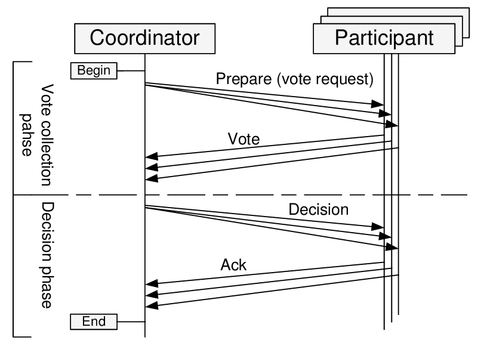
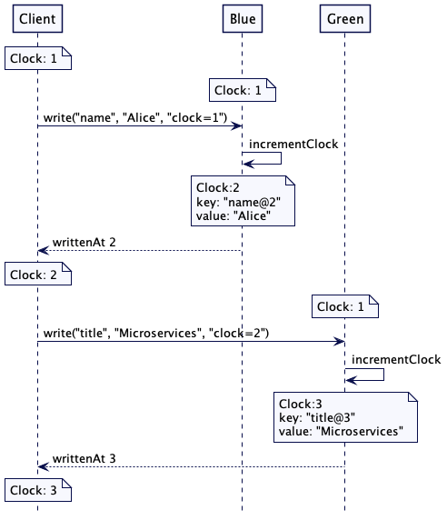
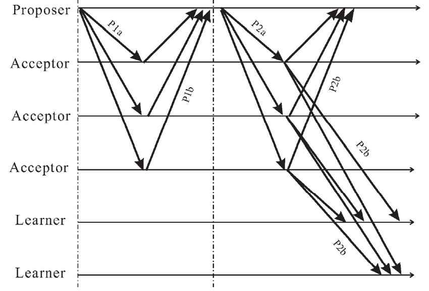
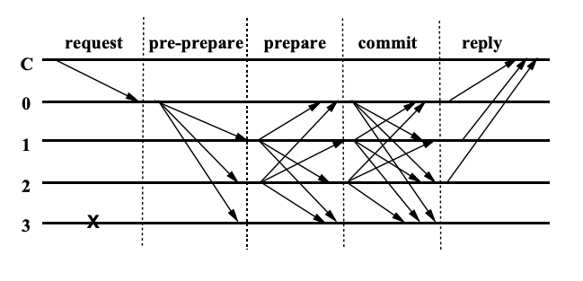
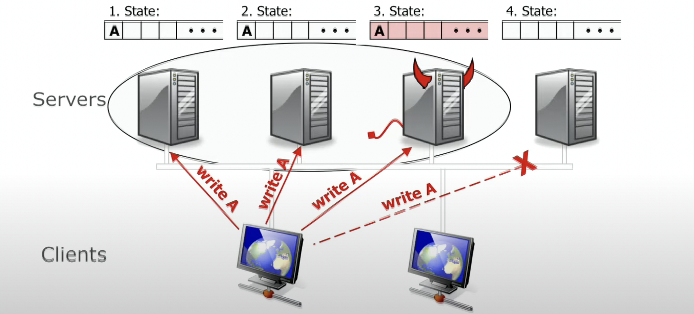
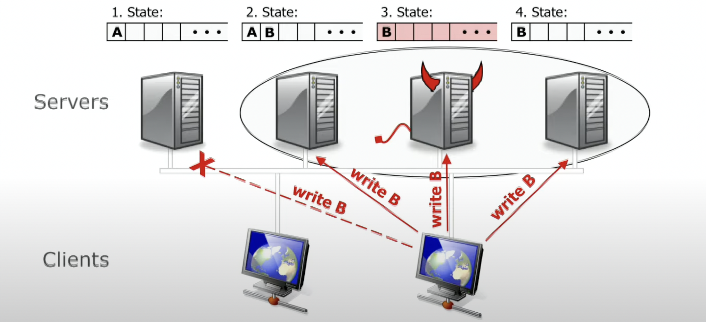

Why would you need consensus at all, when you have replication?
---------------------------------------------------------------

If you ever set up replications for SQL databases, such as Postgres, you might be wondering: why one should care about complicated consensus
algorithms, if they can just set up master-replica pair and be a happy camper?

The answer is: although existence of replicas of your databases allows for survival of important data and, maybe, even read-only access to them,
they won't be able to automatically re-elect a new master, and a crash wouldn't go unnoticed.

Consensus algorithms, on the other hand, assume that periodic crashes of replicas are more or less normal events, and automatically
re-elect masters, while guaranteeing safety of the data.

Building blocks: Two-phase commit (2PC)
---------------------------------------

The main primitive that consensus algorithms are built upon is the algorithm of a two-phase commit. 

It pretty much allows distributed, fault-tolerant databases to behave like a single instance of an ACID database. With 2PC a write to the database survives a crash of any database replicas or even the coordinator.

There are replicas of 2 roles in 2PC: coordinator (a node that executes write requests from the clients, a.k.a. primary or master) and participants (regular replicas).

Martin Kleppmann compares this algorithm to a marriage in Western Christian church. Coordinator is the priest, and replicas are the bride and groom. 

In the first phase coordinator asks the replicas, if they are ok to commit a transaction (e.g. are they willing to marry each other). Replicas may reject the proposal, in that case the procedure can be aborted. But if they accepted the proposal, they won't be able to change their mind, even if they go down later.

At the second phase, if some condition hold (normally, [2PC is synchronous](https://blog.acolyer.org/2016/01/13/consensus-on-transaction-commit/), so an unanimous "yes" is required from participants; however we can alter it to require a quorum of "yes", or some other success condition), it sends a message to participants to commit the transaction and consider it a success.

If a participant went down after sending "yes", it must ask the coordinator, if it got married or not, afterwards.

 
**Two-phase commit (2PC)**. During the first phase ("Prepare") coordinator/proposer/master/primary node suggests a value and queries the nodes, if they agree with the proposed value. During the second phase ("Commit") they accept the value and send acknowledge messages to the coordinator/proposer/master/primary node.

What if the coordinator itself goes south in the course of this procedure? Turns out, with a 2-phase commit there can be an undefined state, if both coordinator and one of the participants that accepted the proposal, crash. There is an improved algorithm, called [3-phase commit](https://en.wikipedia.org/wiki/Three-phase_commit_protocol), that solves the issue, but it is beyond the scope of this post.

Moreover, if a coordinator has failed, a new coordinator election should be held. It is itself a matter of consensus (as we don't want 2 nodes to think that they are coordinators). Thus, we run into a vicious cycle. 

Turns out, the coordinator election process is a solvable problem, and a basic primitive to solving it, is called [Lamport timestamps](https://en.wikipedia.org/wiki/Lamport_timestamp).

Building blocks: Lamport timestamps
-----------------------------------

In a distributed system you cannot rely on global time to determine the order of events.

Again, I use an example from Martin Kleppmann: suppose you and your friend from a different country are watching an online translation of a football game, and you are chatting in Telegram. 

Your friend tells you that his translation says that the game is over, and a few seconds later your translation tells you that a goal was just scored.

Clearly, there is a mistake in causality of events: a goal could not be scored after the game was over. The nodes of a distributed system, responsible for the online translation,
received two events (the last-minute goal, and the final whistle) in different order. Your node received the goal event first, while your friend received final whistle first and even
managed to notify you about it, before his node received the goal event.

Obviously, this is an undesired behaviour for a distributed system. 

You want some events, originating in a distributed systems, to be strictly consecutive. Note that you probably don't need every 2 events to be ordered, but some of them should be. 

In mathematics these two cases are called [linearly ordered sets](https://en.wikipedia.org/wiki/Total_order) (when any 2 events are ordered) and [partially ordered sets](https://en.wikipedia.org/wiki/Partially_ordered_set#:~:text=In%20mathematics%2C%20especially%20order%20theory,the%20elements%20of%20a%20set.&text=That%20is%2C%20there%20may%20be,the%20other%20in%20the%20poset.) (when some events are ordered compared to each other, and some are not).

As the global time cannot be used for solving the problem of event ordering, as it might differ between servers or even go backwards in older operating systems, we need a different mechanism for maintaining the causality relation between certain events.

For instance, when we perform a leader election in a distributed system after the old leader went down, we might want to do this on a first-comes-first-served basis.

Lamport suggested a scheme, where each message is supplied with an incremental integer timestamp, and if a node receives a message with a higher timestamp than its current, it marks the next message with that timestamp, increased by 1:

**Sample request sequence, implementing Lamport clock**. A client sends consecutive requests to two servers, Blue and Green, which update their highest timestamps, when receive messages with higher timestamp than their current highest.

Here is the formal problem definition of conditions to be satisfied from the original 1978 paper by Lamport:

 * (I) A process which has been granted the resource must release it before it can be granted to another process. 
 * (II) Different requests for the resource must be granted in the order in which they are made. 
 * (III) If every process which is granted the resource eventually releases it, then every request is eventually granted. 

In our case leadership status among the replicas is such a resource.

And here is the formal description of the algorithm:

1. To request the resource, process $P_i$ sends the message $T_m$:$P_i$ requests resource to every other process, and puts that message on its request queue, where $T_m$ is the timestamp of the message.
2. When process $P_j$ receives the message $T_m$:$P_i$ requests resource, it places it on its request queue and sends a (timestamped) acknowledgment message to $P_i$.
3. To release the resource, process $P_i$ removes any $T_m$:$P_i$ requests resource message from its request queue and sends a (timestamped) $P_i$ releases resource message to every other process.
4. When process $P_j$ receives a $P_i$ releases resource message, it removes any $T_m$:$P_i$ requests resource message from its request queue.
5. Process $P_i$ is granted the resource when the following two conditions are satisfied: (i) There is a $T_m$:$P_i$ requests resource message in its request queue which is ordered before any other request in its queue by the relation =>. (To define the relation "=>" for messages, we identify a message with the event of sending it.) (ii) $P_i$ has received a message from every other process timestamped later than $T_m$.

Paxos
-----

Paxos algorithm was invented by Lesley Lamport, who named it by an island in the Ionian sea near [his favourite Albania](https://lamport.azurewebsites.net/pubs/pubs.html#byz). It is very similar to a practical implementation of a two-phase commit algorithm, coupled with Lamport's timestamps idea, however, unlike 2PC Paxos does not require unanimous voting. A simple majority quorum would suffice for a proposal to be accepted.

Again, the algorithm consists of 2 phases, and each phase consists of 2 sub-phases.

 
**Paxos algorithm successful flow**.

### Phase 1 (P1) 

#### Proposal sub-phase (P1a) 

During the proposal phase, a proposer node is going to suggest a value to all the acceptor nodes. Proposal message is supplied with a Lamport timestamp $n$ that should be larger than any previous Lamport timestamp used by this proposer.

#### Voting sub-phase (P1b)

Acceptor nodes vote for or against the value proposed. If there are 2n+1 nodes total and n+1 nodes vote for the proposal, a quorum is achieved, and the proposal is accepted. By voting for the proposal, acceptors promise not to accept competing proposals with lower Lamport timestamp.

Acceptors can also suggest values with their voting messages, so that proposer can select one of the values, proposed by acceptors.

### Phase 2 (P2)

#### Commit propagation (P2a)

In its commit propagation sub-phase (P2a) the proposer informs all the acceptors in the quorum that it has achieved a preliminary quorum and requests them to give the final confirmation.

If acceptors suggested a range of values at the sub-phase P1b, proposer can also select one of the values in that range.

#### Commit acknowledgement (P2b)

In the second sub-phase (P2b) acceptors in the quorum decide, if the proposer still has the latest timestamp since Phase-1b, and send Ack messages to the proposer and learner nodes.

Note, that at this step there is a big significant difference between Paxos and 2PC, because in 2PC after acceptor commits that it votes for the proposal at Phase-1b,
it cannot change its mind, while in Paxos it only promises not to vote for older applications, but it might have voted for a newer proposal since, so
at this phase it wouldn't acknowledge the proposal.

### Why this works in normal-operation case?

To understand, how Lamport timestamps help carry out voting, consider this example (I quote two posts, [this](https://dzone.com/articles/a-brief-analysis-of-consensus-protocol-from-logica) and [this (in Chinese)](https://www.cnblogs.com/study-everyday/p/7279829.html)):

<blockquote>
Consider three servers: Server1, Server2, and Server3. They all want to use the Paxos protocol to make all members agree that they are leaders. These servers are the Proposer role and the values that they propose are their names. They need consent from the three members: Acceptor 1-3. Server2 initiates proposal 1 (with 1 as the ProposeID), Server1 initiates proposal 2 and Server3 initiates proposal 3.

First, it is the Prepare phase:

Assume that the message sent from Server1 arrives at Acceptor 1 and Acceptor 2 first, both of which have not received a request. Therefore, they receive this request and return [2, null] to Server1. At the same time, they promise not to receive requests with an ID smaller than 2;

Then the message sent from Server2 arrives at Acceptor 2 and Acceptor3, and Acceptor 3 has not received a request. Therefore, Acceptor 3 returns [1, null] to Proposer 2 and promises not to receive messages with an ID smaller than 1. Because Acceptor 2 has already received the request from Server1 and promised not to receive requests with an ID smaller than 2, Acceptor 2 will refuse the request from Server2.

Finally, the message from Server3 arrives at Acceptor 2 and Acceptor 3, both of which have already received a proposal. However, because this message has an ID that is greater than 2 (the ID of the message that has been received by Acceptor 2) and 1 (the ID of the message that has been received by Acceptor 3), both Acceptor 2 and Acceptor 3 receive this proposal and return [3, null] to Server3.

At this point, because Server2 does not receive more than half of the replies, it obtains a new message with 4 as its ID and sends this message to Acceptor 2 and Acceptor 3. Since 4 is greater than 3 (the maximum ID of the proposals that Acceptor 2 and Acceptor 3 have received), this proposal is received and [4, null] is returned to Server2.

Next, it is the Accept phase:

Because Server3 has received more than half of the replies (2 replies) and the returned value is null, Server3 submits the proposal [3, server3].

Because Server1 has also received more than half of the replies in the Prepare phase and the returned value is null, Server1 submits the proposal [2, server1].

Because Server2 has also received more than half of the replies and the returned value is null, Server2 submits the proposal [4, server2].

When Acceptor 1 and Acceptor 2 receive the proposal [2, server1] from Server1, Acceptor 1 accepts this request and Acceptor 2 refuses this request because it has promised not to accept a proposal with an ID smaller than 4.

Acceptor 2 and Acceptor 3 accept the proposal [4, server2] from Server2 when they receive that proposal.

Acceptor 2 and Acceptor 3 will refuse the proposal [3, server3] from Server3 because they have promised not to accept a proposal with an ID smaller than 4.

At this point, more than half of the Acceptors (Acceptor 2 and Acceptor 3) have accepted the proposal [4, server2]. The Learner perceives that the proposal is passed and starts to learn the proposal. Therefore Server2 becomes the final leader.
</blockquote>

### Why this works in case of failures?

Hah, that's the whole point!

While the successful flow of Paxos is relatively simple, the handling of failures and special cases in it is painfully hard to understand and implement. 

In fact, trying to formally prove correctness of distributed algorithms like Paxos, Lesley Lamport spent the second part of his career, developing a tool for proof automation, [TLA+](https://en.wikipedia.org/wiki/TLA%2B).

[Wikipedia article on Paxos](https://en.wikipedia.org/wiki/Paxos_(computer_science)#Graphic_representation_of_the_flow_of_messages_in_the_basic_Paxos) considers various scenarios of failures at different stages of the protocol. I wouldn't copy-paste them here. Note, though, that basic Paxos is not even guaranteed to converge, cause multiple proposes can reach a state of livelock, as our example and [Wikipedia](https://en.wikipedia.org/wiki/Paxos_(computer_science)#Basic_Paxos_when_multiple_Proposers_conflict) suggest.

You might want to look at the [implementation of Paxos in Ceph codebase](https://github.com/ceph/ceph/tree/master/src/mon). Ceph is a distributed [software-defined storage](https://en.wikipedia.org/wiki/Software-defined_storage) system that maintains a redundant set of daemons, called monitors (or just MONs),
that keep the metadata by maintaining a distributed consensus.

### Multi-paxos

Basic Paxos algorithm sounds simple, but is more of a theoretical result, than a practical one.

To make it really applicable in engineering, we need to tweak several aspects of it:

 * Paxos can only carry out a single election. In a real-life distributed system we will need to perform multiple rounds of elections every once in a while.
 * Existence of multiple proposers may cause a livelock. In a real-life system we shall have just one leader/master/primary/proposer a time.
 * The result of a proposal is only known to a quorum of acceptors, while in real life we need to guarantee that all the replicas store the same data.

These problems are relatively easy to solve. 

To solve the first one, hold several rounds or epochs. 

To solve the second one, maintain just one leader and carry out leader re-elections, if it goes down. 

To solve the third problem, Multi-Paxos adds a `firstUnchosenIndex` to each server and lets a Leader synchronize selected values to each Acceptor.

Zab
---

In 2007-2011 Zookeeper introduced its own consensus algorithm, called [Zab](https://marcoserafini.github.io/papers/zab.pdf), Zookeeper Atomic Broadcast, that is based on 2PC and somewhat similar to Paxos, but different. I am not going to explore it in detail here, as it didn't attain much popularity in the community. Instead, I will focus on a popular alternative to Paxos, Raft.

However, Zab is conceptually VERY similar to the later Raft. Just as Raft does, it separates the leader election procedure from log replication. Just as Raft, it has only one leader at a time, which communicates to the clients, and performs writes to replicas through a 2PC.

Raft
----

[Raft](https://raft.github.io/raft.pdf) (Replicated And Fault-Tolerant) consensus algorithm was introduced in 2013-2014 as an easier for understanding and implementation non-byzantine consensus algorithm, similar to Paxos.

Since then, it was widely adopted and democratized the development of distributed systems. It is working under the hood of such systems as Kubernetes etcd, Hashicorp Consul, Apache Kafka (in its up-and-coming [Zookeeper-less KIP-500](https://www.confluent.io/blog/kafka-without-zookeeper-a-sneak-peek/) version) and TitaniumDB/KV.

There is an amazing [visual explanation of Raft protocol](http://thesecretlivesofdata.com/raft/). I will say a few introductory words about it here, but I strongly recommend you to watch this interactive site - it is super-clear.

Raft was designed with the goal to be as clear as possible, unlike Paxos. Raft explicitly decouples two processes: leader election and log replication.

In fact, replicas have only 2 API endpoints in Raft: RequestVote, used for leader election, and AppendEntries, used both for heartbeats and log replication.

### Leader election

In Raft there is only one leader node per a cluster. The leader sends heartbeats to replicas every once in a while. If replicas don't receive the heartbeat for too long, they would assume that the leader is dead and will start re-election (beware, Java 8 programmers, your stop-the-world garbage collector [has a potential to make replicas think your leader is dead](https://medium.com/ias-tech-blog/how-ias-solved-web-service-timeouts-caused-by-java-garbage-collection-pauses-7a701beb1be9)).

When a re-election starts, each replica waits for a randomized time period of between 150ms and 300ms. If it doesn't receive the heartbeat before that timeout, it nominates itself to be a candidate for leadership and asks other replicas to vote for it. If 2 candidates arise simultaneously, and there is a draw in voting, both take random timeouts again, until the tie is broken.

### Log replication

Log replication is a 2PC implementation with the requirement of majority of votes, rather than unanimous voting. 

In the first phase the client sends a request to leader. Leader logs the value, but doesn't commit it, yet.

Leader sends the value to replicas. If it receives a response from a majority of replicas, that the change has been accepted, it commits the change in its log and replies to the client. 

After that, it requests the replicas to commit the change, too.

In Raft there is a concept of Term - an incremental period of time, when one leader ruled. When a new round of election happens (e.g. when a leader crashes or when the network becomes split into parts), a new term is started. Whenever a node recovers, or connectivity is restored, the crashed nodes see that a new term was started and would rollback any uncommitted changes they had, if there were any, and replicate the logs of the new leader. 

Practical Byzantine Fault Tolerance (PBFT)
------------------------------------------

Until now, we considered algorithms of consensus in distributed systems, which guaranteed survival in case of regular crashes.

However, there is another kind of faults, called [Byzantine Faults](https://en.wikipedia.org/wiki/Byzantine_fault), that can be observed in peer networks, such as Blockchain, where some fraction of nodes can behave maliciously, intentionally trying to compromise consensus in a distributed system.

Handling those faults is much more complicated and requires much more careful approach. 

The term "Byzantine Fault Tolerance" was coined by Lesley Lamport circa 1982 in his seminal paper on Byzantine Generals Problem. Lamport also tried adapting Paxos for Byzantine faults case.

However, here we shall consider a different algorithm, called Practical Byzantine Fault Tolerance, that was suggested by a PhD student of the famous Barbara Liskov, Miguel Castro, in 1999, and since then re-implemented at least in some [Permissioned blockchains](https://www.investopedia.com/terms/p/permissioned-blockchains.asp#:~:text=What%20Is%20a%20Permissioned%20Blockchain,from%20public%20and%20private%20blockchains.), such as [Exonum](https://github.com/exonum), used for the Russian Parliament elections-2021.

**Practical Byzantine Fault Tolerance (PBFT) protocol normal flow**. PBFT is similar to Paxos, but instead of 2-phase commit, its commits consist of 3 phases: pre-prepare, prepare and commit.

TODO

### Why 2n+1/3n+1 nodes are required for Byzantine quorum?

You might wonder why over 2/3 of nodes are required for a quorum in case of Byzantine failures, unlike over 1/2 in non-Byzantine case.

Consider the simplest example, when n = 1, so that the total number of nodes 3n + 1 = 4. Let us show, why at least 2n + 1 = 3 nodes are required for a quorum.

Here is an answer from [Barbara Liskov's 2016 talk](https://www.youtube.com/watch?v=S2Hqd7v6Xn4). Suppose, we are trying to commit 2 proposals, A and B, and expect B to be rejected by a system, because A came first (say, both A and B are financial transactions in a blockchain, that try to spend the same money, and, thus, are mutually exclusive).

**Transaction A** has not been received by 1 benevolent node (number 4) that went down, and has been committed by 2 benevolent nodes and 1 malevolent Byzantine node.

**Transaction B** has not been received by another 1 benevolent node (number 1), was received by a malevolent node, which is going to lie that it didn't receive transaction A, by a benevolent node number 4, which hasn't committed transaction A because it was down, so only 1 benevolent node number 2 is going to inform the others that the transaction B needs to be rejected.

References
----------
 - https://lamport.azurewebsites.net/pubs/pubs.html#reaching - on 1980 work by Lamport, Pease and Shostak with first example of 2n+1/3n+1 consensus requirement in case of Byzantine faults
 - https://lamport.azurewebsites.net/pubs/reaching.pdf - Lamport, Pease and Shostak paper itself
 - https://en.wikipedia.org/wiki/Lamport_timestamp - wikipedia on Lamport timestamps
 - https://lamport.azurewebsites.net/pubs/time-clocks.pdf - 1978 paper by Lamport on timestamps
 - https://martinfowler.com/articles/patterns-of-distributed-systems/lamport-clock.html - Martin Fowler and Unmesh Joshi on Lamport clock pattern
 - http://citeseerx.ist.psu.edu/viewdoc/download?doi=10.1.1.92.8693&rep=rep1&type=pdf - proof of lower bounds for non-byzantine and byzantine quorum by Bracha and Toueg in 1985
 - https://en.wikipedia.org/wiki/Two-phase_commit_protocol - wikipedia on 2PC
 - https://en.wikipedia.org/wiki/Three-phase_commit_protocol - wikipedia on 3PC
 - https://blog.acolyer.org/2016/01/13/consensus-on-transaction-commit/ - digest of a 2004 paper by Lamport, where he compares 2PC and Paxos; 2PC is synchronous
 - http://lamport.azurewebsites.net/pubs/paxos-simple.pdf - Paxos made simple (not quite though) paper by Lesley Lamport
 - https://en.wikipedia.org/wiki/Paxos_(computer_science) - wikipedia on Paxos
 - https://developpaper.com/analysis-of-consistency-protocol-from-logical-clock-to-raft/ - an excellent post on Paxos, Zab and Raft
 - https://en.wikipedia.org/wiki/Raft_(algorithm) - wikipedia on Raft
 - http://thesecretlivesofdata.com/raft/ - AWESOME visual explanation of Raft
 - https://raft.github.io/raft.pdf - Raft paper
 - http://www.pmg.csail.mit.edu/papers/osdi99.pdf - PBFT paper by Liskov and Castro
 - http://pmg.csail.mit.edu/~castro/tm590.pdf - PBFT correctness proof
 - http://pmg.csail.mit.edu/~castro/tm589.pdf - follow-up of PBFT paper by Liskov and Castro
 - https://www.youtube.com/watch?v=Uj638eFIWg8 - 2001 talk by B.Liskov
 - https://www.youtube.com/watch?v=S2Hqd7v6Xn4 - 2016 talk by B.Liskov (more useful)
 - https://arxiv.org/pdf/2002.03087.pdf - probabilistic PBFT
 - https://en.wikipedia.org/wiki/Paxos_(computer_science)#Byzantine_Paxos - byzantine Paxos
 - https://marcoserafini.github.io/papers/zab.pdf - Zookeeper Zab
 - https://dzone.com/articles/a-brief-analysis-of-consensus-protocol-from-logica - good overview of consensus algorithms
 - https://www.oreilly.com/library/view/designing-data-intensive-applications/9781491903063/ - holy grail of distributed systems by Martin Kleppmann; chapters 8 and 9 are dedicated to clock and consensus problems
