## Contents
* Problem statement and principle of operation
* Data flow
  * Sequence data: Uniprot, Mgnify; software: HMMER
  * Structure data: PDB; software: HHpred, OpenMM
  * Evoformer: MSA embeddings and pair distances iterative refinement
  * Structure module: 3D structure from a sequence in MSA embedding
* Attention mechanism and transformer architecture
  * Scaled dot-product attention: Queries, Keys and Values, fuzzy search in a key-value database
  * Multi-head attention on aminoacid embedding vectors
* Evoformer: MSA embeddings and pair distances refinement
  * Criss-cross (axial) attention
  * Row-wise gated self-attention, augmented with pair distances information
  * Column-wise gated self-attention
  * Pair distances update from MSA embedding through outer product
  * Triangle multiplicative update
  * Triangle attention
* Structure module
  * Invariant-point attention (IPA), SE(3)-equivariance
* Refinement/recycling
* Self-distillation
* Loss function(s): FAPE and auxiliary losses
* Training protocol and ablations

## Problem statement
Proteins are linear sequences of monomers - aminoacids - that fold into complex 3D structures. Protein 3D structures are useful for understanding their function and drug discovery. 

Reading protein sequences is cheap and can be achieved directly by mass-spectrometry (\$100 per sample) or indirectly by DNA genome/exome sequencing (\$100-1000 per sequence). Experimental discovery of 3D structures of proteins is much more expensive (\$100k-1M per structure) and is done by X-ray crystallography/MRI.

A typical pipeline for X ray structure prediction consists of protein crystallization (which is hard for membrane proteins, as they are not very soluble), X ray diffration on the resulting crystal and interpretation of the resulting maps of electron density. There are about 7 major ways to solve the phase problem (which is a bit of an art),
and also reconstruction of 3D model from electron density maps is ~10-20% arbitrary (given the same electron density map, two different specialists can produce slightly different structures, especially for low resolution).

Protein sequences are available in [Uniprot](https://www.uniprot.org/) (about 200M proteins) and [MGnify](https://www.ebi.ac.uk/metagenomics/) databases.

Protein structures are available in [PDB](https://www.rcsb.org/) database (about 200K protein structures).


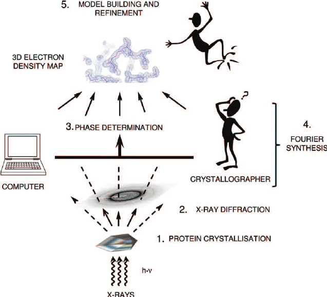<center>**X-ray crystallography experiment pipeline**.</center>

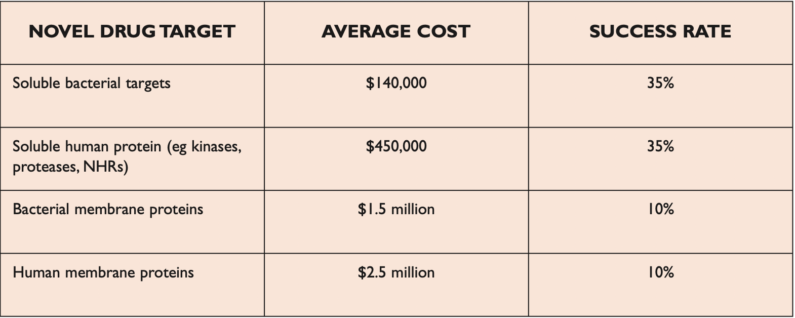<center>**Cost and success rate of X-ray crystallography experiment**. (2003 data)</center>

### AlphaFold2 principle of operation
Protein 3D structure prediction *in silico*, based on pure physics, generally can not achieve performance, comparable to experiment. Statistics-based approach proved to be more effective.

Oftentimes a protein is conservative in evolution. E.g. human, horse and fish have their own versions of haemoglobin that evolved from the same protein. Such versions of the same protein in different species are called *homologues*.

Evolution is mostly neutral (i.e. most of the mutations don't affect the protein function). Protein structure is more conservative than its sequence. It is typical for a sequence to change by 70% between distant species, while the 3D structure stays more or less the same. Comparison of homologues from different species carries important information and is usually represented as a 2D table, called multiple sequence alignment (MSA). Protein sequences from different species are written in rows, so that corresponding residues end up in the same columns.

Conservation of a position in alignment usually implies its importance for protein folding or function (e.g. catalytic activity, interactions with ligands, recognition of binding sites).

Co-evolution of two aminoacid residues of a protein often implies interaction between those aminoacids. This information can be used as the basis for 3D structure prediction. 

I want to briefly mention the role of metagenomics here: normally, proteins in databases, such as Uniprot, come from organisms that can be cultivated in lab conditions. However, a vast abundance of microorganisms can not be cultivated like that. Instead of trying to identify them and sequence individually, researchers started to follow a different approach in the 2000s. They started to sample various environments (with a soup of microorganisms there) and sequence the bulk of DNA from those samples. Turned out, those "metagenomic" samples contained many more homologues of well-known proteins, than individully sequenced species. These data gave a significant boost to 3D structure prediction programs in the mid-2010s. AlphaFold2 makes use of those data by searching for homologues in MGnify database, used as a complement to Uniprot. 

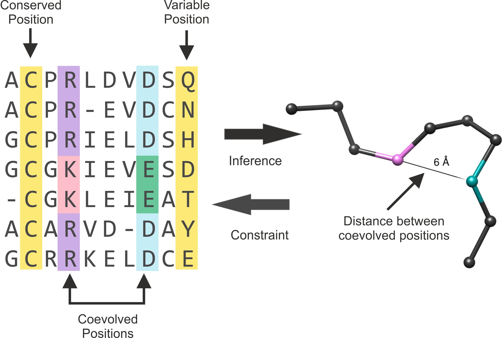<center>**Example of multiple sequence alignment (MSA)**. Sequences of homologues of a protein from different species are written in rows. Corresponding aminoacid residues are written in columns. Alignment provides information on conservation and co-evolution of certain aminoacids in sequences.</center>

## AlphaFold2 pipeline
I'll be using the term "AlphaFold2" in two contexts here: in a broad sense it is a system that makes use of multiple external programs and databases in order to predict 3D structures by protein sequences. AlphaFold2 in a narrow sense is a neural network that lies in the heart of this system.

AlphaFold2 as a system takes a protein sequence on input and predicts its 3D structure. In order to do that, it makes use of multiple databases and programs.

First, AF2 uses HMMER software to find homologues of input sequence in sequence databases, Uniprot and MGnify. It makes use of a long-established software package, called HMMER,
which has been around since early-2000s. HMMER is based on Markov chains/Hidden Markov Models. These approaches dominated in the field of speech recognition/synthesis in that time, so bioinformaticists have shamelessly stolen the Markov chain approach for their own needs. HMMER constructs and returns a multiple sequence alignment (MSA) of our sequence with its homologues, it has found.

AF2 also uses HHpred package to check, whether any of our homologues has a 3D structure available in PDB. If this is the case, the problem of 3D structure reconstruction becomes almost trivial - you just need to use it as a template and model your prediction based on it. However, less than 0.1% proteins are expected to have such a template available.

If 3D structure template was available, AF2 constructs a pair representation of distances between residues in the protein from that template. If it was not available, it initializes a pair representation with some sensible defaults. 

Then AF2 generates vector [embeddings](https://datascience.stackexchange.com/questions/53995/what-does-embedding-mean-in-machine-learning) out of each aminoacid residue of alignment and out of each residue pair in pair representation. 
I won't dig deeper into how this is done - you can imagine several ways of doing that. I'll only notice that if the alignment is too thin, less than 30 sequences, AlphaFold2 won't work well. If the number of sequences is over about 100, however, this is bad, too, as this slows down the training. So, in such a case sequences in the alignment are clustered and cluster representatives are used. 

Here comes the core part of AlphaFold2: the end-to-end transformer-based neural network. The network receives embeddings of MSA and pair representation, iteratively updates them in the course of inference, and outputs a 3D structure, based on them.

The network consists of 2 sub-modules: 

* Evoformer module of neural network iteratively updates MSA embedding and pair representation, essentially, detecting patterns of interaction between aminoacids.
* Structure module of neural network iteratively predicts 3D structure of protein from our input sequence embedding, extracted from the MSA embedding, and pair representation.

After structure module proposed some 3D structure, an additional OpenMM software is used to relax the obtained 3D structure with physics-based methods.

This process is repeated thrice in the course of a process, called recycling.

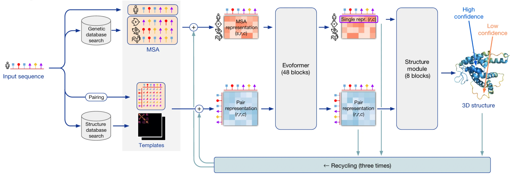<center>**AlphaFold2 pipelines from bird's eye view.**</center>

## Attention and transformer architecture
As I said, the neural network at the heart of AlphaFold2 is based on transformer architecture and attention mechanism. I will briefly explain those here. Feel free to skip this section, if you are already familiar with attention and transformers.

Attention mechanism has been popularized circa 2014-2015 for machine translation (e.g. English-to-French). At the time state-of-the-art architectures for machine translation were RNN-based. Initially it turned out that addition of attention mechanism improves the quality of translation.

Later on, it turned out that you can get rid of RNN part of the network entirely and just stack attention mechanism layers, achieving performance as good or better, but spending 100 times less compute on training. 

By 2017 it became clear that attention mechanism is a self-sufficient building block, serving as a powerful alternative to both CNN and RNN in both NLP and CV problems, as well as in problems, related to other modalities.

Purely attention-based architectures are called transformers. AlphaFold2 Evoformer block, as its name suggests, is a special cases of transformer (actually, structure module is a transformer as well).

### Scaled dot-product attention
Attention mechanism is formulated in terms of fuzzy search in a key-value database.

Suppose that we have a key-value database (basically, just a python dict), and we supply a query to it, which is a key with typo errors in it. 

We want the database to compare the query to each key, and output a value, which is a weighted average of $values_i$, where weight of each value is the probability that user meant $key_i$ by typing the query.

$Attention(q, K, V) = \sum \limits_{i=1}^{N} <q, K_i> V_i$

```python
# Suppose that we have a key-value database and implement a fuzzy search in it

database = {
    "Ivanov": 25,
    "Petrov": 100,
    "Sidorov": 5
}

query = "Pvanov"  # note the typo in query


def hamming_distance(query: str, key: str) -> int:
    distance = 0
    for i, _ in enumerate(query):
        if query[i] != key[i]:
            distance += 1

    return distance


# construct a vector of similarities between query and keys
# similarity=1 if query=key; 
# similarity=0 if there is nothing in common between query and key
similarities = {}
for key in database:
    similarities[key] = (1 - hamming_distance(query, key) / len(query))

print(f"Similarities before softmax: {similarities}")
    
output = 0
for key, value in database.items():
    output += similarities[key] * value
    
output
```

```
Similarities before softmax: {'Ivanov': 0.8333333333333334, 'Petrov': 0.5, 'Sidorov': 0.0}
70.83333333333334
```

The example above was ok, but it has a major drawback: it measures similarities between keys and query, and sum of similarities is more than 1.

They can not be interpreted as probabilities. Let us normalize similarities between queries and keys, so that their sum of weights equals 1. We shall use Softmax function for that:

$$Attention(q, K, V) = \sum \limits_{i=1}^{N} Softmax(<q, K_i>) V_i$$ 

where Softmax is given by:

$$p_i =  \frac{e^{E_i}}{\sum \limits_j e^{E_j}}$$

```python
# However, note that the sum of similarities in previous solution was more than 1.
# We probably want to preserve the sum of similarities equal to 1.
# Hence, apply Softmax to similarities vector to normalize it.
import math


def softmax(weights: dict) -> dict:
    """Transform a dict of weights into a dict with sum of weights normalized to 1."""
    # Calculate statistical sum (softmax denominator)
    zustandssumme = 0
    for key, weight in weights.items():
        zustandssumme += math.exp(weight)
    
    return { key: math.exp(weight)/zustandssumme for key, weight in weights.items() }


similarities = softmax(similarities)
print(f"Similarities after softmax: {similarities}")

output = 0
for key, value in database.items():
    output += similarities[key] * value
    
output
```

```
Similarities after softmax: {'Ivanov': 0.4648720549505913, 'Petrov': 0.33309538278287776, 'Sidorov': 0.202032562266531}
45.94150246338521
```

Softmax is basically a multinomial analogue of Sigmoid function. Very much like a logistic regression uses Sigmoid function to convert arbitrary values to [0,1] range, so that they can be used as probabilities, Softmax does the same for multinomial case. Another way to think of Softmax is as a general case of Boltzmann distribution from statistical physics.

Now, I need to make two remarks. 

First, instead of a single query, attention usually receives a list of queries, compares them to keys and returns a weighted average of values for each query.

Second, usually, keys, queries and values are not strings and integers. Usually they are vectors. For vectors we know, how to measure their similarity - cosine distance, or just a dot product (possibly, normalized or scaled).

Here is a depiction of attention mechanism from the classical "Attention is all you need paper" (ignore the optional Mask block on that picture):

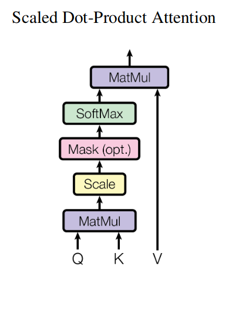<center>**Scaled dot-product attention**</center>

Suppose that attention input is a list of 3 queries, 3 keys and 3 values, where each individual query, key and value is an embedding vector of dimensionality e.g. 256.

$Q = \begin{pmatrix} q_{1,1} && q_{1,2} && ... && q_{1,256} \\ q_{2,1} && q_{2,2} && ... && q_{2,256} \\ q_{3, 1} && q_{3, 2} && ... && q_{3, 256} \end{pmatrix}$,

$K = \begin{pmatrix} k_{1,1} && k_{1,2} && ... && k_{1,256} \\ k_{2,1} && k_{2,2} && ... && k_{2,256} \\ k_{3, 1} && k_{3, 2} && ... && k_{3, 256} \end{pmatrix}$, 

$V = \begin{pmatrix} v_{1,1} && v_{1,2} && ... && v_{1,256} \\ v_{2,1} && v_{2,2} && ... && v_{2,256} \\ v_{3, 1} && v_{3, 2} && ... && v_{3, 256} \end{pmatrix}$, 

Here is a PyTorch implementation of attention mechanism:

```python
import torch
import torch.nn as nn
import torch.nn.functional as F


def attention(query, key, value, mask=None, dropout=None):
    """Compute 'Scaled Dot Product Attention'.
    
    Mostly stolen from: http://nlp.seas.harvard.edu/2018/04/03/attention.html.
    """

    # MatMul and Scale
    d_k = query.size(-1)
    scores = torch.matmul(query, key.transpose(-2, -1)) / math.sqrt(d_k)
    
    # Mask (optional)
    if mask is not None:
        scores = scores.masked_fill(mask == 0, -1e9)
    
    # Softmax
    p_attn = F.softmax(scores, dim = -1)
    
    # MatMul
    if dropout is not None:
        p_attn = dropout(p_attn)
    
    return torch.matmul(p_attn, value), p_attn
```

### Multi-head attention
Suppose that your queries, keys and values are all identical vectors $X_i = \begin{pmatrix} x_{i,1} \\ x_{i,2} \\ ... \\ x_{i, 256} \end{pmatrix}$, for instance, embeddings of aminoacids. When Q,K,V are all identical, the attention mechanism is called *self-attention*.

Let us say that $x_{i,1}$ coordinate reflects aminoacid solubility, $x_{i,2}$ - aminoacid size, $x_{i,3}$ - its positive charge, $x_{i,4}$ - its negative charge.

We may want to extract different relations between your queries and keys. E.g. how interchangeable aminoacids S and D are in different capacities?

If we are interested in a small soluble aminoacid, they are quite interchangeable. If we are interested in a charged aminoacid, they are not. 

Let us, e.g, calculate a feature map "charged large aminoacid", which is a 2-vector $(|charge|, size)^T$

$W = \begin{pmatrix} w_{charge,1} && w_{charge,2} && ... && w_{charge,256} \\ w_{size,1} && w_{size,2} && ... && w_{size,256} \\\end{pmatrix} = \begin{pmatrix} 0 && 0 && 1 && -1 && ... \\ 0 && 1 && 0 && 0 && ... \end{pmatrix}$

We shall measure the similarity between queries and keys in the context of this relation as $<q, k> = Softmax(q^TW^T Wk)$.

Each separate relation like this can be described with a separate projection matrix $W_h$. 

Projection matrix, followed by attention mechanism, is called *attention head* then.

For each head $h$ let us denote matrix of projection onto its representation space $W_h$. Suppose that dimensionality of our representation space is 64:

$W_h = \begin{pmatrix} w_{1,1} && w_{1,2} && ... && w_{1,256} \\ w_{2,1} && w_{2,2} && ... && w_{2,256} \\ ... \\ w_{64, 1} && w_{64, 2} && ... && w_{64, 256} \\ \end{pmatrix}$

So projection of vector $X_i = \begin{pmatrix} x_{i,1} \\ x_{i,2} \\ ... \\ x_{i, 256} \end{pmatrix}$ onto representation space $W_h$ is:

$W_h X_i = \begin{pmatrix} w_{1,1} && w_{1,2} && ... && w_{1,256} \\ w_{2,1} && w_{2,2} && ... && w_{2,256} \\ ... \\ w_{64, 1} && w_{64, 2} && ... && w_{64, 256} \\ \end{pmatrix} \begin{pmatrix} x_{i,1} \\ x_{i,2} \\ ... \\ x_{i,256} \end{pmatrix}$

In case of self-attention, we will pass $Q_i = K_i = V_i = W_h X_i$ as inputs to attention mechanism, described above.

After application of multi-head attention to all the inputs, the results from all heads are concatenated ("Concat" block on the picture). 

Then they are again aggregated into a weighted sum by a matrix multiplication ("Linear" block on the picture).

The resulting mechanism is called a single multi-head attention block. Blocks like this are units of a transformer network.

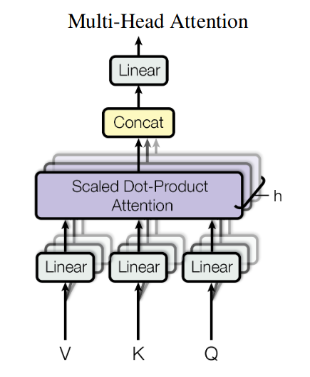<center>**Multi-head attention**</center>

This was a single multi-head attention layer. As a result of its application, each column of matrix $X_i$ will be enriched with weighted sums of several ($h$ to be precise) relations with other columns $X_j$ in some aspect. The more layers of multi-head attention we stack, the more complex and high-level relations we shall be able to identify between our protein aminoacid residues.

```python
import torch
import torch.nn as nn
import torch.nn.functional as F


class MultiHeadedAttention(nn.Module):
    """Mostly stolen from: http://nlp.seas.harvard.edu/2018/04/03/attention.html."""
    
    def __init__(self, h, d_model, dropout=0.1):
        "Take in model size and number of heads."
        super(MultiHeadedAttention, self).__init__()
        
        assert d_model % h == 0
        
        # We assume d_v always equals d_k
        self.d_k = d_model // h
        self.h = h
        self.linears = clones(nn.Linear(d_model, d_model), 4)
        self.attn = None
        self.dropout = nn.Dropout(p=dropout)
        
    def forward(self, query, key, value, mask=None):
        """Implements multihead attention"""
        if mask is not None:
            # Same mask applied to all h heads.
            mask = mask.unsqueeze(1)

        nbatches = query.size(0)
        
        # 1) Do all the linear projections in batch from d_model => h x d_k 
        query, key, value = \
            [l(x).view(nbatches, -1, self.h, self.d_k).transpose(1, 2)
             for l, x in zip(self.linears, (query, key, value))]
        
        # 2) Apply attention on all the projected vectors in batch. 
        x, self.attn = attention(query, key, value, mask=mask, dropout=self.dropout)
        
        # 3) "Concat" using a view and apply a final linear. 
        x = x.transpose(1, 2).contiguous().view(nbatches, -1, self.h * self.d_k)

        return self.linears[-1](x)
```

## Evoformer module

Evoformer module consists of 48 identical blocks that take MSA embedding and pair representation on input and produce their refined versions as output.

Evoformer consists of 3 major steps:
 
1. Evoformer updates the MSA with axial (criss-cross) attention, using the information, contained in pair representation.
2. Evoformer updates the pair representation from updated MSA, using outer product mean block.
3. Evoformer applies triangle inequalities to the updated pair representation to enforce consistency.

We will walk through each part of Evoformer now.

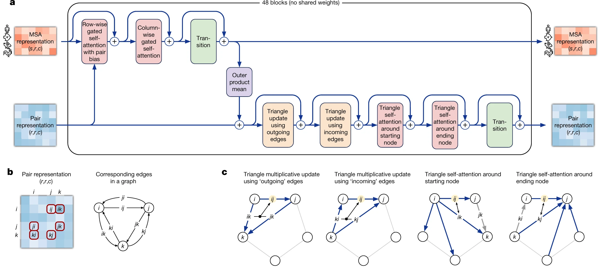<center>**Evoformer block**</center>

### Evoformer: MSA representation update part

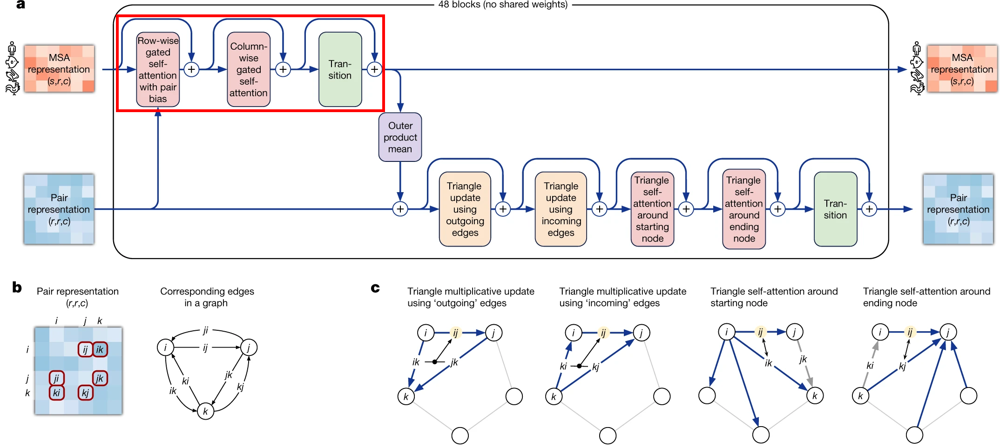<center>**Evoformer MSA update**</center>

#### Axial (a.k.a criss-cross) attention mechanism in Evoformer

MSA update part of Evoformer uses an approach, called axial or criss-cross attention. It was suggested in visual transformers circa 2020.
In visual transformers attention needs to be applied to each pixel of an image, and using the full 2D image as keys would be computationally inefficient.

A frugal alternative to full 2D attention, is to first attend to all pixels in the same row as the query pixel and then attends all pixels in the same column.
Same approach was employed here by evoformer. It first attends to other aminoacid residues in the same sequence (which is called row-wise gated self-attention), and then
residues from other sequences in the same column (column-wise gated self-attention).

#### Row-wise gated self-attention

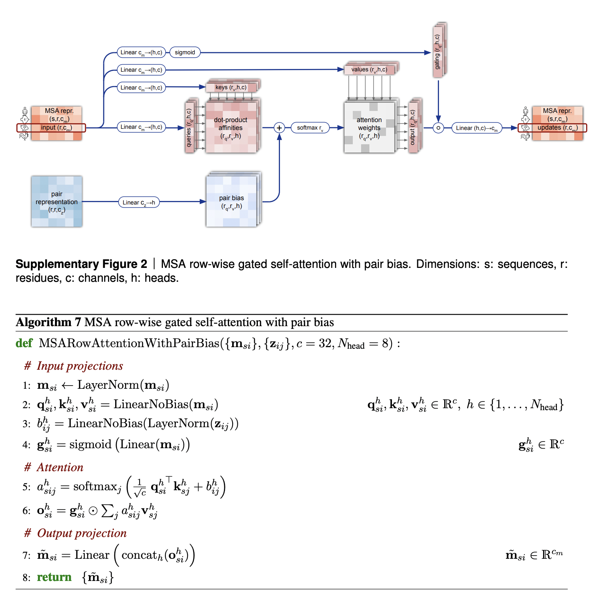<center>**Row-wise gated self-attention**</center>

I want to discuss 2 aspects in row-wise gated self-attention.

First, note that for calculation of similarities between queries and keys (aminoacid residues) we not only use information
from MSA embedding itself, but from pair representation as well. This is very logical: if the data from our budding 3D structure
suggest that two aminoacid residues interact in 3D (and this information, in turn, becomes reflected in pair representation first),
row-wise self-attention also makes use of this information to reflect this in the updated MSA embedding.

Second, I haven't said anything about gating mechanism as yet. Gating is the topmost line on the picture. Gating works like a
gate in a transistor - if the gate is closed, it nullifies some values of the attention output vector. The gate bit will be closed,
if the corresponding query aminoacid embedding's projection "length" onto this attention head's feature space is too small and we believe, 
it does not matter. Technically, decision, whether to close the gate or not, is taken, based on application of sigmoid function to
that projection - sigmoid most likely will convert that projection into value close to either 0 or 1, which will keep the gate closed or open, 
respectively.

#### Column-wise gated self-attention

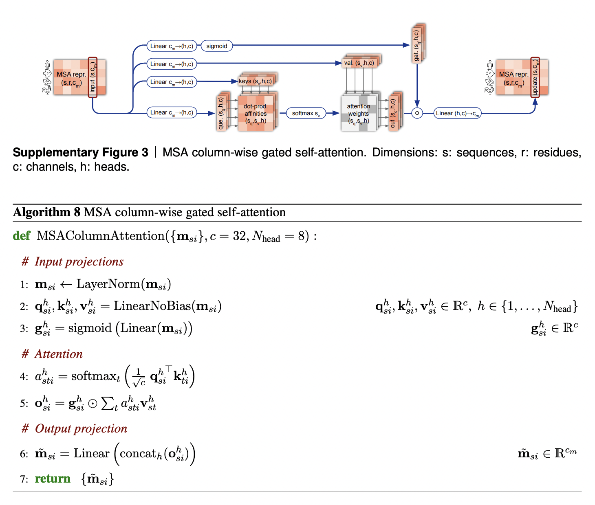<center>**Column-wise gated self-attention**</center>

Column-wise gated self-attention performs exchange of information between sequences within an alignment column. This step
helps AF2 identify conservative or co-evolved positions, and also it is important for propagation of data on 3D structure
from the first sequence of alignment (which is the sequence, for which we predict the structure) to the others.

In the supplementaries, DeepMind shared the visualizations of the attention maps. The row (a) in the maps tell us that
for some residues only a subset of sequences influences the update of MSA embedding. The row (b) shows that after a few
iterations of refinement, all the sequences attend to the first sequence (for which 3D structure is being predicted). The row
(c) shows that intermediate layers of AF2 gradually learn the pattern of clustering of sequences by their evolutionary descent, so that
their attention maps start to resemble the evolutionary tree, which is reflected in the bottom rightmost picture ("Hamming distance").

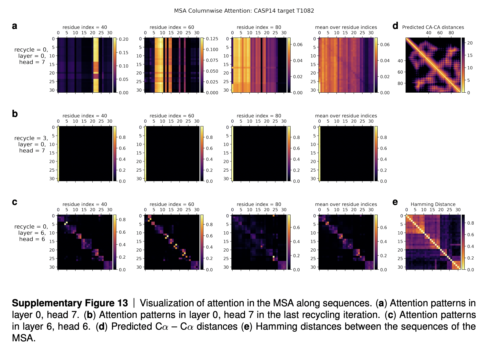<center>**Column-wise attention visualization**</center>

I quote the interpretation of these attention maps in the paper supplementary:

> In Suppl. Fig. 13 we show a visualization of the attention pattern in the MSA along the columns a
> $h_{sti}$ (line 4
> of Algorithm 8). We slice along the last axis $i$ and display the $st$ array as heat map.

> The original MSA subset shown to the main part of the model is randomly sampled. As such the order is
> random except for the first row. The first row is special because it contains the target sequence and is recycled
> in consecutive iterations of the model. Due to the shallow MSA of this protein, the random subset leads to
> a random permutation of the sequences. In order to facilitate easier interpretation of the attention patterns
> here we reorder the attention tensor by using a more suitable order for the MSA. We perform a hierarchical
> clustering using the Ward method with simple Hamming distance as a metric and use the output to re-index
> the sequence dimension in the MSA attention tensor. We resort the indices from the hierarchical clustering
> manually to keep the target sequence in the first row. This manual sorting is done in such a way as to keep the
> tree structure valid. The Hamming distances between the reordered sequences (see Suppl. Fig. 13e) show a
> block-like structure quite clearly after the reordering.

> The attention pattern in the first layer of the network in the first recycling iteration (e.g. layer 0, head 7 in
> Suppl. Fig. 13a) is not very informative and is largely averaging as can be seen by looking at the range of the
> attention weights.

> In the same head, but in the last recycling iteration (Suppl. Fig. 13b) we see that all sequences at all positions
> attend to the first row. Therefore this head behaves differently upon recycling and is presumably important for
> distribution the information in the recycled first row to the rest of the MSA representation.
> Layer 6, head 6 (Suppl. Fig. 13c) shows a pattern that is fairly common in the column-wise MSA attention,
> here the pattern only varies lightly as one goes along the sequence and there is a clear structure in blocks of
> sequences that attend to each other. We note that these seem somewhat similar to the blocks derived from hierarchical clustering using Hamming distance.
> Whether attention patterns provide a good explanation for the behaviour of a given model or are predictive
> of interventions into the model is a topic of debate in the community, see [127], [128], [129]. A detailed
> analysis of the generality and predictivity of these attention patterns is beyond the scope of this paper.

#### MSA transition block

One last element of the MSA embedding update is MSA transition block. I am not going to discuss it in detail here - I don't quite understand its purpose, and if I'm not mistaken,
it is not discussed in the paper and supplementary in detail. I suppose, it improves the performance and has to be analyzed empirically.

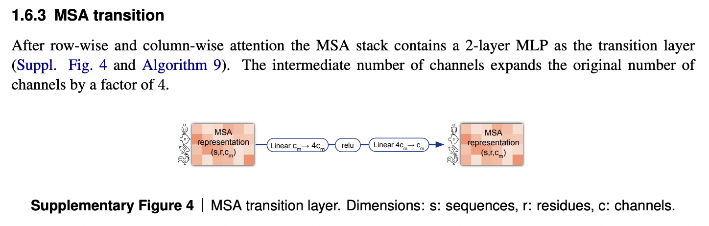

### Evoformer: Pair representation update from updated MSA representation via outer product mean

After MSA embeddings were updated, it is time to reflect this new MSA information in pair representations.

An obvious way to do this would be just to add the attention maps from MSA row-wise attention blocks to the previous iteration of pair representations.

But we need to take into account all the sequences within the same column. So, in order to do that, we just
calculate outer products of residues embedding projections within each sequence and average them over all sequences.

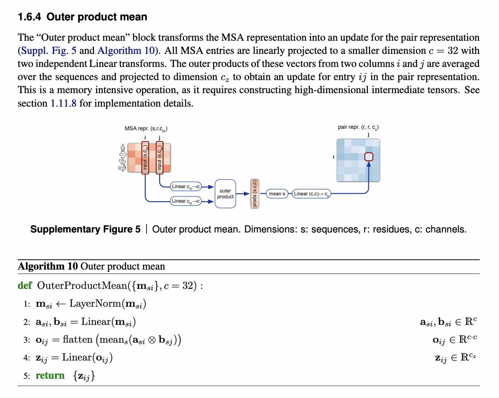


### Evoformer: Triangle inequalities as natural constraints for pair distances

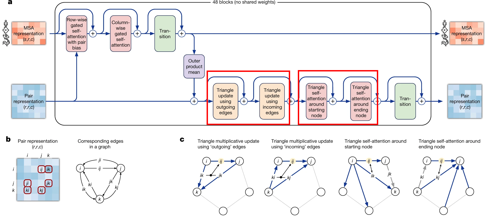<center>**Evoformer triangle inequalities**</center>

The last part of evoformer left to discuss is enforcement of triangle inequalities on pair representations after the update
of pair representation from MSA embeddings.

From the ML engineering standpoint triangle inequalities are implemented as soft constraints rather than hard constraints.

We have two triangular inequalities blocks here: triangle multiplicative update and triangle self-attention. Initially,
triangle multiplicative updates using outgoing/incoming edges were devised as a frugal alternative to triangle 
self-attention blocks. Either of these modules could be removed, and resulting model still performs well. However, it turned
out that SOTA is achieved when both modules are kept.

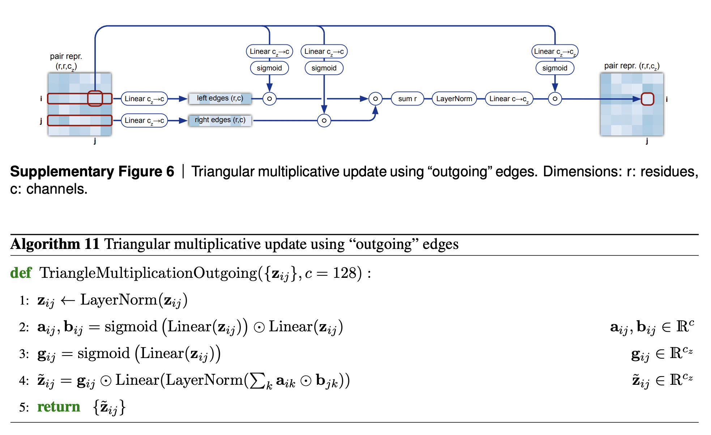

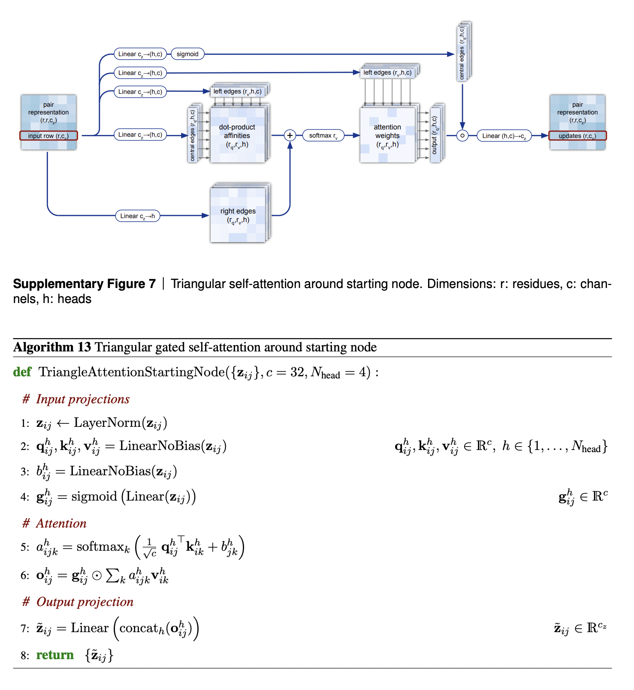

The visualizations of attention maps from triangle self-attention heads are very interesting. 

In the row (a) we see convolution patterns of radius 4 (diameter 8) residues. For instance, the distance between residues 14 and 15 depends on
distances between residues 14-16 and 14-17 and 14-13, 14-12 and 14-11. Authors speculate, that this head identified the
alpha-helices in proteins, which are spiral structures created by hydrogen bonds between i-th and (i+4)-th atoms, which might correspond to the patterns,
observed on this attention head.

In the row (b) we see that every distance between residues 14-1, 14-2, ..., 14-100 is affected by the length of 14-28 and 14-80 bonds.
Authors explain that residues 14, 28 and 80 are all cysteine, and they can form disulfide SS-bonds. Thus, such bonds would affect
the lengths of all other bonds, and attention heads have learnt to recognize this.

Finally, the row (c) suggests that even moderately deep layers of Evoformer, such as 11th, already have a good idea of the overall
protein 3D structure/pair representation. Compare these attention maps to the true CA-CA distances (rightmost picture in the top row). This 
theory is supported by the lowest plot in ablation study, suggesting that for simpler proteins the concept of 3D structure already
shapes up by 10th-20th layers of Evoformer.

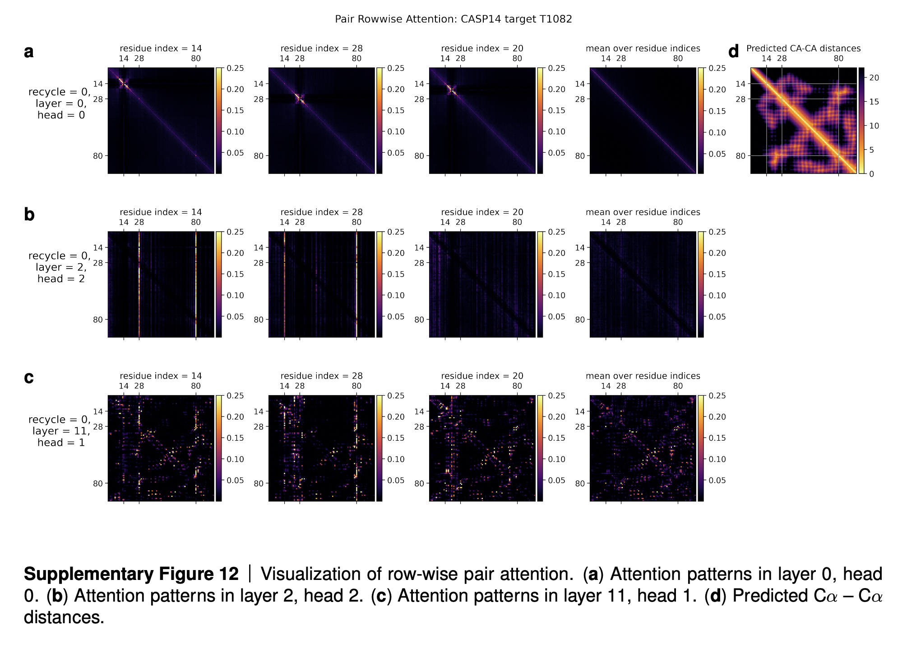

I quote the supplementary of the paper:

> In this section we are going to analyse a small subset of the attention patterns we see in the main part of
> the model. This will be restricted to relatively short proteins with fairly shallow MSA’s in order for easier
> visualization.

> We are going to examine the attention weights in the attention on the pair representation in the “Triangular
> gated self-attention around starting node” (Algorithm 13). The attention pattern for a given head h is a third
> order tensor a
> $h_{ijk}$ (line 5 of Algorithm 13), here we will investigate different slices along the i axis as well as
> averages along this axis, and display the jk array as a heat map. We specify the attention pattern for a specific
> head by the recycling index r, layer index l and head index h. We show the attention patterns in Suppl. Fig. 12

> In layer 0, head 0 (Suppl. Fig. 12a) we see a pattern that is similar to a convolution, i.e. the pair representation at (i, i + j) attends to the pair representation (i, i + k), where j and k are relatively small and the pattern
> is fairly independent of i. The radius of the pattern is 4 residues, we note that the hydrogen bonded residues
> in an alpha helix are exactly 4 residues apart. Patterns like this are expected in early layers due to the relative
> position encoding, however one would naively expect it to be wider, as the relative positions run to 32.

> In layer 2, head 2 (Suppl. Fig. 12b) we see a very specific attention pattern. We see that positions 14, 28
> and 80 play a special role. These correspond to the positions of cysteine residues in the protein. We see that
> at the cysteine positions the attention is localized to the other cysteine positions as exemplified by the bands
> in the first two panels. Meanwhile away at positions different from the cysteine like position 20, we see that
> the attention is devoid of features suggesting that the model does not use the attention at these positions. We
> found this behaviour to be consistent across different positions and proteins, this possibly indicates finding
> possible disulfides as a key feature of some heads.

> A head later in the network (Suppl. Fig. 12c) shows a rich, non-local attention pattern resembling the
> Suppl. Material for Jumper et al. (2021): Highly accurate protein structure prediction with AlphaFold 55
> distance between pairs in the structure (Suppl. Fig. 12d).

## Structure module

Now that we are done with MSA embeddings and pair representations, time to predict the actual protein structure.

Structural module cuts the embedding of our sequence of interest out of the alignment. It uses that sequence's embedding
and pair representation to predict the structure.

Most of this process is relegated to the invariant point attention module (IPA), which joins all the sources of information together. However, even if you remove it entirely, but keep the recycling process, AlphaFold2 surprisingly still works pretty good (see ablation study). 

First, I will have to say a few words about biology/chemistry of proteins to explain the rest.

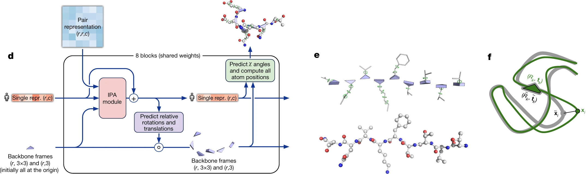<center>**Structure module**</center>

Peptide chain is formed by aminoacid residues. Each aminoacid residue has 3 mandatory pieces - amino group, c-alpha atom and carbonic acid group. These 3 groups form the *backbone* of the protein, 
which is the most important thing to predict. Also, each aminoacid has a radical, which can differ by aminoacid type (there are 20 types of standard aminoacids - 20 standard radical types).

Given that, there are 3 torsion angles that describe the backbone part of each aminoacid - $\varphi$, $\psi$ and $\omega$. The first two angles - $\varphi$ and $\psi$ - can vary in a broad range,
while $\omega$ is almost exactly 180 due to nitrogen atom having an electron pair, which really loves to be in the same plane as pi-electrons of C=O double bond. Hence, the N-C peptide bond is actually almost double
and there is almost no rotation around it.

The aminoacid radical length varies by aminoacid type, but they can also rotate around each of its atoms, so that their rotation angles are described by $\chi_1$, $\chi_2$, ..., up to $\chi_5$ torsion angles.

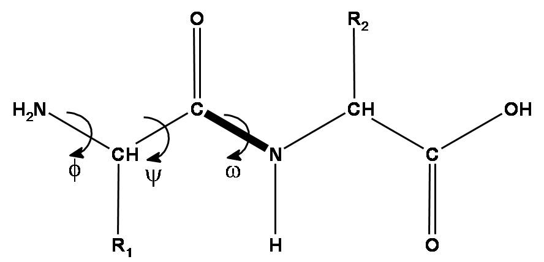<center>**Torsion angles in peptide chain**</center>

DeepMind decided that they will represent each residue as a triangle, they call *backbone frame*, where its vertex next to obtuse angle is $C-\alpha$ atom, and two
other vertices are N atom of aminogroup and C atom of carbonic acid group. For each residue one has to predict a 3-vector
of bias (how much you need to shift the residue relative to the global coordinate system) and 3x3 rotation matrix (the angle
of rotation of the triangle). Hence, the main part of the system predcits only the backbone, while $\chi$ angles, describing the radicals,
are predicted by a separate ResNet.

The backbone frames are initialized at the center of global coordinate system (DeepMind came up with a funny name "black hole initialization"), and are updated
using the information from the updated sequence embedding, which receives information from Invariant point attention module.

Invariant point attention module is responsible for aggregating together the information from all 3 sources - sequence embedding (extracted from MSA embedding),
pair representation and backbone frames. It predicts coordinates of residues based on just the sequence embedding, merges that prediction with
the previous iteration of structure data and applies an attention to the resulting coordinates. In that attention affinities matrix
all 3 sources of information are added - the sequence embedding, the pair representation and current 3D structure - so that
all of them affect the resulting updated sequence representation.

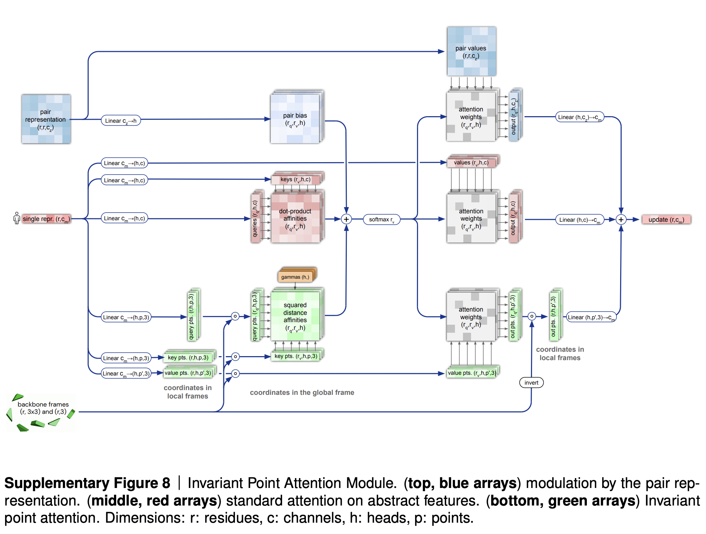

The loss function that compares the predicted structure to the actual one, is called FAPE. It is invariant to the changes
of global coordinate frame (that makes sense, as changing the viewpoint does not affect the predicted protein structure)
and is a mixture of L2-norm with some smart regularizations/crops and other engineering tricks.

After the Neural network part produces the prediction of 3D structure, an OpenMM package is used to relax that structure with
physical methods (molecular dynamics usually fails to find the global solution from scratch, but works reasonably, if the system is near its
optimum).

## Refinement a.k.a. "recycling" 

However, all this structural bioinformatics savviness, as ablation study shows, is less valuable than
refinement/recycling procedure. Without IPA, but with refinement AlphaFold2 still performs pretty well. Actually if you remove
refinement and keep IPA, it works worse than if you remove IPA and keep the refinement!

The ideology of this refinement procedure stems from a computer vision problem of human pose estimation (see [Human Pose Estimation](https://arxiv.org/pdf/1507.06550.pdf) paper).

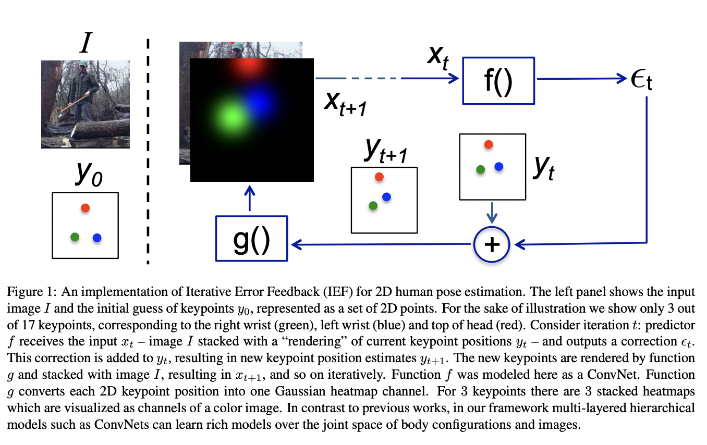<center>**Refinement**</center>

In order to accurately predict the human pose, we start with an image, and a default pose, concatenated together as separate channels,
and let the NN incrementally choose optimal pose update. Apparently, protein backbone prediction does not differ much from human pose estimation.

Again, I feel that DeepMind tried two alternative approaches for prediction of 3D structure, IPA and refinement, and just like it happened with
triangle inequalities instead of choosing one, kept both.

## Self-distillation
Self-distillation is another engineering trick that allowed DeepMind to beat the baseline (see ablation study).

As our dataset clearly contains much more unlabeled data (over 200M sequences) than labeled (less than 200K structures),
it makes all sense to treat the problem as semi-supervised learning. DeepMind used the following approach. 

### Noisy Student Training

See [Self-training with Noisy Student improves ImageNet classification](https://arxiv.org/pdf/1911.04252v4.pdf) paper. 

Noisy Student Training recently allowed to set a new SOTA on ImageNet, improving top-1 accuracy by 2% to 88.4% by utilizing 
semi-supervised learning, using 3.5 billion unlabled images from Instagram.

Noisy Student Training is a semi-supervised learning approach. It extends the idea of self-training and distillation with the use of equal-or-larger student models and noise added to the student during learning. It has three main steps:

 1. train a teacher model on labeled images
 2. use the teacher to generate pseudo labels on unlabeled images
 3. train a student model on the combination of labeled images and pseudo labeled images.
 
The algorithm is iterated a few times by treating the student as a teacher to relabel the unlabeled data and training a new student.

Noisy Student Training seeks to improve on self-training and distillation in two ways. First, it makes the student larger than, or at least equal to, the teacher so the student can better learn from a larger dataset. Second, it adds noise to the student, so that the noised student is forced to learn harder from the pseudo labels. To noise the student, it uses input noise such as RandAugment data augmentation, and model noise such as dropout and stochastic depth during training.

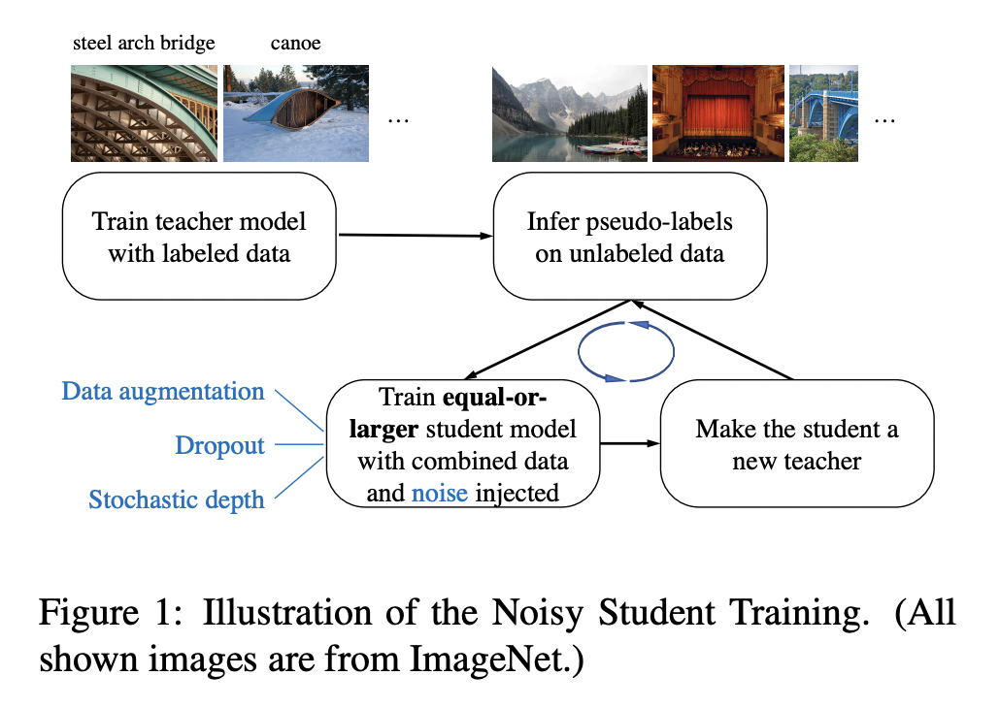

## Frame Aligned Point Error (FAPE) loss and auxiliary losses
The main structural loss function, used in the course of training of AlphaFold2, is called Frame Aligned Point Error (FAPE). 

Basically, for each residue it measures a "robustified" version of L2-norm of all the heavy atoms, compared to ground truth. And then it sums
those deviations under L1-norm. Apparently, such approach is more robust to outliers. Interestingly, it is also capable of
distinguishing between stereoisomers. FAPE can either include or ignore aminoacid radicals and $\chi$ angles.

However, the loss used for training is a weighted average of the main FAPE and auxiliary losses:

* $\mathcal{L}_{FAPE}$ is FAPE loss
* $\mathcal{L}_{aux}$ is a loss from auxiliary metrics in structure module
* $\mathcal{L}_{dist}$ is loss from distogram prediction
* $\mathcal{L}_{msa}$ is a loss from BERT-like masked MSA position prediction
* $\mathcal{L}_{conf}$ is a loss from model confidence pLDDT prediction
* $\mathcal{L}_{exp_resolved}$ is a loss from a head, predicting, if structure comes from a highly accurate experimental prediction, such as CryoEM or high-resolution X-ray crystallography
* $\mathcal{L}_{viol}$ is a loss for structural violations; penalizes unlikely lengths of bonds, torsion angles and sterically clashing atoms, even if ground truth structure is unavailable 

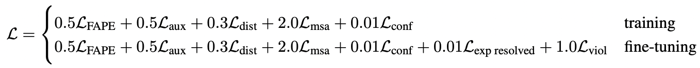<center>**AlphaFold2 losses**</center>

#### Distogram prediction loss
AF2 tries to predict not only the distances between residues, but also distributions of distances, called *distograms*. Again, errors in those distributions are used as auxilliary losses.

#### BERT-like loss for the quality of prediction of MSA positions
Self-supervised approach, similar to BERT approach.

AlphaFold2 masks-out or mutates a position of alignment and tries to predict it.

#### Confidence losses and prediction of experiment 
AF2 outputs its confidence in the predicted residues coordinates, which are used as auxiliary losses. It also tries to predict, if a structure it looks at,
was determined experimentally, or predicted.

#### Structural violoation losses
Another sanity-check for AF2, which penalizes unrealistic 3D structure features, such as bond lengths, angles, steric hindrances etc.

## Training protocol
AF2 was trained on TPUv3 for about a week and than fine-tuned for 4 days.

Interestingly, the model training requires 20GB video memory, while TPUv3 provides only 16GB. Hack: partially forget activations after forward pass and re-calculate them on backward pass. Essentially sacrifice FLOPS for VRAM.

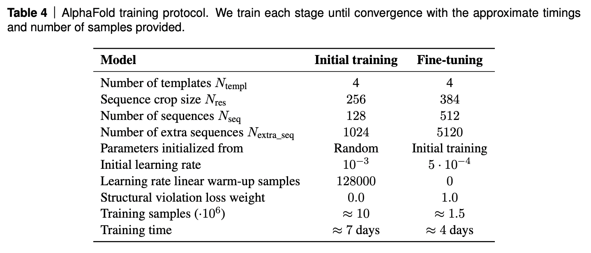<center>**AlphaFold2 training**</center>

## Ablation study

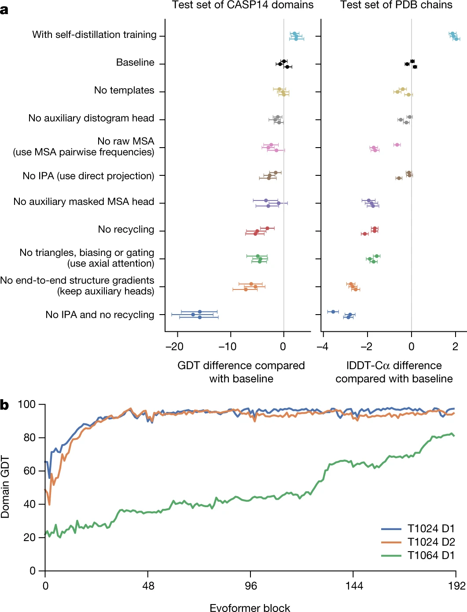<center>**AlphaFold2 ablation study**</center>

## References
* https://www.nature.com/articles/s41586-021-03819-2 - original AlphaFold2 paper
* https://static-content.springer.com/esm/art%3A10.1038%2Fs41586-021-03819-2/MediaObjects/41586_2021_3819_MOESM1_ESM.pdf - AlphaFold2 paper supplementary
* https://github.com/deepmind/alphafold - AlphaFold2 source code
* https://moalquraishi.wordpress.com/2021/07/25/the-alphafold2-method-paper-a-fount-of-good-ideas/ - blog post by Mohammed Al Quraishi
* http://nlp.seas.harvard.edu/2018/04/03/attention.html - annotated transformer notebook
* https://arxiv.org/abs/2002.05202 - "GLU Variants Improve Transformer" paper
* https://arxiv.org/pdf/1912.00349.pdf - "Not All Attention Is Needed: Gated Attention Network for Sequence Data" paper
* https://openaccess.thecvf.com/content_ECCV_2018/papers/Pau_Rodriguez_Lopez_Attend_and_Rectify_ECCV_2018_paper.pdf - "Attend and Rectify: a Gated Attention Mechanism for Fine-Grained Recovery." paper
* https://arxiv.org/pdf/1811.11721v2.pdf - "CCNet: Criss-Cross Attention for Semantic Segmentation" paper
* https://arxiv.org/pdf/2102.10662.pdf - "Medical Transformer: Gated Axial-Attention for Medical Image Segmentation" paper
* https://www.youtube.com/watch?v=Uk7m93V14KA - a talk on Medical Transformer
* https://arxiv.org/pdf/1802.08219.pdf - "Tensor field networks: Rotation- and translation-equivariant neural networks for 3D point clouds" paper 
* https://arxiv.org/pdf/2006.10503.pdf - "SE(3)-Transformers: 3D Roto-Translation Equivariant Attention Networks" paper by Max Welling group
* https://papers.nips.cc/paper/2019/file/f3a4ff4839c56a5f460c88cce3666a2b-Paper.pdf - "Generative models for graph-based protein design" paper
* https://arxiv.org/pdf/1507.06550.pdf - "Human Pose Estimation with Iterative Error Feedback" paper
* https://arxiv.org/pdf/1911.04252.pdf - "Self-training with Noisy Student improves ImageNet classification" paper
* https://www.biorxiv.org/content/10.1101/2021.02.12.430858v1.full - MSA Transformer paper by Pieter Abbeel
* https://www.ddw-online.com/media/32/03.sum.the-cost-and-value-of-three-dimensional-protein-structure.pdf - on cost and value of experimental protein 3D structure recovery (2003)
* https://blog.inten.to/hardware-for-deep-learning-part-4-asic-96a542fe6a81 - awesome longread by Grigory Sapunov of Intento on deep learning hardware
* https://en.wikipedia.org/wiki/High_Bandwidth_Memory - on GPU memory
* https://t.me/gonzo_ML/787 - a write-up on gMLP by Grigory Sapunov: gated feed-forward network with performance comparable to transformers 
