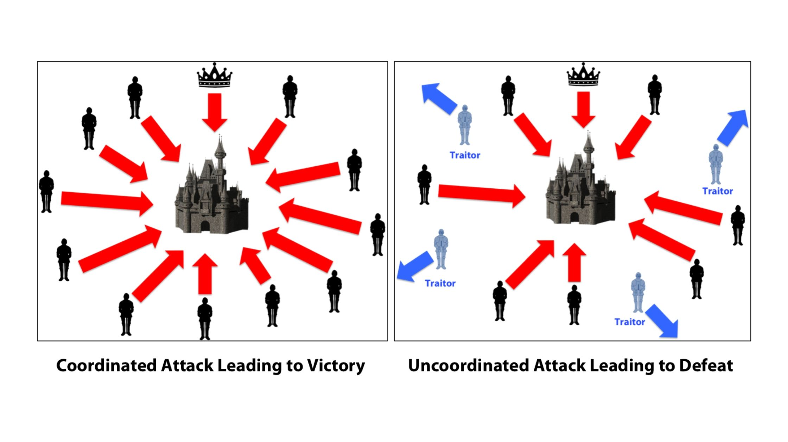

Общие вопросы
=============

Что такое блокчейн?
-------------------

Блокчейн - это децентрализованная база данных. Поясню на примере использования.

Вообразим ситуацию, что в России снова наступил 1991 год, инфляция национальной валюты измеряется сотнями процентов, и она де-факто стала непригодна для использования как средство накопления и взаиморасчетов. Поскольку наш воображаемый Центробанк ведет неадекватную денежно-кредитную политику, умельцы-компьютерщики среди местного населения решают выпустить электронные деньги и использовать их как средство взаиморасчетов.

Что требуется, чтобы осуществлять взаиморасчеты? Фактически, нужно дать возможность гражданам создавать кошельки и осуществлять между ними денежные переводы друг другу, называемые транзакциями. 

Для этого компьютерщики придумали супер-толстую распределенную электронную бухгалтерскую книгу, в которой отражены все переводы за всю историю. Такая книга и называется блокчейн. 

Каким требованиям должна отвечать эта бухгалтерская книга? 

1. Граждане должны иметь возможность осуществить денежный перевод в любой момент времени, поэтому наша бухгалтерская книга должна быть доступна в любой момент времени. Для этого книга должна быть распределена по большому количеству компьютеров, называемых узлами или нодами блокчейна. Если часть нод оказалась временно недоступна (у них пропал выход в интернет, электричество и т.п.), это не должно приводить к отказу в обслуживании системы.
2. Все ноды, образующие эту книгу, должны придерживаться единого мнения о том, какие транзакции осуществлялись. Не должно быть ситуации, что по прошествии какого-то достаточно долгого периода времени, например, часа после совершения вами транзакции, одна часть нод думает, что у вас миллион рублей, а другая - что два. Иными словами, есть только одна история, и все ноды в нее верят.
3. Если часть нод содержит злонамеренно измененный программный код, и хочет обмануть остальные ноды (например, пытается убедить всю остальную сеть, что все пользователи переводят свои деньги злоумышленнику X), такая возможность должна быть исключена, если только злоумышленник не контролирует очень большую долю нод (обычно, треть или больше).
4. Если у пользователя в кошельке есть рубль, то его нельзя потратить дважды. Если деньги ушли, то они ушли, нельзя второй раз ими заплатить.

Чтобы объяснить подробнее, как устроен блокчейн, мне потребуется объяснить следующие понятия:

 - задача Византийских Генералов и консенсус в распределенной системе
 - хеш-функция, криптография на асимметричных ключах и электронная цифровая подпись

Что такое алгоритмы консенсуса в блокчейне? Почему его невозможно «обмануть»? Как в блокчейне используется криптография?
------------------------------------------------------------------------------------------------------------------------

Консенсус в распределенной системе - это обеспечение согласованности между нодами.

Подобно тому, как "крестным отцом" науки о нейронных сетях является Джеффри Хинтон, "крестным отцом" науки о консенсусе является американский ученый в области компьютерных наук [Лесли Лэмпорт](https://en.wikipedia.org/wiki/Leslie_Lamport), занявшийся проблемой консенсуса в распределенных вычислительных системах в 1970 - 1980-ые в связи с необходимостью создания отказоустойчивых систем управления для космических спутников. 

 
Лесли Лэмпорт

Чтобы популяризовать свои идеи, Лэмпорт любил придумывать им звучные названия. Проиллюстрировать суть распределенного консенсуса Лэмпорт решил, сформулировав проблему Византийских Генералов. 

>Скорее всего Лэмпорт имел слабое представление об истории Византии, и сначала [хотел назвать данную задачу проблемой албанских генералов](https://lamport.azurewebsites.net/pubs/pubs.html#trans). Почему албанских? А почему бы и нет, как говорил Роберт Де Ниро в ["Хвост виляет собакой"](https://en.wikipedia.org/wiki/Wag_the_Dog). Позднее Лэмпорту все-таки указали, что не совсем вежливо называть вымышленную проблему именем реально существующей страны, и он переименовал генералов в византийских, что оказалось крайне удачным названием с исторической точки зрения.

Итак, что такое задача византийских генералов или византийских отказов?

Перенесемся в конец X века: армии византийского императора [Василия II Болгаробойцы](https://ru.wikipedia.org/wiki/%D0%92%D0%B0%D1%81%D0%B8%D0%BB%D0%B8%D0%B9_II_%D0%91%D0%BE%D0%BB%D0%B3%D0%B0%D1%80%D0%BE%D0%B1%D0%BE%D0%B9%D1%86%D0%B0) под командованием нескольких генералов ведет осаду болгарской крепости. 

Задача императора - написать устав для своих генералов, который бы обеспечивал синхронность действий их армий. То есть все армии должны дружно наступать или дружно отступать, несогласованность приведет к поражению. Решению этой задачи мешают два препятствия.

 
Задача Византийских Генералов: на левой картинке все армии синхронно наступают - в таком случае достигается победа. На правой картинке между армиями не достигнут консенсус, и часть армий под командованием мятежных генералов отступает, в то время как преданные императору генералы наступают - поражение.

Препятствие 1: недостаточно просто назначить одного генерала постоянным главнокомандующим. Любой из генералов во время боя может оказаться недоступен, временно (отрезан в пылу сражения) или постоянно (убит). 

Поэтому каждый генерал в армии, принимая решение, что делать его армии в данный момент, по уставу должен ориентироваться на мнения остальных генералов. Предположим, в армии - семь генералов. Если пять говорят “наступать”, один - “отступать” (может быть, потому что он не может адекватно оценить обстановку со своей позиции, а может он - предатель), и еще один недоступен, то солдаты считают, что между пятью генералами достигнут кворум, и следует дружно наступать.

Препятствие 2: Византийские генералы склонны к предательству. Это похоже на игру в мафию: мятежные генералы притворяются, что соблюдают устав и верны византийской государственности, но в самый ответственный момент готовятся осуществить мятеж (обманом убедив лояльных генералов, что имеется кворум с приказом “отступать”, когда на самом деле следовало “наступать”), привести армию к поражению в войне и узурпировать власть в Византии. Мятежников, как правило, все-таки меньшинство. Например, предположим, что трое из семи генералов в армии Василия - [Варда Фока](https://en.wikipedia.org/wiki/Bardas_Phokas_the_Younger), [Варда Склир](https://en.wikipedia.org/wiki/Bardas_Skleros) и [Миахил Бурцес](https://en.wikipedia.org/wiki/Michael_Bourtzes) - втайне готовят мятеж и ведут двойную игру.

Соответственно, устав Василия II должен минимизировать риск, что им удастся добиться успеха. Существует целый ряд алгоритмов обеспечения такого консенсуса.

Что такое хеш-функция? Что такое публичный и приватный ключ? Что такое электронная подпись?
------------------------------------------------------------------------------------

Предположим, преданный византийский генерал [Дамиан Далассен](https://en.wikipedia.org/wiki/Damian_Dalassenos) хочет послать императору Василию II письмо с информацией о своих планах, однако дорога, по которой проезжает его гонец, оказалась под контролем предателей Фоки, Склира и Бурцеса, и те перехватили гонца и подменили документ, исправив в документе слово "наступать" на слово "отступать". Последствия могут оказаться катастрофическими. Как императору защититься от такой ситуации?

На помощь приходят два инструмента: хеш-функции и криптография на асимметричных ключах.

Хеш-функция - это функция, которая принимает на вход текст, и возвращает короткую последовательность символов заданной длины, обычно что-то вроде 64 символов. Дословно английское "хеш" означает "пропустить через терку", "нарезать", то есть вы как бы делаете салат из своего длинного документа, и получаете бессмысленную, но очень короткую последовательность символов на выходе.

Главная ценность хеш-функции состоит в том, что с помощью нее можно быстро проверить, совпадают ли два текста. Вместо того, чтобы сравнивать сами тексты, вы можете вычислить хеш-функцию от каждого из них и проверить, совпадают ли они. 

Если император Василий каким-то образом узнал хеш от исходного документа, отправленного ему генералом Дамианом, а мятежные генералы что-то изменили в тексте документа, то хеш от полученного императором измененного документа почти наверняка не совпадет с хешем исходного. Факт различия хешей двух документов гарантирует, что эти документы - разные. Император будет знать, что текст документа подменили. 

Но, возможно, мятежные генералы могут подобрать такую модификацию текста, что хотя текст изменится, хеш от него будет таким же, как у исходного документа? Такое называется "коллизия хешей". Возможно такое или нет - зависит от конкретной хеш-функции, которая используется. Хеш-функции, для которых практически невозможно подобрать коллизию, называются [криптографически стойкими](https://ru.wikipedia.org/wiki/%D0%9A%D1%80%D0%B8%D0%BF%D1%82%D0%BE%D0%B3%D1%80%D0%B0%D1%84%D0%B8%D1%87%D0%B5%D1%81%D0%BA%D0%B0%D1%8F_%D1%85%D0%B5%D1%88-%D1%84%D1%83%D0%BD%D0%BA%D1%86%D0%B8%D1%8F). Ими и следует воспользоваться.

Хорошо, как же императору надежным образом получить хеш исходного документа для проверки целостности? Для этого используется криптография на асимметричных ключах.

Вкратце, генерал Далассен выпускает пару ключей, приватный (иногда также называемый секретным, это синонимы) и публичный. Приватный ключ он надежно хранит у себя и никому не показывает под страхом смерти, публичный же рассказывает всем и каждому.

Ключи можно использовать для шифрования текста. Текст, зашифрованный приватным ключом, можно расшифровать с помощью публичного. Текст, зашифрованный публичным ключом, можно расшифровать с помощью приватного.

Смысл этой конструкции в том, что если у вас получается расшифровать некий шифротекст публичным ключом Далассена, вы можете быть уверены, что зашифровать этот текст мог только обладатель приватного ключа Далассена (то есть только сам Далассен, если он бережно хранит свой приватный ключ).

Таким образом, чтобы гарантировать целостность документа, следует поступить так. Далассен вычисляет хеш от своего текста, дополняет его небольшим текстовым постскриптумом (например, "Привет императору от Делассена"), шифрует полученное сообщение своим приватным ключом, и прикладывает к тексту документа это шифрованное сообщение.

Император расшифровывает публичным ключом Далассена шифрованные хеш и постскрипутм. Если постскриптум получился какой-то разумный, это гарантирует ему, что только обладатель приватного ключа Далассена (то есть только сам Далассен) мог зашифровать эту часть послания. Стало быть, расшифрованный хеш можно использовать для проверки целостности остального документа. Если значение хеш-функции от текста документа совпадает с этим расшифрованным хешом, император может быть уверен, что текст не подделан.

Так работает [электронная цифровая подпись](https://en.wikipedia.org/wiki/Digital_signature). Криптография на асимметричных ключах гарантирует аутентичность послания, а хеш гарантирует его целостность.

Вернемся к устройству блокчейна
-------------------------------

Итак, мы знаем, что такое распределенный консенсус и что такое электронная цифровая подпись. У нас есть все, чтобы собрать наш блокчейн.

Каждая транзакция (денежный перевод), которую осуществляют пользователи нашей криптовалюты, должна быть зафиксирована во всех нодах.

Опасность, с которой мы можем столкнуться, состоит в том, что часть нод-участников блокчейна использует измененную версию программного кода, и пытается обмануть систему, присвоив себе чужие деньги.

Чтобы потратить деньги в нашем блокчейне, нужно обладать приватным ключом от кошелька, на котором лежат деньги, и отправить запрос на осуществление транзакции перевода денег с этого кошелька одной из нод блокчейна. Тут работает описанный выше механизм цифровой подписи, гарантирующий, что только владелец приватного ключа мог отправить такой запрос.

Чтобы убедиться, что пользователь не пытается второй раз потратить деньги, которые уже были им однажды потрачены, ноды проверяют, не содержится ли уже хеш данной транзакции в истории транзакций. Если достаточное количество нод блокчейна придет к распределенному консенсусу по вопросу, что транзакция не пытается повторно потратить деньги, ее одобряют и записывают.

В контексте ДЭГ активно использовалось понятие «нода наблюдателя». Что такое ноды в блокчейне? 
----------------------------------------------------------------------------------------------

Нода - узел. Просто компьютер, на котором установлена программа для участия в блокчейне.

Нода наблюдателя - это нода блокчейна, имеющая доступ только на чтения. С него можно посмотреть, что записывается в блокчейн, но валидировать и записывать транзакции нельзя.

Существовали ли в истории случаи взлома блокчейна? Насколько вероятно, что современный блокчейн (вроде того, что использовался в ДЭГ) может быть сломан? Может ли блокчейн быть компрометирован извне?
------------------------------------------------------------------------------------------------------------------------------------------------------------------------------------------------------

Начнем с простого: если более трети или более половины вычислительных мощностей нод находятся в руках одной группы лиц, они могут творить все, что им заблагорассудится, включая двойную трату денег (ну или в случае выборов скорее актуально двойное голосование).

Это называется атакой 51%, и случалось [неоднократно](https://habr.com/ru/company/pt/blog/425951/) с криптовалютами. Один из самых крупных инцидентов - с Bitcoin Gold, он привел к краже $18 миллионов и делистингу этой криптовалюты с ряда бирж.

В случае выборов 100% нод находятся под контролем государства, соответственно, двойную трату нельзя исключить.

В этом плане я вижу мало смысла в применении блокчейна, если все узлы в руках одной группы лиц. Вот если бы любой россиянин мог поднять собственную ноду и таким образом большая часть вычислительных мощностей оказалась в руках граждан - тогда это имело бы смысл. А в нынешнем формате использование блокчейна на выборах является или пустым PR-ходом, спекуляцией на ауре неподкупности блокчейна, или нереализованными благими намерениями технарей из ДИТа, которые хотели сделать все честно и по науке, но у их менеджеров оказались другие приоритеты.

Для достижения анонимности голосования в ДЭГ использовалось проксирование. Что из себя представляет прокси-сервер? Как он позволяет анонимизировать избирателей? Может ли прокси-сервер быть скомпрометирован?
--------------------------------------------------------------------------------------------------------------------------------------------------------------------------------------------------------------

TODO

Вопросы про выборы
==================

Как применялась технология блокчейна к выборам? Известны ли вам случаи применения блокчейна к выборам в мире? 
-------------------------------------------------------------------------------------------------------------

Когда вы организуете электронные выборы, вы встаете перед дилеммой: с одной стороны нужно сохранить тайну выборов, чтобы нельзя было посмотреть, как голосовал каждый конкретный человек, а с другой - нужно, чтобы исход выборов был проверяем.

Я слышал только про [пример Эстонии](https://habr.com/ru/company/wirex/blog/396095/), где для цифровых выборов использовали блокчейн. Так вот, [там просто пожертвовали анонимностью](https://habr.com/ru/post/574360/). То есть про каждого человека можно узнать, как он голосовал, зато можно и проверить результаты голосования.

Российские системы электронного голосования (федеральная и московская) ставили своей целью обеспечение анонимности, однако по итогам система получилась столь сложной и запутанной, что в случае наших электронных выборов нельзя гарантировать ни анонимности, ни честного подсчета результатов.

Может быть, из-за отсутствия анонимности кому-то даже имело бы смысл опасаться возмездия за нелояльность со стороны властей, однако в контексте того, что по данным социологических [опросов ВЦИОМ](https://wciom.ru/ratings/reiting-politicheskikh-partii) порядка 70% населения и так настроено против руководящей и направляющей Партии, кажется, что наказать более 2/3 населения не представляется возможным.

Согласно сайту observer.mos.ru для ДЭГ была выбрана модель Public Permissioned на блокчейне Exonum с алгоритмом консенсуса PBFT (Practical Byzantine Fault Tolerance). В чем отличительные особенности модели Public Permissioned, блокчейна Exonum и алгоритма консенсуса PBFT от аналогов?
--------------------------------------------------------------------------------------------------------------------------------------------------------------------------------------------------------------------------------------------------------------------------------------------

Нормальный децентрализованный блокчейн, находящийся под управлением граждан, который я описывал выше, исповедует модель Permissionless - то есть система децентрализована, и ноды, имеющие право проверять и подтверждать транзакции, находятся в руках широкой общественности.

В московских выборах использовалась другая модель - Permissioned - в этой модели ноды, имеющие право одобрять транзакции, находятся в руках узкого круга лиц - в нашем случае государства.

То есть как таковая децентрализация отсутствует. Единственное, в чем обществу пошли на встречу - это то, что она все-таки Public Permissioned - то есть есть публичные ноды, которые не могут писать, но могут читать блокчейн. Бывает также модель Private Permissioned, когда нельзя и читать.

[Practical Byzantine Fault Tolerance](http://www.pmg.csail.mit.edu/papers/osdi99.pdf) - один из алгоритмов распределенного консенсуса, предложенный в 1999 году знаменитой ученой-теоретиком компьютерных наук Барбарой Лисков и Мигелем Кастро.

В сущности, с учетом того, что используется модель Permissioned, все ноды с правом записи находятся в руках одной группы лиц, я не вижу необходимости в защите именно от византийских отказов (зловредных нод-предателей, пытающихся обмануть остальные). Ну разве что это защищает от того, что внутри ДИТа завелись злоумышленники, которые захватили контроль над частью нод. Но кажется, что это маловероятный сценарий, и достаточно было просто гарантировать отказоустойчивость и отсутствие двойных трат. С первым условием справились бы и классические алгоритмы консенсуса [Paxos или Raft](https://www.programmersought.com/article/42314543427/), которые используются в популярных распределенных системах типа Kubernetes, Kafka/Zookeeper, Ceph и т.п.

На Хабре есть [описание алгоритма консенсуса от самих разработчиков Exonum, компании Bitfury](https://habr.com/ru/company/bitfury/blog/440586/). 

Может ли быть такое, что созданная система устойчива к атакам извне, однако неустойчива к классическим методам фальсификации: к каруселям, вбросам, удалению наблюдателей, использованию «исчезающих чернил», подкупу и шантажу избирателей? Может ли технология блокчейна обезопасить избирателей от какого-либо из этих происшествий? Может ли существовать в каком-либо виде электронная карусель, электронный вброс, электронные исчезающие чернила?
--------------------------------------------------------------------------------------------------------------------------------------------------------------------------------------------------------------------------------------------------------------------------------------------------------------------------------------------------------------------------------------------------------------------------------------------------------

Да, так и есть, данная система неустойчива к классическим методам фальсификации. Есть все основания предполагать, что ими и воспользовались злоумышленники для фальсификации результатов ДЭГ.

В случае, если на реальном участке происходит вброс — часто видны пачки бюллетеней в избирательных урнах. Если происходит карусель — на разных участках можно зарегистрировать одинаковых избирателей. Как, на ваш взгляд, технология блокчейна соотносится с прозрачностью голосования? Является ли ДЭГ более прозрачным, чем аналоговое голосование? 
------------------------------------------------------------------------------------------------------------------------------------------------------------------------------------------------------------------------------------------------------------------------------------------------------------------------------------------------------

#### Спасибо ДИТу

Несмотря на все усилия айтишников из ДИТа московского правительства, в нынешней реализации ДЭГ является даже более непрозрачным, чем худшие примеры бумажных голосований, которые мы наблюдали в 2010-ые.

Вообще-то я хочу сказать большое спасибо технарям из ДИТа города Москвы, которые сделали целый ряд беспрецедентных шагов, чтобы обеспечить прозрачность голосования: открыли исходный код части проекта, открыли для скачивания один из блокйчейнов (но второй, приватный, закрыт - об этом подробнее скажу позже), опубликовали страницу ВИО и часть документации по запросам, отвечают на вопросы специалистов на очных собраниях рабочих групп, в Телеграм-каналах и на радио. Это очень близко к тому, как должен выглядеть диалог власти и общества в цивилизованной стране.

#### Операция прошла успешно, но пациент умер: косвенные статистически указания на масштабные фальсификации

Однако, в сухом остатке, как говорится, операция прошла успешно, но пациент умер. Итоги ДЭГ не вызывают доверия.

Явка в ряде последовательных блоков разительно отличается от остальных - 80% против 96%, о чем сообщили Брюханова и Кац. Так не бывает, это явный статистический выброс. Невозможно поверить, что аудитория Хованской - люди 40-ых - 60-ых годов рождения ворвалась в интернеты подобно ДДоС-атаке и смела миллениалов с зумерами, поддерживающих Брюханову.

#### Блокчейн на выборах используется не по назначению и только зря отвлекает внимание от сути

Весь смысл блокчейна состоит в том, что его ноды контролируются разными людьми. А в данном случае все они - под контролем государства. Соответственно, оно что хочет в него, то и пишет. С тем же успехом можно было использовать обычную шину сообщений вроде Apache Kafka, и не морочить никому голову. 

#### Блокчейнов два: публичный и приватный

Когда были подведены итоги выборов, мы полезли в дамп блокчейна, доступный для скачивания, и увидели, что 700 тысяч бюллетеней из 2 миллионов в нем до сих пор не расшифрованы. Что за абсурд, как можно было подвести итоги выборов, не расшифровав все голоса?

Оказалось, блокчейнов два: публичный и приватный. Для подведения итогов выборов использовали приватный, дампов которого у нас нет.

Таким образом, публичный блокчейн, дамп которого открыли для скачивания, выполняет роль эффектной ассистентки фокусника, которая оттягивает на себя внимание аудитории, пока Копперфильд мухлюет под столом. Правда, от него тоже есть некоторая польза в том плане, что поскольку его дамп был скачиваем в ходе всего голосования, можно было посмотреть, что всю историю голосования не придумали в последний момент и не переписали разом. Кроме того, благодаря его анализу удалось поймать блоки-выбросы (или, скорее, вбросы?) с явкой в 80%.

TODO: официальное объяснение причин использования двух блокчейнов

#### Другие поверхности атак

Но главное - для фальсификации выборов есть другие поверхности атаки, и вот от них гораздо больше причин ждать подвоха.

Я по-прежнему не представляю, как проверить, что не было мертвых душ. Как проверить итоги переголосования?

Подведение итогов выборов в Москве затянулось на 14 часов. Официальная версия заключается в том, что полученная задержка была связана с переголосованием. Так как каждая транзакция анонимна, для вычисления переголосовавших потребовалось какое-то большое количество операций. Не могли бы вы прокомментировать, жизнеспособно ли такое объяснение? В чем заключаются технические сложности такого подсчёта голосов? Происходит ли на этом этапе их расшифровка?
-------------------------------------------------------------------------------------------------------------------------------------------------------------------------------------------------------------------------------------------------------------------------------------------------------------------------------------------------------------------------------------------------------------------------------------------------------------------

TODO: Ссылаюсь на Петра Жижина, у которого расшифровка транзакций на достаточно обычном сервере с процессорами Ryzen 3900 заняла XXX времени.

Переголосование на данный момент абсолютно непрозрачно. В публичном блокчейне вообще 700 тысяч нерасшифрованных транзакций лежат так и не расшифрованными. Это означает, что он был вообще не нужен, м результаты выборов подводили не по нему, а по второму блокчейну - секретному. В этом смысле публичный блокчейн выполнил почти ту же роль, что эффектная помощница фокусника: пока аудитория таращится на ее талию, фокусник мухлюет под столом.

Может ли блокчейн в каком-то виде хранить данные о переголосовавших? Как понять, кто переголосовал, в общем блокчейне?
----------------------------------------------------------------------------------------------------------------------

Понять что-то о переголосовании из публичного блокчейна невозможно. Эти данные можно получить только из приватного блокчейна, так называемого БЧ-2, информация в нем широкой публике не предоставлена.

Блокчейн ДЭГ содержит несколько различных типов транзакций (расшифровка бюллетеня, прием бюллетеня и т.д). В чем отличие этих типов транзакций друг от друга, помимо поля с идентификатором транзакции? Может ли как-нибудь отличаться их обработка? 
----------------------------------------------------------------------------------------------------------------------------------------------------------------------------------------------------------------------------------------------------

TODO

Ссылки
------
 - https://lamport.azurewebsites.net/pubs/pubs.html#trans - автобиография Лессли Лэмпорта
 - https://en.wikipedia.org/wiki/Category:Generals_of_Basil_II - список генералов Василия II Болгаробойцы
 - https://academy.ivanontech.com/blog/byzantine-generals-problem-an-introduction - неплохая статья о Блокчейне и Византийских генералах
 - https://businessfm.kz/business/finance/kak-ustroeny-algoritmy-konsensusa-v-blokchejnah - зоопарк алгоритмов консенсуса в блокчейнах
 - https://habr.com/ru/company/bitfury/blog/440586/ - описание консенсуса в Exonum
 - https://habr.com/ru/company/bitfury/blog/348822/ - как работает майнинг от разработчиков Exonum
 - https://hackernoon.com/merkle-trees-181cb4bc30b4 - про деревья Меркла
 - https://habr.com/ru/company/bitfury/blog/346398/ - про деревья Меркла от разработчиков Exonum
 - https://www.codementor.io/blog/merkle-trees-5h9arzd3n8 - про применение деревьев Меркла
 - https://crypto-fox.ru/faq/double-spending/ - как осуществляет защита от двойной траты в блокчейне
 - https://habr.com/ru/company/pt/blog/425951/ - случаи реализации атаки 51%
 - https://habr.com/ru/post/574360/ - о дилемме "анонимность против проверяемости" результатов выборов
 - https://habr.com/ru/company/wirex/blog/396095/ - о ДЭГ в Эстонии
 - https://chainmedia.ru/newcomers/permissioned-vs-permissionless-blockchains/ - Permissioned blockchain
 - http://www.pmg.csail.mit.edu/papers/osdi99.pdf - PBFT original paper
 - https://www.programmersought.com/article/42314543427/ - Paxos vs Raft vs PBFT
 - https://businessfm.kz/business/finance/kak-ustroeny-algoritmy-konsensusa-v-blokchejnah - вариации алгоритмов PoX в блокчейне 