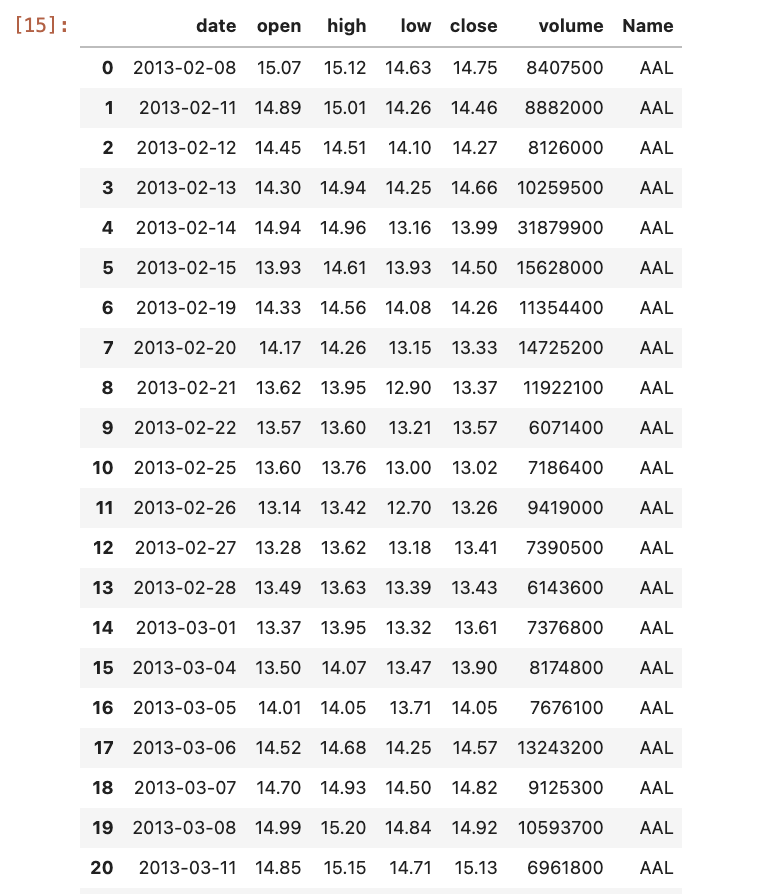
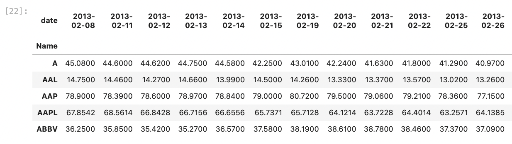
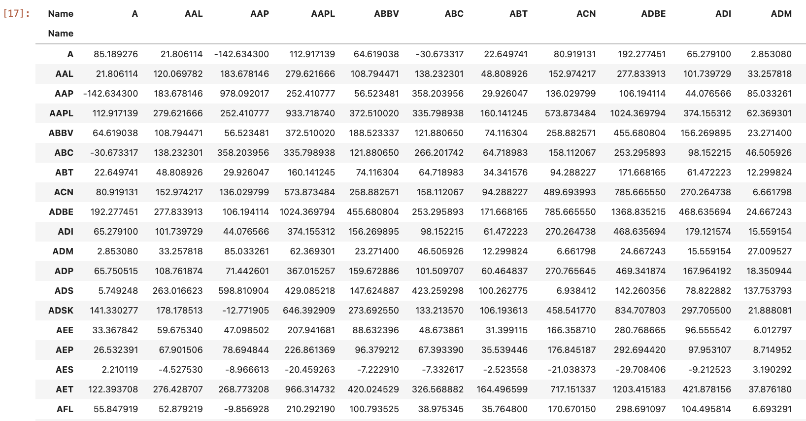
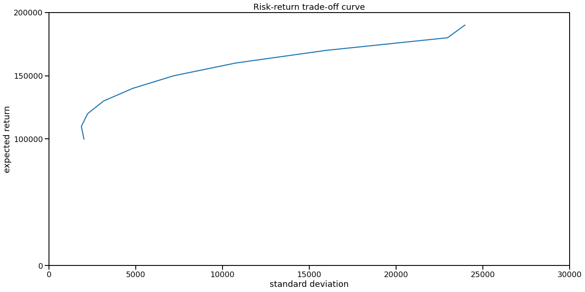

## Theory

### Motivation

Say, you want to invest your money. Bank deposits or bonds offer you a predictable way to do this: you freeze your money for a while and get a fixed interest rate, so that your money grow exponentially over time. 

The problem is: interest rates that bonds and deposits offer are so low, that they no longer cover even CPI/inflation growth, not speaking of the money creation rate, which is much faster.

So, as a conservative investor, you have to opt out of bonds/deposits and buy actual property. People would often invest into real estate (which has low liquidity, requires you to have a large sum of money and is generally a big hassle), some people opt into gold, or into controversial cryptocurrencies.

Today I am going to discuss a reasonably conservative financial investment - stocks portfolio.

Problem with stocks is that although they offer much higher interest rates than bonds/deposits on average and don't lose their value due to money creation as bonds and deposits do, they are volatile.

For instance, if you have a time point in near future, when you have to pay a certain sum (e.g. college fees for your child in 10 years), you would be very unhappy, if your stocks all of a sudden go down by 200% (which is totally possible due to an unexpected recession). 

So, opting for stocks rather than bonds, you trade away predictability of yield for higher average yield. This is called "Risk-reward tradeoff".

However, you can minimize the risks you assume by buying stocks, if you sufficiently diversify your money across a large enough selection of stocks. Diversification allows one to keep a high average yield, while making variance lower.

The mathematical theory behind this approach is called Modern Portfolio Theory (MPT). It is not so modern actually, as it was created circa 1952. Here I will formalize the problem of optimizing your portfolio to keep the reward high and risk low in terms of MPT.

### Problem formalization

To describe the risk, associated with investing in a certain equity, we are going to use variance or standard deviation of that equity. Imagine that equity was a perfectly predictable bank deposit or a bond, 
that just grows exponentially at an average yield rate in a totally predictable way. Now, in real life your stock prices would always diverge form that desirable exponential curve. Given historical data, we
can mathematically describe those deviations for average yield curve as a variance or standard deviation. 

High variance means high risk, which is undesirable - just imagine that in 10 years you need your money to pay for your child's college, while market shows a deep slump.

So what you are aiming for is to get a high expected yield on your assets, while keeping the variance of your portfolio low.

I have to make a little reservation here, however. In real life your wouldn't mind against high variance of your investment, if it only grows like a rocket at an unsteady rate - you would actually mind against the risk of downside. The theory that re-formulates the risk in terms
of probability of downside is called Post-Modern Portfolio Theory, but I am not going to discuss it here.

Ok, suppose that you have 500 S&P500 stocks and you want to create a portfolio, which is a linear combination of those stocks with some weights $x_1$...$x_{500}$. Return of each stock is modeled as $\xi_i$.

You want to minimize the variance of your portfolio: $Var[x_1 \xi_1 + x_2 \xi_2 + ... + x_{500} \xi_{500}]$.

Variance of a linear combination of non-independent random variables is a quadratic form, with its matrix being the covariance matrix.

E.g. $Var[x_1 \xi_1 + x_2 \xi_2] = x_1^2Var[\xi_1] + x_2^2Var[\xi_1] + x_1 x_2 Cov[\xi_1, \xi_2] + x_2 x_1 Cov[\xi_1, \xi_2] = x_1^2Var[\xi_1] + x_2^2Var[\xi_1] + 2 Cov[\xi_1, \xi_2]$.

To re-write this in matrix form:

$Var[x_1 \xi_1 + x_2 \xi_2 + ... + x_{500} \xi_{500}] = \begin{pmatrix} x_1 && x_2 && ... && x_{500} \end{pmatrix} \cdot \begin{pmatrix} Cov[\xi_1, \xi_1] && Cov[\xi_1, \xi_2] && ... && Cov[\xi_1, \xi_{500}] \\ Cov[\xi_2, \xi_1] && Cov[\xi_2, \xi_2] && ... && Cov[\xi_2, \xi_{500}] \\ ... && ... && ... && ... \\ Cov[\xi_{500}, \xi_1] && Cov[\xi_{500}, \xi_2] && ... && Cov[\xi_{500}, \xi_{500}] \\ \end{pmatrix} \cdot \begin{pmatrix} x_1 \\ x_2 \\ ... \\ x_{500} \end{pmatrix}$.

Or, in symbolic notation $Var[x_1 \xi_1 + x_2 \xi_2 + ... + x_{500} \xi_{500}] = {\bf x^T} {\bf P} {\bf x}$, where $P$ is covariance matrix (where element $P_{i,j}$ is the covariance between random variables $\xi_i$ and $\xi_j$).

So, we want to solve the following problem: we set the expected income $c_1$ of the portfolio (e.g. 15% growth) and portfolio size $c_2$ (e.g. \$100,000) and try to pick such instruments ${\bf x}$ for our portfolio, that $Var[x_1 \xi_1 + x_2 \xi_2 + ... + x_{500} \xi_{500}] \to min$:

(1) ${\bf x} = \arg \min_{\bf x} {\bf x}^T {\bf P} {\bf x}$,

(2) $x_1 y_1 + x_2 y_2 + ... + x_{500} y_{500} = c_1$,

(3) $x_1 p_1 + x_2 p_2 + ... + x_{500} p_{500} = c_2$.

Here equation (1) represents the portfolio variance, we want to minimize, constraint (2) represents the expected portfolio yield ($y_i$ being the projected mean yield of the $i$-th stock) and constraint (3) represents the total portfolio price (with $p_i$ representing the price of $i$-th stock).

Additionally, I want to introduce one more constraint. I want our portfolio to be sparse - i.e. I don't want to have all the 500 S&P 500 companies in it, but just a few. Say, 15-30 will do. Otherwise, it is going to be inconvenient to quickly sell it before recession, especially if the broker imposes a flat fee per deal.

In order to achieve sparsity, we can use L1 regularization approach:

(4) $|x_1| + |x_2| + ... + |x_{500}| = c_3$

We set an arbitrary limit $c_3$ on the sum of our sum's weights. As a result, only a small subset of $x_i$ weights will end up non-zero.

Additionally, if we are not planning to short any stocks (which makes sense for a conservative investor), we will require all our weights $x_i$ to be non-negative (and ideally integer as well, but this is numerically inconvenient).

This problem is well-known and mathematically tractable. It is called [Quadratic Programming](/2021-12-10-1).

## Practice

I implemented the solution in python/pandas/numpy and [cvxopt](https://cvxopt.org/userguide/index.html) quadratic programming library.

### S&P 500 dataset

As the dataset I used S&P 500 2013-2018 daily prices [dataset](https://www.kaggle.com/camnugent/sandp500) from Kaggle.

### Covariance matrix 

Calculation of the covariance matrix is somewhat non-trivial. 

#### How to calculate means, required to calculate covariance?

First, recall that sample covariance is $Cov[\xi, \eta] = \sum \limits_{i=1}^{n} \frac{1}{n-1} (\xi_i - \mathbb{E}\xi)(\eta_i - \mathbb{E}\eta)$.

What shall we use as mean $\mathbb{E}\xi$? Pandas Dataframes come with a function $.cov()$, which uses global average of time series $\xi_i$ as mean.

However, I believe that ideally we shall use a power function $p_0 i^t$ as a mean, where $p_0$ is starting cost of our stock in 2013, $i$ is its average interest rate from 2013 to 2018, e.g. 1.2 and $t$ is time in months or years.

Alternatively, they often use slipping average of shares prices + dividends as mean.

#### Should be semi-definite, in practice is not.

One more issue with the covariance matrix is that our time series of stock prices often contains NaNs. E.g. a merger happened, and
a company ceased to exist, or other company appeared. Stock prices after/before that event become NaNs.

The problem with NaNs is that covariance matrix stops being positive semi-definite, which breaks the quadratic programming.

So, we have two solutions here: either remove rows with NaNs, which makes S&P500 more of an S&P470. Or apply L2 regularization by
adding unit matrix with some coefficient and effectively increasing all the eigenvalues by some value until they all
become positive, so that the covariance matrix becomes positive semi-definite.

### Risk-return trade-off curve

Ok, here's the code. First, load our data.

```python
all_stocks = pd.read_csv("./data/kaggle_sandp500/all_stocks_5yr.csv")
all_stocks.head(50)
```



Now, pivot the dataset, so that it could be used to construct the covariance matrix, and remove NaNs:

```python
all_stocks_pivoted = all_stocks.pivot(index='Name', columns='date', values='close')
all_stocks_pivoted = all_stocks_pivoted.dropna()
all_stocks_pivoted.head(5)
```



After that we can calculate our covariance matrix:

```python
covariance_matrix = all_stocks_pivoted.transpose().cov()
covariance_matrix
```



Using the covariance matrix, we can run quadratic programming to optimize our portfolio. 

I assume that initially we have \$100,000, want to have \$115,000 in a year and have our portfolio contents somewhat sparse with
L1 norm constraint set to 1000, which results in a few dozen stocks. Here for simplicity I assume that expected returns of the shares are
means of their observed returns in 2013-2018.

```python
from cvxopt import matrix, solvers


def solve_optimization(total_cost_constraint, return_constraint, norm_constraint):
    covariance_matrix_np = covariance_matrix.to_numpy()
    dimension = covariance_matrix_np.shape[0]

    P = matrix(covariance_matrix_np)
    q = matrix(np.zeros(dimension, dtype=float))

    # construct inequality constraints
    G = np.zeros(covariance_matrix_np.shape, dtype=float)
    for i in range(dimension):
        G[i][i] = -1
    G = matrix(G)

    h = np.zeros(dimension, dtype=float)
    h = matrix(h)

    # construct 3 equality constraints: on total cost, on return and on L1-norm

    # total_cost_constraint specifies the total monetery value of our portfolio
    total_cost_equation_coefficients = all_stocks_pivoted["2018-02-07"].to_numpy()

    # return_constraint sets a fixed level of return, we expect from our portfolio
    return_constraint_equation_coefficients = all_stocks_pivoted["2018-02-07"].divide(all_stocks_pivoted["2013-02-08"]).pow(0.2).mul(all_stocks_pivoted["2018-02-07"]).to_numpy()

    # norm_constraint sets L1-norm on weights of instruments in our portfolio, serving as a computationally efficient proxy for L0-norm;
    # we want to get a sparse solution - not all 500 S&P companies with some weights, but only a small subset, e.g. 20;
    # by relaxing the norm_constraint, we can add more companies to our portfolio, by making it smaller - remove some
    norm_constraint_equation_coefficients = np.ones(dimension, dtype=float)

    A = np.vstack((total_cost_equation_coefficients, return_constraint_equation_coefficients, norm_constraint_equation_coefficients))
    A = matrix(A)

    b = np.array((total_cost_constraint, return_constraint, norm_constraint), dtype=float)    
    b = matrix(b)

    # solve QP
    return solvers.qp(P, q, G, h, A, b)


solution = solve_optimization(total_cost_constraint=100000, return_constraint=115000, norm_constraint=1000)
```

Now that optimization is finished, let's take a look at our portfolio: its variance and constituents.

```python
from cvxopt.blas import dot
import math


print(f"Standard deviation is ${math.sqrt(dot(solution['x'], matrix(covariance_matrix.to_numpy()) * solution['x']))}\n")


def get_tickers_and_weights(solution, prices):
    non_zero_weights = {}
    for index, weight in enumerate(solution):
        if weight > 0.1:
            non_zero_weights[index] = weight
    
    for index, weight in non_zero_weights.items():
        print(f"Buy {prices.index[index]:>5},    with weight {weight:>7.2f},    stock price {all_stocks_pivoted['2018-02-07'].iloc[index]:>7.2f},    total cost {all_stocks_pivoted['2018-02-07'].iloc[index] * weight:>9.2f}")
        
get_tickers_and_weights(solution['x'], all_stocks_pivoted)
```

Result is:

```
Standard deviation is $2008.011151528987

Buy  AMZN,    with weight    6.42,    stock price 1416.78,    total cost   9101.09
Buy DISCA,    with weight   44.45,    stock price   23.12,    total cost   1027.76
Buy    EA,    with weight   51.19,    stock price  123.05,    total cost   6298.40
Buy    ED,    with weight    7.70,    stock price   75.26,    total cost    579.37
Buy  EXPE,    with weight    0.79,    stock price  129.33,    total cost    102.80
Buy   HCP,    with weight  103.94,    stock price   23.38,    total cost   2430.05
Buy   IBM,    with weight   96.75,    stock price  153.85,    total cost  14885.51
Buy    LB,    with weight   35.77,    stock price   49.11,    total cost   1756.75
Buy   MAT,    with weight  185.08,    stock price   17.00,    total cost   3146.35
Buy  NFLX,    with weight   19.35,    stock price  264.56,    total cost   5119.91
Buy  NVDA,    with weight   33.91,    stock price  228.80,    total cost   7759.56
Buy   PCG,    with weight    3.24,    stock price   39.48,    total cost    127.78
Buy  PRGO,    with weight   25.20,    stock price   87.52,    total cost   2205.65
Buy   PSA,    with weight   93.25,    stock price  185.35,    total cost  17284.49
Buy    RE,    with weight   46.88,    stock price  246.70,    total cost  11566.49
Buy    RL,    with weight   86.28,    stock price  107.70,    total cost   9292.00
Buy   RRC,    with weight   43.45,    stock price   13.12,    total cost    570.00
Buy   SCG,    with weight   47.76,    stock price   36.66,    total cost   1750.94
Buy  SRCL,    with weight   68.58,    stock price   72.84,    total cost   4995.05
```

As you can see, our solution likes IT giants that performed especially well in the given timeframe, such as
Amazon, Netflix and Nvidia, as well as mediocre IBM. Also, many companies from other sectors of industry were
included, which minimized the variance. However, this result is not very robust, as those companies performed
well in 2013-2018, but in other periods of their existence didn't do as well.

### Risk-return tradeoff

I also tried to alter the return goal in order to get the risk-return curve and select the optimum of [Sharpe ratio](https://www.investopedia.com/terms/s/sharperatio.asp).

```python
risks = []
returns = []
for expected_return in range(100000, 200000, 10000):
    solution = solve_optimization(total_cost_constraint=100000, return_constraint=expected_return, norm_constraint=1000)
    risks.append(math.sqrt(dot(solution['x'], matrix(covariance_matrix.to_numpy()) * solution['x'])))
    returns.append(expected_returns)

# Plot trade-off curve and optimal allocations.
plt.figure(1, facecolor='w', figsize=(20,10))
plt.plot(risks, returns)
plt.xlabel('standard deviation')
plt.ylabel('expected return')
plt.axis([0, 30000, 150000, 200000])
plt.title('Risk-return trade-off curve')
plt.yticks([0.00, 100000, 150000, 200000])
```



From the looks of the risk-return curve you can tell, that it does not make sense to aim for a yearly interest rate less 
than 10%, as variance for 0% portfolio and 10% portfolio is basically the same. This is reasonable, as we expect M2 money
supply growth of 10% year-over-year, which means that even stagnating companies should be bringing 10% a year.

Currently, I am mostly investing in the Russian market, as it is undervalued and performs relatively well. However, I don't like
industrial companies in Russia, as historically they are managed by crooks, so my choice is limited to a handful of IT or finance
companies with good reputation. When I decide that it is time to buy S&P 500 more heavily, I will rely on this
approach more. 

I don't like the way I predict returns now, though. I will have to use better models. Their construction should allow for
automation using data from APIs of parsed financial statements, and be different for stable and expanding companies. For
instance, one could use the data from financialmodelingprep.com.

## References
* https://www.kaggle.com/camnugent/sandp500 - S&P 500 dataset from Kaggle
* https://site.financialmodelingprep.com/developer/docs - financialmodelingprep API with financial data
* http://cvxopt.org/examples/tutorial/qp.html - cvxopt quadratic programming tutorial
* https://cvxopt.org/userguide/coneprog.html - cvxopt documentation details on quadratic programming, including the risk curve and L1 norm etc.
* https://cvxopt.org/userguide/index.html - cvxopt user guide
* https://www.stat.cmu.edu/~ryantibs/convexopt/lectures/dual-gen.pdf - primal-dual Lagrange problems by Ryan Tibshirani (no, it's Robert's son)
* https://www.investopedia.com/terms/r/riskreturntradeoff.asp - risk-return tradeoff
* https://medium.com/bearnbull/demystifying-the-magic-of-modern-portfolio-theory-5ed86a03e4dc - good intro to MPF from medium
* https://en.wikipedia.org/wiki/Markowitz_model - about Henry Markowitz
* https://www.di.ens.fr/~aspremon/PDF/INFORMS05sparsePCA.pdf - on Sparse PCA in finance