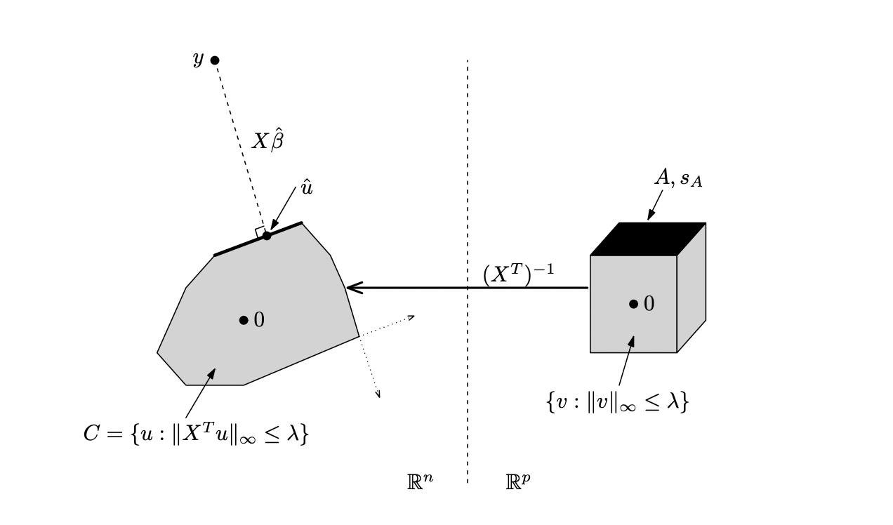

The computational implementation of Lasso regression/ElasticNet regression algorithms in Scikit-learn package is done
via coordinate descent method. As I had to re-implement a similar L1 regularization method for a different problem of large dimensionality, I decided
to study L1 regularization implementation from Scikit-learn in detail.

## Scikit-learn Lasso regression implementation

Consider the problem we aim to solve. We need to minimize the weighted sum of 2 terms: first term is the sum of squares of regression residues, second term is L1 norm of regression weights with some hyperparameter $\alpha$:

$f({\bf w}) = \underbrace{ ({\bf y} - X {\bf w})^2}_{\text{sum of squares of regression residues}} + \underbrace{\alpha ||{\bf w}||_{1}}_\text{L1-norm of regression weights} = \underbrace{ \sum \limits_{i=1}^{n} (y_i - \sum \limits_{j=1}^{p} w_j X_{i,j})^2}_{\text{sum of squares of regression residues}} + \underbrace{\alpha ||{\bf w}||_{1}}_{ \text{L1-norm of regression weights} } \to min$

Luckily, $f({\bf w})$ function is tractable, so it is easy to perform exact calculations of its gradient, hessian etc. 

Thus, we don't have to rely on the savvy techniques from numeric optimization theory, such as line search, Wolfe conditions etc.

Scikit-learn implementation of Lasso/ElasticNet uses a simple iterative strategy to find the optimum of this function. It iteratively
does coordinate-wise descent. I.e. at each step of the algorithm it considers each of the coordinates $w_i$ one by one and minimizes $f({\bf w})$ relative
to the coorindate $w_i$. At the end of each step it checks, whether the largest update among the regression weights $\max_i |w_{i}-w_{i-1}|$ 
was larger than a certain tolerance parameter. If not, it finally checks the duality gap between the solution of primal and dual
Lagrange problems for Lasso (more on the dual problem later), and if the gap is small enough, returns the weights and stops successfully. If dual gap
has not converged, although regression weights almost stopped decreasing, it emits a warning.

### Coordinate descent

At each step of our loop we will optimize each of the regression weights individually.

In order to do that, we will be calculating the partial derivative of the optimized function by each individual weight: 

$\frac{\partial f}{\partial w_k} = 2 \cdot \sum \limits_{i=1}^{n} (y_i - \sum \limits_{j=1}^{p} w_j X_{i,j}) \cdot (-X_{i,k}) + \alpha \frac{\partial|w_k|}{\partial w_k}$

To find the new optimal value of weight $w_i$ we will be looking for a point, where our function takes the minimum value, i.e. its partial derivative on $w_i$ equals 0:

$\frac{\partial f}{\partial w_k} = 0: $

$\sum \limits_{i=1}^{n} (y_i - \sum \limits_{j=1}^{p} w_j X_{i,j}) \cdot (-X_{i,k}) + \frac{\alpha}{2} \cdot \frac{\partial|w_k|}{\partial w_k} = 0$

$\sum \limits_{i=1}^{n} (y_i X_{i,k} - \sum \limits_{j=1}^{p} w_j X_{i,j} X_{i,k}) = \frac{\alpha}{2} \cdot \frac{\partial|w_k|}{\partial w_k}$

$\sum \limits_{i=1}^{n} (y_i X_{i,k} - \sum \limits_{j \ne k} w_j X_{i,j} X_{i,k}) - \sum \limits_{i=1}^{n} w_k X_{i,k}^2 = \frac{\alpha}{2} \cdot \frac{\partial|w_k|}{\partial w_k}$

$w_k \cdot \sum \limits_{i=1}^{n} X_{i,k}^2 = \sum \limits_{i=1}^{n} (y_i X_{i,k} - \sum \limits_{j \ne k} w_j X_{i,j} X_{i,k}) - \frac{\alpha}{2} \cdot \frac{\partial|w_k|}{\partial w_k}$

$w_k = (\sum \limits_{i=1}^{n} X_{i,k} (y_i - \sum \limits_{j \ne k} w_j X_{i,j}) - \frac{\alpha}{2} \cdot \frac{\partial|w_k|}{\partial w_k}) / (\sum \limits_{i=1}^{n} X_{i,k}^2)$

To write this result in a compact vector/matrix form, denote the vector of regression residues ${\bf R} = {\bf y} - X {\bf w} + w_k {\bf X_k}$, 

where ${\bf X_k} = \begin{pmatrix} X_{1,k} \\ X_{2,k} \\ ... \\ X_{n,k} \end{pmatrix}$ is the k-th column of matrix $X$.

Then we can re-write in vector form:

$w_k = (\langle {\bf R}, {\bf X_k} \rangle - \frac{\alpha}{2} \cdot \frac{\partial|w_k|}{\partial w_k}) / || {\bf X_k} ||_2^2$.

### Subgradient

Now, we should focus on the derivative of L1 regularization term: $\frac{\partial|w_k|}{\partial w_k}$.

For $w_k \ne 0$ it is trivial: $\frac{\partial|w_k|}{w_k} = sign(w_k)$. 

However, it is undefined for $w_k = 0$, and we cannot ignore this case, as the whole purpose of L1 regularization is to keep most of our regression weights $w_k$ equal to 0.

$\frac{\partial |w_k|}{\partial w_k} = \begin{cases} 1, w_k > 0 \\ -1, w_k < 0 \\ \text{undefined}, w_k = 0 \end{cases}$

The workaround from this situation is to replace the exact gradient with subgradient, which is a function less than or equal to the gradient in every point.

$sub \frac{\partial f}{\partial w_k} = \langle {\bf R}, {\bf X_k} \rangle - \frac{\alpha}{2} \cdot sub \frac{\partial|w_k|}{\partial w_k} - \underbrace{ || {\bf X_k} ||_2^2 \cdot w_k}_\text{0} = 0 \implies sub \frac{\partial|w_k|}{\partial w_k} = \langle {\bf R}, {\bf X_k} \rangle / \frac{\alpha}{2}$

Now, the allowed values of the subgradient are bounded by the derivatives at $w_k = 0_+$ and $w_k = 0_-$:

$-1 \le sub \frac{\partial|w_k|}{\partial w_k} \le 1$

Hence, substituting the subgradient from the formula above, we get:

$-1 \le \langle {\bf R}, {\bf X_k} \rangle / \frac{\alpha}{2} \le 1$

$-\frac{\alpha}{2} \le \langle {\bf R}, {\bf X_k} \rangle \le \frac{\alpha}{2}$

Now, if we substitute the exact gradient in coordinate descent formula with subgradient, we get:

$w_k = \begin{cases} 
  (\langle {\bf R}, {\bf X_k} \rangle - \frac{\alpha}{2} ) / || {\bf X_k} ||_2^2, w_k > 0 \iff \langle {\bf R}, {\bf X_k} \rangle > \frac{\alpha}{2} \\
  (\langle {\bf R}, {\bf X_k} \rangle + \frac{\alpha}{2} ) / || {\bf X_k} ||_2^2, w_k < 0 \iff \langle {\bf R}, {\bf X_k} \rangle < -\frac{\alpha}{2} \\ 
  0, -\frac{\alpha}{2} \le \langle {\bf R}, {\bf X_k} \rangle \le \frac{\alpha}{2} \end{cases}
$

### Stoppage criterion: Lasso dual problem and duality gap

Now, the stoppage criterion for the Lasso procedure is formulated in terms of pair of primal-dual optimisation problems.

While $\alpha$ is considered a parameter of the system, we introduce a variable substitution $X {\bf w} - {\bf y} = {\bf z}$.

We present this variable substitution as a set of constraints for the optimisation problem and apply Lagrange multipliers to it:

$\mathcal{L}({\bf w}, {\bf \Lambda}, {\bf z}) = {\bf z}^2 + \alpha || {\bf w} ||_1 + {\bf \Lambda}^T (X {\bf w} - {\bf y} - {\bf z})$

Lagrange dual problem is to find ${\bf \Lambda^*} = \arg \max \limits_{\bf \Lambda} \inf \limits_{\bf w, z} \mathcal{L}({\bf w}, {\bf \Lambda}, {\bf z})$

First, split our Lagrangian into 2 terms that we optimize independently:

$\mathcal{L}({\bf w}, {\bf \Lambda}, {\bf z}) = \underbrace{{\bf z}^2 - {\bf \Lambda}^T ({\bf z} + {\bf y} )}_\text{Term 1: minimize in {\bf z}} + \underbrace{\alpha || {\bf w} ||_1 + {\bf \Lambda}^T X {\bf w}}_\text{Term 2: minimize in {\bf w}}$

#### Term 1 analysis

Let us take the partial derivatives of term 1 in $z_i$:

$\frac{\partial ({\bf z}^2 - {\bf \Lambda}^T ({\bf z} + {\bf y}))}{\partial z_i} = 2z_i - \Lambda_i = 0$, and $z_i = \frac{\Lambda_i}{2}$

Substituting this back into term 1, we get:

$\min \limits_{\bf z} T_1 = \frac{1}{4} {\bf \Lambda}^T {\bf \Lambda} - 2 \frac{1}{4} {\bf \Lambda}^T {\bf \Lambda} - {\bf \Lambda}^T {\bf y} = \frac{1}{4} {\bf \Lambda}^T {\bf \Lambda} - {\bf \Lambda}^T {\bf y}$

#### Term 2 analysis

Let us take the partial derivatives of term 2 in $w_i$: 

$\frac{\partial ({\alpha || {\bf w} ||_1 + {\bf \Lambda}^T X {\bf w})}}{\partial w_i} = \alpha \cdot sign(w_i) + \{{\bf \Lambda}^T X\}_i = 0$

$\min \limits_{w_i} T_{2} = \begin{cases} 0, |\{{\bf \Lambda}^T X\}_i| \le \alpha \\ -\infty, |\{{\bf \Lambda}^T X\}_i| > \alpha \end{cases}$

(you can get $\{{\bf \Lambda}^T X\}_i w_i$ term to be negative, and it will outgrow $\alpha \cdot sign(w_i)$ if $|\{{\bf \Lambda}^T X\}_i| > \alpha$)

Hence, if any of $i$ terms $|\{{\bf \Lambda}^T X\}_i| > \alpha$, $\min T_2 = -\infty$, otherwise, $\min T_2 = 0$.

#### Taking the terms together and solving the Lagrange dual

The optimal value of Lagrangian, corresponding to the solution of this problem is:

$\inf \limits_{\bf w, z} \mathcal{L}({\bf \Lambda}) = \begin{cases} -\frac{1}{4} {\bf \Lambda}^T {\bf \Lambda} - {\bf \Lambda}^T {\bf y}, \{|X^T {\bf \Lambda}|\}_i \le \alpha \\ -\infty, otherwise \end{cases}$

So, we've come to a dual optimization problem: we need to achieve the maximum of dual function:

$q({\bf \Lambda}) = -\frac{1}{4} {\bf \Lambda}^T {\bf \Lambda} - {\bf \Lambda}^T {\bf y}$, 

given a set of inequality constraints $\{|X^T {\bf \Lambda}|\}_i \le \alpha$ (or, in an infinity-norm notation $||X^T {\bf \Lambda}||_{\infty} \le \alpha$).

Optionally, we can subtract ${\bf y}^T {\bf y}$ to the $q({\bf \Lambda})$  function, as it does not affect the minimization, as this form is more convenient for geometric interpretation. This results in:

$\max \limits_{\bf \Lambda} h({\bf \Lambda}) = || \bf \Lambda - y ||_2^2$, subject to $||X^T {\bf \Lambda}||_{\infty} \le \alpha$

The problem is convex and by Slater's condition if the solution of primal problem is feasible, the duality is strict.

Hence, duality gap converges to 0, and we can use it as a stoppage criterion in our Lasso problem.

### Geometric interpretation of Lagrange dual

The last form of Lasso dual $\max \limits_{\bf \Lambda} h({\bf \Lambda}) = || \bf \Lambda - y ||_2^2$, subject to $||X^T {\bf \Lambda}||_{\infty} \le \alpha$ allows for a direct, beautiful and intuitive geometric interpretation, provided by Ryan Tibshirani ([tutorial page 11](https://www.stat.cmu.edu/~ryantibs/statml/lectures/sparsity.pdf), [lecture 18 slides](https://www.cs.cmu.edu/~ggordon/10725-F12/slides/18-dual-uses.pdf)).

*Right-hand side*: $\bf \Lambda$ dual vectors with $L_\infty$ norm (here denoted $v$) having each coordinate not greater than $\alpha$ (here denoted $\lambda$). Hence, those dual vectors form a cube in $\mathbb{R}^p$ space (where $p$ is the number of predictors).   *Left-hand side*: if we were to multiply those dual vectors by inverse of $X^T$ matrix, we go back into the primal space $\mathbb{R}^n$. In primal space the cube of valid dual vectors $\bf \Lambda$ ($v$) is transformed into a convex polytope, where the image of each vector $\bf \Lambda$ ($v$) is denoted $u$. By solving the Lasso regression problem we find such a direction $\bf w$ that projection of the vector $\bf y$ onto this polytope along direction $X {\bf w}$ is a specific vector $u$, such that the length of the normal to this projection $|| X {\bf w} - \bf y ||_2$ is minimal.

## Alternatives: preconditioned conjugate gradients, quadratic programming, safe rules

TODO

## References
* https://webdoc.agsci.colostate.edu/koontz/arec-econ535/papers/Tibshirani%20(JRSS-B%201996).pdf - the original paper by Robert Tibshirani
* https://hastie.su.domains/Papers/glmnet.pdf - GLMnet implementation paper by Friedman, Hastie and Tibs
* https://web.stanford.edu/~boyd/papers/pdf/l1_ls.pdf - Kim, Gorinevsky paper on faster solution PCG, dual problem etc.
* https://hal.archives-ouvertes.fr/hal-01833398/document - Celer, an alternative recent Lasso solver
* https://stephentu.github.io/blog/convex-optimization/lasso/2016/08/20/dual-lasso-program.html - lasso dual derivation by Stephen Tu
* https://www.coursera.org/lecture/ml-regression/deriving-the-lasso-coordinate-descent-update-6OLyn - a great lecture on exact solution of Lasso regression with coordinate descent by Emily Fox/Carlos Guestrin
* https://davidrosenberg.github.io/mlcourse/Archive/2019/Lectures/03c.subgradient-descent-lasso.pdf - a good presentation on subgradient descent by David Rosenberg
* https://davidrosenberg.github.io/mlcourse/Notes/convex-optimization.pdf - extreme abridgement of Boyd-Vanderberghe's Convex Optimization
* https://xavierbourretsicotte.github.io/lasso_derivation.html - excellent blog post on Lasso derivation
* https://machinelearningcompass.com/machine_learning_math/subgradient_descent/ - a great post by Boris Giba on subgradient descent
* https://en.wikipedia.org/wiki/Slater%27s_condition - Slater's condition
* https://www.eecis.udel.edu/~xwu/class/ELEG667/Lecture5.pdf - amazing lecture with graphical explanation of strong/weak duality
* https://www.stat.cmu.edu/~ryantibs/statml/lectures/sparsity.pdf - Ryan Tibshirani paper/tutorial with nice geometrical interpretation of Lasso dual
* https://www.cs.cmu.edu/~ggordon/10725-F12/slides/18-dual-uses.pdf - same material by Geoff Gordon & Ryan Tibshirani, but as a presentation with updates on safe rules
* https://www.ias.ac.in/article/fulltext/reso/023/04/0439-0464 - intro to Lasso by Niharika Gauraha
* https://sites.stat.washington.edu/courses/stat527/s13/readings/osborneetal00.pdf - on Lasso and its dual by Osborne, Presnell and Turlach
* http://www.aei.tuke.sk/papers/2012/3/02_Buša.pdf - paper on solving quadratic programming problem with L1 norm by variable substitution by Jan Busa, alternative approach to convex optimization
* http://proceedings.mlr.press/v37/fercoq15.pdf - paper on improing safe rules for duality gap (improvement on the seminal 2012 el Ghaoui work on safe rules - fast screening techniques)
* https://people.eecs.berkeley.edu/~elghaoui/Teaching/EE227A/lecture8.pdf - el Ghaoui lecture on Lasso
