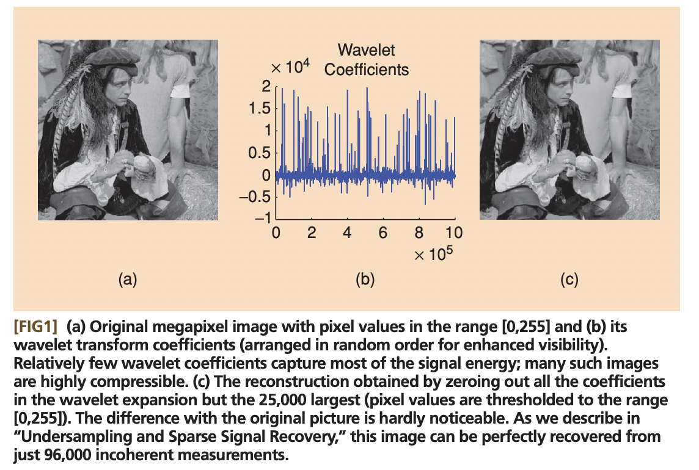

## Motivation: Nyquist-Shannon (Kotelnikov) theorem

Suppose that you have a WAV file. It basically contains sound pressures, measured 44100 times a second.

Why 44 100?

Suppose that you want to recover harmonics of frequencies 1 Hz, 2 Hz, 3 Hz, ... up to 20 kHz (more or less the upper threshold of what a human ear can hear). Each harmonic of your sound of frequency $\omega_i$ is described by 2 variables: amplitude $A_i$ and phase $\phi_i$.

So, if you are trying to recover those 20 000 pairs of phases/amplitude, you need at least 40 000 of sound pressure measurements $p_i$ measured at moments of time $t_i$:

$\begin{cases}A_1 e^{ -\frac{2 \pi j \cdot \omega_1 \cdot (t_1 + \phi_1)}{40000} } + A_2 e^{-\frac{2 \pi j \cdot \omega_2 \cdot (t_1 + \phi_2)}{40000}} + ... + A_{20000} e^{-\frac{2 \pi j \cdot \omega_{20000} \cdot (t_1 + \phi_{20000})}{40000}} = p_1 \\ A_1 e^{ -\frac{2 \pi j \cdot \omega_1 \cdot (t_2 + \phi_1)}{40000} } + A_2 e^{-\frac{2 \pi j \cdot \omega_2 \cdot (t_2 + \phi_2)}{40000}} + ... + A_{20000} e^{-\frac{2 \pi j \cdot \omega_{20000} \cdot (t_2 + \phi_{20000})}{40000}} = p_2 \\ ... \\ A_1 e^{ -\frac{2 \pi j \cdot \omega_1 \cdot (t_{40000} + \phi_1)}{40000} } + A_2 e^{-\frac{2 \pi j \cdot \omega_2 \cdot (t_{40000} + \phi_2)}{40000}} + ... + A_{20000} e^{-\frac{2 \pi j \cdot \omega_{20000} \cdot (t_{20000} + \phi_{20000})}{40000}} = p_{40000} \end{cases}$

There is no way to recover 40000 variables without at least 40000 linear equations, right? That's basically what Nyquist-Shannon theorem states.

Or is it?

## Compressed sensing

In 1995 Chen and Donoho realised that in reality most of your signals are sparse in some basis. I.e. if you mean to record the sound of music, in reality
most of your harmonics have 0 amplitude, and only a very small subset of those are playing.

The problem of recovery of $n$ non-zero harmonics out of $N$ is generally NP-hard (this constraint is also known of L0 norm). 

In 1980s it became clear, however, that you could relax this problem with L0 constraint to a convex problem with L1 constraint,
which is still able to recover a small subset of non-zero coefficients, but does this in a small polynomial time.

Chen and Donoho applied this approach to photo compression problems with wavelet transform and achieved spectacular results,
even achieving lossless compression.

This approach was popularized 1 year later in the field of statistics by Tibshirani and Hastie, and is now known as [Lasso regression](/2022-02-15-1)
or regression with L1 regularization. 

TODO: mathematical formulation of the problem

What's left unclear is how to construct such a sensing basis, in which our signal is expected to be sparse?

Here comes the method of random projections. In [an older post](/2021-09-10-1) I wrote about an incredibly beautiful and unbelievably powerful statement,
called Johnson-Lindenstrauss lemma, which basically states that if you project any point cloud of finite amount of points (e.g. ~1000) of arbitrarily
large dimensionality $N$ with gaussian random projection matrix onto a space of small dimensionality $n$ (in the ballpark of ~100-200 dimensions),
all the distances between the point will be preserved up to a tiny error with a probability, approaching 1.

Turns out, we can use this gaussian random projection basis as a sensing basis for our signal, and we should be able to
recover the full signal of e.g. 40000 harmonics with just a few hundred measurements, if that signal is sparse.

## Theorem 1 (exact recovery of sparse signal in noiseless case)

In reality our measurement devices are never perfect, and they have some level of noise, and later on I will show
that even noisy measurements allow for compressed sensing.

But first let us consider a "spherical horse in vacuum", the perfect noiseless measurements case.

### Signal incoherence

TODO

## Theorem 2 ()

### Restricted isometry property (RIP) and its flavours

#### Kashin-Gluskin lemma

Kolmogorov width and Gelfand width

#### Johnson-Lindenstrauss lemma and random projections

TODO

## Theorem 3 (robust recovery of sparse signal in noisy case)

TODO

References
----------
 - https://authors.library.caltech.edu/10092/1/CANieeespm08.pdf - a great introduction to compressed sensing by Emanuel Candes
 - https://www.youtube.com/watch?v=zytez36XlCU - a good talk on compressed sensing by Richard Baraniuk
 - https://asa.scitation.org/doi/10.1121/1.5043089 - another good introduction to compressed sensing
 - https://studylib.net/doc/10391762/the-johnson-lindenstrauss-lemma-meets-compressed-sensing-... - an early paper by Richard Baraniuk and Michael Wakin on merging J-L lemma with compressed sensing
 - https://personal.utdallas.edu/~m.vidyasagar/Fall-2015/6v80/CS-Notes.pdf - a long and complicated introduction to compressed sensing by Mathukumalli Vidyasagar
 - https://www.turpion.org/php/reference.phtml?journal_id=rm&paper_id=5168&volume=74&issue=4&type=ref - results by Boris Kashin
 - http://www.mathnet.ru/present12903 - a talk on related topic by Boris Kashin
 - https://arxiv.org/pdf/math/0503066.pdf - paper on compressed sensing by Candes, Romberg and Tao
