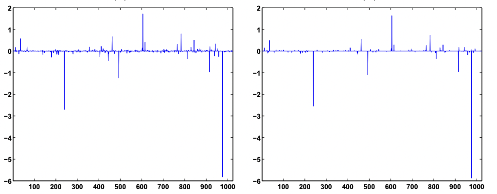

## Motivation: Nyquist-Shannon (Kotelnikov) theorem

Suppose that you have a WAV file. It basically contains sound pressures, measured 44100 times a second.

Why 44 100?

Suppose that you want to recover harmonics of frequencies 1 Hz, 2 Hz, 3 Hz, ... up to 20 kHz (more or less the upper threshold of what a human ear can hear). Each harmonic of your sound of frequency $\omega_i$ is described by 2 variables: amplitude $A_i$ and phase $\phi_i$.

So, if you are trying to recover those 20 000 pairs of phases/amplitude, you need at least 40 000 of sound pressure measurements $p_i$ measured at moments of time $t_i$, when you apply Fourier transform to recover it. Here it is:

$\begin{cases}A_1 e^{ -\frac{2 \pi j \cdot \omega_1 \cdot (t_1 + \phi_1)}{40000} } + A_2 e^{-\frac{2 \pi j \cdot \omega_2 \cdot (t_1 + \phi_2)}{40000}} + ... + A_{20000} e^{-\frac{2 \pi j \cdot \omega_{20000} \cdot (t_1 + \phi_{20000})}{40000}} = p_1 \\ A_1 e^{ -\frac{2 \pi j \cdot \omega_1 \cdot (t_2 + \phi_1)}{40000} } + A_2 e^{-\frac{2 \pi j \cdot \omega_2 \cdot (t_2 + \phi_2)}{40000}} + ... + A_{20000} e^{-\frac{2 \pi j \cdot \omega_{20000} \cdot (t_2 + \phi_{20000})}{40000}} = p_2 \\ ... \\ A_1 e^{ -\frac{2 \pi j \cdot \omega_1 \cdot (t_{40000} + \phi_1)}{40000} } + A_2 e^{-\frac{2 \pi j \cdot \omega_2 \cdot (t_{40000} + \phi_2)}{40000}} + ... + A_{20000} e^{-\frac{2 \pi j \cdot \omega_{20000} \cdot (t_{20000} + \phi_{20000})}{40000}} = p_{40000} \end{cases}$

Basically, what Nyquist-Shannon theorem states is that there is no way to recover 40000 variables without at least 40000 linear equations.

Or is it?

## Compressed sensing

In 1995 Chen and Donoho realised that in reality most of your signals are sparse in some basis. I.e. if you have a recording of music, in reality
most of your harmonics have 0 amplitude, and only a very small subset of those are non-zero.

The problem of recovery of $n$ non-zero harmonics out of $N$ is generally NP-hard (this constraint is also known of L0 norm). 

In 1980s it became clear, however, that you could relax this problem with L0 constraint to a convex problem with L1 constraint,
which is still able to recover a small subset of non-zero coefficients, but does this in a small polynomial time.

Chen and Donoho applied this approach to photo compression problems with wavelet transform and achieved spectacular results,
even achieving lossless compression.

This approach was popularized 1 year later in the field of statistics by Tibshirani and Hastie, and is now known as [Lasso regression](/2022-02-15-1)
or regression with L1 regularization. 

The compressed sensing problem could be formulated as follows: you are given a vector of $n$ measurements $\bf y \in \mathbb{R}^n$ (e.g. $n=100$).
Those measurement were performed by applying a *sensing* matrix $A$ to a high-dimensional vector $\bf x \in \mathbb{R}^n$ in $N$-dimensional space,
where e.g. $N=40000$. 

The trick is that you know that out of the coordinates of $\bf x$ only a small subset is non-zero. The matrix $A$
is $n$-by-$N$, i.e. very wide and very thin. Now, using the Lasso magic you can try to recover your true vector $\bf x$
by approximating it with a vector $\bf \bar{x}$, being a solution of the following convex optimization problem:

$\begin{cases} \min \limits_{\bar{ {\bf x} }} ||\bar{ {\bf x} }||_1 \\ {\bf y} = A {\bf \bar{x}} \end{cases}$

What's left unclear is how to construct such a sensing matrix and in which basis our signal is expected to be sparse?

Here comes the method of random projections. In [an older post](/2021-09-10-1) I wrote about an incredibly beautiful and unbelievably powerful statement,
called Johnson-Lindenstrauss lemma, which basically states that if you project any point cloud of finite amount of points (e.g. ~1000) of arbitrarily
large dimensionality $N$ with gaussian random projection matrix onto a space of small dimensionality $n$ (in the ballpark of ~100-200 dimensions),
all the distances between the point will be preserved up to a tiny error with a probability, approaching 1.

Turns out, we can use this gaussian random projection basis as a sensing basis for our signal, and we should be able to
recover the full signal of e.g. 40000 harmonics with just a few hundred measurements, if that signal is sparse.

## Theorem 1 (exact recovery of sparse signal in noiseless case is bounded by mutual coherence)

In reality our measurement devices are never perfect, and they have some level of noise, and later on I will show
that even noisy measurements allow for compressed sensing.

But first let us consider a "spherical horse in vacuum", the perfect noiseless measurements case.

We understand now that we can do with $n$ measurements, which is much, much less than $N$, but how big should $n$ be, precisely?

Turns out that $n \ge Const \cdot \mu^2(A) \cdot S \cdot log N$ is enough.

Here:
 * $n$ is the number of measurements required
 * $N$ is the size of our ambient space
 * $S$ is the maximum number of non-zero coordinates in the vector $\bf x$ we strive to recover (this number is called *sparcity*)
 * $A$ is our sensing matrix
 * $\mu(A) = \max \limits_{k, j} |A_{k, j}|$ is a bit tricky: it is a quantity, called *incoherence* 

I'll explain incoherence below.

### Signal incoherence

To understand why signal incoherence is important let us consider a perfectly bad sensing matrix: let each row of our 
matrix be a Dirac's delta, i.e. every measurement measures just a single coordinate of our data vector. How many 
measurements will it take to recover all the vector coordinates more or less reliably?

This is a [coupon collector's problem](https://en.wikipedia.org/wiki/Coupon_collector%27s_problem): on average $N \cdot \log N$
measurements will be required to measure every single one of $N$ coordinates of our data vector.

In this case our sensing matrix is called perfectly coherent: all the "mass" of our measurement is concentrated in a 
single coordinate. Incoherent measurements matrices, on the other hand, are those that have their mass spread evenly. 
Note that we impose a condition that $l2$ norm of each vector of the sensing matrices is limited down to $\sqrt{N}$.

#### Examples of incoherent and coherent sensing matrices
 * Dirac's delta - poor sensing matrix, coherent, see coupon collector problem
 * Bernoulli random matrix - an incoherent sensing matrix
 * Gaussian random matrix - another incoherent sensing matrix
 * (possibly incomplete) Fourier Transform matrix - even better sensing matrix
 * random convolution - good sensing matrix (incoherence can be seen in Fourier domain)

See lecture by [Emmanuel Candes](https://sms.cam.ac.uk/media/1118002).

### Sensing matrix as a product of measurement matrix and sparsity inducing matrix

In practice sensing matrix $A$ is a bit constrained.

First, its rows are supposed to have an L2 norm of $\sqrt{N}$. With this constraint $\mu(A)$ varies in range 1 to $\sqrt{N}$.
If the "mass" is evenly spread between rows of $A$, the matrix is incoherent and is great for compressed sensing. If all
the "mass" is concentrated in 1 value, the matrix is highly coherent, and we cannot get any advantage from compressed sensing.

Second, the sensing matrix of measurements cannot be arbitrary, it is determined by the physical nature of measurement 
process. Typical implementation of the measurement matrix is a Fourier transform matrix. 

Third, our initial basis might not be the one, where the signal is sparse.

Hence, we might want to decompose our matrix $A$ into a product of two matrices: measurement matrix and sparsity basis matrix:
$A = \Phi \Psi$. 

For instance, consider one vertical line of an image. The image itself is not sparse. However, if we applied a wavelet
transform to it, in the wavelet basis it does become sparse. Hence, $\Psi$ matrix is the matrix of wavelet transform.
Now, $\Phi$ is the measurement matrix: e.g. if you have a digital camera with a CMOS array or some kind of a photofilm,
the measurement matrix $\Phi$ might be something like a Fourier transform.

Now we can give a new interpretation to our signal incoherence requirement:

$\mu(A) = \max \limits_{k, j} | \langle \phi_k, \psi_j \rangle |$

This means that every measurement vector (e.g. Fourier transform vector) should be "spread out" in the sparsity-inducing
basis, otherwise the compressed sensing magic won't work. For instance, if l2-norm of our sensing matrix vectors is fixed
to be $\sqrt{N}$, if all the vector values are 0, and one value is $\sqrt{N}$, the sensing magic won't work, as all the "mass"
is concentrated in one point. However, if it is spread evenly (e.g. all the coordinates of each vector have an absolute
value of 1), that should work perfectly, and the required number of measurements $n$ would be minimal.

### Theorem 1: exact formulation and proof outline

The exact formulation of Theorem 1 is probabilistic: set a small enough probability $\delta$, e.g. $\delta=0.001$. 

Then with probability not less than $\delta$ the exact recovery of $S$-sparse vector $\bf x$ with a sensing matrix $A$ is exact, 
if the number of measurements $n \ge C \cdot S \cdot \mu^2(A) \cdot (\log N - \log \delta)$.

There are multiple proofs by Candes and Tao (an [initial proof](https://arxiv.org/pdf/math/0409186.pdf), specialized for 
partial Fourier transform as sensing matrix, its [extension](https://arxiv.org/pdf/math/0611957.pdf) for arbitrary 
unitary sensing matrices and, finally, a simplified proof in [Lecture 4](https://sms.cam.ac.uk/media/1119053) of the 
series of Cambridge lectures by Emmanuel Candes).

#### Step 1: dual certificate guarantees uniqueness of the solution

TODO

See [lecture 2 by E.Candes](https://sms.cam.ac.uk/media/1118002) and [a separate paper with a good proof](https://cims.nyu.edu/~cfgranda/pages/MTDS_spring19/notes/duality.pdf).

#### Step 2: a way to construct a dual certificate

TODO

#### Step 3: operator Bernstein inequality

Operator form of Bernstein inequality is a stronger form of Bernstein inequality for random variables, which is, in
turn, a strong alternative version of Markov inequality (a.k.a. Chebyshev's first inequality in Russian tradition).

Recall Markov (Chevyshev's first) inequality:

$p(\xi \ge \epsilon) \le \frac{\mathbb{E} \xi}{\epsilon}$

If we potentiate both sides of inequality inside the probability term, a number of useful inequalities follow, such as Chernoff bound,
Hoeffding inequality and Bernstein inequality. Specifically, Bernstein inequality for a sum of independent random 
variables states that:

$p(|\frac{1}{n} \sum \limits_{i=1}^n \xi_i| \ge \epsilon) \le e^{- \frac{n \epsilon^2}{2 (1 + \frac{\epsilon}{3})}}$

Now, instead of random variables $\xi_i$ consider random matrices $A_i$. Replace absolute value with spectral norm:

$p(||\frac{1}{n} \sum \limits_{i=1}^n A_i|| \ge \epsilon) \le e^{- \frac{n \epsilon^2}{2 (1 + \frac{\epsilon}{3})}}$

The proof can be seen [here](https://arxiv.org/pdf/0910.0651.pdf). It makes use of an operator version of Markov 
(Chebyshev's first) inequality, operator Chernoff bound, Golden-Thompson inequality and, finally, operator Bernstein
inequality.

Speaking informally, matrices $A_{\Omega T}$ are almost orthogonal with overwhelming probability. Take note of this fact,
it will be central for Theorems 2 and 3 in deterministic approach.

#### Step 4: golfing scheme

TODO

## Robustness of compressed sensing

For compressed sensing to be applicable to real-life problems, the technique should be resistant to corruptions of the data. 
They are of two kinds:

 * First, in reality the vectors $x$ in the sensing basis might not be exactly $S$-sparse, there might be some noise.
 * Second, the obtained measurements $y_i$ in reality are likely to be corrupted by some noise as well.

Amazingly, compressed sensing is resistant to both of these problems, which is provable by theorems 2 and 3 respectively.

## Restricted isometry property (RIP) and its flavours

While theorem 1 has a probabilistic nature, even more powerful theorems 2 and 3 have deterministic nature. To pose them
we'll need another property, called restricted isometry.

Recall that a crucial part of the proof of Theorem 1 was the fact that $A_{\Omega T}^* A_{\Omega T}$ matrix was almost
orthogonal. A similar requirement is made even stronger with Restricted Isometry Property (RIP). 

For some constant, reflecting the sparsity of vector $x_S$, $\delta_S < 1$ any sub-matrix $A_{\Omega T}$ of matrix $A$:

$(1 - \delta_S) || x ||_2 \le || A_{\Omega T} x ||_2 \le (1 + \delta_S) || x ||_2$

In plain english this means that if $A$ is a rectangular "wide" $n \times N$ matrix, and $x_S$ is a sparse vector with all of 
its $N$ coordinates zero, except by a subset of coordinates $T$ of cardianality $|T| = S$, any sub-matrix $A_{\Omega T}$
with all rows removed, but those in $T$, is almost orthogonal and preserves the lengths of vectors $x$ it acts upon, up to a constant
$\delta_S$. Almost-orthogonality of matrix $A_{\Omega T}$ follows from length preservation because $|| x ||_2 = x^T x = x^T A_{\Omega T}^T A_{\Omega T} x$.

In my opinion, even more useful form of an equivalent statement is distance preservation:

$(1 - \delta_S) || x_1 - x_2 ||_2 \le || A_{\Omega T} (x_1 - x_2) ||_2 \le (1 + \delta_S) || x_1 - x_2 ||_2$

If this requirement seems contrived to you, consider several practical examples of matrices, for which RIP holds.

### Random Gaussian matrix: Johnson-Lindenstrauss lemma and random projections

Consider a $n \times N$ matrix, of which each element is a realization of a random normal variable. These matrices
are used for random projections.

For such matrices a super-useful [Johnson-Lindenstrauss lemma](/2021-09-10-1) is known, which states that with 
overwhelmingly high probability such matrices preserve distances between points and lengths of vectors.

Obviously any sub-matrix of a random Gaussian matrix is itself a random Gaussian matrix, so Johnson-Lindenstrauss lemma
allows for a probabilistic version of RIP to hold, if we use random Gaussian projections as our sensing matrix.

### Random Bernoulli/binary matrix: Kashin-Garnaev-Gluskin lemma

A similar case are random binary matrices: each element of such a matrix is a Bernoulli random variable, taking values
of $\{1, -1\}$.

TODO: Kolmogorov width and Gelfand width

TODO: Kashin-Garnaev-Gluskin lemma

### Partial Fourier transform matrix: Rudelson-Vershinin lemma

TODO: mention $\log^5$ convergence

## Theorem 2 (robust recovery of a sparse subset of the largest vector coordinates, even if the vector is not sparse)

Suppose that in reality our vector $\bf x$ is not $S$-sparse, but is corrupted with perturbations. Let us denote its S-sparse
sub-vector with only S non-zero coordinates $\bf x_S$.

E.g. ${\bf x} = \begin{pmatrix} 0.1 \\ 1 \\ 2 \\ 0.2 \end{pmatrix}$ and ${\bf x_S} = \begin{pmatrix} 0 \\ 1 \\ 2 \\ 0 \end{pmatrix}$ being $S=2$-sparse.

Then:

$||{\bf \bar{x}} - {\bf x}||_1 \le C_S \cdot || {\bf \bar{x}} - {\bf x_S} ||_1$ and
$|| {\bf \bar{x}} - {\bf x}||_2 \le C_S \cdot \frac{ || {\bf \bar{x}} - {\bf x_S} ||_1}{\sqrt{S}}$

In plain english, l2 norm of the difference between the sparse vector $\bf \bar{x}$, recovered by compressed sensing,
and $S$-sparse subset of vector $\bf x$ is no greater than l2 norm of the remainder of $\bf x$, after we subtract the 
vector $X_S$ which contains the $S$ largest in absolute value coordinates from it.

Here is an example of reconstruction of an approximately (but not perfectly) sparse signal by compressed sensing. Note
that some low-amplitude noise is discarded by compressed sensing, resulting in a slightly sparser signal, than it was
originally:

 
*Recovery of approximately sparse signal by compressed sensing*. Left image: 
original signal which is approximately sparse, but with some tiny noise. Right image: sparser signal, recovered by compressed sensing, 
is slightly more sparse and less noisy.

TODO: tightness of compressed sensing by Kashin-Garnaev-Gluskin lemma

## Theorem 3 (robust recovery of sparse signal upon noisy measurements)

Now that "things got real", let us make them even more real: our measurement process is imperfect, too.
Assume that we have some noise in measurements, but it is bounded in l2 norm with a parameter $\epsilon$. Hence, we are 
solving the following problem now:

$\begin{cases} \min || {\bf \bar{x}} ||_1 \\ || A {\bf \bar{x}} - {\bf y} ||_2 \le \epsilon \end{cases}$

Theorem 3 states that this problem can be solved efficiently, too:

$|| {\bf \bar{x}} - {\bf x} ||_2 \le \underbrace{C_0 \cdot \epsilon}_\text{measurement noise} + \underbrace{C_1 \cdot \frac{|| {\bf x} - {\bf x_S} ||_1}{\sqrt{S}}}_\text{noise in sparsity of recovered vector}$

Putting this simply, the l2 error in recovery of the sparse signal is limited by a weighted sum of two errors: noise of measurement and
non-exact sparseness of the input vector. If both of them are not too large, the recovery can be quite accurate.

### Theorem 3 and Theorem 2 proof outlines

TODO

References
----------
 - https://authors.library.caltech.edu/10092/1/CANieeespm08.pdf - a great introduction to compressed sensing by Emanuel Candes and Michael Wakin
 - https://cims.nyu.edu/~cfgranda/pages/MTDS_spring19/notes/duality.pdf - an amazing full paper on Compressed sensing from lagrange duality to Theorem 1
 - https://www.youtube.com/watch?v=zytez36XlCU - a good talk on compressed sensing by Richard Baraniuk
 - https://asa.scitation.org/doi/10.1121/1.5043089 - another good introduction to compressed sensing
 - https://studylib.net/doc/10391762/the-johnson-lindenstrauss-lemma-meets-compressed-sensing-... - an early paper by Richard Baraniuk and Michael Wakin on merging J-L lemma with compressed sensing
 - https://personal.utdallas.edu/~m.vidyasagar/Fall-2015/6v80/CS-Notes.pdf - a long and complicated introduction to compressed sensing by Mathukumalli Vidyasagar
 - https://www.turpion.org/php/reference.phtml?journal_id=rm&paper_id=5168&volume=74&issue=4&type=ref - results by Boris Kashin
 - http://www.mathnet.ru/present12903 - a talk on related topic by Boris Kashin
 - https://arxiv.org/pdf/math/0611957.pdf - paper on incoherence Theorem 1 by Candes and Romberg
 - https://arxiv.org/pdf/math/0503066.pdf - paper on compressed sensing by Candes, Romberg and Tao
 - https://www.eecis.udel.edu/~amer/CISC651/IEEEwavelet.pdf - introduction to wavelets
 - https://www.youtube.com/watch?v=y7KLbd7n75g - good introduction to wavelets by Steve Brunton
 - https://www.youtube.com/watch?v=ZnmvUCtUAEE - another helpful introduction to wavelets
 - https://en.wikipedia.org/wiki/Eigenvalue_perturbation - eigenvalue perturbation
 - https://asa.scitation.org/doi/10.1121/1.5043089 - compressed sensing in acoustics
 - https://sms.cam.ac.uk/collection/1117766 - lectures by E.Candes in Cambridge (most importantly, see 2, 3, 4)
 - https://arxiv.org/pdf/math/0409186.pdf - early paper on special case of Theorem 1
 - https://arxiv.org/pdf/math/0410542.pdf - second paper on Theorem 1
 - https://arxiv.org/pdf/math/0611957.pdf - more mature paper on Theorem 1
 - https://www.sciencedirect.com/science/article/pii/S1631073X08000964 - short proof of theorems 3 and 2
 - https://arxiv.org/pdf/math/0503066.pdf - paper on 2 versions of Theorem 3
 - https://sprjg.github.io/posts/compressed_sensing_with_the_fourier_ensemble/ - practical example of compressed sensing
 - https://piazza.com/class_profile/get_resource/hidzt72ukxiol/hj1e7hcsupf3th - on dual certificates
 - https://cims.nyu.edu/~cfgranda/pages/MTDS_spring19/notes/duality.pdf - lemma on dual certificate (and another proof of Theorem 1)
 - https://arxiv.org/pdf/0910.0651.pdf - advance paper on matrix completion by Candes co-author Benjamin Recht with a proof of operator Chernoff bound
 - https://authors.library.caltech.edu/23952/1/Candes2005.pdf - error correction codes with compressed sensing by Candes, Tao, Vershinin, Rudelson
 - https://math.stackexchange.com/questions/701062/derivative-of-the-nuclear-norm/704271#704271 - nuclear norm via semidefinite programming
 - https://math.stackexchange.com/questions/746332/dual-of-a-semidefinite-program/746883#746883 - dual of semidefinite programming problems