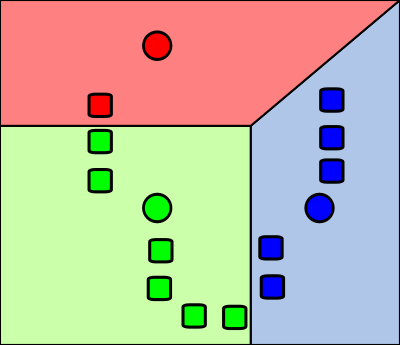

In this post I will follow the general logic of [this paper](https://ranger.uta.edu/~chqding/papers/NMF-SDM2005.pdf),
including the numeration of chapters. I will provide my own remarks, as I spent several months, working with the object,
discussed in this post.

## 1. Introduction to NMF and k-means

### NMF and recommender systems

Consider an $n \times p$ matrix $V = \begin{pmatrix} v_{1,1} && v_{1,2} && v_{1,3} && v_{1,p} \\ ... && ... && ... && ... \\ v_{n,1} && v_{n,2} && v_{n,3} && v_{n,p} \end{pmatrix}$.

Oftentimes you would want to approximate it by a low-rank matrix $\hat{V}$. E.g. suppose that "low-rank" means rank $k$:

$\hat{V} = \begin{pmatrix}w_{1,1} \\ w_{1,2} \\ w_{1,n}\end{pmatrix} \cdot \begin{pmatrix}h_{1,1} && h_{1,2} && h_{1,p}\end{pmatrix} + ... + \begin{pmatrix}w_{k,1} \\ w_{k,2} \\ w_{k,n}\end{pmatrix} \cdot \begin{pmatrix}h_{1,1} && h_{2,1} && h_{p,1}\end{pmatrix}$

Here I use outer product notation to represent $\hat{V}$ as a product of two rectangular matrices: $n \times k$ matrix $W$ and $k \times p$ matrix $H$:

$\hat{V} = W \cdot H = \begin{pmatrix} w_{1,1} && w_{1,k} \\ w_{2,1} && w_{2,k} \\ w_{n,1} && w_{n,k} \end{pmatrix} \cdot \begin{pmatrix} h_{1,1} && h_{1,2} && h_{1,p} \\ h_{k,1} && h_{k,2} && h_{k,p} \end{pmatrix}$

Since the Netflix challenge, this approach was very popular in the recommender systems. If $V$ matrix represents
$n$ users rating $p$ movies, then $W$ matrix represents the characterization of each of the $n$ users in terms of $k$
psychological parameters (e.g. how much the user likes humour, violence, sentimentality etc.) and $H$ matrix characterizes
each of $p$ movies in terms of these $k$ scales - how humorous, violent, sentimental etc. they are. 

An obvious application of NMF is data imputation - most of the user reviews are missing, hence, we need to predict user
ratings for movies they haven't seen and suggest the movies with the highest expected ratings.

### NMF as a special case of k-means

A less obvious application of NMF is data clustering. Turns out, NMF algorithm is basically a special case of k-means clustering.

We can interpret the rows of matrix $H$ as centroids of our clusters:

**k-means clustering**. Here we see 3 clusters. Data points are depicted with rectangles, cluster centroids are depicted with circles.

### k-means solution with EM algorithm

In practice, k-means can be solved with an two-step iterative [EM algorithm](https://en.wikipedia.org/wiki/Expectation%E2%80%93maximization_algorithm).

Initialize cluster centroids with random values (obviously, we can get smarter with initialization, but even random will do for now).

Each iteration of EM algorithm consists of two steps:

* E-step: assign each data point to the cluster with the nearest centroid
* M-step: re-calculate the coordinates of each centroid as a center of mass of the data points, which belong to its cluster

This algorithm converges, because there exists a non-negative monotonically decreasing (non-increasing) "energy" function, which 
decreases at each iteration, both on E-step and M-step.

The exact choice of the energy function could vary, and depending on the one selected, the algorithm takes new interesting
interpretations. For instance, NMF with Kullback-Leibler divergence as energy function results in intepretaiton of NMF as
probabilistic latent semantic analysi (PLSA) algorithm. We are going to use Frobenius norm as the energy function, which
results in a multitude of truncated PCA/biclustering/spectral clustering interpretations.

## 2. Symmtric NMF interpretation through k-means 

TODO

### Lemma 2.0. Minimum of Frobenius norm corresponds to the maximum of Rayleigh quotient

TODO

### Lemma 2.1. Symmetric NMF is equivalent to kernel K-means clustering

TODO

### Lemma 2.2. Symmetric NMF matrix is near orhtogonal

TODO

## 3. Biclustering problem and quadratic programming/NMF

TODO

### Lemma 3.1. Biclustering problem is equivalent to quadratic programming/NMF low-rank approximation of a Jordan-Wieldant matrix

TODO

## 4. k-means corresponds to spectral clustering

TODO

### Lemma 4.0. If a graph consists of multiple non-connected components, they correspond to the graph Laplacian eigenvectors

TODO

### Lemma 4.1. MinMax Cut/Normalized Cut problems on a graph correspond to the  

---
This post is inspired by my ongoing research on L1-regularized biclustering algorithms and sparse transformers, as well 
as discussions with Olga Zolotareva, Alexander Chervov, Anvar Kurmukov and Sberloga Data Science community. Many thanks
to them.

---

References
----------
* https://en.wikipedia.org/wiki/Non-negative_matrix_factorization#Clustering_property - NMF and clustering property
* https://ranger.uta.edu/~chqding/papers/NMF-SDM2005.pdf - the original paper on the equivalence of k-means and spectral clustering
* https://www.cs.utexas.edu/users/inderjit/public_papers/kdd_spectral_kernelkmeans.pdf - 
* https://www.researchgate.net/publication/2540554_A_Min-max_Cut_Algorithm_for_Graph_Partitioning_and_Data_Clustering - MinMax cut algorithm