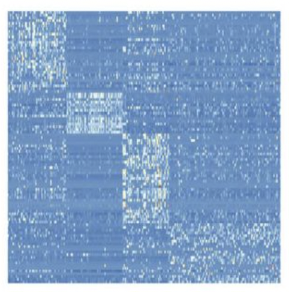
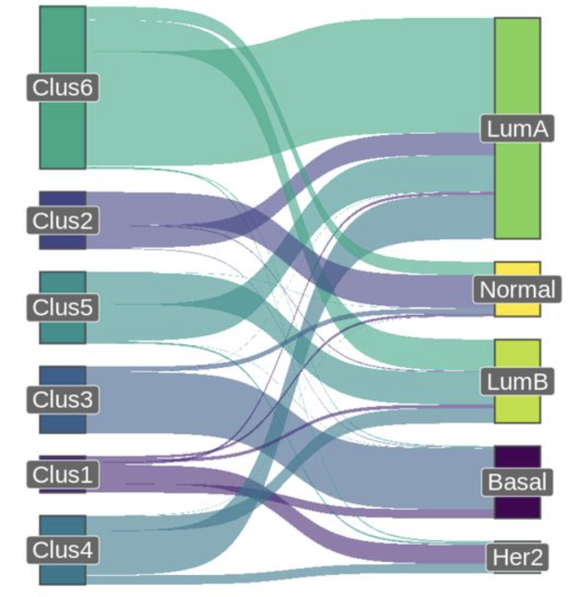
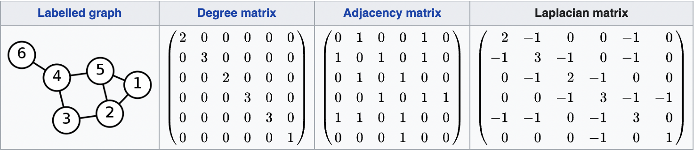

I am following the general logic of [this paper](https://ranger.uta.edu/~chqding/papers/NMF-SDM2005.pdf),
including the numeration of chapters, in this post. However, I will provide lots of my own remarks, as I spent several 
months, working with objects, discussed in this post and "rehydrate" a very clear, but somewhat condensed 4.5-page paper
into a much larger blog post.

## 1. Introduction to NMF and k-means

### NMF and recommender systems

Consider an $n \times p$ matrix $V = \begin{pmatrix} v_{1,1} && v_{1,2} && v_{1,3} && v_{1,p} \\ ... && ... && ... && ... \\ v_{n,1} && v_{n,2} && v_{n,3} && v_{n,p} \end{pmatrix}$.

Oftentimes you would want to approximate it by a low-rank matrix $\hat{V}$. E.g. suppose that "low-rank" means rank $k$:

$\hat{V} = \begin{pmatrix}w_{1,1} \\ w_{1,2} \\ w_{1,n}\end{pmatrix} \cdot \begin{pmatrix}h_{1,1} && h_{1,2} && h_{1,p}\end{pmatrix} + ... + \begin{pmatrix}w_{k,1} \\ w_{k,2} \\ w_{k,n}\end{pmatrix} \cdot \begin{pmatrix}h_{1,1} && h_{2,1} && h_{p,1}\end{pmatrix}$

Here I use outer product notation to represent $\hat{V}$ as a product of two rectangular matrices: $n \times k$ matrix $W$ and $k \times p$ matrix $H$:

$\hat{V} = W \cdot H = \begin{pmatrix} w_{1,1} && w_{1,k} \\ w_{2,1} && w_{2,k} \\ w_{n,1} && w_{n,k} \end{pmatrix} \cdot \begin{pmatrix} h_{1,1} && h_{1,2} && h_{1,p} \\ h_{k,1} && h_{k,2} && h_{k,p} \end{pmatrix}$

Since the Netflix challenge, this approach was very popular in the recommender systems. If $V$ matrix represents
$n$ users, who assigned ratings for $p$ movies, then $W$ matrix represents the characterization of each of the $n$ users
in terms of $k$ psychological traits (e.g. how much the user likes humour, violence, sentimentality etc.) and $H$ matrix
characterizes each of $p$ movies in terms of these $k$ scales - how humorous, violent, sentimental etc. they are. 

Then an obvious application of NMF is data imputation - most of the user reviews are missing, hence, we need to predict 
user ratings for movies they haven't seen and suggest the movies with the highest expected ratings.

How would we search for NMF in practice? We would require Frobenius norm of the difference between NMF and the original 
matrix $V$ to be as small as possible:

$\min \limits_{W,H \ge 0} ||V - WH ||_F$

Frobenius norm is a good measure for the quality of our approximation not only because of its intuitiveness. A family of 
theorems in matrix analysis (such as [Hoffman-Wielandt inequality](https://djalil.chafai.net/blog/2011/12/03/the-hoffman-wielandt-inequality/))
show that if matrix approximation converges to the true matrix in terms of Frobenius norm, then so do their eigenvalues
and eigenvectors.

An alternative option for the measure of quality of approximation is Kullback-Leibler divergence $D(V || W H)$, which in
matrix case evaluates to $D(A||B) = \sum \limits_{i,j} (A_{i,j} \log \frac{A_{i,j}}{B_{i,j}} - A_{i,j} + B_{i,j})$. In
this case NMF bears similarities to various Bayesian methods, such as Probabilistic Latent Semantic Analysis (PLSA) method.

However, I won't delve into Kullback-Liebler-minimizing approach and will focus on the Frobenius norm as approximation
quality metric.

### NMF solver

One of the reasons of NMF popularity is its simple iterative solver. 

In a series of alternating steps it updates the values of $W$ and $H$ matrices using the following update rules:

$W \leftarrow W  \cdot \frac{(VH^T)}{(WHH^T)}$

$H \leftarrow H  \cdot \frac{(W^TV)}{(W^TWH)}$

Let us derive this formula.

We want to solve the following optimization problem:

$\min \limits_{W \ge 0, H \ge 0}|| V - WH ||_F$

Or, equivalently, expressing Frobenius norm through trace notation, we have:

$\min \limits_{W \ge 0, H \ge 0} Tr((V - WH)^T(V - WH))$

This is a minimization problem which can be solved through taking a derivative of a scalar function with respect to a 
matrix argument, which is explained in more detail [here](https://www.youtube.com/watch?v=9fc-kdSRE7Y) and [here](https://en.wikipedia.org/wiki/Matrix_calculus#Scalar-by-matrix).

We will be doing a gradient descent, iteratively decreasing Frobenius norm of our trace with respect to $W$ matrix with $H$
fixed every odd step and with respect to $H$ matrix with $W$ matrix fixed every even step:

$W \leftarrow W -   \eta_W \cdot  \nabla_W f(W,H)$

$H \leftarrow H -   \eta_H \cdot  \nabla_H f(W,H)$

Here $\eta_W$ and $\eta_H$ are gradient step size.

Now let us decompose our trace into 4 terms and take its derivative $\nabla_W Tr((V - WH)^T(V - WH))$ and $\nabla_H Tr((V - WH)^T(V - WH))$ with respect to matrices $W$ and $H$:

$Tr((V^T - H^TW^T)(V-WH) ) = Tr( V^TV - V^TWH - H^TW^TV + H^TW^WWH) =$

$ = Tr( V^TV) - Tr(V^TWH) - Tr(H^TW^TV) + Tr(H^TW^TWH)$

Taking derivative of each term separately:

$\nabla_W Tr( V^TV) = 0$

$\nabla_W Tr(V^TWH) = \nabla_W Tr(HV^T W) = (H V^T)^T = VH^T$ (using the fact that $\nabla_W Tr(AW) = A^T$)

$\nabla_W Tr(H^TW^TV) = \nabla_W Tr(W^T V H^T) = VH^T$ (using the fact that $\nabla_W Tr(W^TA) = A$)

$\nabla_W Tr(H^TW^TWH) = \nabla Tr(HH^TW^TW) = 2 W HH^T$ (using the fact that $\nabla_W Tr(W HH^T W^T) = W (HH^T + HH^T)$)

Aggregating the results:

$\nabla_W Tr((V - WH)^T(V - WH)) = 0 - VH^T - VH^T + 2 W HH^T = 2 (W HH^T - VH^T) = 2 (WH - V) H^T$

And carrying out similar calculations for $H$ we get:

$\nabla_H Tr((V - WH)^T(V - WH)) = -2 W^T V + 2 W^TW H = 2 W^T (WH - V)$

Substituting this back into the original update formula (ignoring "2", as it can be included into the gradient step):

$W \leftarrow W - \eta_W \cdot  (WH - V) H^T$

$H \leftarrow H - \eta_H \cdot  W^T (WH - V)$

Now the authors of the original paper suggest to set specific values of gradient update steps:

$\eta_W = \frac{W}{WHH^T}$

$\eta_H = \frac{H}{W^TWH}$

This leads us to the declared algorithm.

### NMF as a special case of k-means

A less obvious application of NMF is data clustering. Turns out, k-means clustering is a special case of NMF.

Suppose that we have identified $k$ clusters $C_k$ among our data points $\bf v_i$. 

We can interpret the rows ${\bf h_k}$ of matrix $H$ as centroids of our clusters: ${\bf h_k} = \sum_{i \in C_k }{\bf v_i}$

Then is matrix $W$ is made orthogonal non-negative, it represents attribution of data points to clusters. E.g.:

$\hat{V} = W \cdot H = \begin{pmatrix} 1 && 0 \\ 0 && \frac{1}{\sqrt{2}} \\ 0 && \frac{1}{\sqrt{2}} \end{pmatrix} \cdot \begin{pmatrix} h_{1,1} && h_{1,2} && h_{1,p} \\ h_{k,1} && h_{k,2} && h_{k,p} \end{pmatrix}$

Here matrix $W$ describes two clusters, the first contains data point {$\bf v_1$} and the second - {$\bf v_2$, $\bf v_3$}. 
If all the coordinates of the data are non-negative, this means that coordinates of all the cluster centroids $\bf h_i$ 
are non-negative as well. $W$ is non-negative, too. So, all the requirements of NMF are satisfied.

<center>**k-means clustering**. Here we see 3 clusters. Data points are depicted with rectangles, cluster centroids are depicted with circles.</center>

### k-means solution with EM-like algorithm

In practice, k-means can be solved with a two-step iterative [EM-like algorithm](https://en.wikipedia.org/wiki/Expectation%E2%80%93maximization_algorithm).

Initialize cluster centroids with random values (obviously, we can get smarter with initialization, but even random will do for now).

Each iteration of EM algorithm consists of two steps:

* E-step: assign each data point to the cluster with the nearest centroid
* M-step: re-calculate the coordinates of each centroid as a center of mass of the data points, which belong to its cluster

This algorithm converges, because there exists a non-negative monotonically decreasing (non-increasing) "energy" function, which 
decreases at each iteration, both on E-step and M-step.

The exact choice of the energy function could vary, and depending on the one selected, the algorithm takes new interesting
interpretations. For instance, NMF with Kullback-Leibler divergence as energy function results in intepretaiton of NMF as
probabilistic latent semantic analysi (PLSA) algorithm. We are going to use Frobenius norm as the energy function, which
results in a multitude of truncated PCA/biclustering/spectral clustering interpretations.

Here is an implementation of k-means (with k-means++ initialization):

```python
import random
from typing import Tuple, Enum

import numpy as np
import numpy.typing as npt


class ConvergenceException(Exception):
    def __init__(self):
        Exception.__init__(self, "Iterations limit exceeded")


def k_means_clustering(
        X: npt.NDarray,
        k: int,
        tol: float = 1e-5,
        max_iter:int = 100,
        energy: Enum['KL', 'F'] = 'F'
) -> Tuple[npt.NDarray, npt.NDarray]:
    """A minimal implementation of k-means clustering algorithm.

    :param X: n x p data matrix, where each point of data is a p-dimensional np.array
    :param k: number of cluster centroids, we aim to find
    :param tol: tolerance in energy; stop and return result, if the decrease in energy between 2 steps is below tol
    :param max_iter: maximum number of iterations of the algorithm allowed; abort with ConvergenceException if exceeded
    :param energy: monotonically non-increasing energy function to calculate (options: Kullback-Leibler, Frobenius norm)
    :return: (centroids, clusters) - a 2-Tuple of 2 matrices:
     - centroids - k x p matrix of cluster centroids
     - clusters - n x k indicator vectors, which define a set of data points, which belongs to each cluster
    """
    n = X.shape[0]
    p = X.shape[1]

    centroids = init_centroids(X, k)
    clusters = np.empty(shape=(n, k))

    iterations = 0
    next_energy = np.Inf
    previous_energy = np.Inf
    while not (previous_energy - next_energy < tol):
        clusters = e_step(X, centroids)
        centroids = m_step(X, centroids, clusters)

        if iterations > max_iter:
            raise ConvergenceException
        else:
            iterations += 1
            previous_energy = energy
            next_energy = calculate_energy(X, centroids, clusters, energy)

    return centroids, clusters


def init_centroids(X, k) -> npt.NDarray:
    """Initialization procedure for settings the initial locations of
    centroids, based on k-means++ (2006-2007) algorithm:
    https://en.wikipedia.org/wiki/K-means%2B%2B.
    """
    n = X.shape[0]
    centroids = np.zeros((n, k))
    random_point_index = random.randrange(n)
    np.copyto(X[random_point_index], centroids[0])
    for _ in range(k):
        # find closest centroid to each data point
        clusters = e_step(X, centroids)

        # construct probability distribution of selecting data points as centroids
        distribution = np.zeros(n)
        for index, data_point in enumerate(X):
            nearest_centroid = clusters[index]

            # probability of a point being selected as a new centroid is ~ square distance D(point, centroid)
            distribution[index] = np.dot(data_point - nearest_centroid, data_point - nearest_centroid)

        # pick a data point to be the next centroid at random
        new_centroid = random.choices(X, weights=distribution)
        centroids = numpy.vstack([centorids, new_centroid])

    return centroids


def e_step(X, centroids):
    """Assign the nearest cluster to each data point."""
    clusters = np.zeros(shape=(X.shape[0], centroids.shape[0]))

    for data_point_index, data_point in enumerate(X):
        nearest_centroid_index = 0
        shortest_distance_to_centroid = np.infty
        for index, centroid in enumerate(centroids):
            direction = data_point - centroid
            distance = math.sqrt(np.dot(direction, direction))
            if distance < shortest_distance_to_centroid:
                shortest_distance_to_centroid = distance
                nearest_centroid_index = index

        clusters[data_point_index][nearest_centroid_index] = 1

    return clusters


def m_step(X, centroids, clusters):
    """Re-calculate new centroids based on the updated clusters."""
    new_centroids = np.empty(shape=centroids.shape)

    for index, cluster in enumerate(clusters):
        new_centroids[index] = np.dot(cluster, X)

    return new_centroids


def calculate_energy(X, centroids, clusters, energy: Enum['KL', 'F']) -> float:
    """Implementation of several energy functions calculation."""
    if energy == 'F':
        X_hat = np.dot(centroids, clusters)
        difference = X - X_hat
        result = 0
        for i in difference:
            for j in difference[i]:
                result += j ** 2
    elif energy == 'KL':
        result = 0  # TODO
    else:
        raise ValueError(f"Undefined energy function type '{energy}'")

    return result
```


### Symmetric NMF

TODO

## 2. Symmetric NMF interpretation through k-means 

TODO

### Lemma 2.0. Minimum of Frobenius norm corresponds to the maximum of Rayleigh quotient

TODO

### Lemma 2.1. Symmetric NMF is equivalent to kernel K-means clustering

TODO

### Lemma 2.2. Symmetric NMF matrix is near orthogonal

TODO

## 3. Biclustering problem and quadratic programming/NMF

Another related problem is the problem of biclustering. 

Suppose that you have a matrix with expressions of $p$ genes, measured in $n$ patients, and you want to find sub-groups
of patients with similar patterns of expression (e.g. you're looking for subtypes of cancer).

<center>**Biclustering in a differential expression matrix.** Rows of the matrix correspond to patients; columns - to genes; the intensity of color of each pixel represents the gene expression in a patient (e.g. how much RNA product is synthesized from this gene). By rearranging the order of genes and patients we can clearly identify groups of patients, in which groups of genes behave similarly.</center>

So, you want to simultaneously detect subsets of columns and subsets of rows, such that they explain e.g. a large chunk
of variance in your data (the variance in a bicluster is expected to be low, though).

Equivalently, this problem can be re-formulated as detection of dense subgraphs in a bipartite graph

<center>**Dense subgraphs in a bipartite graph.** Again, left part of the graph represents patients, right - genes, edges are expressions of genes in a patient.</center>

### Lemma 3.1. Biclustering problem is equivalent to quadratic programming/NMF low-rank approximation of a Wieldant-Jordan matrix

TODO

## 4. k-means corresponds to spectral clustering

Another interesting interpretation of k-means algorithm is though spectral graph theory.

To give you a taste of this field, suppose that we have a graph that consists of multiple disjoint subsets.

It can be shown, that each disjoint connected component in this graph is an eigenvector of [graph Laplacian](https://en.wikipedia.org/wiki/Laplacian_matrix).

<center>**Example of graph Laplacian calculation.** Here $D$ - degree matrix, $A$ - adjacency matrix, $L = D - A$ - graph Laplacian.</center>

Now, instead of strictly disjoint graph, we might have a loosely disjoint one - with relatively dense subgraphs, 
interconnected with just a few "bridge" edges. We might want to find those dense subgraphs. And they would
serve as good clusters as well, if we re-formulated the problem as clustering?

### Lemma 4.1. MinMax Cut/Normalized Cut problems on a graph correspond to the k-means clustering problem

TODO

---
This post is inspired by my ongoing research on L1-regularized biclustering algorithms and sparse transformers, as well 
as discussions with Olga Zolotareva, Alexander Chervov, Anvar Kurmukov and Sberloga Data Science community. Many thanks
to them.

---

References
----------
* https://en.wikipedia.org/wiki/Non-negative_matrix_factorization#Clustering_property - NMF and clustering property
* https://ranger.uta.edu/~chqding/papers/NMF-SDM2005.pdf - the original paper on the equivalence of k-means and spectral clustering
* https://www.cs.utexas.edu/users/inderjit/public_papers/kdd_spectral_kernelkmeans.pdf - on correspondence between spectral clustering and k-means
* https://faculty.cc.gatech.edu/~hpark/papers/GT-CSE-08-01.pdf - on correspondence between sparse Nonnegative Matrix Factorization and Clustering
* https://www.researchgate.net/publication/2540554_A_Min-max_Cut_Algorithm_for_Graph_Partitioning_and_Data_Clustering - MinMax cut algorithm
* https://www.biorxiv.org/content/10.1101/2022.04.24.489301v1.full - fresh paper on spectral biclustering (source of images)
* https://www.youtube.com/watch?v=9fc-kdSRE7Y - derivative of trace with respect to a matrix
* https://en.wikipedia.org/wiki/Matrix_calculus#Scalar-by-matrix - derivative with respect to a matrix
* https://proceedings.neurips.cc/paper/2000/file/f9d1152547c0bde01830b7e8bd60024c-Paper.pdf - seminal Lee and Seung NMF solver paper
* https://stats.stackexchange.com/questions/351359/deriving-multiplicative-update-rules-for-nmf - summary of Lee and Seung NMF solver