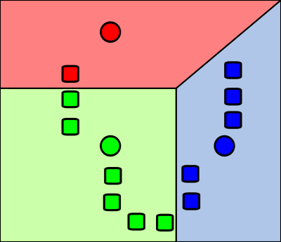
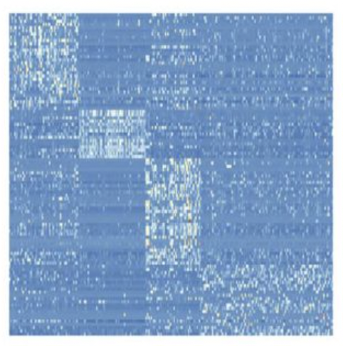
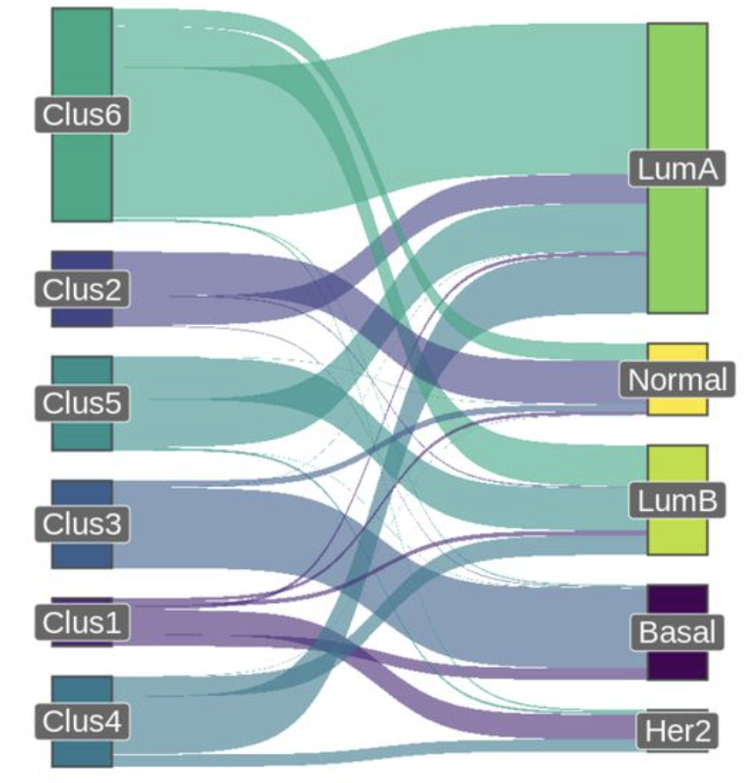
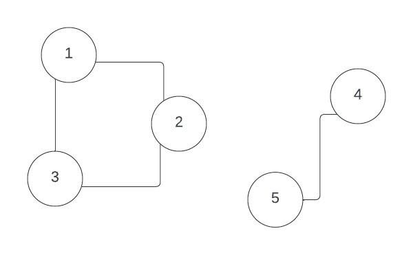
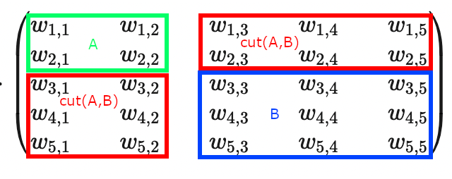
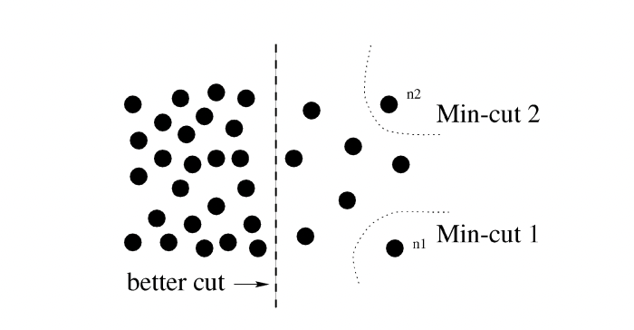
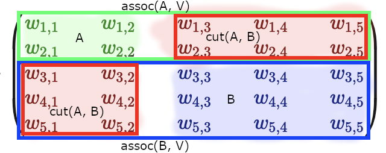

I am following the general logic of [this paper](https://ranger.uta.edu/~chqding/papers/NMF-SDM2005.pdf),
including the numeration of chapters, in this post. However, I will provide lots of my own remarks, as I spent several 
months, working with objects, discussed in this post and "rehydrate" this very clear, but somewhat condensed 4.5-page paper
into a much larger blog post.

In this post I will present 4 seemingly different algorithms: symmetric NMF, k-means, biclustering and spectral clustering
via normalized cuts method. I will establish the correspondence between all 4 methods and show that essentially they
represent variations of the same mathematics.

## 1. Introduction to NMF and k-means

### NMF and recommender systems

Consider an $n \times p$ matrix $V = \begin{pmatrix} v_{1,1} && v_{1,2} && v_{1,3} && v_{1,p} \\ ... && ... && ... && ... \\ v_{n,1} && v_{n,2} && v_{n,3} && v_{n,p} \end{pmatrix}$.

Oftentimes you would want to approximate it by a low-rank matrix $\hat{V}$. E.g. suppose that "low-rank" means rank $k$:

$\hat{V} = \begin{pmatrix}w_{1,1} \\ w_{1,2} \\ w_{1,n}\end{pmatrix} \cdot \begin{pmatrix}h_{1,1} && h_{1,2} && h_{1,p}\end{pmatrix} + ... + \begin{pmatrix}w_{k,1} \\ w_{k,2} \\ w_{k,n}\end{pmatrix} \cdot \begin{pmatrix}h_{1,1} && h_{2,1} && h_{p,1}\end{pmatrix}$

Here I use outer product notation to represent $\hat{V}$ as a product of two rectangular matrices: $n \times k$ matrix $W$ and $k \times p$ matrix $H$:

$\hat{V} = W \cdot H = \begin{pmatrix} w_{1,1} && w_{1,k} \\ w_{2,1} && w_{2,k} \\ w_{n,1} && w_{n,k} \end{pmatrix} \cdot \begin{pmatrix} h_{1,1} && h_{1,2} && h_{1,p} \\ h_{k,1} && h_{k,2} && h_{k,p} \end{pmatrix}$

Since the Netflix challenge, this approach was very popular in the recommender systems. If $V$ matrix represents
$n$ users, who assigned ratings to $p$ movies, then $W$ matrix represents the characterization of each of the $n$ users
in terms of $k$ psychological traits (e.g. how much the user likes humour, violence, sentimentality etc.) and $H$ matrix
characterizes each of $p$ movies in terms of these $k$ scales - how humorous, violent, sentimental etc. they are. 

Then an obvious application of NMF is data imputation - most of the user reviews are missing, hence, we need to predict 
user ratings for movies they haven't seen and suggest the movies with the highest expected ratings.

How would we search for NMF in practice? We would require Frobenius norm of the difference between NMF and the original 
matrix $V$ to be as small as possible:

$\min \limits_{W,H \ge 0} ||V - WH ||_F = \sum \limits_{i=1}^n \sum \limits_{j=1}^p (v_{i,j} - \langle {\bf w_{i,k}}, {\bf h_{k,j}} \rangle)^2$

Frobenius norm is just a square root of sum of squares of elements of matrix (if we considered the matrix a regular vector,
it would'be been its L2 norm). Thus it could be interpreted as the distance between matrices.

However, Frobenius norm is a good measure for the quality of our approximation not only because of its intuitiveness. A 
family of theorems in matrix analysis (such as [Hoffman-Wielandt inequality](https://djalil.chafai.net/blog/2011/12/03/the-hoffman-wielandt-inequality/))
show that if matrix approximation converges to the true matrix in terms of Frobenius norm, then so do their eigenvalues
and eigenvectors.

Another important way of representing the Frobenius norm is through the trace of Gram matrix, created out of the initial
matrix: $||V - WH||_F = \sqrt{Tr{(V - WH)^T (V-WH)}}$. We will heavily rely on this representation in this post.

An alternative option for the measure of quality of approximation is Kullback-Leibler divergence $D(V || W H)$, which in
matrix case evaluates to $D(A||B) = \sum \limits_{i,j} (A_{i,j} \log \frac{A_{i,j}}{B_{i,j}} - A_{i,j} + B_{i,j})$. In
this case NMF bears similarities to various Bayesian methods, such as Probabilistic Latent Semantic Analysis (PLSA) method. 
However, I won't delve into Kullback-Liebler-minimizing approach and will focus on the Frobenius norm as approximation
quality metric.

### NMF solver

One of the reasons of NMF popularity is its simple iterative solver. 

In a series of alternating steps it updates the values of $W$ and $H$ matrices using the following update rules:

$W \leftarrow W  \cdot \frac{(VH^T)}{(WHH^T)}$

$H \leftarrow H  \cdot \frac{(W^TV)}{(W^TWH)}$

Let us derive this formula.

We want to solve the following optimization problem:

$\min \limits_{W \ge 0, H \ge 0}|| V - WH ||_F$

Or, equivalently, expressing Frobenius norm through trace notation, we have:

$W^*, H^* = \arg \min \limits_{W \ge 0, H \ge 0} \sqrt{Tr((V - WH)^T(V - WH))} = \arg \min \limits_{W \ge 0, H \ge 0} Tr((V - WH)^T(V - WH))$

This is a minimization problem which can be solved through taking a derivative of a scalar function with respect to a 
matrix argument (the concept and mechanics of derivative of a scalar function with respect to a matrix argument is explained in detail [here](https://www.youtube.com/watch?v=9fc-kdSRE7Y) and [here](https://en.wikipedia.org/wiki/Matrix_calculus#Scalar-by-matrix)).

We will be doing a gradient descent, iteratively decreasing Frobenius norm with respect to $W$ matrix with $H$ fixed every odd step and with respect to $H$ matrix with $W$ matrix fixed every even step:

$W \leftarrow W -   \eta_W \cdot  \nabla_W f(W,H)$

$H \leftarrow H -   \eta_H \cdot  \nabla_H f(W,H)$

Here $\eta_W$ and $\eta_H$ are gradient step size.

Now let us decompose our trace into 4 terms and take its derivative $\nabla_W Tr((V - WH)^T(V - WH))$ and $\nabla_H Tr((V - WH)^T(V - WH))$ with respect to matrices $W$ and $H$:

$Tr((V^T - H^TW^T)(V-WH) ) = Tr( V^TV - V^TWH - H^TW^TV + H^TW^WWH) =$

$ = Tr( V^TV) - Tr(V^TWH) - Tr(H^TW^TV) + Tr(H^TW^TWH)$

Taking derivative of each term separately:

$\nabla_W Tr( V^TV) = 0$

$\nabla_W Tr(V^TWH) = \nabla_W Tr(HV^T W) = (H V^T)^T = VH^T$ (using the fact that $\nabla_W Tr(AW) = A^T$)

$\nabla_W Tr(H^TW^TV) = \nabla_W Tr(W^T V H^T) = VH^T$ (using the fact that $\nabla_W Tr(W^TA) = A$)

$\nabla_W Tr(H^TW^TWH) = \nabla Tr(HH^TW^TW) = 2 W HH^T$ (using the fact that $\nabla_W Tr(W HH^T W^T) = W (HH^T + HH^T)$)

Aggregating the results:

$\nabla_W Tr((V - WH)^T(V - WH)) = 0 - VH^T - VH^T + 2 W HH^T = 2 (W HH^T - VH^T) = 2 (WH - V) H^T$

And carrying out similar calculations for $H$ we get:

$\nabla_H Tr((V - WH)^T(V - WH)) = -2 W^T V + 2 W^TW H = 2 W^T (WH - V)$

Substituting this back into the original update formula (ignoring "2", as it can be included into the gradient step):

$W \leftarrow W - \eta_W \cdot  (WH - V) H^T$

$H \leftarrow H - \eta_H \cdot  W^T (WH - V)$

Now the authors of the original paper suggest to set specific values of gradient update steps:

$\eta_W = \frac{W}{WHH^T}$

$\eta_H = \frac{H}{W^TWH}$

This leads us to the declared algorithm: 

$W \leftarrow W - \frac{W}{W H H^T} (WH - V)H^T = \frac{W}{WHH^T} \cdot (\cancel{WHH^T} - \cancel{WHH^T} + VH^T) = W \cdot \frac{VH^T}{WHH^T}$

$H \leftarrow H - \frac{H}{W^T W H} W^T (WH - V) = H \cdot \frac{W^TW}{W^TWH}$

Here is a python implementation:

```python
from typing import Tuple

import numpy as np
import numpy.typing as npt


class ConvergenceException(Exception):
    def __init__(self):
        Exception.__init__(self, "Iterations limit exceeded; algorithm failed to converge!")


def nmf(V: npt.NDArray, k: int, tol: float = 1e-4, max_iter: int=100) -> Tuple[npt.NDArray, npt.NDArray]:
    """An NMF  solver implementation which approximates an n x p input matrix V
    as a product W x H of n x k matrix W and k x p matrix H. This solver
    minimizes Frobenius norm of the difference between V and W H and implements
    an algorithm, described by Lee and Seung (2000) in:
    https://proceedings.neurips.cc/paper/2000/file/f9d1152547c0bde01830b7e8bd60024c-Paper.pdf.

    :param V: n x p matrix to be approximated with NMF low-rank approximation
    :param k: rank of low-rank approximation
    :param tol: threshold value of decrease in energy function between two consecutive iterations for the algorithm to
     be considered converged
    :param max_iter: maximum number of iterations allowed; if reached before convergence, ConvergenceException is thrown
    :return: 2-tuple of two matrices:
     - W - n x k matrix
     - H - k x p matrix
    """
    n = V.shape[0]
    p = V.shape[1]

    previous_energy = np.inf
    next_energy = np.inf

    iterations = 0

    W = np.ones((n, k))
    H = np.ones((k, p))

    while (previous_energy - next_energy > tol) or next_energy == np.inf:
        W_update = np.dot(V, H.T) / np.dot(W, np.dot(H, H.T))
        W = W * W_update

        H_update = np.dot(W.T, V) / np.dot(W.T, np.dot(W, H))
        H = H * H_update

        if iterations > max_iter:
            raise ConvergenceException
        else:
            iterations += 1
            previous_energy = next_energy
            next_energy = np.linalg.norm(V - np.dot(W, H), 'fro')  # calculate Frobenius norm

    return W, H
```

If we run this code, the approximation is very decent:

```python
import unittest
import numpy as np

from ..biclustering_lasso import nmf


class NMFTestCase(unittest.TestCase):
    """
    python3 -m unittest biclustering_lasso.tests.test_nmf.NMFTestCase
    """
    def test_nmf(self):
        V = np.array([[2.1, 0.4, 1.2, 0.3, 1.1],
                      [2.1, 0.7, 2.3, 0.4, 2.2],
                      [2.4, 0.5, 3.2, 0.7, 3.3]])

        W, H = nmf(V, k=2)

        print(f"W = {W}")
        print(f"H = {H}")
```

```python
>>> W
array([[0.49893966, 0.49893966],
       [0.76064226, 0.76064226],
       [1.02271335, 1.02271335]])

>>> H
array([[1.36102025, 0.33184111, 1.50013542, 0.31221326, 1.49381373],
       [1.36102025, 0.33184111, 1.50013542, 0.31221326, 1.49381373]])

>>> np.dot(W, H)
array([[1.35813395, 0.33113738, 1.49695411, 0.31155116, 1.49064583],
       [2.07049903, 0.50482475, 2.2821328 , 0.47496521, 2.27251571],
       [2.78386716, 0.67875667, 3.06841706, 0.63860935, 3.05548651]])

>>> V
array([[2.1, 0.4, 1.2, 0.3, 1.1],
       [2.1, 0.7, 2.3, 0.4, 2.2],
       [2.4, 0.5, 3.2, 0.7, 3.3]])
```
As you can see, `np.dot(W, H)` approximates `V` very well. And due to the fact that it is so easy to implement, it is 
probably the favourite algorithm of your favourite bioinformatics student:

<center>**Your favourite bioinformatics student.** Cause doing things fast is what truly matters, right?</center>


### NMF as a special case of k-means

A less obvious application of NMF is data clustering. Turns out, k-means clustering is a special case of NMF.

Suppose that we have identified $k$ clusters $C_k$ among our data points $\bf v_i$. 

We can interpret the rows ${\bf h_k}$ of matrix $H$ as centroids of our clusters: ${\bf h_k} = \sum_{i \in C_k }{\bf v_i}$

Then matrix $W$ can be made orthogonal non-negative, representing attribution of data points to clusters. E.g.:

$\hat{V} = W \cdot H = \begin{pmatrix} 1 && 0 \\ 0 && \frac{1}{\sqrt{2}} \\ 0 && \frac{1}{\sqrt{2}} \end{pmatrix} \cdot \begin{pmatrix} h_{1,1} && h_{1,2} && h_{1,p} \\ h_{k,1} && h_{k,2} && h_{k,p} \end{pmatrix}$

Here matrix $W$ describes two clusters, the first contains data point {$\bf v_1$} and the second - {$\bf v_2$, $\bf v_3$}. 
If all the coordinates of the data are non-negative, this means that coordinates of all the cluster centroids $\bf h_i$ 
are non-negative as well. $W$ is non-negative, too. So, all the requirements of NMF are satisfied.

<center>**k-means clustering**. Here we see 3 clusters. Data points are depicted with rectangles, cluster centroids are depicted with circles.</center>

### k-means solution with EM-like algorithm

In practice, k-means can be solved with a two-step iterative [EM-like algorithm](https://en.wikipedia.org/wiki/Expectation%E2%80%93maximization_algorithm).

Initialize cluster centroids with random values (obviously, we can get smarter with initialization, but even random will do for now).

Each iteration of EM algorithm consists of two steps:

* E-step: assign each data point to the cluster with the nearest centroid
* M-step: re-calculate the coordinates of each centroid as a center of mass of the data points, which belong to its cluster

This algorithm converges, because there exists a non-negative monotonically decreasing (non-increasing) "energy" function, which 
decreases at each iteration, both on E-step and M-step.

The exact choice of the energy function could vary, and depending on the one selected, the algorithm takes new interesting
interpretations. For instance, NMF with Kullback-Leibler divergence as energy function results in intepretaiton of NMF as
probabilistic latent semantic analysi (PLSA) algorithm. We are going to use Frobenius norm as the energy function, which
results in a multitude of truncated PCA/biclustering/spectral clustering interpretations.

Here is an implementation of k-means (with k-means++ initialization):

```python
import math
import random
from typing import Tuple, Union

import numpy as np
import numpy.typing as npt


class ConvergenceException(Exception):
    def __init__(self):
        Exception.__init__(self, "Iterations limit exceeded; algorithm failed to converge!")


def k_means_clustering(
        X: npt.NDArray,
        k: int,
        tol: float = 1e-5,
        max_iter: int = 100,
        energy: Union['KL', 'fro'] = 'fro'
) -> Tuple[npt.NDArray, npt.NDArray]:
    """A minimal implementation of k-means clustering algorithm.

    :param X: n x p data matrix, where each point of data is a p-dimensional np.array
    :param k: number of cluster centroids, we aim to find
    :param tol: tolerance in energy; stop and return result, if the decrease in energy between 2 steps is below tol
    :param max_iter: maximum number of iterations of the algorithm allowed; abort with ConvergenceException if exceeded
    :param energy: monotonically non-increasing energy function to calculate (options: Kullback-Leibler, Frobenius norm)
    :return: (centroids, clusters) - a 2-Tuple of 2 matrices:
     - centroids - k x p matrix of cluster centroids
     - clusters - n x k indicator vectors, which define a set of data points, which belongs to each cluster
    """
    n = X.shape[0]
    p = X.shape[1]

    centroids = init_centroids(X, k)
    clusters = np.empty(shape=(n, k))

    iterations = 0
    next_energy = np.Inf
    previous_energy = np.Inf
    while not (previous_energy - next_energy < tol):
        clusters = e_step(X, centroids)
        centroids = m_step(X, centroids, clusters)

        if iterations > max_iter:
            raise ConvergenceException
        else:
            iterations += 1
            previous_energy = next_energy
            next_energy = calculate_energy(X, centroids, clusters, energy)

    return centroids, clusters


def init_centroids(X, k) -> npt.NDArray:
    """Initialization procedure for settings the initial locations of
    centroids, based on k-means++ (2006-2007) algorithm:
    https://en.wikipedia.org/wiki/K-means%2B%2B.
    """
    n = X.shape[0]
    p = X.shape[1]
    centroids = np.zeros((1, p))
    random_point_index = random.randrange(n)
    np.copyto(centroids[0], X[random_point_index])  # use a random row of X matrix as a centroid
    for _ in range(k-1):
        # find closest centroid to each data point
        clusters = e_step(X, centroids)

        # construct probability distribution of selecting data points as centroids
        distribution = np.zeros(n)
        for index, data_point in enumerate(X):
            # find the coordinate of 1 in clusters[index] - it will be the index of centroid
            nearest_centroid_index = np.argmax(clusters[index])  # finds the location of 1
            nearest_centroid = centroids[nearest_centroid_index]

            # probability of a point being selected as a new centroid is ~ square distance D(point, centroid)
            distribution[index] = np.dot(data_point - nearest_centroid, data_point - nearest_centroid)

        # pick a data point to be the next centroid at random
        new_centroid = random.choices(X, weights=distribution)
        centroids = np.vstack([centroids, new_centroid])

    return centroids


def e_step(X, centroids):
    """Assign each data point to a cluster with the nearest centroid."""
    clusters = np.zeros(shape=(X.shape[0], centroids.shape[0]))

    for data_point_index, data_point in enumerate(X):
        nearest_centroid_index = 0
        shortest_distance_to_centroid = np.infty
        for index, centroid in enumerate(centroids):
            direction = data_point - centroid
            distance = math.sqrt(np.dot(direction, direction))
            if distance < shortest_distance_to_centroid:
                shortest_distance_to_centroid = distance
                nearest_centroid_index = index

        clusters[data_point_index][nearest_centroid_index] = 1

    return clusters


def m_step(X, centroids, clusters):
    """Re-calculate new centroids based on the updated clusters."""
    # divide each cluster element by the number of elements in it for averaging (e.g. [0, 1, 1] -> [0, 0.5, 0.5])
    normalized_clusters = clusters.T
    for index, cluster in enumerate(normalized_clusters):
        np.copyto(normalized_clusters[index], cluster / cluster.sum())
    normalized_clusters = normalized_clusters.T

    # move each centroid to the center of mass of its respective cluster
    new_centroids = np.dot(X.T, normalized_clusters).T

    return new_centroids


def calculate_energy(X, centroids, clusters, energy: Union['KL', 'fro']) -> float:
    """Implementation of several energy functions calculation."""
    if energy == 'fro':
        result = np.linalg.norm(X - np.dot(clusters, centroids), 'fro')
    elif energy == 'KL':
        result = 0  # TODO
    else:
        raise ValueError(f"Undefined energy function type '{energy}'")

    return result
```

Let us test our implementation:

```python
import unittest
import numpy as np

from ..biclustering_lasso import k_means_clustering


class KMeansTestCase(unittest.TestCase):
    """
    python3 -m unittest biclustering_lasso.tests.test_nmf.NMFTestCase
    """
    def test_k_means(self):
        X = np.array([[2.1, 0.4, 1.2, 0.3, 1.1],
                      [2.1, 0.7, 2.3, 0.4, 2.2],
                      [2.4, 0.5, 3.2, 0.7, 3.3]])

        centroids, clusters = k_means_clustering(X, k=2)

        print(f"centroids = {centroids}")
        print(f"clusters = {clusters}")
```

```python
>>> centroids
array([[2.1 , 0.4 , 1.2 , 0.3 , 1.1 ],
       [2.25, 0.6 , 2.75, 0.55, 2.75]])

>>> clusters
array([[1. , 0. ],
       [0. , 0.5],
       [0. , 0.5]])

>>> np.dot(clusters, centroids)
array([[2.1  , 0.4  , 1.2  , 0.3  , 1.1  ],
       [1.125, 0.3  , 1.375, 0.275, 1.375],
       [1.125, 0.3  , 1.375, 0.275, 1.375]])

>>> X
array([[2.1, 0.4, 1.2, 0.3, 1.1],
       [2.1, 0.7, 2.3, 0.4, 2.2],
       [2.4, 0.5, 3.2, 0.7, 3.3]])
```

Again, we get a decent low-rank approximation of `X` matrix by k-means cluster `np.dot(clusters, centroids)`.


### Symmetric NMF

NMF is not unique. For instance, you could obviously insert a matrix and its inverse in between $W$ and $H$:

$V = WH = W B B^{-1} H = \hat{W} \hat{H}$.

Hence, there are plenty of options for additional constraints on $W$ and $H$. 

You could demand that one of them, $W$ or $H$ is orthogonal. This special case leads to k-means interpretation (where 
the orthogonal matrix represents clusters and the other one - coordinates of centroids).

Or you can demand that NMF is symmetric and $W = H^T$. This special case is called *symmetric NMF* and will be
considered further.

## 2. Symmetric NMF interpretation through k-means 

It turns out that symmetric NMF algorithm can be interpreted as a variation of "soft" k-means clustering. 

In "hard" k-means clustering each data point belongs to strictly one cluster. In "soft" clustering every point is 
assigned weights, which show how close (or likely to belong) it is to each cluster. 

In "hard" clustering clusters matrix is orthogonal. As we'll see further in this post, in "soft" clustering weights
matrix is not orthogonal, but tends to be approximately orthogonal.

In order to establish correspondence between symmetric NMF and k-means I will first need a technical lemma, which shows
that minimum of Frobenius norm of error of rank-$1$ matrix approximation coincides with the maximum of quadratic form of the 
approximated matrix. Moreover, in case of rank-$k$ matrix approximation via $\hat{V} = W \cdot H$, minimum of Frobenius
norm of error $||V - \hat{V}||_F$ corresponds to a trace $Tr(H V W)$.

This fact will prove useful for all the 4 algorithms, described in this post.

### Lemma 2.0. Minimum of Frobenius norm corresponds to the maximum of Rayleigh quotient

Assume that matrices $W$ and $H^T$ are orthogonal, i.e. 

$\langle {\bf w_i}, {\bf w_j} \rangle = \begin{cases}0, i \ne j \\ 1, i = j \end{cases}$

$\langle {\bf h_i}, {\bf h_j} \rangle = \begin{cases}0, i \ne j \\ 1, i = j \end{cases}$

Then the following holds:

$W^*, H^* = \arg \min \limits_{W, H} || V - WH ||_F = \arg \max \limits_{W, H} Tr (H V W)$,

or, in case of rank $k=1$, and single vectors $\bf w$ and $\bf h$ we get:

${\bf w}^*, {\bf h}^* = \arg \min \limits_{ {\bf w}, {\bf h} } || V - {\bf w} {\bf h}^T ||_F = \arg \max \limits_{ {\bf w}, {\bf h} } {\bf h}^T V {\bf w}$,

Let us show this result for the rank $k=1$ case (a pair of vectors) and then generalize to arbitrary rank.

$|| V - {\bf w}{\bf h}^T ||_F = Tr (V - {\bf w}{\bf h}^T)^T (V - {\bf w}{\bf h}^T) = \underbrace{Tr (V^T V)}_\text{const} - \underbrace{Tr(V^T {\bf w}{\bf h}^T)}_{Tr({\bf h}^T V^T {\bf w}) = Tr({\bf w}^T V {\bf h}) } - \underbrace{Tr({\bf h} {\bf w}^T V )}_{Tr({\bf w}^T V {\bf h})} + \underbrace{ Tr({\bf h} {\bf w}^T {\bf w} {\bf h}^T) }_{= {\bf w}^T{\bf w} \cdot Tr({\bf h}{\bf h}^T) = ||w||_2 \cdot ||h||_2 = 1}$.

Hence, $|| V - {\bf w}{\bf h}^T ||_F$ attains its minimum when $- 2 \cdot Tr({\bf w}^T V {\bf h})$ attains its minimum or $Tr({\bf w}^T V {\bf h})$ attains its maximum.

Now consider $k=2$ case ($k=3, 4, ...$ etc. works similarly):

$|| V - WH ||_F = Tr ((V - WH)^T (V - WH)) = \underbrace{Tr (V^T V)}_\text{const} - Tr (V^T WH) - Tr(H^T W^T V) + \underbrace{Tr(H^T W^T W H)}_{const} = - 2 Tr(W^T V H^T) + const$.

### Lemma 2.1. Symmetric NMF is equivalent to kernel K-means clustering

Consider a special case of NMF, when $W = H^T$, called symmetric NMF. In this case we're looking for an approximation:

$V = H^T H$

And the goal is to find $H^* = \arg \min \limits_{H: H \ge 0} ||V - H^T H ||_F$.

If we assume that $H$ is orthogonal ($H^T H = I$, where $I$ is identity matrix), then by Lemma 2.0 we immediately see that:

$H^* = \arg \min \limits_{H: H \ge 0, H^T H = I} ||V - H^T H ||_F = \arg \max \limits_{H: H \ge 0, H^T H = I} H V H^T$.

### Lemma 2.2. Symmetric NMF matrix is near orthogonal

Interestingly, we might not need to explicitly impose the requirement that $H^T H = I$, yet still $H$ turns out to be 
approximately orthogonal, if we find it through a symmetric NMF.

$H^* = \arg \min \limits_{H}||V - H^T H||_F$

$||V - H^T H||_F = Tr (V - H^T H)^T(V - H^T H) = \underbrace{Tr(V^T V)}_\text{const} - Tr((H^T H)^T V) - Tr(V^T (H^T H)) + Tr(H^T H H^T H) = const -2 Tr((H^T H)^T V) + Tr(H^T H H^T H) = const -2 Tr(HVH^T) + || H H^T ||_F $

Here the term $Tr(HVH^T)$ corresponds to the minimization problem, similar to k-means. The term $|| H H^T ||_F$ works
almost like a constraint. Let's focus on it:

$H H^T = \begin{pmatrix} h_{1,1} && h_{1,2} && h_{1,3} && h_{1,4} \\ h_{2,1} && h_{2,2} && h_{2,3} && h_{2,4} \end{pmatrix} \cdot \begin{pmatrix} h_{1,1} && h_{2,1} \\ h_{1,2} && h_{2,2} \\ h_{1,3} && h_{2,3} \\ h_{1,4} && h_{2,4} \end{pmatrix} = \begin{pmatrix} \langle {\bf h_1}, {\bf h_1} \rangle && \langle {\bf h_1}, {\bf h_2} \rangle \\ \langle {\bf h_2}, {\bf h_1} \rangle && \langle {\bf h_2}, {\bf h_2} \rangle \end{pmatrix}$,

where e.g. ${\bf h_1} = \begin{pmatrix} h_{1,1} \\ h_{1,2} \\ h_{1,3} \\ h_{1,4} \end{pmatrix}$.

From the definition of Frobenius norm then $|| H H^T ||_F = \langle {\bf h_1}, {\bf h_1} \rangle^2 + \langle {\bf h_1}, {\bf h_2} \rangle^2 + ... + \langle {\bf h_2}, {\bf h_1} \rangle^2 + \langle {\bf h_2}, {\bf h_2} \rangle^2 + ... + \langle {\bf h_4}, {\bf h_4} \rangle^2 = \sum \limits_{k=1}^p \sum \limits_{l=1}^n \langle {\bf h_k}, {\bf h_l} \rangle^2$.

Let us split this sum into two parts: diagonal elements and non-diagonal elements separately:

$|| H H^T ||_F = \sum \limits_{l \ne k} \langle {\bf h_l}, {\bf h_k} \rangle^2 + \sum \limits_{l=k} \langle {\bf h_k}, {\bf h_k} \rangle^2$

Minimization of the term $\sum \limits_{l \ne k} \langle {\bf h_l}, {\bf h_k} \rangle^2$ essentially enforces approximate orthogonality,
while the second term is responsible for normalization $\sum \limits_{l=k} \langle {\bf h_k}, {\bf h_k} \rangle^2 = \sum \limits_{l=k} ||{\bf h_k}||^4_2$. This term
attains minimum when all the norms of vectors are approximately balanced ($||{\bf h_1}||_2 \approx ||{\bf h_2}||_2 \approx ... \approx ||{\bf h_k}||_2$).

## 3. Biclustering problem and quadratic programming/NMF

Another related problem is the problem of biclustering. 

Suppose that you have a matrix with expressions of $p$ genes, measured in $n$ patients, and you want to find sub-groups
of patients with similar patterns of expression (e.g. you're looking for subtypes of cancer).

<center>**Biclustering in a differential expression matrix.** Rows of the matrix correspond to patients; columns - to genes; the intensity of color of each pixel represents the gene expression in a patient (e.g. how much RNA product is synthesized from this gene). By rearranging the order of genes and patients we can clearly identify groups of patients, in which groups of genes behave similarly.</center>

So, you want to simultaneously detect subsets of columns and subsets of rows, such that they explain e.g. a large chunk
of variance in your data (the variance in a bicluster is expected to be low, though).

Equivalently, this problem can be re-formulated as detection of dense subgraphs in a bipartite graph

<center>**Dense subgraphs in a bipartite graph.** Again, left part of the graph represents patients, right - genes, edges are expressions of genes in a patient.</center>

### Lemma 3.1. Biclustering problem is equivalent to quadratic programming/NMF low-rank approximation of a Jordan-Wielandt matrix

Let us formalize the biclustering problem. 

We need to find a pair of indicator vectors 

${\bf x}: x_i = \begin{cases} 1, i \in A \\ 0, i \in B \end{cases}$

${\bf y}: y_i = \begin{cases} 1, i \in A \\ 0, i \in B \end{cases}$

such that ${\bf x}^T V {\bf y} \to \max / \min$

I call this bilinear programming, as we need to optimize the value of a bilinear form. In a more general case we might
need to find matrices ($X$, $Y$) (i.e. multiple pairs ($\bf x_i$, $\bf y_i$), potentially covering the whole
matrix; vector pairs may intersect or may not, depending on the problem statement).

Turns out, we can re-formulate this bilinear optimization as a quadratic optimization problem. Let us put the vectors
$x$ and $y$ on top of each other, concatenating them into a unified vector $h = (x_1, x_2, ..., x_n, y_1, y_2, ..., y_p)^T$.

Replace the $V$ matrix with the following Jordan-Wielandt matrix:

$B = \begin{pmatrix} 0 && V \\ V^T && 0 \end{pmatrix}$

Then our optimization problem is to find $\frac{1}{2}{\bf h}^T B {\bf h} \to \max / \min$.

Again, if we want to find multiple biclusters, instead of a single vector $h$, we use a whole matrix $H$, and then our optimization
problem takes a familiar form $\max \limits_{H} \frac{1}{2} Tr H^T B H$.

This problem already looks awfully familiar, right? Let us consider one more face of it.


## 4. k-means corresponds to spectral clustering

Another interesting interpretation of the same algorithm comes from spectral graph theory.

To get a taste of this field first, suppose that we have a graph that consists of multiple disjoint subsets.

It can be shown, that each disjoint connected component in this graph is an eigenvector of so-called [graph Laplacian](https://en.wikipedia.org/wiki/Laplacian_matrix).

For example, consider this disjoint graph, its degree matrix $D$, adjacency matrix $A$ and Laplacian $L = D - A$:

<center>**A graph with 2 connected components**</center>

$D = \begin{pmatrix} 2 && 0 && 0 && 0 && 0 \\ 0 && 2 && 0 && 0 && 0 \\ 0 && 0 && 2 && 0 && 0 \\ 0 && 0 && 0 && 1 && 0 \\ 0 && 0 && 0 && 0 && 1 \end{pmatrix}$, $A = \begin{pmatrix} 0 && 1 && 1 && 0 && 0 \\ 1 && 0 && 1 && 0 && 0 \\ 1 && 1 && 0 && 0 && 0 \\ 0 && 0 && 0 && 0 && 1 \\ 0 && 0 && 0 && 1 && 0 \end{pmatrix}$, $L = \begin{pmatrix} 2 && -1 && -1 && 0 && 0 \\ -1 && 2 && -1 && 0 && 0 \\ -1 && -1 && 2 && 0 && 0 \\ 0 && 0 && 0 && 1 && -1 \\ 0 && 0 && 0 && -1 && 1 \end{pmatrix}$

It is easy to see that vectors $\begin{pmatrix} 1 \\ 1 \\ 1 \\ 0 \\ 0 \end{pmatrix}$ and $\begin{pmatrix} 0 \\ 0 \\ 0 \\ 1 \\ 1 \end{pmatrix}$, which define two connected components, are eigenvectors with 0 eigenvalue for graph Laplacian:

$\begin{pmatrix} 2 && -1 && -1 && 0 && 0 \\ -1 && 2 && -1 && 0 && 0 \\ -1 && -1 && 2 && 0 && 0 \\ 0 && 0 && 0 && 1 && -1 \\ 0 && 0 && 0 && -1 && 1 \end{pmatrix} \cdot \begin{pmatrix} 1 \\ 1 \\ 1 \\ 0 \\ 0 \end{pmatrix} = 0 \cdot \begin{pmatrix} 1 \\ 1 \\ 1 \\ 0 \\ 0 \end{pmatrix}$

Now, instead of strictly disjoint graph, we might have a loosely disjoint one - with relatively dense subgraphs, 
interconnected with just a few "bridge" edges. We might want to find those dense sub-graphs. And they would
serve as good clusters as well, if we re-formulated the problem as clustering?

### Lemma 4.0. MinMax Cut solution through optimization of a quadratic form with Laplacian matrix

In 1993 Wu and Leahy suggested an algorithm of finding a minimal/maximal cut in graphs, based on spectral clustering.

The cut was meant to be the set of edges, that would split the graph into 2 halves, $A$ and $B$, so that the sum of
edges, which connect these two parts, is minimal: $cut(A, B) = \sum \limits_{u \in A, v \in B} w(u, v)$. 

Speaking in terms of Laplacian and spectral graph theory, we can re-formulate MinCut optimization problem as follows. We
introduce indicator vectors ${\bf h} = (1, 1, ..., 1, -1, -1, ..., -1)$, where $h_i = 1$, if vertex $i \in A$ and $h_i = -1$,
if $i \in B$.

Now, you can see that if we defined some partition of our graph $V$ into halves $A$ and $B$, adjacency matrix gets split
into 4 blocks: block diagonal elements of the matrix represent nodes within $A$ and $B$ subgraphs,
and off-diagonal elements represent $cut(A, B)$:

<center>**MinCut adjacency matrix**: diagonal blocks represent connections within $A$ and $B$ halves of the graph, and off-diagonal blocks represnt graph cut.</center>

Now consider a quadratic form ${\bf h}^T A {\bf h}$:

${\bf h}^T A {\bf h} = \begin{pmatrix} 1 && 1 && -1 && -1 && -1 \end{pmatrix} \cdot \begin{pmatrix} w_{1,1} && w_{1,2} && w_{1,3} && w_{1,4} && w_{1,5} \\ w_{2,1} && w_{2,2} && w_{2,3} && w_{2,4} && w_{2,5} \\ w_{3,1} && w_{3,2} && w_{3,3} && w_{3,4} && w_{3,5} \\ w_{4,1} && w_{4,2} && w_{4,3} && w_{4,4} && w_{4,5} \\ w_{5,1} && w_{5,2} && w_{5,3} && w_{5,4} && w_{5,5} \end{pmatrix} \cdot \begin{pmatrix} 1 \\ 1 \\ -1 \\ -1 \\ -1 \end{pmatrix} = $

$ = \sum \limits_{i,j \in A} w_{i,j} + \sum \limits_{i,j \in B} w_{i,j} - \sum \limits_{i \in A, j \in B} w_{i,j} - \sum \limits_{i \in B, j \in A} w_{i,j} = \sum \limits_{i,j \in A} w_{i,j} + \sum \limits_{i,j \in B} w_{i,j} - 2 \cdot \sum \limits_{i, j \in cut(A, B)} w_{i,j}$.

Now, take the degree matrix $D$, create a similar quadratic form out of if:

${\bf h}^T D {\bf h} = \begin{pmatrix} 1 && 1 && -1 && -1 && -1 \end{pmatrix} \cdot \begin{pmatrix} \sum \limits_j{w_{1,j}} && ... && 0 \\ 0 && \sum \limits_j{w_{i,j}} && 0 \\ 0 && ... && \sum \limits_j{w_{|V|,j}} \end{pmatrix} \cdot \begin{pmatrix} 1 \\ 1 \\ -1 \\ -1 \\ -1 \end{pmatrix}$.

If we now subtract the quadratic forms, we'd see that all edges, except by the members of $cut(A, B)$, cancel each other out:

${\bf h}^T D {\bf h} - {\bf h}^T A {\bf h} = {\bf h}^T (D-A) {\bf h} = {\bf h}^T L {\bf h} = 4 \cdot \sum \limits_{i, j \in cut(A, B)} w_{i,j}$.

In other words, to minimize the $cut(A, B)$, we need to find indicator vectors ${\bf h}$, such that they minimize the
quadratic form ${\bf h}^T L {\bf h}$, where $L$ is graph Laplacian. We just discovered another interesting connection with
linear algebra and spectral graph theory, which is going to be instrumental a bit later.

For now, I shall notice that although MinMaxCut algorithm was enlightening, in its raw form it was prone to a fallacy of selecting a single
most disconnected vertex as $A$ and cutting it off of the rest of the graph:

<center>**MinCut**: typical undesired behaviour of the algorithm, when it cuts away single vertices.</center>

### Lemma 4.1. Normalized Cut problems on a graph correspond to the k-means clustering problem

To address the problem of undesired behaviour of MinMaxCut, Shi and Malik (1997, 2000) came up with their (now famous) Normalized Cut 
algorithm. They tweaked the optimized function to cut away a sizable portion of the edges of the graph relative to the 
total weights of edges, kept within its halves: 

$Ncut(A, B) = \frac{cut(A, B)}{assoc(A, V)} + \frac{cut(A, B)}{assoc(B, V)}$,
where $assoc(A, V) = \sum \limits_{u \in A, t \in V} w(u, t)$.

If we take a look at the weighted adjacency matrix, representing the graph, and would cluster subgraphs $A$ and $B$ at
diagonal blocks, we'd see that $cut(A, B)$ corresponds to the sum of weights of the off-diagonal blocks, while denominators
$assoc(A, V)$ and $assoc(B, V)$ form full-width horizontal (or full-width vertical) blocks: 

<center>**Normalized cut matrix.**</center>

Shi and Malik use a bit different version of indicator vectors. Unlike MinMaxCut their indicator vectors are comprised of 0-1 coordinates $\bf h$: $h_i = \begin{cases} 1, i \in A \\ 0, i \in B \end{cases}$.

Then $Ncut(A, B) = \frac{cut(A, B)}{assoc(A, V)} + \frac{cut(A, B)}{assoc(B, V)} = \frac{{\bf h}^T(D-A){\bf h}}{{\bf h}^T D {\bf h}} + \frac{{\bf (1-h)}^T(D-A){\bf (1-h)}}{{\bf (1-h)}^T D {\bf (1-h)}}$.

Now, if we take a look at the denominators, ${\bf h}^T D {\bf h} = {\bf 1}^T D {\bf 1} - {\bf (1-h)}^T D {\bf (1-h)}$. 

Shi and Malik then  define a constant $k$, such that ${\bf h}^T D {\bf h} = k \cdot {\bf 1}^T D {\bf 1}$ and ${\bf (1-h)}^T D {\bf (1-h)} = (1-k) \cdot {\bf 1}^T D {\bf 1}$.

Then $Ncut(A, B) = \frac{{\bf h}^T(D-A){\bf h}}{{\bf h}^T D {\bf h}} + \frac{{\bf (1-h)}^T(D-A){\bf (1-h)}}{{\bf (1-h)}^T D {\bf (1-h)}} = \frac{{\bf h}^T(D-A){\bf h}}{k \cdot {\bf 1}^T D {\bf 1}} + \frac{{\bf (1-h)}^T(D-A){\bf (1-h)}}{(1-k) \cdot {\bf 1}^T D {\bf 1}} = \frac{ (1-k) \cdot {\bf h}^T(D-A){\bf h} + k \cdot {\bf (1-h)}^T(D-A){\bf (1-h)} }{k \cdot (1-k) \cdot {\bf 1}^T D {\bf 1}}$.

After that Shi and Malik define a ratio $b = \frac{k}{1-k}$. Then they perform a long series of simplifications and show that:

$Ncut(A, B) = \frac{ (1-k) \cdot {\bf h}^T(D-A){\bf h} + k \cdot {\bf (1-h)}^T(D-A){\bf (1-h)} }{k \cdot (1-k) \cdot {\bf 1}^T D {\bf 1}} = \frac{({\bf h} - b \cdot ({\bf 1-h}))^T (D-A) ({\bf h} - b \cdot ({\bf 1-h})) }{b \cdot {\bf 1}^T D {\bf 1}}$.

Finally, Shi and Malik define a new variable $\bf y = {\bf h} - b ({\bf 1-h)}$ and apply two changes to the resulting formula:

1) They notice that the denominator can be altered: ${\bf y}^T D {\bf y} = \sum \limits_{i \in A}d_i + b^2 \sum \limits_{i \in B}d_i = b \sum \limits_{i \in B}d_i + b^2 \sum \limits_{i \in B}d_i = b (\sum \limits_{i \in B}d_i + b \sum \limits_{i \in B}d_i) = b {\bf 1}^T D {\bf 1}$.

2) They re-formulate the condition $\bf y = {\bf h} - b ({\bf 1-h)}$ as a pair of conditions:

$\begin{cases} {\bf y}^T D {\bf 1} = 0 \\ y_i \in \{-b, 1\} \end{cases}$

First equation in this pair is explained by the fact that ${\bf h}^T D {\bf 1} = b {\bf (1-h)}^T D {\bf 1}$ by definition of the constant $b$.

Hence, our optimization problem results in the following minimizer and two constraints:

$\begin{cases} \min \limits_{\bf y} \frac{{\bf y}^T (D-A) {\bf y} }{b \cdot {\bf y}^T D {\bf y}} \\ {\bf y}^T D {\bf 1} = 0 \\ y_i \in \{-b, 1\} \end{cases}$

Note that the minimized quantity $\min \limits_{\bf y} \frac{{\bf y}^T (D-A) {\bf y} }{b \cdot {\bf y}^T D {\bf y}}$ is
essentially a generalized [Rayleigh quotient](https://en.wikipedia.org/wiki/Rayleigh_quotient). Its solution is generalized eigenvectors:

$(D-W) \bf{y} = \lambda D {\bf y}$

The generalized eigensystem is solved through introducing a variable replacement:

${\bf z} = D^{\frac{1}{2}} {\bf y}$

Then we come to an eigenvectors equation with [symmetrically normalized Laplacian](https://en.wikipedia.org/wiki/Laplacian_matrix#Symmetrically_normalized_Laplacian) matrix:

$D^{-\frac{1}{2}} (D-W) D^{-\frac{1}{2}} z = \lambda z$

We aim to minimize $\lambda$. The smallest $\lambda_0 = 0$, and it corresponds to eigenvector ${\bf y_0} = {\bf 1}$. Hence, 
we are interested in the next smallest eigenvalue. Luckily for us eigenvectors of a symmetric matrix are orthogonal, too,
making the condition ${\bf y}^T D {\bf 1}$ tautological: $0 = {\bf z_0} {\bf z_1} = {\bf 1} D {\bf y}$.

Hence, we need to solve the problem:

$\begin{cases} \min \limits_{\bf z} \frac{{\bf z}^T D^{-\frac{1}{2}} (D-A) D^{-\frac{1}{2}} {\bf z} }{ {\bf z}^T {\bf z}} \\ D^{-\frac{1}{2}} {\bf z}[i] \in \{-b, 1\} \end{cases}$

We know, how to solve the first problem of finding Rayleigh quotient, but we don't know, how to do this as a binary 
optimization problem, which arises due to the condition.

Shi and Malik just drop this binary value condition, find the second smallest eigenvector, and then binarize its 
coordinates (e.g. just check, if the value of a coordinate is closer to $1$ or $-b$ and replace it with the closest).

If they want to find multiple cuts, they repeat the process on sub-graphs, found at the first step.

---
This post is inspired by my ongoing research on L1-regularized biclustering algorithms and sparse transformers, as well 
as discussions with Olga Zolotareva, Alexander Chervov, Anvar Kurmukov and Sberloga Data Science community. Many thanks
to them.

---

References
----------
* https://en.wikipedia.org/wiki/Non-negative_matrix_factorization#Clustering_property - NMF and clustering property
* https://ranger.uta.edu/~chqding/papers/NMF-SDM2005.pdf - the original paper on the equivalence of k-means and spectral clustering
* https://www.cs.utexas.edu/users/inderjit/public_papers/kdd_spectral_kernelkmeans.pdf - on correspondence between spectral clustering and k-means
* https://faculty.cc.gatech.edu/~hpark/papers/GT-CSE-08-01.pdf - on correspondence between sparse Nonnegative Matrix Factorization and Clustering
* https://www.researchgate.net/publication/2540554_A_Min-max_Cut_Algorithm_for_Graph_Partitioning_and_Data_Clustering - MinMax cut algorithm
* https://www.biorxiv.org/content/10.1101/2022.04.24.489301v1.full - fresh paper on spectral biclustering (source of images)
* https://www.youtube.com/watch?v=9fc-kdSRE7Y - derivative of trace with respect to a matrix
* https://en.wikipedia.org/wiki/Matrix_calculus#Scalar-by-matrix - derivative with respect to a matrix
* https://proceedings.neurips.cc/paper/2000/file/f9d1152547c0bde01830b7e8bd60024c-Paper.pdf - seminal Lee and Seung NMF solver paper
* https://stats.stackexchange.com/questions/351359/deriving-multiplicative-update-rules-for-nmf - summary of Lee and Seung NMF solver
* https://people.eecs.berkeley.edu/~malik/papers/SM-ncut.pdf - famous normalized cut algorithm by Shi and Malik (2000)
* https://people.orie.cornell.edu/dpw/orie6334/Fall2016/lecture7.pdf - on normalized Laplacian
* http://oa.ee.tsinghua.edu.cn/~zhangyujin/Download-Paper/E224%3DTKDE-13.pdf - NMF: a comprehensive review paper
* https://www.nature.com/articles/44565 - Lee and Seung original Nature paper on NMF 