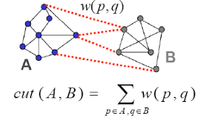
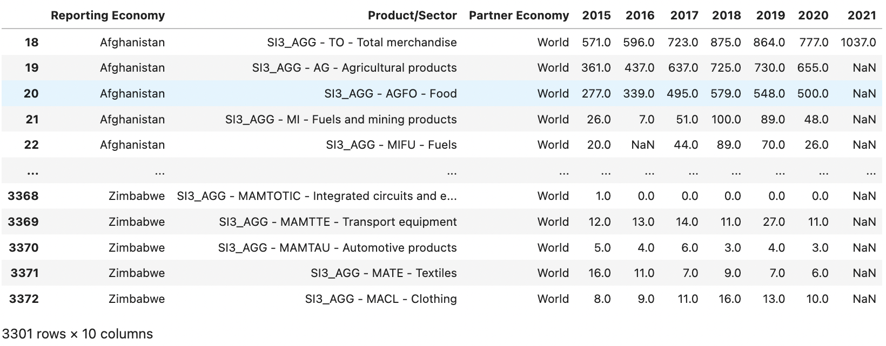
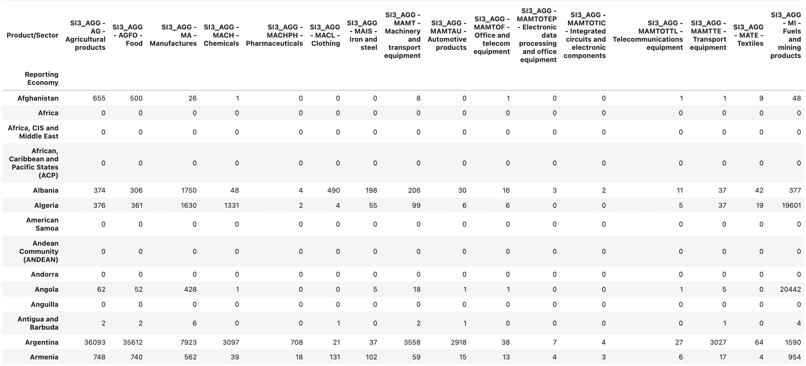
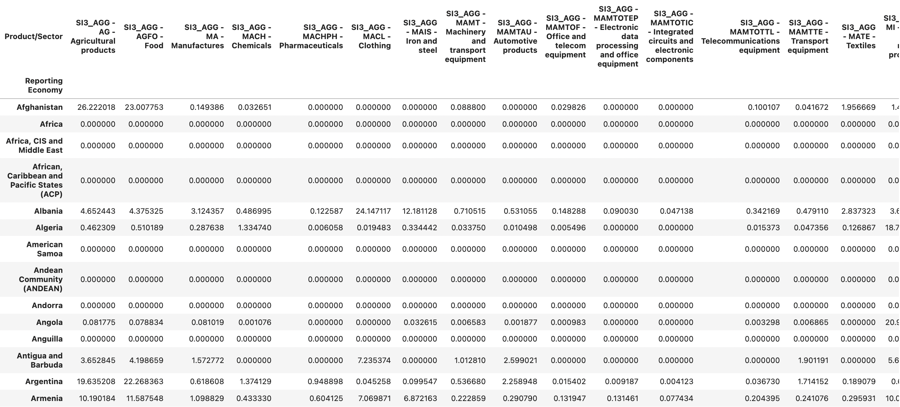
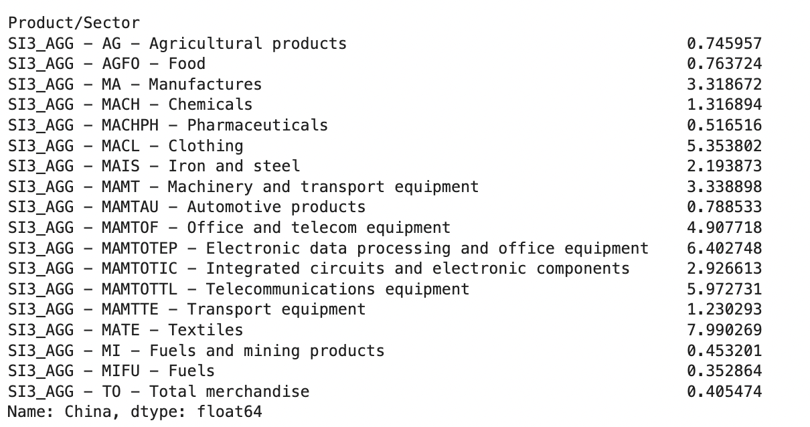
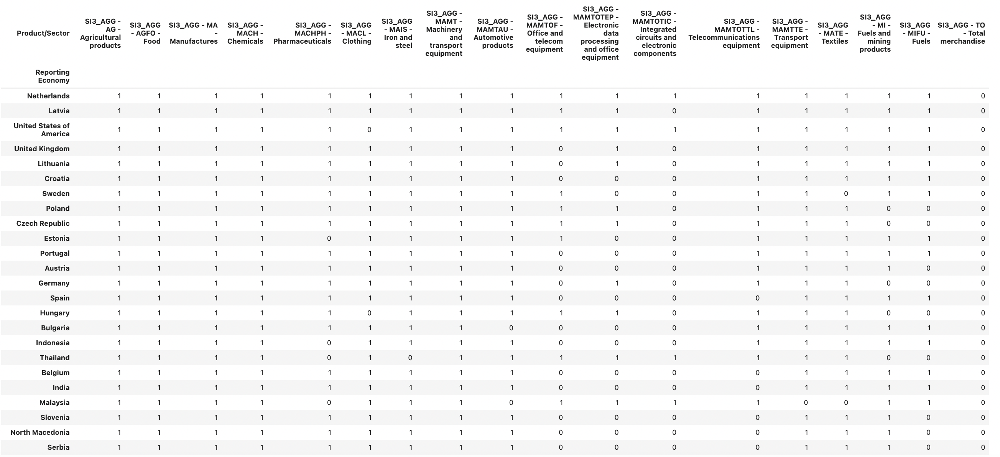
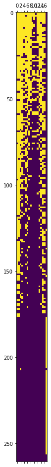
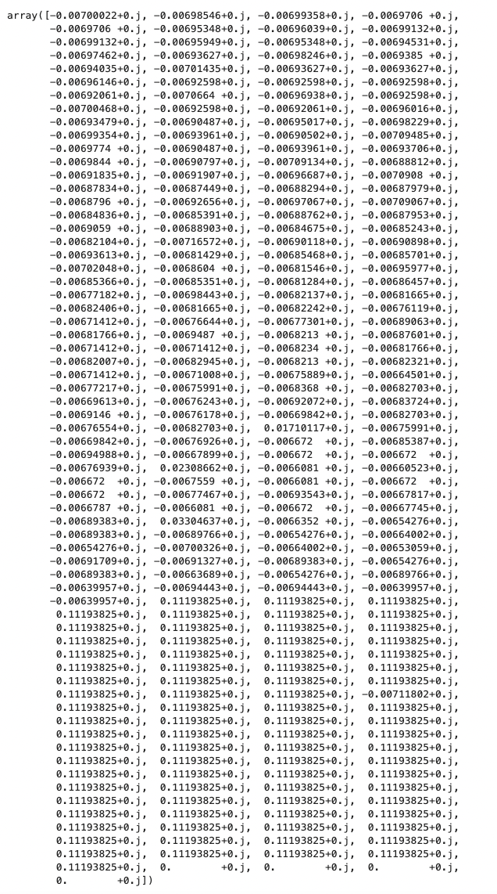
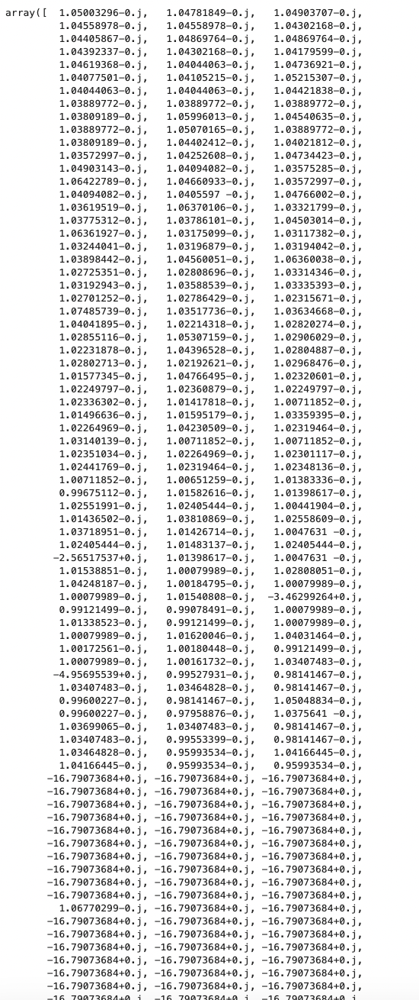

Economic complexity index is often used to describe diversification of a country's exports. Usually countries with highly
diversified exports also produce a multitude of technologically advanced products and thus are more self-sustained (although
they might be highly dependent on imports of commodities from countries, lagging behind in technology).

For comparison, Japan and Germany are among the world leaders in OEC, being No. 1 and No. 4 with ECI=2.19 and ECI=1.88 respectively. The US has ECI=1.56, the UK has ECI=1.42. China has ECI=0.96, which means that it has an average level of economic complexity. Russian and Ukraine have ECI=0.5.

China has a relatively low ECI of 0.96, approximately 2 times lower than the US. This is a very low for the 1st economy
in the world, which is counterintuitive. I decided to dig into the meaning of this number and to check, if it accurately
represents the degree of autonomy of the Ukrainian economy.

## Economic Complexity Index construction

In order to define ECI first we need to define a *country-product matrix* $M$. Each element $M_{c,p}$ of this matrix 
corresponds to a so-called *Revealed Competitive Advantage (RCA)* of the country $c$ in producing a product $p$:

E.g. if we have just 2 countries and just 3 products, we shall have a 2-by-3 country-product matrix:

$M = \begin{pmatrix} RCA_{1, 1} && RCA_{1,2} && RCA_{1,3} \\ RCA_{2, 1} && RCA_{2,2} && RCA_{2,3} \end{pmatrix}$

### Revealed Competitive Advantage (Balassa index)

Revealed Competitive Advantage (RCA), also known as Balassa index, works as follows. Suppose that each
product were exported by each country uniformly. Then the fair share of exports of e.g. oil by every country would've
been 13% of its total exports. However, for some countries like Russia or Norway oil constitutes 30% of exports, meaning that
the share of oil in their exports is more than fair and their RCA in oil is very high:

$RCA = \frac{\frac{x_{c,p}}{\sum_p x_{c,p}}}{ \frac{\sum_c x_{c,p}}{\sum_c \sum_p x_{c,p}} } = \frac{30}{13}$

We define a *discretized country-product matrix* $\tilde{M}$ as follows: for every product $p$ and every country $c$ we set the value of country-product matrix to 1, if
country exports more than a fair share of this good, and 0, if less than fair share:

$\tilde{M}_{c,p} = \begin{cases}1, RCA \ge 1 \\ 0, RCA < 1 \end{cases}$

Note that many countries will have $\tilde{M}_{c,p} = 1$ in oil (e.g. Russia, Saudi Arabia, UAE, Iraq, Iran, Norway, Canada, US, Venezuela etc.),
while a very short list of countries will have $\tilde{M}_{c,p} = 1$ in 7 nm semiconductors (US, Taiwan, South Korea).

Thus we can define two more entities, product ubiqity and economic complexity:

*Product ubiquity* is $k_p = \sum_c \tilde{M}_{c,p}$.

*Economy complexity* is $k_c = \sum_p \tilde{M}_{c,p}$.

Oil is a pretty ubiquitous product (or *commodity*, as people often call those), as $k_p > 10$. 7 nm chips are not
very ubiquitous products, as $k_p = 3$ for them, their market is an oligopoly.

Now, if a country exports a broad range of products, its economic complexity is high (e.g. for Germany, which manufactures
all kinds of nuts-and-bolts, machines, pharmaceuticals etc.). If a country exports a bulk of one good (e.g. just oil),
its economic complexity is low.

If we were to sort the countries in our discretized country-product matrix $\tilde{M}_{c,p}$ by economic complexity and products by product 
ubiquity, we'd find out that the matrix tends to have an almost triangular shape (e.g. countries with smalller economic
complexity tend to export commodities):

<center>**Country-product matrix: rows sorted by economy complexity and columns - by product ubiquity**. Countries with low economic complexity tend to export products with low ubiquity (commodities).</center>

### Iterative definition of ECI and PCI

Now we can finally define the Economic Complexity Index (ECI) and Product Complexity Index (PCI).

The process of definition is iterative. We introduce the notions of *product ubiquity* $u^{(n)}_p$ and 
*diversification of economy* $d^{(n)}_c$ as a series of iterative approximations.

Initially we start by defining all the product ubiquity $u^{(0)}_p=k_p$ and all the economies diversifications $d^{(0)}_c = k_c$
and then iteratively update vectors of economy competitiveness and product complexity according to the following formula:

$\begin{cases} d^{(n)}_c = \frac{1}{k_c} \sum_p \tilde{M}_{c,p} u^{(n-1)}_p \\ u^{(n)}_p = \frac{1}{k_p} \sum_c \tilde{M}_{c,p} d^{(n-1)}_c \end{cases}$

After a number of iterations our process will converge to some $d^{(\infty)}_c$ and $u^{(\infty)}_p$.

Do you sense some linear algebra in this process? If we were to define vectors ${\bf d^{(n)}} = (d^{(n)}_1, d^{(n)}_2, ..., d^{(n)}_{N_c})^T$
and ${\bf u^{(n)}} = (u^{(n)}_1, u^{(n)}_2, ..., u^{(n)}_{N_p})^T$ (where $N_c$ and $N_p$ are total numbers of countries and
products respectively), we can feel that $\bf d^{(\infty)}$ and $\bf u^{(\infty)}$ are some kind of main eigenvector.

### Definition of ECI/PCI through eigenvectors

Re-write the definitions of $\bf d^{(n)}$ and $\bf u^{(n)}$ in matrix/vector form.

To do this, we need to define two diagonal matrices of country-by-country dimensionality, $C = \begin{pmatrix} \frac{1}{ k_{c_1} } && 0 \\ 0 && \frac{1}{ k_{c_{N_p}} } \end{pmatrix}$ and product-by-product dimensionality $P = \begin{pmatrix} \frac{1}{ k_{p_1} } && 0 && 0 \\ 0 && \frac{1}{ k_{p_2} } && 0 \\ 0 && 0 && \frac{1}{ k_{p_{N_p}} } \end{pmatrix}$, which are used for normalization.

Then our iterative definition takes form:

$\begin{cases}{\bf d^{(n)}} = C \tilde{M} {\bf u^{(n-1)}} \\ {\bf u^{(n)}} = P \tilde{M}^T {\bf d^{(n-1)}} \end{cases}$

Substituting the equations, we get a recurrent formula:

${\bf d^{(n)}} = C \tilde{M} P \tilde{M}^T {\bf d^{(n-1)}}$

At $n \to \infty$ we come to an eigenvector-eigenvalue equation:

$\lambda {\bf d^{(\infty)}} = C \tilde{M} P \tilde{M}^T {\bf d^{(\infty)}}$

Hence, ECI of a country $c$ is ${\bf d^{(\infty)}}[с]$. 

Similarly, PCI of product $p$ corresponds to ${\bf u^{(\infty)}}[p]$, where $\lambda {\bf u^{(\infty)}} = P \tilde{M}^T C \tilde{M} {\bf u^{(\infty)}}$.

With PCI and ECI as sorting functions, we get a similar "triangular" structure of country-product matrix:

<center>**Countries and products, sorted by ECI and PCI.**</center>

### Reminder: Normalized Cut

In my [previous post](/2022-08-31-1) I looked into the Normalized Cut algorithm in detail (including its connections to the 
biclustering problem in bioinformatics, detection of dense subset of a bipartite graph, NMF, k-means etc.). Basically,
if finds a minimal cut in a graph, such that the volumes of 2 subsets, it splits the graph into, are balanced.

<center>**Normalized cut finds the max/min cut in a graph, such that the weights of halves are comparable.**</center>

The Ncut algorithm solution has a form of generalized eigenvalues problem (I am not going to work through the problem
statement in this post again, please, refer to the Ncut part of my [previous post](/2022-08-31-1)):

$\begin{cases} \min \limits_{y} \frac{y^T (D-S) y}{y^T D y} \\ y^T D 1 = 0 \\ y[i] \in \{1, -b\} \end{cases}$

Here $D$ is a degree matrix, $S$ is an adjacency matrix and $y$ is a vector, where positive items correspond to one 
cluster and negative items - to the other, $b$ is a ratio of sizes between the part of graph, we want to select, and 
the remaining part of the graph. The value, we aim to minimize in the first equation, is called Rayleigh quotient.

This minimization problem results in a generalized eigenvalue problem:

$(D - S) y = \lambda D y$

Here we aim to fins the smallest non-trivial eigenvalue $\lambda$ produces the minimum of Rayleigh quotient.

$D-S$ matrix is also called Laplacian matrix and $D^{-\frac{1}{2}} (D-S) D^{-\frac{1}{2}}$ is called nomralized Laplacian matrix, 
because though this normalization generalized eigenvalue problem can be reduced to the regular eigenvalue problem. Indeed, make a variable substitution:

$y = D^{-\frac{1}{2}} z$

$D^{-\frac{1}{2}} (D-S) D^{-\frac{1}{2}} z = \lambda z$

The normalized Laplacian matrix is stochastic, hence, the smallest in absolute value eigenvalue is $\lambda=0$ and 
eigenvector $z={\bf 1}$. We aim to find the second smallest eigenvalue.

Interestingly, the constraint $y^T D 1 = 0$ can be lifted, because every solution satisfies it. Indeed, the eigenvector 
with smallest eigenvalue is $z_0 = 1$. Then every other eigenvector is orthogonal to it, because
the Laplacian (D - S) is symmetric, making normalized Laplacian $D^{-\frac{1}{2}} (D-S) D^{-\frac{1}{2}}$ symmetric, too.
Then all of their eigenvectors are orthogonal to each other and $0 = z_1^T z_0 = y_1^T D 1$

Now, in practice we also relax the second constraint $y[i] \in \{1, -b\}$ and solve the system in real numbers, and
if i-th coordinate takes a positive value, assume it 1, and if negative, assume that it takes the value of $-b$.

### Connection between Ncut and ECI

Let us establish correspondence between the ECI equation $\lambda {\bf d^{(\infty)}} = C \tilde{M} P \tilde{M}^T {\bf d^{(\infty)}}$
and Ncut equation. Start with Ncut:

$D^{-\frac{1}{2}} (D-S) D^{-\frac{1}{2}} z = \lambda z$

Multiply both sides by $D^{-\frac{1}{2}}$ and split the terms $D$ and $S$ in the Laplacian $D-S$:

$D^{-1} (D-S) D^{-\frac{1}{2}} z = \lambda D^{-\frac{1}{2}} z$

$D^{-1} D D^{-\frac{1}{2}} - D^{-1} S D^{-\frac{1}{2}} z = \lambda D^{-\frac{1}{2}} z$

$- D^{-1} S D^{-\frac{1}{2}} z = - D^{-\frac{1}{2}} z + \lambda D^{-\frac{1}{2}} z$

$\underbrace{D^{-1} S}_{C \tilde{M} P \tilde{M}^T} \underbrace{D^{-\frac{1}{2}} z}_{d} = \underbrace{(1-\lambda)}_{\lambda} \underbrace{D^{-\frac{1}{2}} z}_{d}$

Hence, we've established the correspondence between Ncut and ECI.

### Practical example

Download a world exports dataset from the WTO website: https://stats.wto.org/. The groupings of products in this dataset are pretty crude, but still they should suffice for the purpose of understanding ECI.

Read in and clean the dataset:

```python
wto_df = pd.read_excel('./data/WtoData_20221121023331.xlsx', skiprows=1, header=1)
# remove some columns with duplicates etc.
wto_df = wto_df[wto_df['Reporting Economy'] != 'European Union']
wto_df = wto_df[wto_df['Partner Economy'] == 'World']
wto_df = wto_df[wto_df['Reporting Economy'] != 'World']
```



Pivot the dataset:

```python
pivoted_wto = wto_df.pivot(index='Reporting Economy', columns='Product/Sector', values='2020')
pivoted_wto = pivoted_wto.fillna(0).astype('int64')
pivoted_wto
```



Calculate the RCA numerator and denominator for the future country-product matrix:

```python
# calculate the rca_numerator
rca_numerator = pivoted_wto.div(pivoted_wto.sum(axis=1), axis=0)

# calculate the rca_denominator
rca_denominator = pivoted_wto.copy(deep=True)
product_sums = pivoted_wto.sum(axis=0)
for item in product_sums.index:
    rca_denominator[item] = product_sums[item]
rca_denominator = rca_denominator.div(product_sums.sum(), axis=0)
rca_denominator

# calculate the country-product matrix (without the 0-1 discretization so far)
M = rca_numerator.div(rca_denominator)
M = M.fillna(0)
M
```



Let us look into the row of the country-product matrix, corresponding to China:

```python
M.loc['China']
```



Now we get a hint on why China has a relatively low ECI for the first economy in the World: it lacks some commodities, 
such as food supplies and fuels as well as automotive parts (although it is now the single mightiest producer of 
automobiles in the World, manufacturing 26 million units a year, it is consuming most of them itself; however this 
situation is quickly changing, as Chinese automotive industry rapidly expands to the Russian and CIS markets in 2022).

We shall discretize the country-product matrix and sort its rows (countries) by $k_c$:

```python
discrete_M = M.applymap(lambda x: 1 if x >= 1 else 0)
sorted_discrete_M = discrete_M.loc[discrete_M.sum(1).sort_values(ascending=False).index]
sorted_discrete_M
```



This is already starting to make sense: developed European coutries, such as Netherlands or Germany top the list,
as well as the US and UK. China is in 40s, Russia is closer to the middle of the list.

If we were to draw the discretized country-product matrix, with rows sorted by $k_c$, we get something like this:

```python
from matplotlib import pyplot as plt

plt.matshow(sorted_discrete_M)
```



As you can see, the matrix indeed has a triangular nature.

At last, let us proceed with calculating the ECI as the second main eigenvector of normalized discretized country-product matrix:

```python
# calculate economy complexities; some economies have 0 complexities, making matrix singular - regularize by adding a tiny number
economy_complexities = np.diag(sorted_discrete_M.sum(1).map(lambda x: 1/10 if x == 0 else x))
# get a diagonal C matrix
C = np.linalg.inv(economy_complexities)

# calculate product ubiquities
product_ubiquities = np.diag(sorted_discrete_M.sum(0))
# get a diagonal P matrix
P = np.linalg.inv(product_ubiquities)

# calculate the normalized discretized country-product matrix for ECI calculation
eci_matrix = C @ sorted_discrete_M.to_numpy() @ P @ sorted_discrete_M.to_numpy().T

# get eigenvalue and eigenvectors of the normalized discretized country-product matrix
values, vectors = np.linalg.eig(eci_matrix)

# get the second main eigenvector
vectors[:,1]
```



As you can see, we got our ECI vector, but most values in it are negative, and there is also a tail of positive/zero
 values, corresponding to countries, which were regularized by adding 1/10 etc.

Eigenvectors are defined up to a constant, so let us multiply all the coordinates by (-150) to get a more reasonable range
of values:

```python
vectors[:,1] * (-150)
```



Now we can see that most of our ECI vector coordinates took reasonable values, and the normalized variables
took large negative or 0 values. Great!

## References:
* https://en.wikipedia.org/wiki/Revealed_comparative_advantage - revealed competitive advantage/Balassa index
* https://journals.plos.org/plosone/article?id=10.1371/journal.pone.0070726
* https://journals.plos.org/plosone/article?id=10.1371/journal.pone.0047278
* https://arxiv.org/pdf/1711.08245.pdf - connections with normalized cut, diffusion map, kernel PCA etc.
* https://people.eecs.berkeley.edu/~malik/papers/SM-ncut.pdf - normalized cut
* https://people.eecs.berkeley.edu/~wainwrig/stat241b/scholkopf_kernel.pdf - Scholkopf on kernel PCA
* https://web.cse.ohio-state.edu/~belkin.8/papers/LEM_NC_03.pdf - original paper on spectral embedding/Laplacian eigenmaps
* https://stats.stackexchange.com/questions/463141/what-is-the-difference-between-spectral-clustering-and-laplacian-eigenmaps - on correspondence of spectral clustering and LLE