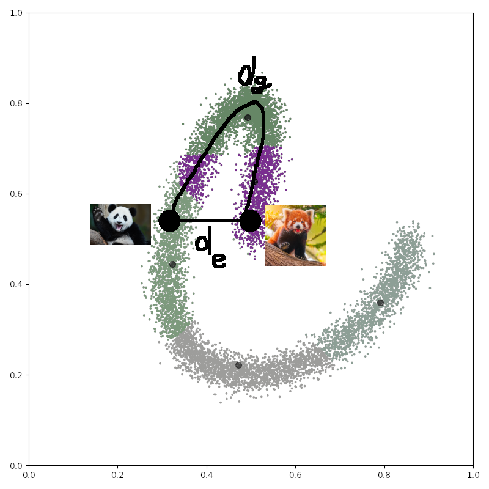

## Multi-dimensional scaling (MDS)

### Intuition

As usual suppose that we have an $n$-by-$p$ data matrix $X = \begin{pmatrix} x_{1,1} && x_{1,2} && ... && x_{1,p} \\ ... && ... && ... && ... \\ x_{n,1} && x_{n,2} && ... && x_{n,p} \end{pmatrix}$.

Suppose that we've constructed an $n$-by-$n$ matrix $D^{(2)}$ of square distances between rows $X_i$ of data matrix $X$: 

$D^{(2)} = \begin{pmatrix}  d^2(X_1, X_1) && d^2(X_1, X_2) && ... && d^2(X_1, X_n) \\ ... && ... && ... && ... \\ d^2(X_n, X_1) && d^2(X_n, X_2) && ... && d^2(X_n, X_n) \end{pmatrix}$.

We know that $d^2(X_1, X_2) = ||X_1||^2_2 + 2 \langle X_1, X_2 \rangle + ||X_2||^2_2$. 

With a certain trick we can move away from distance matrix $D$ to a kernel matrix $K$, such that:

$K = \begin{pmatrix} \langle X_1, X_1 \rangle && \langle X_1, X_2 \rangle && ... && \langle X_1, X_n \rangle \\ ... && ... && ... && ... \\ \langle X_n, X_1 \rangle && \langle X_n, X_2 \rangle && ... && \langle X_n, X_n \rangle \end{pmatrix}$

Kernel matrix basically contains cosines of angles between vectors $X_i$ and $X_j$ (given their lengths are 1).

Now, in MDS we are seeking to approximate each $p$-dimensional data point $X_i$ with a low-dimensional vector $Y_i$, so that
the similarity matrix between $Y_i$ vectors approximates the kernel matrix K between $X_i$ vectors.

Suppose, for instance, that $Y_i$ has a dimensionality of 2.

$\hat{K} = Y Y^T = \begin{pmatrix} Y_{1,1} && Y_{1,2} \\ Y_{2,1} && Y_{2,2} \\ ... \\ Y_{n,1} && Y_{n,2} \end{pmatrix} \cdot \begin{pmatrix} Y_{1,1} && Y_{2,1} && ... && Y_{n,1} \\ Y_{1,2} && Y_{2,2} && ... && Y_{n,2} \end{pmatrix} = \begin{pmatrix} \langle {\bf Y_{1}}, {\bf Y_{1}} \rangle && \langle {\bf Y_{1}}, {\bf Y_{2}} \rangle && ... && \langle {\bf Y_{1}}, {\bf Y_{n}} \rangle \\ ... && ... && ... && ... \\ \langle {\bf Y_{n}}, {\bf Y_{1}} \rangle && \langle {\bf Y_{n}}, {\bf Y_{2}} \rangle && ... && \langle {\bf Y_{n}}, {\bf Y_{n}} \rangle \end{pmatrix}$ , 

where ${\bf Y_1} = (Y_{1,1}, Y_{1,2})$ is a row vector of $Y$ matrix.

What are the optimal column vectors $\begin{pmatrix}Y_{1,1} \\ Y_{2,1} \\ ... \\ Y_{n,1} \end{pmatrix}$ of this matrix Y? 

The answer is simple: those are eigenvectors/singular vectors of $K$ (in this case it is the same, because $K$ is a Gram matrix).

The best rank 2 approximation of $K$ in terms of Frobenius norm is given by its partial SVD: $\hat{K} = \sum \limits_{i=1}^2 \sigma_i u_i v_i^T$.

This can be shown by iteratively applying $|| K - \sigma_1 u_1 v_1^T||^2_F = \sum \limits_{i=2}^n \sigma_i^2$ (e.g. see [this SO post](https://math.stackexchange.com/questions/791877/minimizing-frobenius-norm-for-two-variables))

In this case $S$ matrix is a Gram matrix, so its SVD is symmetrix $K = U D V^T = U D U^T$.

Now, how do we get from $D$ matrix to $K$ matrix? See the next section.

### Kernelization and double centering

For now consider a matrix $X_c = \begin{pmatrix} x_{1,1} - \frac{\sum_{i=1}^{n} x_{i,1}}{n} && x_{1,2} - \frac{\sum_{i=1}^{n} x_{i,2}}{n} && x_{1,p} - \frac{\sum_{i=1}^{n} x_{i,p}}{n} \\ ... && ... && ... \\ x_{n,1} - \frac{\sum_{i=1}^{n} x_{i,1}}{n} && x_{n,2} - \frac{\sum_{i=1}^{n} x_{i,2}}{n} && x_{n,p} - \frac{\sum_{i=1}^{n} x_{i,p}}{n} \end{pmatrix}$, where we subtracted column means from each element, so that all the columns have 0 sum.

We can do its SVD $X_c = U D V^T$. And we can attain two Gram matrices out of it, left and right.

One of our Gram matrices would be a $p$-by-$p$ covariance matrix, used in PCA:

$C_c = X_c^T X_c = V D U^T U D V^T = V D^2 V^T$

The other Gram matrix would be an $n$-by-$n$ kernel matrix:

$K_c = X_c X_c^T = U D V^T V D U^T = U D^2 U^T$

Eigenvectors $V$ of the covariance matrix $C_c$ are right singular vectors of the matrix $X_c$ and, incidentally, $V D$ are Principal Components, obtained in PCA.

Eigenvectors $U$ of the kernel matrix $K_c$ are left singular vectors of the matrix $X_c$. 

In a matrix notation how do we get $X_c$ from $X$? Easy, we multiply it from the left by $\begin{pmatrix} 1 && 0 && ... && 0 \\ ... && ... && ... && ... \\ 0 && 0 && ... && 1 \end{pmatrix} - \frac{1}{n} \begin{pmatrix} 1 && 1 && ... && 1 \\ ... && ... && ... && ... \\ 1 && 1 && ... && 1 \\  \end{pmatrix} = I - \frac{1}{n} {\bf 1}_n$.

As a result, we get $X_c = (I - \frac{1}{n} {\bf 1}_n) X$. Apply this to get centered kernel $K_c$ from the raw kernel matrix $K$:

$K_c = X_c X_c^T = (I - \frac{1}{n}{\bf 1}_n) X X^T (I - \frac{1}{n}{\bf 1}_n)^T = (I - \frac{1}{n}{\bf 1}_n) K (I^T - \frac{1}{n}{\bf 1}_n^T) = K - \frac{1}{n}{\bf 1}_nK - \frac{1}{n}K{\bf 1}_n + \frac{1}{n^2} {\bf 1} K {\bf 1}^T$.

Now let us consider the pairwise distance matrix $D$ between the $n$ data points:

$D^{(2)} = \begin{pmatrix} ||X_1||^2_2 - 2 \langle X_1, X_1 \rangle + ||X_1||^2_2 && ||X_1||^2_2 - 2 \langle X_1, X_2 \rangle + ||X_2||^2_2 && ... && ||X_1||^2_2 - 2 \langle X_1, X_n \rangle + ||X_n||^2_2 \\ ... && ... && ... && ... \\ ||X_n||^2_2 - 2 \langle X_n, X_1 \rangle + ||X_1||^2_2 && ||X_n||^2_2 - 2 \langle X_n, X_2 \rangle + ||X_2||^2_2 && ... && ||X_n||^2_2 - 2 \langle X_n, X_n \rangle + ||X_n||^2_2 \end{pmatrix} = $

$ = \underbrace{\begin{pmatrix}||X_1||^2_2 && ||X_1||^2_2 && ... && ||X_1||^2_2 \\ ... && ... && ... && ... \\ ||X_n||^2_2 && ||X_n||^2_2 && ... && ||X_n||^2_2 \end{pmatrix}}_{Z} - 2 \underbrace{\begin{pmatrix} \langle X_1, X_1 \rangle && \langle X_1, X_2 \rangle && ... && \langle X_1, X_n \rangle \\ ... && ... && ... && ... \\ \langle X_n, X_1 \rangle && \langle X_n, X_2 \rangle && ... && \langle X_n, X_n \rangle \end{pmatrix}}_{X X^T} + \underbrace{\begin{pmatrix} ||X_1||^2_2 && ||X_2||^2_2 && ... && ||X_n||^2_2 \\ ... && ... && ... && ... \\ ||X_1||^2_2 && ||X_2||^2_2 && ... && ||X_n||^2_2 \end{pmatrix}}_{Z^T} = $

$ = Z - 2 X X^T + Z^T = {\bf 1} {\bf z}^T - 2 X X^T + {\bf z} {\bf 1}^T$.

Now, $(I - \frac{1}{n} {\bf 1}{\bf 1}^T) D^{(2)} (I - \frac{1}{n} {\bf 1}{\bf 1}^T)^T  =  (I - \frac{1}{n} {\bf 1}{\bf 1}^T) ({\bf 1} {\bf z}^T - 2 X X^T + {\bf z} {\bf 1}^T) (I - \frac{1}{n} {\bf 1}{\bf 1}^T)^T = $

$ = (\cancel{{\bf 1} {\bf z}^T} - \cancel{{\bf 1} {\bf z}^T} - 2 X X^T + \frac{2}{n} {\bf 1}{\bf 1}^T X X^T + {\bf z}{\bf 1}^T - \frac{||\bf z||_1}{n} {\bf 1}{\bf 1}^T) (I - \frac{1}{n} {\bf 1}{\bf 1}^T)^T = $

$ = - 2 X X^T + \frac{2}{n} {\bf 1}{\bf 1}^T X X^T + \cancel{ {\bf z}{\bf 1}^T } - \cancel{ \frac{||\bf z||_1}{n} {\bf 1}{\bf 1}^T } + 2 X X^T \frac{1}{n} {\bf 1}{\bf 1}^T - \frac{2}{n} {\bf 1}{\bf 1}^T X X^T \frac{1}{n} {\bf 1}{\bf 1}^T - \cancel{ {\bf z}{\bf 1}^T \frac{1}{n} {\bf 1}{\bf 1}^T } + \cancel{ \frac{||\bf z||_1}{n} {\bf 1}{\bf 1}^T \frac{1}{n} {\bf 1}{\bf 1}^T } = $

$ = (I - \frac{1}{n} {\bf 1} {\bf 1}^T ) 2 X X^T {\bf 1} {\bf 1}^T  - (I - \frac{1}{n} {\bf 1} {\bf 1}^T ) 2 X X^T = 2 (I - \frac{1}{n} {\bf 1} {\bf 1}^T ) X X^T (I - \frac{1}{n} {\bf 1} {\bf 1}^T ) = 2 (I - \frac{1}{n} {\bf 1} {\bf 1}^T ) K (I - \frac{1}{n} {\bf 1} {\bf 1}^T ) = 2 K_c$.

Hence, as we've just seen, double centering of distances matrix gives us the centered kernel matrix $K_c$.

For this matrix we can easily find an EVD/SVD and use it as a low-dimensional approximation of the matrix $K_c$ (and,
hence, $D^{(2)}$), providing us with the dimensionality reduction method.

## Isomap and Locally Linear Embeddings (LLE)

It is not hard to find a limitation in the classical MDS algorithm: oftentimes data points form a so-called manifold in
the enveloping space. For instance, real-life photos form some shape of the space of all theoretically possible
640x480 pixel signals. Moreover, this shape is continuous and smooth - you can transition from one real-life photo to
another one applying small changes.

Hence, the correct way to measure the distances between our data points is not euclidean distances in the enveloping
space, but geodesic on the manifold. For instance, if we compare photos of lesser panda and giant panda, they'd be close
in the enveloping space and euclidean distance $d_e$ between them would be small, but they'd be far apart on the manifold,
because lesser panda is a racoon, and giant panda is a bear, so geodesic distance between them $d_g$ would be large.

**Manifold of photos.** Each data point corresponds to a photo. Photos of giant panda and
lesser panda are close in euclidean distance $d_e$, because they look similar, but far apart in geodesic distance $d_g$,
because they actually belong to very different taxa.

In 2000 two manifold-aware methods were published in the same Science magazine issue.

### Isomap

Isomap works in 3 simple steps:

1. Find k nearest neighbours of each point. Construct a weighted graph, connecting neighbouring points with edges, where weight of each edge is the Euclidean distance between those points.

2. Construct a distance matrix on that graph, using e.g. Dijkstra's algorithm.

3. Using this distance matrix, perform MDS.

### Locally Linear Embeddings (LLE)

LLE is very similar to Isomap, but with a slightly different premise.

1. Find k nearest neighbours of each point. Construct a weighted graph, connecting neighbouring points with edges, where weight of each edge is the Euclidean distance between those points.

2. Construct a matrix W, such that each data point $X_i$ is most accurately represented as a linear combindation of its neighbours with the weights from this matrix: $\bar{X}_i = \sum \limits_{j=1}^{k} W_{i,j} X_j$, so that $\Phi(X) = \sum \limits_{i=1}^n |X_i - \sum \limits_{j=1}^k W_{i,j} X_j|^2$ is minimal (least square problem).

3. Using this matrix as a similarity matrix, find matrix $Y$ of vectors $Y_i$ of low dimensionality, such that the following function is minimized: $\Phi(Y) = |Y_i - \sum \limits_{j=1}^{k} W_{i,j} Y_j|^2$.

The matrix W could be find with a simple least squares regression. 

If you have a data matrix $X$ and you're looking for $W$, which best approximates $X$ $\hat{X} = W \cdot X$:

$\begin{pmatrix} \hat{X}_{1,1} && \hat{X}_{1,2} && \hat{X}_{1,3} && \hat{X}_{1,4} \\ \hat{X}_{2,1} && \hat{X}_{2,2} && \hat{X}_{2,3} && \hat{X}_{2,4} \\ \hat{X}_{3,1} && \hat{X}_{3,2} && \hat{X}_{3,3} && \hat{X}_{3,4} \end{pmatrix} = \begin{pmatrix} W_{1,1} && W_{1,2} && W_{1,3} \\ W_{2,1} && W_{2,2} && W_{2,3} \\ W_{3,1} && W_{3,2} && W_{3,3} \end{pmatrix} \cdot \begin{pmatrix} X_{1,1} && X_{1,2} && X_{1,3} && X_{1,4} \\ X_{2,1} && X_{2,2} && X_{2,3} && X_{2,4} \\ X_{3,1} && X_{3,2} && X_{3,3} && X_{3,4} \end{pmatrix}$

Essentially we have a linear regression problem for each row vector $\begin{pmatrix}\hat{X}_{1,1} && \hat{X}_{1,2} && \hat{X}_{1,3} && \hat{X}_{1,4}\end{pmatrix}$, where each of
its coordinates can be perceived as $y$-s of a data point in regression problem, weights $(W_{1,1}, W_{1,2}, W_{1,3})$ can be viewed
as regression weights and column-vectors $\begin{pmatrix} X_{1,1} \\ X_{2,1} \\ X_{3,1} \end{pmatrix}$ can be viewed as
regression factors for current data point.

When it comes to reconstructing low-dimensional representations $Y_i$ from the matrix $W$, again, partial EVD/SVD comes
in handy.

It can be shown, that you need to find eigenvectors of a matrix $(I-W)^T (I-W)$.

## Spectral embedding

Finally, let us consider Laplacian Eigenmaps algorithm as an implementation of spectral embedding.

It turns out that it draws connections to both LLE and normalized cut algorithm, considered in my [previous post](http://localhost:8000/2022-08-31-1/).

Again, the alogrithm consists of 3 steps, similar to those considered above:

1. Find k nearest neighbours (or, alternatively, $\epsilon$-neighbourhood) of each data point.

2. Construct a weighted graph, so that the weights of each edge, connecting neighbouring vertices is a heat kernel: $W_{i,j} = e^{-\frac{|| x_i - x_j ||^2}{t}}$. Alternatively just assign neighbour edges lengths 1 and non-neighbour - length 0 (which actually corresponds to $t = \infty$). 

3. Calculate the Laplacian matrix of this graph $L = D - W$ (where $D$ is as usual a diagonal matrix of degrees of vertices) and solve the normalized Laplacian equation for eigenvectors and eigenvalues:

$L f = \lambda D f$

Again, 0 eigenvalue corresponds to a trivial solution. Eigenvectors other than that are useful. 

### Justification of the algorithm

#### Representation as a trace of Laplacian

Suppose that you want to project the dataset onto a single line that preserves the squares of distances between points
as well as possible. This is very similar to a directional derivative: when you're looking for a direction vector 
$\bf d$, which maximizes the derivative of a function $f()$ in that direction, which means that $\langle {\bf d}, \nabla f \rangle$., 
which means that the optimal ${\bf d} = \nabla f$, because $\langle \nabla f, \nabla f \rangle$ is the maximum.

So, let us write this mathematically: we're looking for a vector ${\bf y} = (y_1, y_2, ..., y_n)^T$ maximizing $\langle W, Y^{(i-j)} \rangle$,
where 

$Y^{i-j} = \begin{pmatrix} (y_{1} - y_{1})^2 && (y_{1} - y_{2})^2 && ... && (y_{1} - y_{n})^2 \\ (y_{2} - y_{1})^2 && (y_{2} - y_{2})^2 && ... && (y_{2} - y_{n})^2 \\ ... && ... && ... && ... \\ (y_{n} - y_{1})^2 && (y_{n} - y_{2})^2 && ... && (y_{n} - y_{n})^2 \end{pmatrix}$

Rewriting this in a one-line notation, we're looking for ${\bf y} = (y_1, y_2, ..., y_n)^T$, such that ${\bf y^*} = \arg \max_{\bf y} \sum \limits_i \sum \limits_j W_{i,j} (y_i - y_j)^2$.

This maximization problem is equivalent to minimization problem of a quadratic form with a Laplacian attaining its minimum:

${\bf y^*} = \arg \max_{\bf y} \sum \limits_i \sum \limits_j W_{i,j} (y_i - y_j)^2 = \arg \min \limits_{\substack{ {\bf y^T} D {\bf y} = 1 \\ {\bf y}^T D {\bf 1} = 0 } } {\bf y}^T L {\bf y}$.

Let us show this fact:

${\bf y}^T L {\bf y} = \begin{pmatrix} y_1 && y_2 && ... && y_n \end{pmatrix} \begin{pmatrix} W_{1,1} - \sum_i W_{1,i} && W_{1,2} && ... && W_{1,n} \\ W_{2,1} && W_{2,2} - \sum_i W_{2,i} && ... && W_{2,n} \\ ... && ... && ... && ... \\ W_{n,1} && W_{n,2} && ... && W_{n,n} - \sum_i W_{n,i} \end{pmatrix} \begin{pmatrix} y_1 \\ y_2 \\ ... \\ y_n \end{pmatrix} = $

$ = \begin{pmatrix} W_{1,1} y_1 y_1 && W_{1,2} y_1 y_2 && ... && W_{1,n} y_1 y_n \\ W_{2,1} y_2 y_1 && W_{2,2} y_2 y_2 && ... && W_{2,n} y_2 y_n \\ ... && ... && ... && ... \\ W_{n,1} y_n y_1 && W_{n,2} y_n y_2 && ... && W_{n,n} y_n y_n \\ \end{pmatrix} - \begin{pmatrix} \sum_i W_{1,i} y_1^2 && 0 && ... && 0 \\ 0 && \sum_i W_{2,i} y_2^2 && ... && 0 \\ ... && ... && ... && ... \\ 0 && 0 && ... && \sum_i W_{n,i} y_n^2 \end{pmatrix} =$

$ = \sum_{i,j} W_{i,j} y_i y_j - \sum_i \sum_j W_{i,j} y_j^2 = - \frac{1}{2} (\sum_i \sum_j W_{i,j} y_i^2 - 2 \sum_{i,j} W_{i,j} y_i y_j + \sum_i \sum_j W_{i,j} y_j^2) = -\frac{1}{2} \sum_i \sum_j W_{i,j} (y_i - y_j)^2$.

Conditions are the same as in Normalized Cut algorithm, see my two previous posts on ECI and Normalized Cut.

In a more general case, if we're looking for a low-dimensional ($p$-dimensional) approximation $Y = \begin{pmatrix} y_{1,1} && y_{1,2} && ... && y_{1,p} \\ y_{2,1} && y_{2,2} && ... && y_{2,p} \\ ... && ... && ... && ... \\ y_{n,1} && y_{n,2} && ... && y_{n,p} \end{pmatrix}$ of our distance matrix $W$, we come to:

$\arg \min \limits_{Y^T D Y^T = I} Tr(Y^T L Y)$

Again, this result was shown in the section of [one of my previous posts](/2022-08-31-1), dedicated to the Normalized Cut algorithm.

#### Laplace-Beltrami operator on a manifold guarantees optimality of mapping

Interestingly, here algebraic theory connects with differential geometry.

Recall that Laplacian of a graph bears this name for a reason: it is essentially the same Laplacian as in field theory (see my [post on Laplacian in field theory](/2021-09-20-1/)). In case of functions, defined on manifolds, is also generalized by Laplace-Beltrami operator.

Suppose that our data points lie on a manifold. We shall be looking for a function $f: \mathcal{M} \to \mathbb{R}$, mapping points of our manifold to a line ($\mathbb{R}^1$). This approach is somewhat similar to PCA.

In discrete graph case we were looking for vectors $\bf y$ such that the 
quantity $\sum \limits_{i} \sum \limits_{j} W_{i,j} (y_i - y_j)^2$ was maximized. Recall that it can be represented as
$\sum \limits_{i} \sum \limits_{j} W_{i,j} (y_i - y_j)^2 = {\bf y}^T L {\bf y} = {\bf y}^T V^T \cdot V {\bf y}$. Here
$V$ is a discrete matrix, analogous to divergence, applied at each point of vector $y$ of points.

In a continuous case the counterpart of this expression would be $\int_{\mathcal{M}} \langle \nabla f(x), \nabla f(x) \rangle = \int_{\mathcal{M}} ||\nabla f(x)||^2$. Here we replaced the discrete $V$ matrix with a continuous gradient, 
their dot product draws similarities to divergence and sum is replaced with integral over the manifold.

Recall that Laplacian is a divergence of gradient by definition (again, see my [post on Laplacian in field theory](/2021-09-20-1/)):

$\mathcal{L}(f) = - div \nabla (f) = \nabla \cdot \nabla f$

We shall establish that $\int_{\mathcal{M}} || \nabla f(x) ||^2 = \int_{\mathcal{M}} \mathcal{L}(f) f$.

This fact is shown in 3 steps (see [this answer on StackOverflow](https://math.stackexchange.com/questions/2509357/why-is-negative-divergence-an-adjoint-of-gradient)). Consider a function $f$ and a vector field $X$:

1) multivariate/operator calculus version of product derivative rule: $\nabla \cdot (f X) = \langle \nabla f, X \rangle + f \nabla \cdot X$

2) application of Gauss-Ostrogradsky theorem: $\int_{\mathcal{M}} \nabla \cdot (f X) dV = \int_{\delta \mathcal{M}} \langle (f X), n \rangle dS$

3) manifold has 0 bound, hence $\int_{\delta \mathcal{M}} \langle (f X), n \rangle dS = 0$

Applying (3) to (1), we get: $\int_{\mathcal{M}} \langle \nabla f, X \rangle dV + \int_{\mathcal{M}} f \nabla \cdot X dV = 0$ and $\int_{\mathcal{M}} \langle \nabla f, X \rangle dV = - \int_{\mathcal{M}} f \nabla \cdot X dV$

Apply this to our previous line: 

$\int_{\mathcal{M}} || \nabla f(x) ||^2 = \int_{\mathcal{M}} \langle \nabla f, \nabla f \rangle = \int_{\mathcal{M}} -div(\nabla f) f = \int_{\mathcal{M}} \mathcal{L}(f) f$

#### Heat Kernel

Solution of our optimization problem draws close analogies with diffusion/heat equation:

$\frac{\partial u}{\partial t} = - \mathcal{L} u$

This equation gives us an idea of how the eigenfunctions for Laplacian would look like:

$H_t(x,y) = (4 \pi t)^{-\frac{m}{2}} e^{-\frac{||x - y||^2}{4t}}$

$\mathcal{L} f(x) \approx \frac{1}{t} (f(x) - (4 \pi t)^{-\frac{m}{2}} \int_{\mathcal{M}} e^{- \frac{|| x - y ||^2}{4t} } f(y) dy )$

$\mathcal{L} f(x) \approx \frac{1}{t} (f(x) - (4 \pi t)^{-\frac{m}{2}} \int_{\mathcal{M}} e^{- \frac{|| x - y ||^2}{4t} } f(y) dy )$

In discrete case, quantify this expression to:

$\mathcal{L} f(x_i) \approx \frac{1}{t} (f(x_i) - \frac{1}{k} (4 \pi t)^{-\frac{m}{2}} \sum \limits_{x_j: 0 < || x_i - x_j || < \epsilon} e^{ -\frac{||x_i - x_j||^2}{4t}} f(x_j))$

Inherent dimensionality of $\mathcal{M}$ might be unknown, hence, we put $\alpha = \frac{1}{k} (4 \pi t)^{-\frac{m}{2} }$.

Since Laplacian of a constant function is 0, $\alpha = ( \sum \limits_{x_j: 0 < || x_i - x_j || < \epsilon} e^{ -\frac{||x_i - x_j||^2}{4t}} f(x_j) )^{-1}$

This leads to several approximation schemes, and the authors of Laplacian eigenmaps use the following:

$W_{i,j} = \begin{cases} e^{-\frac{|| x_i - x_j ||^2}{4t}}, if || x_i - x_j || \le \epsilon \\ 0, otherwise \end{cases}$

### Connection to Normalized Cut

Please, refer to my previous posts on [Normalized Cut](/2022-08-31-1) and [Economic Complexity Index](/2022-11-11-1), where
Normalized Cut algorithm is derived and explained. Conditions of Laplacian Eigenmaps are identical to
the conditions of Normalized Cut.

### Connection to LLE

This one is instetsting.

$E = (I - W)^T (I - W)$

$Ef \approx \frac{1}{2} \mathcal{L}^2 f$

Hence, eigenvectors of $E$ coincide with the eigenvectors of Laplacian $\mathcal{L}$. Let us prove this.

#### Step 1. Hessian approximation

$(I-W) f \approx -\frac{1}{2} \sum \limits_j W_{i,j} (x_i - x_j)^T H (x_i - x_j)$

Let us use Taylor series approximation of our function $f()$ at each of the neighbouring points $x_j$ near the point $x_i$:

$f(x_j) = f(x_i) + \langle \nabla f(x_i), (x_i - x_j) \rangle + \frac{1}{2} (x_i - x_j)^T H (x_i - x_j) + o(||x_i - x_j||^2)$

At the same time each row of $(I-W) f(x)$ equals $f(x_i) - \sum \limits_j f(x_j)$. Substitute Taylor series approximation of $f(x_j)$ into it:

$f(x_i) - \sum \limits_j W_{i,j} f(x_j) \approx f(x_i) - \sum \limits_j W_{i,j} f(x_i) - \sum \limits_j W_{i,j} \langle \nabla f(x_i), (x_i - x_j) \rangle - \frac{1}{2} \sum \limits_j W_{i,j} (x_i - x_j)^T H (x_i - x_j) + o(||x_i - x_j|^2)$

First, recall that $\sum \limits_j W_{i,j} = 1$ and $\sum \limits_j W_{i,j} f(x_i) = f(x_i)$.

Second, $\sum \limits_j W_{i,j} (x_i - x_j) \approx 0$, because $\sum \limits_j W_{i,j} x_i = x_i$ and $\sum \limits_j W_{i,j} x_j \approx x_i$. 

So, $\sum \limits_j W_{i,j} \langle \nabla f(x_i), (x_i - x_j) \rangle = \langle \nabla f(x_i), \sum \limits_j W_{i,j} (x_i - x_j) \rangle \approx \langle \nabla f(x_i), 0 \rangle = 0 $

Hence, $f(x_i) - \sum \limits_j W_{i,j} f(x_j) \approx \cancel{f(x_i)} - \cancel{f(x_i)} - \cancel{ \sum \limits_j W_{i,j} \langle \nabla f(x_i), (x_i - x_j) \rangle } - \frac{1}{2} \sum \limits_j W_{i,j} (x_i - x_j)^T H (x_i - x_j) + o(||x_i - x_j|^2) \approx$

$\approx - \frac{1}{2} \sum \limits_j W_{i,j} (x_i - x_j)^T H (x_i - x_j)$.

#### Step 2. Laplacian is a trace of Hessian

$\sum \limits_j W_{i,j} (x_i - x_j)^T H (x_i - x_j) = Tr(H) = \mathcal{L} f$

Denote eigenvectors of Hessian $\bf e_k$ and corresponding eigenvalues $\lambda_k$.

$(x_i - x_j) = \sum \limits_k \langle e_k, (x_i - x_j) \rangle {\bf e_k}$

Hence, $(x_i - x_j)^T H (x_i - x_j) = \sum \limits_k \langle e_k, (x_i - x_j) \rangle^2 \lambda_k \underbrace{||{\bf e_k}||^2}_{=1} = \sum \limits_k \langle e_k, (x_i - x_j) \rangle^2 \lambda_k$.

Under assumption that points $x_j$ are randomly sampled around $x_i$, we assume that $\mathbb{E} \langle e_k, (x_i - x_j) \rangle = r$ and hence:

$\mathbb{E} (x_i - x_j)^T H (x_i - x_j) = r \sum \limits_k \lambda_k = r \cdot Tr(H) = r \cdot \mathcal{L} f$

Hence, $\sum \limits_j W_{i,j} (x_i - x_j)^T H (x_i - x_j) \approx \mathbb{E} (x_i - x_j)^T H (x_i - x_j) = r \cdot Tr(H) = r \cdot \mathcal{L} f$

#### Step 3. Apply the results of steps 1 and 2

$(I - W)^T (I - W) f \approx \frac{1}{2} \mathcal{L}^2 f$

$f^T (I - W)^T (I - W) f \approx \frac{1}{2} (\mathcal{L} f)^T \mathcal{L} f = \frac{1}{2} \mathcal{L}^2 f$

## References:
* https://stats.stackexchange.com/questions/14002/whats-the-difference-between-principal-component-analysis-and-multidimensional#:~:text=PCA%20is%20just%20a%20method,MDS%20is%20only%20a%20mapping.
* https://web.cse.ohio-state.edu/~belkin.8/papers/LEM_NC_03.pdf - a great paper by M.Belkin and P.Niyogi on connections between LLE and Laplacian Eigenmaps spectral embeddings
* https://scikit-learn.org/stable/modules/manifold.html
* https://www.youtube.com/watch?v=GEn-_dAyYME
* https://www.youtube.com/watch?v=RPjPLlGefzw - a good lecture by Ali Ghodsi
* https://cs.nyu.edu/~roweis/lle/papers/lleintro.pdf - intro to LLE by Saul and Roweis
* https://math.stackexchange.com/questions/791877/minimizing-frobenius-norm-for-two-variables
* https://www.robots.ox.ac.uk/~az/lectures/ml/lle.pdf - LLE paper
* http://www.cs.umd.edu/~djacobs/CMSC828/MDSexplain.pdf - good explanation of centering in MDS
* https://math.stackexchange.com/questions/12894/distinction-between-adjoint-and-formal-adjoint - on formally adjoint operators
* https://www.johndcook.com/multi_index.pdf - on multi-index notation
* https://math.stackexchange.com/questions/2509357/why-is-negative-divergence-an-adjoint-of-gradient - on why gradient and neg divergence are adjoint
; https://mbernste.github.io/posts/laplacian_matrix/ - great explanation of graph/continuous Laplacian