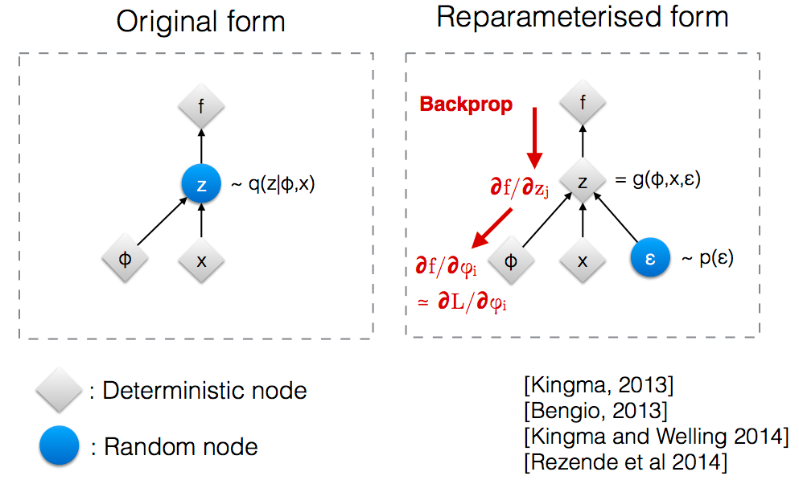

**Generative models** in machine learning are capable of looking at a set of data points (e.g. images), capturing some
inner structure in them and producing new data points (e.g. new images), which bear the properties of the training data set.

Since its inception in the late 2013 **Variational Autoencoder (VAE)** has become one of two most popular 
generative models for producing photorealistic images. A popular alternative is called Generative Adversarial Networks (GANs),
they are beyond the scope of this post.

To understand the ideas behind VAE, first we need to understand regular **autoencoders**. To understand motivation for
both regular autoencoders and VAE, we need some background in information theory. For understanding VAE we will 
also cover some background in Bayesian machine learning.

## Information theory: entropy, mutual information and KL-divergence

In 1940-1950 information theorists such as Claude Shannon posed a set of problems, related to finding the most economical
ways of data transmission.

Suppose that you have a signal (e.g. long text in English), and you need to transmit it through a channel (e.g. wire) with a severely limited
bandwidth. It would be beneficial to compress this signal, using some kind of encoding, before transferring it through the
wire, so that we make as good use of our data transfer channel, as possible. The receiving side should decompress the 
signal after receiving it.

<center>**Encoder-decoder architecture.** Uncompressed data are passed on input, they are encoded into a compressed representation, which is transferred through the transmission channel (e.g. wire), and decoded by the decoder on the receiving side.</center>

Suppose that you encode each letter of your alphabet with a sequence of 0s and 1s. What is the optimal way 
to encode each the letters? 

It is intuitive that if you encode frequent letters with the shortest sequences and non-frequent letters with remaining
(longer) sequences, you'll get an optimal encoding. Consider the following example of an alphabet and an optimal encoding:

Letter   | Letter code | Frequency | Length of letter code |
|--------|-------------|-----------|-----------------------|
| A      |   0         |    0.5    |            1          |
| B      |   10        |    0.25   |            2          |
| C      |   110       |    0.125  |            3          |
| D      |   111       |    0.125  |            3          |

Observe that the length of the code of letter $A$ equals to $-\log_2 p(A)$.

If your alphabet has a distribution $p$, e.g. $p(A) = 0.5$, the optimal encoding of your signal would achieve the minimal
length of average text, if $H(p) = \sum \limits_i p_i \log p_i = \mathbb{E} (-\log p) \to \min$. 

$H(p)$ is called **entropy**, as previously this function was introduced in physical chemistry by Ludwig Boltzmann to 
describe a different process.

Now, if you use an encoding with a different distribution of letter codes $q$ to transfer your signal, this encoding 
would be sub-optimal, as average length of a letter would be $\sum \limits_i p_i \log q_i$.

The difference in length between the optimal encoding and sub-optimal encoding is then 
$D(p, q) = - \sum \limits_i p_i \log q_i - (-\sum \limits_i p_i \log p_i) = - \sum \limits_i p_i \frac{ \log q_i }{ \log p_i }$.

This quantity is called **Kullback-Liebler divergence**, and for encoding to be optimal it should be minimal. As entropy
$H(p) = \sum \limits_i p_i \log p_i$ does not depend on $q$, it would suffice to optimize $H(p,q) = \sum \limits_i p_i \log q_i$,
this quantity is known as **Cross entropy**.

## Autoencoders

Inspired by information theory, machine learning practitioners employed the concept of **Autoencoders**.

To the best of my knowledge first publication on autoencoders or autoassociative neural networks was written by Mark Kramer
in 1991, where autoencoders were seen as a non-linear dimensionality reduction tool, a non-linear analogue of PCA.

The logic of autoencoder is to train such encoder $\mathcal{E}_{\phi}$ and decoder $\mathcal{D}_{\theta}$ neural networks
that encoder can compress the high-dimensional input data $x$ to a low-dimensional latent representation $z$ (or $h$ on
the image below) and then the decoder is able to reconstruct $\hat{x}$ (or $x'$ on the image below) accurately enough from 
this latent representation.

<center>**Autoencoder neural network**.</center>

This approach was re-used much later, circa 2010, by Yoshua Bengio group. They figured out that autoencoders can be used
for other purposes, such as denoising:

<center>**Denoising autoencoder (DAE)**. Suppose that you had a dataset of hand-written
digits (MNIST). Each digit's image is corrupted with white noise and then passed to a Denoising Autoencoder. The purpose
of the DAE is to recover the original image as accurately as possible.</center>

Moreover, Bengio borrowed the idea of stacking individual encoders/decoders from Hinton's RBMs and this approach 
gave rise to stacked denoising autoencoders and, eventually, Diffusion models, but that's a topic for another day.

### Holes in the latent space

Now, what happens, if we drop the decoder part, just sample a random point from the encoder latent space and generate
an output from it with the decoder? This is supposed to give us an image. Hence, our model would be generative.

However, one of the arising problems is the fact that data points in our training dataset oftentimes do not cover the 
whole latent space. In the worst-case scenario theoretically our autoencoder could just map all the data points to a 
straight line, effectively enumerating them.

Thus, if we wanted to generate an image and sampled a point from the latent space that belongs to a hole, we won't get a
valid output. So, we face a problem: we have to come up with a way to regularize our latent space, so that the whole
manifold of images is mapped to the whole latent space, preferably in a smooth way. This is the motivation for VAE.

VAE makes sure that the latent space has a Gaussian distribution, so that by gradually moving from one point of latent
space to its neighbour, we get a meaningful gradually changing output:

<center>**Sampling from nearby points of VAE latent space produces similar output images.** Illustration from the original paper.</center>

##  Variational autoencoder (VAE)

VAE, devised by Max Welling group in the late 2013, has arguably become the most wide-spread flavour of autoencoders.
It maps the data points to a distribution (usually, Gaussian), so that the mapping is smooth and no holes are produced.
It is formulated in Bayesian terms. 

The idea of this approach starts from the information theory perspective: we want to train such an encoder neural network 
$\mathcal{E}_{\phi}$ with parameters $\phi$ that the Kullback-Liebler divergence between the input image $\bf x$ and its 
latent representation $\bf z$ is minimized: $KL({\bf x}, {\bf z}) \to min$.

This principle is also known as Infomax and was borrowed by Bengio and, later, Welling teams from one of the flavours of 
Independent Component Analysis (ICA).

Computationally VAE minimizes the divergence using stochastic gradient descent. However, as we'll see later using
a regular neural network training approach does not get the job done, as normal gradient estimator has a very high 
variance and does not converge computationally (we'll see this in a moment).

Hence, training VAE employs a specific computational technique, called doubly-stochastic gradient descent and a special
trick, called re-parametrization trick, which we will explore later.

But first we need to understand the language, in which VAE is described, as it is a Bayesian model, and we will have to 
cover a lot of background in Bayesian ML.

<center>**All hail our lord and saviour Bayes...** (meh, just kidding)</center>

### Bayes formula

To explain the Bayesian framework, employed by VAE, we have to start with Bayes formula:

$\underbrace{ p(z | x) }_\text{posterior} = \frac{ \overbrace{ p(x | z)}^\text{likelihood} \cdot \overbrace{p(z)}^{prior} }{ \underbrace{ p(x) }_\text{evidence} }$

In case of VAE the notation is as follows:

* we have a dataset of images $X = \{ {\bf x^{(i)}} \}$ 
* each input image is denoted $\bf x^{(i)}$
* its latent representation, which is generated by VAE's encoder half, is denoted $\bf z^{(i)}$
* the weights of encoder network $\mathcal{E}$ are denoted $\phi$; Kingma and Welling call them **variational parameters**
* the weights of decoder network $\mathcal{D}$ are denoted $\theta$; Kingma and Welling call them **generative parameters**

The authors of VAE, D. Kingma and M. Welling, assume that there exists some prior distribution of latent parameters $p({\bf z})$, from which latent 
representation of each data point is sampled. For each image ${\bf x}$ we maximize the posterior $p_{\phi}(z|x)$.

### Variational inference

Direct calculation of posterior $p({\bf z} | {\bf x})$ using Bayes formula is impossible, as we need to calculate the probability of evidence $p(x)$, 
for which the integral $p({\bf x}) = \int p({\bf x} | {\bf z}) p({\bf z}) d {\bf z}$ is intractable (i.e. it is not 
possible to calculate it analytically or computationally in practice).

So we need to come up with a practical way of overcoming this obstacle. 

Typically, Bayesians have two solutions for problems like this: one solution is Markov Chain Monte Carlo methods. In this
particular case MCMC estimator is time-consuming and gradient, calculated with it, has a high variance, so the model 
fails to converge.

An alternative approach is Variational Inference approach, which we explain here.

<center>**Variational inference.** Variational inference aims to approximate the true variational posterior $p({\bf z}|{\bf x})$ with the best approximation $q^*({\bf z})$ from a certain class of functions $Q$. This optimization process minimizes the Kullback-Liebler divergence between the approximation $q({\bf z})$ and true posterior $p({\bf z}|{\bf x})$. Image taken from [Gregory Gundersen blog post](https://gregorygundersen.com/blog/2019/11/10/em/) on Variational Inference.</center>

In variational inference we choose a class of functions $Q$, from which we will try to pick an approximation $q({\bf z})$ 
(called **guide**) of the posterior $p({\bf z} | {\bf x})$, such that Kullback-Liebler divergence between this approximation and true
posterior is minimal.

### ELBO maximization

Now, we need to come up with a technical way to find this optimal guide $q({\bf z})$ numerically.

Out of blue sky we consider $\log p(x)$. Let us do 2 tricks with it, first represent it as an integral, and then split it into 2 terms:

$\log p({\bf x}) = \int q({\bf z}) \log{p(x)} d{\bf z} = \int q({\bf z}) \log \frac{p({\bf x}, {\bf z})}{p({\bf z} | {\bf x})} d {\bf z} = \int q({\bf z}) \log \frac{p({\bf x}, {\bf z}) q({\bf z})}{p( {\bf z} | {\bf x} ) q({\bf z})} d{\bf z} = $

$ = \int q({\bf z}) \log \frac{p({\bf x}, {\bf z})}{q({\bf z})} d{\bf z} + \int q({\bf z}) \log \frac{q({\bf z})}{p({\bf z} | {\bf x})}  d {\bf z} = \mathcal{L}(q({\bf z})) + KL(q({\bf z}) \Vert p({\bf z} | {\bf x}))$.

Now we see that log-evidence $\log p({\bf x})$ consists of two non-negative terms. Let us interpret them: 

$\log p({\bf x}) = \underbrace{ \mathcal{L}(q({\bf z})) }_\text{ELBO - Evidence lower bound} + KL(q({\bf z}) \Vert p({\bf z} | {\bf x}))$

The first term is called **Evidence Lower BOund (ELBO)**. The second term is our cost function $KL(q({\bf z}) \Vert p({\bf z} | {\bf x}))$, 
which Variational Inference aims to minimize. As log-evidence $\log p({\bf x})$ is fixed, the greater ELBO gets, the closer in terms of 
KL divergence guide $q({\bf z})$ approximates the posterior $p({\bf z} | {\bf x})$:

$KL \ge 0 \Rightarrow KL(q({\bf z}) \Vert p({\bf z} | {\bf x})) \to \min \Leftrightarrow \mathcal{L}(q({\bf z})) \to \max$

Hence, to find the optimal guide $q({\bf z})$, in practice we have to maximize ELBO. Let us break it down further:

$\mathcal{L}(q({\bf z})) = \int q({\bf z}) \log \frac{p({\bf x}, {\bf z})}{q({\bf z})} d{\bf z} = \int q({\bf z}) \log \frac{ p({\bf x}|{\bf z}) p({\bf z}) }{q({\bf z})} d{\bf z} = $

$= \int q({\bf z}) \log p({\bf x}, {\bf z}) d{\bf z} + \int q({\bf z}) \log \frac{ p({\bf z}) }{q({\bf z})} d{\bf z} = \underbrace{ \mathbb{E}_{ q({\bf z}) } \log p({\bf x}|{\bf z}) }_\text{Expected log-likelihood} - \underbrace{ KL(q({\bf z}) \Vert p({\bf z}))}_\text{Regulariser term KL-divergence}$

We see that our loss function consists of 2 terms. The first term characterizes the quality of reconstruction of image
from its latent representation. The second term is a regularizer term that guarantees that our guide (i.e. latent space)
distribution stays relatively close to the prior $p({\bf z})$, which is usually chosen to be Gaussian.

VAE makes use of ELBO as its loss function for training. It approximates its true gradient with stochastic gradients
over mini-batches of data points (e.g. images), so that integrals are replaced with sums.

There is also one nitpick: in VAE our latent representation vector $\bf z$ is not deterministic, but stochastic. Hence,
in order to make the gradient of ELBO differentiable, we'll have to use a special reparametrization trick.

### Reparametrization trick

Unlike the normal convolutional neural networks, VAE makes use of **doubly stochastic gradient descent**. Input images
are the first source of stochasticity in VAE. 

But there is also a second source: in case of VAE the latent representation $\bf z$ is not just a deterministic 
low-dimensional vector like in normal autoencoders. Instead, it is a random variable (usually, multivariate gaussian),
whose mean $\bf \mu$ and variance $\bf \sigma$ the model aims to learn. 

So the mean and variance of $\bf z$ are deterministic, but then for each data point in the training batch we sample a
random point from that distribution, introducing some extra noise.

<center>**Re-parametrization trick**. In VAE our latent representation $\bf z$ is a vector-valued random variable, not just a deterministic vector. In order to keep the doubly stochastic gradient differentiable, we keep distribution mean and variance deterministic (on this picture they and other weights of encoder are included into $\phi$ parameter), but inject randomness through a random variable $\epsilon$</center>

Why doing so?

There are 3 reasons, all technical.

First, as I mentioned previously, it is a practical way to achieve a gradient 
estimator that would actually converge. MCMC gradient estimator, used normally, would have too big of a variance, and
training process fails to converge in practice.

Second, we need the parameters $\bf \mu$ and $\bf \sigma$ to be differentiable in order to learn them via
error backpropagation. Randomness wouldn't be differentiable, but if we keep them deterministic, and inject randomness
with a separate variable $\epsilon$, it keeps $\bf \mu$ and $\bf \sigma$ differentiable and lets the model learn them.

Third, the data points in the training set might not cover the whole latent space. Randomness helps to partially 
mitigate the issue of presense of holes in the latent space.

### Practical implementation of loss and its gradients

Ok, now we're done with Bayesian theory. It might by nice for drawing inspiration, but it is "more like guidelines, 
rather than actual rules". Time to implement our loss and its gradient it in practice. Look at the loss function again:

$\mathcal{L}(q({\bf z})) = \underbrace{ \mathbb{E}_{ q({\bf z}) } \log p({\bf x}|{\bf z}) }_\text{Expected log-likelihood} - \underbrace{ KL(q({\bf z}) \Vert p({\bf z}))}_\text{Regulariser term KL-divergence}$

First, let us interpret the terms. In case of VAE, our guide $q({\bf z})$ is the output of encoder neural network. As
encoder output depends on variational parameters $\phi$ and input data $\bf x$, we will denote $q({\bf z})$ in case
of VAE $q_\phi({\bf z} | {\bf x})$. We are searching for the guide in the form of a multivariate Gaussian: $q_{\phi}({\bf z} | {\bf x}) = \mathcal{N}(\bf{z}; {\bf \mu}, {\bf \sigma})$.

Second, $p({\bf x}|{\bf z})$ corresponds to reconstruction of image from the latent representation by the decoder, so it 
is rather $p({\bf \hat{x}}|{\bf z})$; the term also depends on the decoder (generative) parameters $\theta$, thus we 
shall denote it $p_{\theta}({\bf \hat{x}}|{\bf z})$. Possible options for it are Bernoulli MLP and Gaussian MLP errors.
I'd go with Gaussian - in that case reconstruction error takes the form of L2 error: $\log p({\bf x} | {\bf \hat{x}}) = \log e^{- \frac{({\bf x} - \bf \hat{x})^2}{2} } = ||{\bf x} - {\bf \hat{x}}||^2_2$.

Third, $p({\bf z})$ is a prior of latent representation, again, parametrized on variational (encoder) parameters $\theta$. Prior is often assumed to be Gaussian with zero mean and identity matrix of variance: $p({\bf z}) = \mathcal{N}({\bf z}; {\bf 0}, {\bf I})$

So, we get:

$\mathcal{L}(q({\bf z})) = \int \int \log p_{\theta}({\bf x} | {\bf z}) q_{\phi}({\bf z} | {\bf x}) d{\bf z} d{\bf x} + \int \int q_{\phi}({\bf z} | {\bf x}) \log \frac{p_{\theta}({\bf z})}{q_{\phi}({\bf z} | {\bf x})} d{\bf z} d{\bf x} = $

$ = \int \int \log p_{\theta}({\bf x} | {\bf z}) q_{\phi}({\bf z} | {\bf x}) d{\bf z} d{\bf x} + \int \int q_{\phi}({\bf z} | {\bf x}) \log p_{\theta}({\bf z}) d{\bf z} d{\bf x} - \int \int q_{\phi}({\bf z} | {\bf x}) \log q_{\phi}({\bf z} | {\bf x}) d{\bf z} d{\bf x}$.

Let us work with individual terms:

1) $\int \int \log p_{\theta}({\bf x} | {\bf z}) q_{\phi}({\bf z} | {\bf x}) d{\bf z} d{\bf x}$ - this term depends on the choice of reconstruction error function. In case of Gaussian posterior it will look like an L2 norm, in case of Bernoulli - like cross-entropy. 

2) $\int \int q_{\phi}({\bf z} | {\bf x}) \log p_{\theta}({\bf z}) d{\bf z} d{\bf x} = \int \mathcal{N}({\bf z}; {\bf \mu}, {\bf \sigma}) \log \mathcal{N}({\bf z}; {\bf 0}, {\bf I}) = -\frac{J}{2} \log(2\pi) - \frac{1}{2} \sum \limits_{j=1}^J (\mu_j^2 + \sigma_j^2)$

3) $\int \int q_{\phi}({\bf z} | {\bf x}) \log q_{\phi}({\bf z} | {\bf x}) d{\bf z} d{\bf x} = \int \mathcal{N}({\bf z}; {\bf \mu}, {\bf \sigma}) \log \mathcal{N}({\bf z}; {\bf \mu}, {\bf \sigma}) = - \frac{J}{2} \log(2\pi) - \frac{1}{2} \sum \limits_{j=1}^J (1 + \log \sigma_j^2)$

In practice we are working with finite sets of points and are using Monte-Carlo estimators. Hence, adding the three terms together and replacing integrals with sums we get:

$\mathcal{L} (\theta;\phi;x^{i})\backsimeq \underbrace{ \frac{1}{2} \cdot \sum \limits_{j=1}^J(1 + 2\log\sigma^i_j-(\mu^i)^2 - (\sigma^i)^2) }_\text{regularization term} + \underbrace{ \frac{1}{L}\sum \limits_{l=1}^L \log p_\theta(x^i|z^{i,l}) }_\text{reconstruction quality term}$.

As I said before, in practice reconstruction quality term takes form of either L2 norm of difference between input and 
reconstructed image in case of Gaussian posterior $p_{\theta}({\bf x} | {\bf z})$, or cross-entropy in case of 
multivariate Bernoulli posterior $p_{\theta}({\bf x} | {\bf z})$.

## Implementation

There is [a nice repository on Github](https://github.com/AntixK/PyTorch-VAE) with various flavours of VAE, implemented in PyTorch. I've reproduced
it, removing some of the optional abstraction layers.

First, let us define the configuration options for our VAE training:

```python
config = {
    'model_params': {
      'name': 'VAE',
      'in_channels': 3,
      'latent_dim': 128
    },

    'data_params': {
      'root_dir': "Data/celeba/",
      'annotations_file_name': "list_eval_partition.csv",
      'annotations_file_name': "list_eval_partition.csv", 
      'train_batch_size': 64,
      'val_batch_size':  64,
      'patch_size': 64,
      'num_workers': 4
    },

    'exp_params': {
      'LR': 0.005,
      'weight_decay': 0.0,
      'scheduler_gamma': 0.95,
      'kld_weight': 0.00025,
      'manual_seed': 1265
    },

    'trainer_params': {
      # 'gpus': [1],
      'max_epochs': 100
    },

    'logging_params': {
      'save_dir': "logs/",
      'name': "VAE"
    }
}
```

Second, let us set implement the VAE itself.

```python
from typing import *
import torch
from torch import nn


class VAE(nn.Module):
    """Vanilla Variational Autoencoder (VAE) implementation.
    
    Based on: https://github.com/AntixK/PyTorch-VAE.
    """
    def __init__(self, in_channels: int, latent_space_dimension: int, hidden_layers_channels: List = None, **kwargs):
        super(VAE, self).__init__()

        if hidden_layers_channels is None:
            self.hidden_layers_channels = [512, 256, 128, 64, 32]
        else:
            self.hidden_layers_channels = hidden_layers_channels
        
        hidden_layers_channels_reversed = self.hidden_layers_channels[::-1]
        
        self.latent_space_dimension = latent_space_dimension
        
        # encoder
        # -------
        encoder_modules = []
        current_in_channels = in_channels
        for index, dim in enumerate(self.hidden_layers_channels):
            encoder_modules.append(nn.Sequential(
                nn.Conv2d(in_channels=current_in_channels, out_channels=dim, kernel_size=3, stride=2, padding=1),
                nn.BatchNorm2d(self.hidden_layers_channels[index]),
                nn.ReLU()
            ))
            current_in_channels = dim
        
        self.encoder = nn.Sequential(*encoder_modules)
        
        # latent vector
        # -------------
        
        # Each convolutional layer of the encoder downscales the image, halving its dimensionality.
        # Hence, by the time we reach latent layer, the image dimensionality is halved len(self.hidden_layers_channels) times. 
        self.downscaled_image_dimensionality = int(config['data_params']['patch_size'] / (2 ** len(self.hidden_layers_channels)))
        
        self.mu = nn.Linear(self.hidden_layers_channels[-1] * (self.downscaled_image_dimensionality ** 2), self.latent_space_dimension)
        self.log_var = nn.Linear(self.hidden_layers_channels[-1] * (self.downscaled_image_dimensionality ** 2), self.latent_space_dimension)
        
        # decoder
        # -------
        self.decoder_input = nn.Linear(self.latent_space_dimension, self.hidden_layers_channels[-1] * (self.downscaled_image_dimensionality ** 2))  # feed-forward layer, converting latent space vector into the first hidden layer of decoder

        decoder_modules = []
        current_in_channels = self.hidden_layers_channels[-1]
        for index, dim in enumerate(hidden_layers_channels_reversed):
            decoder_modules.append(nn.Sequential(
                nn.ConvTranspose2d(in_channels=current_in_channels, out_channels=dim, kernel_size=3, stride=2, padding=1, output_padding=1),
                nn.BatchNorm2d(dim),
                nn.ReLU(),
                
            ))
            current_in_channels = dim
        self.decoder = nn.Sequential(*decoder_modules)
        
        # output layer
        # ------------
        self.final_layer = nn.Sequential(
            nn.Conv2d(self.hidden_layers_channels[0], out_channels=3, kernel_size=3, padding=1)
        )
        
        
    def encode(self, input: torch.Tensor) -> List[torch.Tensor]:
        """Generates a latent representation vector from an input."""
        result = self.encoder(input)
        result = torch.flatten(result, start_dim=1)
        
        mu = self.mu(result)
        log_var = self.log_var(result)
        
        return [mu, log_var]

    def decode(self, latent_vector: torch.Tensor, batch_size: int) -> torch.Tensor:
        """Re-constructs an input from a latent representation."""
        result = self.decoder_input(latent_vector)
        # result = result.view(-1, 512, 2, 2)
        result = result.view(batch_size, self.hidden_layers_channels[-1], self.downscaled_image_dimensionality, self.downscaled_image_dimensionality)
        result = self.decoder(result)
        #print(f"decode() decoder result.size() = {result.size()}")
        result = self.final_layer(result)
        return result

    def reparametrize(self, mu: torch.Tensor, log_var: torch.Tensor):
        """Re-parametrization trick implementation. We sample N(mu, var) using N(0, 1)."""
        std = torch.exp(0.5 * log_var)
        eps = torch.randn_like(std)
        return eps * std + mu
    
    def forward(self, input: torch.Tensor, **kwargs) -> List[torch.Tensor]:
        mu, log_var = self.encode(input)
        z = self.reparametrize(mu, log_var)
        batch_size = input.size()[0]
        return [self.decode(z, batch_size), input, mu, log_var]

    def loss_function(self, *args, **kwargs) -> dict:
        """
        VAE loss, consisting of 2 terms, reconstruction term and regularization term
        KL(N(\mu, \sigma), N(0, 1)) = \log \frac{1}{\sigma} + \frac{\sigma^2 + \mu^2}{2} - \frac{1}{2}.
        """
        recons = args[0]
        input = args[1]
        mu = args[2]
        log_var = args[3]

        kld_weight = kwargs['M_N']  # Account for the minibatch samples from the dataset
        reconstruction_loss = nn.functional.mse_loss(recons, input)

        kld_loss = torch.mean(-0.5 * torch.sum(1 + log_var - mu ** 2 - log_var.exp(), dim = 1), dim = 0)

        loss = reconstruction_loss + kld_weight * kld_loss

        return {
            'loss': loss, 
            'Reconstruction loss': reconstruction_loss.detach(), 
            'Regularization loss': -kld_loss.detach()
        }

    def sample(self, batch_size: int, current_device: int, **kwargs):
        """Samples a batch of random points (vectors) from the latent space
        and generates a batch of output images from it."""
        z = torch.randn(batch_size, self.latent_space_dimension)
        z = z.to(current_device)
        samples = self.decode(z, batch_size)

        return samples
    
    def generate(self, latent_vector: torch.Tensor):
        """Given an input latent space vector, generates an output form it."""
        return self.forward(latent_vector)[0]
```

We shall train our VAE to synthesize new human faces. I am using CelebA dataset as the basis. For some reason Torchvision
wrapper around it failed to load from the Google Drive for me, so I've manually downloaded the dataset from Kaggle and
written my own version of it with `kaggle datasets download -d jessicali9530/celeba-dataset` command and unzipped it in
`/Data/celeba` folder of my jupyter lab workspace:

```python
import os

# from torchvision.datasets import CelebA - failed to load from google drive
from torch.utils.data import Dataset
from torchvision import transforms
import pandas as pd
from skimage import io
from PIL import Image


transform = transforms.Compose([
    transforms.RandomHorizontalFlip(),
    transforms.CenterCrop(148),
    transforms.Resize(config['data_params']['patch_size']),
    transforms.ToTensor()
])


class CelebADataset(Dataset):
    """A manually-written wrapper around CelebA dataset, downloaded from Kaggle.
    
    Kaggle: https://www.kaggle.com/datasets/jessicali9530/celeba-dataset?resource=download
    Docs: https://pytorch.org/tutorials/beginner/data_loading_tutorial.html
    
    Download the folder from Kaggle and put it into Data/ folder.
    """
    def __init__(
        self,
        partition_file: str = 'Data/celeba/list_eval_partition.csv',
        root_dir: str = 'Data/celeba/img_align_celeba/img_align_celeba',
        transform=transform,
        split: str = "train"
    ):
        super(CelebADataset, self).__init__()

        self.partitions = pd.read_csv(partition_file)
        self.root_dir = root_dir
        self.transform = transform
        self.split = split

    def split_to_index(self):
        if self.split == "train":
            split_index = 0
        elif self.split == "validation":
            split_index = 1
        elif self.split == "test":
            split_index = 2
        else:
            raise ValueError(f"Unknown pratition type: {partition}")        

        return split_index
            
    def __len__(self):
        split_index = self.split_to_index()
        data_in_split = self.partitions[self.partitions['partition'] == split_index]
        
        return len(data_in_split)

    def __getitem__(self, idx):
        if torch.is_tensor(idx):
            idx = idx.tolist()

        # get index of dataset partition
        split_index = self.split_to_index()

        # fetch the sample, transform it and return the result
        img_name = os.path.join(self.root_dir, self.partitions[self.partitions['partition'] == split_index].iloc[idx, 0])
        image = Image.open(img_name)

        if self.transform:
            image = self.transform(image)

        return image
    

# Load the dataset from file and apply transformations
celeba_dataset = CelebADataset()
```

Wrap this dataset into a LightningDataModule abstraction:

```python
from pytorch_lightning import LightningDataModule
from torch.utils.data import DataLoader


# Create a torch dataloader for testing purposes
# ----------------------------------------------

if torch.backends.mps.is_available():
    device = torch.device("mps")
elif torch.cuda.is_available():
    device = torch.device("cuda")
else: 
    device = torch.device("cpu")

celeba_dataloader = torch.utils.data.DataLoader(
    celeba_dataset,
    batch_size=config['data_params']['train_batch_size'],
    num_workers=0 if device.type == 'cuda' else 2,
    pin_memory=True if device.type == 'cuda' else False,
    shuffle=True
)


# Wrap into LightningDataModule
# -----------------------------

class CelebADataModule(LightningDataModule):
    def __init__(
        self,
        train_batch_size: int = 8,
        val_batch_size: int = 8,
        patch_size: Union[int, Sequence[int]] = (256, 256),
        num_workers: int = 0,
        pin_memory: bool = False,
        **kwargs,
    ):
        super(CelebADataModule, self).__init__()

        self.train_batch_size = train_batch_size
        self.val_batch_size = val_batch_size
        self.patch_size = patch_size
        self.num_workers = num_workers
        self.pin_memory = pin_memory
        
    def setup(self, stage: Optional[str] = None) -> None:
        self.train_dataset = CelebADataset(split='train')    
        self.val_dataset = CelebADataset(split='test')
    
    def train_dataloader(self) -> DataLoader:
        return DataLoader(
            self.train_dataset,
            batch_size=self.train_batch_size,
            num_workers=self.num_workers,
            shuffle=True,
            pin_memory=self.pin_memory,
        )

    def val_dataloader(self) -> DataLoader:
        return DataLoader(
            self.val_dataset,
            batch_size=self.val_batch_size,
            num_workers=self.num_workers,
            shuffle=False,
            pin_memory=self.pin_memory,
        )

    def test_dataloader(self) -> DataLoader:
        return DataLoader(
            self.val_dataset,
            batch_size=144,
            num_workers=self.num_workers,
            shuffle=True,
            pin_memory=self.pin_memory,
        )
```

Almost there. Now we configure our Torch Lightning experiment and trainer. Experiment code:

```python
import pytorch_lightning as pl

from torchvision import transforms
import torchvision.utils as vutils
from torchvision.datasets import CelebA
from torch.utils.data import DataLoader


class Experiment(pl.LightningModule):
    def __init__(self, params: dict, model: nn.Module) -> None:
        super(Experiment, self).__init__()
        self.params = params
        self.model = model
        
    def forward(self, input: torch.Tensor, **kwargs) -> torch.Tensor:
        return self.model.forward(input, **kwargs)

    def training_step(self, batch, batch_idx, optimizer_idx=0):
        real_images = batch
        self.curr_device = real_images.device
        
        results = self.forward(real_images)
        
        train_loss = self.model.loss_function(
            *results,
            M_N = self.params['kld_weight'], #al_img.shape[0]/ self.num_train_imgs,
            optimizer_idx=optimizer_idx,
            batch_idx=batch_idx
        )
        self.log_dict({key: val.item() for key, val in train_loss.items()}, sync_dist=True)

        return train_loss['loss']        
    
    def validaiton_step(self, batch, batch_idx, optimizer_idx=0):
        real_images = batch
        self.curr_device = real_images.device
        
        results = self.forward(real_images)
        validation_loss = self.model.loss_function(
            *results,
            M_N = 1.0, #real_images.shape[0] / self.num_val_imgs,
            optimizer_idx = optimizer_idx,
            batch_idx = batch_idx
        )

        self.log_dict({f"val_{key}": val.item() for key, val in val_loss.items()}, sync_dist=True)
    
    def on_validation_end(self) -> None:
        self.sample_images()

    def sample_images(self):
        test_input, test_label = next(iter(self.trainer.datamodule.test_dataloader()))

        test_input = test_input.to(self.current_device)
        test_label = test_label.to(self.current_device)

        reconstructions = self.model.generate(test_input, labels=test_label)
        
        vutils.save_image(
            reconstructions.data,
            os.path.join(self.logger.log_dir, "Reconstructions", f"reconstruction_{self.logger.name}_Epoch_{self.current_epoch}.png"),
            normalize=True,
            nrow=12
        )
        
        try:
            samples = self.model.sample(144, self.curr_device, labels=test_label)
            vutils.save_image(
                samples.cpu().data,
                os.path.join(self.logger.log_dir, "Samples", f"{self.logger.name}_Epoch_{self.current_epoch}.png"),
                normalize=True,
                nrow=12
            )
        except Warning:
            pass
            
    def configure_optimizers(self):
        optimizers = []
        schedulers = []
        
        optimizer = torch.optim.Adam(self.model.parameters(), lr=self.params['LR'], weight_decay=self.params['weight_decay'])
        optimizers.append(optimizer)
        
        if self.params['scheduler_gamma'] is not None:
            scheduler = torch.optim.lr_scheduler.ExponentialLR(optimizers[0], gamma = self.params['scheduler_gamma'])
            schedulers.append(scheduler)

            return optimizers, schedulers
        else:
            return optimizers
```

Now we can finally configure the trainer and run our training procedure:

```python
from pytorch_lightning import Trainer
from pytorch_lightning.loggers import TensorBoardLogger
from pytorch_lightning.callbacks import LearningRateMonitor, ModelCheckpoint
from torch.nn.parallel import DistributedDataParallel as DDP
from pytorch_lightning.strategies import DDPStrategy


model = VAE(in_channels=config['model_params']['in_channels'], latent_space_dimension=config['model_params']['latent_dim'])
experiment = Experiment(config['exp_params'], model)
tb_logger = TensorBoardLogger(
    save_dir=config['logging_params']['save_dir'],
    name=config['model_params']['name']
)

data_module = CelebADataModule()

trainer = Trainer(
    logger=tb_logger,
    callbacks=[
        LearningRateMonitor(),
        ModelCheckpoint(
            save_top_k=2,
            dirpath=os.path.join(tb_logger.log_dir , "checkpoints"), 
            monitor="val_loss",
            save_last=True
        ),
    ],
    accelerator="mps", #'cpu', 'cude'
    devices=1,
    # strategy='single_device', #'ddp_notebook',
    **config['trainer_params']
)

trainer.fit(experiment, datamodule=data_module)
```

Ok, now if we train the model for even a few epochs, it will learn to generate decently looking human faces:

```python
import torchvision.transforms as T


samples = model.sample(batch_size=4, current_device=torch.device("cuda:0"))
for sample in samples:
    transform = T.ToPILImage()
    image = transform(sample)
    image.show()
```


<center>**Faces, generated with VAE**. Just after 1-5 epochs of training on CelebA dataset we get some decently looking human faces.</center>

## Problems and improvements of VAE

### Fuzzy results

Another issue is the fact that output images, generated by VAE decoder, are oftentimes blurred. 

<center>**VAE-generated blurred faces.**</center>

How to explain this phenomenon? Consider latent space of a VAE, trained to recognized MNIST digits:

<center>**Latent space of VAE, trained to recognize MNIST handwritten digits.**</center>

Some classes (e.g. fours and nines) intersect with each other. If you sample a point from a region of latent space, 
where both fours and nines are frequent, VAE would basically produce a superposition of nine and four. This results in 
such a blurry image.

### Posterior collapse

There are plenty of other issues left with regularization of the latent space of VAE. 

For instance, sometimes generative part of VAE almost ignores the input image and generates a very generic image,
very dissimilar from the input. Some authors claim that this happens when the regularization term of VAE (that moves
prior on $\bf z$ closer to Gaussian) takes over the reconstruction term. Basically, reconstruction term conflicts with
regularization term, and if regularization term wins, input image is ignored by VAE to a significant extent.

Another reason, possibly contributing to the posterior collapse, is the fact that variance of the Gaussian distribution,
used in VAE, is diagonal, while in the real distribution the coordinates might not be independent.

This gave rise to dozens of flavours of VAE, which address these and other issues, such as beta VAE, vector quantization 
VAE (VQ-VAE) and other, which I won't cover here.

## References:

### Autoencoders:
* https://en.wikipedia.org/wiki/Autoencoder - wikipedia on Autoencoder
* https://www.jmlr.org/papers/volume11/vincent10a/vincent10a.pdf - stacked denoising autoencoders by Y.Bengio group
* https://www.researchgate.net/profile/Abir_Alobaid/post/To_learn_a_probability_density_function_by_using_neural_network_can_we_first_estimate_density_using_nonparametric_methods_then_train_the_network/attachment/59d6450279197b80779a031e/AS:451263696510979@1484601057779/download/NL+PCA+by+using+ANN.pdf
* https://cedar.buffalo.edu/~srihari/CSE676/14.2%20Denoising%20Autoencoders.pdf - presentation on denoising autoencoders
* https://www.researchgate.net/publication/272086159_Static_hand_gesture_recognition_using_stacked_Denoising_Sparse_Autoencoders
* https://arxiv.org/pdf/1511.06406.pdf - denoising VAE (DVAE) by Y. Bengio et al.

### Bayesian ML, VAE and variants:
* https://www.stats.ox.ac.uk/~teh/research/compstats/WelTeh2011a.pdf - Bayesian Learning in Stochastic Gradient Langevin Dynamics by M.Welling, Y.W.Teh
* https://gregorygundersen.com/blog/2021/04/16/variational-inference/ - Gregory Gundersen on Variational Inference (VI)
* https://gregorygundersen.com/blog/2019/11/10/em/ - Gregory Gunderson on Variational EM
* https://towardsdatascience.com/difference-between-autoencoder-ae-and-variational-autoencoder-vae-ed7be1c038f2 - blog post by Aqeel Anwar on VAE with good images 
* https://chrischoy.github.io/research/Expectation-Maximization-and-Variational-Inference/ - blog post on VI and Variational EM
* https://www.youtube.com/watch?v=xH1mBw3tb_c - 2019 lecture by D. Vetrov on variational inference
* https://arxiv.org/pdf/1312.6114.pdf - VAE paper by D. Kingma and M. Welling
* https://www.youtube.com/watch?v=9zKuYvjFFS8 - video on AE and VAEs
* https://arxiv.org/pdf/1606.05328.pdf - pixelCNN encoder paper
* https://arxiv.org/pdf/1711.00937.pdf - VQ-VAE paper
* https://arxiv.org/pdf/1812.02833.pdf - disentanglement in VAE paper
* https://arxiv.org/pdf/2110.03318.pdf - on detecting holes in VAE latent space
* https://pyro.ai/examples/svi_part_i.html - implementations of Stochastic VI, VAE etc. in Pyro library
* https://ai.stackexchange.com/questions/8885/why-is-the-variational-auto-encoders-output-blurred-while-gans-output-is-crisp - on blurred outputs of VAE
* https://datascience.stackexchange.com/questions/48962/what-is-posterior-collapse-phenomenon - on posterior collapse
* https://stats.stackexchange.com/questions/347378/variational-autoencoder-why-reconstruction-term-is-same-to-square-loss - on practical aspects of VAE loss
* https://openreview.net/pdf?id=r1xaVLUYuE - Posterior Collapse in VAE paper
* https://www.youtube.com/watch?v=oHtqlRIsXcQ - a talk on Posterior Collapse by the same author as the paper above
* https://www.robots.ox.ac.uk/~cvrg/hilary2006/ppca.pdf - on pPCA (used to understand posterior collapse)
* https://www.tensorflow.org/probability/examples/Probabilistic_PCA - Tensorflow pPCA tutorial
* https://arxiv.org/pdf/1907.06845.pdf - on Bernoulli posterior in VAE
* https://avandekleut.github.io/vae/ - a great blog post on AE and VAE