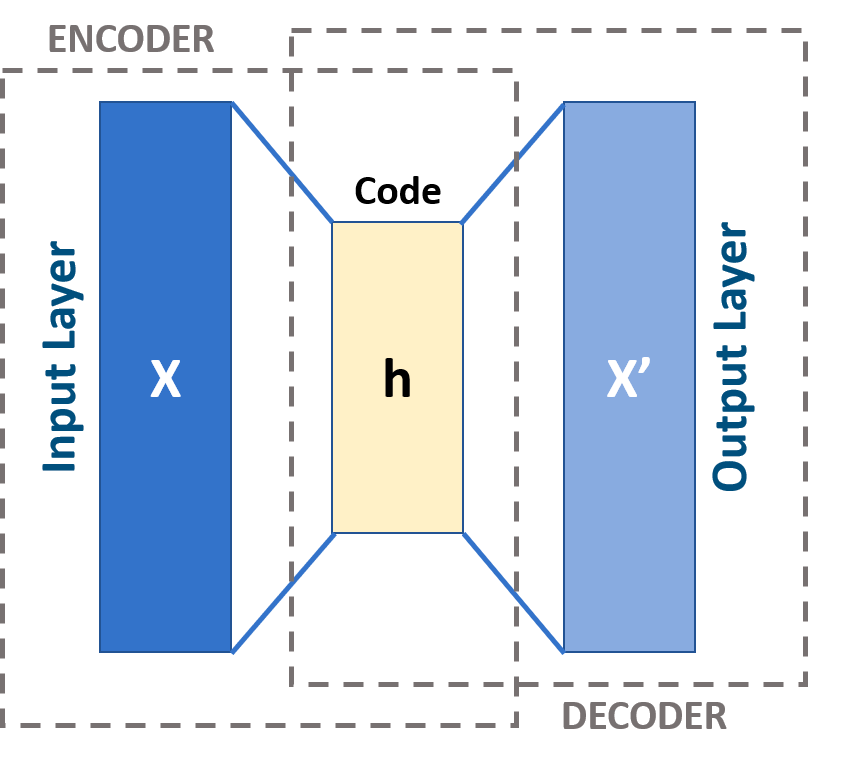

**Generative models** in machine learning are capable of looking at a set of data points (e.g. images), capturing some
inner structure in them and producing new data points (e.g. new images), which bear the properties of the training data set.

Since its inception in the late 2013 **Variational Autoencoder (VAE)** has become one of two most popular 
generative models for producing photorealistic images. A popular alternative is called Generative Adversarial Networks (GANs),
they are beyond the scope of this post.

To understand the ideas behind VAE, first we need to understand regular **autoencoders**. To understand motivation for
both regular autoencoders and VAE, we need some background in information theory. For understanding VAE we will 
also cover some background in Bayesian machine learning.

## Information theory: entropy, mutual information and KL-divergence

In 1940-1950 information theorists such as Claude Shannon posed a set of problems, related to finding the most economical
ways of data transmission.

Suppose that you have a signal (e.g. long text in English), and you need to transmit it through a channel (e.g. wire) with a severely limited
bandwidth. It would be beneficial to compress this signal, using some kind of encoding, before transfering it through the
wire, so that we make as good use of our data transfer channel, as possible. The receiving side should decompress the 
signal after receiving it.

**Encoder-decoder architecture.** Uncompressed data are passed on input, they are encoded into a compressed representation, which is transferred through the transmission channel (e.g. wire), and decoded by the decoder on the receiving side.

Suppose that you encode each letter of your alphabet with a sequence of 0s and 1s. What is the optimal way 
to encode each the letters? 

It is intuitive that if you encode frequent letters with the shortest sequences and non-frequent letters with remaining
(longer) sequences, you'll get an optimal encoding. Consider the following example of an alphabet and an optimal encoding:

Letter   | Letter code | Frequency | Length of letter code |
|--------|-------------|-----------|-----------------------|
| A      |   0         |    0.5    |            1          |
| B      |   10        |    0.25   |            2          |
| C      |   110       |    0.125  |            3          |
| D      |   111       |    0.125  |            3          |

Observe that the length of the code of letter $A$ equals to $-\log_2 p(A)$.

If your alphabet has a distribution $p$, e.g. $p(A) = 0.5$, the optimal encoding of your signal would achieve the minimal
length of average text, if $H(p) = \sum \limits_i p_i \log p_i = \mathbb{E} (-\log p) \to \min$. 

$H(p)$ is called **entropy**, as previously this function was introduced in physical chemistry by Ludwig Boltzmann to 
describe a different process.

Now, if you use an encoding with a different distribution of letter codes $q$ to transfer your signal, this encoding 
would be sub-optimal, as average length of a letter would be $\sum \limits_i p_i \log q_i$.

The difference in length between the optimal encoding and sub-optimal encoding is then 
$D(p, q) = - \sum \limits_i p_i \log q_i - (-\sum \limits_i p_i \log p_i) = - \sum \limits_i p_i \frac{ \log q_i }{ \log p_i }$.

This quantity is called **Kullback-Liebler divergence**, and for encoding to be optimal it should be minimal. As entropy
$H(p) = \sum \limits_i p_i \log p_i$ does not depend on $q$, it would suffice to optimize $H(p,q) = \sum \limits_i p_i \log p_i$,
this quantity is known as **Cross entropy**.

## Autoencoders

Inspired by information theory, machine learning practitioners employed the concept of **Autoencoders**.

To the best of my knowledge first publication of autoencoders or autoassociative neural networks was made by Mark Kramer
in 1991, where autoencoders were seen as a non-linear dimensionality reduction tool, a non-linear analogue of PCA.

The logic of autoencoder is to train such encoder $\mathcal{E}_{\phi}$ and decoder $\mathcal{D}_{\theta}$ neural networks
that encoder can compress the high-dimensional input data $x$ to a low-dimensional latent representation $z$ (or $h$ on
the image below) and then the decoder is able to reconstruct $\hat{x}$ (or $x'$ on the image below) accurately enough from 
this latent representation.

**Autoencoder neural network**.

This approach was re-used much later, circa 2010, by Yoshua Bengio group. They figured out autoencoders can be used for
other purposes, such as denoising.

**Desoising autoencoder (DAE)**. Suppose that you had a dataset of hand-written
digits (MNIST). Each digit's image is corrupted with white noise and then passed to a Denoising Autoencoder. The purpose
of the DAE is to recover the original image as accurately as possible.

Moreover, Bengio borrowed the idea of stacking individual encoders/decoders from Hinton's RBMs and this approach 
gave rise to stacked denoising autoencoders and, eventually, Diffusion models, but that's a topic for another day.

##  Variational autoencoder (VAE)

VAE, devised by Max Welling group in the late 2013, has arguably become the most wide-spread flavour of autoencoders.
It is formulated in Bayesian terms. 

The idea of this approach starts from the information theory perspective: we want to train such an encoder neural network 
$\mathcal{E}_{\phi}$ with parameters $\phi$ that the Kullback-Liebler divergence between the input image $\bf x$ and its 
latent representation $\bf z$ is minimized: $KL({\bf x}, {\bf z}) \to min$.

This principle is also known as Infomax and was borrowed by Bengio and, later, Welling teams from one of the flavours of 
Independent Component Analysis (ICA).

Computationally VAE minimizes the divergence using stochastic gradient descent. However, as we'll see later using
a regular neural network training approach does not get the job done, as normal gradient estimator has a very high 
variance and does not converge computationally (we'll see this in a moment).

Hence, training VAE employs a specific computational technique, called doubly-stochastic gradient descent and a special
trick, called re-parametrization trick, which we will explore later.

But first we need to understand the language, in which VAE is described, as it is a Bayesian model, and we will have to 
cover a lot of background in Bayesian ML.

**All hail our lord and saviour Bayes...** (meh, just kidding)

### Bayes formula

To explain the Bayesian framework, employed by VAE, we have to start with Bayes formula:

$\underbrace{ p(z | x) }_\text{posterior} = \frac{ \overbrace{ p(x | z)}^\text{evidence} \cdot \overbrace{p(z)}^{prior} }{ \underbrace{ p(x) }_\text{evidence} }$

In case of VAE the notation is as follows:

* we have a dataset of images $X = \{ {\bf x^{(i)}} \}$ 
* each input image is denoted $\bf x^{(i)}$
* its latent representation, which is generated by VAE's encoder half, is denoted $\bf z^{(i)}$
* the weights of encoder network $\mathcal{E}$ are denoted $\phi$; Kingma and Welling call them **variational parameters**
* the weights of decoder network $\mathcal{D}$ are denoted $\theta$; Kingma and Welling call them **generative parameters**

The authors of VAE, D. Kingma and M. Welling, assume that there exists some prior distribution of latent parameters $p({\bf z})$, from which latent 
representation of each data point is sampled. For each image ${\bf x}$ we maximize the posterior $p_{\phi}(z|x)$.

### Variational inference

Direct calculation of posterior $p({\bf z} | {\bf x})$ using Bayes formula is impossible, as we need to calculate the probability of evidence $p(x)$, 
for which the integral $p({\bf x}) = \int p({\bf x} | {\bf z}) p({\bf z}) d {\bf z}$ is intractable (i.e. it is not 
possible to calculate it analytically or computationally in practice).

So we need to come up with a practical way of overcoming this obstacle. 

Typically Bayesians have two solutions for problems like this: one solution is Markov Chain Monte Carlo methods. In this
particular case MCMC estimator is time-consuming and gradient, calculated with it, has a high variance, so the model 
fails to converge.

An alternative approach is Variational Inference approach, which we explain here.

**Variational inference.** Variational inference aims to approximate the true variational posterior $p({\bf z}|{\bf x})$ with the best approximation $q^*({\bf z})$ from a certain class of functions $Q$. This optimization process minimizes the Kullback-Liebler divergence between the approximation $q({\bf z})$ and true posterior $p({\bf z}|{\bf x})$. Image taken from [Gregory Gundersen blog post](https://gregorygundersen.com/blog/2019/11/10/em/) on Variational Inference.

In variational inference we choose a class of functions $Q$, from which we will try to pick an approximation $q({\bf z})$ 
(called **guide**) of the posterior $p({\bf z} | {\bf x})$, such that Kullback-Liebler divergence between this approximation and true
posterior is minimal.

### ELBO maximization

Now, we need to come up with a technical way to find this optimal guide $q({\bf z})$ numerically.

Out of blue sky we consider $\log p(x)$. Let us do 2 tricks with it, first represent it as an integral, and then split it into 2 terms:

$\log p({\bf x}) = \int q({\bf z}) \log{p(x)} d{\bf z} = \int q({\bf z}) \log \frac{p({\bf x}, {\bf z})}{p({\bf z} | {\bf x})} d {\bf z} = \int q({\bf z}) \log \frac{p({\bf x}, {\bf z}) q({\bf z})}{p( {\bf z} | {\bf x} ) q({\bf z})} d{\bf z} = $

$ = \int q({\bf z}) \log \frac{p({\bf x}, {\bf z})}{q({\bf z})} d{\bf z} + \int q({\bf z}) \log \frac{q({\bf z})}{p({\bf z} | {\bf x})}  d {\bf z} = \mathcal{L}(q({\bf z})) + KL(q({\bf z}) \Vert p({\bf z} | {\bf x}))$.

Now we see that log-evidence $\log p({\bf x})$ consists of two non-negative terms. Let us interpret them: 

$\log p({\bf x}) = \underbrace{ \mathcal{L}(q({\bf z})) }_\text{ELBO - Evidence lower bound} + KL(q({\bf z}) \Vert p({\bf z} | {\bf x}))$

The first term is called **Evidence Lower BOund (ELBO)**. The second term is our cost function $KL(q({\bf z}) \Vert p({\bf z} | {\bf x}))$, 
which Variational Inference aims to minimize. As log-evidence $\log p({\bf x})$ is fixed, the greater ELBO gets, the closer in terms of 
KL divergence guide $q({\bf z})$ approximates the posterior $p({\bf z} | {\bf x})$:

$KL \ge 0 \Rightarrow KL(q({\bf z}) \Vert p({\bf z} | {\bf x})) \to \min \Leftrightarrow \mathcal{L}(q({\bf z})) \to \max$

Hence, to find the optimal guide $q({\bf z})$, in practice we have to maximize ELBO. Let us break it down further:

$\mathcal{L}(q({\bf z})) = \int q({\bf z}) \log \frac{p({\bf x}, {\bf z})}{q({\bf z})} d{\bf z} = \int q({\bf z}) \log \frac{ p({\bf x}|{\bf z}) p({\bf z}) }{q({\bf z})} d{\bf z} = $

$= \int q({\bf z}) \log p({\bf x}, {\bf z}) d{\bf z} + \int q({\bf z}) \log \frac{ p({\bf z}) }{q({\bf z})} d{\bf z} = \underbrace{ \mathbb{E}_{ q({\bf z}) } \log p({\bf x}|{\bf z}) }_\text{Expected log-likelihood} - \underbrace{ KL(q({\bf z}) \Vert p({\bf z}))}_\text{Regulariser term KL-divergence}$

We see that our loss function consists of 2 terms. The first term characterizes the quality of reconstruction. The second
term is a regularizer term that requires that our guide stays relatively close to the prior $p({\bf z})$, which is 
usually chosen to be Gaussian.

### Re-parametrization trick

Unlike the normal convolutional neural networks, VAE makes use of **doubly stochastic gradient descent**. Input images
are the first source of stochasticity in VAE. 

But there is also a second source: in case of VAE the latent representation $\bf z$ is not just a deterministic 
low-dimensional vector like in normal autoencoders. Instead, it is a random variable (usually, multivariate gaussian),
whose mean $\bf \mu$ and variance $\bf sigma$ the model aims to learn. 

So the mean and variance of $\bf z$ are deterministic, but then for each data point in the training batch we sample a
random point from that distribution, introducing some extra noise.

**Re-parametrization trick**. In VAE our latent representation $\bf z$ is a vector-valued random variable, not just a deterministic vector. In order to keep the doubly stochastic gradient differentiable, we keep distribution mean and variance deterministic (on this image they and other weights of encoder are incorporated into $\phi$ parameter), but inject randomness through a random variable $\epsilon$

Why doing so?

There are 3 reasons, all technical.

First, as I mentioned previously, it is a practical way to achieve a gradient 
estimator that would actually converge. MCMC gradient estimator, used normally, would have too big of a variance, and
fails to train in practice.

Second, we need the distribution parameters $\bf mu$ and $\bf \sigma$ to be differentiable in order to learn them via
error backpropagation. Randomness wouldn't be differentiable, but a random variable, sampled from a distribution, is.

Third, the data points in the training set might not cover the whole latent space. Randomness helps to partially 
mitigate the issue of presernce of holes in the latent space.

## Problems and improvements of VAE

### Holes in the latent space

There are a number of issues with VAE. 

One of the obvious problems is the fact that training data points oftentimes do not cover the whole latent space, 
and even smoothening $\bf z$ through randomness does not cure this problem entirely. In the worst-case scenario
theoretically VAE could just map all the data points to a straight line, effectively enumerating them.

So, if we use VAE decoder for generation of images and sample a point in latent space, which belongs to a hole, 
we won't get a valid output.

Another issue is the fact that output images, generated by VAE decoder, are oftentimes blurred. 

**VAE-generated blurred faces.**

How to explain this phenomenon? Consider latent space of a VAE, trained to recognized MNIST digits:

**Latent space of VAE, trained to recognize MNIST handwritten digits.**

Some classes (e.g. fours and nines) intersect with each other. If you sample a point from latent space, where both fours
and nines are frequent, VAE would basically produce a superposition of nine and four. This results in such a
blurry image.

So, there are plenty of issue left with regularization of the latent space of VAE. There are millions of improvements of
VAE that address these and other issues, such as denoising VAE (DVAE), vector quantization VAE (VQ-VAE) and tons of 
others, which I won't cover here.

## References:

### Autoencoders:
* https://en.wikipedia.org/wiki/Autoencoder - wikipedia on Autoencoder
* https://www.jmlr.org/papers/volume11/vincent10a/vincent10a.pdf - stacked denoising autoencoders by Y.Bengio group
* https://www.researchgate.net/profile/Abir_Alobaid/post/To_learn_a_probability_density_function_by_using_neural_network_can_we_first_estimate_density_using_nonparametric_methods_then_train_the_network/attachment/59d6450279197b80779a031e/AS:451263696510979@1484601057779/download/NL+PCA+by+using+ANN.pdf
* https://cedar.buffalo.edu/~srihari/CSE676/14.2%20Denoising%20Autoencoders.pdf - presentation on denoising autoencoders
* https://www.researchgate.net/publication/272086159_Static_hand_gesture_recognition_using_stacked_Denoising_Sparse_Autoencoders
* https://arxiv.org/pdf/1511.06406.pdf - denoising VAE (DVAE) by Y. Bengio et al.

### Bayesian ML, VAE and variants:
* https://www.stats.ox.ac.uk/~teh/research/compstats/WelTeh2011a.pdf - Bayesian Learning in Stochastic Gradient Langevin Dynamics by M.Welling, Y.W.Teh
* https://gregorygundersen.com/blog/2021/04/16/variational-inference/ - Gregory Gundersen on Variational Inference (VI)
* https://gregorygundersen.com/blog/2019/11/10/em/ - Gregory Gunderson on Variational EM
* https://towardsdatascience.com/difference-between-autoencoder-ae-and-variational-autoencoder-vae-ed7be1c038f2 - blog post by Aqeel Anwar on VAE with good images 
* https://chrischoy.github.io/research/Expectation-Maximization-and-Variational-Inference/ - blog post on VI and Variational EM
* https://www.youtube.com/watch?v=xH1mBw3tb_c - 2019 lecture by D. Vetrov on variational inference
* https://arxiv.org/pdf/1312.6114.pdf - VAE paper by D. Kingma and M. Welling
* https://www.youtube.com/watch?v=9zKuYvjFFS8 - video on AE and VAEs
* https://arxiv.org/pdf/1606.05328.pdf - pixelCNN encoder paper
* https://arxiv.org/pdf/1711.00937.pdf - VQ-VAE paper
* https://arxiv.org/pdf/2110.03318.pdf - on detecting holes in VAE latent space
* https://pyro.ai/examples/svi_part_i.html - implementations of Stochastic VI, VAE etc. in Pyro library
* https://ai.stackexchange.com/questions/8885/why-is-the-variational-auto-encoders-output-blurred-while-gans-output-is-crisp - on blurred outputs of VAE