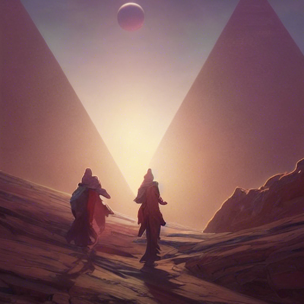
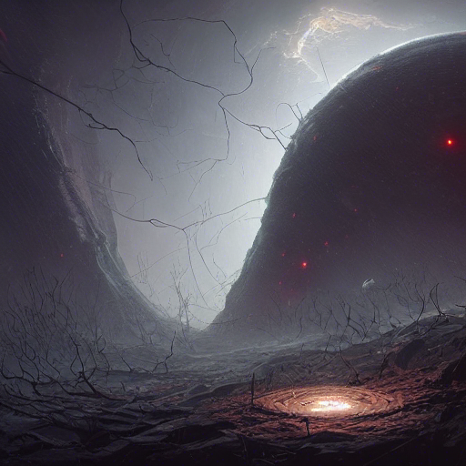
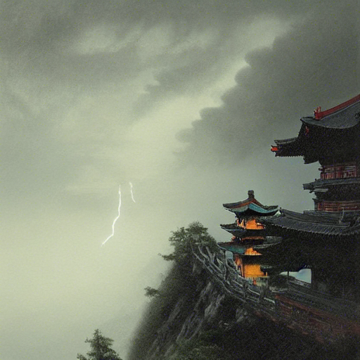

## Encoder-decoder architecture

Stable Diffusion model has an encoder-decoder architecture at its core. This approach was popularized in the ancient times of Information Theory.

Suppose that you have a signal (e.g. long text in English) and you need to transmit it through a channel (e.g. wire) with a severely limited
bandwidth. Hence, it would be beneficial to compress this signal, using some kind of encoding, transfer the compressed signal,
and then decompress it on the receiving side. Entropy coding, such as Huffman coding, was described in these terms.

**Encoder-decoder architecture.** High-dimensional data (e.g. image, text or sound) come on input, they are encoded into a low-dimensional latent representation, which is decoded by the decoder back into high-dimensional representation, which is meant to be exactly or approximately equal to the input high-dimensional data.

Information theory implies that the optimal encoding is achieved, when mutual information between the input data $\bf x$
and its encoding (latent representation) is maximal, or, when Kullback-Liebler divergence 
$KL({\bf x}, {\bf z}) = \sum \limits_i p({\bf x_i}) \log p({\bf z_i})$ is minimal.

This approach was later employed by machine learning practitioners to convert high-dimensional data, such as images, texts
and sound to low-dimensional latent representation (typically, 128-256-dimensional, as [Johnson-Lindenstrauss lemma](/2021-09-10-1/) implies that this number of
dimensions is sufficient to preserve the distances between data points).

In ML case we often assume that the essence of the input signal is condensed to a low-dimensional embedding
vector. Moreover, those latent vectors often allow for arithmetics.

**Latent space arithmetics**. If we represented the words
'king' and 'queen' with data points in a 128-dimensional latent space, we can perform arithmetics 
on them. 'king' - 'queen' vector is the same as 'man' - 'woman' vector. Hence, specific notions, such as
'female' or 'royal' can be represented as vectors.

The class of ML models, which compress the high-dimensional input signal to latent space data point, and then recover them
as close to the original as possible, are called **autoencoders**. Autoencoder models, based on convolutional neural networks, became especially popular for working with visual information, 
such as images.

An important aspect of encoder-decoder models is the fact that they can often be used as **generative** models. I.e. if
you come up with some reasonable data point in the latent space, you can throw away encoder, just pass that data point
to the decoder and generate some high-dimensional data (image).

**Transformers** are another popular class of encoder-decoder models, proved to be efficient in processing
natural languages/sound, such as texts or sounds.

Interestingly, you can mix different encoders of one data type (e.g. transformer encoders, processing text into latent
representation) with decoders, producing other data type (e.g. autoencoders, receiving a latent vector and producing
images). That's how you get a model that receives text query and produces an image. 

Stable Diffusion is an advanced model of this class. Its encoder is a transformer network (like GPT or BERT) and its 
decoder is a variation of a convolutional **Variational Autoencoder (VAE)**. It also incorprorates a number of performance
improvements over the regular VAE-based models, which I will discuss later. Let us start with dicsussing the regular VAE.

## Diffusion kernel, diffusion maps

TODO

## Diffusion models

TODO

## Stable diffusion

TODO

## Bonus: a few examples of generated images

I generated some covers for XXI century sci-fi classics. Could you name them?

 

## References:
* https://arxiv.org/pdf/2112.10752.pdf - original Stable Diffusion paper by Rombach et al.
* https://en.wikipedia.org/wiki/Diffusion_map - diffusion maps
* https://stackdiary.com/stable-diffusion-resources/ - stable diffusion resources