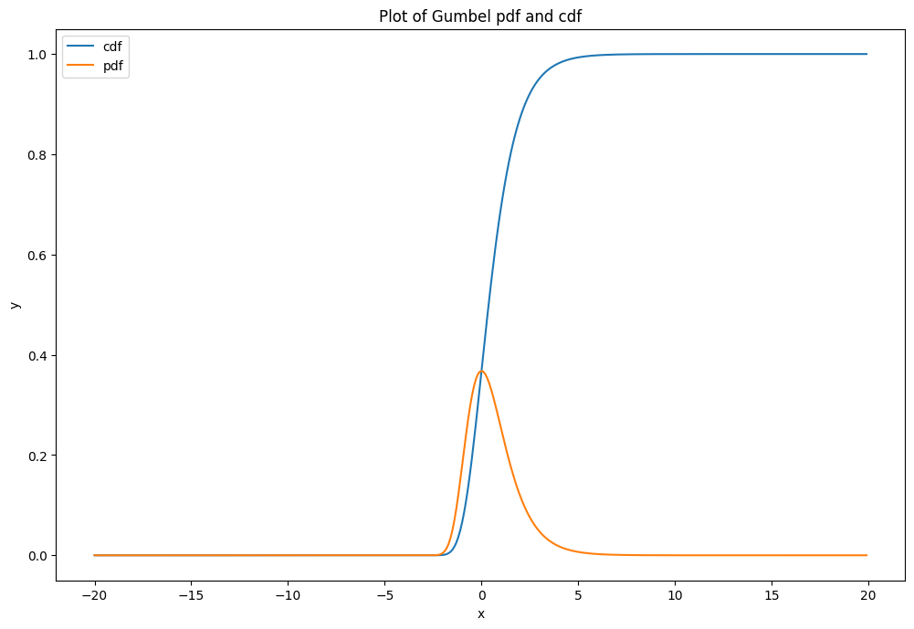
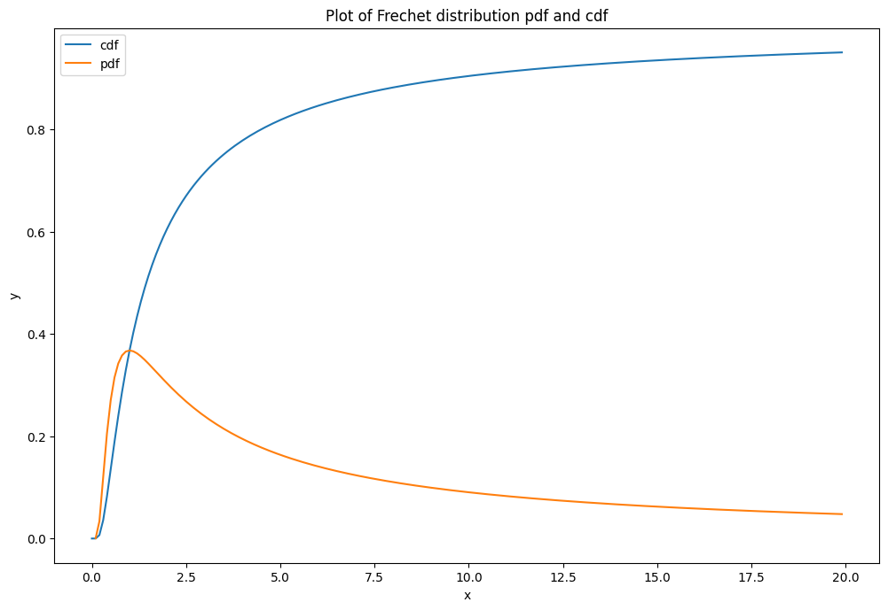
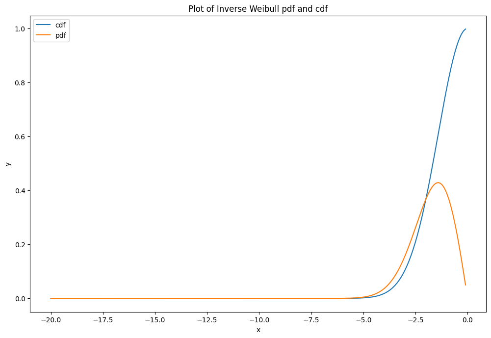
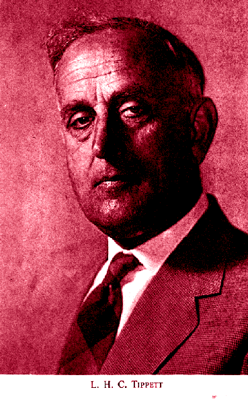
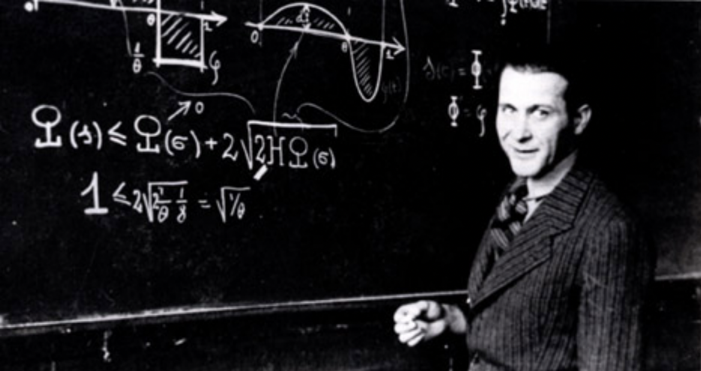
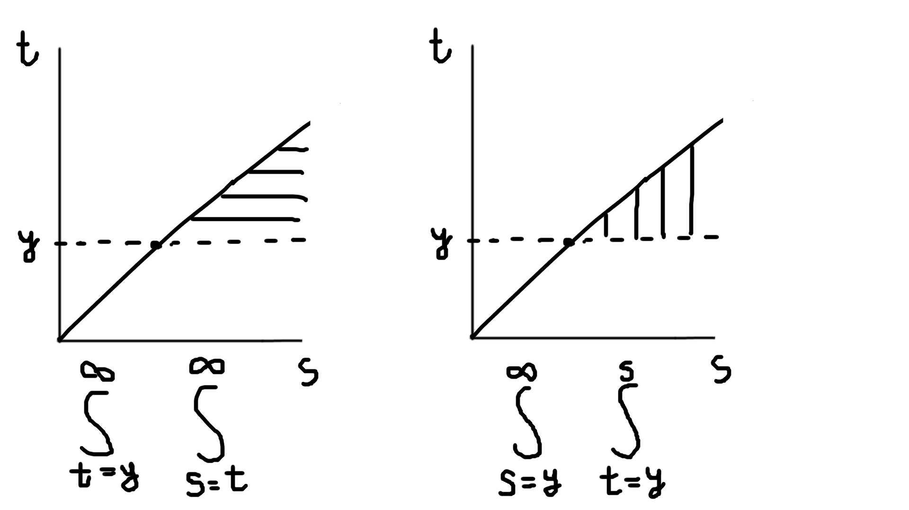
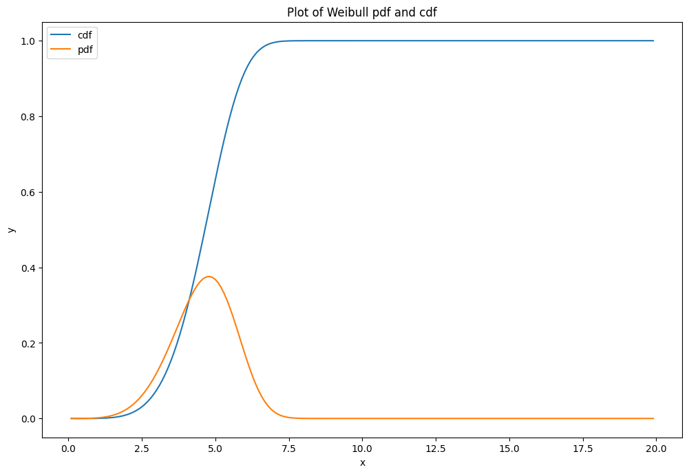

## Contents:

1. Problem statement and Generalized Extreme Value distribution
    * Type I: Gumbel distribution
    * Type II: Frechet distribution
    * Type III: Inverse Weibull distribution
2. Fisher-Tippett-Gnedenko theorem
    * General approach: max-stable distributions as invariants/fixed points/attractors and EVD types as equivalence classes
    * Khinchin's theorem (Law of Convergence of Types)
    * Necessary conditions of maximium stability
    * Fisher-Tippett-Gnedenko theorem (Extreme Value Theorem)
    * Distributions not in domains of attraction of any maximum-stable distributions
3. Von Mises sufficient conditions for a distribution to belong to a type I, II or III
    * Pre-requisites from survival analysis
    * Von Mises conditions proof
    * Generalizations of von Mises condition for Type I EVD: auxiliary function and von Mises function
4. Necessary and sufficient conditions for a distribution to belong to a type I, II or III
    * Pre-requisites from Karamata's theory of slow/regular/extended regular variation
    * Necessary and sufficient conditions of convergence to Types II or III EVD
    * Necessary and sufficient conditions of convergence to Type I EVD
5. Summary and examples of practical application
    * Examples of Type I Gumbel distribution
    * Examples of Type II Frechet distribution
    * Examples of Type III Inverse Weibull distribution
6. Concluding remarks
   

## 1. Problem statement and Generalized Extreme Value distribution

One of the most famous results in probabilities is Central Limit Theorem, which claims that sum of $n \to \infty$ i.i.d. random variables $\xi_i$
after centering and normalizing converges to Gaussian distribution.

Now, what if we ask a similar question about maximum of those $n \to \infty$ i.i.d. random variables instead of sum? Does it converge to any distribution?

Turns out that it depends on the properties of the distribution $\xi_i$, but not much really. Regardless of the distribution
of $\xi_i$ the distribution of maximum of $n$ random variables $\xi_i$ is:

$G_{\gamma}(x) = exp(-(1 + \gamma x)^{-\frac{1}{\gamma}})$

This distribution is called **Generalized Extreme Value Distribution**. Depending on the coefficient $\gamma$ it can take
one of three specific forms:

#### Type I: Gumbel distribution

If $\gamma \to 0$, we can assume that $k = \frac{1}{\gamma} \to \infty$. Then generalized EVD converges to a
doubly-exponential distribution (sometimes this is called a law of double logarithm) by definition of $e = (1 + \frac{1}{k})^k$ and $e^x = (1 + \frac{1}{k}x)^k$:

$G_{\gamma}(x) = exp(-(1 + \gamma x)^{-\frac{1}{\gamma}}) = exp(-(1 + \frac{1}{k} x)^{-k}) = exp(-e^{-x})$.

This is Gumbel distribution, it oftentimes occurs in various areas, e.g. bioinformatics, describing the distribution
of longest series of successes in coin tosses in $n$ experiments of tossing a coin 100 times.

It is often parametrized by scale and center parameters. I will keep it centered here, but will add shape parameter $\lambda$:

$F(x) = e^{-e^{-\frac{x}{\lambda}}}$, or, in a more intuitive notation $F(x) = \frac{1}{\sqrt[e^{x/\lambda}]{e}}$.

It is straightforward to derive probability density function $f(x)$ from here:

$f(x) = \frac{\partial F}{\partial x} = -e^{-\frac{x}{\lambda}} \cdot (-\frac{1}{\lambda}) \cdot e^{-e^{-\frac{x}{\lambda}}} = \frac{1}{\lambda} e^{- \frac{x}{\lambda} + e^{-\frac{x}{\lambda}}}$.

```python
import math

import numpy as np
import matplotlib.pyplot as plt


scale = 1

# Generate x values from 0.1 to 20 with a step size of 0.1
x = np.arange(-20, 20, 0.1)

# Calculate y values
gumbel_cdf = math.e**(-math.e**(-(x/scale)))
gumbel_pdf = (1 / scale) * np.exp(-( x/scale + math.e**(-(x / scale))))

# Create the figure and axis objects
fig, ax = plt.subplots(figsize=(12,8), dpi=100)

# Plot cdf
ax.plot(x, gumbel_cdf, label='cdf')

# Plot pdf
ax.plot(x, gumbel_pdf, label='pdf')

# Set up the legend
ax.legend()

# Set up the labels and title
ax.set_xlabel('x')
ax.set_ylabel('y')
ax.set_title('Plot of Gumbel pdf and cdf')

# Display the plot
plt.show()
```

<center>**Gumbel distribution plot**, scale = 1.</center>

#### Type II: Frechet distribution

If $\gamma > 0$, let us denote $k = \frac{1}{\gamma}$ (k > 0), $y = \lambda \cdot (1 + \gamma x)$, where $k$ is called 
shape parameter and $\lambda$ - scale parameter. Then distribution takes the shape:

$G_{\gamma}(x) = exp(-(1 + \gamma x)^{-\frac{1}{\gamma}}) = exp(-(\frac{y}{\lambda})^{-k})$.

To make it more intuitive, I'll re-write cdf in the following way: $F(x) = \frac{1}{e^{(\frac{\lambda}{x})^k}}$.

This is Frechet distribution. It arises when the tails of the original cumulative distribution function 
$F_{\xi}(x)$ are heavy, e.g. when it is Pareto distribution.

Let us derive the probability density function for it:

$f(x) = \frac{\partial F}{\partial x} = - (\frac{x}{\lambda})^{-k - 1} \cdot (-k) \cdot \frac{1}{\lambda} \cdot e^{-(\frac{x}{\lambda})^{-k}} = \frac{k}{\lambda} \cdot (\frac{x}{\lambda})^{-k-1} \cdot e^{-(\frac{x}{\lambda})^{-k} }$.

Here is the plot:

```python
import math

import numpy as np
import matplotlib.pyplot as plt


shape = 2  # alpha
scale = 2  # beta

# Generate x values from 0.1 to 20 with a step size of 0.1
x = np.arange(0, 20, 0.1)

# Calculate y values
frechet_cdf = math.e**(-(scale / x) ** shape)
frechet_pdf = (shape / scale) * ((scale / x) ** (shape + 1)) * np.exp(-((scale / x) ** shape))

# Create the figure and axis objects
fig, ax = plt.subplots(figsize=(12,8), dpi=100)

# Plot cdf
ax.plot(x, frechet_cdf, label='cdf')

# Plot pdf
ax.plot(x, frechet_pdf, label='pdf')

# Set up the legend
ax.legend()

# Set up the labels and title
ax.set_xlabel('x')
ax.set_ylabel('y')
ax.set_title('Plot of Frechet distribution pdf and cdf')

# Display the plot
plt.show()
```

<center>**Frechet distribution plot**, scale = 1, shape = 1.</center>

#### Type III: Inverse Weibull distribution

If $\gamma < 0$, let us denote $k = -\frac{1}{\gamma}$ (k > 0, different kinds of behaviour are observed at $0 < k < 1$, $k = 1$ and $k > 1$), $y = \lambda (1 + \gamma x)$.

Then distribution takes the shape:

$G_{\gamma}(x) = exp(-(1 + \gamma x)^{-\frac{1}{\gamma}}) = exp(-(\frac{y}{\lambda})^k)$.

$G_{\gamma}(x) = \begin{cases} exp(-(\frac{x}{\lambda})^{k}), x \le 0 \\ 1, x > 0 \end{cases}$.

This is Inverse Weibull distribution. Its direct counterpart (Weibull distribution) often occurs in 
[survival analysis](http://localhost:8000/2021-06-11-1/) as a hazard rate function. It also arises in mining - there it 
describes the mass distribution of particles of size $x$ and is closely connected to Pareto distribution. We shall 
discuss this connection later.

Generalized extreme value distribution converges to Inverse Weibull, when distribution of our random variable $\xi$ is bounded.
E.g. consider uniform distribution $\xi \sim U(0, 1)$. It is clear that the maximum of $n$ uniformly distributed
variables will be approaching 1 as $n \to \infty$. Turns out that the convergence rate is described by Inverse Weibull 
distribution.

To make it more intuitive, we can re-write the cdf as $F(x) = \begin{cases} \frac{1}{e^{ (\frac{-x}{\lambda})^k }}, x \le 0 \\ 1, x > 0 \end{cases}$.

Derive from cumulative distribution function $F(x) = exp(-(\frac{-x}{\lambda})^{k})$ the probability density function:

$f(x) = \frac{\partial F}{\partial x} = -(\frac{-x}{\lambda})^{k-1} \cdot \frac{-k}{\lambda} \cdot exp(-(\frac{-x}{\lambda})^{k}) = \frac{k}{\lambda} \cdot (\frac{-x}{\lambda})^{k-1} \cdot exp(-(\frac{-x}{\lambda})^{k})$.

Let us draw the plot:

```python
import math

import numpy as np
import matplotlib.pyplot as plt


shape = 2  # alpha
scale = 2  # beta

# Generate x values from 0.1 to 20 with a step size of 0.1
x = np.arange(-20, 0, 0.1)

# Calculate y values
inverse_weibull_cdf = math.e**(-(-x/scale) ** shape)
inverse_weibull_pdf = (shape / scale) * ((-x / scale) ** (shape - 1)) * np.exp(-((-x / scale) ** shape))

# Create the figure and axis objects
fig, ax = plt.subplots(figsize=(12,8), dpi=100)

# Plot cdf
ax.plot(x, inverse_weibull_cdf, label='cdf')

# Plot pdf
ax.plot(x, inverse_weibull_pdf, label='pdf')

# Set up the legend
ax.legend()

# Set up the labels and title
ax.set_xlabel('x')
ax.set_ylabel('y')
ax.set_title('Plot of Inverse Weibull pdf and cdf')

# Display the plot
plt.show()
```
<center>**Plot of Inverse Weibull distribution**, shape = 2, scale = 2.</center>


---

## 2. Fisher-Tippett-Gnedenko theorem

Extreme Value Theorem is a series of theorems, proven in the first half of 20-th century. They claim that
maximum of several tosses of i.i.d. random variables converges to just one of 3 possible distributions,
Gumbel, Frechet or Weibull.

Here I will lay out the outline of the proof with my comments. The proof includes introduction of several
technical tools, but I will comment on their function and rationale behind each of them.

Consider a random variable $M_n$, which describes the distribution of maximum of $\xi_i$, $i \in 1..n$

$p(M_n \le x) = \prod \limits_{i=1}^{n} p(\xi_i \le x) = F^n(\xi_i \le x)$.

Similarly to the Central Limit Theorem, a convergence theorem might be applicable to the distribution of a 
normalized random variable $M_n$ rather than the non-normalized:

$p(\frac{M_n - b_n}{a_n} \le x) = p(M_n \le a_n x + b_n) = F^n(a_n x + b_n)$

We aim to show that for some series of constants $a_i$ and $b_i$ 

$F^n(a_n x + b_n)$ as $n \to \infty$ converges in distribution to some distribution $G(x)$: $F^n(a_n x + b_n) \xrightarrow[n \to \infty]{w} G(x)$.

Now I will informally describe the proof outline, before introducing the mathematical formalism.

### General approach: max-stable distributions as invariants/fixed points/attractors and EVD types as equivalence classes

I assume that all three types of Extreme Value Distribution were first discovered experimentally. Later statisticians 
came up with a proof that EVD can converge to just one of three possible types of distributions and no other types of 
EVD can exist. Finally, they came up with criteria for a distribution to belong to each type.

Design of this proof is similar to many other proofs. I will outline it informally here:

Assume that as the number of random variables $n \to \infty$ increases, approaching infinity, the distribution of the 
observed maximum approaches some type of distribution. Then such a distribution type can be considered as an invariant 
or attractor or fixed point, similar to many other mathematical problems. For instance, eigenvectors are fixed points 
of matrix multiplication. E.g. matrix eigenvector, multiplied by a matrix, results in itself, multiplied by a scalar. Or
no matter how many times you take a derivative of $e^{kx}$, you get $e^{kx}$, multiplied by a scalar $k$. 

Similarly, **maximum-stable distributions** are invariant objects. Those are distributions, maximum of i.i.d. variables 
of which converges to themselves, no matter how many more i.i.d. random variables you toss. E.g. if for one 
Gumbel-distributed random variable $\xi$ we know that $p_{\xi}(\frac{M_1 - b_1}{a_1} \le x) = e^{-e^{-x}}$, for $n \to \infty$ 
Gumbel-distributed random variables the maximum of $\xi_1.. \xi_n$ still is Gumbel-distributed (after centering and 
normalizing them by some numbers $a_n$, $b_n$): $p_{M_{n}}(\frac{M_n - b_n}{a_n} \le x) = e^{-e^{-x}}$.

Ok. Then after we established that there are some distributions, for which maximum of $n \to \infty$ centered and normalized 
i.i.d. variables produces a random variable with the same distribution, how do we show that all distributions converge
to one of them?

We'll use another classical mathematical tool: **equivalence classes** and **equivalence relation**. For instance,
odd numbers and even numbers form two equivalence classes under operation of modulo 2. Odd numbers are equivalent to
each other in terms of producing remainder 1 (e.g. $3 \sim 5$, where $\sim$ is equivalence relation of modulo 2), and even 
numbers are equivalent in terms of producing remainder 0.

Similarly, we will show that types of EVD form equivalence classes under the operation of finding maximum of $n \to \infty$
i.i.d. random variables with any distribution, and as a result all the distributions converge to one of those types. E.g.
Pareto's distribution is equivalent to Cauchy distribution under equivalence relation of convergence of maximum of 
$n \to \infty$ Pareto/Cauchy i.i.d's to the same maximum stable type II (Frechet) EVD.

Now that I've laid out the plan of the proof, it is time to get into technicalities. I will formally introduce the concepts
I mentioned above and prove some lemmas about their relatedness.

#### Definition 2.1: Max-stable cumulative distribution function

$G$ is max-stable if for all $n \in 1..N$  and for all x there exists $\{a_n\}, \{b_n\} \subset \mathbb{R}^+$ such that for all 
$x \in \mathbb{R}$ $G(x) = G_n(a_n x + b_n)$.

#### Definition 2.2: Domain of attraction

If $F$ is a cdf, then $F$ is in the domain of attraction (for maxima) of $G$, and it is written $F \in \mathcal{D}(G)$, 
when there exist sequences $\{a_n\}, \{b_n\} \subset \mathbb{R}^+$ such that $F^n (a_n x + b_n) \xrightarrow[n \to \infty]{w} G(x)$.

#### Definition 2.3: Type of convergence

If $G^*(x)$ is another non-degenerate cdf, we say that $G$ and $G^*$ have the same type if for all $x$ there exist 
$a > 0$ and $b \in R$ such that for every x ∈ R $G^*(ax + b) = G(x)$.

### Khinchin's theorem (Law of Convergence of Types)

<center>**Aleksandr Yakovlevich Khinchin**</center>

#### Lemma 2.1: Khinchin's theorem (law of Convergence of Types)

Suppose that we have a sequence of distribution functions $\{F_n\}$ (e.g. the distributions of maximum of random variable $\xi_i$ in $n$ experiments).

Let those distribution functions upon $n \to \infty$ converge to a certain distribution $G(x)$: $F_n(a_n x + b_n) \xrightarrow[n \to \infty]{w} G(x)$. Then we have two series of constants $\{a_n\}, \{b_n\}$.

Suppose there is another distribution function $H(x)$ such that the sequence of distributions $F_n(\alpha_n x + \beta_n)$ converges to that function: $F_n(\alpha_n x + \beta_n) \xrightarrow[n \to \infty]{w} H(x)$ and there is a different pair of series $\{ \alpha_n \}, \{\beta_n \}$.

Then $H(x) = G(Ax + B)$ and $A = \frac{\alpha_n}{a_n}$, $B = \frac{\beta_n - b_n}{a_n}$.

#### Proof:

Consider two distribution functions $G(x)$ and $H(x)$, such that for every $x$: $y = F(ax+b)$ and $y = F(\alpha x + \beta)$.

Denote $y = F(ax + b) \to G(x)$. Then $F^{-1}(y) = ax + b$ and $x = \frac{F^{-1}(y) - b}{a} \to G^{-1}(y)$.

Similarly $y = F(\alpha x + \beta) \to H(x)$ and $F^{-1}(y) = \alpha x + \beta$ and $x = \frac{F^{-1}(y) - \beta}{\alpha} \to H^{-1}(y)$.

Now choose two points: $x_1$, corresponding to $y_1$, and $x_2$, corresponding to $y_2$ and subtract $x_1$ and $x_2$ from each other:

$x_1 - x_2 = \frac{F^{-1}(y_1) - F^{-1}(y_2)}{a} \to G^{-1}(y_1) - G^{-1}(y_2)$

Apply the same for $H^{-1}$:

$x_1 - x_2 = \frac{F^{-1}(y_1) - F^{-1}(y_2)}{\alpha} \to H^{-1}(y_1) - H^{-1}(y_2)$

Which results in $\frac{G^{-1}(y_1) - G^{-1}(y_2)}{H^{-1}(y_1) - H^{-1}(y_2)} \to \frac{\alpha}{a} = A$.

Substitute $\alpha = A \cdot a$ into $H^{-1}(y) \to x = \frac{F^{-1}(y) - \beta}{A \cdot a}$ and $A \cdot H^{-1}(y) \to A \cdot x = \frac{F^{-1}(y) - \beta}{a}$.

On the other hand we recall that $G^{-1}(y) \to x = \frac{F^{-1}(y) - b}{a}$. Subtracting these, we get: $A \cdot H^{-1}(y) - G^{-1}(y) \to \frac{F^{-1}(y) - \beta}{a} - \frac{F^{-1}(y) - b}{a} = \frac{b - \beta}{a}$ or $\frac{\beta - b}{a} = B \to G^{-1}(y) - A \cdot H^{-1}(y)$.

Hence, $G^{-1}(y) \to A \cdot H^{-1}(y) + B$.

#### Lemma 2.2: Necessary condition of maximum-stability

Given G a non-degenerate cdf:

1. G is max-stable if and only if there exists a sequence $\{F_n\}$ of cdf ’s and sequences
$\{a_n\} \subset \mathbb{R}^+$, $\{b_n\}$ such that for all $k \in N$ $F_n(a_{nk} x + b_{nk}) \xrightarrow[n \to \infty]{w} G^{1/k}(x)$

2. $\mathcal{D}(G) \neq 0$ if and only if $G$ is max-stable. In that case, $G \in \mathcal{D}(G)$.

#### Proof: 

##### Proposition 1 direct statement: if $G$ is max-stable, there exists $\{F_n\}$ such that ...

If $G$ is max-stable, then by definition for every $n \in \mathbb{N}$ there exist $a_n$, $b_n$, such that $G^{n}(a_n x + b_n) = G(x)$.

Define $F_n = G^n$. Then $F^k_n(a_{nk} x + b_{nk}) = G^{nk}(a_{nk} x + b_{nk}) = G$. We arrive at the direct statement.

##### Proposition 1 reverse statement: if $G$ is max-stable, there exists $\{F_n\}$ such that ... 

Let us proof the reverse statement: suppose that the sequences $\{F^n\}$, $\{a_n\}$, $\{b_n\}$ exist, such that for all $k \in \mathbb{N}$:

$F_n(a_{nk}x + b_{nk}) \xrightarrow[n \to \infty]{w} G^{1/k}(x)$

Then consider $k=1$ and $k=2$:

$F_n(a_{n}x + b_{n}) \xrightarrow[n \to \infty]{w} G(x)$ and $F_n(a_{2n}x + b_{2n}) \xrightarrow[n \to \infty]{w} G^{1/2}(x)$

By Khinchin's lemma there exists $G(\alpha_2 x+ \beta_2) = G^{1/2}(x)$. 

Similarly, for every other $k$: $G(\alpha_k x + \beta_k) = G^{1/k}(x)$ or $G^k(\alpha_k x + \beta_k) = G(x)$, which is the 
definition of max-stability.

##### Proposition 2 direct statement: 

The proof is self-evident: if G is max-stable, $G^n(a_n x + b_n) = G(x)$, and $G \in \mathcal{D}(G)$ by defintion.

##### Proposition 2 reverse statement: 

Assume $F \in \mathcal{D}(G)$, i.e. $F^n (a_n x + b_n) \xrightarrow[n \to \infty]{w} G(x)$.

For all $k \in \mathbb{N}$ we have $F^{nk} (a_{nk} x + b_{nk}) \xrightarrow[n \to \infty]{w} G(x)$.

Hence, $F^{n} (a_{nk} x + b_{nk}) \xrightarrow[n \to \infty]{w} G^{1/k}(x)$

This makes $G$ and $G^k$ fit for the conditions of previous result, proving that $G$ is max-stable.

#### Corollary 2.1:

Let $G$ be a max-stable cdf. Then there exist functions $a(s) > 0$ and $b(s)$ such that for all $x \in \mathbb{R}$, for all $s > 0$, 
$G^s(a(s)x + b(s)) = G(x)$.

Corollary is self-evident from inversion of indices $s = \frac{1}{k}$.

### Fisher-Tippett-Gnedenko theorem (Extreme Value Theorem)

Sir Ronald Aylmer Fisher                |  Leonard Henry Caleb Tippett         |    Boris Vladimirovich Gnedenko
:--------------------------------------:|:------------------------------------:|:---------------------------------------:
                   |               |    

#### Theorem 2.1: Fisher-Tippett-Gnedenko theorem (Extreme Value Theorem)

Let $\xi_i$ be a sequence of i.i.d. random variables.

If there exist constants $a_n > 0$, $b_n \in \mathbb{R}$ and some
non-degenerate cumulative distribution function $G$ such that $\frac{M_n - b_n}{a_n} \sim G$, then $G$ is one of these:

(Type I) Gumbel: $G(x) = exp(-e^{-x})$, $x \in \mathbb{R}$,

(Type II) Frechet: $G(x) = exp(-x^{-\alpha})$, $x \ge 0, \alpha > 0$,

(Type III) Inverse Weibull: $G(x) = exp(-(-x)^{\alpha})$, $x \le 0, \alpha > 0$.

#### Proof

Here we give the proof of Fisher-Tippett-Gnedenko theorem without introducing any additional pre-requisites and 
intermediate constructs. Because of that it might look like black magic now. It is not clear, how anyone could've come
up with this proof.

However, later on in parts 3 and 4 we will give the definitions of tail quantile function and tools from Karamata's
theory of slow/regular variation.

If you revisit this proof afterwards, you will notice that we're making use of those tools, without naming them explicitly.

##### Step 1.

Consider double negative logarithm of max-stable distribution $G(a(s)x + b(s))^s = G(x)$.

$-\ln(-\ln(G(a(s)x + b(s))^{s})) = -\ln( -s \cdot \ln(G(a(s)x + b(s)))) = -\ln(-\ln(G(a(s)x + b(s)))) - \ln s = -\ln(-\ln G(x))$

##### Step 2.

Denote $\phi(x) = -\ln(-\ln(G(x)))$. Then from previous $\phi(a(s)x + b(s)) - \ln s = \phi(x)$.

##### Step 3. 

Denote $y = \phi(x)$. Apply $\phi^{-1}$ to both sides. We get: $\phi^{-1}(\phi(a(s)x + b(s))) = y + \ln s$.

$a(s)x + b(s) = \phi^{-1}(y + \ln s)$

$a(s) \phi^{-1}(y) + b(s) = \phi^{-1}(y + \ln s)$

$\phi^{-1}(y) = \frac{\phi^{-1}(y + \ln s) - b(s)}{a(s)}$

##### Step 4. 

Note that $\phi^{-1}(0) = \frac{\phi^{-1}(\ln s) - b(s)}{a(s)}$. Subtract $\phi^{-1}(0)$ from both sides:

$\phi^{-1}(y) - \phi^{-1}(0) = \frac{\phi^{-1}(y + \ln s) - b(s)}{a(s)} - \frac{\phi^{-1}(\ln s) - b(s)}{a(s)} = \frac{\phi^{-1}(y + \ln s) - \phi^{-1}(\ln s)}{a(s)}$

##### Step 5.

Substitute variables: $\psi^{-1}(y) = \phi^{-1}(y) - \phi^{-1}(0)$, $z = \ln s$, $\tilde a(z) = a(e^z)$. Then:

$\psi^{-1}(y) = \phi^{-1}(y) - \phi^{-1}(0) = \frac{\phi^{-1}(y + \ln s) - \phi^{-1}(\ln s)}{a(s)} = \frac{\psi^{-1}(y + z) - \psi^{-1}(z)}{\tilde a(z)}$

$\psi^{-1}(y + z) - \psi^{-1}(z) = \psi^{-1}(y) \tilde a(z)$

##### Step 6.

We can swap $y$ and $z$ in previous equation, settings $y = z$ and $z = y$:

$\psi^{-1}(y + z) - \psi^{-1}(y) = \psi^{-1}(z) \tilde a(y)$

After that subtract $\psi^{-1}(y + z) - \psi^{-1}(z) = \psi^{-1}(y) \tilde a(z)$ from $\psi^{-1}(y + z) - \psi^{-1}(y) = \psi^{-1}(z) \tilde a(y)$:

$\psi^{-1}(z) - \psi^{-1}(y) = \psi^{-1}(z) \tilde a(y) - \psi^{-1}(y) \tilde a(z)$

$\psi^{-1}(z) (1 - \tilde a(y)) = \psi^{-1}(y) (1 - \tilde a(z))$

Here we consider two cases.

##### Step 7a.

If $\tilde{a}(z) = 1$, previous equation leads us to $0 = 0$. But then let's substitute $\tilde{a}(z) = 1$ into the result of step 5:

$\psi^{-1}(y + z) = \psi^{-1}(y) + \psi^{-1}(z)$

This means that $\psi^{-1}(y) = \rho y$ and denoting $\nu = \phi^{-1}(0)$, we get:

$\rho y = \psi^{-1}(y) = \phi^{-1}(y) - \phi^{-1}(0) = \phi^{-1}(y) - \nu$

$\phi^{-1}(y) = \nu + \rho y$

$x = \phi^{-1}(\phi(x)) = \nu + \rho \ln(-\ln(-G(x)))$

$G(x) = exp(-e^{-\frac{x - \nu}{\rho}})$, which is Gumbel (Type I) EVD.

##### Step 7b.

If $\tilde{a}(z) \ne 1$: 

$\psi^{-1}(y) = \frac{ \psi^{-1}(z) }{ (1 - \tilde a(z)) } (1 - \tilde a(y)) = c (1 - \tilde a(y))$

Now recall that $\psi^{-1}(y + z) - \psi^{-1}(z) = \psi^{-1}(y) \tilde a(z)$ and substitute $\psi^{-1}(y) = c (1 - \tilde a(y))$ there:

$c (1 - \tilde{a}(y + z)) - c (1 - \tilde{a}(y)) = c (1 - \tilde{a}(y)) \tilde a(z)$

This leads us to equation $\tilde{a}(z + y) = \tilde{a}(y) \tilde{a}(z)$, which, upon monotonous $\tilde{a}(y)$ has a
solution $\tilde{a}(y) = e^{\rho y}$. Hence:

$\psi^{-1}(y) = c (1 - e^{\rho y}) = \phi^{-1}(y) - \phi^{-1}(0)$

$\phi^{-1}(y) = \nu + c (1 - e^{\rho y})$, where $\nu = \phi^{-1}(0)$.

Now recall that $\phi(x) = -\ln(-\ln(G(x)))$, and we get: $x = \phi^{-1}(\phi(x)) = \nu + c (1 - e^{-\rho \ln(-\ln(G(x)))})$. Hence: 

$\frac{x - \nu}{c} = 1 - (-\ln G(x))^{-\rho}$ 

$(-\ln G(x))^{-\rho} = 1 - \frac{x - \nu}{c}$

$-\ln G(x) = (1 - \frac{x - \nu}{c})^{-\frac{1}{\rho}}$

$G(x) = e^{-(1 - \frac{x - \nu}{c})^{-\frac{1}{\rho}}}$, which is either a Frechet (Type II), or a Inverse Weibull (Type III) EVD.

### Distributions not in domains of attraction of any maximum-stable distributions

We've shown that if maximum of n i.i.d. random variables of current distribution converge to any maximum-stable 
distribution, it is one of the 3 described types. However, maximum might not converge to any max-stable distribution
at all.

For instance, Poisson distribution and Geometric distribution do not converge to any type of Extreme Value Distriubtion.
To show this we will need much more tools in our toolbox, the corresponding theorem will be proven in the end of
section 4.

---

## 3. Von Mises sufficient conditions for a distribution to belong to a type I, II or III

<center>**Richard von Mises**</center>

The Fisher-Tippett-Gnedenko theorem is an important theoretical result, but it does not provide an answer to the basic
question: what type of EVD does our distribution function $F$ belong to?

Fortunately, there are two sets of criteria that let us determine the domain of attraction of $F$. First, there are
von Mises conditions, which are sufficient, but not necessary. Still, they are more intuitive and give a good insight
into what kinds of distributions converge to what types of EVD and why. Second, there are general sufficient and 
necessary conditions. Proving them is a much more technical task and requires some extra preliminaries.

We will start with von Mises conditions, postulated by Richard von Mises in 1936, 7 years before Fisher-Tippett-Gnedenko
theorem was proved by Boris Gnedenko in 1943. Von Mises conditions are formulated in terms of survival analysis. We shall 
introduce some basic notions from survival analysis first.

### Pre-requisites from survival analysis

#### Definition 3.1: Survival function

**Survival function** $S(t)$ is reverse of cumulative distribution function $F(t)$: $S(t) = 1 - F(t)$.

Basically, if our random variable's value represents a human longevity, cumulative distribution funcion
$F(t) = p(\xi \le t) = \int \limits_{-\infty}^{t} f(x) dx$ represents the fraction of people, who die by the time $t$.

Survival function $S(t) = p(\xi \ge t) = 1 - p(\xi \le t) = 1 - F(t)$ on the contrary is the fraction of people, who 
are still alive by the time $t$.

#### Proposition 3.1: integral of survival function equals to average life expectancy

Basically rotate survival function plot by 90 degrees to see that it is expectation of lifetime 
(just swap x and y axes and it becomes obvious).

#### Definition 3.2: Survival function end point

We shall denote the **end point** of survival function $x_F = \sup \{ x; F(x) < 1\}$. It is also sometimes denoted $\omega(F)$.

Basically, $x_F$ is the smallest point $x$, where survival function $S(x)$ becomes exactly 0. For instance, if we're 
studying the survival of human, and there are known survivors at the age of $128$, but everybody dies by the age of 129 years, $x_F = 129$.

If there is no such limit (e.g. the population dies out exponentially $S(x) = e^{-x}$ or 
polynomially $S(x) = \frac{1}{x}$), we say that $x_F = \infty$.

#### Definition 3.3: Tail quantile function

**Tail quantile function** of $n$ is the smallest time $t$, when the fraction of survivors becomes smaller than $n$:

$\gamma(n) = \inf \{ t; F(t) \le 1 - \frac{1}{n} \} = \inf \{ t; S(t) \ge \frac{1}{n} \}$

For instance, tail quantile function of 10 is the time, when 1/10 of population is still alive.

#### Lemma 3.1: convergence of tail quantile function to exponent

Consider a sequence $\{ x_n \}$ of data points, such that each $x_n \to t_n$ as $n \to \infty$, where $\{t_n\}$ are the 
values of tail quantile function at $\frac{\tau}{n}$:

$\gamma(\frac{\tau}{n}) = \inf \{t_n; S(t_n) \ge \frac{\tau}{n} \}$

Then $p(M_n \le x_n) \to e^{-\tau}$.

#### Proof:

$(1 - p(M_n \le x_n))^n = (1 - F(t_n))^n = S(t_n)^n = (1 - \frac{\tau}{n})^n  = e^{-\tau}$ (last equality by definition of exponent)

#### Definition 3.4: Hazard rate

**Hazard rate** $r(t)$ in the same context of survival analysis is your chance of dying at the time $t$. 

Basically, what's your chances to die at 64, if you're an average person? It is the number of
people, who died aged 64, to number of people, who survived by 64. In mathematical terms it is the ratio of 
probability density function to survival function:

$r(t) = \frac{f(t)}{1 - F(t)} = \frac{f(t)}{S(t)}$

#### Definition 3.5: Cumulative hazard rate

**Cumulative hazard rate** $R(t) = \int \limits_{x=-\infty}^{t} r(x) dx$ is integral of hazard rate over some period of time.

Cumulative hazard rate is basically the number of times you avoided death by now. Suppose you're a train robber in the 
Wild West. At your first robbery your chance of being killed (hazard rate) is $1/2$. Then you get more experienced
and at the second and third times your hazard rate is $1/3$ and $1/4$. If you survived 3 robberies, your cumulative hazard
rate equals $1/2 + 1/3 + 1/4$. Basically, you "deserved" more than 1 death by now and are lucky to still be alive.

#### Proposition 3.1. Cumulative hazard rate relation to survival function

$R(t) = \int \limits_{-\infty}^{t} \frac{f(x)}{1 - F(x)} dx = - \int \limits_{-\infty}^{t} \frac{1}{1 - F(x)} d(1 - F(x)) = -\ln(1 - F(t)) = -\ln S(t)$.


### Von Mises conditions proofs

#### Theorem 3.1: Von Mises sufficient condition for a distribution to belong to type II (Frechet) EVD

If a distribution function $F_{\xi}$ has an infinite end point $x_F = \infty$ and 
$\lim \limits_{t \to \infty} r_{\xi}(t) \cdot t = \alpha$, then distribution $F_{\xi}$ belongs to type II (Frechet) EVD.

#### Proof:

Speaking informally, what we aim to show is that if hazard rate function $r_{\xi}(t)$ basically behaves as a hyperbolic function $\frac{\alpha}{t}$
as $t \to \infty$ (i.e. has a fat tail, decreasing much slower that $e^{-x}$), the corresponding cumulative distribution function $F_{\xi} \in \mathcal{D}(Frechet)$ is in the domain
of attraction $\mathcal{D}(Frechet)$ of Frechet (type II) EVD. 

I will drop indices $\xi$ under $r_{\xi}(t)$, $F_{\xi}(t)$ and $S_{\xi}(t)$ and will just write $r(t), F(t), S(t)$ in
context of our random variable $\xi$ in question.

We start the proof by recalling the connection between the cumulative hazard rate function $R(t)$ and survival function $S(x)$:

$-R(t) = -\int \limits_{x_1}^{x_2} r(t) dt = \ln S(x_2) - \ln S(x_1)$

Exponentiation of both sides gets us:

$e^{-{\int \limits_{x_1}^{x_2} r(t) dt}} = \frac{S(x_2)}{S(x_1)}$

Recalling that $r(t) \to \frac{\alpha}{t}$ upon $t \to \infty$ by the conditions of the theorem and $-\int \limits_{x_1}^{x_2} r(t)dt \to - \int \limits_{x_1}^{x_2} \frac{\alpha}{t} dt = - \alpha \cdot (\ln x_2 - \ln x_1)$:

$e^{-\alpha \cdot (\ln x_2 - \ln x_1)} = \frac{S(x_2)}{S(x_1)}$

Now take $x_1 = \gamma(n)$ (i.e. such a point in time, where survival function $S(x_1) = S(\gamma(n)) = 1/n$, we just experessed this 
through the tail quantile function $\gamma(n)$) and $x_2 = x \cdot x_1 = x \cdot \gamma(n)$ and substitute it into the previous line:

$e^{-\alpha \cdot (\ln (x \cdot \gamma(n)) - \ln \gamma(n))} = \frac{S(x \gamma(n))}{S(\gamma(n))}$

$e^{-\alpha \cdot (\ln x + \ln \gamma(n) - \ln \gamma(n))} = \frac{S(x \gamma(n))}{\frac{1}{n}}$

$e^{(\ln x)^{-\alpha}} = n S(x \gamma(n))$

$\frac{ x^{-\alpha} } { n }  = S(x \gamma(n)) = 1 - F(x \gamma(n))$ and $F(x \gamma(n)) = 1 - \frac{ x^{-\alpha} }{n}$

In other words $p(\xi_i \le x \gamma(n)) = 1 - \frac{ x^{-\alpha} }{n}$ or $p(\max \xi_i \le x \gamma(n)) = (1 - \frac{ x^{-\alpha} }{n})^n = e^{-x^{-\alpha}}$ or $p(\max \frac{\xi_i}{ \gamma(n) } \le x ) = (1 - \frac{ x^{-\alpha} }{n})^n = e^{-x^{-\alpha}}$.

We've just shown that a random variable $a_n \xi + b_n$ converges to Frechet Type II EVD, where $a_n = \gamma(n)$ and $b_n = 0$.

#### Theorem 3.2: Von Mises sufficient condition for a distribution to belong to type III (Inverse Weibull) EVD

If a distribution function $F_{\xi}$ has a finite end point $x_F \le \infty$ and $\lim \limits_{x \to x_F} (x_F - x) r(x) = \alpha$,
then distribution $F_{\xi}$ belongs to type III (Inverse Weibull).

#### Proof:

If our original random variable $\xi$ had a finite upper end $x_F$, let us consider a derived random 
variable $\eta = \frac{1}{x_F - \xi}$.

$\eta$ approaches $+\infty$ as $\xi$ approaches upper end $x_F$ and approached $0+$ as $\xi$ approaches $-\infty$.

Let us look at the connection between c.d.f.s of $\eta$ and $\xi$:

$F_{\eta}(x) = p(\eta \le x) = p(\frac{1}{x_F - \xi} \le x) = p(\frac{1}{x} \le (x_F - \xi)) = p(\xi \le x_F - \frac{1}{x}) = F_{\xi}( x_F - \frac{1}{x} )$.

Basically, with $\eta$ we created a mapping of $\xi$ onto a $\{0, +\infty\}$ domain. Suppose that random variable $\eta$
fits the conditions of Theorem 3.1:

$\frac{x F'_{\eta}(x)}{ 1 - F_{\eta}(x) } = \frac{x F'_{\xi}(x_F - \frac{1}{x}) \frac{1}{x^2} }{1 - F_{\xi}(x_F - \frac{1}{x})} \xrightarrow{x \to \infty} \alpha$ 

Denote $y = x_F - \frac{1}{x}$, note that $\frac{1}{x} = x_F - y$ and substitute this into the previous result:

$\frac{ (x_F -y) \cdot F'_{\xi}(y) }{1 - F_{\xi}(y)}$

We came to the expression in the conditions of our theorem exactly, hence, $ \frac{ (x_F - y) \cdot F'_{\xi}(y) }{1 - F_{\xi}(y)} \xrightarrow{y \to x_F} \alpha$.

I.e. if and only if the conditions of this theorem are satisfied, $\eta$ is in the domain of attraction of Type II.

#### Theorem 3.3: Von Mises sufficient condition for a distribution to belong to type I (Gumbel) EVD

If a distribution function $F_{\xi}$ has a finite or infinite end point $x_F \le \infty$,
then distribution $F_{\xi}$ belongs to the domain of attraction of Type I (Gumbel) EVD if derivative of the hazard 
rate approaches zero $r'(u) = 0$ as $u \to x_F$ and hazard rate approaches a positive constant $r(u) \xrightarrow{u \to x_F} const$. 

Speaking informally, distribution of maximum converges to Gumbel, if the chances of death reach a 
plateau as $u \to x_F$.

**NOTE:** I've seen ~5 different formulations and proofs of this von Mises condition. This version lacks generality (I'll
discuss generalizations later in this post), but is the easier to understand in my opinion. In this proof I am loosely following the logic
of [Smith and Weissman](https://rls.sites.oasis.unc.edu/s834-2020/ExtremeValues.pdf). 

**NOTE:** You may run into a popular synonymous formulation of this theorem e.g. in [Leadbetter](https://scask.ru/k_book_eps.php) or 
[Resnick](https://minerva.it.manchester.ac.uk/~saralees/book3.pdf) textbooks.
They claim that distribution of maximum converges to Gumbel distribution if $Q(x) =\frac{F''(x)(1 - F(x))}{(F'(x))^2} \xrightarrow{x \to x_F} -1$.

This is an equivalent condition to $r'(x) \xrightarrow{x \to x_F} 0$ because:

$r'(x) = (\frac{F'(x)}{1 - F(x)})' = F''(x) \frac{1}{1 - F(x)} + F'(x) \frac{F'(x)}{(1 - F(x))^2} = \frac{F''(x) (1 - F(x)) + (F'(x))^2}{(1 - F(x))^2}$

Multiply this by $\frac{(1 - F(x))^2}{(F'(x))^2}$ and we come to $r'(x) \cdot \frac{(1 - F(x))^2}{(F'(x))^2} = Q(x) + 1$, 
which implies that if $r'(x) \to 0$ iff $Q(x) \to -1$, meaning that two formulations of the theorem are synonymous.

#### Proof:

##### Step 1

We shall start the proof from the end to motivate our mathematical manipulations.

In Steps 2+ we are going to show that von Mises condition entails that $\frac{S(u + x g(u))}{S(u)} = e^{-x}$ as $u \to x_F$, 
where $g(u) = \frac{1}{r(u)}$ is the inverse of hazard rate (if introduction of this new entity $g(u)$ feels redundant to you now, I agree, but trust 
me on this for now, it will be justified later). Assume this fact proven for now and let's see how the result 
of the theorem follows.

As before we are going to use the tail quantile function $\gamma(n)$ to show that this ratio of survival
functions converges to Gumbel distribution. Take $u = \gamma(n) \to x_F$ and substitute it into the ratio:

$\frac{S(\gamma(n) + x g(\gamma(n)))}{S(\gamma(n))} = \frac{S(\gamma(n) + x g(\gamma(n)))}{\frac{1}{n}} = n S(\gamma(n) + x f(\gamma(n))) = e^{-x}$. 

Hence, $S(\gamma(n) + x g(\gamma(n))) = 1 - F(\gamma(n) + x g(\gamma(n))) = \frac{e^{-x}}{n}$, 

$F(\gamma(n) + x g(\gamma(n))) = 1 - \frac{e^{-x}}{n}$ and 

$F^n(\gamma(n) + x g(\gamma(n))) = (1 - \frac{e^{-x}}{n})^n = e^{-e^{-x}}$.

Thus, $p(M_n \le \gamma(n) + x g(\gamma(n))) = p(\frac{M_n - \gamma(n)}{g(\gamma(n))} \le x) = F^n(\gamma(n) + x g(\gamma(n))) = e^{-e^{-x}}$, leading us to the desired result, Gumbel distribution.

##### Step 2

Having motivated our interest in the ratio $\frac{S(u + x g(u))}{S(u)}$ in step 1, let us connect it to hazard rate
and start showing the fact that this ratio converges to $e^{-x}$ as $u \to x_F$.

Recall the connection between cumulative hazard function $R(u)$, hazard rate $r(t)$ and survival function $S(u)$: 

$R(u) = \int \limits_{-\infty}^{u} r(t) dt = \overbrace{\cancel{\ln S(-\infty)}}^{=0} - \ln S(u)$

Hence, $\ln S(u + x g(u)) - \ln S(u) = \int \limits_{-\infty}^{u} \frac{1}{g(t)} dt - \int \limits_{-\infty}^{u + x g(u)} \frac{1}{g(t)} dt = - \int \limits_{u}^{u + x g(u)} \frac{1}{g(t)} dt$ and

$\frac{S(u + x g(u))}{S(u)} = e^{- \int \limits_{u}^{u + x g(u)} \frac{1}{g(t)} dt}$

##### Step 3

We need to show that $e^{- \int \limits_{u}^{u + x g(u)} \frac{1}{g(t)} dt} \xrightarrow{u \to x_F} e^{-x}$ and, hence, $\int \limits_{u}^{u + x g(u)} \frac{1}{g(t)} dt \xrightarrow{u \to x_F} x$.

Perform a variable substitution $s = \frac{t - u}{g(u)}$, $t = u + s g(u)$:

$\int \limits_{t=u}^{t = u + x g(u)} \frac{1}{g(t)} dt = \int \limits_{s=\frac{u-u}{f(u)}=0}^{s=\frac{u + x g(u) - u}{g(u)}=x} \frac{1}{g(u + s g(u))} d(u + s g(u)) = \int \limits_{s=0}^{x} \frac{g(u)}{g(u + s g(u))} ds$

We need to show that integrand $\frac{g(u)}{g(u + s g(u))}$ uniformly converges to $1$ as $u \to x_F$ in order to show that integral 
approximately equals $x$ because then $\int \limits_{0}^{x} \frac{g(u)}{g(u + s g(u))} ds \to \int \limits_{0}^{x} 1 ds = x$.

Uniform convergence implies that we can choose an arbitrarily small tolerance $\epsilon$, so that there would exist some
point $u_{\epsilon}$, such that for every value of $s$ inequality $| \frac{g(u)}{g(u + s g(u))} - 1 | \le \epsilon$ holds
for every point $u$, such that $u_{\epsilon} \le u \le x_F$, and, hence, 
$|\int \limits_{0}^{x} \frac{g(u)}{g(u + s g(u))} ds - \int \limits_{0}^{x} 1 ds| \le \epsilon x$. 

##### Step 4

We need to work out the approximation of $\frac{g(u)}{g(u + s g(u))}$ ratio.

For that end consider the Taylor series for $g(u + s g(u))$ around the point $u$:

$g(u + s g(u)) = g(u) + g'(u) s g(u) + O(s^2 g^2(u))$ and $g(u) \to const$, hence, $g(u + s g(u)) = g(u) + g'(u) s g(u) + O(s^2)$

Then $\frac{g(u + s g(u))}{g(u)} = 1 + g'(u) s + O(s^2)$. Assuming $x$ and, hence, $x$ small enough, we assume $O(s^2)$
can be made arbitrarily small.

Inverting numerator and denominator, we get $\frac{g(u)}{g(u + s g(u))} = \frac{1}{1 + s g'(u)}$

Integrating both sides: $\int \limits_{0}^{x} \frac{g(u)}{g(u + s g(u))} ds = \int \limits_{0}^{x} \frac{1}{1 + s g'(u)} ds = \int \limits_{0}^{x} \frac{1}{g'(u)} d \ln(1 + s g'(u)) = \ln(1 + x g'(u))^{\frac{1}{g'(u)}}$

Re-write this as $\ln(1 + \frac{x}{ 1/g'(u) })^{1/g'(u)}$. This looks familiar, right?

Denote $n = \frac{1}{g'(u)} \to \infty$ as $g'(u) \to 0$. We get $\ln (1 + \frac{x}{n})^n = \ln e^x = x$. This concludes the proof.

### Generalizations of Theorem 3.3: auxiliary function and von Mises function

As I said, there are multiple alternative formulations and proofs of von Mises conditions. Some use more generic notions
of **auxiliary function** and **von Mises function**.

The general necessary and sufficient conditions in the next part of this post generalize these two notions. Hence, it
makes sense to discuss them here.

#### Definition 3.5: Auxiliary function

In the previous proof we denoted the inverse hazard rate as $g(x) = \frac{1}{r(x)}$. This quantity $g(x)$,
which is called **auxiliary funcion**, is defined in the context of the ratio $\frac{S(u + x g(u))}{S(u)}$ and is chosen 
in such a way that $\frac{S(u + x g(u))}{S(u)} \xrightarrow{u \to x_F} e^{-x}$.

However, turns out that it is not uniquely defined. We can come up with other definitions of $g(x)$ and convergence to 
Gumbel EVD would still hold.

To motivate other choices of auxiliary function let us discuss the interpretation of this ratio of survival functions. 
We can treat it as a conditional probability. The denominator represents the fraction of population that survived by the 
time $u$ close to the maximum lifespan. The numerator is the probability to survive for a (bit) longer period of 
time $x g(u)$, where auxiliary function $g(u)$ can be seen as some kind of normalization constant.

Then our ratio can be interpreted as conditional probability $p( \frac{\xi - u}{g(u)} > x | \xi > u)$. Basically it is
the chance to live $x g(u)$ years longer among those who already survived $u$ years.

Consider a different popular choice of auxiliary function: $g(x) = \frac{\int \limits_{t}^{x_F} S(x) dx }{ S(t) }$. What
interpretation can we give to it?

Recall that the integral of survival function is average lifespan. Hence, $\frac{\int \limits_{t}^{x_F} S(x) dx }{ S(t) }$ 
is conditional expectation of longevity among those, who survived by the moment of time $t$: the denominator 
is the fraction of survivors by $t$, while the numerator is the average life expectancy of these survivors after moment 
of time $t$.

#### Definition 3.6: von Mises function

Our proof is based on the fact that $S(x) = e^{-\int \limits_{-\infty}^{x} r(u) du}$. 

However, it would hold if we could represent the survival function as 
$S(x) = c e^{-\int \limits_{-\infty}^{x} \frac{1}{f(u)} du}$ with any auxiliary function $f$, not 
necessarily $f(u) = \frac{1}{r(u)}$.

Hence, a survival function is called a **von Mises function**, if it can be represented as 
$S(x) = c e^{-\int \limits_{z_0}^{x} \frac{1}{f(u)} du}$, where $f(u) > 0$ is an absolutely continuous auxiliary function
with density $f'(u)$, such that $\lim \limits_{u \to x_0} f'(u) = 0$ and $z_0 < u < x_0$ (basically, $z_0$ is a lower
end point which does not have to be $-\infty$ or 0).

---

## 4. Necessary and sufficient conditions for a distribution to belong to a type I, II or III

Now that we've introduced von Mises conditions, it is quite easy to slightly alter them in order to show that
their modified versions are not only sufficient, but also necessary.

In order to do that we have to rely on mathematical apparatus of slowly varying functions and their extensions,
developed by [a Serbian/Yugoslavian mathematician Jovan Karamata](https://encyclopediaofmath.org/index.php?title=Karamata_theory&oldid=25937) in 1930s. Using Karamata theorems we can relatively 
easily prove that generalizations of von Mises conditions are not only sufficient, but necessary.

<center>**Jovan Karamata**</center>

### Pre-requisites from Karamata's theory of slow/regular/extended regular variation

Here we'll introduce the concepts of slow-varying function and regularly varying function from Karamata theory, which
allow us to prove the necessary and sufficient conditions for Types II and III.

They also serve as a foundation for the concept of extended variation, which enables the proof of the sufficient
conditions for Type I. 

#### Definition 4.1: Slow-varying function

**Slow-varying function** $l(x)$ is such a function that $\lim \limits_{t \to \infty} \frac{l(xt)}{l(t)} = 1$ for any $x > 0$.

#### Example 4.1: logarithm is a slow-varying function

$\ln x$ is a slowly varying function because $\lim \limits_{t \to \infty} \frac{\ln (xt)}{\ln (t)} = \frac{\ln x + \ln t}{\ln t} = \frac{\ln x}{\ln t} + 1 \to 1$

#### Definition 4.2: Regularly-varying function

**Regularly-varying function** $h(x)$ of index $\gamma$ is such a function that $\lim \limits_{t \to \infty} \frac{h(xt)}{h(t)} = x^{\beta}$ for any $x > 0$,
where $\beta$ is a real number, sometimes called **exponent of variation** or **index of variation**.

Regularly-varying function is basically just a generalization of slow-varying function.

Later on we will show that if the survival function of our distribution in question is regularly-varying, its maximum 
converges to Type III Weibull EVD, if it has a finite upper end point or to Type II Frechet EVD, if its upper end point
is infinite.

#### Example 4.2: power function is a regularly-varying function

$x^{\beta}$ is a regularly varying function because $\lim \limits_{t \to \infty} \frac{(xt)^\beta}{t^\beta} = x^\beta$.

#### Lemma 4.1: Karamata's theorem

**Direct statement.** Suppose $h$ is a regularly varying function with an order of variation $\beta > -1$.

Then its integral $\int \limits_{0}^{x} h(u) du$ is a regularly varying function with order of variation $\beta + 1$. 

**Ratio statement** $\lim \limits_{x \to \infty} \frac{x h(x)}{\int \limits_{0}^{x} h(u)du} = \beta + 1$.

**Reverse statement.** Conversely, if $\lim \limits_{x \to \infty} \frac{x h(x)}{\int \limits_{0}^{x} h(u)du} = \beta$, then $h$ is regularly varying with order of variation $\beta - 1$.

#### Proof of direct statement

We need to show that $H(tx) = \int \limits_{s=0}^{tx \to \infty} h(s) ds$ is a regularly varying function, i.e. 
$\frac{\int \limits_{s=0}^{tx \to \infty} h(s) ds}{\int \limits_{s=0}^{t \to \infty} h(s) ds} \to \beta + 1$.

##### Step 1. Integral of regularly varying function is unbounded

Upon $\beta > -1$ we know that $\frac{h(2t)}{h(t)} \xrightarrow{t > t_0} 2^{\beta} > 2^{-1} = \frac{1}{2}$.

We can use this fact to show that integral $\int \limits_{s_0}^{\infty} h(t)dt \to \infty$.

Imagine that we split the $t$ line into intervals of ever doubling length: $[1, 2]$, $[2, 4]$, $[4, 8]$ etc. 
Starting from some point $s_0$ we assume that the property $\frac{h(2s_0)}{h(s_0)} > \frac{1}{2}$ starts to hold.

Let us pick some $N$, such that $2^N > s_0$. 

Express $\int \limits_{t=2^{N+1}}^{2^{N+2}} h(t) dt$ through $\int \limits_{t=2^N}^{2^{N+1}} h(t) dt$:

$\int \limits_{t=2^{N+1}}^{2^{N+2}} h(t) dt = \int \limits_{2t=2^{N}}^{2^{N+1}} h(2t) d2t = 2 \int \limits_{2t=2^{N}}^{2^{N+1}} h(2t) dt > 2 \int \limits_{t=2^{N}}^{2^{N+1}} h(t) \cdot \frac{1}{2} \cdot dt = \int \limits_{t=2^{N}}^{2^{N+1}} h(t) dt$.

Repeating this procedure infinitely for $[2^{N+2}, 2^{N+3}], [2^{N+3}, 2^{N+4}], ...$ intervals, we get $\int \limits_{t=2^{N+1}}^{2^{N+2}} h(t) dt = \infty \cdot \int \limits_{t=2^{N}}^{2^{N+1}} h(t) dt$.

Hence, $\int \limits_{s_0}^{\infty} h(t)dt \to \infty$.

##### Step 2. Squeeze conditions

Assuming uniform convergence of $h(tx)$ to $h(t) x^\beta$ as $t \to \infty$: for arbitrarily small $\epsilon$ there
is $t$, such that:

$|\frac{h(tx)}{x^\beta h(t)} - 1| \le \epsilon$

$|h(tx) - x^\beta h(t)| \le \epsilon x^\beta h(t)$

$-\epsilon x^\beta h(t) \le h(tx) - x^\beta h(t) \le \epsilon x^\beta h(t)$

$x^\beta h(t) - \epsilon x^\beta h(t) \le h(tx) \le x^\beta h(t) + \epsilon x^\beta h(t)$

$(1 - x)^\beta h(t) \le h(tx) \le (1 + \epsilon) x^\beta h(t)$

##### Step 3. Application of squeeze conditions

$\limsup \limits_{t \to \infty} \frac{ \int \limits_0^{tx} U(s)ds }{ \int \limits_0^{t} U(s)ds }$
$ = \limsup \limits_{t \to \infty} \frac{ x \int \limits_0^{t} U(sx)ds }{ \int \limits_0^{t} U(s)ds }$
$ = \limsup \limits_{t \to \infty} \frac{ x \int \limits_N^{t} U(sx)ds }{ \int \limits_N^{t} U(s)ds }$
$ \le \limsup \limits_{t \to \infty} x^{\beta + 1} (1 + \epsilon) \frac{ \int \limits_0^{t} U(s)ds }{ \int \limits_0^{t} U(s)ds }$
$ = x^{\beta + 1} (1 + \epsilon)$.

##### Step 4. Special case: beta == -1

TODO

#### Proof of ratio statement

We need to show that $\lim \limits_{x \to \infty} \frac{x h(x)}{\int \limits_{0}^{x} h(u)du} = \beta + 1$.

##### Step 1. Express h(x) through b(x)

Express $h(x)$ through $b(x)$ (see the derivation in reverse statement and Karamata's representation below):

$h(x) = c \cdot \frac{ b(x) }{ x } \cdot e^{\int \limits_{1}^{x} \frac{ b(u) }{u} du}$.

##### Step 2. Consider inverse of b(x), do a variable change

We must show $b(x) \to \beta + 1$. Consider the lower limit of inverse of $b(x)$:

$\liminf \limits_{x \to \infty} 1 / b(x) = \liminf \limits_{x \to \infty} \frac{ \int \limits_{0}^{x} h(t) dt }{x h(x)}$

Perform a variable substitution $s = \frac{t}{x}$:

$\liminf \limits_{x \to \infty} \frac{ \int \limits_{0}^{x} h(t) dt }{x h(x)} = \liminf \limits_{x \to \infty} \frac{ \int \limits_{0}^{1} h(sx) ds }{ h(x) }$

##### Step 3. Application of Fatou lemma

Apply Fatou's lemma:

$\liminf \limits_{x \to \infty} \frac{ \int \limits_{0}^{1} h(sx) dt }{ h(x) } \ge \int \limits_{0}^{1} \liminf \limits_{x \to \infty} \frac{ h(sx) }{ h(x) } ds = \int \limits_{0}^{1} s^{\beta} ds = \frac{1}{ \beta + 1 }$

This leads to a conclusion $\limsup \limits_{x \to \infty} h(x) \le \beta + 1$.

##### Step 4. Final analysis

TODO: decipher this

$h(x)$ has the following properties:

(i) As we've just shown $h(x)$ is bounded by $\beta + 1$ as $x \to \infty$;

(ii) $h$ is slowly varying since $xU(x)$ is regularly varying with index of variation ${\beta + 1}$ and $\int \limits_0^x U(s)ds$ is regularly varying with index $\beta + 1$;

(iii) $h(xt) - H(x) \to 0$ boundedly as $x \to \infty$. 

The last statement follows since by slow variation:

$\lim \limits_{x \to \infty} (h(xt) - h(x)) / h(x) = 0$

and the denominator is ultimately bounded. 

From (iii) and dominated convergence

$\lim \limits_{x \to \infty} \int \limits_{1}^{s} \frac{ h(xt) - h(x) }{t} dt = 0$

and the left side may be rewritten to obtain

$\lim \limits_{x \to \infty} \int \limits_{1}^{s} \frac{ h(xt) }{t}dt - h(x) \ln s = 0$

From $h(x) = c \cdot \frac{ h(x) }{ x } \cdot e^{\int \limits_{1}^{x} \frac{ h(u) }{u} du}$:

$c \cdot exp(\int \limits_1^x \frac{h(t)}{t} dt) = \int \limits_0^x U(s) ds$, which is a regularly varying function with index of variation $\beta + 1$

And from regular variation property:

$(\beta + 1) \ln s = \lim_{x \to \infty} \ln \frac{ \int \limits_0^{xs} h(t) dt }{ \int \limits_0^{x} h(t) dt } = \lim_{x \to \infty} \int \limits_x^{xs} \frac{h(t)}{t} dt = \lim_{1 \to s} \int \limits_x^{xs} \frac{h(xt)}{t} dt$

and combining this with (0.41) leads to the desired conclusion that $h(x) \to \beta + 1$.

#### Proof of reverse statement

We need to show that if $ b(x) = \frac{x h(x)}{\int \limits_{0}^{x} h(t) dt}$, and we know that $\lim \limits_{x \to \infty} b(x) = \beta$, then $\frac{h(xt)}{h(t)} = \beta - 1$.

Consider the ratio $\frac{b(x)}{x} = \frac{h(x)}{\int \limits_{0}^{x} h(t) dt}$ and integrate it, using the fact that integral of the right part is a logarithm:

$\int \limits_{1}^{x} \frac{b(u)}{u} du = \int \limits_{1}^{x} \frac{h(u)}{\int \limits_{t=0}^{u} h(t)dt} du = \int \limits_1^{x} d \ln(\int \limits_0^{u}h(t) dt) = \ln (\int \limits_{0}^{x} h(u) du) - \ln(\int \limits_{0}^{1} h(u) du)$.

$e^{\int \limits_{1}^{x} \frac{b(u)}{u} du} = \int \limits_{0}^{x} h(u) du / \int \limits_{0}^{1} h(u) du = \frac{ x h(x) } { b(x) } / \int \limits_0^1 h(u) du$

$h(x) = \int \limits_0^1 h(u) du \cdot \frac{ b(x) }{x} \cdot e^{\int \limits_{1}^{x} \frac{ b(u) }{u} du} = \int \limits_0^1 h(u) du \cdot b(x) \cdot e^{\ln (\frac{1}{x}) } \cdot e^{\int \limits_{1}^{x} \frac{ b(u) }{u} du} = \int \limits_0^1 h(u) du \cdot b(x) \cdot e^{-\ln (x) + \ln(1)} \cdot e^{\int \limits_{1}^{x} \frac{ b(u) }{u} du} =$

$ = \int \limits_0^1 h(u) du \cdot b(x) \cdot e^{-\int \limits_1^x \frac{1}{u} du} \cdot e^{\int \limits_{1}^{x} \frac{ b(u) }{u} du} = \int \limits_0^1 h(u) du \cdot b(x) \cdot e^{\int \limits_{1}^{x} \frac{ b(u) - 1 }{u} du}$.

We see that $h(x)$ is represented as a regularly varying function with a variation index of $\beta - 1$, because:

$h(x) = \underbrace{\int \limits_0^1 h(u) du \cdot b(x) }_{ \xrightarrow{x \to \infty } const } \cdot e^{\int \limits_{1}^{x} \frac{ \overbrace{b(u) - 1}^{ \xrightarrow{x \to \infty } \beta - 1} }{u} du} = c(x) e^{\int \limits_{1}^{x} \frac{B(u)}{u} du}$, where $B(u) \xrightarrow{u \to \infty} \beta - 1$. 

This is Karamata's representation/characterization of a regularly varying function with index of variation $\beta - 1$ by the following Karamata's representation and characterization theorems.

#### Lemma 4.2: Karamata's representation theorem

Function $L$ is slowly varying if and only if it can be represented as $L(x) = c(x) exp({\int \limits_1^x \frac{\epsilon(t)}{t}dt})$. 

Here both $c(x)$ and $\epsilon(x)$ are functions, defined on $\mathbb{R}^+$ and taking non-negative values and:

$\lim \limits_{x \to \infty} c(x) = c \in (0, \infty)$ (approaches a constant $c$)

$\lim \limits_{x \to \infty} \epsilon(x) = 0$

#### Proof:

##### Direct result

$\frac{L(tx)}{L(x)} = \frac{c(tx) e^{\int \limits_1^{tx} \frac{\epsilon(u)}{u} du }}{c(t) e^{\int \limits_{1}^{t} \frac{\epsilon(u)}{u} du } } = \frac{c(tx)}{c(t)} e^{\int \limits_t^{tx} \frac{ \epsilon(u) }{u} du}$.

Now take $u$ large enough that $|\epsilon(u)| \le \epsilon$ for arbitrarily small $\epsilon > 0$. Then:

$1 \leftarrow x^{-\epsilon} \le e^{-\epsilon (\ln(tx) -\ln t)} \le e^{\int \limits_t^{tx} \frac{ \epsilon(u) }{u} du} \le e^{\epsilon (\ln(tx) -\ln t)} = x^{\epsilon} \to 1$

And with $\frac{c(tx)}{c(t)} \to 1$ the result is proven.

##### Conversely

$b(x) = \frac{x L(x)}{\int \limits_0^{x} L(s) ds} \to 1$ as $x \to \infty$

$L(x) = \frac{b(x) \int \limits_0^{x} L(s) ds}{x}$

Denote $\epsilon(x) = b(x) - 1 \to 0$ and consider:

$\int \limits_{1}^{x} \frac{ \epsilon(t) }{t} dt = \int \limits_{1}^{x} (\frac{L(t)}{\int \limits_0^{t} L(s) ds} - \frac{1}{t}) dt = \int \limits_{1}^{x} \frac{L(t)}{\int \limits_0^{t} L(s) ds} dt - (\ln x - \ln 1) = \int \limits_{1}^{x} d( \ln \int \limits_0^t L(s) ds ) - \ln x = \ln \frac{ \int \limits_0^x L(s) ds }{ \int \limits_0^1 L(s) ds } - \ln x$

$e^{\int \limits_{1}^{x} \frac{ \epsilon(t) }{t} dt} = \frac{ \int \limits_0^x L(s) ds }{ x \int \limits_0^1 L(s) ds } = \frac{L(x)}{b(x) \int \limits_0^1 L(s) ds}$

$L(x) = \underbrace{b(x) (\int \limits_0^{1} L(s) ds)}_{c(x)} \cdot e^{\int \limits_{1}^{x} \frac{ \epsilon(t) }{t} dt}$

Which leads to $c(x) = b(x) \int \limits_0^1 L(s) ds$ and $L(x) = c(x) \cdot e^{\int \limits_{1}^{x} \frac{ \epsilon(t) }{t} dt}$.

#### Lemma 4.3: Karamata's characterization theorem

Every regularly varying function $h: (0, +\infty) \to (0, +\infty)$ can be expressed through some slow-varying function
$l$ as: $\frac{h(x)}{l(x)} = x^{\beta}$, where $\beta$ is a real number.

Alternative formulation: function $h$ is regularly varying with index of variation $\beta$ if and only if it can be 
represented as $h(x) = c(x) exp({\int \limits_1^x \frac{b(t)}{t}dt})$, where $b(t) \xrightarrow{t \to \infty} \beta$
and $c(x) \xrightarrow{x \to \infty} c$.

#### Proof:

##### Direct result

Upon $x \to \infty$ we have $h(x) = c(x) exp( \int \limits_1^{x} \frac{b(t)}{t}dt ) \xrightarrow{x \to \infty} c \cdot exp(\ln x \cdot \beta - \int \frac{b(t)}{t} dt |_1) = \frac{ c \cdot x^\beta }{ e^{\int \frac{b(t)}{t} dt|_1} }$

$\frac{h(tx)}{h(t)} = \frac{ c(tx) exp({\int \limits_1^{tx} \frac{b(t)}{t}dt}) }{ c(x) exp({\int \limits_1^x \frac{b(t)}{t}dt}) } \xrightarrow{x \to \infty} \frac{ {tx}^\beta }{ t^\beta } = x^\beta$, which makes $h$ a regularly varying function by definition.

As for representation of $h(x)$ through a slowly varying $l(x)$, we can take $l(x) = c(x) exp(\int \limits_0^x \frac{b(t) - \beta}{t} dt)$,
which is obviously approaching $c$ as $x \to \infty$, so that $h(x) = x^\beta l(x)$.

##### Conversely

Suppose that $l(x)$ is a slowly varying function. By Karamata's representation $l(x) = b(x) \int \limits_0^1 l(s) ds \cdot e^{ \int \limits_1^x \frac{\epsilon(t)}{t} dt }$ or just $l(x) = c(x) \cdot e^{ \int \limits_1^x \frac{\epsilon(t)}{t} dt }$.

By theorem's assumption $h(x) = x^\beta l(x) = e^{\beta(\ln x)} c(x) \cdot e^{ \int \limits_1^x \frac{\epsilon(t)}{t} dt } = e^{ \int \limits_1^x \frac{\beta}{t} dt } c(x) \cdot e^{ \int \limits_1^x \frac{\epsilon(t)}{t} dt } = c(x) \cdot e^{ \int \limits_1^x \frac{\epsilon(t) + \beta}{t} dt }$. 

We can assume that $\beta(t) = \epsilon(t) + \beta$ is a function that converges to $\beta$ as $x \to \infty$.

#### Lemma 4.4: Reciprocal of regularly varying function

If $h(x)$ is non-decreasing regularly varying function with index of variation $\rho$, $0 \le \rho \le \infty$ and 
$h(\infty) = \infty$, then $h^{\leftarrow}$ is a regularly varying function with index of variation $\frac{1}{\rho}$.

#### Proof:

$\frac{h(tx)}{h(t)} \xrightarrow{t \to \infty} x^{\rho}$

Take $t = h^{\leftarrow}(s)$ (hence, for $t \to \infty$ we need to make sure that $h^{\leftarrow}(s) \to \infty$). Then:

$\frac{h(h^{\leftarrow}(s)x)}{h(h^{\leftarrow}(s))} \xrightarrow{t \to \infty} x^{\rho}$

$h(h^{\leftarrow}(s)x) \to s \cdot x^\rho$

Apply $h^{\leftarrow}$ to both sides:

$h^{\leftarrow}(s) \cdot x \to h^{\leftarrow}(s \cdot x^\rho)$

$\frac{h^{\leftarrow}(s\cdot x^\rho)}{h^{\leftarrow}(s)} \to x$

Denote $y = x^\rho$:

$\frac{h^{\leftarrow}(sy)}{h^{\leftarrow}(s)} \to y^{1/\rho}$, which is the definition of regularly varying function with index of variation $1/\rho$ upon $s \to \infty$.

#### Lemma 4.5: Regularly varying function with a positive index of variation is unbounded

If $h$ is a regularly varying function with index of variation $\beta > 0$, $\lim \limits_{x \to \infty} h(x) = \infty$.

#### Proof:

Apply Karamata's characterization of $h(x)$:

$h(x) = c(x) e^{\int \limits_1^x \frac{\beta(t)}{t} dt}$, where $c(x) \to c$ and $\beta(t) \to \beta$.

Consider the ratio $\frac{h(x)}{\ln x} = \frac{\ln c(x) + \int \limits_1^x \frac{\beta(t)}{t} dt}{\int \limits_1^x \frac{1}{t} dt} \xrightarrow{x \to \infty} \beta$.

Hence, $h(x) \xrightarrow{x \to \infty} \infty$.

#### Lemma 4.6: Uniform convergence of regularly varying function ratio

Given a regularly varying function $h$ with index of variation $\beta$, there exists $t_0$ such that for arbitrarily 
small $\epsilon > 0$, $x \ge 1$ and $t \ge t_0$:

$(1 - \epsilon) x^{\beta - \epsilon} < \frac{h(tx)}{h(t)} < (1 + \epsilon) x^{\beta + \epsilon} $.

#### Proof:

From Karamata's representation: $\frac{h(tx)}{h(t)} = \frac{c(tx)}{c(t)} exp(\int \limits_1^{tx} \frac{\beta(s)}{s} ds - \int \limits_1^{t} \frac{\beta(s)}{s} ds) \xrightarrow{t \to \infty} e^{\beta (\ln xt - \ln 1) - \beta (\ln t - \ln 1)} = e^{\ln x} = x^{\beta}$.

Change the integration variable and upper limit of integration in the first integral:

$exp(\int \limits_1^{tx} \frac{\beta(s)}{s} ds - \int \limits_1^{t} \frac{\beta(s)}{s} ds) = exp(\int \limits_1^{t} \frac{\beta(sx)}{s\cancel{x}} d(s\cancel{x}) - \int \limits_1^{t} \frac{\beta(s)}{s} ds)$

Pick $t$ large enough, so that:

$(1 - \epsilon) < \frac{c(tx)}{c(t)} < (1 + \epsilon)$

$\epsilon < \beta(sx) - \beta(s) < \epsilon$

Thus, $\frac{h(tx)}{h(t)} < (1+\epsilon) e^{(\beta + \epsilon) \ln xt - \beta \ln t} = (1+\epsilon) e^{\beta \ln x + \epsilon \ln x + \cancel{\epsilon \ln t}} = (1 + \epsilon) x^{\beta + \epsilon}$ (we assume that $\epsilon$ is small enough that $\epsilon \ln t \approx 0$).

Similarly we derive the lower bound.

### Necessary and sufficient conditions of convergence to Types II or III EVD

#### Theorem 4.1: necessary and sufficient conditions for a distribution to belong to a type II (Frechet) EVD

A distribution belongs to Extreme Value Distribution type II (Frechet) domain of attraction if and only if 
$x_F = \infty$ and $\lim \limits_{t \to \infty} \frac{S(tx)}{S(t)} = x^{-\alpha}$, where $\alpha > 0$ and $x > 0$.

#### Proof of direct statement:

Choose $t \to \infty$ such that $S(t) = \frac{1}{n}$. The proof immediately follows from the definition of regularly varying function:

$F_{M_n}(tx) = p(M_n \le tx) = F_\xi(tx)^n = p(\xi_i \le tx)^n = (1 - p(\xi_i \ge tx))^n = (1 - S(tx))^n \to (1 - x^{-\alpha} S(t))^n = (1 - x^{-\alpha} \cdot \frac{1}{n})^n = e^{-{x^{-\alpha}}}$

#### Proof of converse statement:

This proof of converse statement is incredibly clumsy and technical. I really wish I knew a better proof than this one,
taken from [Resnick textbook](https://minerva.it.manchester.ac.uk/~saralees/book3.pdf), with extra commentaries and 
clarifications added by me.

##### Step 1: re-formulate the problem in terms of tail quantile function $\gamma$

$F^n(a_n x + b_n) \xrightarrow{n \to \infty} e^{-x^{-\alpha}}$.

$(1 - \frac{n S(a_n x + b_n)}{b})^n \approx e^{-nS} \to e^{-x^{-\alpha}}$

$nS(a_n x + b_n) \to x^{-\alpha}$

$\frac{1}{S(a_n x + b_n)} \to n x^\alpha$

$a_n x + b_n \to \gamma(n x^\alpha)$

Transition from discrete $n$ to continuous $t$.

$a(t)x + b(t) \to \gamma(tx^\alpha)$

Replace $x$ with $y = x^\alpha$: 

$\frac{ \gamma(ty) - b(t) }{a(t)} \to y^{1/\alpha}$

Substitute $y=1$ into this, yielding $\frac{\gamma(t) - b(t)}{a(t)} \to 1$.

Subtract this from the previous expression, resulting in:

$\frac{ \gamma(ty) - b(t) }{a(t)} - \frac{\gamma(t) - b(t)}{a(t)} = \frac{\gamma(ty) - \gamma(t)}{a(t)} \to y^{1/\alpha} - 1$

##### Step 2: $a(t)$ is a regularly varying function

Substitute $t = tx$ and $x = \frac{1}{x}$ into $\frac{ \gamma(ty) - \gamma(t) }{a(t)}$, yielding: $\frac{ \gamma(tx \cdot 1/x) - \gamma(tx) }{a(tx)} \xrightarrow{tx \to \infty} x^{-1/\alpha} - 1$.

Now we can use this construct to show that $a(t)$ is regularly varying:

Consider the ratio $\lim \limits_{t \to \infty} \frac{a(tx)}{a(t)} = \lim \limits_{t \to \infty} (\frac{ \gamma(tx) - \gamma(t) }{ a(t) }) / (-( \frac{ \gamma(tx \cdot 1/x) - \gamma(tx) }{ a(tx) })) =$

$ = (x^{1/\alpha} - 1) / (-(x^{-1/\alpha} - 1)) = x^{1/\alpha}$.

##### Step 3: convergence of difference of integrals

Now we're going to introduce another intermediate construct that we'll use in this next step of this proof.

We aim to prove the following fact about a difference of integrals: $\lim \limits_{t \to \infty} \frac{\int \limits_{2}^{ty} \gamma(s) ds }{ty a(t)} - \frac{\int \limits_2^t \gamma(s)ds}{t a(t)} = \frac{\alpha}{\alpha + 1} (y^{1/\alpha} - 1)$.

First, notice that $\gamma(tx) - \gamma(t)$ as a function of $t$ is regularly varying with index of variation $1/\alpha$. 

Indeed, $a(t)$ is regularly varying with index $1/\alpha$ and we consider the ratio 
$\frac{\gamma(txy) - \gamma(ty)}{\alpha(ty)} / \frac{\gamma(tx) - \gamma(t)}{\alpha(t)}$, where both numerator and
denominator tend to $x^{1/\alpha} - 1$ as $t \to \infty$ (because $ty \to \infty$ as well for any fixed y). As $\alpha(ty) / \alpha(t) \xrightarrow{t \to \infty} y^{1/\alpha}$,
$\frac{\gamma(txy) - \gamma(ty)}{\gamma(tx) - \gamma(t)} \to \frac{\alpha(ty)}{\alpha(t)} \to y^{1/\alpha}$.

Apply ratio part of Karamata's to the following: $\lim \limits_{t \to \infty} \frac{t (\gamma(tx) - \gamma(t))}{\int \limits_{2}^{t} (\gamma(sx) - \gamma(s)) ds} = 1/\alpha + 1 = \frac{\alpha + 1}{\alpha}$. 

Invert this ratio to get: $\lim \limits_{t \to \infty} \frac {\int \limits_{2}^{t} (\gamma(sx) - \gamma(s)) ds} {t (\gamma(tx) - \gamma(t))} = \frac{\alpha}{\alpha + 1}$.

In the numerator let's take a closer look at the first term $\int \limits_{s=2}^{t} \gamma(sx) ds = \frac{1}{x} \int \limits_{sx=2x}^{tx} \gamma(sx) d(sx)$. Denoting $u = sx$, we get $\frac{1}{x} \int \limits_{u=2x}^{tx} \gamma(u) du$.

We can prolong this integral's left limit from $2x$ to $2$ because we know that $\frac{ \int \limits_2^{2x} \gamma(u) du }{ t (\gamma(tx) - \gamma(t)) } \xrightarrow{t \to \infty} 0$ because we know that denominator of this ratio $t (\gamma(ty) - \gamma(t)) \xrightarrow{t \to \infty} \infty$ because $(\gamma(ty) - \gamma(t))$ is a 
regularly varying function with a positive index of variation, hence, $(\gamma(ty) - \gamma(t)) \xrightarrow{t \to \infty} \infty$ by lemma 4.5.

Thus, our ratio of interest now is $\lim \limits_{t \to \infty} \frac{ \frac{1}{y} \int \limits_{2}^{ty} \gamma(s) ds - \int \limits_{2}^{t} \gamma(s) ds }{ t (\gamma(ty) - \gamma(t)) } = \lim \limits_{t \to \infty} \frac{ \frac{1}{y} \int \limits_{2}^{ty} \gamma(s) ds - \int \limits_{2}^{t} \gamma(s) ds }{ t a(t) \frac{(\gamma(ty) - \gamma(t))}{a(t)} }$. 

Recalling that $\frac{(\gamma(ty) - \gamma(t))}{a(t)} \to (y^{1/\alpha} - 1)$, we get $\lim \limits_{t \to \infty} \frac{\int \limits_{2}^{ty} \gamma(s) ds }{ty a(t)} - \frac{\int \limits_2^t \gamma(s)ds}{t a(t)} = \frac{\alpha}{\alpha + 1} (y^{1/\alpha} - 1)$.

##### Step 4: introduce intermediate function $\alpha(t)$, show that it is regularly varying

Now thanks to the construct we introduced in the previous step of the proof, we are ready to introduce an intermediate
function $\alpha(t)$, show that it is regularly varying and express tail quantile function $\gamma$ through it.

Consider $\int \limits_{\delta}^{1} \frac{ \gamma(ty) - \gamma(t) }{ a(t) } \xrightarrow{t \to \infty} \int \limits_{\delta}^{1} (y^{1/\alpha} - 1) = \int \limits_{\delta}^{1} y^{1/\alpha} dy - (1 - \delta)$.

$\frac{ (1 - \delta) \gamma(t) - \frac{ \int \limits_{\delta t}^t \gamma(s)ds }{t} } { a(t) } \to \frac{1}{1 + \alpha} + O(\delta)$, where $O(\delta) = -\delta + \frac{ \alpha }{ \alpha + 1 } \delta^{\frac{\alpha + 1}{ \alpha }}$

$\frac{ 1 } { a(t) } \cdot (\gamma(t) - \frac{\int \limits_2^t \gamma(s)ds}{t} - \delta (\gamma(t) - \frac{1}{\delta t} \int \limits_2^{\delta t} \gamma(s) ds) )$

Add and subtract $\frac{1}{a(t)} \delta \frac{\int \limits_2^t \gamma(s) ds}{t}$:

$\frac{ 1 } { a(t) } \cdot ( \gamma(t) - \frac{ \int \limits_2^t \gamma(s) ds }{ t } - \delta (\gamma(t) - \frac{ \int \limits_2^t \gamma(s) ds }{t} + \frac{ \int \limits_2^t \gamma(s) ds }{t} - \frac{ \int \limits_2^{\delta t} \gamma(s) ds }{\delta t} ) ) = $

$ = \frac{ 1 } { a(t) } \cdot ( (1-\delta) (\gamma(t) - \frac{ \int \limits_2^t \gamma(s) ds }{t}) - \delta (\frac{1}{t} \int \limits_2^t \gamma(s)ds - \frac{1}{\delta t} \int \limits_2^{\delta t} \gamma(s) ds ) ) \to \frac{1}{\alpha + 1} + O(\delta)$.

Consider the second term: $\frac{1}{a(t)} (\frac{1}{t} \int \limits_2^t \gamma(s)ds - \frac{1}{\delta t} \int \limits_2^{\delta t} \gamma(s) ds )$. 

In the previous step of the proof we've shown that it converges to $\frac{\alpha}{1 + \alpha} (\delta^{1 / \alpha} - 1)$.

Hence, $\frac{1}{a(t)} (1-\delta) (\gamma(t) - \frac{ \int \limits_2^t \gamma(s)ds }{t} ) - \frac{\alpha}{1 + \alpha} (\delta^{1 / \alpha} - 1) \to \frac{1}{1 + \alpha} + O(\delta)$

And $\frac{1}{a(t)} (\gamma(t) - \frac{ \int \limits_2^t \gamma(s)ds }{t} ) \xrightarrow{t \to \infty} \frac{ (1 / (1 + \alpha)) + O(\delta) + \delta \frac{\alpha}{ (1 + \alpha) } (1 - \delta^{1/\alpha}) }{ (1-\delta) } = \frac{ (1 / (1 + \alpha)) - \delta + \alpha \delta^{\frac{\alpha + 1}{\alpha} } \frac{1}{\alpha + 1} + \delta \alpha (1 / (\alpha + 1)) (1 - \delta^{1/\alpha}) }{1 - \delta} = \frac{1}{1 + \alpha}$

Finally, introduce an intermediate function $\alpha(t) = \gamma(t) - \frac{ \int \limits_2^t \gamma(s)ds }{t}$, and from
the previous expression we now know that $\alpha(t) \sim \frac{a(t)}{1 + \alpha}$, thus, being a regularly varying function
with index of variation $\frac{1}{\alpha}$.

##### Step 5: use $\alpha(t)$ to show that $\gamma(t) \sim a(t)$

$\alpha(t) = \gamma(t) - \frac{ \int \limits_{2}^{t} \gamma(s)ds }{ t }$

Divide each side of this expression by $t$ and take integral from $2$ to $y$:

$\int \limits_2^y \alpha(s)ds = \int \limits_2^y \frac{\gamma(t)}{t} dt  - \int \limits_2^y 1/y^2 \int \limits_2^t \gamma(s) ds dt$

Investigate the second term $\int \limits_2^y 1/y^2 \int \limits_2^t \gamma(s) ds dt$. Invert the order of integration:

$\int \limits_2^y (\int \limits_s^y \frac{1}{t^2}dt) \gamma(s) ds  = \int \limits_2^y (\frac{1}{s} - \frac{1}{y}) \gamma(s) ds = \int \limits_2^y \frac{1}{s} \gamma(s) ds - \frac{1}{y} \int \limits_2^y \gamma(s) ds = \int \limits_2^y \frac{\gamma(s)}{s} ds + \alpha(s) - \gamma(y)$

Substitute this back into the definition of $\alpha(t)$, and we get:

$\gamma(y) = \alpha(y) + \int_2^y \frac{\alpha(t)}{t}dt$

Hence, $\frac{\gamma(y)}{\alpha(y)} = 1 + \frac{\int_2^y \frac{\alpha(t)}{t}dt }{\alpha(y)}$, and in the right-hand side we get the inverse of ratio statement of Karamata's theorem. Applying it, we get:

$1 + \int \limits_0^1 t^{1/\alpha -1} dt = 1 + \frac{1}{1/\alpha} = 1 + \alpha$.

Thus, $\lim \limits_{t \to \infty} \gamma(t) = \lim \limits_{t \to \infty} \alpha(t) (1 + \alpha) = \lim \limits_{t \to \infty} \frac{1 + \alpha}{1 + \alpha} a(t) = \lim \limits_{t \to \infty} a(t)$

##### Step 6: $S(x)$ is regularly varying

$\gamma = \frac{1}{S}^{\leftarrow}$. As $\gamma$ is regularly varying with index of variation $1/\alpha$, 
its reciprocal $\frac{1}{S}$ is regularly varying with index of variation $\alpha$ by lemma 4.4.

If $\frac{1}{S}$ is regularly varying with index of variation $\alpha$, then its inverse $S$ is regularly varying
with index of variation $-\alpha$.

So, $\frac{S(tx)}{S(t)} \xrightarrow{t \to \infty} x^{-\alpha}$, which is the result we aimed to prove.

#### Theorem 4.2. Necessary and sufficient conditions of convergence to Type III (Inverse Weibull) EVD

A distribution of maximum of a random variable $\xi$ converges to Type III (Inverse Weibull) EVD if and only 
if $x_F < \infty$ and $\lim \limits_{t \to 0} \frac{S_\xi(x_F - tx)}{S_\xi(x_F - t)} = x^{-\beta}$, where $\beta > 0$, 
$x > 0$, $S_\xi$ is survival function.

**Equivalent formulation (up to a change of notation)**: A distribution of maximum of randome variable $\xi$ converges to 
Type III (Inverse Weibull) EVD if and only if $\frac{S(x_F - \frac{1}{tx})}{S(x_F - \frac{1}{t})} \xrightarrow{t \to \infty} x^{-\beta}$ (i.e. a regularly
varying function with index of variation $- \beta$).

#### Proof of direct statement:

In the proof of direct statement I'll be using the first form of notation.

Given $\frac{ S(x_F - t x) }{ S(x_F - t) } \to x^{-\beta}$, where $\beta > 0$ and $x_F < \infty$, we need to show that $F^n(a_n x + b_n) \to e^{-(-x)^{\beta}}$.

The proof of direct statement is similar in spirit to the proof of von Mises sufficient conditions.

$F_{M_n}(x_F - tx) = p(M_n \le x_F - tx) = p(x_F - M_n \ge tx) = p^n(x_F - \xi \ge tx) = (1 - p(x_F - \xi \le tx) )^n = (1 - S(x_F - tx))^n \to (1 - S(x_F - t) \cdot x^{-\beta})^n$

Now choose $t = \gamma(n)$ (a value of tail quantile function, such that $S(x_F - t) = \frac{1}{n}$), and we get:

$(1 - S(x_F - t) \cdot x^{-\beta})^n = (1 - \frac{1}{n} \cdot x^{-\beta}) = e^{-x^{-\beta}}$.

#### Proof of converse statement:

Given $F^n(a_n x + b_n) = e^{-x^{-\beta}}$, we need to show that $\frac{S(x_F - tx)}{S(x_F - t)} \xrightarrow{t \to 0} x^{-\beta}$.

Again, this proof is extremely ugly and technical. Again, I copy-pasted it from the 
[Resnick textbook](https://minerva.it.manchester.ac.uk/~saralees/book3.pdf), altering/simplifying/unifying the notation,
and added my comments and clarifications everywhere.

##### Step 1: re-formulate the problem in terms of tail quantile function $\gamma$

$F^n(a_n x + b_n) \to e^{-x^{-\beta}}$

$(1 - S(a_n x + b_n))^n = (1 - \frac{nS(a_n x + b_n)}{n})^n \approx e^{-nS(a_n x + b_n)} \to e^{-(-x)^\beta}$

$nS(a_n x + b_n) \to (-x)^\beta$

$\frac{1}{n S(a_n x + b_n)} \to (-x)^{-\beta}$

$\frac{1}{S(a_n x + b_n)} \to n (-x)^{-\beta}$

Recall that the tail quantile function is the reciprocal of inverse of the survival function: $\gamma = \frac{1}{S}^{\leftarrow}$.

Set $y = (-x)^{-\beta}$, so that $x = - y^{-1/\beta}$, and apply $\gamma$ to the previous expression, yielding: 

$a_n (-y^{-1/\beta}) + b_n \to \gamma(n y)$

$(\gamma(ny) - b_n) / a_n \to -(y^{-1/\beta})$ and replace discrete $n$ with
continuous variable $t$, replacing $b_n$ with $b(t)$, $a_n$ with $a(t)$ and using the fact that upon $y=1$, we have $\gamma(t \cdot 1) \to b(t) - a(t)$:

$\frac{\gamma(ty) - \gamma(t)}{a(t)} = \frac{\gamma(ty) - b(t)}{a(t)} - \frac{\gamma(t) - b(t)}{a(t)} \to 1 - y^{-1/\beta}$

##### Step 2: show that $a(t)$ is a regularly varying function

Let's show that $a(t)$ is a regularly varying function by considering the ratio $\lim \limits_{t \to \infty} \frac{a(tx)}{a(t)}$.

To construct it from the result of previous step, consider $y = tx$ and $\frac{\gamma(y \frac{1}{x}) - \gamma(y)}{a(y)}$ and then
consider the ratio:

$\lim \limits_{t \to \infty} \frac{a(tx)}{a(t)} = \frac{\gamma(tx) - \gamma(t)}{a(t)} / \frac{\gamma(tx \cdot \frac{1}{x}) - \gamma(tx)}{a(tx)} =
(1 - x^{-1/\beta}) / -(1 - x^{1/\beta}) = x^{-1/\beta}$.

Thus, $a(t)$ is a regularly varying function with index of variation $-\frac{1}{\beta}$ by definition.

##### Step 3: show that $x_F < \infty$ i.e. $\gamma(\infty) < \infty$

When does inverse of survival function has a finite upper end point? It happens if $\gamma(\infty) < \infty$. This is
synonymous to saying that $\gamma(\infty) - \gamma(t_0) \le \infty$ (as $\gamma(t_0)$ is finite when $t_0$ is finite,
and we can subtract a finite quantity from each side of inequality). We can also divide this inequality by a finite 
positive $a(t_0)$, and we get $\frac{\gamma(\infty) - \gamma(t_0)}{a(t_0)} \le \infty$.

We can transform the previous expression to $\frac{\gamma(k t_0) - \gamma(t_0)}{a(t_0)} \le \infty$ as $k \to \infty$,
and we need to show that this quantity is always bounded, even when $k \to \infty$.

We obtained a form, similar to $\frac{\gamma(yt) - \gamma(t)}{a(t)} \xrightarrow{t \to \infty} 1 - y^{-1/\beta}$ from 
Step 1 of this proof. But this time we need to swap the roles of variables: we make $t = t_0$ arbitrarily large, but not 
infinite, and make $y = k \to \infty$.

Let us assign $t = 2^n$ and $y = 2$:

$\frac{\gamma(2 \cdot 2^n) - \gamma(2^n)}{a(2^n)} \xrightarrow{2^n \to \infty} 1 - 2^{-1/\beta}$, which means that

$\frac{\gamma(2 \cdot 2^n) - \gamma(2^n)}{a(2^n)} - (1 - 2^{-1/\beta}) \le \epsilon$ for arbitrarily small $\epsilon$ upon large enough $2^n$.

If we set $\epsilon = (1 - 2^{-1/\epsilon})$, we get an estimate: $\frac{\gamma(2 \cdot 2^n) - \gamma(2^n)}{a(2^n)} - (1 - 2^{-1/\beta}) \le 2 (1 - 2^{-1/\beta})$

Apply lemma 4.6 to regularly varying function $a(t)$ to get an upper bound, $\frac{a(2^{n+1})}{a(2^n)} \le 2^{-1/\beta + \delta}$.

Now we can come up with an upper bound for $\frac{\gamma(2^n \cdot 2^k) - \gamma(2^n)}{a(2^n)}$:

$\frac{\gamma(2^n \cdot 2^k) - \gamma(2^n)}{a(2^n)} = \sum \limits_{j=1}^k \frac{ \gamma(2^{n_0 + j}) - \gamma(2^{n_0 + j - 1}) }{a(2^{n + j -1})} \prod \limits_{i=n}^{n-j-2} \frac{a(2^{i+1})}{a(2^i)} \le 2 (1 - 2^{-1/\beta}) \sum \limits_{j=1}^k (2^{-(1/\beta - \delta)})^{j-1}$,

which proves that $\lim \limits_{k \to \infty} \frac{\gamma(2^n \cdot 2^k) - \gamma(2^n)}{a(2^n)} < \infty$.

##### Step 4: $\gamma(\infty) - \gamma(t) \sim a(t)$ is a regularly varying function

Now that we know that $\gamma(\infty) < \infty$, we can introduce $\bar{\gamma}(t) = \gamma(\infty) - \gamma(t)$. Its
analysis will be a stepping stone. 

Use the fact that $\frac{\bar{\gamma}(ty) - \bar{\gamma}(t)}{a(t)} = -\frac{\gamma(\infty) - \gamma(ty) - (\gamma(\infty) - \gamma(t)) }{a(t)} \to 1 - y^{-1/\beta}$.

Divide this expression by $y^2$ and integrate: $\int \limits_1^\infty \frac{1}{y^2} \frac{\bar{\gamma}(ty) - \bar{\gamma}(t)}{a(t)} dy \to \int \limits_1^\infty (y^{-1/\beta-2} - \frac{1}{y^2})dy$

Consider the first term: $\int \limits_1^\infty y^{-1/\beta-2} dy = \int \limits_1^\infty d (y^{-1/\beta - 1}) \cdot (\frac{1}{-1/\beta - 1}) = (\frac{1}{\infty}^{1/\beta + 1} - \frac{1}{1}^{1/\beta + 1}) \cdot (\frac{-1}{1/\beta + 1}) = \frac{-1}{1/\beta + 1} \cdot (-1) = \frac{\beta}{1 + \beta}$

Consider the second term: $\int \limits_1^\infty y^{-2} dy = - \int \limits_1^\infty d \frac{1}{y} = -(\frac{1}{\infty} - \frac{1}{1}) = 1$

Hence, $\int \limits_1^\infty \frac{1}{y^2} \frac{\bar{\gamma}(ty) - \bar{\gamma}(t)}{a(t)} dy \to \frac{\beta}{1 + \beta} - 1 = -\frac{1}{1 + \beta}$

On the other hand, we can apply the following direct transformations:

$\int \limits_1^\infty \frac{1}{y^2} \frac{\bar{\gamma}(ty) - \bar{\gamma}(t)}{a(t)} dy = \frac{1}{a(t)} (\int \limits_1^\infty \frac{\bar{\gamma}(ty)}{y^2}dy - \bar{\gamma}(t) \int \limits_1^\infty \frac{1}{y^2} dy) = \frac{1}{a(t)} (\int \limits_{t}^{\infty} \frac{\bar{\gamma}(s)}{s^2} ds + \bar{\gamma}(t)(\frac{1}{\infty} - \frac{1}{1})) = \frac{-1}{a(t)} (\bar{\gamma}(t) - \int \limits_{t}^{\infty} \frac{\bar{\gamma}(s)}{s^2} ds )$

Note that we changed the integration limits above from $[1, \infty]$ to $[t, \infty]$ by changing the variable from $y$ to $s = ty$. Finally, combine these two expressions:

$\frac{-1}{a(t)} (\bar{\gamma}(t) - \int \limits_{t}^{\infty} \frac{\bar{\gamma}(s)}{s^2} ds ) \to \frac{-1}{1 + \beta}$ or 

$\bar{\gamma}(t) - t \int \limits_t^\infty \frac{\bar{\gamma}(s)ds}{s^2} \to \frac{a(t)}{1 + \beta}$.

##### Step 5: introduce intermediate function $\alpha(t)$ and analyze it

Let us internalize the result of previous step. Denote the function we just achieved as an intermediate function 
$\alpha(t) = \bar{\gamma}(t) - t \int \limits_t^\infty \frac{\bar{\gamma}(s)ds}{s^2}$.

We've just shown that $\alpha(t) \sim \frac{a(t)}{1 + \beta}$ as $t \to \infty$, meaning that it is regularly varying 
with index of variation $-1/\beta$ as we've shown in step 2.

Dividing $\alpha(t)$ by $t$ and integrating, we get:

$\int \limits_{t=y}^\infty \frac{\alpha(t)}{t}dt = \int \limits_y^\infty \frac{\bar{\gamma}(t)}{t} dt - \int \limits_{t=y}^\infty \int \limits_{s=t}^\infty \frac{\bar{\gamma}(s)}{s^2}ds dt$

Consider the second term: $\int \limits_{t=y}^\infty \int \limits_{s=t}^\infty \frac{\bar{\gamma}(s)}{s^2}ds dt$.

Notice that we can change the order of integration and limits of integrals by Fubini's theorem:

$\int \limits_{t=y}^\infty \int \limits_{s=t}^\infty \frac{\bar{\gamma}(s)}{s^2}ds dt = \int \limits_{s=y}^\infty \int \limits_{t=y}^s \frac{\bar{\gamma}(s)}{s^2} dt ds$

<center>**Change of order of integration and integral limits by Fubini's theorem.**</center>

Hence, $\int \limits_{s=y}^\infty \int \limits_{t=y}^s \frac{\bar{\gamma}(s)}{s^2} dt ds = \int \limits_{s=y}^\infty (t \frac{\bar{\gamma}(s)}{s^2}|_{t=y}^{t=s}) ds = \int \limits_{s=y}^\infty \frac{s \bar{\gamma}(s)}{s^2}ds - y \int \limits_{s=y}^\infty \frac{\bar{\gamma}(s)}{s^2}ds = \int \limits_{s=y}^\infty \frac{ \bar{\gamma}(s) }{s}ds - y \int \limits_{s=y}^\infty \frac{\bar{\gamma}(s)}{s^2}ds$.

Substituting this representation of the second term back, we get: $\int \limits_{t=y}^\infty \frac{\alpha(t)}{t} dt = \cancel{\int \limits_y^\infty \frac{\bar{\gamma}(t)}{t} dt} - \cancel{\int \limits_{s=y}^\infty \frac{ \bar{\gamma}(s) }{s}ds} + y \int \limits_{s=y}^\infty \frac{\bar{\gamma}(s)}{s^2}ds$.

Applying the definition of $\alpha(t)$, we get: $\bar{\gamma}(y) - \alpha(y) = y \int \limits_{s=y}^\infty \frac{\bar{\gamma}(s)}{s^2}ds = \int \limits_{s=y}^\infty \frac{\alpha(s)}{s}ds$.

$\frac{\bar{\gamma}(y)}{\alpha(y)} = 1 + \int \limits_1^\infty \frac{\alpha(ys)}{\alpha(y)s} ds \xrightarrow{y \to \infty} 1 + \int \limits_1^{\infty} \frac{s^{-1/\beta}}{s} ds = 1 + \frac{1}{-1/\beta} \int \limits_1^{\infty} d s^{-1/\beta} = 1 + \frac{1}{-1/\beta} (\frac{1}{\infty^{1/\beta}} - \frac{1}{1^{1/\beta}}) = 1 + \beta$.

Hence, $\bar{\gamma}(y) \sim (1 + \beta)\alpha(y) \sim \frac{ (1 + \beta) }{ 1 + \beta } a(y) = a(y)$ as $y \to \infty$.

As we've shown above $a(y)$ is a regularly varying function, thus, $\bar{\gamma}(y) = \gamma(\infty) - \gamma(y)$ is, too.

##### Step 6: $S(x_F - t)$ is a regularly varying function

Function $\bar{\gamma}(y)$ is reciprocal of $\frac{1}{S(x_F - x)}$, as $\frac{1}{S(x_F - \bar{\gamma}(y))} = \frac{1}{S(\gamma(y))} = y$.

Applying lemma 4.4 on reciprocal of a regularly varying function, we see that $\frac{1}{S(x_F - x)}$ is regularly varying
as well. Then its inverse $S(x_F - x)$ is regularly varying, too.

### Necessary and sufficient conditions of convergence to Type I (Gumbel) EVD

Finally, we've come to the most complex result in this series. However, we'll need an extra set of definitions and
lemmas. Regular variation theory is enough for Type II and Type III EVD. However, for Type I we'll need to extend
this concept even further.

We'll introduce extended variation terms of extended variation, Г-variation and П-variation. Then we'll show the
two-way connection between survival function, its tail quantile function and Type I SVD.

#### Definition 4.3: Extended regular variation

A measurable function is said to be of **extended regular variation**, if there exists an auxiliary function $a(x)$, 
such that $\lim \limits_{t \to \infty} \frac{f(tx) - f(t)}{a(x)} = \frac{x^{\alpha} - 1}{\alpha}$.

#### Definition 4.4: Г-variation

A non-decreasing function $S$ is said to be of Г-variation if $\frac{S(t + xf(t))}{S(t)} \xrightarrow{t \to x_F} e^{x}$, 
where $f$ is a positive auxiliary function.

Interestingly, all the auxiliary functions are asymptotically equivalent because of Khinchin's lemma. 

Consider the inverse $\frac{S(t)}{S(t + xf(t))}$ (because we need a distribution function to be in [0, 1] range),
convert this ratio into a cumulative distribution function $F_\xi(x) = 1 - \frac{S(t)}{S(t + xf(t))} \sim 1 - e^{-x}$
that converges to an exponential distribution.

Now if we had two different auxiliary functions $f_1(t)$ and $f_2(t)$, we can use them as sequences of coefficients
in a pair of distributions: $F_\xi(f_1(t)x)$ and $F_\xi(f_2(t)x)$, which both converge to the same $1 - e^{-x}$,
hence $f_1(t) \sim f_2(t)$ as $t \to \infty$.

The property of Г-variation of the survival function will be instrumental in proving the necessary condition of
convergence of maximum of sets of i.i.d random variables of some distributions to Type I Gumbel EVD.

#### Definition 4.5: П-variation

A non-decreasing, non-negative function $V(x)$ defined on $(z, \infty)$ is П-varying if there exist functions
$a(t) > 0$, $b(t)$, such that for $x > 0$:

$\lim \limits_{t \to \infty} \frac{V(tx) - b(t)}{a(t)} = \ln x$

Note that one can take $b(t) = V(t)$ because:

$\frac{V(tx) - V(x)}{a(t)} = \frac{V(tx) - b(t)}{a(t)} - \frac{V(t) - b(t)}{a(t)} \to \ln x - \ln 1 = \ln x$

and similarly one may take $a(t) = V(te) - V(t)$ because $\frac{V(te) - V(t)}{V(te) - V(t)} = \ln e = 1$.

The key to proving that conditions of convergence are both necessary and sufficient is the dualism between survival
function and its inverse.

Turns out that if the survival function is Г-varying, its reverse function $S^{\leftarrow}$ is П-varying, which lets
us establish that conditions are not only sufficient, but necessary as well.

#### Lemma 4.7: If a function is Г-varying, its reciprocal is П-varying and vice versa

**Direct statement**

If $U$ is Г-varying with auxiliary function $f$, then $U^{\leftarrow}$ is П-varying, where auxiliary 
function $a(t) = f \circ U^{\leftarrow}(t)$.

**Reverse statement**

If $V$ is a П-varying function with auxiliary function $a$, then its reciprocal is a Г-varying with auxiliary
function $f(t) = a \circ V^{\leftarrow}(t)$.

#### Proof:

##### Direct statement

Start from the definition of Г-varying function $\lim \limits_{t \to \infty} \frac{U(t + x f(t))}{U(t)} = e^x$.

Denote $y = e^x$. 

$U(t + \ln y \cdot f(t)) \xrightarrow{t \to x_F} y U(t)$

Apply reciprocation to both sides:

$t + \ln y \cdot f(t) \xrightarrow{t \to x_F} U^{\leftarrow}(y U(t))$

Assign $t$ a value of $U^{\leftarrow}(t)$, so that now $t \to \infty$:

$U^{\leftarrow}(t) + \ln y \cdot f(U^{\leftarrow}(t)) \xrightarrow{t \to \infty} U^{\leftarrow}(yt)$

$\frac{ U^{\leftarrow}(ty) - U^{\leftarrow}(t) }{ f( U^{\leftarrow}(t) ) } \to \ln y$, which is the definition of 
П-varying function with auxiliary function $a = f \circ U^{\leftarrow}$.

##### Reverse statement

TODO: analogous

#### Lemma 4.8: Connection between Type I EVD, Г-variation and П-variation

The following statements are equivalent:

1) $F(x)$ is of Type I EVD
2) $1/S(x)$ is of Г-variation
3) $(1/S(x))^{\leftarrow}$ is of П-variation ($\gamma(S)$ is a tail quantile function as defined above)

#### Proof of (1) -> (3)

If $\xi \sim F(x)$ and $M_n = \max \xi_n \sim e^{-e^{-x}}$, it means that:

$F_{M_n}(a_n x + b_n) = F_{\xi}(a_n x + b_n)^n = e^{-e^{-x}} \leftarrow (1 - e^{-x}/n)^n$

$F_{\xi}(a_n x + b_n) \to (1 - e^{-x}/n)$

$n (1 - F_{\xi}(a_n x + b_n)) \to e^{-x}$

$S_{\xi}(a_n x + b_n) \to 1 / (n e^x)$

Similarly to the previous lemma denote $y = e^{x}$:

$\frac{1}{ S_{\xi}(a_n \ln y + b_n) } = n y$

Denote $U$ the inverse of survival function: $\frac{1}{ S_{\xi}(a_n \ln y + b_n) } = U(a_n \ln y + b_n) = ny$

Apply the reciprocal $U$ to both sides:

$a_n \ln y + b_n = U^{\leftarrow}(ny)$ or

$\frac{U^{\leftarrow}(ny) - b_n}{a_n} = \ln y$

Or, applying $U^{\leftarrow}(y) = b_n$ and we get the definition of П-variation:

$\frac{U^{\leftarrow}(ny) - U^{\leftarrow}(y)}{a_n} = \ln y$

#### Proof of (3) -> (2)

This is the reverse statement of the previous lemma, nothing needs to be done here.

#### Proof of (2) -> (1)

Given $U(x) = \frac{1}{S(x)}$ and $\frac{U(t + x f(t))}{U(t)} \to e^{x}$, we need to show that $F(x) \to e^{-e^{-x}}$.

Set $t = U^{\leftarrow}(n)$: $\frac{U(U^{\leftarrow}(n) + x f(U^{\leftarrow}(n)))}{U(U^{\leftarrow}(n))} \to e^{x}$, which leads to:

$U(U^{\leftarrow}(n) + x f(U^{\leftarrow}(n))) \to n e^{x}$

Now assume $b_n = U^{\leftarrow}(n)$, $a_n = f(U^{\leftarrow}(n))$, and we come to $U(a_n x + b_n) \to n e^{x}$:

$\frac{1}{S(a_n x + b_n)} \to n e^{x}$, hence, $n S(a_n x + b_n) = e^{-x}$ or $F(a_n x + b_n) \to 1 - \frac{e^{-x}}{n}$.

And finally $F_{M_n}(x) = F^{n}(a_n x + b_n) = (1 - \frac{e^{-x}}{n})^n = e^{-e^{-x}}$.


#### Theorem 4.3. Necessary and sufficient conditions of convergence to Type I EVD

A distribution belongs to Extreme Value Distribution type I (Gumbel) domain of attraction if and only 
if $\lim \limits_{t \to x_F} \frac{S(t + x g(t))}{S(t)} = e^{-x}$, where $x \in \mathbb{R}$ and $g(t)$ is an auxiliary 
function (which is not uniquely-defined, but they all are asymptotically equivalent by Khinchin's lemma) e.g. could be
set to inverse hazard rate $g(t) = \frac{1}{r(t)} = \frac{S(t)}{f(t)}$.

#### Proof

Result immediately follows from Lemma 4.8.

Remember that we've shown that survival function being a von Mises function is sufficient for its maximum converge to
Gumbel Type I EVD.

Now we can slightly generalize that condition and show that it is necessary and sufficient.

#### Theorem 4.4. Generalization of Von Mises function

A distribution's maximum converges to Gumbel Type I EVD, if and only if its survival function can be represented as:

$S(x) = c(x) S^{*}(x) = c(x) exp(-\int \limits_{-\infty}^{x} \frac{1}{f(u)} du)$, where $S^{*}$ is a von Mises function and $\lim_{t \to x_F} c(x) = c > 0$.

#### Proof of direct statement

As $S^{*}$ is a von Mises function, $n S^{*}(a_n x + b)n \to e^{-x}$. Hence,

$n S^{*}(a_n x + b_n) \to c e^{-x}$ and

$F^n(a_n x + b_n) \to exp(-c e^{-x})$

#### Outline of proof of converse statement

This proof is very technical (5 pages of boring and uninstructive math, you'll never need again), and I won't give it in 
full, as these details are basically useless. However, I shall provide the outline of proof structure, as in [Resnick](https://minerva.it.manchester.ac.uk/~saralees/book3.pdf)
book.

By Lemma 4.8 if our cumulative distribution function $F \in \mathcal{D}(Gumbel)$, we know that $(\frac{1}{S(x)})^{\leftarrow} = V$, where $V$ is П-varying.

Consider $V^{\leftarrow}$. It is possible to show that there exist such functions $V^{\leftarrow}_1$ and $V^{\leftarrow}_2$ that $\lim \limits_{s \to \infty} \frac{ V^{\leftarrow}(s) }{ V_1^{\leftarrow}(s) } = e$ and $\lim \limits_{s \to \infty} \frac{ V_1^{\leftarrow}(s) }{ V_2^{\leftarrow}(s) } = e$.

Hence, $S(x) \sim \frac{1}{e} S_1(x)$ and $S_1(x) \sim \frac{1}{e} S_2(x)$, hence, $S(x) \sim \frac{1}{e^2} S_2(x)$.

Surprisingly, it turns out that $V_2^{\leftarrow}$ always corresponds to a von Mises survival function $S^*(x)$: $S^{*}(x) = \frac{1}{ V_2^{\leftarrow} }$.

This leads us to $S(x) \sim \frac{1}{e^2} S^{*}(x)$.


#### Theorem 4.5. Sufficient condition for a distribution not to belong to a domain of attraction of max-stable distributions

A distribution belongs to some type of Extreme Value Distribution if and only if $\frac{S(x)}{S(x-)} \xrightarrow{x \to \infty} 1$.

Here $S(x-)$ denotes the left limit of survival function as it approaches $x$.

TODO: strictly speaking, this only explains that distribution does not converge to EVD Type I.

#### Proof

From the previous theorem and representation of survival function as a generalization of survival function, we 
immediately get $\frac{ S(x) }{ S(x-) } = \frac{ c(x) }{ c(x-) }$ and since both converge to $c$, this concludes 
the proof.

#### Example 4.1: Geometric distribution

For geometric distribution (describing probability of getting $k$ failures before the first success, upon which the
process stops), probability mass function equals $P(\xi = k) = (1-p)^k p$.

Hence, the cumulative distribution function is $F_{\xi}(x) = 1 - p(\xi \ge x) = 1 - p \sum \limits_{i = [x] + 1}^{\infty} (1 - p)^i = $

$= 1 - p (1 - p)^{([x] + 1)} \cdot (1 + (1-p)^1 + (1-p)^2 + ...) = 1 - p (1 - p)^{([x] + 1)} \cdot \frac{1}{1 - (1 - p)} = 1 - (1-p)^{[x]+1}$.

Here $[x]$ denotes the integer part of the number. E.g. if $x = 1.5$, the probability of having less than 1.5 failures 
before the first success is probability of having 1 failure before the first success.

Hence, for positive integer $x$, $F_{\xi}(x-) = 1 - (1-p)^{x}$ and $\frac{S(x)}{S(x-)} = \frac{ (1 - p)^{x+1} }{ (1 - p)^x } = (1 - p) \ne 1$.

#### Example 4.2: Poisson distribution

Similarly to geometric distribution, in case of Poisson distribution we have cumulative density function $F(x) = \sum \limits_{k=0}^{[x]} e^{-\lambda} \frac{\lambda^k}{k!}$, where $[x]$ is the floor of $x$.

Survival function $S(x) = 1 - F(x) = \sum \limits_{k > [x]} e^{-\lambda} \frac{\lambda^k}{k!}$.

Hence, for integer $x$, $\frac{S(x)}{S(x-)} = \frac{\sum \limits_{k > x} \lambda^k / k!}{\sum \limits_{k > x - 1} \lambda^k / k!}$.

Consider the value $\frac{S(x)}{S(x-)} - 1 = \frac{S(x) - S(x-)}{S(x-)}$, which is supposed to approach 0 if $\frac{S(x)}{S(x-)} \to 1$.

$\frac{S(x)}{S(x-)} - 1 = \frac{\lambda^x / x}{ \sum \limits_{k > x} \lambda^k / k! } = \frac{1}{ \sum \limits_{s = 1}^{\infty} \frac{\lambda^s }{ (x + 1) (x + 2) ... (x + s) } } \ge \frac{1}{ \sum \limits_{s = 1}^{\infty} (\frac{\lambda}{x})^s } = \frac{1 - \lambda/x}{\lambda/x}$.

As $x \to \infty$ this value approaches infinity, hence, proving that Poisson disitrubtion does not converge to any EVD.

---

## 5. Summary and examples of practical application

Speaking informally: 

* If a distribution's survival function has no end point and it decays polynomially (has "fat tails"), the distribution belongs to EVD type II (Frechet).
* If a distribution's survival function has a finite end point, and it decays polynomially, approaching that end point, the distribution belongs to EVD type III (Weibull). 
* If a distribution's survival function decays exponentially (has "light, sub-exponential tails"), approaching its end point, which might be either finite or infinite, it belongs to EVD type I (Gumbel).

For instance:

* Pareto, Cauchy, Student and Fisher distributions have heavy tails and converge to Type II.
* Uniform and Beta distributions have a finite end point and converge to Type III.
* Gaussian, Exponential, Gamma and Logistic distributions have light sub-exponential tails and converge to Type I.

### EVD Type I: Gumbel distribution examples

In case of Type I the end point might be finite or infinite. 

#### Example 5.1. Exponential distribution

An example of distribution with infinite end point $x_F$ we can consider exponential distribution $F(x) = 1 - e^{-x}$ 
for $x > 0$. We can show that its maximum converges to Type I by choosing $a_n = 1$, $b_n = \log n$, so that we 
get $F^n(x + \log n) = (1 - e^{-(x + \log n)})^n = (1 - \frac{e^{-x}}{n})^n \to exp(e^{-x})$.

#### Example 5.2 Gnedenko's example

An example of distribution with a finite end point $x_F$ is from Gnedenko (1943) work:

$F(x) = \begin{cases} 0, x < 0 \\ 1 - \exp(\frac{-x}{1-x}), 0 \le x < 1 \\ 1, x \ge 1 \end{cases}$

and $a_n = \frac{1}{(1 + \log n)^2}$ and $b_n = \frac{ \log n }{ 1 + \log n }$

We go from $y \in [0, \infty]$ to $x \in [0, 1]$, so that $y = \frac{x}{1-x}$ and, conversely, $y - yx = x$ and $x(y) = \frac{y}{1 + y}$.

Consider an exponential random variable $\eta$: $p(\eta \le y) = 1 - e^{-y} = 1 - e^{-\frac{x}{1-x}}$. 

Consider $p(\eta \le y) = p(\eta \le \frac{x}{1-x}) = p(\eta - \eta x \le x) = p(\frac{\eta}{1 + \eta} \le x) = 1 - e^{-\frac{x}{1-x}}$

Hence, we can denote our random variable of interest $\xi = \frac{\eta}{1 + \eta}$ and we are looking for the maximum
$\max \xi_n$ of those variables.

We need to subtract $\ln n$ in order to generate $1 - e^{-y}/n$, so that $(1 - e^{-y}/n)^n = e^{-e^{-y}}$. Hence, we
will need to consider $p(\eta \le (y + \ln n)) = 1 - e^{-y - \ln n} = 1 - e^{-y}/n$, and, thus, we know that a
maximum of shifted random variable $\eta - \eta_0$ converges to Gumbel Type I EVD, where $\eta_0 = \ln n$.

Now, we need to express $a_n \xi - b_n$ through $\eta - \eta_0$, knowing that $\xi = \frac{\eta}{1 + \eta}$. 

Denote $g(y) = \frac{y}{1 + y}$. We know that $\xi = g(\eta)$.

Consider $\xi - \xi_0 = g(\eta) - g(\eta_0)$. Using Taylor series at $\eta_0$, we have $g(\eta) - g(\eta_0) = g'(\eta_0) (\eta - \eta_0) + O(\eta - \eta_0)^2$.

Then $\xi - \xi_0 = \frac{1}{ (1 + \ln n)^2 } (\eta - \eta_0)$. So $(\xi - \xi_0) (1 + \ln n)^2 \to \eta - \eta_0$, where $\xi_0 = g(\eta_0) = \frac{\ln n}{1 + \ln n}$.

Hence, $\max (\xi - \frac{\ln n}{1 + \ln n}) (1 + \ln n)^2 \sim e^{-e^{-x}}$.

#### Example 5.3. Gompertz, shifted Gompertz distribution and longevity

TODO: Hazard rate/[force of mortality](https://en.wikipedia.org/wiki/Force_of_mortality) for Gompertz survival model is $h(t) = A + B c^t$.

TODO: see https://pure.uvt.nl/ws/portalfiles/portal/19635604/2017_051.pdf

#### Example 5.4. Karlin-Altschul statistics in bioinformatics

Suppose that you're using your IDE, e.g. PyCharm to perform a fuzzy search of a random string "HomerSimpson" against a 
codebase. What's the baseline probability of finding a text, where 10 letters out of 12 exactly match your query?

Turns out, this probability follows a variant of Gumbel distribution, called [Karlin-Altschul statistics](https://www.jstor.org/stable/2362502). 
This fact was proven theoretically by Karlin and Dembo for [Hamming distances](https://en.wikipedia.org/wiki/Hamming_distance) between query and database, and Altschul
has empirically shown that it holds even for [Levenshtein distances](https://en.wikipedia.org/wiki/Levenshtein_distance)
with insertions/deletions allowed.

Karlin-Altschul statistics is in the core of BLAST software, used for searching known homologs of biological sequences
in databases of already known sequences.

#### Example 5.5. Gumbel Softmax VAE

Gumbel distribution is sometimes used in neural networks in Gumbel softmax nodes in order to slightly relax categorical 
features, making it differentiable. E.g. see [Gumbel Softmax VAE blog post](https://blog.evjang.com/2016/11/tutorial-categorical-variational.html) or
[a newish paper](https://arxiv.org/pdf/2205.04104.pdf).

### EVD Type II: Frechet distribution

#### Example 5.6. Pareto distribution, Lindy effect

What's the chance that the richest of your friends would be a billionaire?

Suppose that you're an average citizen and that the distribution of wealth in your country is Pareto:

$F(x) = 1 - \frac{1}{x/\lambda}^k$, where parameter $\lambda$ is conventionally called scale and $k > 0$ - shape. Alternatively,
it can be represented as $F(x) = 1 - {x/\lambda}^{-k}$.

This distribution behaves more or less like a "faster hyperbola", e.g. $S(x) = \frac{1}{x^2}$ would be a Pareto.

Maximum of this distribution could be shown to converge to $(1 - F(x)/n)^n = e^{-{\frac{x}{\lambda}}^{-k}}$.

### EVD Type III: Inverse Weibull distribution

#### Example 5.7. Strength of materials

TODO: polynomial hazard rate e.g. $h(t) = \alpha \cdot t^{\alpha -1}$ leads to polynomial cumulative hazard rate 
$H(t) = \int \limits_0^t h(s) ds = \int \limits_0^t d s^\alpha$, so that survival function is Weibull: $S(t) = e^{-t^\alpha}$.

#### Example 5.8. Fraction of mass, occupied by particles of a certain size in mining, connection to Pareto distribution

TODO

#### Example 5.9. Trading orders

TODO

## 6. Concluding remarks

In this post we've explored the EVD for the case of maximum of i.i.d. random variables. There are many related problems 
and extensions, however.

I won't cover them in detail here, as this post is way too long already. Please, refer to books such as Resnick, 
Leadbetter or Smith & Weissman for this material. However, I want to mention some of the most famous related problems.

### Weibull vs Inverse Weibull vs Frechet distributions

In survival analysis one often runs into Weibull distribution, not Inverse Weibull (Type III EVD) distribution.

Recall that Inverse Weibull's probability density is non-zero for negative values of $x$, and cumulative distribution
function achieves maximum as $x \to 0$. For all positive $x$ cdf is already 1.

The regular Weibull mirrors probability density of Inverse Weibull around y-axis and mirrors cumulative distribution
function between $x = 0$ and $x = 1$. I.e. for regular Weibull distribution cdf is:

$F(x) = 1 - e^{-(\frac{x}{\lambda})^{k}} = 1 - \frac{1}{(e^{x / \lambda})^k}$.

Hence, probability density equals: $f(x) = -(\frac{x}{\lambda})^{k-1} \cdot (k \cdot \frac{1}{\lambda}) \cdot (- \frac{1}{(e^{x / \lambda})^k}) = \frac{k}{\lambda} \cdot (\frac{x}{\lambda})^{k-1} \cdot \frac{1}{(e^{x / \lambda})^k}$.

```python
import math

import numpy as np
import matplotlib.pyplot as plt


shape = 5  # alpha
scale = 5  # beta

# Generate x values from 0.1 to 20 with a step size of 0.1
x = np.arange(0.1, 20, 0.1)

# Calculate y values
weibull_cdf = 1 - math.e**(-(x/scale) ** shape)
weibull_pdf = (shape / scale) * ((x / scale) ** (shape - 1)) * np.exp(-((x / scale) ** shape))

# Create the figure and axis objects
fig, ax = plt.subplots(figsize=(12,8), dpi=100)

# Plot cdf
ax.plot(x, weibull_cdf, label='cdf')

# Plot pdf
ax.plot(x, weibull_pdf, label='pdf')
                                               
# Set up the legend
ax.legend()

# Set up the labels and title
ax.set_xlabel('x')
ax.set_ylabel('y')
ax.set_title('Plot of Weibull pdf and cdf')

# Display the plot
plt.show()
```

<center>**Weibull distribution plot** with shape=5, scale=5.</center>

Wikipedia somewhat incorrectly claims that Frechet distribution is the same as Inverse Weibull distribution. As we've
seen earlier, Frechet distribution has $-k$ (negative number) in the power, while Inverse Weibull has positive $k$. Also,
Frechet distribution has non-zero pdf at positive values of $x$, while Frechet has non-zero pdf at negative values of $x$.

### Generalized Pareto distribution

TODO

### Extreme value of minimum

Distribution of minimum behaves in a similar way to the distribution of maximum with some inversions of EVDs.

### N-th order statistics

One might ask a question, how the N-th largest maximum of arbitrary random variable is distributed. Quite intuitively,
its distribution looks like a hybrid between Poisson distribution and EVD. 

### Continuous-time stochastic processes

Instead of discrete number of random variables $n$ you might want to work with stochastic processes with continuous time $t$.
Similar results can be derived for them.

### Non-i.i.d. random variables

As with the extensions of Central Limit Theorem, random variables might not be exactly independent identically distributed.
Still extreme theorem might hold for these generalized cases.

---

## References:

This text is mostly based on the contents of textbooks by these three titans:

Sidney I. Resnick                           |  Laurens de Haan                    |    Malcolm Ross Leadbetter
:------------------------------------------:|:------------------------------------:|:----------------------------------:
                     |      |    

* https://minerva.it.manchester.ac.uk/~saralees/book3.pdf - "Extreme Values, Regular Variation and Point Processes" by Sidney Resnick, good text on auxiliary functions
* https://www.researchgate.net/publication/336072342_Extreme_Value_Theory/link/5d8cf0c1a6fdcc25549e672a/download - great explanation of what's what in EVT, good goal setting
* https://rls.sites.oasis.unc.edu/s834-2020/ExtremeValues.pdf - a great introductory text by Smith and Weissman, similar in structure to this post
* https://scask.ru/k_book_eps.php - Extremes of Random Sequences and Processes (1989) by Leadbetter, Lindgren and Rootzen (in Russian)
* https://www.studmed.ru/lidbetter-m-lindgren-g-rotsen-x-ekstremumy-sluchaynyh-posledovatelnostey-i-processov_21f63a9fd30.html - download link for Leadbetter, Lindgren and Rootzen (in Russian)
* https://books.google.ru/books?id=t6tfXnykazEC&pg=PR11&hl=ru&source=gbs_selected_pages&cad=2#v=onepage&q&f=false - de Haan, Ferreira book with nice examples
* https://www.researchgate.net/publication/265142104_Extreme_Value_Theory_An_Introduction/link/5f270d35a6fdcccc43a60799/download - de Haan, Ferreira book download link
* https://repositorio.unican.es/xmlui/bitstream/handle/10902/20125/Se%C3%B1as%20Peon%20Pablo.pdf?sequence=1&isAllowed=y - nice masters PhD by Pablo Señas Peón on EVD
* https://ckrao.wordpress.com/2012/06/10/outline-proof-of-the-extreme-value-theorem-in-statistics/ - Fisher-Tippet-Gnedenko for i.i.d. RV proof
* https://hal-enac.archives-ouvertes.fr/hal-00917995/document - good proof of Fisher-Tippett-Gnedenko theorem
* https://eva.fing.edu.uy/pluginfile.php/287975/mod_resource/content/1/Stuart_Coles_An_Introduction_to_Statistical_Modeling_of_Extreme_Values__2001.pdf - a book on EVD by Stuart Coles
* https://www.lanl.gov/orgs/ees/geodynamics/Wohletz/SFT_Weibull.pdf - a famous paper on derivation of Weibull distribution for distribution of particles
* https://www2.stat.duke.edu/~scs/Projects/Stable/Laptop/Leadbetter1983.pdf - proof of EVT for interdependent theorems
* https://stats.stackexchange.com/questions/106068/how-to-find-the-a-n-b-n-for-extreme-value-theory - StackExchange answer on tail quantile function
* https://eventuallyalmosteverywhere.wordpress.com/tag/frechet-distribution/ - examples of distributions, producing different kinds of EVD
* https://ir.cwi.nl/pub/21636/21636A.pdf - "on R. von Mises condition for the domain of attraction of exp(-e^{-x})" by Balhema and de Haan
* https://stats.stackexchange.com/questions/341509/extreme-value-theory-show-that-lim-n-rightarrow-inftya-n-exists-and-is - on auxiliary function for Gumbel distribution
* https://link.springer.com/chapter/10.1007/978-3-030-28669-9_3 - another great review of EVT by Maria Jacob
* https://en.wikipedia.org/wiki/Slowly_varying_function - on slowly varying functions and Karamata's theorems
* https://www.jstor.org/stable/1968974?read-now=1&oauth_data=eyJlbWFpbCI6InZhc2phZm9ydXR1YmVAZ21haWwuY29tIiwiaW5zdGl0dXRpb25JZHMiOltdfQ&seq=23#page_scan_tab_contents - the original B.Gnedenko (1943) paper
* https://encyclopediaofmath.org/index.php?title=Karamata_theory&oldid=25937 - Encyclopedia of math on Jovan Karamata
* http://elib.mi.sanu.ac.rs/files/journals/publ/91/n085p079.pdf - interesting paper on history of adoption of Karamata's theory in the West by Feller after Gnedenko, Khinchin and Kolmogorov
* https://bmcbioinformatics.biomedcentral.com/articles/10.1186/1471-2105-9-332 - a nice review of Karlin-Altschul statistics for BLAST
* https://www.researchgate.net/publication/228874059_Theoretical_analysis_of_inverse_weibull_distribution - theoretical analysis of Inverse Weibull distribution
* https://rss.onlinelibrary.wiley.com/doi/pdf/10.1111/j.1740-9713.2018.01123.x - review of applications of Weibull distribution
* https://en.wikipedia.org/wiki/Shifted_Gompertz_distribution - Wikipedia on shifted Gompertz distribution
* https://pure.uvt.nl/ws/portalfiles/portal/19635604/2017_051.pdf - de Haan and Einmahls on limits to human lifespan