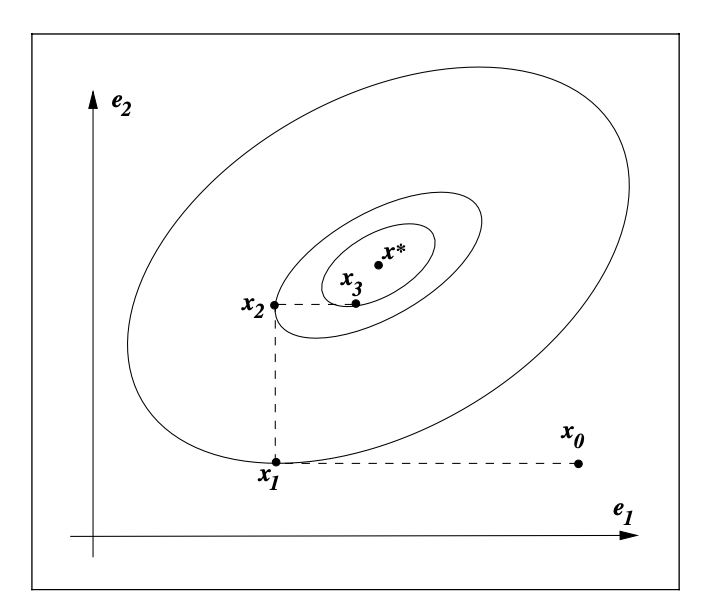
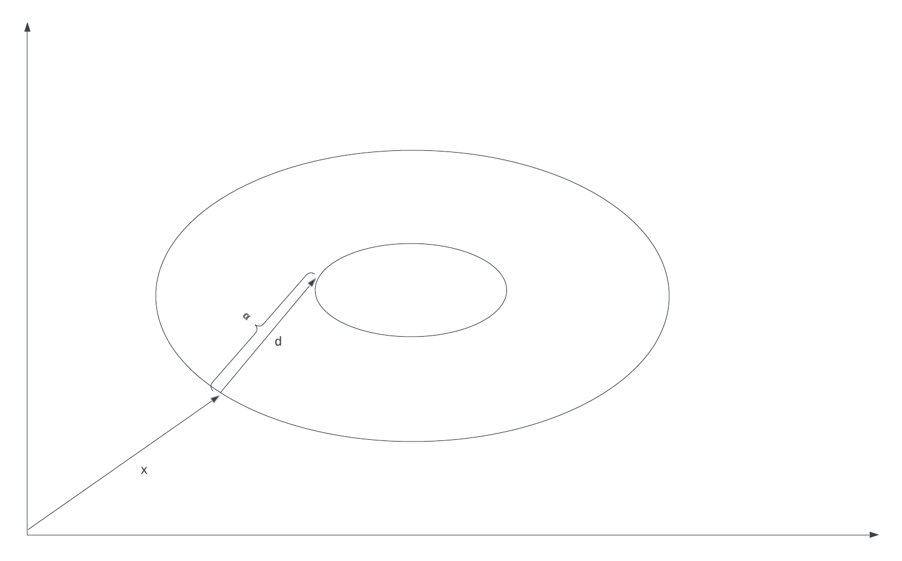
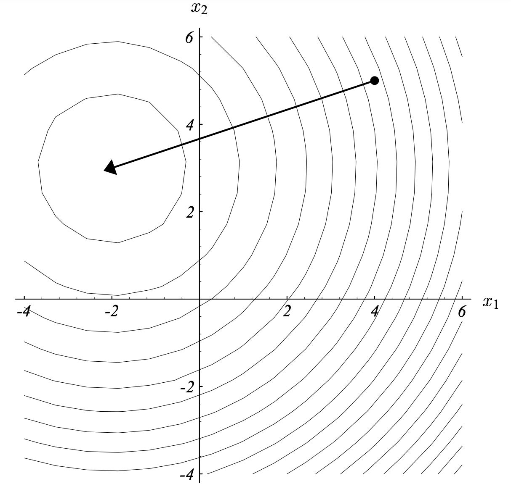
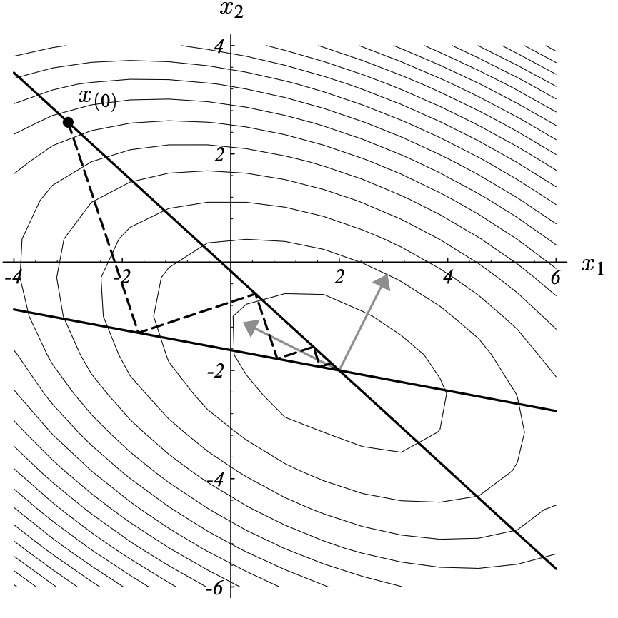
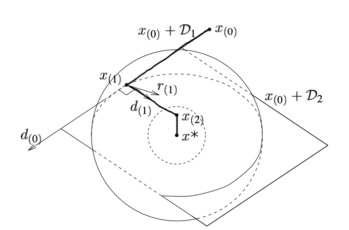
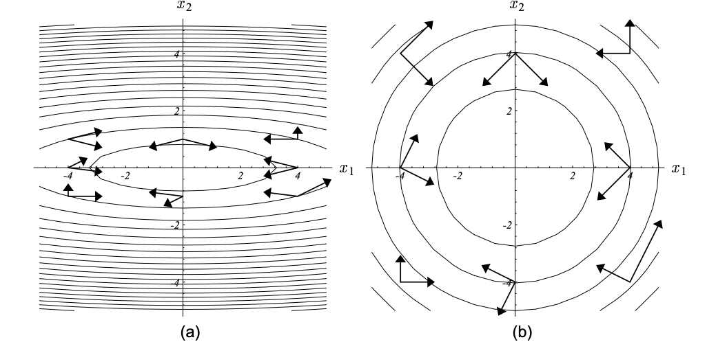
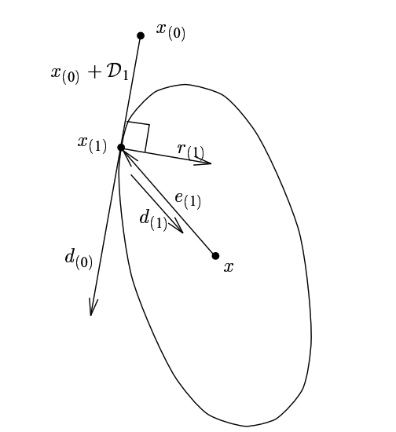
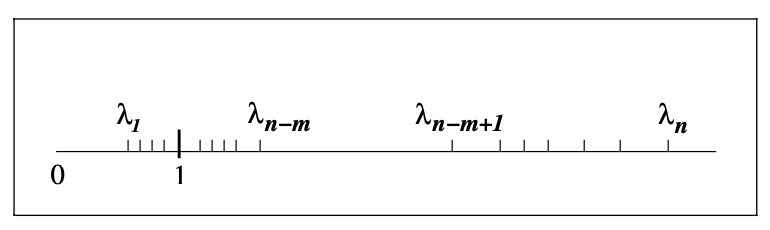

## System of linear equations as a quadratic optimization problem

In case $A$ is a Gram matrix (i.e. symmetric and positive definite), so that its eigenvalues are real and positive, it 
is useful to think about solution of a system of linear equations $Ax = b$ in terms of an equivalent
quadratic problem of finding a minimum of a quadratic function, given by a quadratic form:

$x^* : A x - b = 0 \iff x^* = \arg \min \limits_x \phi(x) = x^T A x - b^T x$

Quadratic form $x^T A x$ represents ellipsoid, eigenvectors $\{ e_i \}$ of matrix $A$ are axes, eigenvalues 
$\{ e_i \}$ are lengths semi-axes, difference between the optimal solution and current point is $x^* - x$,
residue vector $r = Ax - b = Ax - Ax^*$ will be discussed later.

## Naive approaches

How to solve a system of linear equations computationally?

We shall briefly consider two naive approches: coordinate descent and steepest descent, before discussing conjugate
gradients and their advantages.

### Coordinate descent

First, let us look at the simplest approach: coordinate descent. I.e. we iteratively choose coordinates of the vector
$x_i$ and minimize the value of function $\phi(x)$ in that coordinate by solving $\frac{\partial \phi(x)}{\partial x_i} = 0$.

#### Convergence

Coordinate descent clearly does not guarantee convergence in N steps:

**Coordinate descent**. In this example we have a 2D vector $x$, and coordinate descent does not converge to the solution $x^*$ in 2 steps.

### Steepest descent

A smarter approach is steepest descent.

At each step of coordinate descent we calculate the gradient vector $\nabla \phi$ of function $\phi(x)$ and use it as 
the direction of descent.

Here and below I will denote $d$ the direction vector for descent. If we are speaking of multiple steps, I will denote
it as $d_i$. In case of the steepest descent at each step $d_i = \nabla x_i$, where $x_i$ is the approximation of
solution $x^*$, obtained at $i$-th step, starting from an initial approximation $x_0$.

If we are currently at the point $x$, we shall move to some point $x + \alpha d$, where $\alpha$ is the step. We know 
the direction, but how do we find the optimal step $\alpha$ of descent?

Length of the step is optimal, when the function $\phi(x + \alpha d)$ is minimal in some point $x + \alpha d$. It means
that directional derivative $\frac{\partial \phi}{\partial d} = 0$ and the isolevels of the function 
$\phi(x) = x^T A x - b^T x$ become tangent to the direction $d$ of descent.

**Line search**. We start from the point $x$ (defined by a vector, starting from origin) and start searching in the direction $d$
for an optimal length $\alpha$ of $d$ vector, so that the directional derivative of quadratic function $\phi(x)$ is $0$
there, i.e. direction vector is tangent to isolevels of function $\phi(x)$ at that point.

Speaking in terms of multivariate calculus $\langle d, \frac{\partial \phi}{\partial x} \rangle = 0$.

Simplifying this expression, we obtain the step length $\alpha$:

$d^T (A (x + \alpha d) - b) = 0$

$d^T A x + \alpha d^T A d - d^T A d - d^T b = 0$

$\alpha = - \frac{d^T (Ax - b)}{d^T A d} = - \frac{d^T r}{ d^T A d }$

Now our steepest descent algorithm is fully defined. By the way, this formula for step length $\alpha$ is going to be
useful below.

#### Convergence

Convergence rate of steepest descent varies. For instance, it might converge in one iteration, if $A$ is diagonal and
all of its eigenvalues are equal:

**Perfect convergence of steepest descent**. If matrix $A$ is diagonal with equal eigenvalues, isolevels are spheres and steepest descent converges in 1 iteration.

However, in general we cannot guarantee fast convergence for steepest descent. E.g. if the matrix $A$ is ill-conditioned,
i.e. the difference in magnitude between its largest and smallest eigenvalues is big, steepest descent will start jumping
from one side of the ellipsoid to the other.

**Poor convergence of steepest descent**. If we have an ill-conditioned matrix, so that even one eigenvalue of matrix $A$ is much smaller than other eigenvalues of matrix $A$, the ellipsoid isolevels look like a ravine, and gradient jumps off the sides of the ravine. Image from J.R.Schewchuk book.

Hence, convergence rate is related to condition numbers $\kappa$ of the matrix. One can actually derive a formula for
convergence rate:

$\frac{f(x_{(i)}) - f(x)}{f(x_{(0)}) - f(x)} = \frac{\frac{1}{2} e_{(i)}^T A e_{(i)} }{ \frac{1}{2} e_{(0)}^T A e_{(0)} } \le (\frac{\kappa - 1}{\kappa + 1})^{2i}$

Exact derivation of this fact is somewhat tedious (although, not so hard for understanding) and can be found in [J.R. Schewchuk tutorial, part 6.2](http://www.cs.cmu.edu/~quake-papers/painless-conjugate-gradient.pdf).

## Conjugate directions and conjugate gradients

As we've seen convergence of neither coordinate descent, nor steepest descent in $N$ steps is guaranteed.

Here we discuss a better approach, conjugate directions, which will converge in $N$ steps or less. It has a special
case, conjugate gradients, which is even more computationally efficient.

Let us start with an example of orthogonal axes and then transition to a general case.

### Orthogonal axes

Consider the case when all the eigenvectors of our surface are parallel to the coordinate axes. In such a case matrix $A$
is diagonal and performing line search along the coordinate axes guarantees convergence in N iterations.

**If matrix $A$ is diagonal, line search along the conjugate directions converges in $N$ steps.** Image based on J.R.Schewchuk.

However, in general case we cannot rely on orthogonality of axes. If eigenvectors of matrix $A$ are not orthogonal and
parallel to coordinate axes, this approach won't work and line search along orthogonal directions would not work.

### A-orthogonality

Instead of orthogonality, we introduce the notion of A-orthogonality:

$\langle a, b \rangle_A = 0 \iff \langle A a, b \rangle = 0 \iff \langle a, A b \rangle = 0$

We will apply two transformations of coordinates.

First, apply eigen decomposition of $A$:

$A = E \Lambda E^{-1}$, where $E$ is the matrix of eigenvectors (each eigenvector is a column-vector) and $E$ is orthogonal, because eigenvectors
of symmetric matrix are orthogonal; $\Lambda$ is the diagonal matrix of eignevalues, where each eigenvalue $\lambda_i$ 
 is known to be real, positive and related to a corresponding singular value $\sigma_i$ as $\lambda_i = \sigma_i^2$.

$\langle A a, b \rangle = b^T A a = b^T E \Lambda E^{-1} a$

Use the fact that $E$ is orthogonal for symmetric matrix $A$, hence, $E^T = E^{-1}$. Hence, $(E^T b)^T = b^T E = \beta^T$, $E^T a = \alpha$.

What did we do? We changed the coordinates, so that coordinate axes are now the eigenvectors $E$.

In these coordinates vector $a$ has coordinates $\alpha$ and vector $b$ has coordinates $\beta$.

Second, define $\Lambda^{1/2} = \begin{pmatrix} \sqrt{\lambda_1} && 0 && 0 \\ 0 && \sqrt{\lambda_2} && 0 \\ 0 && 0 && \sqrt{\lambda_3} \end{pmatrix}$.

$\langle A a, b \rangle = b^T A a = b^T E \Lambda E^{-1} a = \beta^T \Lambda \alpha = (\Lambda^{1/2} \beta)^T \cdot (\Lambda^{1/2} \alpha)$.

What did we do here? We stretched our coordinate axes by their respective eigenvalues $\lambda_i$, transforming our vectors $\alpha$ into $\Lambda^{1/2} \alpha = \Lambda^{1/2} E^{-1}a$ and
$\beta$ into $\Lambda^{1/2} \beta = \Lambda^{1/2} E^{-1}b$. 

Eigenvectors, forming the semi-axes of ellipsoids, upon this change of coorindates take identical lengths, so that our ellipsoids become spheres.

So, how does A-orthogonality work: first we go from original coordinates to coordinates, where axes $E$ are eigenvectors of $A$.
We apply this transform to both $a$ and $b$ vectors, resulting in their eigendecomposition vectors $E^{-1}a$ and $E^{-1}b$.

Second, we come to a coordinate system, where isolevels are spheres. In these coordinates resulting vectors $\Lambda^{1/2} E^{-1}a$ and $\Lambda^{1/2} E^{-1}b$ must be orthogonal.

**A-orthogonality**: vectors that are A-orthogonal become orthogonal, if we make two changes of coordinates: first, we make eigenvectors the axes of our coordinate system, obtaining image (a); second, we stretch coordinate axes by eigenvalues, so that our isolevels become concentric spheres, resulting in image (b). Image from J.R.Schewchuk.

### Conjugate directions

Let us prove the guarantees of convergence for conjugate directions algorithm in $N$ steps.

Consider a descent algorithm, which uses vectors $\{ d_i \}$ as descent directions and step sizes $\alpha_i = - \frac{d_i^T r_i }{d_i^T A d_i}$, where $r_i = A x_i - b$ is the current residue.

$x_n = x_0 + \alpha_0 d_0 + \alpha_1 d_1 + ... + \alpha_{n-1} d_{n-1}$

We want to prove that if $\{ d_i \}$ are conjugate directions, then $x_n = x^*$. 

Indeed, we know that vectors $\{ d_i \}$ span the whole space. Hence, there exist coefficients $\{ \sigma_i \}$, such that
we can come to the desired solution point $x^*$ walking the directions:

$x^* = x_0 + \sigma_0 d_0 + \sigma_1 d_1 + ... + \sigma_{n-1} d_{n-1}$

Pre-multiply this expression by $d_{i} A$:

$d_{i}^T A (x^* - x_0) = \cancel{\sigma_0 d_{i}^T A d_0} + ... + \sigma_1 d_{i}^T A d_{i} + ... + \cancel{\sigma_{n-1} d_{i}^T A d_{n-1}}$

Hence, $\sigma_{i} = \frac{d_{i}^T A (x^* - x_0)}{ d_{i}^T A d_{i} }$.

Recall that $Ax^* = b$ (because $x^*$ is the perfect solution of our system of linear equations in the end).

Thus, $\sigma_{i} = \frac{d_{i}^T A (x^* - x_0)}{ d_{i}^T A d_{i} } = \frac{ d_{i}^T (b - A x_0) }{ d_{i}^T A d_{i} } = \frac{ -d_{i}^T r_0 }{ d_{i}^T A d_{i} }$.

Now, consider $x_i = x_0 + \alpha_0 d_0 + \alpha_1 d_1 + ... + \alpha_{i-1} d_{i-1}$ and pre-multiply it by $d_i^T A$:

$d_i^T A (x_i - x_0) = 0$, hence, $d_i^T A x_i = d_i^T A x_0$. 

Then substitute this into $\sigma_{i-1} = \frac{ -d_{i}^T r_0 }{ d_{i}^T A d_{i} }$. 

This produces $\sigma_{i} = \frac{ -d_{i}^T r_i }{ d_{i}^T A d_{i} }$, which coincides with $\alpha_i = - \frac{d_i^T r_i }{d_i^T A d_i}$.

Hence, $\sigma_i = \alpha_i$.

#### Conjugate directions as an energy norm minimization

An insightful way of thinking about conjugate gradients is through norm minimization/maximization.

One can show that conjugate directions is similar to PCA in terms of minimization/maximization of a certain norm.

PCA at each iteration finds a projection that minimizes Frobenius norm of approximation of our matrix by low-rank matrices:

$|| A - \sum_k^i \lambda_k u_k v_k^T ||_F \to \min$

TODO: check PCA analogy

TODO: duality between energy norm and Frobenius norm (maximum of energy norm corresponds to minimum of Frobenius norm)

Similarly, we can introduce a notion of **energy norm** of vector $x$: $|| x ||_A = x^T A x $.

One may show that at each step conjugate directions algorithm chooses such a vector $d_i$ that minimizes the energy norm
of error:

$|| e_i ||_A \to \min$

$|| e_i ||_A = e_i^T A e_i = (\sum \limits_k=i^{n-1} d_k^T ) A (\sum \limits_k=i^{n-1} d_k ) = \sum \limits_{k=i}^{n-1} d_k^T A d_k$.

TODO: check notation and finish this part

#### Conjugate directions and eigenvectors

Let $A = E \Lambda E^T$ be the eigenvector decomposition of $A$.

Consider the definition of conjugate directions: $P^T A P = D$, where $D$ is any diagonal matrix, $P$ is the matrix of conjugate 
directions row-vector (orthogonal).

$A = P D P^T$

$E \Lambda E^T = P D P^T$

$E \Lambda^{1/2} = P D^{1/2}$

$P = E \Lambda^{1/2} D^{-1/2} = E (\Lambda D^{-1})^{1/2}$

### Conjugate gradients

How do we obtain conjugate directions in practice?

Simple and straightforward approach: let us use neg-gradients as directions: $d_{i+1} = - r_{i+1} = - A(x_{i+1} - b)$. Problem is, 
our "conjugate" directions are not conjugate. $d_i^T A d_{i+1} \ne 0$, directions are not A-orthogonal (although, by the
way, we know that $d_{i+1}$ is orthogonal, not A-orthogonal to the previous search direction due to tangency of search 
direction to isolevels at the point $x_{i+1}$.

**Conjugate directions in 2D**. Note that $r_{(1)}$ is 
orthogonal to $d_{(0)}$ and $e_{(1)}$ is A-orthogonal to $d_{(0)}$. Image from J.R. Schewchuk.

So, we correct the gradient direction by subtracting $d_{i}$ with some coefficient to A-orthogonalize $d_{i+1}$ and $d_{i}$:

We know that $d_{i+1}$ is orthogonal to each of the previous directions $\{ d_1, ..., d_{i-1} \}$.

$x^* = x_0 + \alpha_0 d_0 + \alpha_1 d_1 + ... + \alpha_{n-1} d_{n-1}$

$x_{i+1} = x_0 + \alpha_0 d_0 + ... + \alpha_i d_i$

$r_{i+1} = Ax_{i+1} - b = Ax_{i+1} - Ax^* = A (x_0 + \alpha_0 d_0 + ... + \alpha_i d_i) - A (x_0 + \alpha_0 d_0 + \alpha_1 d_1 + ... + \alpha_{n-1} d_{n-1}) = - A (\alpha_{i+1}d_{i+1} + ... + \alpha_{n-1} d_{n-1})$

$d_k^T r_{i+1} = 0$

Hence, $r_{i+1}$ is already orthogonal to $\{ d_0, ..., d_{i} \}$.

But more importantly for conjugate gradients, it is not only orthogonal, but also A-orthogonal to $\{ d_0, ..., d_{i-1} \}$!

$x_{i+1} = x_{i} + \alpha_i d_{i}$

$r_{i+1} = r_{i} + \alpha_i A d_{i}$

$\alpha_i A d_i = r_{i+1} - r_{i}$

Pre-multiply this with $r^T_k$: $\alpha_i r^T_k A d_i = r^T_k r_{i+1} - r^T_k r_{i}$. 

The following cases arise: $\begin{cases} k < i: r^T_k A d_i = 0 \\ k = i: r^T_i A d_i = - r^T_i r_{i} \\ k = i + 1: r^T_{i+1} A d_i = r^T_{i+1} r_{i+1} \end{cases}$

Hence, $r_{i+1}$ is already A-orthogonal to $d_k$ for $k < i$. To A-orthogonalize $d_{i+1}$ derived from $r_{i+1}$, all we need to do is to orthogonalize it with respect to $d_i$. This greatly simplifies
the calculation process and saves us a lot of memory:

$d_{i+1} = - r_{i+1} + \beta d_{i}$

Calculation of $\beta$ is evident from A-orthogonality of $d_{i+1}$ and $d_{i}$: pre-multiply this expression with 
$d^T_{i} A$:

$\cancel{d^T_{i} A d_{i+1}} = - d^T_{i} A r_{i+1} + \beta d^T_{i} A d_{i}$ (all other $d^T_{k} A d_{i} = 0$)

$d^T_{i} A r_{i+1} = \beta d^T_{i} A d_{i}$

$\beta = \frac{ d^T_{i} A r_{i+1} }{ d^T_{i} A d_{i} }$

This is just a special case of Schmidt orthogonalization.

#### Krylov space

One more important aspect: assume $x_0 = 0$ and consider $-r_0 = b - Ax = b$. Hence, $x_1 = b$.

$x_2 - x_1 = - r_{2} + \beta (x_1 - x_0) = (b - A x_2) + \beta x_1$

$x_2 (I + A) = b + (1 + \beta) x_1 = b + (1 + \beta) b = 2b + \beta b$

$x_2 = b (2 + \beta)$

Similarly, if we consider $x_3$, we get a polynomial of $A^2 b$, $A b$ and $b$. And so on.

Hence, in case of $x_i$ we are working with a space of vectors $[ A^{i-1} b, A^{i-2} b, ..., A b, b ]$

This space is called **Krylov space** and is useful in related problems, such as numeric eigenvector/eigenvalue 
estimation. Such problems are often solved with a related family of algorithms, such as Arnoldi iteration and Lanczos
algorithm.

TODO: fix bugs

#### Convergence rate: inexact arithmetic

If we allow for a certain error, conjugate gradients might not even require $N$ iterations. Consider the following
clustering of eigenvalues of our matrix $A$:

**Two clusters of eigenvalues**. From Nocedal-Wright's Numerical optimization.

Recall the convergence rate formula: $|| x_{n-k} - x^* ||_A \le (\frac{\lambda_{n-k} - \lambda_1}{ \lambda_{n-k} + \lambda_1 })^2 || x_0 - x^* ||_A$.

Suppose that we've already made $m+1$ iterations. Then $\lambda_{n-(m+1)} - \lambda_1$ is very small and $\lambda_{n-(m+1)} + \lambda_1 \approx 2 \lambda_1$.

Hence,  $|| x_{n-k} - x^* ||_A \le \epsilon$, where $\epsilon > 0$ is small, and we've basically converged to the solution.

### Preconditioning and clusters of eigenvalues

If the matrix $A$ is ill-conditioned, iterative multiplication of a vector $b$ by a matrix $A$ would accumulate 
the floating point rounding errors, resuling in a failure to converge to the correct solution. Hence, we need to
"normalize" the matrix $A$ similarly to how we apply batch norm or layer norm to normalize the layers of neural networks.

This process is called pre-conditioning. We are multiplying both sides of our equation by a pre-conditioner matrix $P$: 
$P A x = P b$.

An ideal pre-conditioner would convert our matrix to a perfect sphere. Then pre-conditioning axes should be the 
eigenvectors and coefficients be eigenvalues. So, the perfect pre-conditioner is the matrix inverse. However, this is
computationally impractical, as it is more-or-less equivalent to the solution of the initial system $Ax = b$ and would
take $O(N^3)$ operations.

The simplest pre-conditioner matrix is a diagonal matrix of the values at the diagonal of the matrix $A$. This is called
[Jacobi pre-conditioner](https://en.wikipedia.org/wiki/Preconditioner#Jacobi_(or_diagonal)_preconditioner). It is 
equivalent to scaling the matrix along the coordinate axes by values at the diagonal of matrix $A$. Obviously, this is 
an imperfect solution.

A more practical pre-conditioner would be an incomplete Cholesky decomposition. I will first discuss a regular Cholesky
decomposition in the context of conjugate directions, and then its sparse variation.

#### Cholesky decomposition as a special case of conjugate directions

Cholesky decomposition is a representation of our matrix $A$ as a product of lower-diagonal matrix $L$ and its transpose
upper-diagonal matrix $L^T$: $A = L L^T$.

One can see that the vectors of inverse of Cholesky decomposition [are actually conjugate directions](https://en.wikipedia.org/wiki/Cholesky_decomposition#Geometric_interpretation) of matrix $A$, such 
that the first direction is parallel to the first coordinate axis, second direction is in the plan of the first two 
axes etc. Consider an upper-triangular matrix $V$:

$V^T A V = I$

$V^T A = V^{-1}$

$A = {V^{-1}}^T V^{-1}$

Now we can denote $L = {(V^{-1})}^T$ and $L^T = V^{-1}$, and we get $A = L L^T$.

To see that inverse of an upper-triangular matrix is upper-triangular, just [apply](https://math.stackexchange.com/questions/4841/inverse-of-an-invertible-triangular-matrix-either-upper-or-lower-is-triangular/4843#4843) the textbook method of matrix 
inversion, i.e. write down a matrix and a unit matrix next to each other, Gauss-eliminate the left, and you will
obtain its inverse from the right:

$$
\begin{pmatrix}
a^1_1 & a^1_2 & \cdots & a^1_{n-1}     & a^1_n     & 1 & 0      & \cdots & 0 & 0 \\\
      & a^2_2 & \cdots & a^2_{n-1}     & a^2_n     &   & 1      & \cdots & 0 & 0  \\\
      &       & \ddots & \vdots        & \vdots    &   &        & \ddots & \vdots  & \vdots \\\
      &       &        & a^{n-1}_{n-1} & a^{n-1}_n &   &        &        & 1 & 0 \\\
      &       &        &               & a^n_n     &   &        &        &   & 1  
\end{pmatrix}
$$

#### Cholesky decomposition algorithm

The algorithm for Cholesky decomposition is actually pretty straightforward.

$$
\begin{pmatrix} 
a_{1,1} & a_{1,2} & a_{1,3} \\
a_{2,1} & a_{2,2} & a_{2,3} \\
a_{3,1} & a_{3,2} & a_{3,3} \\
\end{pmatrix}
=
\begin{pmatrix} 
l_{1,1} & 0 & 0 \\
l_{2,1} & l_{2,2} & 0 \\
l_{3,1} & l_{3,2} & l_{3,3} \\
\end{pmatrix}
\cdot
\begin{pmatrix} 
l_{1,1} & l_{2,1} & l_{3,1} \\
0 & l_{2,2} & l_{3,2} \\
0 & 0 & l_{3,3} \\
\end{pmatrix}
$$

$$
\begin{pmatrix} 
a_{1,1} & a_{1,2} & a_{1,3} \\
a_{2,1} & a_{2,2} & a_{2,3} \\
a_{3,1} & a_{3,2} & a_{3,3} \\
\end{pmatrix}
=
\begin{pmatrix} 
l_{1,1} & 0 & 0 \\
? & ? & 0 \\
? & ? & ? \\
\end{pmatrix}
\cdot
\begin{pmatrix} 
l_{1,1} & ? & ? \\
0 & ? & ? \\
0 & 0 & ? \\
\end{pmatrix}
\implies l^2_{1,1} = a_{1,1}
$$

$$
\begin{pmatrix} 
a_{1,1} & a_{1,2} & a_{1,3} \\
a_{2,1} & a_{2,2} & a_{2,3} \\
a_{3,1} & a_{3,2} & a_{3,3} \\
\end{pmatrix}
=
\begin{pmatrix} 
l_{1,1} & 0 & 0 \\
? & ? & 0 \\
? & ? & ? \\
\end{pmatrix}
\cdot
\begin{pmatrix} 
? & l_{2,1} & ? \\
0 & ? & ? \\
0 & 0 & ? \\
\end{pmatrix}
\implies l_{2,1} = a_{1,2} / l_{1,1}
$$

$$
\begin{pmatrix} 
a_{1,1} & a_{1,2} & a_{1,3} \\
a_{2,1} & a_{2,2} & a_{2,3} \\
a_{3,1} & a_{3,2} & a_{3,3} \\
\end{pmatrix}
=
\begin{pmatrix} 
l_{1,1} & 0 & 0 \\
? & ? & 0 \\
? & ? & ? \\
\end{pmatrix}
\cdot
\begin{pmatrix} 
? & ? & l_{3,1} \\
0 & ? & ? \\
0 & 0 & ? \\
\end{pmatrix}
\implies l_{3,1} = a_{1,3} / l_{1,1}
$$

$$
\begin{pmatrix} 
a_{1,1} & a_{1,2} & a_{1,3} \\
a_{2,1} & a_{2,2} & a_{2,3} \\
a_{3,1} & a_{3,2} & a_{3,3} \\
\end{pmatrix}
=
\begin{pmatrix} 
? & 0 & 0 \\
l_{2,1} & l_{2,2} & 0 \\
? & ? & ? \\
\end{pmatrix}
\cdot
\begin{pmatrix} 
? & l_{2,1} & ? \\
0 & l_{2,2} & ? \\
0 & 0 & ? \\
\end{pmatrix}
\implies l_{2,2}^2 = a_{2,2} - l_{1,1}^2
$$

$$
\begin{pmatrix} 
a_{1,1} & a_{1,2} & a_{1,3} \\
a_{2,1} & a_{2,2} & a_{2,3} \\
a_{3,1} & a_{3,2} & a_{3,3} \\
\end{pmatrix}
=
\begin{pmatrix} 
? & 0 & 0 \\
? & ? & 0 \\
l_{3,1} & ? & ? \\
\end{pmatrix}
\cdot
\begin{pmatrix} 
l_{1,1} & ? & ? \\
0 & ? & ? \\
0 & 0 & ? \\
\end{pmatrix}
\implies l_{3,1} = a_{3,1} / l_{1,1}
$$

$$
\begin{pmatrix} 
a_{1,1} & a_{1,2} & a_{1,3} \\
a_{2,1} & a_{2,2} & a_{2,3} \\
a_{3,1} & a_{3,2} & a_{3,3} \\
\end{pmatrix}
=
\begin{pmatrix} 
? & 0 & 0 \\
l_{1,2} & l_{2,2} & 0 \\
? & ? & ? \\
\end{pmatrix}
\cdot
\begin{pmatrix} 
? & ? & l_{3,1} \\
0 & ? & l_{3,2} \\
0 & 0 & l_{3,3} \\
\end{pmatrix}
\implies l_{1,2} l_{3,1} + l_{2,2} l_{3,2} = a_{2,3} \implies l_{3,2} = \frac{ a_{2,3} - l_{1,2} l_{3,1} } { l_{2,2} }
$$

$$
\begin{pmatrix} 
a_{1,1} & a_{1,2} & a_{1,3} \\
a_{2,1} & a_{2,2} & a_{2,3} \\
a_{3,1} & a_{3,2} & a_{3,3} \\
\end{pmatrix}
=
\begin{pmatrix} 
? & 0 & 0 \\
? & ? & 0 \\
l_{3,1} & l_{3,2} & l_{3,3} \\
\end{pmatrix}
\cdot
\begin{pmatrix} 
? & ? & l_{3,1} \\
0 & ? & l_{3,2} \\
0 & 0 & l_{3,3} \\
\end{pmatrix}
\implies l_{3,3}^2 = a_{3,3} - l_{3,1}^2 - l_{3,2}^2
$$

#### Incomplete Cholesky decomposition

Full Cholesky decomposition is expensive and takes ~$O(N^3)$ operations.

In case of sparse matrices (or introducing sparsification ourselves), we can achieve the same result with a much smaller 
compute.

The simplest form of incomplete Cholesky decomposition repeats the sparsity patter of the original matrix. E.g. if the
original matrix is:

$A = \begin{pmatrix} 1 && 0 && 0 && 2 \\ 0 && 3 && 0 && 4 \\ 0 && 0 && 5 && 0 \\ 2 && 4 && 0 && 6 \end{pmatrix}$

its incomplete Cholesky decomposition would have a sparsity pattern of:

$L = \begin{pmatrix} ? && 0 && 0 && 0 \\ 0 && ? && 0 && 0 \\ 0 && 0 && ? && 0 \\ ? && ? && 0 && ? \end{pmatrix}$

Zeros above main diagonal stem from the fact that $L$ is lower diagonal, zeros below the main diagonal reproduce 
the sparsity pattern of matrix $A$:

$A = L L^T = \begin{pmatrix} ? && 0 && 0 && 0 \\ 0 && ? && 0 && 0 \\ 0 && 0 && ? && 0 \\ ? && ? && 0 && ? \end{pmatrix} \cdot \begin{pmatrix} ? && 0 && 0 && ? \\ 0 && ? && 0 && ? \\ 0 && 0 && ? && 0 \\ 0 && 0 && 0 && ? \end{pmatrix}$

This approach is known as $IC(0)$. If you want more precision and less sparsity, you can take the sparsity pattern of 
$A^2$, which has less 0 elements, and calculate Cholesky decomposition for it. This would be called $IC(1)$. And so on,
then it would be called $IC(k)$. Greater $k$ would result in a better pre-conditioning at the cost of more compute.

If the matrix $A$ is not sparse at all, we can employ $IC(\tau)$ approach: choose some threshold of absolute
value of an element of matrix $A$, called $\tau$ and if the element is smaller than that, consider it 0. Thus, we achieve
a sparse matrix with a Frobenius norm more or less close to the original matrix $A$. Hence, we get a reasonable
pre-conditioner at an $O(N^2)$ compute and $O(N)$ memory cost.

## References:
* http://www.cs.cmu.edu/~quake-papers/painless-conjugate-gradient.pdf - a great monography on conjugate gradients by Johnathan Richard Schewchuk
* https://www.csie.ntu.edu.tw/~r97002/temp/num_optimization.pdf - Numerical Optimization by Nocedal, Wright
* https://dl.acm.org/doi/pdf/10.1145/87252.88084 - a nice autobiography and explanation by Magnus Hestenes
* https://math.mit.edu/classes/18.086/2006/am64.pdf - a text on Krylov space methods: CG, Arnoldi iteration, Lanczos
* https://math.stackexchange.com/questions/3439589/are-conjugate-vectors-unique - about relation of conjugate and eigen vectors
* http://www.people.vcu.edu/~ysong3/lecture11.pdf - good intro, construction of each search direction well explained
* https://en.wikipedia.org/wiki/Conjugate_gradient_method - wikipedia
* https://en.wikipedia.org/wiki/Cholesky_decomposition#Geometric_interpretation - on interpretation of Cholesky as conjugate directions
* https://algowiki-project.org/en/Cholesky_method#Usage_of_Cholesky_decomposition_in_iterative_methods - on variants of incomplete Cholesky decomposition