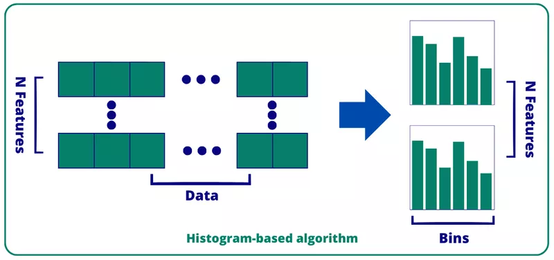
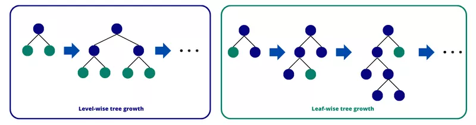
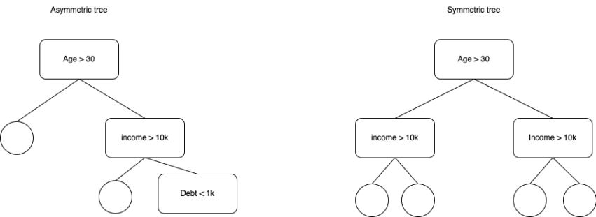

## Gradient Boosting Machines (GBM)

Gradient Boosting Machines are the most popular class of decision tree-based ensemble methods (other notable ensemble
methods being Bagging and Random Forest).

### Concepts

#### Ensemble of weak learners, row subsampling

GBMs sequentially train decision trees, called weak learners. Each new tree is trained with a focus on improving the
performance on those samples, where the ensemble of its predecessors failed. As an extra sumbsampling of data points is 
usually applied for each tree, hence, adding some protection from overfitting and variance reduction. This approach with
randomization of samples was inspired byn Bagging procedure and was described by Friedman (2002) as Stochastic Gradient 
Boosting.

#### Loss

The goal of training is to get an ensemble of decision trees, which minimizes some loss function. In case of regression
problem it could be MSE, in case of classification problem - log-loss. Additionally, one might want to penalize overly
complex models, keeping a balance between bias and variance. Hence, loss might contain extra penalties on number of trees
or number of nodes-splits in each tree.

#### Gradient, Hessian

After $i$ iterations of training our ensemble of trees provides some value of loss function. On some data points the loss
is low, on some - high. In order to improve the performance on hard samples, boosting calculates loss gradient (and hessian)
and aims to improve primarily on those samples.

TODO: gradient, hessian, Newton-Raphson-like process

#### Split, impurity possible randomization of features

At $i+1$-th iteration boosting starts constructing a new decision tree (regressor/classifier). At each split of the tree
we aim to minimize impurity function. For regressions impurity is the same as loss, for classifications it is different,
usually Gini or entropy.

TODO: reduction of bias

# Improvements

## XGBoost

XGBoost was the first popular implementation of GBMs that established GBMs as a no-brainer for Kaggle competitions,
winning almost 50% of competitions. It incorporated powerful engineering optimizations to be discussed here.

### Shrinkage: column subsampling and tree penalties

XGBoost implements some shrinkage and bias reduction measures to improve performance:

* Each split in the tree is penalized, so that loss reduction, obtained by that split is greater than that penalty. Otherwise the model will overfit.
* Addition of each extra tree to the ensemble is penalized.
* In addition to subsampling the data points, for each tree XGBoost also subsamples the set of features, obtaining an extra bias reduction in spirit of Random Forests.

See the [XGBoost paper](https://arxiv.org/pdf/1603.02754.pdf) and the [talk by Tianqi Chen](https://www.youtube.com/watch?v=Vly8xGnNiWs) for more details.

### Sparsity and NaN handling

Initially people used to encode categorical features with one-hot encoding. E.g. if you have a column "Car manufacturer"
with 50 brands { "Geely", "BMW", "Toyota", "Kia", ... }, you would instead replace it with 50 columns, where all of them
would be 0 for each row and one, corresponding to the current car's manufacturer, will be 1.

Both this one-hot encoding and presence of NaNs in the table gives rise to sparsity of the data. XGBoost can handle those
issues natively.

### Monotonic constraints

Sometimes we know from business considerations that e.g. credit score of a person monotonically increases with their
salary. Thus, for the sake of explainability one might want to enforce monotonic constraints on a subset of features,
which are [respected by XGBoost](https://xgboost.readthedocs.io/en/stable/tutorials/monotonic.html).

## LightGBM

LightGBM was the next big jump forward in engineering a more efficient GBM. It introduced a whole list of improvements.
Importantly, it is by far the fastest implementation to train the model with (possibly with the exception of better 
handling of categorical features by CatBoost), it slightly outperforms XGBoost in prediction accuracy, while being
competitive with XGBoost in terms of prediction time (both XGBoost and LightGBM predicting slower than CatBoost).

## Hist GBM: binning of continuous features 

The bottleneck of boosting algorithm is the procedure of sorting of data points on every new split for optimal split 
feature selection. In a naive implementation this procedure takes $\mathcal{O}(N \log N \times F)$ operations, where $N$ is the number
of data points left at this split and $F$ is the number of features to consider.

This procedure can be implemented in a more effective way. By binning continuous numeric data and, thus, constructing
distribution histograms, one can achieve performance improvement to $\mathcal{O}(N \times F)$.

**Binning procedure**. Continuous features are jointly considered withing bins.
Then the gradient can be computed for the whole bin, and selection of splits is made much faster.

### Depth-first search (a.k.a. leaf-first) not layer-first

While initial boosting algorithms used to find split breadth-first layer-by-layer, LightGBM goes depth-first, optimizing
the most impactful leaf at each iteration. This results in deep, unbalanced trees.

**Leaf-first (depth-first) seach**: unlike the initial boosting implementations, LightGBM searches for splits depth-first.

### Gradient-based one-side sampling (GOSS)

GOSS is an engineering improvement of subsampling the data at splits. It makes sure that "hard" data points, which make
the decisive contribution to the gradient, are kept in the subsampled set for the new trees, while at the same time
some presence of "easy" data points is maintained to keep the distributions closer to original.

### Exclusive feature bundling (EFB)

This is LightGBM's take on categorical features, which effectively bundles mutually exclusive features (probably, 
generated by one-hot encodings).

## CatBoost

This is the Yandex implementation of GBMs, meant for efficient handling of categorical features (hence, the name and NOT
due to the affection for feline) and fast prediction in production environment, demanding for low latency.

### Same split feature for each layer

While LightGBM goes depth-first and creates deep asymmetrical trees, CatBoost uses the same feature/threshold pair on
**each** node of the same layer to create symmetric trees of a constant depth. This ensures roughly equal and 
predictably low execution time for all samples, which is important for Yandex production environments.

**CatBoost uses same feature/threshold pair at each split**, which 
results in balanced symmetrical trees with approximately constant prediction time for all samples.

### Categorical features handling: target encoding etc.

Unlike LightGBM CatBoost has a built-in set of encodings for categorical features, including such improvements over
one-hot encoding as target encoding. This way we can naturally convert categorical features to (already binned) numeric
ones.

## Practical considerations

### Why do the Gradient Boosting Machines beat Random Forests?

Random Forests are a competing ensemble method. While Gradient Boosting builds trees sequentially, at each iteration
improving mostly on samples, where preceding ensemble members underperformed, Random Forests construct all the trees
in an ensemble in parallel.

Due to subsampling in both samples and features, Random Forests achieve improvement of prediction with addition of extra
trees by reducing variance of the resulting ensemble. In contrast, RBMs primarily reduce bias (due to the focus on 
samples, where preceding members of ensemble underperformed), although subsampling of samples (and sometimes features) 
helps reduce variance, too.

Thus, generally GBMs attain better losses than Random Forests. However, sometimes Random Forests still perform 
comparably to Gradient Boosting Machines, e.g. in case of abundance of very noisy and weak features.

It might seem that Random Forests can be parallelized better than Gradient Boosting due to parallelism of tree 
construction. But actually GBMs allow for parallel execution at the level of a single tree (candidate features at a split
and/or, possibly, tree nodes can be traversed in parallel).

### LightGBM vs CatBoost

As we've seen LightGBM and CatBoost algorithms are so vastly different, that it is a bit surprising to me that they
produce similar results. Generally they slightly outperform XGBoost in terms of accuracy and also outperform it in terms
of training and inference speed in their respective use cases.

When do you use either of them?

LightGBM is much faster in terms of training speed (possibly, except for categorical features handling, but you can
do it manually). CatBoost is much faster in prediction/inference, as it was optimized to minimize latency in Yandex 
production environment.

So, if you need to win Kaggle by processing 100 million data points on your Macbook Pro 13, go for LightGBM. If you
need to train the model once, upload it to your web server and return its results as fast as possible from your REST api,
go for CatBoost.

## References:

* https://scikit-learn.org/stable/modules/ensemble.html#bagging-meta-estimator - scikit-learn ensembles
* https://www.sciencedirect.com/science/article/abs/pii/S0167947301000652 - Stochastic Gradient Boosting by J.Friedman
* https://arxiv.org/pdf/1603.02754.pdf - XGBoost paper by Tiangqi Chen, Carlos Guestrin 
* https://www.youtube.com/watch?v=Vly8xGnNiWs - XGBoost talk
* https://proceedings.neurips.cc/paper_files/paper/2017/file/6449f44a102fde848669bdd9eb6b76fa-Paper.pdf - LightGBM paper
* https://www.sicara.fr/blog-technique/mastering-lightgbm-unravelling-the-magic-behind-gradient-boosting - on LightGBM peculiarities
* https://neptune.ai/blog/when-to-choose-catboost-over-xgboost-or-lightgbm - CatBoost vs LightGBM