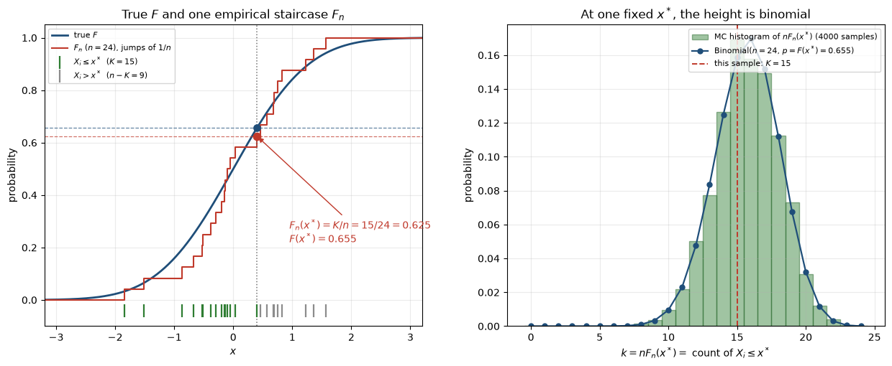
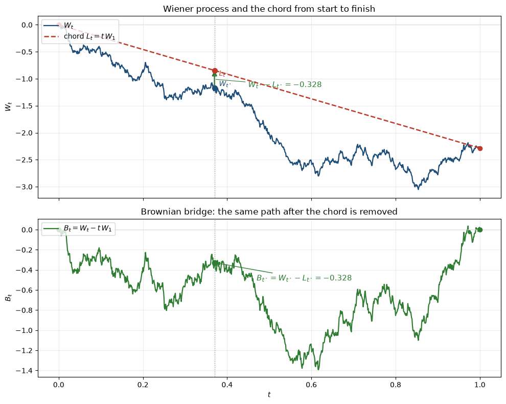

## Goodness of Fit (GoF) problem

Goodness of fit problem arises when we need to check, if an empirically observed data follow
some theoretically known distribution. E.g. we hypothesized that the distribution on the cover of this
post is exponential. How to test, if this hypothesis holds?

Previously we've already considered derivation of Pearson's Chi-squared goodness-of-fit test [post](/2021-06-17-1).

Today we'll look into a family of its alternatives, based on comparison of empirical distribution function with
theoretical one. Then those tests would collect different statistics, all measuring some kind of divergence between theoretical and empirical distributions and will try to say that it is totally improbable to observe such an empirical distribution, if we assumed that indeed it was sampled from theoretical one.

## Toolchain

All 3 tests, Kolmogorov-Smirnov, Cramer-von Mises, Anderson-Darling, rely upon the same set of mathematical objects and results. Hence, in order to understand the derivation of those tests and intuition behind them, I'll first describe those objects and how they pertain to the GoF problem and then will consider specifics of each test in the final steps of their derivation, where they somewhat diverge (hopefully, this will result in intuitions on their relative advantages and disadvantages).

### Empirical cumulative distribution function vs true distribution function

Let $X_1,\dots,X_n$ be i.i.d. with unknown CDF $F(x)=\mathbb{P}(X\le x)$.

The *empirical* CDF is built out of samples from that distribution as the fraction of observations that have landed to the left of $x$,

$F_n(x) = \frac{1}{n} \sum \limits_{i=1}^{n} \mathbf{1}_{\{X_i \le x\}}$.

The left subplot of the figure below is that for a standard Gaussian $F$ and $n=24$ samples; the blue curve is theoretical CDF $F$, the red ladder is empirical CDF $F_n$.

**Empirical CDF $F_n$ versus true Gaussian $F$.** Left: one staircase ($n=24$).
Right: the random height of that staircase at a fixed $x^\ast$.

Now freeze a single abscissa $x^\ast$ (the dotted vertical line). The height $F_n(x^\ast)$ no
longer looks like a function — it is just a number $K/n$, where $K=\#\{i: X_i\le x^\ast\}$
counts how many green ticks sit to the left of $x^\ast$. In the figure, $K=15$ out of $24$,
so $F_n(x^\ast)=15/24=0.625$, while the true height is $F(x^\ast)=0.655$.

Under the null hypothesis each $X_i$ independently falls on the left of $x^\ast$ with probability
$F(x^\ast)$, so $K$ is a coin-flip count. That is why the histogram on the right is binomial,
and why we next study $F_n$ *pointwise* before treating it as a process.

### Binomial distribution of sample at each point

Now take a look at the right subplot of the figure above.

Fix a point $x$ on the real line and look at a single number: the height of the empirical CDF there,
$F_n(x) = \frac{1}{n}\sum_{i=1}^{n} \mathbf{1}_{\{X_i \le x\}}$.
Under the null, $X_1,\dots,X_n$ are i.i.d. from the hypothesized $F$, so each indicator is a coin flip:
$\mathbb{P}(X_i \le x) = F(x)$. Hence $\mathbf{1}_{\{X_i \le x\}} \sim \mathrm{Bernoulli}(F(x))$,
independent across $i$. Their sum is binomial:

$n F_n(x) \sim \mathrm{Binomial}\bigl(n,\, F(x)\bigr)$.

That is the whole story: "is the sample $\le x$?" is a yes/no trial with success probability $F(x)$,
and we run $n$ independent trials. Immediately,

$\mathbb{E}[F_n(x)] = F(x),\qquad \mathrm{Var}[F_n(x)] = \frac{F(x)\bigl(1-F(x)\bigr)}{n}$.

The variance is largest at the median ($F(x)=\tfrac12$) and vanishes in the tails — the empirical CDF is noisier in the middle than at the edges.

If the curve at the right reminds you a normal distribution, well, that's because binomial distribution converges to normal in central part as $n \to \infty$: after centering and $\sqrt{n}$-scaling this binomial
becomes approximately $\mathcal{N}\bigl(0,\, F(x)(1-F(x))\bigr)$, which is exactly the pointwise
marginal of the so-called Brownian bridge we will meet below.

Note however that this is a *pointwise* statement: the counts at two different $x$ and $y$ are dependent (the same sample is reused), so the process $x \mapsto F_n(x)$ is not a collection of independent binomials.

### Quantile transform

The binomial picture above still depends on $F$: the success probability at $x$ is $F(x)$. Kolmogorov–Smirnov, Cramér–von Mises and Anderson–Darling get rid of that dependence with the quantile transform. If $F$ is continuous and $X\sim F$, then

$U := F(X) \sim \mathrm{Uniform}[0,1]$.

Proof is one line: $\mathbb{P}(F(X) \le u) = \mathbb{P}(X \le F^{-1}(u)) = F(F^{-1}(u)) = u$ for $u\in[0,1]$
(for a general continuous CDF take the generalized inverse $F^{-1}(u)=\inf\{x: F(x)\ge u\}$).

So under the null, the mapped sample $U_i = F(X_i)$ is i.i.d. uniform on $[0,1]$. Write its empirical CDF as

$G_n(u) = \frac{1}{n} \sum \limits_{i=1}^{n} \mathbf{1}_{\{U_i \le u\}},\qquad u\in[0,1]$.

The original ECDF is just this process reparametrized by the hypothesized CDF: $F_n(x) = G_n(F(x))$.
Comparing $F_n$ to $F$ is therefore the same as comparing $G_n$ to the identity map $u\mapsto u$.
In particular, from the previous section,

$n G_n(u) \sim \mathrm{Binomial}(n,\, u),\qquad \mathbb{E}[G_n(u)]=u,\qquad \mathrm{Var}[G_n(u)]=\frac{u(1-u)}{n}$.

The whole GoF problem now lives on the unit interval, with a *distribution-free* null: no leftover $F$.
That is why the same critical values work for every continuous hypothesized law, and why the limiting
object below is a Brownian bridge on $[0,1]$ rather than some $F$-dependent process on $\mathbb{R}$.

If the null is false, $F(X)$ is *not* uniform, $G_n$ drifts away from the diagonal, and that is what the
tests detect. (If $F$ is estimated from the same sample, the $U_i$ are only approximately uniform —
that is a different, composite, story.)

### Brownian bridge

Pointwise, $\sqrt{n}(G_n(u)-u)$ is a centered binomial, hence asymptotically $\mathcal{N}(0,\,u(1-u))$. 

GoF tests, however, are not questions about one $u$: Kolmogorov–Smirnov looks at $\sup_u |G_n(u)-u|$, Cramér–von Mises at $\int (G_n-u)^2$, Anderson–Darling at a weighted
version. Those are functionals of the *whole path*. Two hard constraints come with it: $G_n(0)=0$ and $G_n(1)=1$ always, so the centered process is pinned at both ends of $[0,1]$.
A Wiener process starts at $0$ but is free at $t=1$. The Gaussian process that is Wiener-like *and* tied down at both endpoints is the Brownian bridge; Donsker's theorem (next) says the
empirical process converges to it.

Intuition: take a Wiener process $W_t$ ($W_0=0$, independent Gaussian increments, $\mathrm{Var}(W_t)=t$).
It typically ends at some $W_1\neq 0$. Draw the chord $L_t = t W_1$ from $(0,0)$ to $(1,W_1)$ and
subtract it,

$B_t = W_t - t W_1$.

Then $B_0=B_1=0$: the path is a "bridge" between the two banks of the interval. Equivalently, $B$ is
Brownian motion conditioned on $W_1=0$. That is the same geometry as the empirical process after the
quantile transform: $\sqrt{n}(G_n(u)-u)$ starts at $0$ (no mass before $0$) and returns to $0$
(all mass is accounted for by $u=1$). The figure below is exactly this construction.

**A Brownian bridge is a Wiener path with its chord subtracted.**
Top: one Wiener path $W_t$ and the straight chord $L_t = t W_1$ from start to finish.
Bottom: $B_t = W_t - t W_1$, pinned at $0$ at both endpoints. The marked gap $W_{t^\ast}-L_{t^\ast}$
is exactly the bridge height $B_{t^\ast}$.

The object GoF actually computes with is this staircase, centered and blown up to CLT scale. Call it
the *empirical process*

$\alpha_n(u) = \sqrt{n}\bigl(G_n(u)-u\bigr),\qquad u\in[0,1]$.

Pointwise it is the standardized binomial from earlier; as a *function* of $u$ it is a stochastic process
that, like the green curve above, starts at $0$ and dies at $0$. Without the $\sqrt{n}$, Glivenko–Cantelli
says $\alpha_n/\sqrt{n}\to 0$ uniformly — the staircase hugs $F$ and there is nothing left to test.
The $\sqrt{n}$ keeps the typical fluctuations of order $1$, so questions like “is $\sup_u|\alpha_n(u)|$
too large?” have a non-degenerate answer. Donsker's theorem, next, is the functional CLT that
identifies the limiting path: $\alpha_n\Rightarrow B$, a Brownian bridge. That is the whole reason
to care about bridges — every KS/CvM/AD statistic is a continuous functional of $\alpha_n$, hence
in the limit a functional of $B$, whose law we can actually compute.

### Donsker's theorem

Here the previous pieces become a theorem: we have an empirical
staircase $G_n$, a pinned fluctuation process $\alpha_n=\sqrt{n}(G_n-u)$, and a named Gaussian
limit $B$ (Brownian bridge) that has the same covariance and the same endpoints. Donsker's theorem is the statement that this is actually convergence in distribution: $\alpha_n\Rightarrow B$ as stochastic processes on $[0,1]$. The double arrow $\Rightarrow$ means *convergence in distribution*. In case of discrete random variable that is
the statement $F_{X_n}(x)\to F_X(x)$ at every continuity point of $F_X$ — equivalently,
$\mathbb{E}[f(X_n)]\to\mathbb{E}[f(X)]$ for every bounded continuous $f:\mathbb{R}\to\mathbb{R}$.
In a continuous case of a stochastic process it is the same thing, with $f$ a bounded continuous functional of the whole curve:
$\mathbb{E}[\varphi(\alpha_n)]\to\mathbb{E}[\varphi(B)]$ for every such $\varphi$. In particular it
does *not* say that one realized staircase $\alpha_n(\omega)$ converges to one realized bridge
$B(\omega)$; only that probabilities of nice events about the path settle to those of $B$.

That arrow is the hinge of the rest of the post. Write $T$ for a *test statistic*: a continuous
map from a path on $[0,1]$ to a real number, $f\mapsto T(f)$ (the arrow $\mapsto$ just names the
function: “the path $f$ is sent to the number $T(f)$”).

Kolmogorov–Smirnov, Cramér–von Mises and Anderson–Darling are three such maps:

$$T_{\mathrm{KS}}(\alpha)=\sup_u|\alpha(u)|$$

$$T_{\mathrm{CvM}}(\alpha)=\int_0^1 \alpha(u)^2\,du$$

$$T_{\mathrm{AD}}(\alpha)=\int_0^1 \frac{\alpha(u)^2}{u(1-u)}\,du$$ 

The continuous mapping theorem plus Donsker turn $T(\alpha_n)$ into $T(B)$, whose laws we then compute (Kolmogorov's distribution of $\sup|B|$; Karhunen–Loève for the $L^2$ and weighted $L^2$ maps in case of Cramer - von Mises and Anderson - Darling). Without Donsker
we would only have the pointwise binomial CLT from earlier — enough for one $u$, useless for a
supremum or an integral over all $u$.

The classical CLT watches only the *endpoint*: $S_n/\sqrt{n}\to\mathcal{N}(0,\sigma^2)$.
(A single arrow $\to$ is the same idea as $\Rightarrow$, but for a random *number* rather than a
stochastic process: the distribution of $S_n/\sqrt{n}$ approaches $\mathcal{N}(0,\sigma^2)$.)
Donsker's theorem (the functional CLT) says: watch the *whole path* of partial sums, and the path
converges to a Wiener process. That is the right statement for GoF, because KS/CvM/AD are functions
of the entire curve $u\mapsto G_n(u)-u$, not of a single coordinate.

Donsker's theorem requires a double rescaling so the path lives on the same interval as the bridge. First, time needs rescaling : put the $k$-th partial sum at $t=k/n\in[0,1]$. Second, space as well: divide by $\sqrt{n}$, the CLT width. Connect the dots (or keep the step version) to get a stochastic process $W_n$ on $[0,1]$,

$W_n(t) = \frac{S_{\lfloor nt\rfloor}}{\sqrt{n}},\qquad S_k=\xi_1+\cdots+\xi_k$.

As $n\to\infty$ this object stays $O(1)$ and can be compared to $W_t$ and $B_t$.

If $\xi_i$ are i.i.d. with mean $0$ and variance $1$, then $W_n\Rightarrow W$: every continuous
functional of the rescaled walk (value at a point, $\sup$, $\int(\cdot)^2$, \ldots) converges in
law to the same functional of standard Wiener process. Ordinary CLT is the special case
“evaluate at $t=1$”.

Apply this to the quantile-transformed sample. Our empirical process $\alpha_n$ is itself a rescaled
walk of the centered indicators $\mathbf{1}_{\{U_i\le u\}}-u$. Those increments are not independent
across $u$ (the same $U_i$ is reused), and they are pinned: $\alpha_n(0)=\alpha_n(1)=0$. Donsker plus
the chord subtraction $B_t=W_t-tW_1$ therefore yields $\alpha_n\Rightarrow B$ on $[0,1]$. Combined
with the covariance of $B$ computed later, this is unsurprising: $\alpha_n$ already has the
bridge covariance at finite $n$, and now the paths converge too. Continuous functionals of $\alpha_n$
become the corresponding functionals of a Brownian bridge — which is how the three GoF tests get
their null distributions.

### Kolmogorov-Smirnov

TODO: Kolmogorov distribution as distribution of absolute value of Brownian bridge

### Cramer-von Mises family of tests

TODO

### Karhunen-Loeve decomposition of a stochastic process

A finite-dimensional random vector is described by a covariance *matrix* $\Sigma_{ij}=\mathrm{Cov}(X_i,X_j)$.
Sample a process at times $t_1,\dots,t_k$ and you get such a vector; let the grid get dense and the
matrix becomes a covariance *kernel* $K(s,t)=\mathrm{Cov}(X_s,X_t)$. This is the same leap as from
the discrete Fourier transform (eigenbasis of a circulant matrix on $n$ points) to Fourier series
(eigenbasis of a translation-invariant kernel on $[0,1]$). In functional-analysis language, $K$ is a
compact self-adjoint operator on $L^2[0,1]$, $(Kf)(s)=\int_0^1 K(s,t)\,f(t)\,dt$; its eigen-decomposition
is Karhunen–Loève — PCA for paths — which Cramér–von Mises and Anderson–Darling will use.

Wiener process has $K_W(s,t)=\min(s,t)$. For the bridge $B_t=W_t-t W_1$ a short calculation gives

$K_B(s,t)=\mathrm{Cov}(B_s,B_t)=\min(s,t)-st$.

In particular $\mathrm{Var}(B_u)=u(1-u)$. Not a coincidence: for $s\le t$,

$\mathrm{Cov}\bigl(\sqrt{n}(G_n(s)-s),\,\sqrt{n}(G_n(t)-t)\bigr)=\mathrm{Cov}(\mathbf{1}_{U\le s},\,\mathbf{1}_{U\le t})=s(1-t)=\min(s,t)-st$.

The empirical process on $[0,1]$ already has *exactly* the Brownian-bridge covariance at every finite $n$
(the multinomial structure of the indicators); only the marginals are still binomial rather than Gaussian.
That is why this kernel is the right object: every path-functional of $\sqrt{n}(G_n-u)$ becomes, in the
limit, the same functional of a Brownian bridge.

TODO: essentially a functional analysis version of PCA, similar to how Fourier series relates to Discrete Fourier transform
TODO: one dimensional stays discrete sum, the other becomes continuous integreal/function

### Anderson-Darling

TODO

### Honorable mention: Shaprio-Wilk test of normality

TODO

## References:
* https://www.investopedia.com/terms/g/goodness-of-fit.asp