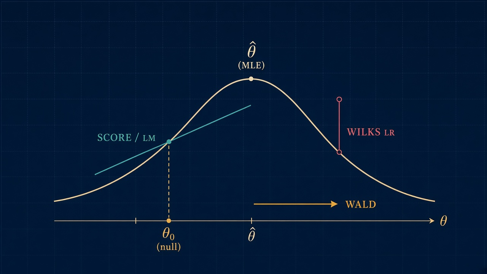

The previous [post](/2026-10-01-1) asked whether a sample comes from a fully specified law $F$
(or from a nonparametric alternative): Kolmogorov–Smirnov, Cramér–von Mises, Anderson–Darling
compare the empirical CDF to $F$ and never name a finite-dimensional parameter. Pearson's
[chi-squared GoF](/2021-06-17-1) is the same question after binning.

## Problem statement

Here the model is parametric. Both the null hypothesis $H_0$ and the alternative $H_1$ assume that the distribution law family $F_\theta$ applies to our data, but even then we are unsure about the exact parameters. Data $X_1,\dots,X_n$ are i.i.d. from a family $\{p(x\mid\theta):\theta\in\Theta\subset\mathbb{R}^p\}$, and we have a *restriction* on $\theta$. The null and alternative are nested subsets of that family:

$H_0:\ \theta\in\Theta_0 \qquad\text{vs}\qquad H_1:\ \theta\in\Theta\setminus\Theta_0$,

with $\Theta_0\subset\Theta$ of smaller dimension.

**Example**: We have a Gaussian $X_i\sim\mathcal{N}(\mu,\sigma^2)$ with $\theta=(\mu,\sigma^2)$ and space $\Theta=\mathbb{R}\times(0,\infty)$. $H_0$: the mean is zero $\mu_0 = 0$, while the variance $\sigma^2$ unknown and is a nuisance parameter. So, our $\Theta_0=\{0\}\times(0,\infty)$ is the half-line.

Two flavours, because they change the algebra later:

- *Simple* $H_0$: $\Theta_0=\{\theta_0\}$ is a point. The restricted model has no free parameters. E.g. variance known to be $\sigma^2_0$, while we're testing, if mean $\mu = \mu_0 = 0$ or not.
- *Composite* $H_0$: nuisance parameters remain (e.g. variance unknown when testing a mean).
  One maximizes the likelihood *on* $\Theta_0$, and the limiting $\chi^2$ loses those degrees of
  freedom.

The main tool all the tests rely upon is the log-likelihood $\ell(\theta)=\sum_i\log p(X_i\mid\theta)$. In the next two sections of this post we will first show that under standard regularity it is locally a quadratic bowl whose curvature is the Fisher information. Then we show how Wald, the
score / Lagrange-multiplier test, and Wilks' likelihood-ratio test are three ways to ask whether
$\theta_0$ sits too far from that bowl's maximum $\hat\theta$: horizontal gap, slope at the
restricted point, vertical drop. Asymptotically they are the same $\chi^2$ measurement; in finite
samples they differ by what they need to compute and how they behave under reparametrization and
on the boundary of $\Theta$. That is the rest of the post.

**The same log-likelihood, three measurements.**
Wald: distance $\hat\theta-\theta_0$. Score / LM: slope $\ell'(\theta_0)$.
Wilks: drop $\ell(\hat\theta)-\ell(\theta_0)$.

## Log-likelihood, Fisher information

Write $\ell(\theta)=\sum_{i=1}^n \log p(X_i\mid\theta)$ for the log-likelihood of an i.i.d. sample.
The *score* is its gradient and the *Hessian* is the second-derivative matrix,

$s(\theta)=\nabla_\theta\ell(\theta),\qquad H(\theta)=\nabla^2_\theta\ell(\theta)$.

The MLE $\hat\theta$ is a critical point: $s(\hat\theta)=0$ (interior maximum). Under $H_0:\theta=\theta_0$
the score at the *restricted* point $s(\theta_0)$ is a sum of i.i.d. mean-zero terms — that is the
random vector Wald, Score and Wilks will studentize.

Fisher information is the covariance of that score, equivalently the expected curvature of log-likelihood $\ell$:

$\mathcal{I}(\theta)=\mathbb{E}_\theta\bigl[s(\theta)s(\theta)^\top\bigr]
=-\mathbb{E}_\theta\bigl[H(\theta)\bigr]$.

The equality is the information identity: differentiate $\mathbb{E}_\theta s(\theta)=0$ under the
integral (regularity: support independent of $\theta$, differentiate under $\int$). For i.i.d. data
information adds: $\mathcal{I}_n(\theta)=n\,\mathcal{I}_1(\theta)$. One often writes $\mathcal{I}$
for the per-observation matrix and $n\mathcal{I}$ for the sample. *Observed* information $-H(\hat\theta)$
is the random Hessian; *expected* information $n\mathcal{I}(\hat\theta)$ plugs $\hat\theta$ into the
mean curvature. Wald can use either.

A second-order Taylor step around an interior $\hat\theta$ is the whole local picture of this post:

$\ell(\theta)=\ell(\hat\theta)+\tfrac12(\theta-\hat\theta)^\top H(\hat\theta)\,(\theta-\hat\theta)+o(\|\theta-\hat\theta\|^2)$.

Replace $-H(\hat\theta)$ by $n\mathcal{I}$ and the log-likelihood is a quadratic bowl of precision
$n\mathcal{I}$. That is why a Gaussian approximation for $\hat\theta$ is coming, and why “how far is
$\theta_0$ from $\hat\theta$?” has three equivalent readings on the cover: width, slope, height.

Two properties we will need. (i) Cramér–Rao, proved in the next section: an unbiased estimator
cannot beat $\mathcal{I}^{-1}/n$ in variance. (ii) Reparametrization $\phi=g(\theta)$ transforms $\mathcal{I}$ as a Riemannian metric,
$\mathcal{I}_\phi = (D g)^{-\top}\mathcal{I}_\theta (D g)^{-1}$. Distances
$(\hat\theta-\theta_0)^\top\mathcal{I}(\hat\theta-\theta_0)$ therefore *change* if you rewrite the
parameter — Wald is not invariant. The vertical drop $\ell(\hat\theta)-\ell(\theta_0)$ does not care
how you name $\theta$; that is Wilks.

None of this yet says $\hat\theta$ is normal or that a test is $\chi^2$. It only names the bowl.
Cramér–Rao next; then a CLT on the score and confidence intervals off the same quadratic.

## Cramér-Rao bound

Each of the three tests measures how far the data are from $H_0$ and *divides by a scale* so that
the squared result can be compared to a $\chi^2$ table. Wald divides the gap between the
maximum-likelihood estimate $\hat\theta$ and the null value $\theta_0$ by how much $\hat\theta$
typically jitters from sample to sample. Score does the same for the slope of the log-likelihood
$\ell$ at $\theta_0$. Wilks does it for the drop $\ell(\hat\theta)-\ell(\theta_0)$. In all three
cases that “typical jitter” is read off the Fisher information $\mathcal{I}$: we treat
$\mathrm{Var}(\hat\theta)$ as ${\mathcal{I}_n}^{-1}$.

If the true variance of $\hat\theta$ were *smaller* than ${\mathcal{I}_n}^{-1}$, we would divide
by too large a number, the test would look too calm, and we would reject $H_0$ too rarely. If the
true variance were *larger*, we would reject too often. So before trusting those $\chi^2$
thresholds we must know that ${\mathcal{I}_n}^{-1}$ is the right scale. Cramér–Rao says: for any
estimator $T$ with $\mathbb{E}[T]=\theta$, you cannot get a smaller variance than
${\mathcal{I}_n}^{-1}$. The next section shows that $\hat\theta$ actually *reaches* that limit
when $n$ is large. Then dividing by Fisher information is dividing by the real sampling variance
of $\hat\theta$ (and of the slope of $\ell$, whose variance is $\mathcal{I}_n$ itself). That is
why the three tests are not three random recipes: they all use the smallest scale an unbiased
estimator of $\theta$ is allowed to have.

#### Cramer-Rao bound

**Claim**: if $T=T(X_1,\dots,X_n)$ is an unbiased estimator for $\theta\in\mathbb{R}^p$ (i.e. $\mathbb{E}_\theta[T]=\theta$), and
one may differentiate the likelihood under the integral (support of $p$ does not depend on $\theta$,
$\mathcal{I}(\theta)$ finite and invertible), then

$$\mathrm{Var}_\theta(T) \succeq {\mathcal{I}_n(\theta)}^{-1} = \bigl(n\mathcal{I}_1(\theta)\bigr)^{-1}.$$

No unbiased estimator can be more concentrated than the inverse Fisher information.

**Proof for one dimension**.

Start with analysis of unbiasedness of estimator: $\int T(x)\,p(x\mid\theta)\,dx=\theta$.

Differentiate both sides with respect to $\theta$ (regularity
assumed). The right side becomes $1$. On the left, $T(x)$ does not depend on $\theta$, so the
derivative hits only the density:

$$1=\int T(x)\,\frac{\partial p(x\mid\theta)}{\partial\theta}\,dx.$$

Chain rule for the logarithm:
$\frac{\partial\log p}{\partial\theta} = \frac{1}{p}\frac{\partial p}{\partial\theta}$, hence
$\frac{\partial p}{\partial\theta} = \frac{\partial\log p}{\partial\theta}\,p$. Substitute that in:

$$1 = \int T(x)\,\frac{\partial\log p(x\mid\theta)}{\partial\theta}\,p(x\mid\theta)\,dx.$$

The integrand is $T$ times $\frac{\partial\log p}{\partial\theta}$, weighted by the density $p$, which is
the definition of an expectation:
$1=\mathbb{E}\bigl[T\cdot\frac{\partial\log p}{\partial\theta}\bigr]$. For a single observation
the log-likelihood is $\ell(\theta)=\log p(X\mid\theta)$, and the score is its derivative

$$s(\theta)=\frac{\partial\ell}{\partial\theta}=\frac{\partial\log p(X\mid\theta)}{\partial\theta}.$$

Therefore $1=\mathbb{E}[T\,s]$.

The score has mean zero:
$\int \frac{\partial p}{\partial\theta}\,dx=\frac{\partial}{\partial\theta}\int p\,dx=0$, so
$\mathbb{E}[s]=0$. Combined with $1=\mathbb{E}[T s]$ this gives $\mathbb{E}[(T-\theta)s]=1$:
$\theta$ is a non-random number (the true parameter), so it factors out of the expectation,

$$\mathbb{E}[(T-\theta)s]=\mathbb{E}[T s]-\theta\,\mathbb{E}[s]=1-\theta\cdot 0=1.$$

That inner product $\mathbb{E}[(T-\theta)s]$ is a covariance of $T-\theta$ and $s$ (both expectation are 0 because $\mathbb{E}[s]=0$ and $\mathbb{E}[T] = \theta$). 

Now, for any random variables $U,V$ the quadratic $\mathbb{E}[(U-\lambda V)^2]\ge 0$ for all $\lambda$ expands to
$(\mathbb{E}[UV])^2\le\mathbb{E}[U^2]\mathbb{E}[V^2]$.

Take $U=T-\theta$ and $V=s$:

$$1 = \bigl(\mathbb{E}[(T-\theta)s]\bigr)^2 \le \mathrm{Var}(T)\cdot\mathbb{E}[s^2] = \mathrm{Var}(T)\,\mathcal{I}(\theta),$$

hence $\mathrm{Var}(T)\ge 1/\mathcal{I}(\theta)$. For $n$ i.i.d. observations the score adds and
$\mathcal{I}_n=n\mathcal{I}_1$, so the bound is $1/(n\mathcal{I}_1)$.

**Proof for multiple dimensions**.

In $p$ dimensions the same covariance identity is a matrix. Differentiate $\mathbb{E}[T_j]=\theta_j$
in $\theta_k$: $\mathbb{E}[T_j s_k]=\delta_{jk}$, and $\mathbb{E}[s]=0$ still, so
$\mathbb{E}[(T-\theta)s^\top]=\mathrm{I}_p$.

Let $\mathcal{I}_n=\mathbb{E}[ss^\top]$ and consider the residual $T-\theta-\mathcal{I}_n^{-1}s$. Its covariance is positive semidefinite:

$$
\begin{aligned}
0 &\preceq \mathbb{E}\bigl[(T-\theta-\mathcal{I}_n^{-1}s)(T-\theta-\mathcal{I}_n^{-1}s)^\top\bigr] \\
&= \mathrm{Var}(T) - \mathbb{E}[(T-\theta)s^\top]\mathcal{I}_n^{-1}
- \mathcal{I}_n^{-1}\mathbb{E}[s(T-\theta)^\top] + \mathcal{I}_n^{-1} \\
&= \mathrm{Var}(T) - \mathcal{I}_n^{-1} - \mathcal{I}_n^{-1} + \mathcal{I}_n^{-1} \\
&= \mathrm{Var}(T) - \mathcal{I}_n^{-1}.
\end{aligned}
$$

Therefore $\mathrm{Var}(T)\succeq \mathcal{I}_n^{-1}$. Equality holds iff $T-\theta$ is a linear
function of the score, $T=\theta+\mathcal{I}_n^{-1}s$ a.s. — an exponential family with $T$ as
natural sufficient statistic. The MLE is typically biased in finite samples, so it does *not*
literally attain Cramér–Rao for finite $n$. The next section shows its *asymptotic* covariance
is exactly $\mathcal{I}_n^{-1}$: efficient in the limit, not a finite-sample Gauss–Markov miracle.

## MLE normality under null and confidence intervals

The score at the *true* value is a sum of i.i.d. centred vectors with covariance $\mathcal{I}(\theta)$.
CLT plus the information identity therefore give, at the truth $\theta^\ast$,

$\dfrac{1}{\sqrt{n}}s(\theta^\ast)\ \to\ \mathcal{N}\bigl(0,\ \mathcal{I}(\theta^\ast)\bigr)$.

(Under a simple $H_0$ one has $\theta^\ast=\theta_0$; that is the only place the null enters. Confidence
intervals below do not assume $H_0$ — they treat $\theta^\ast$ as unknown.) The average Hessian
concentrates by the LLN: $-n^{-1}H(\theta^\ast)\to\mathcal{I}(\theta^\ast)$. Expand the first-order
condition $s(\hat\theta)=0$ about $\theta^\ast$:

$0=s(\theta^\ast)+H(\tilde\theta)(\hat\theta-\theta^\ast)$,

so $\sqrt{n}(\hat\theta-\theta^\ast)=\bigl(-n^{-1}H(\tilde\theta)\bigr)^{-1} n^{-1/2}s(\theta^\ast)$.
Write $Z_n=n^{-1/2}s(\theta^\ast)\to\mathcal{N}(0,\mathcal{I})$ and
$A_n=-n^{-1}H(\tilde\theta)$. The LLN plus $\tilde\theta\to\theta^\ast$ give $A_n\to\mathcal{I}$
in probability, and inversion is continuous on invertible matrices, so $A_n^{-1}\to\mathcal{I}^{-1}$
in probability. Split

$A_n^{-1}Z_n = \mathcal{I}^{-1}Z_n + (A_n^{-1}-\mathcal{I}^{-1})Z_n$.

The first term converges in distribution to $\mathcal{N}(0,\mathcal{I}^{-1})$. The second is a
product of something $\to 0$ in probability and a tight sequence $Z_n$ (it converges in
distribution, hence does not escape to infinity), so that product vanishes in probability. A
limit in distribution plus a $o_p(1)$ is still that limit. Therefore

$\sqrt{n}\bigl(\hat\theta-\theta^\ast\bigr)\ \to\ \mathcal{N}\bigl(0,\ \mathcal{I}(\theta^\ast)^{-1}\bigr)$.

The asymptotic covariance is exactly the Cramér–Rao matrix of the previous section: the MLE is
efficient in the limit. In [multivariate normal](/2021-07-01-1) language, a $p$-vector $Z\sim\mathcal{N}(0,\Sigma)$ has
$Z^\top\Sigma^{-1}Z\sim\chi^2_p$ ([chi-square as $\|Z\|^2$](/2021-06-09-1); [Cochran](/2021-06-30-1)
for the rank/df). Hence the Wald quadratic form is already a [chi-squared](/2021-06-09-1) random
variable in the limit:

$n\bigl(\hat\theta-\theta^\ast\bigr)^\top\mathcal{I}(\theta^\ast)\bigl(\hat\theta-\theta^\ast\bigr)\ \to\ \chi^2_p$.

Plug in a consistent $\hat{\mathcal{I}}$ — expected $n\mathcal{I}(\hat\theta)$ or observed $-H(\hat\theta)$ —
and invert: an asymptotic $(1-\alpha)$ confidence *ellipsoid* for $\theta^\ast$ is

$\bigl\{\theta:\ n(\hat\theta-\theta)^\top\hat{\mathcal{I}}(\hat\theta-\theta)\ \le\ \chi^2_{p,1-\alpha}\bigr\}$.

In one dimension this is the familiar $\hat\theta\pm z_{1-\alpha/2}/\sqrt{n\hat{\mathcal{I}}}$. Those
are Wald intervals: the same horizontal gap as on the cover, now read as “which $\theta_0$ are
*not* too far?” Testing $H_0:\theta=\theta_0$ is asking whether $\theta_0$ lies outside that
ellipsoid — the next section.

Two caveats the CLT does not hide. The expansion needs $\theta^\ast$ in the *interior* of $\Theta$
(a variance of $0$ on the boundary is a different, chi-bar-squared, story). And because $\mathcal{I}$
transforms as a metric, the ellipsoid and the $z$-interval *move* if you reparametrize; the numerical
MLE changes, the event “$\theta_0$ is inside the interval” need not. That is already the seed of
Wald vs Wilks.

## Wald test

Wald is the horizontal gap on the cover, studentized by Fisher information. Fit the *unrestricted*
model, get $\hat\theta$, and ask whether $\theta_0$ is too many information-standard-deviations away.
Under a simple $H_0:\theta=\theta_0$ the previous section already produced the statistic and its limit:

$W_n = n\bigl(\hat\theta-\theta_0\bigr)^\top \hat{\mathcal{I}}\bigl(\hat\theta-\theta_0\bigr)
\ \xrightarrow{H_0}\ \chi^2_p$.

Reject when $W_n>\chi^2_{p,1-\alpha}$. Equivalently: reject when $\theta_0$ lies outside the Wald
ellipsoid. In one dimension $W_n=n\hat{\mathcal{I}}(\hat\theta-\theta_0)^2$ is the square of the
usual $z$-statistic; for a Gaussian mean with unknown variance the exact small-sample cousin is
Student's [$t$-test](/2021-06-20-1). The $\chi^2$ limit is the same beast as in the
[Gamma / chi-square](/2021-06-09-1) post: a squared standard normal, or a sum of $p$ of them
after a multivariate [whitening](/2021-07-01-1).

For a composite restriction $R(\theta)=0$ with $R:\mathbb{R}^p\to\mathbb{R}^q$ (full rank $q<p$),
delta method replaces $\hat\theta-\theta_0$ by the $q$-vector $R(\hat\theta)$. The Jacobian
$J=DR(\hat\theta)$ maps the $p\times p$ variance $\mathcal{I}^{-1}/n$ to a $q\times q$ covariance
$J\mathcal{I}^{-1}J^\top/n$, and

$W_n = n\, R(\hat\theta)^\top \bigl(J\,\hat{\mathcal{I}}^{-1} J^\top\bigr)^{-1} R(\hat\theta)
\ \xrightarrow{H_0}\ \chi^2_q$.

The degrees of freedom are the number of restrictions, $q=\dim\Theta-\dim\Theta_0$ — [Cochran's
theorem](/2021-06-30-1) in the Gaussian quadratic-form setting. A nested regression “these $q$
coefficients are zero” is this statistic with $R(\theta)=\theta_{\mathcal{S}}$.

$\hat{\mathcal{I}}$ may be expected information $n\mathcal{I}(\hat\theta)$ or observed $-H(\hat\theta)$;
both are consistent under the interior regularity already used. Pearson's
[chi-squared GoF](/2021-06-17-1) is a discrete cousin: cell counts vs expected, quadratic form with
the multinomial covariance, $p-1$ df.

Wald is the simplest of the three because it is a function of $\hat\theta$ alone — one unrestricted
MLE, then a matrix product. That is also its cost. You must be able to *fit the alternative*. The
test is not invariant to reparametrization ($\phi=e^\theta$ vs $\theta$ can flip the $p$-value).
Near the boundary of $\Theta$ the normal approximation for $\hat\theta$ is poor (binomial $p$ near
$0$ or $1$; a variance estimated at $0$). Score and Wilks exist precisely because one sometimes
cannot, or should not, lean on that unrestricted $\hat\theta$.

## Score/Lagrange multipliers test

Score looks at the *slope* of $\ell$ at the restricted point, not at how far $\hat\theta$ travelled.
If $H_0$ is true, $\theta_0$ is already the top of the bowl and $s(\theta_0)$ should be a mean-zero
wiggle of size $\sqrt{n\mathcal{I}}$. A large score means the likelihood still wants to leave
$\Theta_0$. Under a simple $H_0:\theta=\theta_0$ one never computes $\hat\theta$:

$S_n = s(\theta_0)^\top \bigl(n\mathcal{I}(\theta_0)\bigr)^{-1} s(\theta_0)
\ \xrightarrow{H_0}\ \chi^2_p$.

(The same $\chi^2$ as Wald: $n^{-1/2}s(\theta_0)\to\mathcal{N}(0,\mathcal{I})$, so the quadratic form
is [chi-square](/2021-06-09-1) with $p$ df.) Reject when $S_n>\chi^2_{p,1-\alpha}$.

For a composite $R(\theta)=0$, maximize $\ell$ *on* $\Theta_0$ to get a restricted MLE $\tilde\theta$,
and evaluate the score there. That is [Lagrange multipliers](/2022-05-10-1) applied to
$\max_\theta\ell(\theta)$ subject to $R(\theta)=0$: the Lagrangian $\ell+\lambda^\top R$ has
stationarity $s(\tilde\theta)+J^\top\hat\lambda=0$, so the score at $\tilde\theta$ is exactly
$-J^\top\hat\lambda$ — it is normal to the constraint, as $\nabla f=\lambda\nabla g$ was in that
post. The test that $\hat\lambda=0$ (the restriction is not fighting the likelihood) is

$S_n = s(\tilde\theta)^\top \bigl(n\hat{\mathcal{I}}(\tilde\theta)\bigr)^{-1} s(\tilde\theta)
\ \xrightarrow{H_0}\ \chi^2_q$,

again $q=\mathrm{rank}(R)$. Equivalently one writes a quadratic form in $\hat\lambda$; Rao's score
test and the Aitchison–Silvey / Engle LM test are this object.

Why bother, if Wald is the same $\chi^2$? Because $S_n$ uses only the **restricted** fit. When the
alternative is a nuisance to optimize — extra ARCH lags, a random effect, a mixture component —
you evaluate the gradient of that extra structure at the null and stop. Under $H_0$ and local
alternatives the Taylor identity $\hat\theta-\theta_0\approx n^{-1}\mathcal{I}^{-1}s(\theta_0)$
makes $W_n-S_n=o_p(1)$; locally the score test is most powerful against infinitesimal departures
(the Neyman $C(\alpha)$ picture). Pearson's [chi-squared GoF](/2021-06-17-1) is a score test for
the multinomial: residual cell counts are the score, the covariance is $n\mathcal{I}$.

The price: $\mathcal{I}$ is evaluated under $H_0$, so a badly misspecified null curvature still
enters the studentization. And like Wald, a naive $S_n$ is not invariant to every reparametrization
of the *alternative*. Wilks will drop the metric and keep only $\ell(\hat\theta)-\ell(\tilde\theta)$.

## Wilks likelihood ratio test

Wilks is the *vertical* drop on the cover: how much log-likelihood you lose by imposing $H_0$.
Fit both models — unrestricted MLE $\hat\theta$ and restricted $\tilde\theta\in\Theta_0$ — and form

$\Lambda_n = 2\bigl(\ell(\hat\theta)-\ell(\tilde\theta)\bigr)
\ \xrightarrow{H_0}\ \chi^2_q,\qquad q=\dim\Theta-\dim\Theta_0$.

Reject when $\Lambda_n>\chi^2_{q,1-\alpha}$. (For a simple null, $\tilde\theta=\theta_0$ and $q=p$.)
The factor $2$ is Wilks' normalisation so that the drop matches the $\chi^2$ scale of $W_n$ and
$S_n$: Taylor-expand $\ell$ about $\hat\theta$, use $s(\hat\theta)=0$ and $-H\approx n\mathcal{I}$,

$2\bigl(\ell(\hat\theta)-\ell(\theta_0)\bigr)
= n(\hat\theta-\theta_0)^\top\mathcal{I}(\hat\theta-\theta_0)+o_p(1)$,

hence $\Lambda_n=W_n+o_p(1)=S_n+o_p(1)$ under $H_0$ and under local alternatives. The three tests
are the same measurement of the quadratic bowl, read off width, slope, or height.

The decision-theoretic ancestor is the [Neyman–Pearson lemma](https://en.wikipedia.org/wiki/Neyman%E2%80%93Pearson_lemma): for a *simple* $H_0$ against a
*simple* $H_1$, the most powerful test of a given size is a likelihood-ratio threshold
$p(x\mid\theta_1)/p(x\mid\theta_0)>c$. Once $H_0$ or $H_1$ is composite, no UMP test exists in
general; one replaces each density by its supremum on that set — the *generalised* LRT
$\sup_{\Theta_0}L/\sup_{\Theta}L=e^{-\Lambda_n/2}$. Wilks' theorem is the $\chi^2$ approximation
to that GLRT for nested regular models, interior true parameter, $q$ free restrictions.
[Student's $t$](/2021-06-20-1) and [Snedecor's $F$](/2021-06-19-1) are exact small-sample LRTs in
the Gaussian linear model; [Wilks' lambda](/2021-07-13-1) is the multivariate cousin.

Because $\Lambda_n$ is a difference of scalar maxima, it does not see a reparametrization: $\ell$
is attached to the distribution, not to the coordinate chart on $\Theta$. That is the invariance
Wald and a naive score statistic lack. The cost is two optimisations. The regularity cost is
sharper than Wald's: if $\theta^\ast$ sits on the *boundary* of $\Theta$ (variance component equal
to zero), the $\chi^2_q$ limit fails and one gets a chi-bar-square mixture of $\chi^2_0,\ldots,\chi^2_q$.
Do not quote Wilks there.

Use $\Lambda_n$ when both fits are cheap and you want a parametrization-invariant, usually
well-behaved finite-sample test. Use Score when the alternative is painful to maximise. Use Wald
when you already have $\hat\theta$ and want a confidence ellipsoid in the same stroke.

## Comparison of tests

Under the interior regularity used throughout, the three statistics are the same object plus
$o_p(1)$: on the quadratic bowl, width, slope and height coincide. For local (contiguous)
alternatives they share the same non-central $\chi^2_q$ limit, so none is asymptotically more
powerful than the others. Finite samples, computation, and geometry of $\Theta$ are where they
split.

| | Wald | Score / LM | Wilks LRT |
|---|---|---|---|
| Reads | $\hat\theta-\theta_0$ | $s(\tilde\theta)$ | $\ell(\hat\theta)-\ell(\tilde\theta)$ |
| Needs | unrestricted MLE | restricted MLE | both MLEs |
| Limit under $H_0$ | $\chi^2_q$ | $\chi^2_q$ | $\chi^2_q$ |
| Invariant to reparametrization | no | generally no | yes |
| Confidence set | ellipsoid, free | not directly | invert $\Lambda_n$, awkward |
| Alternative hard to fit | painful | cheap | painful |
| Boundary of $\Theta$ | $\hat\theta$ unreliable | often OK (null fit) | chi-bar-square, not $\chi^2_q$ |

Wald is the default when the unrestricted model is already on the table (a fitted GLM, an MLE
you trust) and you want tests and intervals from the same quadratic form. Do not use it near
$0$–$1$ probabilities, on the edge of the parameter space, or if a nonlinear reparametrization
is a first-class choice — the $p$-value can flip.

Score / LM is the default when $H_1$ is a nuisance: extra lags, a random effect, a constraint
you do not want to optimize. You only differentiate the alternative at the null. It is locally
most powerful against infinitesimal departures; against a distant alternative the linear
approximation of $\ell$ at $\theta_0$ can be a poor summary of the whole drop, and LRT usually
wins in simulations. Evaluating $\mathcal{I}$ under a wrong null curvature is the main
studentization risk.

Wilks is the default when both fits are cheap and you care about invariance (report the same
decision in $\theta$ and in $\log\theta$). It is *not* Neyman–Pearson UMP once the hypothesis is
composite; it is the GLRT, whose $\chi^2$ approximation is often the best-behaved of the three
in moderate $n$, and exact in the Gaussian linear model ($t$, $F$). Skip the textbook $\chi^2_q$
when the true point is on the boundary.

A practical order: try to state the restriction so a Score test is available; if you already
have $\hat\theta$, quote Wald and a Wald interval; if the two maximizations are easy, prefer
$\Lambda_n$ as the reported test. When all three agree, you are on the quadratic bowl and the
cover picture was the whole story. When they disagree, believe Wilks unless you are on the
boundary — then believe none of the $\chi^2$ tables and change the asymptotics.

## References:
* https://en.wikipedia.org/wiki/Wald_test
* https://en.wikipedia.org/wiki/Likelihood-ratio_test
* https://en.wikipedia.org/wiki/Score_test
* https://en.wikipedia.org/wiki/Neyman%E2%80%93Pearson_lemma